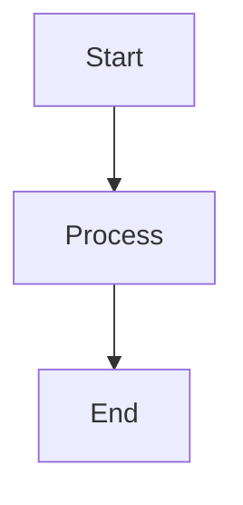

# CLAUDE.md

This file provides guidance to Claude Code (claude.ai/code) when working with code in this repository.

## Project Overview

Beli5 is a Vietnamese-language programming tutorial website built with Docusaurus. It uses the "ELI5" (Explain Like I'm 5) approach to teach programming concepts to beginners, with separate tutorial tracks for Python, Java, C++, and Rust.

**Key URLs:**
- Production: https://behitek.com/beli5/
- Local dev: http://localhost:3000

## Development Commands

```bash
# Start development server
npm start

# Build for production (includes thumbnail generation)
npm run build

# Build without thumbnail generation
npm run build-only

# Generate blog thumbnails only
npm run generate-thumbnails

# Serve production build locally
npm run serve

# Clear Docusaurus cache
npm run clear

# Type checking
npm run typecheck
```

## Multi-Instance Architecture

**Critical architectural pattern**: This project uses **multiple Docusaurus doc instances**, not a single docs folder. This is configured in `docusaurus.config.ts` via the `plugins` array.

### Documentation Instances

Each programming language has its own independent documentation instance:

| Language | Directory | Route | Sidebar File |
|----------|-----------|-------|--------------|
| Python | `docs-python/` | `/python` | `sidebars-python.js` |
| Java | `docs-java/` | `/java` | `sidebars-java.js` |
| C++ | `docs-cpp/` | `/cpp` | `sidebars-cpp.js` |
| Rust | `docs-rust/` | `/rust` | `sidebars-rust.js` |

### Blog Instances

Two separate blog instances:

1. **Main Blog** (`blog/`) - Tutorial guides and tips at `/blog`
2. **News Blog** (`news/`) - Updates and announcements at `/news`

### Why This Matters

- **Adding new docs**: Must go in the correct `docs-{language}/` directory
- **Sidebars**: Each language has its own sidebar configuration file
- **Routes**: Each language is completely independent with its own navigation
- **Don't use**: The `docs/` folder (this is legacy/example content)

## Content Organization

### Document Structure Pattern

Each language follows the same hierarchical structure:

```
docs-{language}/
├── intro.md                    # Landing page for the language
├── basics/                     # 🟢 Beginner level (Cơ Bản Siêu Dễ)
├── intermediate/               # 🟡 Intermediate (Trung Bình Thú Vị)
├── advanced/                   # 🔴 Advanced (Nâng Cao Pro)
├── projects/                   # 🎮 Hands-on projects (Dự Án Thực Hành)
├── practice/                   # 💪 Exercises (Bài Tập Luyện Tập)
├── reference/                  # 📚 Reference docs (Tài Liệu Tham Khảo)
└── glossary/                   # 📖 Terminology (Từ Điển Thuật Ngữ)
```

### Sidebar Configuration

Sidebars use explicit category definitions with Vietnamese labels and emoji:

```javascript
{
  type: 'category',
  label: '🟢 Cơ Bản Siêu Dễ',  // Beginner level with emoji
  collapsed: true,
  items: ['basics/doc1', 'basics/doc2', ...]
}
```

## Blog Thumbnail Generation

**Automated thumbnail system** for blog posts (`scripts/generate-thumbnails.js`):

### How It Works

1. Reads all `.md`/`.mdx` files from `blog/` directory
2. Parses frontmatter using `gray-matter` to extract title, tags, date
3. Detects theme from tags (python, java, cpp, rust, algorithms, math, etc.)
4. Generates 1200x630 JPG thumbnail using Puppeteer with appropriate color scheme
5. Saves to `static/img/blog/generated/`
6. Updates blog post frontmatter with `image` field

### Theme Detection

Tags determine the visual theme:
- Language tags (python, java, cpp, rust) → language-specific colors/icons
- Topic tags (algorithms, math, basics) → topic-specific themes
- Each theme has: primary color, gradient, and emoji icon

### When Thumbnails Regenerate

- New blog posts without `image` field
- Blog posts with `image` not pointing to `/img/blog/generated/`
- Manually deleted thumbnails

## Mathematical Content Support

**KaTeX is enabled globally** via remarkMath and rehypeKatex plugins:

```typescript
remarkPlugins: [remarkMath],
rehypePlugins: [rehypeKatex],
```

This applies to all doc instances and blogs. Use standard LaTeX syntax:

```markdown
Inline: $E = mc^2$
Block: $$\sum_{i=1}^{n} i = \frac{n(n+1)}{2}$$
```

## Diagram Support

**Mermaid diagrams** are enabled via `@docusaurus/theme-mermaid`:

```markdown

```

Themes configured for both light/dark modes in `docusaurus.config.ts`.

## React Components

Custom components in `src/components/`:

- **FloatingFeedbackButton**: Persistent feedback button across site
- **HomepageFeatures**: Feature cards on homepage

These are TypeScript React components that can be imported into MDX files.

## Custom Pages

Located in `src/pages/`:

- `index.tsx` - Homepage with language selection
- `feedback.tsx` - Feedback form page

Routes are automatically generated from filename (e.g., `feedback.tsx` → `/feedback`).

## Styling

Custom CSS in `src/css/custom.css` with CSS variables for theming.

**Dark mode is default**:
```typescript
colorMode: {
  defaultMode: 'dark',
  respectPrefersColorScheme: true,
}
```

## Content Guidelines (ELI5 Approach)

When writing or modifying tutorial content:

1. **Language**: All content in Vietnamese
2. **Simplicity**: Explain complex concepts using simple analogies familiar to Vietnamese learners
3. **Tone**: Encouraging, friendly, never condescending
4. **Structure**: Progressive difficulty (🟢 → 🟡 → 🔴)
5. **Examples**: Use culturally relevant examples for Vietnamese audience

### Language-Specific Analogies

Maintain these established metaphors:
- **Python**: 🐍 Smart snake (con rắn thông minh)
- **Java**: ☕ LEGO blocks (khối LEGO)
- **C++**: ⚡ Professional tools (dụng cụ chuyên nghiệp)
- **Rust**: 🦀 Safety equipment (đồ bảo hộ an toàn)

## Technical Configuration

### Node Version
Requires Node.js 18.0 or higher (specified in `package.json` engines field).

### Facebook Integration
Facebook App ID configured for comments plugin:
```typescript
customFields: {
  facebookAppId: '4183372098576273',
}
```

### GitHub Pages Deployment
```bash
npm run deploy  # Uses docusaurus deploy command
```

Configured for:
- Organization: `behitek`
- Repository: `beli5`
- Base URL: `/beli5/`

### Docusaurus v4 Future Flag
Enabled for forward compatibility:
```typescript
future: {
  v4: true,
}
```

## Common Tasks

### Adding a New Tutorial Article

1. Choose the language directory: `docs-python/`, `docs-java/`, `docs-cpp/`, or `docs-rust/`
2. Choose the difficulty level: `basics/`, `intermediate/`, or `advanced/`
3. Create `.md` file with frontmatter
4. Add to appropriate sidebar file (`sidebars-{language}.js`)
5. Use Vietnamese language and ELI5 approach

### Adding a Blog Post

1. Create `.md` file in `blog/` with date prefix: `YYYY-MM-DD-slug.md`
2. Add frontmatter with `title`, `tags`, `date`
3. Run `npm run generate-thumbnails` to create thumbnail
4. Thumbnail path will be automatically added to frontmatter

### Modifying Navigation

- **Language nav**: Edit `docusaurus.config.ts` → `themeConfig.navbar.items`
- **Sidebar for a language**: Edit `sidebars-{language}.js`
- **Footer**: Edit `docusaurus.config.ts` → `themeConfig.footer`

### Updating Announcement Bar

Edit `docusaurus.config.ts` → `themeConfig.announcementBar`:
```typescript
announcementBar: {
  id: 'unique-id',  // Change ID to show to users who dismissed previous one
  content: 'Your message here',
  backgroundColor: '#ffd700',
  textColor: '#091E42',
  isCloseable: true,
}
```

## Important Notes

- **Never edit `docs/` folder** - it contains example content and is not used
- **Thumbnails auto-generate on build** - included in `npm run build`
- **Each language is independent** - changes to one don't affect others
- **Vietnamese content only** - this is not a multilingual site, it's Vietnamese-focused
- **ELI5 tone is mandatory** - all tutorials must maintain the friendly, beginner-focused approach
