# 🎨 Theme Compatibility Guidelines

## 📖 Overview

This document outlines the guidelines for ensuring all content, especially Mermaid diagrams and visual elements, are easily readable and accessible in both dark and light themes across the ELI5 Programming Blog.

---

## 🌓 Theme Requirements

### ✅ Must Support Both Themes
All content must be clearly readable and visually appealing in:
- **Light Theme** (default): High contrast, comfortable for daytime reading
- **Dark Theme**: Easy on the eyes, suitable for low-light environments
- **Auto Theme**: Respects user's system preference

### 🎯 Accessibility Standards
- **WCAG 2.1 AA compliance** for color contrast ratios
- **High contrast mode** support for users with visual impairments
- **Responsive design** that works on all device sizes
- **Font readability** with appropriate sizing and spacing

---

## 🔧 Technical Implementation

### 🖼️ Mermaid Diagram Configuration

Our Mermaid diagrams automatically adapt to the current theme:

```typescript
// docusaurus.config.ts
mermaid: {
  theme: {
    light: 'neutral', // Better contrast in light mode
    dark: 'dark',     // Optimized for dark mode
  },
  options: {
    fontFamily: 'ui-sans-serif, system-ui, sans-serif',
    fontSize: 16,
    theme: 'base',
    themeVariables: {
      // High contrast colors for accessibility
      primaryColor: '#4f46e5',
      primaryTextColor: '#1f2937',
      textColor: '#111827',
      // ... more theme variables
    },
  },
}
```

### 🎨 CSS Theme Variables

#### Light Theme Colors:
```css
:root {
  --ifm-color-primary: #4f46e5;
  --ifm-color-content: #1f2937;
  --ifm-background-color: #ffffff;
  /* High contrast ratios for readability */
}
```

#### Dark Theme Colors:
```css
[data-theme='dark'] {
  --ifm-color-primary: #818cf8;
  --ifm-color-content: #e5e7eb;
  --ifm-background-color: #111827;
  /* Warm, comfortable colors for night reading */
}
```

---

## 📝 Content Creation Guidelines

### 🖋️ Text Content
- **Use semantic HTML** for proper contrast inheritance
- **Avoid hardcoded colors** in text - use CSS variables
- **Test readability** in both themes before publishing
- **Use proper heading hierarchy** for screen readers

### 📊 Mermaid Diagrams
When creating Mermaid diagrams, follow these best practices:

#### ✅ Good Example:

```mermaid
graph TD;
    A[Bắt Đầu Học] --> B{Chọn Ngôn Ngữ};
    B --> C[🐍 Python];
    B --> D[☕ Java];
    C --> E[Kiến Thức Cơ Bản];
    D --> E;
    E --> F[Dự Án Thực Tế];
```


#### 🎯 Why This Works:
- **Simple, clear labels** in Vietnamese
- **Logical flow** that's easy to follow
- **Emoji icons** for visual appeal and clarity
- **Automatic theme adaptation** through our CSS

#### ❌ Avoid:
- Overly complex diagrams with too many nodes
- Text that's too small to read on mobile
- Colors that don't adapt to theme changes
- Diagrams wider than mobile screen width

### 🎨 Visual Elements

#### Icons and Emojis:
- **Use emojis consistently** across similar content types
- **Ensure meaning is clear** without relying only on color
- **Test visibility** in both light and dark themes

#### Code Blocks:
- **Syntax highlighting** automatically adapts to theme
- **Line numbers** for better reference
- **Copy button** functionality maintained in both themes

---

## 🧪 Testing Checklist

Before publishing content, verify:

### 🌅 Light Theme Testing:
- [ ] All text is clearly readable (high contrast)
- [ ] Mermaid diagrams render with appropriate colors
- [ ] Code blocks have proper syntax highlighting
- [ ] Interactive elements are visible and functional
- [ ] Mobile responsive design works correctly

### 🌙 Dark Theme Testing:
- [ ] Text doesn't strain the eyes (appropriate brightness)
- [ ] Mermaid diagrams adapt to dark background
- [ ] Code syntax highlighting uses dark theme colors
- [ ] All interactive elements remain functional
- [ ] No "white flash" when switching themes

### ♿ Accessibility Testing:
- [ ] High contrast mode works properly
- [ ] Screen reader compatibility maintained
- [ ] Keyboard navigation functions correctly
- [ ] Focus indicators are visible in both themes

---

## 📱 Responsive Design

### 📏 Breakpoints:
- **Mobile**: < 768px
- **Tablet**: 768px - 1024px
- **Desktop**: > 1024px

### 📐 Mermaid Responsive Rules:
```css
@media (max-width: 768px) {
  .mermaid {
    font-size: 14px;
    margin: 1.5rem auto;
  }
  
  .mermaid text {
    font-size: 12px !important;
  }
}
```

---

## 🚀 Performance Considerations

### ⚡ Theme Switching:
- **Smooth transitions** between themes (0.3s)
- **No layout shift** when switching
- **Cached theme preference** in localStorage
- **System preference detection** on first visit

### 🖼️ Mermaid Optimization:
- **SVG-based rendering** for crisp display at any size
- **Automatic lazy loading** for better page performance
- **Fallback text** for accessibility if diagrams fail to load

---

## 🛠️ Development Workflow

### 🔄 Theme Development Process:
1. **Design in light theme first** (default)
2. **Test in dark theme** immediately after
3. **Verify on mobile devices** in both themes
4. **Check accessibility compliance** with tools
5. **Get feedback** from users in different environments

### 🧪 Testing Tools:
- **Browser DevTools** for theme simulation
- **Lighthouse** for accessibility auditing
- **Color contrast analyzers** for WCAG compliance
- **Mobile device testing** for real-world validation

---

## 📚 Vietnamese ELI5 Content Guidelines

### 🇻🇳 Language-Specific Considerations:
- **Vietnamese text rendering** works correctly in both themes
- **Diacritical marks** (âăêôơưđ) display properly
- **Font fallbacks** include Vietnamese-compatible fonts
- **Cultural analogies** remain clear in visual diagrams

### 🎯 ELI5 Visual Design:
- **Kid-friendly colors** that work in both themes
- **Simple, clear diagrams** that don't overwhelm
- **Consistent emoji usage** for emotional comfort
- **Encouraging visual elements** that maintain positivity

---

## 🔍 Common Issues & Solutions

### ❓ Problem: Mermaid diagrams too dark in dark theme
**Solution**: Use our CSS overrides that automatically adjust contrast

### ❓ Problem: Text hard to read when switching themes
**Solution**: Use CSS variables instead of hardcoded colors

### ❓ Problem: Diagrams too wide on mobile
**Solution**: Use responsive CSS and test on actual devices

### ❓ Problem: High contrast mode breaks layout
**Solution**: Test with `@media (prefers-contrast: high)` queries

---

## 🎉 Best Practices Summary

### ✅ Do:
- Use CSS variables for all colors
- Test both themes during development
- Ensure WCAG AA compliance
- Keep diagrams simple and clear
- Use semantic HTML structure
- Provide alt text for visual elements

### ❌ Don't:
- Hardcode colors in content
- Create overly complex diagrams
- Ignore mobile responsiveness
- Skip accessibility testing
- Rely only on color to convey meaning
- Use tiny fonts that don't scale

---

## 📞 Support & Feedback

If you encounter theme-related issues:

1. **Check this guide** for common solutions
2. **Test in both themes** to isolate the problem
3. **Report issues** with specific examples
4. **Include screenshots** from both light and dark themes
5. **Mention device/browser** for context

---

**Last Updated**: September 2025  
**Version**: 1.0  
**Status**: Active Guidelines

*These guidelines ensure our ELI5 programming content is accessible, beautiful, and educational for all Vietnamese learners, regardless of their preferred theme or accessibility needs.* 🌟
