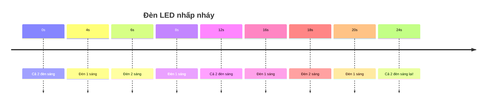
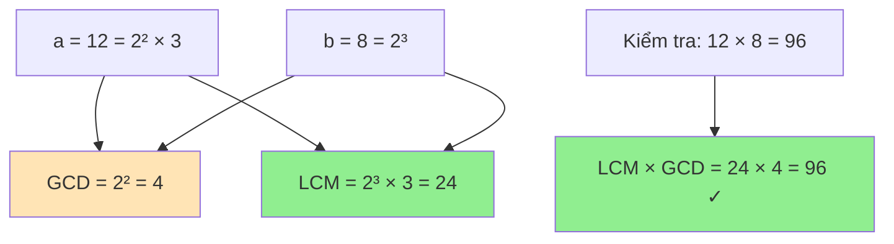

# Tính bội chung nhỏ nhất (LCM) và ứng dụng

Bạn có bao giờ gặp tình huống như thế này không: Hai chiếc đèn LED nhấp nháy, một chiếc 4 giây/lần, một chiếc 6 giây/lần. Sau bao lâu chúng sẽ nhấp nháy cùng lúc lần tiếp theo? Đó chính là bài toán tìm **Bội chung nhỏ nhất** (LCM)! Hôm nay chúng ta sẽ cùng khám phá LCM từ cơ bản đến những ứng dụng thú vị! 💡✨

<!-- truncate -->

## 🤔 LCM là gì?

:::info Định nghĩa
**Bội chung nhỏ nhất** (Least Common Multiple - LCM) của hai số nguyên dương a và b là số nguyên dương nhỏ nhất có thể chia hết cho cả a và b.

**Ký hiệu:** lcm(a, b) hoặc [a, b]
:::

**Ví dụ trực quan:**
- lcm(4, 6) = 12 (12 chia hết cho cả 4 và 6, và là số nhỏ nhất như vậy)
- lcm(3, 5) = 15 (vì 3 và 5 nguyên tố cùng nhau)
- lcm(8, 12) = 24

Quay lại câu chuyện đèn LED:
- Đèn 1 nhấp nháy: 0s, 4s, 8s, 12s, 16s, 20s, **24s**...
- Đèn 2 nhấp nháy: 0s, 6s, 12s, 18s, **24s**...
- Chúng nhấp nháy cùng lúc sau **24 giây** = lcm(4, 6)!



## 🔗 Mối quan hệ giữa LCM và GCD

**Công thức vàng:** `lcm(a, b) × gcd(a, b) = a × b`

Từ đó suy ra: `lcm(a, b) = (a × b) / gcd(a, b)`

Tại sao công thức này đúng? Hãy tưởng tượng:
- GCD là "phần chung" của a và b
- LCM là "kết hợp" của a và b, loại bỏ phần chung để không đếm 2 lần



## 🐌 Cách 1: Phương pháp Brute Force

Tìm bội chung nhỏ nhất bằng cách liệt kê các bội số.

**Python:**
```python
def lcm_brute_force(a, b):
    """
    Tìm LCM bằng phương pháp brute force
    
    Args:
        a, b (int): Hai số cần tìm LCM
        
    Returns:
        int: LCM của a và b
    """
    print(f"🔍 Tìm LCM({a}, {b}) bằng brute force:")
    
    # Tìm max để bắt đầu
    max_val = max(a, b)
    multiples_a = []
    multiples_b = []
    
    # Tạo danh sách bội của a và b
    for i in range(1, 11):  # Chỉ hiển thị 10 bội đầu tiên
        multiples_a.append(a * i)
        multiples_b.append(b * i)
    
    print(f"   📋 10 bội đầu của {a}: {multiples_a}")
    print(f"   📋 10 bội đầu của {b}: {multiples_b}")
    
    # Tìm bội chung nhỏ nhất
    current = max_val
    while True:
        if current % a == 0 and current % b == 0:
            print(f"   ✅ Bội chung nhỏ nhất: {current}")
            return current
        current += 1

def test_brute_force():
    print("=== CÁCH 1: BRUTE FORCE ===")
    
    test_cases = [(4, 6), (3, 5), (8, 12), (15, 20)]
    
    for a, b in test_cases:
        result = lcm_brute_force(a, b)
        print(f"🎯 LCM({a}, {b}) = {result}")
        print("-" * 40)

if __name__ == "__main__":
    test_brute_force()
```

:::warning Vấn đề của Brute Force
- **Time Complexity:** O(lcm(a, b)) - có thể rất chậm
- Với số lớn, LCM có thể rất lớn → không hiệu quả
:::

## ⚡ Cách 2: Sử dụng công thức GCD

Đây là cách hiệu quả nhất: `lcm(a, b) = (a × b) / gcd(a, b)`

**C++:**
```cpp
#include <iostream>
using namespace std;

// Hàm GCD Euclid (từ bài trước)
int gcd(int a, int b) {
    while (b != 0) {
        int temp = b;
        b = a % b;
        a = temp;
    }
    return a;
}

long long lcmUsingGCD(int a, int b) {
    cout << "🔄 Tính LCM(" << a << ", " << b << ") bằng công thức GCD:" << endl;
    
    // Tính GCD trước
    int gcd_result = gcd(a, b);
    cout << "   📐 GCD(" << a << ", " << b << ") = " << gcd_result << endl;
    
    // Tính LCM
    long long lcm_result = (long long)a * b / gcd_result;
    cout << "   🧮 LCM = (" << a << " × " << b << ") / " << gcd_result 
         << " = " << lcm_result << endl;
    
    // Kiểm tra
    cout << "   ✅ Kiểm tra: " << lcm_result << " ÷ " << a << " = " 
         << (lcm_result / a) << ", " << lcm_result << " ÷ " << b 
         << " = " << (lcm_result / b) << endl;
    
    return lcm_result;
}

void testLCMWithGCD() {
    cout << "=== CÁCH 2: SỬ DỤNG CÔNG THỨC GCD ===" << endl;
    
    int testCases[][2] = {{4, 6}, {12, 18}, {7, 11}, {15, 25}};
    int numTests = sizeof(testCases) / sizeof(testCases[0]);
    
    for (int i = 0; i < numTests; i++) {
        int a = testCases[i][0];
        int b = testCases[i][1];
        
        cout << "\n📊 Test case: " << a << " và " << b << endl;
        cout << string(40, '=') << endl;
        
        long long result = lcmUsingGCD(a, b);
        cout << "🎯 Kết quả: LCM(" << a << ", " << b << ") = " << result << endl;
        cout << string(50, '-') << endl;
    }
}

int main() {
    testLCMWithGCD();
    return 0;
}
```

**Python với visualization:**
```python
import math

def gcd_euclid(a, b):
    """GCD bằng thuật toán Euclid"""
    while b:
        a, b = b, a % b
    return a

def lcm_using_gcd(a, b):
    """
    Tính LCM bằng công thức GCD với visualization
    
    Args:
        a, b (int): Hai số cần tìm LCM
        
    Returns:
        int: LCM của a và b
    """
    print(f"🔄 Tính LCM({a}, {b}) bằng công thức GCD:")
    
    # Phân tích thừa số nguyên tố
    def prime_factors(n):
        factors = {}
        d = 2
        while d * d <= n:
            while n % d == 0:
                factors[d] = factors.get(d, 0) + 1
                n //= d
            d += 1
        if n > 1:
            factors[n] = factors.get(n, 0) + 1
        return factors
    
    factors_a = prime_factors(a)
    factors_b = prime_factors(b)
    
    print(f"   🧮 Phân tích thừa số:")
    print(f"   {a} = {' × '.join([f'{p}^{e}' if e > 1 else str(p) for p, e in factors_a.items()])}")
    print(f"   {b} = {' × '.join([f'{p}^{e}' if e > 1 else str(p) for p, e in factors_b.items()])}")
    
    # Tính GCD
    gcd_result = gcd_euclid(a, b)
    print(f"   📐 GCD({a}, {b}) = {gcd_result}")
    
    # Tính LCM
    lcm_result = (a * b) // gcd_result
    print(f"   🧮 LCM = ({a} × {b}) ÷ {gcd_result} = {lcm_result}")
    
    # Tính LCM từ thừa số nguyên tố
    all_primes = set(factors_a.keys()) | set(factors_b.keys())
    lcm_factors = {}
    
    for prime in all_primes:
        max_power = max(factors_a.get(prime, 0), factors_b.get(prime, 0))
        lcm_factors[prime] = max_power
    
    lcm_from_factors = 1
    for prime, power in lcm_factors.items():
        lcm_from_factors *= prime ** power
    
    print(f"   🔍 LCM từ thừa số = {' × '.join([f'{p}^{e}' if e > 1 else str(p) for p, e in lcm_factors.items()])} = {lcm_from_factors}")
    
    # Verification
    print(f"   ✅ Kiểm tra:")
    print(f"   - {lcm_result} ÷ {a} = {lcm_result // a} (dư {lcm_result % a})")
    print(f"   - {lcm_result} ÷ {b} = {lcm_result // b} (dư {lcm_result % b})")
    
    return lcm_result

def test_lcm_with_gcd():
    print("=== CÁCH 2: SỬ DỤNG CÔNG THỨC GCD ===")
    
    test_cases = [(4, 6), (12, 18), (7, 11), (15, 25)]
    
    for a, b in test_cases:
        print(f"\n📊 Test case: {a} và {b}")
        print("=" * 50)
        
        result = lcm_using_gcd(a, b)
        print(f"🎯 Kết quả: LCM({a}, {b}) = {result}")
        print("-" * 60)

if __name__ == "__main__":
    test_lcm_with_gcd()
```

**Java Implementation:**
```java
public class LCMCalculator {
    
    // Hàm GCD Euclid
    public static int gcd(int a, int b) {
        while (b != 0) {
            int temp = b;
            b = a % b;
            a = temp;
        }
        return a;
    }
    
    public static long lcmUsingGCD(int a, int b) {
        System.out.println("🔄 Tính LCM(" + a + ", " + b + ") bằng công thức GCD:");
        
        // Tính GCD
        int gcdResult = gcd(a, b);
        System.out.println("   📐 GCD(" + a + ", " + b + ") = " + gcdResult);
        
        // Tính LCM (sử dụng long để tránh overflow)
        long lcmResult = (long) a * b / gcdResult;
        System.out.println("   🧮 LCM = (" + a + " × " + b + ") ÷ " + gcdResult + " = " + lcmResult);
        
        // Verification
        System.out.println("   ✅ Kiểm tra:");
        System.out.println("   - " + lcmResult + " ÷ " + a + " = " + (lcmResult / a));
        System.out.println("   - " + lcmResult + " ÷ " + b + " = " + (lcmResult / b));
        
        return lcmResult;
    }
    
    // LCM của nhiều số
    public static long lcmMultiple(int[] numbers) {
        System.out.println("🔢 Tính LCM của mảng: " + java.util.Arrays.toString(numbers));
        
        long result = numbers[0];
        
        for (int i = 1; i < numbers.length; i++) {
            System.out.println("   Bước " + i + ": LCM(" + result + ", " + numbers[i] + ")");
            result = lcmUsingGCD((int)result, numbers[i]);
        }
        
        return result;
    }
    
    public static void testLCM() {
        System.out.println("=== CÁCH 2: SỬ DỤNG CÔNG THỨC GCD ===");
        
        int[][] testCases = {{4, 6}, {12, 18}, {7, 11}, {15, 25}};
        
        for (int[] testCase : testCases) {
            int a = testCase[0], b = testCase[1];
            
            System.out.println("\n📊 Test case: " + a + " và " + b);
            System.out.println("=".repeat(50));
            
            long result = lcmUsingGCD(a, b);
            System.out.println("🎯 Kết quả: LCM(" + a + ", " + b + ") = " + result);
            System.out.println("-".repeat(60));
        }
        
        // Test LCM của nhiều số
        System.out.println("\n=== LCM CỦA NHIỀU SỐ ===");
        int[] multipleNumbers = {4, 6, 8, 12};
        long multiResult = lcmMultiple(multipleNumbers);
        System.out.println("🎯 LCM cuối cùng: " + multiResult);
    }
    
    public static void main(String[] args) {
        testLCM();
    }
}
```

:::tip Ưu điểm của phương pháp GCD
- **Time Complexity:** O(log(min(a, b))) - rất nhanh!
- **Space Complexity:** O(1)
- Hoạt động tốt với số rất lớn
:::

## 🔢 Cách 3: LCM của nhiều số

Khi cần tìm LCM của nhiều số: `lcm(a, b, c) = lcm(lcm(a, b), c)`

**Python Implementation:**
```python
from functools import reduce
import math

def lcm_two_numbers(a, b):
    """LCM của 2 số"""
    return abs(a * b) // math.gcd(a, b)

def lcm_multiple_numbers(numbers):
    """
    LCM của nhiều số với visualization
    
    Args:
        numbers (list): Danh sách các số
        
    Returns:
        int: LCM của tất cả số trong danh sách
    """
    print(f"🔢 Tìm LCM của {numbers}:")
    
    if len(numbers) < 2:
        return numbers[0] if numbers else 0
    
    # Cách 1: Sử dụng reduce
    result_reduce = reduce(lcm_two_numbers, numbers)
    
    # Cách 2: Tính từng bước để minh họa
    result = numbers[0]
    calculation_steps = [f"Bước 0: {result}"]
    
    for i in range(1, len(numbers)):
        old_result = result
        result = lcm_two_numbers(result, numbers[i])
        step_desc = f"Bước {i}: LCM({old_result}, {numbers[i]}) = {result}"
        calculation_steps.append(step_desc)
        print(f"   {step_desc}")
    
    print(f"   ✅ Kết quả cuối cùng: {result}")
    
    # Verification
    print(f"   🔍 Kiểm tra:")
    for num in numbers:
        quotient = result // num
        remainder = result % num
        print(f"   - {result} ÷ {num} = {quotient} (dư {remainder})")
    
    return result

def lcm_with_prime_factorization(numbers):
    """LCM bằng phương pháp phân tích thừa số nguyên tố"""
    print(f"\n🧮 LCM bằng phân tích thừa số nguyên tố:")
    
    def get_prime_factors(n):
        factors = {}
        d = 2
        while d * d <= n:
            while n % d == 0:
                factors[d] = factors.get(d, 0) + 1
                n //= d
            d += 1
        if n > 1:
            factors[n] = factors.get(n, 0) + 1
        return factors
    
    # Phân tích từng số
    all_factors = {}
    for num in numbers:
        factors = get_prime_factors(num)
        print(f"   {num} = {' × '.join([f'{p}^{e}' if e > 1 else str(p) for p, e in factors.items()])}")
        
        # Cập nhật all_factors với lũy thừa cao nhất
        for prime, power in factors.items():
            all_factors[prime] = max(all_factors.get(prime, 0), power)
    
    # Tính LCM từ thừa số
    lcm_result = 1
    lcm_expression = []
    
    for prime in sorted(all_factors.keys()):
        power = all_factors[prime]
        lcm_result *= prime ** power
        if power > 1:
            lcm_expression.append(f"{prime}^{power}")
        else:
            lcm_expression.append(str(prime))
    
    print(f"   LCM = {' × '.join(lcm_expression)} = {lcm_result}")
    return lcm_result

def test_multiple_lcm():
    print("=== CÁCH 3: LCM CỦA NHIỀU SỐ ===")
    
    test_cases = [
        [4, 6, 8],
        [3, 5, 7],
        [12, 18, 24],
        [10, 15, 20, 25],
    ]
    
    for numbers in test_cases:
        print(f"\n📊 Test case: {numbers}")
        print("=" * 50)
        
        # Method 1: Step by step
        result1 = lcm_multiple_numbers(numbers)
        
        # Method 2: Prime factorization
        result2 = lcm_with_prime_factorization(numbers)
        
        # Method 3: Using built-in (Python 3.9+)
        try:
            result3 = math.lcm(*numbers)
            print(f"   📚 Built-in math.lcm: {result3}")
        except AttributeError:
            print("   📚 Built-in math.lcm: Không có sẵn trong Python < 3.9")
        
        print(f"🎯 Tất cả phương pháp đều cho kết quả: {result1}")
        print("-" * 60)

if __name__ == "__main__":
    test_multiple_lcm()
```

## 🎮 Ứng dụng thực tế

### 1. Bài toán lịch trình

**Đèn giao thông:**
```python
def traffic_light_sync():
    """
    Tính chu kỳ đồng bộ của hệ thống đèn giao thông
    """
    print("🚦 BÀI TOÁN ĐÈN GIAO THÔNG:")
    print("=" * 40)
    
    # Chu kỳ các đèn (giây)
    lights = {
        "Đèn A": 30,  # 30 giây một chu kỳ
        "Đèn B": 45,  # 45 giây một chu kỳ  
        "Đèn C": 60   # 60 giây một chu kỳ
    }
    
    print("📊 Chu kỳ các đèn:")
    for name, cycle in lights.items():
        print(f"   {name}: {cycle} giây")
    
    # Tính LCM
    cycles = list(lights.values())
    sync_time = lcm_multiple_numbers(cycles)
    
    print(f"\n🕐 Thời gian đồng bộ: {sync_time} giây = {sync_time // 60} phút {sync_time % 60} giây")
    
    # Simulation
    print(f"\n📈 Mô phỏng trong {sync_time} giây đầu:")
    for second in range(0, sync_time + 1, 15):  # Kiểm tra mỗi 15 giây
        status = []
        for name, cycle in lights.items():
            phase = (second % cycle) / cycle
            if phase < 0.5:
                status.append(f"{name}: Xanh")
            else:
                status.append(f"{name}: Đỏ")
        
        print(f"   Giây {second:3d}: {' | '.join(status)}")

traffic_light_sync()
```

### 2. Bài toán chu kỳ sản xuất

```python
def production_cycle():
    """
    Tính chu kỳ sản xuất khi các máy có tốc độ khác nhau
    """
    print("\n🏭 BÀI TOÁN CHU KỲ SẢN XUẤT:")
    print("=" * 40)
    
    machines = {
        "Máy A": 4,   # 4 phút/sản phẩm
        "Máy B": 6,   # 6 phút/sản phẩm
        "Máy C": 10,  # 10 phút/sản phẩm
    }
    
    print("🔧 Thời gian sản xuất:")
    for name, time in machines.items():
        print(f"   {name}: {time} phút/sản phẩm")
    
    # LCM để tìm chu kỳ chung
    times = list(machines.values())
    cycle_time = lcm_multiple_numbers(times)
    
    print(f"\n⏰ Chu kỳ lặp lại: {cycle_time} phút")
    
    # Tính số sản phẩm mỗi máy trong một chu kỳ
    print(f"\n📦 Sản phẩm trong một chu kỳ:")
    total_products = 0
    for name, time in machines.items():
        products = cycle_time // time
        total_products += products
        print(f"   {name}: {products} sản phẩm")
    
    print(f"   Tổng: {total_products} sản phẩm trong {cycle_time} phút")

production_cycle()
```

### 3. Bài toán phân số

```python
def fraction_operations():
    """
    Cộng trừ phân số sử dụng LCM
    """
    print("\n➕ BÀI TOÁN PHÂN SỐ:")
    print("=" * 30)
    
    # Cộng hai phân số: 1/4 + 1/6
    a_num, a_den = 1, 4
    b_num, b_den = 1, 6
    
    print(f"🧮 Tính: {a_num}/{a_den} + {b_num}/{b_den}")
    
    # Tìm mẫu số chung (LCM)
    common_denominator = lcm_two_numbers(a_den, b_den)
    print(f"   📐 Mẫu số chung = LCM({a_den}, {b_den}) = {common_denominator}")
    
    # Quy đồng
    new_a_num = a_num * (common_denominator // a_den)
    new_b_num = b_num * (common_denominator // b_den)
    
    print(f"   🔄 Quy đồng:")
    print(f"   - {a_num}/{a_den} = {new_a_num}/{common_denominator}")
    print(f"   - {b_num}/{b_den} = {new_b_num}/{common_denominator}")
    
    # Cộng tử số
    result_num = new_a_num + new_b_num
    result_den = common_denominator
    
    print(f"   ➕ Kết quả: {new_a_num}/{common_denominator} + {new_b_num}/{common_denominator} = {result_num}/{result_den}")
    
    # Rút gọn
    gcd_result = math.gcd(result_num, result_den)
    simplified_num = result_num // gcd_result
    simplified_den = result_den // gcd_result
    
    print(f"   ✂️  Rút gọn: {result_num}/{result_den} = {simplified_num}/{simplified_den}")
    
    return simplified_num, simplified_den

fraction_operations()
```

### 4. Bài toán lập lịch

```python
def scheduling_problem():
    """
    Bài toán lập lịch họp định kỳ
    """
    print("\n📅 BÀI TOÁN LẬP LỊCH:")
    print("=" * 30)
    
    meetings = {
        "Họp team": 7,      # Mỗi 7 ngày
        "Họp dự án": 14,    # Mỗi 14 ngày  
        "Họp ban giám đốc": 21,  # Mỗi 21 ngày
    }
    
    print("📋 Lịch họp:")
    for meeting, frequency in meetings.items():
        print(f"   {meeting}: Mỗi {frequency} ngày")
    
    # Tìm chu kỳ lặp lại
    frequencies = list(meetings.values())
    cycle_days = lcm_multiple_numbers(frequencies)
    
    print(f"\n🔄 Chu kỳ lặp lại hoàn toàn: {cycle_days} ngày")
    
    # Tìm ngày có nhiều cuộc họp nhất
    busy_days = {}
    
    for day in range(1, cycle_days + 1):
        meetings_today = []
        for meeting, frequency in meetings.items():
            if day % frequency == 0:
                meetings_today.append(meeting)
        
        if meetings_today:
            busy_days[day] = meetings_today
    
    print(f"\n📊 Các ngày có họp trong {cycle_days} ngày:")
    for day in sorted(busy_days.keys()):
        meetings_list = ", ".join(busy_days[day])
        print(f"   Ngày {day:2d}: {meetings_list}")
    
    # Tìm ngày bận nhất
    max_meetings = max(len(meetings) for meetings in busy_days.values())
    busiest_days = [day for day, meetings in busy_days.items() if len(meetings) == max_meetings]
    
    print(f"\n🔥 Ngày bận nhất ({max_meetings} cuộc họp): Ngày {', '.join(map(str, busiest_days))}")

scheduling_problem()
```

## 📊 So sánh các phương pháp

| Phương pháp | Time Complexity | Space Complexity | Ưu điểm | Nhược điểm |
|-------------|----------------|------------------|---------|-------------|
| **Brute Force** | O(lcm(a, b)) | O(1) | Đơn giản, trực quan | Rất chậm, không khả thi với số lớn |
| **GCD Formula** | O(log(min(a, b))) | O(1) | Rất nhanh, hiệu quả | Cần hiểu công thức |
| **Prime Factorization** | O(√max(a, b)) | O(log max(a, b)) | Dễ hiểu, xử lý được nhiều số | Chậm với số lớn |

## 🏃‍♂️ Bài tập thực hành

:::note Thử thách
1. **Cơ bản:** Viết hàm tính LCM của mảng số nguyên
2. **Trung bình:** Tìm LCM nhỏ nhất của n số đầu tiên
3. **Khó:** Giải bài toán: "Tìm số nhỏ nhất chia hết cho tất cả số từ 1 đến n"
4. **Thách thức:** Tối ưu LCM cho số rất lớn (BigInteger)
:::

## 🎯 Kết luận

Chúng ta đã khám phá LCM từ cơ bản đến nâng cao:

1. **Brute Force** 🐌: Đơn giản nhưng không thực tế
2. **GCD Formula** ⚡: Hiệu quả và được khuyên dùng nhất
3. **Prime Factorization** 🧮: Trực quan, tốt cho giáo dục

**Key takeaways:**
- LCM có ứng dụng rộng rãi: lịch trình, phân số, chu kỳ
- Công thức `lcm(a, b) = (a × b) / gcd(a, b)` là vàng
- LCM của nhiều số: tính tuần tự từng cặp

LCM không chỉ là một khái niệm toán học mà còn là công cụ mạnh mẽ để giải quyết nhiều bài toán thực tế. Hãy áp dụng vào các project của bạn! 🚀

---

**Tags:** #basics #lcm #gcd #math #algorithms #applications
