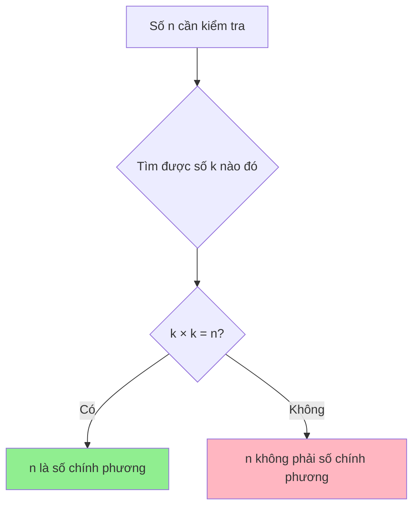
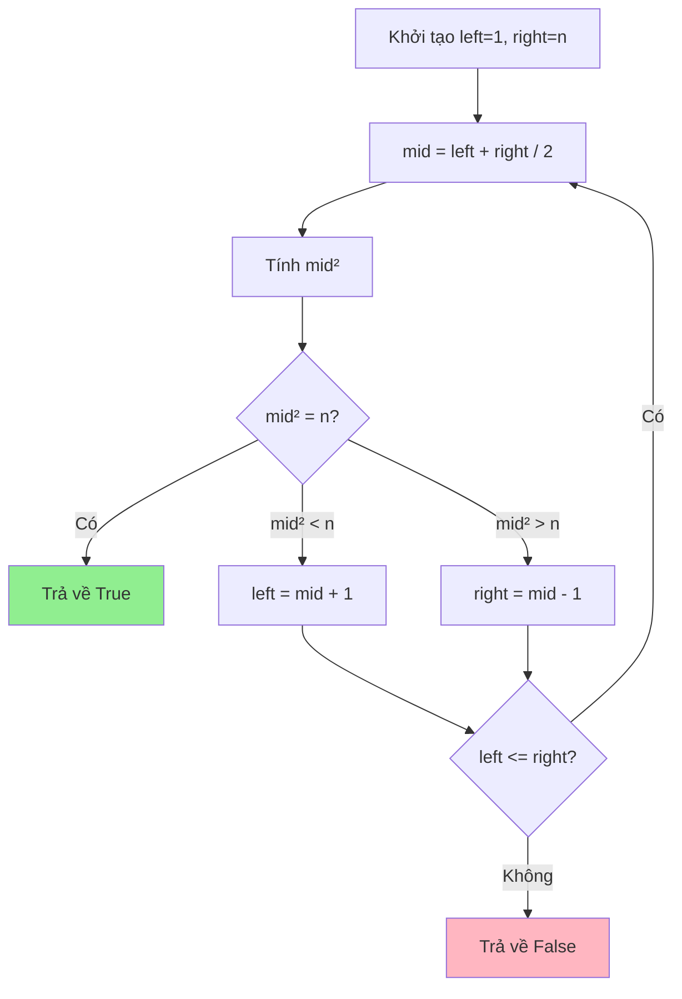

# Cài đặt code kiểm tra số chính phương - Từ cơ bản đến tối ưu

Bạn có bao giờ tự hỏi làm thế nào để kiểm tra một số có phải là số chính phương hay không? Ví dụ như số 16 = 4², số 25 = 5², hay số 100 = 10²? Hôm nay chúng ta sẽ cùng tìm hiểu cách giải quyết bài toán này từ đơn giản đến phức tạp!

<!-- truncate -->

## 🤔 Số chính phương là gì?

:::info Định nghĩa
**Số chính phương** (Perfect Square) là số nguyên dương có thể biểu diễn dưới dạng bình phương của một số nguyên khác.

Ví dụ: 1 = 1², 4 = 2², 9 = 3², 16 = 4²,...
:::

Hãy tưởng tượng bạn có một hình vuông được tạo bởi các viên gạch nhỏ. Nếu bạn có thể xếp chúng thành một hình vuông hoàn hảo, thì số viên gạch đó chính là một số chính phương!



## 📊 Phân tích bài toán

**Input:** Một số nguyên dương n
**Output:** True nếu n là số chính phương, False nếu ngược lại

**Ví dụ:**
- n = 16 → True (vì 4² = 16)
- n = 15 → False (vì không có số nguyên k nào mà k² = 15)

## 🚀 Giải pháp 1: Phương pháp brute force

Cách đơn giản nhất là thử tất cả các số từ 1 đến n xem có số nào bình phương bằng n không.

### Implementation:

**C++:**
```cpp
#include <iostream>
using namespace std;

bool isPerfectSquareBruteForce(int n) {
    if (n < 1) return false;
    
    for (int i = 1; i * i <= n; i++) {
        if (i * i == n) {
            return true;
        }
    }
    return false;
}

int main() {
    int number = 16;
    
    if (isPerfectSquareBruteForce(number)) {
        cout << number << " là số chính phương" << endl;
    } else {
        cout << number << " không phải số chính phương" << endl;
    }
    
    return 0;
}
```

**Python:**
```python
def is_perfect_square_brute_force(n):
    """
    Kiểm tra số chính phương bằng phương pháp brute force
    
    Args:
        n (int): Số cần kiểm tra
        
    Returns:
        bool: True nếu n là số chính phương, False nếu ngược lại
    """
    if n < 1:
        return False
    
    i = 1
    while i * i <= n:
        if i * i == n:
            return True
        i += 1
    
    return False

# Test
number = 16
if is_perfect_square_brute_force(number):
    print(f"{number} là số chính phương")
else:
    print(f"{number} không phải số chính phương")
```

**Java:**
```java
public class PerfectSquareChecker {
    
    public static boolean isPerfectSquareBruteForce(int n) {
        if (n < 1) return false;
        
        for (int i = 1; i * i <= n; i++) {
            if (i * i == n) {
                return true;
            }
        }
        return false;
    }
    
    public static void main(String[] args) {
        int number = 16;
        
        if (isPerfectSquareBruteForce(number)) {
            System.out.println(number + " là số chính phương");
        } else {
            System.out.println(number + " không phải số chính phương");
        }
    }
}
```

:::tip Phân tích độ phức tạp
- **Time Complexity:** O(√n) - Chúng ta chỉ cần duyệt đến √n
- **Space Complexity:** O(1) - Chỉ sử dụng biến tạm
:::

## ⚡ Giải pháp 2: Sử dụng hàm căn bậc hai

Cách này sử dụng hàm căn bậc hai có sẵn trong thư viện toán học.

**C++:**
```cpp
#include <iostream>
#include <cmath>
using namespace std;

bool isPerfectSquareSqrt(int n) {
    if (n < 1) return false;
    
    int sqrtN = (int)sqrt(n);
    return sqrtN * sqrtN == n;
}

int main() {
    int number = 25;
    
    if (isPerfectSquareSqrt(number)) {
        cout << number << " là số chính phương (√" << number << " = " << (int)sqrt(number) << ")" << endl;
    } else {
        cout << number << " không phải số chính phương" << endl;
    }
    
    return 0;
}
```

**Python:**
```python
import math

def is_perfect_square_sqrt(n):
    """
    Kiểm tra số chính phương bằng hàm căn bậc hai
    
    Args:
        n (int): Số cần kiểm tra
        
    Returns:
        bool: True nếu n là số chính phương, False nếu ngược lại
    """
    if n < 1:
        return False
    
    sqrt_n = int(math.sqrt(n))
    return sqrt_n * sqrt_n == n

# Test với nhiều số
test_numbers = [1, 4, 9, 15, 16, 25, 30, 36]

for num in test_numbers:
    result = is_perfect_square_sqrt(num)
    if result:
        sqrt_val = int(math.sqrt(num))
        print(f"{num} = {sqrt_val}² ✅")
    else:
        print(f"{num} ❌")
```

**Java:**
```java
public class PerfectSquareChecker {
    
    public static boolean isPerfectSquareSqrt(int n) {
        if (n < 1) return false;
        
        int sqrtN = (int) Math.sqrt(n);
        return sqrtN * sqrtN == n;
    }
    
    public static void main(String[] args) {
        int[] testNumbers = {1, 4, 9, 15, 16, 25, 30, 36};
        
        for (int num : testNumbers) {
            if (isPerfectSquareSqrt(num)) {
                int sqrtVal = (int) Math.sqrt(num);
                System.out.println(num + " = " + sqrtVal + "² ✅");
            } else {
                System.out.println(num + " ❌");
            }
        }
    }
}
```

## 🎯 Giải pháp 3: Binary Search (Tìm kiếm nhị phân)

Đây là cách tiếp cận thông minh nhất - sử dụng tìm kiếm nhị phân để tìm căn bậc hai.



**Python (với visualization):**
```python
def is_perfect_square_binary_search(n):
    """
    Kiểm tra số chính phương bằng binary search
    
    Args:
        n (int): Số cần kiểm tra
        
    Returns:
        bool: True nếu n là số chính phương, False nếu ngược lại
    """
    if n < 1:
        return False
    
    left, right = 1, n
    steps = []
    
    while left <= right:
        mid = (left + right) // 2
        square = mid * mid
        
        steps.append({
            'left': left, 
            'right': right, 
            'mid': mid, 
            'square': square,
            'target': n
        })
        
        if square == n:
            print(f"🎉 Tìm thấy! {mid}² = {square}")
            return True
        elif square < n:
            left = mid + 1
            print(f"📈 {mid}² = {square} < {n}, tìm kiếm bên phải")
        else:
            right = mid - 1
            print(f"📉 {mid}² = {square} > {n}, tìm kiếm bên trái")
    
    print(f"❌ Không tìm thấy căn bậc hai nguyên cho {n}")
    return False

# Demo
print("=== Kiểm tra số 49 ===")
result = is_perfect_square_binary_search(49)
print(f"Kết quả: {result}\n")

print("=== Kiểm tra số 50 ===")
result = is_perfect_square_binary_search(50)
print(f"Kết quả: {result}")
```

:::warning Lưu ý quan trọng
Khi sử dụng binary search, cần cẩn thận với việc overflow khi tính `mid * mid`. Với số lớn, nên sử dụng `mid <= n / mid` thay vì `mid * mid <= n`.
:::

## 📈 So sánh các phương pháp

| Phương pháp | Time Complexity | Space Complexity | Ưu điểm | Nhược điểm |
|-------------|----------------|------------------|---------|------------|
| Brute Force | O(√n) | O(1) | Đơn giản, dễ hiểu | Chậm với số lớn |
| Sqrt Function | O(1) | O(1) | Nhanh nhất | Phụ thuộc thư viện, có thể có lỗi làm tròn |
| Binary Search | O(log n) | O(1) | Nhanh, không dùng thư viện | Phức tạp hơn |

## 🏃‍♂️ Bài tập thực hành

:::note Thử thách
1. **Cơ bản:** Viết chương trình kiểm tra tất cả số chính phương từ 1 đến 100
2. **Trung bình:** Tìm số chính phương lớn nhất nhỏ hơn hoặc bằng n
3. **Khó:** Đếm số lượng số chính phương trong khoảng [a, b]
4. **Thách thức:** Kiểm tra số chính phương mà không sử dụng phép nhân hoặc hàm sqrt
:::

## 🎯 Kết luận

Chúng ta đã học được 3 cách khác nhau để kiểm tra số chính phương:

1. **Brute Force**: Đơn giản nhưng chậm
2. **Sqrt Function**: Nhanh nhưng có thể không chính xác với số lớn
3. **Binary Search**: Cân bằng giữa tốc độ và độ chính xác

Mỗi phương pháp đều có ưu nhược điểm riêng. Việc lựa chọn phương pháp nào phụ thuộc vào yêu cầu cụ thể của bài toán và constraints.

Hãy thử implement các phương pháp này và so sánh hiệu suất của chúng với các số khác nhau nhé! 🚀

---

**Tags:** #basics #math #square-number #algorithms #competitive-programming
