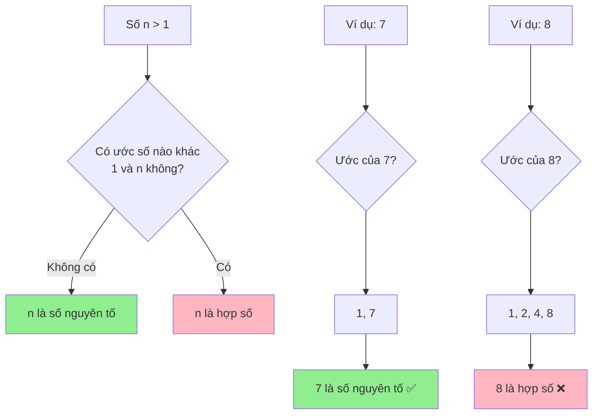

# Kiểm tra số nguyên tố - Từ cách cơ bản đến tối ưu

Số nguyên tố là một trong những khái niệm cơ bản nhất trong toán học và có ứng dụng rộng rãi trong lập trình. Hôm nay chúng ta sẽ cùng khám phá các cách khác nhau để kiểm tra một số có phải là số nguyên tố hay không, từ phương pháp đơn giản nhất đến những thuật toán siêu tối ưu!

<!-- truncate -->

## 🧮 Số nguyên tố là gì?

:::info Định nghĩa
**Số nguyên tố** (Prime Number) là số tự nhiên lớn hơn 1, chỉ có đúng 2 ước số là 1 và chính nó.

**Ví dụ:** 2, 3, 5, 7, 11, 13, 17, 19, 23, 29...
:::

Hãy tưởng tượng số nguyên tố như những "viên gạch không thể chia nhỏ" trong thế giới toán học. Chúng là những "building blocks" để tạo nên tất cả các số khác!



## 📊 Phân tích bài toán

**Input:** Một số nguyên dương n (n ≥ 2)
**Output:** True nếu n là số nguyên tố, False nếu ngược lại

**Các trường hợp đặc biệt:**
- n = 1: Không phải số nguyên tố
- n = 2: Số nguyên tố duy nhất là số chẵn
- n chẵn và n > 2: Không phải số nguyên tố

## 🐌 Giải pháp 1: Naive approach (Cách ngây thơ)

Cách đơn giản nhất: kiểm tra tất cả số từ 2 đến n-1 xem có số nào chia hết cho n không.

**C++:**
```cpp
#include <iostream>
using namespace std;

bool isPrimeNaive(int n) {
    // Xử lý các trường hợp đặc biệt
    if (n <= 1) return false;
    if (n == 2) return true;
    if (n % 2 == 0) return false;
    
    // Kiểm tra từ 3 đến n-1
    for (int i = 3; i < n; i += 2) {
        if (n % i == 0) {
            return false;
        }
    }
    return true;
}

void testPrimeNaive() {
    cout << "=== Kiểm tra số nguyên tố (Naive) ===" << endl;
    
    int testNumbers[] = {1, 2, 3, 4, 5, 17, 25, 29, 97};
    int size = sizeof(testNumbers) / sizeof(testNumbers[0]);
    
    for (int i = 0; i < size; i++) {
        int num = testNumbers[i];
        bool result = isPrimeNaive(num);
        cout << num << ": " << (result ? "✅ Nguyên tố" : "❌ Hợp số") << endl;
    }
}

int main() {
    testPrimeNaive();
    return 0;
}
```

**Python:**
```python
def is_prime_naive(n):
    """
    Kiểm tra số nguyên tố bằng cách naive
    
    Args:
        n (int): Số cần kiểm tra
        
    Returns:
        bool: True nếu n là số nguyên tố
    """
    # Xử lý các trường hợp đặc biệt
    if n <= 1:
        return False
    if n == 2:
        return True
    if n % 2 == 0:
        return False
    
    # Kiểm tra từ 3 đến n-1 (chỉ số lẻ)
    for i in range(3, n, 2):
        if n % i == 0:
            return False
    
    return True

# Test function với visualization
def test_prime_naive():
    print("=== Kiểm tra số nguyên tố (Naive) ===")
    
    test_numbers = [1, 2, 3, 4, 5, 17, 25, 29, 97]
    
    for num in test_numbers:
        result = is_prime_naive(num)
        status = "✅ Nguyên tố" if result else "❌ Hợp số"
        print(f"{num:2d}: {status}")

if __name__ == "__main__":
    test_prime_naive()
```

:::warning Vấn đề của Naive approach
- **Time Complexity:** O(n) - rất chậm với số lớn
- Phải kiểm tra quá nhiều số không cần thiết
:::

## 🚀 Giải pháp 2: Optimized Trial Division

**Insight quan trọng:** Nếu n có ước số d > √n, thì n cũng phải có ước số n/d < √n. Vậy ta chỉ cần kiểm tra đến √n!

**C++:**
```cpp
#include <iostream>
#include <cmath>
using namespace std;

bool isPrimeOptimized(int n) {
    if (n <= 1) return false;
    if (n <= 3) return true;
    if (n % 2 == 0 || n % 3 == 0) return false;
    
    // Chỉ cần kiểm tra đến sqrt(n)
    int sqrtN = sqrt(n);
    
    // Kiểm tra các số có dạng 6k ± 1
    for (int i = 5; i <= sqrtN; i += 6) {
        if (n % i == 0 || n % (i + 2) == 0) {
            return false;
        }
    }
    
    return true;
}

void benchmarkPrimeFunctions(int maxNum) {
    cout << "=== So sánh hiệu suất ===" << endl;
    cout << "Kiểm tra các số từ 2 đến " << maxNum << endl;
    
    int primeCount = 0;
    
    // Đếm thời gian (đơn giản)
    clock_t start = clock();
    
    for (int i = 2; i <= maxNum; i++) {
        if (isPrimeOptimized(i)) {
            primeCount++;
        }
    }
    
    clock_t end = clock();
    double timeUsed = double(end - start) / CLOCKS_PER_SEC;
    
    cout << "Tìm được " << primeCount << " số nguyên tố" << endl;
    cout << "Thời gian: " << timeUsed << " giây" << endl;
}

int main() {
    benchmarkPrimeFunctions(10000);
    return 0;
}
```

**Python với visualization:**
```python
import math
import time

def is_prime_optimized(n):
    """
    Kiểm tra số nguyên tố tối ưu (chỉ kiểm tra đến sqrt(n))
    
    Args:
        n (int): Số cần kiểm tra
        
    Returns:
        bool: True nếu n là số nguyên tố
    """
    if n <= 1:
        return False
    if n <= 3:
        return True
    if n % 2 == 0 or n % 3 == 0:
        return False
    
    # Chỉ kiểm tra đến sqrt(n)
    sqrt_n = int(math.sqrt(n)) + 1
    
    # Kiểm tra các số có dạng 6k ± 1
    for i in range(5, sqrt_n, 6):
        if n % i == 0 or n % (i + 2) == 0:
            return False
    
    return True

def visualize_prime_check(n):
    """
    Minh họa quá trình kiểm tra số nguyên tố
    """
    print(f"\n🔍 Kiểm tra {n} có phải số nguyên tố không?")
    
    if n <= 1:
        print("❌ n ≤ 1, không phải số nguyên tố")
        return False
    
    if n <= 3:
        print("✅ n ≤ 3 và n > 1, là số nguyên tố")
        return True
    
    if n % 2 == 0:
        print("❌ n chia hết cho 2, không phải số nguyên tố")
        return False
    
    if n % 3 == 0:
        print("❌ n chia hết cho 3, không phải số nguyên tố")
        return False
    
    print(f"📐 Chỉ cần kiểm tra các ước từ 5 đến √{n} ≈ {int(math.sqrt(n))}")
    
    sqrt_n = int(math.sqrt(n)) + 1
    checked_divisors = []
    
    for i in range(5, sqrt_n, 6):
        # Kiểm tra i và i+2 (dạng 6k±1)
        for divisor in [i, i + 2]:
            if divisor <= sqrt_n:
                checked_divisors.append(divisor)
                if n % divisor == 0:
                    print(f"❌ {n} chia hết cho {divisor}, không phải số nguyên tố")
                    return False
    
    print(f"🔍 Đã kiểm tra các số: {checked_divisors}")
    print(f"✅ {n} là số nguyên tố!")
    return True

# Demo
test_cases = [17, 25, 97, 100]
for num in test_cases:
    result = visualize_prime_check(num)
    print("-" * 50)
```

:::tip Tối ưu hóa thông minh
**Quy tắc 6k ± 1:** Tất cả số nguyên tố > 3 đều có dạng 6k ± 1. Điều này giúp ta giảm số lần kiểm tra từ O(√n) xuống O(√n/3)!
:::

## ⚡ Giải pháp 3: Sieve of Eratosthenes

Khi cần kiểm tra nhiều số cùng lúc, Sàng Eratosthenes là lựa chọn tuyệt vời!

```mermaid
graph TD
    A[Tạo mảng boolean size n+1] --> B[Đánh dấu tất cả = true]
    B --> C[Đánh dấu 0, 1 = false]
    C --> D[i = 2]
    D --> E{i² ≤ n?}
    E -->|Không| F[Kết thúc]
    E -->|Có| G{arr[i] == true?}
    G -->|Có| H[Đánh dấu bội số của i = false]
    G -->|Không| I[i++]
    H --> I
    I --> E
    
    style F fill:#90EE90
```

**Python Implementation:**
```python
def sieve_of_eratosthenes(n):
    """
    Tìm tất cả số nguyên tố từ 2 đến n bằng Sàng Eratosthenes
    
    Args:
        n (int): Giới hạn trên
        
    Returns:
        list: Danh sách các số nguyên tố
    """
    # Khởi tạo mảng đánh dấu
    is_prime = [True] * (n + 1)
    is_prime[0] = is_prime[1] = False
    
    # Thuật toán sàng
    for i in range(2, int(n**0.5) + 1):
        if is_prime[i]:
            # Đánh dấu tất cả bội số của i
            for j in range(i * i, n + 1, i):
                is_prime[j] = False
    
    # Trả về danh sách số nguyên tố
    return [i for i in range(2, n + 1) if is_prime[i]]

def visualize_sieve(n):
    """
    Minh họa quá trình sàng Eratosthenes
    """
    print(f"🧮 Sàng Eratosthenes tìm số nguyên tố từ 2 đến {n}")
    print("=" * 50)
    
    # Khởi tạo
    is_prime = [True] * (n + 1)
    is_prime[0] = is_prime[1] = False
    
    print("📊 Trạng thái ban đầu:")
    print_sieve_state(is_prime, n)
    
    # Sàng
    for i in range(2, int(n**0.5) + 1):
        if is_prime[i]:
            print(f"\n🔍 Sàng với số nguyên tố {i}:")
            
            # Đánh dấu bội số
            marked = []
            for j in range(i * i, n + 1, i):
                if is_prime[j]:
                    is_prime[j] = False
                    marked.append(j)
            
            print(f"   Loại bỏ: {marked}")
            print_sieve_state(is_prime, n)
    
    # Kết quả
    primes = [i for i in range(2, n + 1) if is_prime[i]]
    print(f"\n✅ Các số nguyên tố từ 2 đến {n}: {primes}")
    
    return primes

def print_sieve_state(is_prime, n):
    """In trạng thái hiện tại của sàng"""
    line = "   "
    for i in range(2, min(n + 1, 32)):  # Chỉ in 30 số đầu để dễ nhìn
        if is_prime[i]:
            line += f"{i:2d} "
        else:
            line += " X "
    if n > 31:
        line += "..."
    print(line)

# Demo
primes = visualize_sieve(30)
```

**Java Implementation:**
```java
import java.util.*;

public class PrimeChecker {
    
    public static List<Integer> sieveOfEratosthenes(int n) {
        boolean[] isPrime = new boolean[n + 1];
        Arrays.fill(isPrime, true);
        isPrime[0] = isPrime[1] = false;
        
        for (int i = 2; i * i <= n; i++) {
            if (isPrime[i]) {
                for (int j = i * i; j <= n; j += i) {
                    isPrime[j] = false;
                }
            }
        }
        
        List<Integer> primes = new ArrayList<>();
        for (int i = 2; i <= n; i++) {
            if (isPrime[i]) {
                primes.add(i);
            }
        }
        
        return primes;
    }
    
    public static boolean isPrimeSieve(int n, boolean[] sieve) {
        if (n < 2 || n >= sieve.length) return false;
        return sieve[n];
    }
    
    public static void main(String[] args) {
        int limit = 100;
        
        // Tạo sàng một lần
        System.out.println("🧮 Tạo sàng Eratosthenes cho số đến " + limit);
        List<Integer> primes = sieveOfEratosthenes(limit);
        
        System.out.println("✅ Tìm được " + primes.size() + " số nguyên tố:");
        System.out.println(primes);
        
        // Test một số số
        int[] testNumbers = {17, 25, 47, 51, 67, 91, 97};
        System.out.println("\n🔍 Kiểm tra một số:");
        
        boolean[] sieve = new boolean[limit + 1];
        Arrays.fill(sieve, true);
        sieve[0] = sieve[1] = false;
        
        for (int i = 2; i * i <= limit; i++) {
            if (sieve[i]) {
                for (int j = i * i; j <= limit; j += i) {
                    sieve[j] = false;
                }
            }
        }
        
        for (int num : testNumbers) {
            boolean result = isPrimeSieve(num, sieve);
            System.out.println(num + ": " + (result ? "✅ Nguyên tố" : "❌ Hợp số"));
        }
    }
}
```

## 📈 So sánh các phương pháp

| Phương pháp | Time Complexity | Space Complexity | Trường hợp sử dụng |
|-------------|----------------|------------------|-------------------|
| Naive | O(n) | O(1) | Kiểm tra 1 số, số nhỏ |
| Optimized Trial | O(√n) | O(1) | Kiểm tra 1 số, hiệu quả |
| Sieve of Eratosthenes | O(n log log n) | O(n) | Kiểm tra nhiều số |

:::info Khi nào dùng phương pháp nào?
- **Trial Division**: Khi cần kiểm tra 1 số cụ thể
- **Sieve**: Khi cần tìm tất cả số nguyên tố trong khoảng [1, n]
- **Segmented Sieve**: Khi n rất lớn (> 10^6) và bộ nhớ hạn chế
:::

## 🏆 Bài tập thực hành

:::note Thử thách
1. **Cơ bản:** Tìm 10 số nguyên tố đầu tiên
2. **Trung bình:** Đếm số nguyên tố trong khoảng [a, b]
3. **Khó:** Tìm số nguyên tố lớn nhất nhỏ hơn n
4. **Thách thức:** Kiểm tra số nguyên tố cho số rất lớn (> 10^9) sử dụng Miller-Rabin test
:::

## 🎯 Kết luận

Chúng ta đã tìm hiểu ba cách chính để kiểm tra số nguyên tố:

1. **Naive approach**: Đơn giản nhưng chậm
2. **Optimized Trial Division**: Nhanh cho kiểm tra đơn lẻ
3. **Sieve of Eratosthenes**: Tuyệt vời cho việc tìm nhiều số nguyên tố

Mỗi thuật toán đều có ưu điểm riêng. Hãy lựa chọn phương pháp phù hợp với bài toán cụ thể của bạn!

Số nguyên tố không chỉ là một khái niệm toán học mà còn có ứng dụng thực tế trong mã hóa, bảo mật, và nhiều lĩnh vực khác. Hãy tiếp tục khám phá thế giới tuyệt vời của chúng! 🚀

---

**Tags:** #basics #prime #math #algorithms #optimization #sieve
