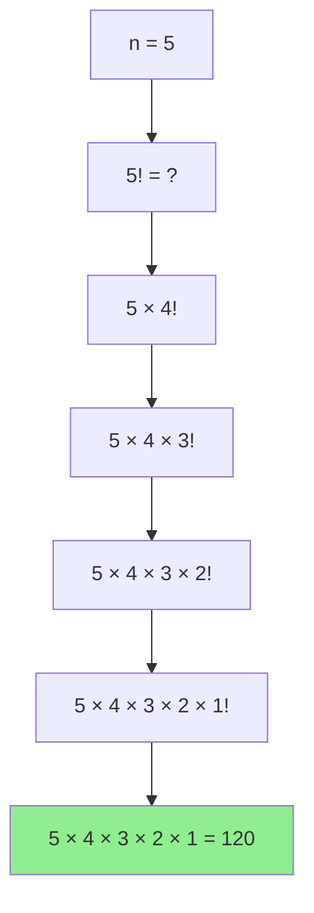

# Tính giai thừa của một số - 3 cách khác nhau

Giai thừa là một trong những khái niệm toán học cơ bản nhất mà mọi lập trình viên đều cần biết! Từ việc đếm số cách sắp xếp đến tính xác suất, giai thừa xuất hiện ở khắp mọi nơi. Hôm nay chúng ta sẽ cùng khám phá 3 cách khác nhau để tính giai thừa và tìm hiểu khi nào nên dùng cách nào! 🧮✨

<!-- truncate -->

## 🤓 Giai thừa là gì?

:::info Định nghĩa
**Giai thừa** của số tự nhiên n (ký hiệu n!) là tích của tất cả các số tự nhiên từ 1 đến n.

**Công thức:** n! = 1 × 2 × 3 × ... × n

**Quy ước đặc biệt:** 0! = 1
:::

Hãy tưởng tượng bạn có n quyển sách và muốn sắp xếp chúng trên kệ. Có bao nhiêu cách sắp xếp khác nhau? Đó chính là n! cách!

**Ví dụ trực quan:**
- 3! = 1 × 2 × 3 = 6 (có 6 cách sắp xếp 3 quyển sách)
- 4! = 1 × 2 × 3 × 4 = 24
- 5! = 1 × 2 × 3 × 4 × 5 = 120



## 🔄 Cách 1: Sử dụng vòng lặp (Iterative)

Đây là cách đơn giản và trực quan nhất - nhân dần từ 1 đến n.

### Implementation:

**C++:**
```cpp
#include <iostream>
#include <chrono>
using namespace std;
using namespace std::chrono;

long long factorialIterative(int n) {
    if (n < 0) {
        cout << "⚠️  Giai thừa không xác định với số âm!" << endl;
        return -1;
    }
    
    long long result = 1;
    
    cout << "🔄 Tính " << n << "! bằng vòng lặp:" << endl;
    cout << n << "! = ";
    
    for (int i = 1; i <= n; i++) {
        result *= i;
        cout << i;
        if (i < n) cout << " × ";
    }
    
    cout << " = " << result << endl;
    return result;
}

void testFactorialIterative() {
    cout << "=== CÁCH 1: VÒNG LẶP ===" << endl;
    
    int testCases[] = {0, 1, 5, 10};
    int numTests = sizeof(testCases) / sizeof(testCases[0]);
    
    for (int i = 0; i < numTests; i++) {
        int n = testCases[i];
        
        auto start = high_resolution_clock::now();
        long long result = factorialIterative(n);
        auto end = high_resolution_clock::now();
        
        auto duration = duration_cast<microseconds>(end - start);
        cout << "⏱️  Thời gian: " << duration.count() << " microseconds" << endl;
        cout << string(50, '-') << endl;
    }
}

int main() {
    testFactorialIterative();
    return 0;
}
```

**Python:**
```python
import time

def factorial_iterative(n):
    """
    Tính giai thừa bằng vòng lặp
    
    Args:
        n (int): Số cần tính giai thừa
        
    Returns:
        int: Kết quả n!
    """
    if n < 0:
        print("⚠️  Giai thừa không xác định với số âm!")
        return None
    
    result = 1
    calculation_steps = []
    
    print(f"🔄 Tính {n}! bằng vòng lặp:")
    
    for i in range(1, n + 1):
        result *= i
        calculation_steps.append(str(i))
    
    if calculation_steps:
        print(f"{n}! = {' × '.join(calculation_steps)} = {result}")
    else:
        print(f"{n}! = 1 (theo quy ước)")
    
    return result

def benchmark_iterative():
    """So sánh hiệu suất với các giá trị khác nhau"""
    print("=== CÁCH 1: VÒNG LẶP ===")
    
    test_cases = [0, 1, 5, 10, 15, 20]
    
    for n in test_cases:
        start_time = time.perf_counter()
        result = factorial_iterative(n)
        end_time = time.perf_counter()
        
        execution_time = (end_time - start_time) * 1000000  # Convert to microseconds
        print(f"⏱️  Thời gian: {execution_time:.2f} microseconds")
        print("-" * 50)

if __name__ == "__main__":
    benchmark_iterative()
```

**Java:**
```java
import java.math.BigInteger;

public class FactorialCalculator {
    
    public static long factorialIterative(int n) {
        if (n < 0) {
            System.out.println("⚠️  Giai thừa không xác định với số âm!");
            return -1;
        }
        
        long result = 1;
        System.out.println("🔄 Tính " + n + "! bằng vòng lặp:");
        System.out.print(n + "! = ");
        
        for (int i = 1; i <= n; i++) {
            result *= i;
            System.out.print(i);
            if (i < n) System.out.print(" × ");
        }
        
        System.out.println(" = " + result);
        return result;
    }
    
    // Phiên bản xử lý số lớn
    public static BigInteger factorialIterativeBig(int n) {
        BigInteger result = BigInteger.ONE;
        
        for (int i = 1; i <= n; i++) {
            result = result.multiply(BigInteger.valueOf(i));
        }
        
        return result;
    }
    
    public static void testIterative() {
        System.out.println("=== CÁCH 1: VÒNG LẶP ===");
        
        int[] testCases = {0, 1, 5, 10, 20};
        
        for (int n : testCases) {
            long startTime = System.nanoTime();
            
            if (n <= 20) {
                factorialIterative(n);
            } else {
                BigInteger result = factorialIterativeBig(n);
                System.out.println(n + "! = " + result);
            }
            
            long endTime = System.nanoTime();
            long duration = (endTime - startTime) / 1000; // Convert to microseconds
            
            System.out.println("⏱️  Thời gian: " + duration + " microseconds");
            System.out.println("-".repeat(50));
        }
    }
    
    public static void main(String[] args) {
        testIterative();
    }
}
```

:::tip Ưu điểm của Iterative
- **Đơn giản, dễ hiểu**: Code rất trực quan
- **Hiệu suất tốt**: Không có overhead của function call
- **Tiết kiệm bộ nhớ**: O(1) space complexity
:::

## 🔄 Cách 2: Sử dụng đệ quy (Recursive)

Đệ quy dựa trên ý tưởng: n! = n × (n-1)!

```mermaid
graph TD
    A[factorial(5)] --> B[5 × factorial(4)]
    B --> C[5 × 4 × factorial(3)]
    C --> D[5 × 4 × 3 × factorial(2)]
    D --> E[5 × 4 × 3 × 2 × factorial(1)]
    E --> F[5 × 4 × 3 × 2 × 1]
    F --> G[120]
    
    style G fill:#90EE90
```

**Python Implementation:**
```python
import sys
sys.setrecursionlimit(10000)  # Tăng giới hạn đệ quy

def factorial_recursive(n, depth=0):
    """
    Tính giai thừa bằng đệ quy (có visualization)
    
    Args:
        n (int): Số cần tính giai thừa
        depth (int): Độ sâu đệ quy (để vẽ cây)
        
    Returns:
        int: Kết quả n!
    """
    # Thụt lề theo độ sâu để thể hiện call stack
    indent = "  " * depth
    
    print(f"{indent}📞 Gọi factorial({n})")
    
    # Base cases
    if n < 0:
        print(f"{indent}⚠️  Số âm, return None")
        return None
    
    if n == 0 or n == 1:
        print(f"{indent}🛑 Base case: factorial({n}) = 1")
        return 1
    
    # Recursive case
    print(f"{indent}🔄 Tính {n} × factorial({n-1})")
    result = n * factorial_recursive(n - 1, depth + 1)
    
    print(f"{indent}✅ factorial({n}) = {result}")
    return result

def factorial_recursive_simple(n):
    """Phiên bản đệ quy đơn giản không có visualization"""
    if n < 0:
        return None
    if n == 0 or n == 1:
        return 1
    return n * factorial_recursive_simple(n - 1)

def test_recursive():
    print("=== CÁCH 2: ĐỆ QUY ===")
    
    test_cases = [0, 1, 5]
    
    for n in test_cases:
        print(f"\n🧮 Tính {n}! bằng đệ quy:")
        print("=" * 30)
        
        result = factorial_recursive(n)
        print(f"🎯 Kết quả cuối cùng: {n}! = {result}")
        print("-" * 50)

if __name__ == "__main__":
    test_recursive()
```

**C++ Implementation:**
```cpp
#include <iostream>
using namespace std;

long long factorialRecursive(int n, int depth = 0) {
    // Tạo thụt lề để thể hiện call stack
    string indent(depth * 2, ' ');
    
    cout << indent << "📞 Gọi factorial(" << n << ")" << endl;
    
    // Base cases
    if (n < 0) {
        cout << indent << "⚠️  Số âm, return -1" << endl;
        return -1;
    }
    
    if (n == 0 || n == 1) {
        cout << indent << "🛑 Base case: factorial(" << n << ") = 1" << endl;
        return 1;
    }
    
    // Recursive case
    cout << indent << "🔄 Tính " << n << " × factorial(" << (n-1) << ")" << endl;
    long long result = n * factorialRecursive(n - 1, depth + 1);
    
    cout << indent << "✅ factorial(" << n << ") = " << result << endl;
    return result;
}

// Phiên bản đơn giản
long long factorialRecursiveSimple(int n) {
    if (n <= 1) return 1;
    return n * factorialRecursiveSimple(n - 1);
}

void testRecursive() {
    cout << "=== CÁCH 2: ĐỆ QUY ===" << endl;
    
    int testCases[] = {0, 1, 5};
    int numTests = sizeof(testCases) / sizeof(testCases[0]);
    
    for (int i = 0; i < numTests; i++) {
        int n = testCases[i];
        
        cout << "\n🧮 Tính " << n << "! bằng đệ quy:" << endl;
        cout << string(30, '=') << endl;
        
        long long result = factorialRecursive(n);
        cout << "🎯 Kết quả cuối cùng: " << n << "! = " << result << endl;
        cout << string(50, '-') << endl;
    }
}

int main() {
    testRecursive();
    return 0;
}
```

:::warning Nhược điểm của Recursion
- **Stack Overflow**: Với n lớn có thể gây tràn stack
- **Hiệu suất kém**: Mỗi function call có overhead
- **Space Complexity**: O(n) do call stack
:::

## 💾 Cách 3: Lập trình động (Dynamic Programming)

Sử dụng memoization để lưu trữ kết quả đã tính, tránh tính toán lại.

**Python Implementation:**
```python
from functools import lru_cache
import time

class FactorialDP:
    def __init__(self):
        # Bảng lưu trữ kết quả đã tính
        self.memo = {0: 1, 1: 1}
        print("🧠 Khởi tạo bảng memo với 0! = 1, 1! = 1")
    
    def factorial_memo(self, n):
        """
        Tính giai thừa với memoization
        
        Args:
            n (int): Số cần tính giai thừa
            
        Returns:
            int: Kết quả n!
        """
        if n < 0:
            return None
        
        if n in self.memo:
            print(f"🎯 Tìm thấy {n}! trong bảng memo = {self.memo[n]}")
            return self.memo[n]
        
        print(f"🔍 Chưa có {n}! trong memo, tính toán...")
        
        # Tính từ số lớn nhất đã có trong memo
        start = max([k for k in self.memo.keys() if k < n]) + 1
        result = self.memo[start - 1]
        
        print(f"📊 Bắt đầu từ {start-1}! = {result}")
        
        for i in range(start, n + 1):
            result *= i
            self.memo[i] = result
            print(f"   💾 Lưu {i}! = {result}")
        
        return result
    
    def show_memo_table(self):
        """Hiển thị bảng memo hiện tại"""
        print("📋 Bảng memo hiện tại:")
        for key in sorted(self.memo.keys()):
            print(f"   {key}! = {self.memo[key]}")

# Sử dụng decorator @lru_cache của Python
@lru_cache(maxsize=None)
def factorial_lru_cache(n):
    """Sử dụng LRU Cache có sẵn của Python"""
    if n <= 1:
        return 1
    return n * factorial_lru_cache(n - 1)

def test_dynamic_programming():
    print("=== CÁCH 3: LẬP TRÌNH ĐỘNG ===")
    
    # Test với custom memoization
    print("\n🧠 Custom Memoization:")
    dp = FactorialDP()
    
    test_sequence = [5, 3, 7, 6, 10]
    
    for n in test_sequence:
        print(f"\n🧮 Tính {n}!:")
        result = dp.factorial_memo(n)
        print(f"✅ {n}! = {result}")
        dp.show_memo_table()
        print("-" * 40)
    
    # Test với LRU Cache
    print("\n📦 Sử dụng @lru_cache:")
    for n in [5, 10, 15]:
        start_time = time.perf_counter()
        result = factorial_lru_cache(n)
        end_time = time.perf_counter()
        
        print(f"{n}! = {result}")
        print(f"⏱️  Thời gian: {(end_time - start_time) * 1000000:.2f} microseconds")
    
    # Hiển thị thông tin cache
    print(f"📊 Cache info: {factorial_lru_cache.cache_info()}")

if __name__ == "__main__":
    test_dynamic_programming()
```

**Java Implementation:**
```java
import java.util.HashMap;
import java.util.Map;
import java.math.BigInteger;

public class FactorialDP {
    private Map<Integer, BigInteger> memo;
    
    public FactorialDP() {
        memo = new HashMap<>();
        memo.put(0, BigInteger.ONE);
        memo.put(1, BigInteger.ONE);
        System.out.println("🧠 Khởi tạo bảng memo với 0! = 1, 1! = 1");
    }
    
    public BigInteger factorialMemo(int n) {
        if (n < 0) return null;
        
        if (memo.containsKey(n)) {
            System.out.println("🎯 Tìm thấy " + n + "! trong bảng memo = " + memo.get(n));
            return memo.get(n);
        }
        
        System.out.println("🔍 Chưa có " + n + "! trong memo, tính toán...");
        
        // Tìm số lớn nhất đã có trong memo và nhỏ hơn n
        int start = 0;
        for (int key : memo.keySet()) {
            if (key < n && key > start) {
                start = key;
            }
        }
        
        BigInteger result = memo.get(start);
        System.out.println("📊 Bắt đầu từ " + start + "! = " + result);
        
        for (int i = start + 1; i <= n; i++) {
            result = result.multiply(BigInteger.valueOf(i));
            memo.put(i, result);
            System.out.println("   💾 Lưu " + i + "! = " + result);
        }
        
        return result;
    }
    
    public void showMemoTable() {
        System.out.println("📋 Bảng memo hiện tại:");
        memo.entrySet().stream()
            .sorted(Map.Entry.comparingByKey())
            .forEach(entry -> 
                System.out.println("   " + entry.getKey() + "! = " + entry.getValue())
            );
    }
    
    public static void testDP() {
        System.out.println("=== CÁCH 3: LẬP TRÌNH ĐỘNG ===");
        
        FactorialDP dp = new FactorialDP();
        int[] testSequence = {5, 3, 7, 6, 10};
        
        for (int n : testSequence) {
            System.out.println("\n🧮 Tính " + n + "!:");
            BigInteger result = dp.factorialMemo(n);
            System.out.println("✅ " + n + "! = " + result);
            dp.showMemoTable();
            System.out.println("-".repeat(40));
        }
    }
    
    public static void main(String[] args) {
        testDP();
    }
}
```

:::info Ưu điểm của Dynamic Programming
- **Tối ưu cho nhiều truy vấn**: Sau lần đầu, các kết quả được cache
- **Tránh tính toán lại**: Efficiency với repeated calculations
- **Scalable**: Có thể xử lý số rất lớn với BigInteger
:::

## ⚖️ So sánh 3 phương pháp

| Phương pháp | Time Complexity | Space Complexity | Ưu điểm | Nhược điểm |
|-------------|----------------|------------------|---------|-------------|
| **Iterative** | O(n) | O(1) | Đơn giản, nhanh | Không cache kết quả |
| **Recursive** | O(n) | O(n) | Elegant, dễ hiểu | Stack overflow risk |
| **Dynamic Programming** | O(n) first call, O(1) subsequent | O(n) | Tốt cho multiple queries | Tốn bộ nhớ |

## 🔢 Xử lý số lớn

Với n lớn (> 20), ta cần sử dụng BigInteger:

**Python (built-in big integer):**
```python
def factorial_big_numbers():
    """Demo tính giai thừa số lớn"""
    print("🔢 Tính giai thừa số lớn:")
    
    large_numbers = [50, 100, 200]
    
    for n in large_numbers:
        import math
        result = math.factorial(n)  # Python built-in
        
        # Hiển thị một phần kết quả
        result_str = str(result)
        if len(result_str) > 50:
            display = f"{result_str[:25]}...{result_str[-25:]}"
        else:
            display = result_str
        
        print(f"{n}! = {display}")
        print(f"   📏 Có {len(result_str)} chữ số")
        print()

factorial_big_numbers()
```

## 🏁 Ứng dụng thực tế

**1. Tổ hợp và xác suất:**
```python
def combination(n, r):
    """Tính C(n,r) = n! / (r! × (n-r)!)"""
    return factorial_iterative_simple(n) // (
        factorial_iterative_simple(r) * factorial_iterative_simple(n - r)
    )

def permutation(n, r):
    """Tính P(n,r) = n! / (n-r)!"""
    return factorial_iterative_simple(n) // factorial_iterative_simple(n - r)

# Ví dụ: Có bao nhiêu cách chọn 3 người từ 10 người?
print(f"C(10,3) = {combination(10, 3)} cách")
```

**2. Chuỗi Taylor:**
```python
import math

def sin_taylor(x, terms=10):
    """Tính sin(x) bằng chuỗi Taylor"""
    result = 0
    for n in range(terms):
        term = ((-1) ** n) * (x ** (2*n + 1)) / factorial_iterative_simple(2*n + 1)
        result += term
    return result

# So sánh với hàm built-in
x = math.pi / 4
print(f"sin({x}) built-in: {math.sin(x)}")
print(f"sin({x}) Taylor:   {sin_taylor(x)}")
```

## 🏃‍♂️ Bài tập thực hành

:::note Thử thách
1. **Cơ bản:** Viết hàm tính n! mà không sử dụng vòng lặp hoặc đệ quy (hint: sử dụng reduce)
2. **Trung bình:** Implement factorial với iterative nhưng tối ưu cho số chẵn/lẻ
3. **Khó:** Viết function tính giai thừa của mảng số [n1, n2, n3...] một cách tối ưu nhất
4. **Thách thức:** Implement Stirling's approximation để ước lượng n! cho số rất lớn
:::

## 🎯 Kết luận

Chúng ta đã khám phá 3 cách tính giai thừa:

1. **Iterative** 🔄: Đơn giản, hiệu quả cho single calculation
2. **Recursive** 🔄: Elegant nhưng có giới hạn stack
3. **Dynamic Programming** 💾: Tối ưu cho multiple queries

**Khuyến nghị sử dụng:**
- **Single calculation**: Dùng Iterative
- **Multiple calculations**: Dùng DP với memoization  
- **Educational purpose**: Dùng Recursive để hiểu concept

Giai thừa tuy đơn giản nhưng là nền tảng cho nhiều thuật toán phức tạp hơn. Hãy master nó trước khi chuyển sang những concept khó hơn! 🚀

---

**Tags:** #basics #factorial #recursion #dynamic-programming #math #algorithms
