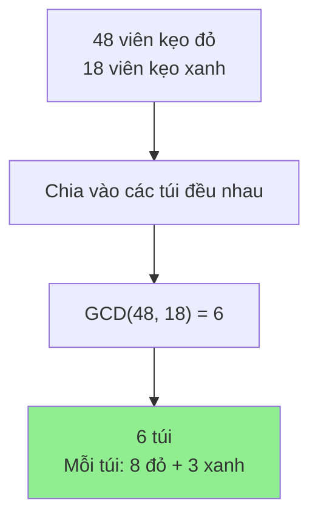
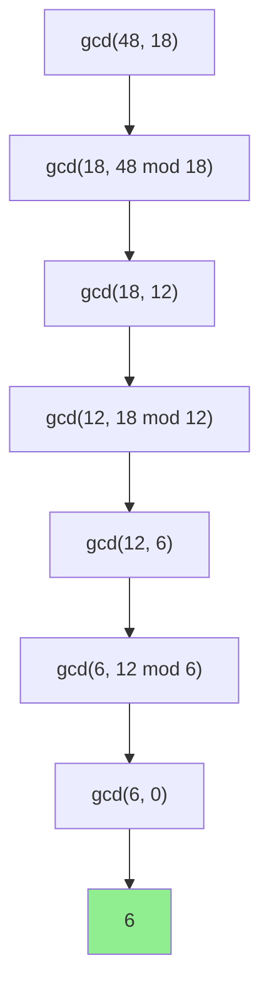
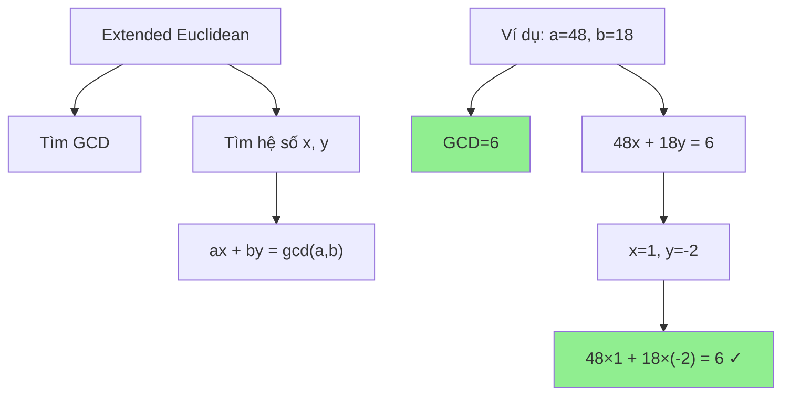

# Tìm ước chung lớn nhất (GCD) bằng thuật toán Euclid

Bạn có bao giờ thắc mắc làm thế nào để tìm "yếu tố chung" lớn nhất của hai số? Ví dụ như 48 và 18 có "điểm chung" lớn nhất là gì? Đó chính là bài toán tìm **Ước chung lớn nhất** (GCD)! Hôm nay chúng ta sẽ khám phá thuật toán Euclid - một trong những thuật toán cổ xưa và elegant nhất trong lịch sử toán học! 🧮✨

<!-- truncate -->

## 🤔 GCD là gì?

:::info Định nghĩa
**Ước chung lớn nhất** (Greatest Common Divisor - GCD) của hai số nguyên a và b là số nguyên dương lớn nhất có thể chia hết cho cả a và b.

**Ký hiệu:** gcd(a, b) hoặc (a, b)
:::

**Ví dụ trực quan:**
- gcd(48, 18) = 6 (vì 48 = 6×8, 18 = 6×3)
- gcd(15, 25) = 5 (vì 15 = 5×3, 25 = 5×5)
- gcd(17, 19) = 1 (hai số nguyên tố cùng nhau)

Hãy tưởng tượng bạn có 48 viên kẹo đỏ và 18 viên kẹo xanh. Bạn muốn chia chúng vào các túi sao cho mỗi túi có số lượng kẹo đỏ và xanh như nhau. Bạn có thể tạo được tối đa bao nhiêu túi? Đó chính là GCD(48, 18) = 6 túi!



## 🐌 Cách 1: Phương pháp Brute Force

Cách đơn giản nhất: thử tất cả số từ 1 đến min(a, b).

**Python:**
```python
def gcd_brute_force(a, b):
    """
    Tìm GCD bằng phương pháp brute force
    
    Args:
        a, b (int): Hai số cần tìm GCD
        
    Returns:
        int: GCD của a và b
    """
    # Xử lý trường hợp đặc biệt
    a, b = abs(a), abs(b)
    if a == 0: return b
    if b == 0: return a
    
    print(f"🔍 Tìm GCD({a}, {b}) bằng brute force:")
    
    gcd = 1
    min_val = min(a, b)
    divisors = []
    
    # Thử tất cả số từ 1 đến min(a, b)
    for i in range(1, min_val + 1):
        if a % i == 0 and b % i == 0:
            gcd = i
            divisors.append(i)
    
    print(f"   📋 Các ước chung: {divisors}")
    print(f"   ✅ GCD lớn nhất: {gcd}")
    
    return gcd

def test_brute_force():
    print("=== CÁCH 1: BRUTE FORCE ===")
    
    test_cases = [(48, 18), (15, 25), (17, 19), (100, 75)]
    
    for a, b in test_cases:
        result = gcd_brute_force(a, b)
        print(f"🎯 GCD({a}, {b}) = {result}")
        print("-" * 40)

if __name__ == "__main__":
    test_brute_force()
```

:::warning Vấn đề của Brute Force
- **Time Complexity:** O(min(a, b)) - rất chậm với số lớn
- Không hiệu quả khi a, b rất lớn
:::

## ⚡ Cách 2: Thuật toán Euclid cổ điển

**Ý tưởng chính:** gcd(a, b) = gcd(b, a mod b)

**Tại sao nó hoạt động?**
Nếu d là ước chung của a và b, thì d cũng là ước chung của b và (a mod b).



**C++ Implementation:**
```cpp
#include <iostream>
using namespace std;

int gcdEuclid(int a, int b, int depth = 0) {
    // Tạo thụt lề để thể hiện các bước
    string indent(depth * 2, ' ');
    
    cout << indent << "🔄 gcd(" << a << ", " << b << ")" << endl;
    
    // Base case
    if (b == 0) {
        cout << indent << "🛑 Base case: gcd(" << a << ", 0) = " << a << endl;
        return a;
    }
    
    // Recursive case
    int remainder = a % b;
    cout << indent << "📐 " << a << " mod " << b << " = " << remainder << endl;
    
    return gcdEuclid(b, remainder, depth + 1);
}

// Phiên bản iterative
int gcdEuclidIterative(int a, int b) {
    cout << "🔄 Thuật toán Euclid (iterative):" << endl;
    cout << "Bước khởi tạo: a = " << a << ", b = " << b << endl;
    
    int step = 1;
    while (b != 0) {
        int remainder = a % b;
        cout << "Bước " << step << ": " << a << " = " << b << " × " 
             << (a / b) << " + " << remainder << endl;
        
        a = b;
        b = remainder;
        step++;
    }
    
    cout << "✅ Kết quả: GCD = " << a << endl;
    return a;
}

void testEuclid() {
    cout << "=== CÁCH 2: THUẬT TOÁN EUCLID ===" << endl;
    
    int testCases[][2] = {{48, 18}, {100, 75}, {17, 19}, {252, 105}};
    int numTests = sizeof(testCases) / sizeof(testCases[0]);
    
    for (int i = 0; i < numTests; i++) {
        int a = testCases[i][0];
        int b = testCases[i][1];
        
        cout << "\n📊 Test case: GCD(" << a << ", " << b << ")" << endl;
        cout << string(40, '=') << endl;
        
        // Test recursive version
        cout << "🔄 Recursive version:" << endl;
        int result1 = gcdEuclid(a, b);
        
        cout << "\n🔄 Iterative version:" << endl;
        int result2 = gcdEuclidIterative(a, b);
        
        cout << "\n🎯 Cả hai phương pháp đều cho kết quả: " << result1 << endl;
        cout << string(50, '-') << endl;
    }
}

int main() {
    testEuclid();
    return 0;
}
```

**Python Implementation:**
```python
def gcd_euclid_recursive(a, b, depth=0):
    """
    GCD bằng thuật toán Euclid (recursive)
    
    Args:
        a, b (int): Hai số cần tìm GCD
        depth (int): Độ sâu đệ quy (để visualization)
        
    Returns:
        int: GCD của a và b
    """
    indent = "  " * depth
    print(f"{indent}🔄 gcd({a}, {b})")
    
    # Base case
    if b == 0:
        print(f"{indent}🛑 Base case: gcd({a}, 0) = {a}")
        return a
    
    # Recursive case
    remainder = a % b
    quotient = a // b
    print(f"{indent}📐 {a} = {b} × {quotient} + {remainder}")
    
    return gcd_euclid_recursive(b, remainder, depth + 1)

def gcd_euclid_iterative(a, b):
    """GCD bằng thuật toán Euclid (iterative)"""
    print(f"🔄 Thuật toán Euclid cho GCD({a}, {b}):")
    
    original_a, original_b = a, b
    step = 1
    
    while b != 0:
        quotient = a // b
        remainder = a % b
        
        print(f"Bước {step}: {a} = {b} × {quotient} + {remainder}")
        
        a, b = b, remainder
        step += 1
    
    print(f"✅ GCD({original_a}, {original_b}) = {a}")
    return a

def visualize_euclid_algorithm():
    """Minh họa chi tiết thuật toán Euclid"""
    print("=== CÁCH 2: THUẬT TOÁN EUCLID ===")
    
    test_cases = [(48, 18), (100, 75), (252, 105)]
    
    for a, b in test_cases:
        print(f"\n🧮 Tìm GCD({a}, {b}):")
        print("=" * 40)
        
        print("📋 Recursive version:")
        result1 = gcd_euclid_recursive(a, b)
        
        print(f"\n📋 Iterative version:")
        result2 = gcd_euclid_iterative(a, b)
        
        print("-" * 50)

if __name__ == "__main__":
    visualize_euclid_algorithm()
```

**Java Implementation:**
```java
public class GCDCalculator {
    
    public static int gcdEuclidRecursive(int a, int b, int depth) {
        String indent = "  ".repeat(depth);
        System.out.println(indent + "🔄 gcd(" + a + ", " + b + ")");
        
        if (b == 0) {
            System.out.println(indent + "🛑 Base case: gcd(" + a + ", 0) = " + a);
            return a;
        }
        
        int quotient = a / b;
        int remainder = a % b;
        System.out.println(indent + "📐 " + a + " = " + b + " × " + quotient + " + " + remainder);
        
        return gcdEuclidRecursive(b, remainder, depth + 1);
    }
    
    public static int gcdEuclidIterative(int a, int b) {
        System.out.println("🔄 Thuật toán Euclid cho GCD(" + a + ", " + b + "):");
        
        int originalA = a, originalB = b;
        int step = 1;
        
        while (b != 0) {
            int quotient = a / b;
            int remainder = a % b;
            
            System.out.println("Bước " + step + ": " + a + " = " + b + " × " + quotient + " + " + remainder);
            
            a = b;
            b = remainder;
            step++;
        }
        
        System.out.println("✅ GCD(" + originalA + ", " + originalB + ") = " + a);
        return a;
    }
    
    public static void testEuclid() {
        System.out.println("=== CÁCH 2: THUẬT TOÁN EUCLID ===");
        
        int[][] testCases = {{48, 18}, {100, 75}, {252, 105}};
        
        for (int[] testCase : testCases) {
            int a = testCase[0], b = testCase[1];
            
            System.out.println("\n🧮 Tìm GCD(" + a + ", " + b + "):");
            System.out.println("=".repeat(40));
            
            System.out.println("📋 Recursive version:");
            int result1 = gcdEuclidRecursive(a, b, 0);
            
            System.out.println("\n📋 Iterative version:");
            int result2 = gcdEuclidIterative(a, b);
            
            System.out.println("-".repeat(50));
        }
    }
    
    public static void main(String[] args) {
        testEuclid();
    }
}
```

:::tip Tại sao Euclid Algorithm hiệu quả?
- **Time Complexity:** O(log(min(a, b))) - siêu nhanh!
- **Space Complexity:** O(1) với iterative, O(log n) với recursive
- Số bước ≤ 5 × số chữ số của số nhỏ hơn
:::

## 🌟 Cách 3: Extended Euclidean Algorithm

Không chỉ tìm GCD, mà còn tìm hệ số x, y sao cho: **ax + by = gcd(a, b)**



**Python Implementation:**
```python
def extended_gcd(a, b):
    """
    Extended Euclidean Algorithm
    Trả về (gcd, x, y) sao cho ax + by = gcd(a, b)
    
    Args:
        a, b (int): Hai số cần tìm GCD
        
    Returns:
        tuple: (gcd, x, y)
    """
    print(f"🔍 Extended GCD cho ({a}, {b}):")
    
    # Base case
    if b == 0:
        print(f"🛑 Base case: gcd({a}, 0) = {a}")
        print(f"   Hệ số: {a} × 1 + 0 × 0 = {a}")
        return a, 1, 0
    
    # Recursive case
    print(f"🔄 Gọi extended_gcd({b}, {a % b})")
    gcd, x1, y1 = extended_gcd(b, a % b)
    
    # Cập nhật hệ số
    x = y1
    y = x1 - (a // b) * y1
    
    print(f"📐 Cập nhật hệ số cho ({a}, {b}):")
    print(f"   x = {y1}, y = {x1} - ({a}//{b}) × {y1} = {y}")
    print(f"   Kiểm tra: {a} × {x} + {b} × {y} = {a*x + b*y}")
    
    return gcd, x, y

def test_extended_gcd():
    """Test Extended Euclidean Algorithm"""
    print("=== EXTENDED EUCLIDEAN ALGORITHM ===")
    
    test_cases = [(48, 18), (35, 15), (240, 46)]
    
    for a, b in test_cases:
        print(f"\n🧮 Test case: ({a}, {b})")
        print("=" * 50)
        
        gcd, x, y = extended_gcd(a, b)
        
        # Verification
        result = a * x + b * y
        print(f"\n✅ Kết quả:")
        print(f"   GCD({a}, {b}) = {gcd}")
        print(f"   Hệ số: x = {x}, y = {y}")
        print(f"   Kiểm tra: {a} × {x} + {b} × {y} = {result}")
        
        if result == gcd:
            print("   🎉 Chính xác!")
        else:
            print("   ❌ Sai rồi!")
        
        print("-" * 60)

def practical_applications():
    """Ứng dụng thực tế của Extended GCD"""
    print("\n🎯 ỨNG DỤNG THỰC TẾ:")
    print("=" * 40)
    
    # Ứng dụng 1: Tìm nghịch đảo modular
    print("📘 1. Tìm nghịch đảo modular:")
    print("   Tìm x sao cho (a × x) ≡ 1 (mod m)")
    
    a, m = 3, 7
    gcd, x, y = extended_gcd(a, m)
    
    if gcd == 1:
        # Nghịch đảo của a mod m
        inverse = x % m
        print(f"   Nghịch đảo của {a} mod {m} là: {inverse}")
        print(f"   Kiểm tra: ({a} × {inverse}) mod {m} = {(a * inverse) % m}")
    
    # Ứng dụng 2: Giải phương trình Diophantine
    print(f"\n📗 2. Giải phương trình Diophantine:")
    a, b, c = 12, 18, 6
    print(f"   Giải: {a}x + {b}y = {c}")
    
    gcd, x0, y0 = extended_gcd(a, b)
    
    if c % gcd == 0:
        # Nghiệm riêng
        x = x0 * (c // gcd)
        y = y0 * (c // gcd)
        
        print(f"   GCD({a}, {b}) = {gcd}")
        print(f"   Nghiệm riêng: x = {x}, y = {y}")
        print(f"   Kiểm tra: {a} × {x} + {b} × {y} = {a*x + b*y}")
        
        # Nghiệm tổng quát
        print(f"   Nghiệm tổng quát:")
        print(f"   x = {x} + {b//gcd}t")
        print(f"   y = {y} - {a//gcd}t")
        print(f"   (với t là số nguyên bất kỳ)")
    else:
        print(f"   Phương trình vô nghiệm vì {c} không chia hết cho GCD = {gcd}")

if __name__ == "__main__":
    test_extended_gcd()
    practical_applications()
```

## 📊 So sánh các phương pháp

| Phương pháp | Time Complexity | Space Complexity | Ưu điểm | Nhược điểm |
|-------------|----------------|------------------|---------|-------------|
| **Brute Force** | O(min(a, b)) | O(1) | Đơn giản, dễ hiểu | Rất chậm với số lớn |
| **Euclid Classic** | O(log min(a, b)) | O(1) iterative, O(log n) recursive | Rất nhanh | Chỉ tìm GCD |
| **Extended Euclid** | O(log min(a, b)) | O(log n) | Tìm cả GCD và hệ số | Phức tạp hơn |

## 🎮 Ứng dụng thực tế

**1. Rút gọn phân số:**
```python
def simplify_fraction(numerator, denominator):
    """Rút gọn phân số bằng GCD"""
    gcd = gcd_euclid_iterative(numerator, denominator)
    
    simplified_num = numerator // gcd
    simplified_den = denominator // gcd
    
    print(f"Rút gọn {numerator}/{denominator}:")
    print(f"GCD({numerator}, {denominator}) = {gcd}")
    print(f"Kết quả: {simplified_num}/{simplified_den}")
    
    return simplified_num, simplified_den

# Test
simplify_fraction(48, 18)  # Kết quả: 8/3
```

**2. Tìm chu kỳ thập phân:**
```python
def decimal_period(a, b):
    """Tìm chu kỳ của phân số a/b"""
    gcd = gcd_euclid_iterative(a, b)
    b = b // gcd  # Rút gọn mẫu số
    
    # Loại bỏ các thừa số 2 và 5
    while b % 2 == 0:
        b //= 2
    while b % 5 == 0:
        b //= 5
    
    if b == 1:
        return 0  # Thập phân hữu hạn
    
    # Tìm chu kỳ
    period = 1
    remainder = 10 % b
    
    while remainder != 1:
        remainder = (remainder * 10) % b
        period += 1
    
    return period

# Test
print(f"Chu kỳ của 1/7: {decimal_period(1, 7)}")  # Kết quả: 6
print(f"Chu kỳ của 1/3: {decimal_period(1, 3)}")  # Kết quả: 1
```

**3. Mã hóa RSA (simplified):**
```python
def rsa_key_generation_demo():
    """Demo tạo khóa RSA đơn giản"""
    # Chọn 2 số nguyên tố nhỏ
    p, q = 7, 11
    n = p * q  # n = 77
    
    # Phi(n) = (p-1)(q-1)
    phi_n = (p - 1) * (q - 1)  # phi_n = 60
    
    # Chọn e sao cho gcd(e, phi_n) = 1
    e = 13  # Thường chọn 65537 trong thực tế
    
    # Kiểm tra gcd(e, phi_n) = 1
    gcd_result = gcd_euclid_iterative(e, phi_n)
    
    if gcd_result == 1:
        print(f"✅ e = {e} hợp lệ (gcd({e}, {phi_n}) = 1)")
        
        # Tìm d = e^(-1) mod phi_n bằng Extended GCD
        gcd, d, _ = extended_gcd(e, phi_n)
        d = d % phi_n
        if d < 0:
            d += phi_n
        
        print(f"🔐 Khóa công khai: (n={n}, e={e})")
        print(f"🔑 Khóa riêng: d={d}")
        
        # Kiểm tra
        print(f"Kiểm tra: ({e} × {d}) mod {phi_n} = {(e * d) % phi_n}")
    else:
        print(f"❌ e = {e} không hợp lệ")

rsa_key_generation_demo()
```

## 🏃‍♂️ Bài tập thực hành

:::note Thử thách
1. **Cơ bản:** Implement hàm `lcm(a, b)` sử dụng công thức `lcm(a, b) = (a × b) / gcd(a, b)`
2. **Trung bình:** Viết hàm tìm GCD của một mảng số [a1, a2, ..., an]
3. **Khó:** Implement Binary GCD Algorithm (Stein's algorithm)
4. **Thách thức:** Giải hệ phương trình Diophantine tuyến tính với nhiều ẩn
:::

## 🏆 Tối ưu hóa nâng cao

**Binary GCD (Stein's Algorithm):**
```python
def binary_gcd(a, b):
    """
    Binary GCD Algorithm - tối ưu cho phần cứng
    Sử dụng bit manipulation thay vì phép chia
    """
    if a == 0: return b
    if b == 0: return a
    
    # Đếm số bit 0 ở cuối (số lần chia hết cho 2)
    shift = 0
    while ((a | b) & 1) == 0:
        a >>= 1
        b >>= 1
        shift += 1
    
    # Loại bỏ tất cả thừa số 2 khỏi a
    while (a & 1) == 0:
        a >>= 1
    
    while b != 0:
        # Loại bỏ tất cả thừa số 2 khỏi b
        while (b & 1) == 0:
            b >>= 1
        
        # Đảm bảo a <= b
        if a > b:
            a, b = b, a
        
        b = b - a
    
    return a << shift

# So sánh hiệu suất
import time

def benchmark_gcd_algorithms():
    """So sánh hiệu suất các thuật toán GCD"""
    test_pairs = [(123456, 789012), (987654321, 123456789)]
    
    for a, b in test_pairs:
        print(f"\nSo sánh GCD({a}, {b}):")
        
        # Euclid
        start = time.perf_counter()
        result1 = gcd_euclid_iterative(a, b)
        time1 = time.perf_counter() - start
        
        # Binary GCD
        start = time.perf_counter()
        result2 = binary_gcd(a, b)
        time2 = time.perf_counter() - start
        
        print(f"Euclid: {result1} ({time1*1000000:.2f} μs)")
        print(f"Binary: {result2} ({time2*1000000:.2f} μs)")

benchmark_gcd_algorithms()
```

## 🎯 Kết luận

Chúng ta đã khám phá thuật toán Euclid - một trong những thuật toán elegant và hiệu quả nhất:

1. **Brute Force** 🐌: Đơn giản nhưng chậm O(min(a, b))
2. **Euclid Classic** ⚡: Nhanh và elegant O(log min(a, b))
3. **Extended Euclid** 🌟: Mạnh mẽ, tìm cả hệ số

**Key takeaways:**
- GCD có ứng dụng rộng rãi: rút gọn phân số, mã hóa, số học modular
- Thuật toán Euclid là một masterpiece của toán học cổ điển
- Extended GCD mở ra cánh cửa cho cryptography và number theory

Hãy practice với các bài tập và khám phá thêm những ứng dụng tuyệt vời khác của GCD! 🚀

---

**Tags:** #basics #gcd #euclid #math #algorithms #number-theory
