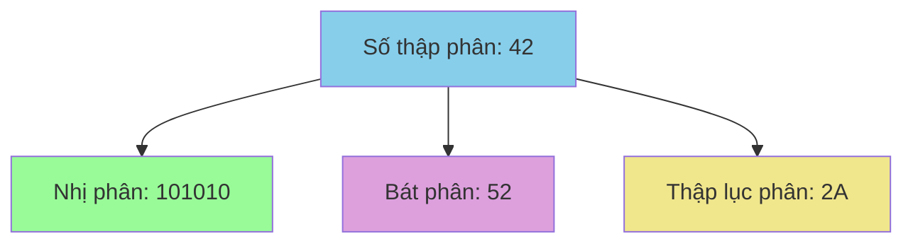
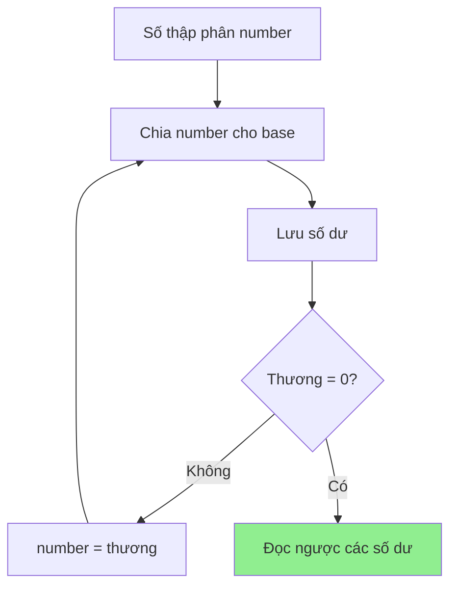
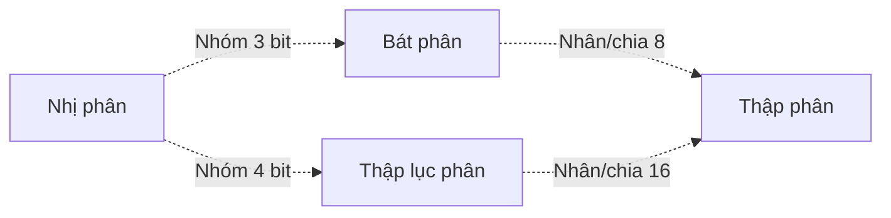

# Đổi cơ số - Từ thập phân sang nhị phân, bát phân, thập lục phân

Bạn có bao giờ tự hỏi tại sao máy tính chỉ hiểu được các số 0 và 1? Hay tại sao lập trình viên thường nói về các số như #FF0000 (màu đỏ)? Tất cả đều liên quan đến **hệ cơ số**! Hôm nay chúng ta sẽ khám phá cách chuyển đổi giữa các hệ cơ số một cách đơn giản và thú vị! 🌈

<!-- truncate -->

## 🔢 Hệ cơ số là gì?

:::info Định nghĩa
**Hệ cơ số** (Numeral System) là phương pháp biểu diễn các số bằng cách sử dụng một tập hợp các ký hiệu cố định.

- **Hệ thập phân** (base 10): 0,1,2,3,4,5,6,7,8,9
- **Hệ nhị phân** (base 2): 0,1
- **Hệ bát phân** (base 8): 0,1,2,3,4,5,6,7
- **Hệ thập lục phân** (base 16): 0,1,2,3,4,5,6,7,8,9,A,B,C,D,E,F
:::

Hãy tưởng tượng hệ cơ số như các ngôn ngữ khác nhau để đếm số. Giống như tiếng Việt và tiếng Anh cùng mô tả một sự vật nhưng dùng từ khác nhau, các hệ cơ số khác nhau cũng biểu diễn cùng một giá trị số!



## 🧮 Hiểu cách hoạt động của hệ cơ số

### Hệ thập phân (Base 10)
Số **1234** có nghĩa là:
```
1234₁₀ = 1×10³ + 2×10² + 3×10¹ + 4×10⁰
       = 1000 + 200 + 30 + 4 = 1234
```

### Hệ nhị phân (Base 2)
Số **1101** có nghĩa là:
```
1101₂ = 1×2³ + 1×2² + 0×2¹ + 1×2⁰
      = 8 + 4 + 0 + 1 = 13₁₀
```

### Hệ thập lục phân (Base 16)
Số **2A** có nghĩa là:
```
2A₁₆ = 2×16¹ + A×16⁰ = 2×16 + 10×1 = 42₁₀
```

## 🔄 Chuyển từ thập phân sang các hệ khác

### Thuật toán chia liên tiếp

Để chuyển từ thập phân sang hệ cơ số b, ta chia liên tiếp cho b và lấy các số dư:



## 🚀 Implementation: Chuyển từ thập phân

### C++:
```cpp
#include <iostream>
#include <string>
#include <algorithm>
using namespace std;

string decimalToBase(int decimal, int base) {
    if (decimal == 0) return "0";
    if (base < 2 || base > 16) return "Base khong hop le";
    
    string result = "";
    string digits = "0123456789ABCDEF";
    
    cout << "Chuyen doi " << decimal << " sang base " << base << ":" << endl;
    
    while (decimal > 0) {
        int remainder = decimal % base;
        cout << decimal << " ÷ " << base << " = " << decimal/base 
             << " du " << remainder << " (" << digits[remainder] << ")" << endl;
        
        result = digits[remainder] + result;
        decimal /= base;
    }
    
    return result;
}

void demonstrateConversion(int number) {
    cout << "\n=== CHUYEN DOI SO " << number << " ===" << endl;
    cout << "Thap phan: " << number << endl;
    cout << "Nhi phan: " << decimalToBase(number, 2) << endl;
    cout << "Bat phan: " << decimalToBase(number, 8) << endl;
    cout << "Thap luc phan: " << decimalToBase(number, 16) << endl;
}

int main() {
    int numbers[] = {42, 255, 1024};
    
    for (int num : numbers) {
        demonstrateConversion(num);
    }
    
    return 0;
}
```

### Python:
```python
def decimal_to_base(decimal, base):
    """
    Chuyển số thập phân sang hệ cơ số bất kỳ
    
    Args:
        decimal (int): Số thập phân cần chuyển
        base (int): Hệ cơ số đích (2-16)
        
    Returns:
        str: Chuỗi biểu diễn trong hệ cơ số mới
    """
    if decimal == 0:
        return "0"
    
    if base < 2 or base > 16:
        return "Base không hợp lệ"
    
    digits = "0123456789ABCDEF"
    result = ""
    original = decimal
    
    print(f"🔄 Chuyển đổi {decimal} sang base {base}:")
    
    steps = []
    while decimal > 0:
        remainder = decimal % base
        quotient = decimal // base
        
        step_info = {
            'decimal': decimal,
            'quotient': quotient,
            'remainder': remainder,
            'digit': digits[remainder]
        }
        steps.append(step_info)
        
        print(f"   {decimal} ÷ {base} = {quotient} dư {remainder} ({digits[remainder]})")
        
        result = digits[remainder] + result
        decimal = quotient
    
    print(f"📝 Đọc ngược các số dư: {result}")
    return result

def demonstrate_all_conversions(number):
    """Demo chuyển đổi sang tất cả các hệ phổ biến"""
    print(f"\n{'='*50}")
    print(f"🎯 CHUYỂN ĐỔI SỐ {number}")
    print(f"{'='*50}")
    
    bases_info = [
        (2, "Nhị phân (Binary)", "💻"),
        (8, "Bát phân (Octal)", "🐙"), 
        (16, "Thập lục phân (Hex)", "🎨")
    ]
    
    results = {}
    
    for base, name, emoji in bases_info:
        print(f"\n{emoji} {name}:")
        result = decimal_to_base(number, base)
        results[base] = result
        print(f"✅ {number}₁₀ = {result}₍{base}₎")
    
    # Verification using built-in functions
    print(f"\n🔍 Kiểm tra với hàm built-in:")
    print(f"   bin({number}) = {bin(number)} → {bin(number)[2:]}")
    print(f"   oct({number}) = {oct(number)} → {oct(number)[2:]}")
    print(f"   hex({number}) = {hex(number)} → {hex(number)[2:].upper()}")
    
    return results

# Demo với nhiều số
test_numbers = [42, 255, 1024, 2025]
for num in test_numbers:
    demonstrate_all_conversions(num)
```

### Java:
```java
public class BaseConverter {
    
    public static String decimalToBase(int decimal, int base) {
        if (decimal == 0) return "0";
        if (base < 2 || base > 16) return "Base không hợp lệ";
        
        String digits = "0123456789ABCDEF";
        StringBuilder result = new StringBuilder();
        
        System.out.println("🔄 Chuyển đổi " + decimal + " sang base " + base + ":");
        
        while (decimal > 0) {
            int remainder = decimal % base;
            int quotient = decimal / base;
            
            System.out.println("   " + decimal + " ÷ " + base + " = " + 
                             quotient + " dư " + remainder + " (" + digits.charAt(remainder) + ")");
            
            result.insert(0, digits.charAt(remainder));
            decimal = quotient;
        }
        
        System.out.println("📝 Kết quả: " + result.toString());
        return result.toString();
    }
    
    public static void demonstrateConversions(int number) {
        System.out.println("\n" + "=".repeat(50));
        System.out.println("🎯 CHUYỂN ĐỔI SỐ " + number);
        System.out.println("=".repeat(50));
        
        System.out.println("💻 Nhị phân:");
        String binary = decimalToBase(number, 2);
        
        System.out.println("\n🐙 Bát phân:");
        String octal = decimalToBase(number, 8);
        
        System.out.println("\n🎨 Thập lục phân:");
        String hex = decimalToBase(number, 16);
        
        // Verification
        System.out.println("\n🔍 Kiểm tra với hàm built-in:");
        System.out.println("   Integer.toBinaryString(" + number + ") = " + Integer.toBinaryString(number));
        System.out.println("   Integer.toOctalString(" + number + ") = " + Integer.toOctalString(number));
        System.out.println("   Integer.toHexString(" + number + ") = " + Integer.toHexString(number).toUpperCase());
    }
    
    public static void main(String[] args) {
        int[] testNumbers = {42, 255, 1024, 2025};
        
        for (int num : testNumbers) {
            demonstrateConversions(num);
        }
    }
}
```

## 🔙 Chuyển từ các hệ khác về thập phân

### Thuật toán Horner's Method

Để chuyển từ hệ cơ số b về thập phân, ta sử dụng công thức:

**Horner's Method:**
```
result = (((...(digit[n] × base + digit[n-1]) × base + digit[n-2]) × base + ...) + digit[1]) × base + digit[0]
```

### Python Implementation:
```python
def base_to_decimal(number_str, base):
    """
    Chuyển từ hệ cơ số bất kỳ về thập phân
    
    Args:
        number_str (str): Số ở dạng string
        base (int): Hệ cơ số gốc
        
    Returns:
        int: Giá trị thập phân
    """
    if base < 2 or base > 16:
        return "Base không hợp lệ"
    
    digits_map = {
        '0': 0, '1': 1, '2': 2, '3': 3, '4': 4, '5': 5,
        '6': 6, '7': 7, '8': 8, '9': 9, 'A': 10, 'B': 11,
        'C': 12, 'D': 13, 'E': 14, 'F': 15
    }
    
    number_str = number_str.upper()
    result = 0
    
    print(f"🔄 Chuyển {number_str}₍{base}₎ về thập phân:")
    
    # Method 1: Horner's method
    print("📘 Phương pháp Horner:")
    for i, digit in enumerate(number_str):
        digit_value = digits_map[digit]
        result = result * base + digit_value
        print(f"   Bước {i+1}: result = {result//base if i>0 else 0} × {base} + {digit_value} = {result}")
    
    # Method 2: Positional notation (for verification)
    print("\n📗 Phương pháp vị trí:")
    result2 = 0
    power = len(number_str) - 1
    calculation_steps = []
    
    for digit in number_str:
        digit_value = digits_map[digit]
        term = digit_value * (base ** power)
        calculation_steps.append(f"{digit_value}×{base}^{power}")
        result2 += term
        print(f"   {digit} → {digit_value} × {base}^{power} = {term}")
        power -= 1
    
    print(f"📝 Tổng: {' + '.join(calculation_steps)} = {result2}")
    
    return result

def comprehensive_conversion_demo():
    """Demo toàn diện về chuyển đổi cơ số"""
    
    test_cases = [
        ("1010", 2, "Nhị phân"),
        ("777", 8, "Bát phân"),  
        ("FF", 16, "Thập lục phân"),
        ("2A", 16, "Thập lục phân"),
        ("101010", 2, "Nhị phân")
    ]
    
    for number_str, base, base_name in test_cases:
        print(f"\n{'='*60}")
        print(f"🎯 {base_name}: {number_str}₍{base}₎")
        print('='*60)
        
        decimal_result = base_to_decimal(number_str, base)
        print(f"✅ Kết quả: {number_str}₍{base}₎ = {decimal_result}₁₀")
        
        # Verify by converting back
        print(f"\n🔄 Kiểm tra ngược:")
        back_conversion = decimal_to_base(decimal_result, base)
        print(f"   {decimal_result}₁₀ → {back_conversion}₍{base}₎")
        
        if back_conversion.upper() == number_str.upper():
            print("✅ Chính xác!")
        else:
            print("❌ Có lỗi!")

# Chạy demo
comprehensive_conversion_demo()
```

## 🎨 Ứng dụng thực tế

### 1. Màu sắc trong lập trình web
```python
def rgb_to_hex(r, g, b):
    """Chuyển RGB sang mã màu hex"""
    return f"#{r:02X}{g:02X}{b:02X}"

def hex_to_rgb(hex_color):
    """Chuyển mã hex sang RGB"""
    hex_color = hex_color.lstrip('#')
    return tuple(int(hex_color[i:i+2], 16) for i in (0, 2, 4))

# Demo màu sắc
print("🎨 CHUYỂN ĐỔI MÀU SẮC")
print("="*40)

colors = [
    (255, 0, 0, "Đỏ"),
    (0, 255, 0, "Xanh lá"),
    (0, 0, 255, "Xanh dương"),
    (255, 255, 0, "Vàng"),
    (128, 0, 128, "Tím")
]

for r, g, b, name in colors:
    hex_code = rgb_to_hex(r, g, b)
    back_to_rgb = hex_to_rgb(hex_code)
    print(f"{name:12} RGB({r:3},{g:3},{b:3}) → {hex_code} → {back_to_rgb}")
```

### 2. Xử lý bit trong lập trình
```cpp
#include <iostream>
#include <bitset>
using namespace std;

void demonstrateBitOperations(int a, int b) {
    cout << "🔧 THAO TÁC BIT" << endl;
    cout << "===============" << endl;
    
    cout << "a = " << a << " (binary: " << bitset<8>(a) << ")" << endl;
    cout << "b = " << b << " (binary: " << bitset<8>(b) << ")" << endl;
    cout << endl;
    
    cout << "a & b = " << (a & b) << " (binary: " << bitset<8>(a & b) << ") - AND" << endl;
    cout << "a | b = " << (a | b) << " (binary: " << bitset<8>(a | b) << ") - OR" << endl;
    cout << "a ^ b = " << (a ^ b) << " (binary: " << bitset<8>(a ^ b) << ") - XOR" << endl;
    cout << "~a    = " << (~a & 0xFF) << " (binary: " << bitset<8>(~a) << ") - NOT" << endl;
}

int main() {
    demonstrateBitOperations(42, 27);
    return 0;
}
```

## 📊 So sánh các hệ cơ số phổ biến

| Hệ cơ số | Ký hiệu | Ứng dụng | Ưu điểm | Nhược điểm |
|----------|---------|----------|---------|------------|
| **Nhị phân (2)** | 0,1 | Máy tính, logic | Đơn giản cho máy | Dài, khó đọc |
| **Bát phân (8)** | 0-7 | Quyền Unix, cũ | Ngắn gọn hơn nhị phân | Ít dùng hiện tại |
| **Thập phân (10)** | 0-9 | Đời sống hàng ngày | Quen thuộc | Không tối ưu cho máy |
| **Thập lục phân (16)** | 0-9,A-F | Địa chỉ bộ nhớ, màu sắc | Compact, dễ convert với binary | Cần học thêm A-F |

## 🎯 Mẹo nhớ và tính nhanh

### Quy tắc chuyển đổi nhanh:



**Ví dụ nhanh:**
- `11111111₂` = `377₈` = `FF₁₆` = `255₁₀`
- `1010₂` = `12₈` = `A₁₆` = `10₁₀`

### Bảng chuyển đổi nhanh:

| Thập phân | Nhị phân | Bát phân | Hex |
|-----------|----------|----------|-----|
| 0 | 0000 | 0 | 0 |
| 1 | 0001 | 1 | 1 |
| 8 | 1000 | 10 | 8 |
| 15 | 1111 | 17 | F |
| 16 | 10000 | 20 | 10 |

## 🏃‍♂️ Bài tập thực hành

:::note Thử thách
1. **Cơ bản:** Chuyển đổi 2025 sang tất cả các hệ cơ số
2. **Trung bình:** Viết calculator chuyển đổi cơ số với giao diện đẹp
3. **Khó:** Implement chuyển đổi cho hệ cơ số bất kỳ (2-36)
4. **Thách thức:** Tạo game đoán số ở các hệ cơ số khác nhau
:::

### Bài tập mẫu - Calculator cơ số:

```python
class BaseCalculator:
    def __init__(self):
        self.digits = "0123456789ABCDEFGHIJKLMNOPQRSTUVWXYZ"
    
    def convert(self, number, from_base, to_base):
        """Chuyển đổi giữa hai hệ cơ số bất kỳ"""
        # Chuyển về thập phân trước
        decimal = self.to_decimal(number, from_base)
        
        # Chuyển từ thập phân sang hệ đích
        return self.from_decimal(decimal, to_base)
    
    def to_decimal(self, number_str, base):
        """Chuyển về thập phân"""
        result = 0
        for digit in number_str.upper():
            result = result * base + self.digits.index(digit)
        return result
    
    def from_decimal(self, decimal, base):
        """Chuyển từ thập phân"""
        if decimal == 0:
            return "0"
        
        result = ""
        while decimal > 0:
            result = self.digits[decimal % base] + result
            decimal //= base
        return result

# Demo
calc = BaseCalculator()
print("🧮 BASE CALCULATOR")
print("Chuyển đổi 2025₁₀ sang:")
print(f"  Binary (2):      {calc.from_decimal(2025, 2)}")
print(f"  Octal (8):       {calc.from_decimal(2025, 8)}")
print(f"  Hexadecimal(16): {calc.from_decimal(2025, 16)}")
print(f"  Base 36:         {calc.from_decimal(2025, 36)}")
```

## 🎯 Kết luận

Chuyển đổi cơ số là kỹ năng cần thiết trong lập trình và khoa học máy tính. Chúng ta đã học được:

1. **Nguyên lý hoạt động** của các hệ cơ số khác nhau
2. **Thuật toán chuyển đổi** từ thập phân sang các hệ khác và ngược lại
3. **Ứng dụng thực tế** trong màu sắc, xử lý bit, địa chỉ bộ nhớ
4. **Mẹo và bảng tra cứu** để tính nhanh

Hiểu rõ về hệ cơ số sẽ giúp bạn:
- 💻 Làm việc hiệu quả với bit manipulation
- 🎨 Xử lý màu sắc trong web development  
- 🔧 Debug các vấn đề low-level
- 📚 Nắm vững computer architecture

Hãy thực hành với các bài tập để thành thạo kỹ năng này! 🚀

---

**Tags:** #basics #base-conversion #math #algorithms #binary #hexadecimal #computer-science
