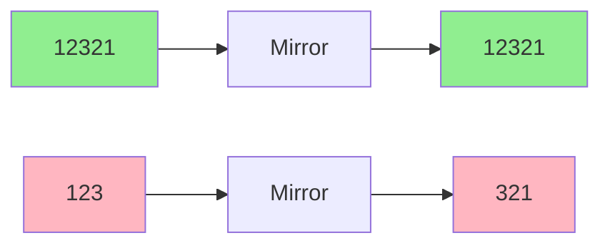
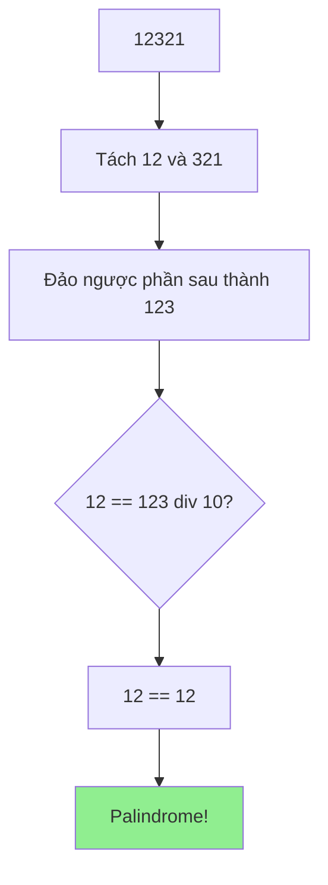
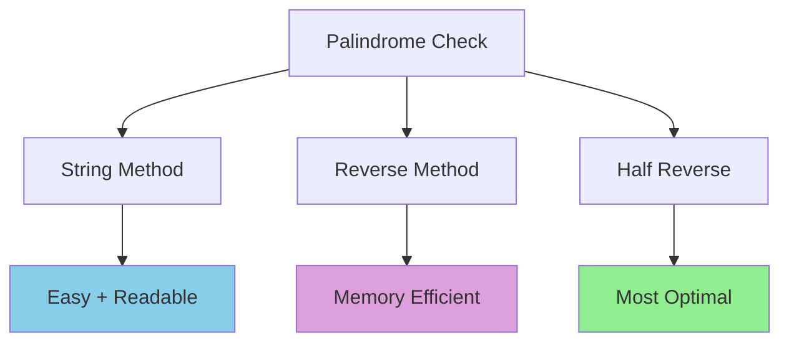

# Kiểm tra số đối xứng (Palindrome Number) - Nhiều cách tiếp cận

Bạn có nhận ra rằng số **12321** hay **1221** có điểm gì đặc biệt không? Chúng đọc từ trái sang phải cũng giống như đọc từ phải sang trái! Đó chính là **số đối xứng** (palindrome number) - một khái niệm thú vị trong toán học và lập trình. Hôm nay chúng ta sẽ khám phá các cách khác nhau để kiểm tra số palindrome! 🔄

<!-- truncate -->

## 🪞 Số đối xứng là gì?

:::info Định nghĩa
**Số đối xứng** (Palindrome Number) là số nguyên mà khi đọc từ trái sang phải hay từ phải sang trái đều cho cùng một giá trị.

**Ví dụ:** 121, 1221, 12321, 7, 0, 9009...
:::

Hãy tưởng tượng số đối xứng như một chiếc gương. Khi bạn soi số đó vào gương, hình ảnh phản chiếu sẽ giống hệt bản gốc!



### Các ví dụ minh họa:

**Số đối xứng:**
- 7 → 7 ✅
- 121 → 121 ✅  
- 1221 → 1221 ✅
- 12321 → 12321 ✅

**Không phải số đối xứng:**
- 123 → 321 ❌
- -121 → -121 (số âm thường không được coi là palindrome) ❌
- 1230 → 0321 ❌

## 📊 Phân tích bài toán

**Input:** Một số nguyên n
**Output:** True nếu n là số đối xứng, False nếu ngược lại

**Các trường hợp cần xem xét:**
- Số âm: Thông thường không phải palindrome
- Số có một chữ số: Luôn là palindrome
- Số kết thúc bằng 0: Chỉ số 0 là palindrome

## 🚀 Giải pháp 1: Chuyển thành chuỗi

Cách đơn giản nhất là chuyển số thành string và kiểm tra đối xứng.

### C++:
```cpp
#include <iostream>
#include <string>
#include <algorithm>
using namespace std;

bool isPalindromeString(int x) {
    // Xử lý số âm
    if (x < 0) {
        cout << x << " la so am -> khong phai palindrome" << endl;
        return false;
    }
    
    // Chuyển thành string
    string str = to_string(x);
    string reversed = str;
    reverse(reversed.begin(), reversed.end());
    
    cout << "So goc: " << str << endl;
    cout << "Dao nguoc: " << reversed << endl;
    
    bool result = (str == reversed);
    cout << "Ket qua: " << (result ? "Palindrome" : "Khong phai palindrome") << endl;
    
    return result;
}

// Cách 2: Kiểm tra từng ký tự
bool isPalindromeStringOptimized(int x) {
    if (x < 0) return false;
    
    string str = to_string(x);
    int left = 0, right = str.length() - 1;
    
    cout << "Kiem tra tung cap ky tu cua " << str << ":" << endl;
    
    while (left < right) {
        cout << "So sanh str[" << left << "] = '" << str[left] 
             << "' voi str[" << right << "] = '" << str[right] << "'";
        
        if (str[left] != str[right]) {
            cout << " -> Khac nhau!" << endl;
            return false;
        }
        
        cout << " -> Giong nhau!" << endl;
        left++;
        right--;
    }
    
    cout << "Tat ca cac cap deu giong nhau -> Palindrome!" << endl;
    return true;
}

int main() {
    vector<int> testNumbers = {121, 123, 1221, 12321, -121, 0, 7};
    
    for (int num : testNumbers) {
        cout << "\n=== Kiem tra so " << num << " ===" << endl;
        cout << "Phuong phap 1 - Dao nguoc string:" << endl;
        isPalindromeString(num);
        
        cout << "\nPhuong phap 2 - Kiem tra tung ky tu:" << endl;
        isPalindromeStringOptimized(num);
        cout << endl;
    }
    
    return 0;
}
```

### Python:
```python
def is_palindrome_string(x):
    """
    Kiểm tra palindrome bằng cách chuyển thành string
    
    Args:
        x (int): Số cần kiểm tra
    
    Returns:
        bool: True nếu là palindrome, False nếu ngược lại
    """
    if x < 0:
        print(f"❌ {x} là số âm → không phải palindrome")
        return False
    
    str_x = str(x)
    reversed_x = str_x[::-1]
    
    print(f"📝 Số gốc:     '{str_x}'")
    print(f"🔄 Đảo ngược:  '{reversed_x}'")
    
    is_palindrome = str_x == reversed_x
    print(f"🎯 Kết quả:    {'Palindrome' if is_palindrome else 'Không phải palindrome'}")
    
    return is_palindrome

def is_palindrome_two_pointers(x):
    """
    Kiểm tra palindrome bằng two pointers trên string
    """
    if x < 0:
        return False
    
    str_x = str(x)
    left, right = 0, len(str_x) - 1
    
    print(f"🔍 Kiểm tra từng cặp ký tự của '{str_x}':")
    
    while left < right:
        print(f"   Vị trí {left} ('{str_x[left]}') vs vị trí {right} ('{str_x[right]}') → ", end="")
        
        if str_x[left] != str_x[right]:
            print("❌ Khác nhau!")
            return False
        
        print("✅ Giống nhau!")
        left += 1
        right -= 1
    
    print("🎉 Tất cả các cặp đều giống nhau → Palindrome!")
    return True

def demonstrate_string_methods():
    """Demo các phương pháp dựa trên string"""
    
    test_numbers = [121, 123, 1221, 12321, -121, 0, 7, 9009]
    
    for num in test_numbers:
        print(f"\n{'='*50}")
        print(f"🎯 KIỂM TRA SỐ {num}")
        print(f"{'='*50}")
        
        print("📖 Phương pháp 1 - Đảo ngược string:")
        result1 = is_palindrome_string(num)
        
        print("\n🎯 Phương pháp 2 - Two pointers:")
        result2 = is_palindrome_two_pointers(num)
        
        print(f"\n🔍 So sánh kết quả:")
        print(f"   Method 1: {result1}")
        print(f"   Method 2: {result2}")
        
        if result1 == result2:
            print("✅ Hai phương pháp cho kết quả giống nhau!")
        else:
            print("❌ Có sự khác biệt trong kết quả!")

# Chạy demo
demonstrate_string_methods()
```

## ⚡ Giải pháp 2: Đảo ngược số (không dùng string)

Phương pháp này hiệu quả hơn về mặt bộ nhớ vì không cần chuyển thành string.

### Python Implementation:
```python
def reverse_number(x):
    """
    Đảo ngược một số nguyên
    
    Args:
        x (int): Số cần đảo ngược
    
    Returns:
        int: Số đã được đảo ngược
    """
    if x < 0:
        return -1  # Hoặc raise exception
    
    reversed_num = 0
    original = x
    
    print(f"🔄 Đảo ngược số {x}:")
    
    while x > 0:
        digit = x % 10  # Lấy chữ số cuối
        reversed_num = reversed_num * 10 + digit  # Thêm vào số đảo ngược
        
        print(f"   {x} → chữ số: {digit}, reversed: {reversed_num}")
        
        x //= 10  # Bỏ chữ số cuối
    
    print(f"📝 Kết quả: {original} đảo ngược thành {reversed_num}")
    return reversed_num

def is_palindrome_reverse(x):
    """
    Kiểm tra palindrome bằng cách đảo ngược số
    """
    print(f"🎯 Kiểm tra palindrome của {x}")
    
    if x < 0:
        print("❌ Số âm không phải palindrome")
        return False
    
    if x < 10:
        print("✅ Số có 1 chữ số luôn là palindrome")
        return True
    
    reversed_x = reverse_number(x)
    
    is_palindrome = (x == reversed_x)
    print(f"🔍 So sánh: {x} == {reversed_x} → {is_palindrome}")
    
    return is_palindrome

def demonstrate_reverse_method():
    """Demo phương pháp đảo ngược số"""
    
    test_numbers = [121, 123, 1221, 12321, 7, 0, 9009, 1234321]
    
    for num in test_numbers:
        print(f"\n{'='*60}")
        print(f"🎯 KIỂM TRA SỐ {num} (PHƯƠNG PHÁP ĐẢO NGƯỢC)")
        print(f"{'='*60}")
        
        result = is_palindrome_reverse(num)
        print(f"🎯 Kết quả cuối cùng: {'Palindrome' if result else 'Không phải palindrome'}")

# Chạy demo
demonstrate_reverse_method()
```

### Java:
```java
public class PalindromeChecker {
    
    public static int reverseNumber(int x) {
        System.out.println("🔄 Đảo ngược số " + x + ":");
        
        int reversed = 0;
        int original = x;
        
        while (x > 0) {
            int digit = x % 10;
            reversed = reversed * 10 + digit;
            
            System.out.println("   " + x + " → chữ số: " + digit + ", reversed: " + reversed);
            
            x /= 10;
        }
        
        System.out.println("📝 Kết quả: " + original + " đảo ngược thành " + reversed);
        return reversed;
    }
    
    public static boolean isPalindromeReverse(int x) {
        System.out.println("🎯 Kiểm tra palindrome của " + x);
        
        if (x < 0) {
            System.out.println("❌ Số âm không phải palindrome");
            return false;
        }
        
        if (x < 10) {
            System.out.println("✅ Số có 1 chữ số luôn là palindrome");
            return true;
        }
        
        int reversed = reverseNumber(x);
        boolean isPalindrome = (x == reversed);
        
        System.out.println("🔍 So sánh: " + x + " == " + reversed + " → " + isPalindrome);
        
        return isPalindrome;
    }
    
    public static void main(String[] args) {
        int[] testNumbers = {121, 123, 1221, 12321, 7, 0, 9009, 1234321};
        
        for (int num : testNumbers) {
            System.out.println("\n" + "=".repeat(60));
            System.out.println("🎯 KIỂM TRA SỐ " + num + " (PHƯƠNG PHÁP ĐẢO NGƯỢC)");
            System.out.println("=".repeat(60));
            
            boolean result = isPalindromeReverse(num);
            System.out.println("🎯 Kết quả cuối cùng: " + 
                             (result ? "Palindrome" : "Không phải palindrome"));
        }
    }
}
```

## 🧠 Giải pháp 3: Tối ưu - chỉ kiểm tra nửa số

Chúng ta có thể tối ưu bằng cách chỉ đảo ngược nửa số và so sánh.



### Python (Optimized):
```python
def is_palindrome_half_reverse(x):
    """
    Kiểm tra palindrome bằng cách chỉ đảo ngược nửa số
    - Tối ưu về thời gian và không có nguy cơ overflow
    
    Args:
        x (int): Số cần kiểm tra
    
    Returns:
        bool: True nếu là palindrome
    """
    print(f"🎯 Kiểm tra palindrome của {x} (phương pháp tối ưu)")
    
    # Xử lý các trường hợp đặc biệt
    if x < 0:
        print("❌ Số âm không phải palindrome")
        return False
    
    if x < 10:
        print("✅ Số có 1 chữ số luôn là palindrome")
        return True
        
    # Số kết thúc bằng 0 (trừ số 0) không thể là palindrome
    if x % 10 == 0:
        print("❌ Số kết thúc bằng 0 (trừ số 0) không phải palindrome")
        return False
    
    reversed_half = 0
    original_x = x
    step = 1
    
    print(f"📝 Bắt đầu quá trình:")
    print(f"{'Bước':<5} {'x':<10} {'reversed_half':<15} {'Điều kiện':<15}")
    print("-" * 50)
    
    # Tiếp tục cho đến khi x <= reversed_half
    # Có nghĩa là chúng ta đã xử lý hơn nửa số
    while x > reversed_half:
        digit = x % 10
        reversed_half = reversed_half * 10 + digit
        x //= 10
        
        condition = f"{x} > {reversed_half}"
        print(f"{step:<5} {x:<10} {reversed_half:<15} {condition:<15}")
        step += 1
    
    print(f"\n🔍 Phân tích kết quả:")
    
    # Với số có độ dài lẻ: x == reversed_half // 10
    # Với số có độ dài chẵn: x == reversed_half
    if len(str(original_x)) % 2 == 1:
        print(f"   Số có độ dài lẻ: so sánh {x} với {reversed_half // 10}")
        result = x == reversed_half // 10
    else:
        print(f"   Số có độ dài chẵn: so sánh {x} với {reversed_half}")
        result = x == reversed_half
    
    print(f"🎯 Kết quả: {'Palindrome' if result else 'Không phải palindrome'}")
    return result

def demonstrate_optimized_method():
    """Demo phương pháp tối ưu"""
    
    test_cases = [
        (121, "Số lẻ - palindrome"),
        (1221, "Số chẵn - palindrome"),
        (12321, "Số lẻ - palindrome"), 
        (123, "Số lẻ - không palindrome"),
        (1234, "Số chẵn - không palindrome"),
        (7, "Một chữ số"),
        (0, "Số 0"),
        (10, "Kết thúc bằng 0"),
        (-121, "Số âm")
    ]
    
    for num, description in test_cases:
        print(f"\n{'='*60}")
        print(f"🎯 {description.upper()}: {num}")
        print(f"{'='*60}")
        
        result = is_palindrome_half_reverse(num)
        
        # Verification với phương pháp string
        verification = str(num) == str(num)[::-1] if num >= 0 else False
        print(f"\n🔍 Kiểm tra với phương pháp string: {verification}")
        
        if result == verification:
            print("✅ Hai phương pháp cho kết quả giống nhau!")
        else:
            print("❌ Có sự khác biệt - cần kiểm tra lại!")

# Chạy demo
demonstrate_optimized_method()
```

## 🎮 Ứng dụng thực tế và mở rộng

### 1. Palindrome trong các hệ cơ số khác

```python
def is_palindrome_base(n, base):
    """
    Kiểm tra palindrome trong hệ cơ số bất kỳ
    
    Args:
        n (int): Số cần kiểm tra
        base (int): Hệ cơ số
    
    Returns:
        bool: True nếu là palindrome trong hệ cơ số đó
    """
    if n < 0:
        return False
    
    # Chuyển sang hệ cơ số base
    digits = []
    temp = n
    
    if temp == 0:
        digits = [0]
    else:
        while temp > 0:
            digits.append(temp % base)
            temp //= base
    
    # digits hiện tại đã bị đảo ngược, ta cần đảo lại
    digits = digits[::-1]
    
    print(f"Số {n} trong hệ cơ số {base}: {digits}")
    
    # Kiểm tra palindrome
    return digits == digits[::-1]

def demonstrate_base_palindrome():
    """Demo palindrome trong các hệ cơ số khác"""
    
    test_numbers = [9, 15, 17, 21, 33]
    bases = [2, 8, 16]
    
    for num in test_numbers:
        print(f"\n🎯 Số {num}:")
        for base in bases:
            result = is_palindrome_base(num, base)
            print(f"   Hệ {base}: {'Palindrome' if result else 'Không palindrome'}")

demonstrate_base_palindrome()
```

### 2. Tìm số palindrome tiếp theo

```python
def next_palindrome(n):
    """
    Tìm số palindrome nhỏ nhất lớn hơn n
    
    Args:
        n (int): Số ban đầu
    
    Returns:
        int: Số palindrome tiếp theo
    """
    def is_palindrome(x):
        return str(x) == str(x)[::-1]
    
    candidate = n + 1
    
    print(f"🔍 Tìm palindrome tiếp theo sau {n}:")
    
    while not is_palindrome(candidate):
        if candidate % 1000 == 0:  # In progress mỗi 1000 số
            print(f"   Đang kiểm tra: {candidate}")
        candidate += 1
    
    print(f"✅ Tìm thấy: {candidate}")
    return candidate

# Demo
test_numbers = [121, 200, 999, 1991]
for num in test_numbers:
    next_pal = next_palindrome(num)
    print(f"Palindrome tiếp theo sau {num}: {next_pal}\n")
```

## 📊 So sánh các phương pháp

| Phương pháp | Time Complexity | Space Complexity | Ưu điểm | Nhược điểm |
|-------------|----------------|------------------|---------|------------|
| **String Conversion** | O(log n) | O(log n) | Đơn giản, dễ hiểu | Tốn bộ nhớ |
| **Reverse Number** | O(log n) | O(1) | Không dùng string | Có thể overflow |
| **Half Reverse** | O(log n) | O(1) | Tối ưu, không overflow | Phức tạp hơn |



## 🏃‍♂️ Bài tập thực hành

:::note Thử thách
1. **Cơ bản:** Tìm tất cả palindrome từ 1 đến 1000
2. **Trung bình:** Kiểm tra palindrome cho số thực (double)
3. **Khó:** Tìm palindrome lớn nhất là tích của hai số n chữ số
4. **Thách thức:** Đếm số palindrome trong khoảng [a, b] mà không kiểm tra từng số
:::

### Bài tập mẫu - Palindrome lớn nhất:

```python
def largest_palindrome_product(n):
    """
    Tìm palindrome lớn nhất là tích của hai số n chữ số
    
    Ví dụ: n=2 → tìm palindrome lớn nhất từ tích 10-99
    """
    if n == 1:
        return 9  # 3 * 3 = 9
    
    # Giới hạn trên và dưới cho số n chữ số
    upper = 10**n - 1  # 99, 999, 9999...
    lower = 10**(n-1)  # 10, 100, 1000...
    
    max_palindrome = 0
    
    print(f"🎯 Tìm palindrome lớn nhất từ tích hai số {n} chữ số")
    print(f"📊 Phạm vi: {lower} - {upper}")
    
    for i in range(upper, lower - 1, -1):
        for j in range(i, lower - 1, -1):  # j >= i để tránh lặp
            product = i * j
            
            # Nếu product nhỏ hơn max_palindrome hiện tại,
            # không cần kiểm tra nữa vì i đang giảm dần
            if product <= max_palindrome:
                break
            
            if str(product) == str(product)[::-1]:
                max_palindrome = product
                print(f"✅ Tìm thấy: {i} × {j} = {product}")
                break
    
    return max_palindrome

# Test
for n in range(1, 4):
    result = largest_palindrome_product(n)
    print(f"Palindrome lớn nhất với {n} chữ số: {result}\n")
```

## 🎯 Kết luận

Kiểm tra số palindrome là một bài toán kinh điển giúp rèn luyện tư duy thuật toán. Chúng ta đã học được:

1. **Ba phương pháp chính**: String conversion, reverse number, và half reverse
2. **Tối ưu hóa**: Từ đơn giản đến hiệu quả nhất
3. **Xử lý edge cases**: Số âm, số 0, số kết thúc bằng 0
4. **Mở rộng ứng dụng**: Palindrome trong các hệ cơ số khác, tìm palindrome tiếp theo

Kỹ năng này sẽ giúp bạn:
- 🧮 Xử lý các bài toán về chuỗi và số
- 🚀 Tối ưu hóa thuật toán một cách thông minh  
- 🎯 Giải quyết các bài competitive programming
- 🔄 Hiểu sâu hơn về tính đối xứng trong toán học

Hãy thực hành với các bài tập để nắm vững kỹ thuật tuyệt vời này! 🌟

---

**Tags:** #basics #palindrome #number #algorithms #string-manipulation #optimization #competitive-programming
