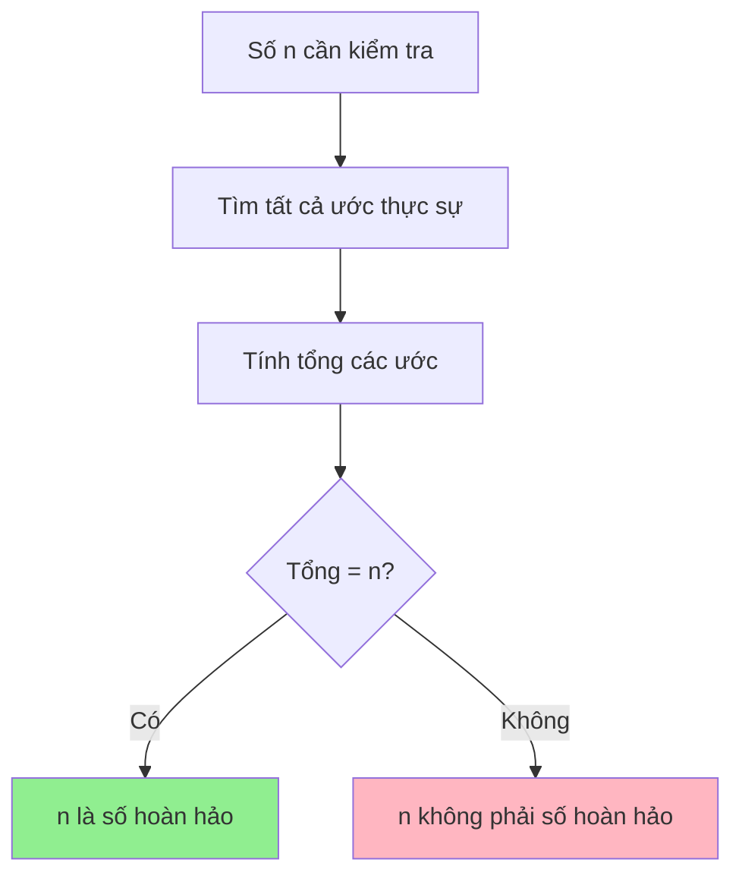
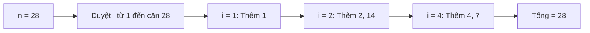
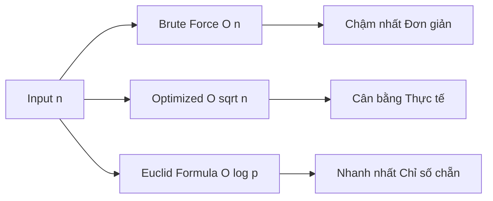

# Kiểm tra số hoàn hảo - Số bằng tổng các ước của nó

Bạn có biết rằng có những con số đặc biệt mà tổng tất cả các ước của chúng (trừ chính nó) lại bằng chính số đó? Ví dụ như số 6 = 1 + 2 + 3, hay số 28 = 1 + 2 + 4 + 7 + 14? Đó chính là những **số hoàn hảo** - một trong những khái niệm toán học đẹp đẽ nhất!

<!-- truncate -->

## 🌟 Số hoàn hảo là gì?

:::info Định nghĩa
**Số hoàn hảo** (Perfect Number) là số nguyên dương bằng tổng tất cả các ước thực sự (proper divisors) của nó.

**Ước thực sự** của một số n là tất cả các ước số của n ngoại trừ chính n.
:::

Hãy tưởng tượng bạn có một món quà và muốn chia đều cho bạn bè. Nếu số quà có thể chia đều thành các phần nhỏ, và khi cộng tất cả các cách chia đó lại thì được đúng số quà ban đầu, thì đó chính là một số hoàn hảo!

### Ví dụ minh họa:

**Số 6:**
- Các ước của 6: 1, 2, 3, 6
- Các ước thực sự: 1, 2, 3 (loại bỏ 6)
- Tổng: 1 + 2 + 3 = 6 ✅

**Số 28:**
- Các ước của 28: 1, 2, 4, 7, 14, 28
- Các ước thực sự: 1, 2, 4, 7, 14
- Tổng: 1 + 2 + 4 + 7 + 14 = 28 ✅



## 📊 Phân tích bài toán

**Input:** Một số nguyên dương n (n ≥ 1)
**Output:** True nếu n là số hoàn hảo, False nếu ngược lại

**Các trường hợp đặc biệt:**
- n = 1: Không có ước thực sự nào → Không phải số hoàn hảo
- n là số nguyên tố: Chỉ có ước thực sự là 1 → Không phải số hoàn hảo (trừ khi n = 1)

## 🔍 Giải pháp 1: Thuật toán cơ bản (Brute Force)

Cách đơn giản nhất là duyệt từ 1 đến n-1 để tìm tất cả các ước thực sự.

### Implementation:

**C++:**
```cpp
#include <iostream>
#include <vector>
using namespace std;

bool isPerfectNumberBasic(int n) {
    if (n <= 1) return false;
    
    int sum = 0;
    vector<int> divisors;
    
    // Tìm tất cả ước thực sự
    for (int i = 1; i < n; i++) {
        if (n % i == 0) {
            sum += i;
            divisors.push_back(i);
        }
    }
    
    // In ra các ước để kiểm tra
    cout << "Cac uoc thuc su cua " << n << ": ";
    for (int i = 0; i < divisors.size(); i++) {
        cout << divisors[i];
        if (i < divisors.size() - 1) cout << " + ";
    }
    cout << " = " << sum << endl;
    
    return sum == n;
}

int main() {
    vector<int> testNumbers = {6, 28, 12, 496};
    
    for (int num : testNumbers) {
        cout << "\n=== Kiem tra so " << num << " ===" << endl;
        if (isPerfectNumberBasic(num)) {
            cout << num << " la so hoan hao!" << endl;
        } else {
            cout << num << " khong phai so hoan hao." << endl;
        }
    }
    
    return 0;
}
```

**Python:**
```python
def is_perfect_number_basic(n):
    """
    Kiểm tra số hoàn hảo bằng phương pháp cơ bản
    
    Args:
        n (int): Số cần kiểm tra
        
    Returns:
        bool: True nếu n là số hoàn hảo, False nếu ngược lại
    """
    if n <= 1:
        return False
    
    divisors = []
    
    # Tìm tất cả ước thực sự
    for i in range(1, n):
        if n % i == 0:
            divisors.append(i)
    
    sum_divisors = sum(divisors)
    
    # In ra các ước để kiểm tra
    print(f"Các ước thực sự của {n}: {' + '.join(map(str, divisors))} = {sum_divisors}")
    
    return sum_divisors == n

# Test với các số khác nhau
test_numbers = [6, 28, 12, 496, 8128]

for num in test_numbers:
    print(f"\n=== Kiểm tra số {num} ===")
    if is_perfect_number_basic(num):
        print(f"{num} là số hoàn hảo! 🎉")
    else:
        print(f"{num} không phải số hoàn hảo. ❌")
```

**Java:**
```java
import java.util.ArrayList;
import java.util.List;

public class PerfectNumberChecker {
    
    public static boolean isPerfectNumberBasic(int n) {
        if (n <= 1) return false;
        
        List<Integer> divisors = new ArrayList<>();
        int sum = 0;
        
        // Tìm tất cả ước thực sự
        for (int i = 1; i < n; i++) {
            if (n % i == 0) {
                divisors.add(i);
                sum += i;
            }
        }
        
        // In ra các ước để kiểm tra
        System.out.print("Các ước thực sự của " + n + ": ");
        for (int i = 0; i < divisors.size(); i++) {
            System.out.print(divisors.get(i));
            if (i < divisors.size() - 1) System.out.print(" + ");
        }
        System.out.println(" = " + sum);
        
        return sum == n;
    }
    
    public static void main(String[] args) {
        int[] testNumbers = {6, 28, 12, 496};
        
        for (int num : testNumbers) {
            System.out.println("\n=== Kiểm tra số " + num + " ===");
            if (isPerfectNumberBasic(num)) {
                System.out.println(num + " là số hoàn hảo! 🎉");
            } else {
                System.out.println(num + " không phải số hoàn hảo. ❌");
            }
        }
    }
}
```

:::tip Phân tích độ phức tạp
- **Time Complexity:** O(n) - Duyệt từ 1 đến n-1
- **Space Complexity:** O(k) - k là số lượng ước thực sự
:::

## ⚡ Giải pháp 2: Tối ưu hóa với căn bậc hai

Chúng ta có thể tối ưu bằng cách chỉ duyệt từ 1 đến √n, vì các ước luôn xuất hiện theo cặp.



**Python (tối ưu):**
```python
import math

def is_perfect_number_optimized(n):
    """
    Kiểm tra số hoàn hảo bằng phương pháp tối ưu
    
    Args:
        n (int): Số cần kiểm tra
        
    Returns:
        bool: True nếu n là số hoàn hảo, False nếu ngược lại
    """
    if n <= 1:
        return False
    
    divisors = [1]  # 1 luôn là ước của mọi số > 1
    sum_divisors = 1
    
    # Duyệt từ 2 đến √n
    sqrt_n = int(math.sqrt(n))
    for i in range(2, sqrt_n + 1):
        if n % i == 0:
            divisors.append(i)
            sum_divisors += i
            
            # Thêm ước cặp (trừ khi i = √n để tránh thêm 2 lần)
            partner = n // i
            if partner != i and partner != n:  # Không thêm chính n
                divisors.append(partner)
                sum_divisors += partner
    
    divisors.sort()
    print(f"Các ước thực sự của {n}: {' + '.join(map(str, divisors))} = {sum_divisors}")
    
    return sum_divisors == n

# Demo với visualization
def demonstrate_perfect_numbers():
    """Minh họa cách tìm số hoàn hảo"""
    print("🔍 KHÁM PHÁ CÁC SỐ HOÀN HẢO\n")
    
    # Tìm tất cả số hoàn hảo từ 1 đến 10000
    perfect_numbers = []
    
    for i in range(1, 10001):
        if is_perfect_number_optimized(i):
            perfect_numbers.append(i)
    
    print(f"\n🎯 Các số hoàn hảo từ 1 đến 10000:")
    for pn in perfect_numbers:
        print(f"   • {pn}")
    
    print(f"\nTổng cộng tìm được {len(perfect_numbers)} số hoàn hảo!")
    
    return perfect_numbers

# Chạy demo
perfect_nums = demonstrate_perfect_numbers()
```

## 🧮 Giải pháp 3: Sử dụng công thức Euclid

Euclid đã phát hiện ra công thức để tạo ra số hoàn hảo chẵn:

:::note Công thức Euclid
Nếu p là số nguyên tố và 2^p - 1 cũng là số nguyên tố, thì:
**n = 2^(p-1) × (2^p - 1)** là một số hoàn hảo.
:::

**Python (Euclid Method):**
```python
def is_prime(n):
    """Kiểm tra số nguyên tố"""
    if n < 2:
        return False
    for i in range(2, int(n**0.5) + 1):
        if n % i == 0:
            return False
    return True

def generate_perfect_numbers_euclid(limit):
    """
    Tạo số hoàn hảo bằng công thức Euclid
    
    Args:
        limit (int): Giới hạn trên để tìm số hoàn hảo
        
    Returns:
        list: Danh sách các số hoàn hảo
    """
    perfect_numbers = []
    p = 2
    
    while True:
        if is_prime(p):
            mersenne = (2 ** p) - 1
            if is_prime(mersenne):  # Số nguyên tố Mersenne
                perfect_num = (2 ** (p - 1)) * mersenne
                
                if perfect_num > limit:
                    break
                    
                perfect_numbers.append(perfect_num)
                print(f"p = {p}, 2^{p} - 1 = {mersenne} (nguyên tố)")
                print(f"Số hoàn hảo: 2^{p-1} × {mersenne} = {perfect_num}")
                print()
        
        p += 1
        
        # Tránh vòng lặp vô hạn
        if p > 20:
            break
    
    return perfect_numbers

# Demo
print("🧮 TẠO SỐ HOÀN HẢO BẰNG CÔNG THỨC EUCLID\n")
euclid_perfects = generate_perfect_numbers_euclid(10000)
print(f"Các số hoàn hảo tìm được: {euclid_perfects}")
```

## 📈 So sánh hiệu suất các phương pháp



| Phương pháp | Time Complexity | Space Complexity | Ưu điểm | Nhược điểm |
|-------------|----------------|------------------|---------|------------|
| Brute Force | O(n) | O(k) | Đơn giản, dễ hiểu | Chậm với số lớn |
| Optimized | O(√n) | O(k) | Nhanh hơn, vẫn đơn giản | Phức tạp hơn một chút |
| Euclid Formula | O(log p) | O(1) | Rất nhanh | Chỉ tìm được số hoàn hảo chẵn |

## 🎲 Những sự thật thú vị về số hoàn hảo

:::info Trivia về số hoàn hảo
- **Chỉ có 51 số hoàn hảo được biết đến** (tính đến 2022)
- **Tất cả số hoàn hảo chẵn** đều có dạng công thức Euclid
- **Chưa tìm được số hoàn hảo lẻ nào**, và có thể không tồn tại
- Số hoàn hảo tiếp theo sau 8128 là **33,550,336**
- Số hoàn hảo lớn nhất hiện biết có **49,724,095 chữ số**!
:::

## 🏃‍♂️ Bài tập thực hành

:::note Thử thách
1. **Cơ bản:** Tìm tất cả số hoàn hảo từ 1 đến 10,000
2. **Trung bình:** Viết hàm kiểm tra số "gần hoàn hảo" (tổng ước = n ± 1)
3. **Khó:** Tìm số "dư thừa" (tổng ước > n) và "thiếu hụt" (tổng ước < n)
4. **Thách thức:** Implement thuật toán tìm số nguyên tố Mersenne để tạo số hoàn hảo
:::

### Bài tập mẫu:

**Tìm số gần hoàn hảo:**
```python
def find_almost_perfect_numbers(limit):
    """Tìm các số gần hoàn hảo (tổng ước = n ± 1)"""
    almost_perfect = []
    
    for n in range(2, limit + 1):
        divisor_sum = sum(i for i in range(1, n) if n % i == 0)
        difference = abs(divisor_sum - n)
        
        if difference == 1:
            almost_perfect.append((n, divisor_sum, "thừa" if divisor_sum > n else "thiếu"))
    
    return almost_perfect

# Test
almost = find_almost_perfect_numbers(100)
for num, div_sum, type_diff in almost:
    print(f"{num}: tổng ước = {div_sum} ({type_diff} 1)")
```

## 🎯 Kết luận

Số hoàn hảo là một trong những khái niệm đẹp đẽ nhất trong toán học, kết hợp giữa lý thuyết số và thuật toán. Chúng ta đã học được:

1. **Định nghĩa và ý nghĩa** của số hoàn hảo
2. **Ba cách tiếp cận khác nhau**: brute force, tối ưu với √n, và công thức Euclid
3. **Phân tích độ phức tạp** và so sánh hiệu suất
4. **Những sự thật thú vị** về số hoàn hảo trong toán học

Việc tìm hiểu số hoàn hảo không chỉ giúp rèn luyện kỹ năng lập trình mà còn mở ra cánh cửa khám phá thế giới toán học kỳ diệu! 🚀

---

**Tags:** #basics #perfect-number #math #algorithms #number-theory #competitive-programming
