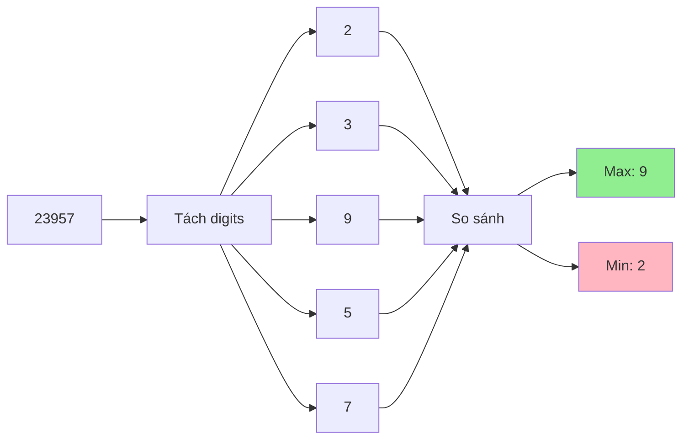

# Tìm chữ số lớn nhất và nhỏ nhất trong một số - Xử lý từng digit

Bạn có bao giờ tự hỏi trong số **23957**, chữ số nào lớn nhất và nhỏ nhất không? Hay muốn biết cách tách từng chữ số để xử lý riêng biệt? Đây là những kỹ thuật cơ bản nhưng rất quan trọng trong lập trình! Hôm nay chúng ta sẽ khám phá các cách khác nhau để "mổ xẻ" một số thành từng chữ số. 🔢

<!-- truncate -->

## 🔍 Hiểu về chữ số (Digits)

:::info Khái niệm
**Chữ số** (Digit) là các ký hiệu đơn lẻ (0,1,2,3,4,5,6,7,8,9) được dùng để tạo nên một số.

Ví dụ: Số **23957** có 5 chữ số: 2, 3, 9, 5, 7
- Chữ số lớn nhất: 9
- Chữ số nhỏ nhất: 2
:::

Hãy tưởng tượng một số như một chiếc hộp chứa nhiều viên kẹo có màu sắc khác nhau. Nhiệm vụ của chúng ta là mở hộp, lấy từng viên kẹo ra và tìm viên to nhất, nhỏ nhất!



## 📊 Phân tích bài toán

**Input:** Một số nguyên n (có thể âm)
**Output:** 
- Chữ số lớn nhất trong n
- Chữ số nhỏ nhất trong n

**Các trường hợp cần xử lý:**
- Số âm: Bỏ qua dấu âm, chỉ xét phần giá trị tuyệt đối
- Số có một chữ số: Max = Min = chính số đó
- Số có chứa số 0: Cần xét cả 0 trong so sánh

## 🚀 Giải pháp 1: Sử dụng phép chia và phép dư

Đây là phương pháp toán học thuần túy, không cần chuyển thành string.

### C++:
```cpp
#include <iostream>
#include <climits>
#include <cmath>
using namespace std;

pair<int, int> findMinMaxDigits(int n) {
    // Xử lý số âm
    if (n < 0) {
        cout << "So am " << n << " -> Chuyen thanh " << abs(n) << endl;
        n = abs(n);
    }
    
    // Trường hợp đặc biệt
    if (n == 0) {
        cout << "So 0: min = max = 0" << endl;
        return {0, 0};
    }
    
    int minDigit = 9;  // Khởi tạo với giá trị lớn nhất có thể
    int maxDigit = 0;  // Khởi tạo với giá trị nhỏ nhất có thể
    int original = n;
    
    cout << "Tach cac chu so cua " << original << ":" << endl;
    cout << "Chu so\tMin hien tai\tMax hien tai" << endl;
    cout << "------\t-----------\t-----------" << endl;
    
    while (n > 0) {
        int digit = n % 10;  // Lấy chữ số cuối
        
        if (digit < minDigit) {
            minDigit = digit;
        }
        
        if (digit > maxDigit) {
            maxDigit = digit;
        }
        
        cout << digit << "\t" << minDigit << "\t\t" << maxDigit << endl;
        
        n /= 10;  // Bỏ chữ số cuối
    }
    
    cout << "\nKet qua cuoi cung:" << endl;
    cout << "Chu so nho nhat: " << minDigit << endl;
    cout << "Chu so lon nhat: " << maxDigit << endl;
    
    return {minDigit, maxDigit};
}

// Phiên bản với thêm thông tin chi tiết
void analyzeDigits(int n) {
    cout << "\n=== PHAN TICH CHI TIET SO " << n << " ===" << endl;
    
    if (n < 0) {
        n = abs(n);
        cout << "Chuyen so am thanh duong: " << n << endl;
    }
    
    int digitCount = 0;
    int digitSum = 0;
    int minDigit = 9, maxDigit = 0;
    int temp = n;
    
    // Đếm số chữ số trước
    if (n == 0) {
        digitCount = 1;
    } else {
        int counter = n;
        while (counter > 0) {
            digitCount++;
            counter /= 10;
        }
    }
    
    cout << "So chu so: " << digitCount << endl;
    cout << "\nQua trinh xu ly:" << endl;
    
    // Xử lý từng chữ số
    while (temp > 0) {
        int digit = temp % 10;
        digitSum += digit;
        
        minDigit = min(minDigit, digit);
        maxDigit = max(maxDigit, digit);
        
        cout << "Chu so: " << digit << " | Tong: " << digitSum 
             << " | Min: " << minDigit << " | Max: " << maxDigit << endl;
        
        temp /= 10;
    }
    
    cout << "\nTong ket:" << endl;
    cout << "- Tong cac chu so: " << digitSum << endl;
    cout << "- Chu so nho nhat: " << minDigit << endl;
    cout << "- Chu so lon nhat: " << maxDigit << endl;
    cout << "- Chenh lech: " << maxDigit - minDigit << endl;
}

int main() {
    vector<int> testNumbers = {23957, -456, 1000, 7, 0, 987654321};
    
    for (int num : testNumbers) {
        auto result = findMinMaxDigits(num);
        analyzeDigits(num);
        cout << "\n" << string(50, '=') << "\n" << endl;
    }
    
    return 0;
}
```

### Python (với visualization):
```python
def find_min_max_digits_math(n):
    """
    Tìm chữ số lớn nhất và nhỏ nhất bằng phương pháp toán học
    
    Args:
        n (int): Số cần xử lý
    
    Returns:
        tuple: (min_digit, max_digit)
    """
    print(f"🎯 Tìm min/max digits của số {n}")
    
    # Xử lý số âm
    if n < 0:
        print(f"   Số âm → chuyển thành {abs(n)}")
        n = abs(n)
    
    # Trường hợp đặc biệt
    if n == 0:
        print("   Số 0 → min = max = 0")
        return 0, 0
    
    min_digit = 9  # Khởi tạo với giá trị lớn nhất
    max_digit = 0  # Khởi tạo với giá trị nhỏ nhất
    original = n
    digits_list = []
    
    print(f"\n📋 Quá trình tách digits:")
    print(f"{'Bước':<5} {'Số hiện tại':<12} {'Digit':<6} {'Min':<6} {'Max':<6}")
    print("-" * 40)
    
    step = 1
    while n > 0:
        digit = n % 10
        digits_list.append(digit)
        
        # Cập nhật min và max
        if digit < min_digit:
            min_digit = digit
        if digit > max_digit:
            max_digit = digit
        
        print(f"{step:<5} {n:<12} {digit:<6} {min_digit:<6} {max_digit:<6}")
        
        n //= 10
        step += 1
    
    # Hiển thị digits theo thứ tự gốc
    digits_list.reverse()
    print(f"\n📝 Các chữ số (từ trái sang phải): {digits_list}")
    print(f"🔹 Chữ số nhỏ nhất: {min_digit}")
    print(f"🔸 Chữ số lớn nhất: {max_digit}")
    
    return min_digit, max_digit

def analyze_number_properties(n):
    """Phân tích toàn diện một số"""
    
    print(f"\n{'='*60}")
    print(f"🔬 PHÂN TÍCH TOÀN DIỆN SỐ {n}")
    print(f"{'='*60}")
    
    original_n = n
    
    # Xử lý số âm
    is_negative = n < 0
    if is_negative:
        n = abs(n)
        print(f"🔄 Số âm được chuyển thành: {n}")
    
    # Tách digits
    if n == 0:
        digits = [0]
    else:
        digits = []
        temp = n
        while temp > 0:
            digits.append(temp % 10)
            temp //= 10
        digits.reverse()
    
    # Thống kê cơ bản
    min_digit = min(digits)
    max_digit = max(digits)
    digit_sum = sum(digits)
    digit_count = len(digits)
    
    print(f"📊 Thống kê cơ bản:")
    print(f"   • Số chữ số: {digit_count}")
    print(f"   • Các chữ số: {digits}")
    print(f"   • Tổng các chữ số: {digit_sum}")
    print(f"   • Chữ số nhỏ nhất: {min_digit}")
    print(f"   • Chữ số lớn nhất: {max_digit}")
    print(f"   • Chênh lệch min-max: {max_digit - min_digit}")
    
    # Thống kê nâng cao
    from collections import Counter
    digit_freq = Counter(digits)
    
    print(f"\n📈 Thống kê nâng cao:")
    print(f"   • Tần số các chữ số:")
    for digit in range(10):
        if digit in digit_freq:
            print(f"     - Số {digit}: xuất hiện {digit_freq[digit]} lần")
    
    # Chữ số xuất hiện nhiều nhất
    most_common = digit_freq.most_common(1)[0]
    print(f"   • Chữ số xuất hiện nhiều nhất: {most_common[0]} ({most_common[1]} lần)")
    
    # Kiểm tra tính chất đặc biệt
    print(f"\n🔍 Tính chất đặc biệt:")
    
    # Tất cả chữ số giống nhau
    if len(set(digits)) == 1:
        print(f"   ✅ Tất cả chữ số đều giống nhau ({digits[0]})")
    
    # Chứa tất cả chữ số từ 0-9
    if len(set(digits)) == 10:
        print(f"   ✅ Chứa tất cả chữ số từ 0-9")
    
    # Tăng dần hoặc giảm dần
    if digits == sorted(digits):
        print(f"   ✅ Các chữ số sắp xếp tăng dần")
    elif digits == sorted(digits, reverse=True):
        print(f"   ✅ Các chữ số sắp xếp giảm dần")
    
    # Palindrome
    if digits == digits[::-1]:
        print(f"   ✅ Là số palindrome (đối xứng)")
    
    return {
        'original': original_n,
        'digits': digits,
        'min_digit': min_digit,
        'max_digit': max_digit,
        'digit_sum': digit_sum,
        'digit_count': digit_count,
        'digit_frequency': dict(digit_freq)
    }

# Demo với nhiều số khác nhau
test_numbers = [23957, -456, 1000, 7, 0, 987654321, 1234567890, 1111, 9876543210]

for num in test_numbers:
    min_d, max_d = find_min_max_digits_math(num)
    result = analyze_number_properties(num)
    print("\n" + "="*80 + "\n")
```

## ⚡ Giải pháp 2: Chuyển thành chuỗi

Đây là cách đơn giản và trực quan nhất.

### Python Implementation:
```python
def find_min_max_digits_string(n):
    """
    Tìm min/max digits bằng cách chuyển thành string
    
    Args:
        n (int): Số cần xử lý
    
    Returns:
        tuple: (min_digit, max_digit)
    """
    print(f"🎯 Xử lý số {n} bằng phương pháp string")
    
    # Chuyển thành string và bỏ dấu âm
    str_n = str(abs(n))
    print(f"   String representation: '{str_n}'")
    
    # Tìm min và max
    digits = [int(char) for char in str_n]
    min_digit = min(digits)
    max_digit = max(digits)
    
    print(f"   Digits list: {digits}")
    print(f"   Min digit: {min_digit}")
    print(f"   Max digit: {max_digit}")
    
    return min_digit, max_digit

def compare_methods(n):
    """So sánh các phương pháp khác nhau"""
    
    print(f"\n🔄 SO SÁNH PHƯƠNG PHÁP CHO SỐ {n}")
    print("="*50)
    
    # Phương pháp 1: Math
    print("📊 Phương pháp 1 - Toán học (chia/dư):")
    min1, max1 = find_min_max_digits_math(n)
    
    print("\n📝 Phương pháp 2 - Chuyển string:")
    min2, max2 = find_min_max_digits_string(n)
    
    # Phương pháp 3: List comprehension (Python style)
    print("\n🐍 Phương pháp 3 - List comprehension:")
    digits = [int(d) for d in str(abs(n))]
    min3, max3 = min(digits), max(digits)
    print(f"   One-liner: {min3}, {max3}")
    
    # Phương pháp 4: Built-in functions
    print("\n⚡ Phương pháp 4 - Built-in functions:")
    str_digits = str(abs(n))
    min4, max4 = int(min(str_digits)), int(max(str_digits))
    print(f"   Super concise: {min4}, {max4}")
    
    # Verification
    print(f"\n🔍 Kiểm tra tính đồng nhất:")
    results = [(min1, max1), (min2, max2), (min3, max3), (min4, max4)]
    methods = ["Math", "String", "List Comp", "Built-in"]
    
    for i, (method, result) in enumerate(zip(methods, results)):
        print(f"   {method}: min={result[0]}, max={result[1]}")
    
    # Kiểm tra tất cả có giống nhau không
    if len(set(results)) == 1:
        print("✅ Tất cả phương pháp đều cho kết quả giống nhau!")
    else:
        print("❌ Có sự khác biệt giữa các phương pháp!")
    
    return results[0]  # Trả về kết quả từ phương pháp đầu tiên

# Demo so sánh
test_cases = [23957, -456, 1000, 7, 0]
for num in test_cases:
    compare_methods(num)
    print("\n" + "="*70 + "\n")
```

### Java:
```java
public class DigitAnalyzer {
    
    public static class DigitResult {
        public int minDigit;
        public int maxDigit;
        
        public DigitResult(int min, int max) {
            this.minDigit = min;
            this.maxDigit = max;
        }
        
        @Override
        public String toString() {
            return String.format("Min: %d, Max: %d", minDigit, maxDigit);
        }
    }
    
    // Phương pháp 1: Sử dụng toán học
    public static DigitResult findMinMaxMath(int n) {
        System.out.println("🎯 Xử lý số " + n + " bằng phương pháp toán học");
        
        if (n < 0) {
            System.out.println("   Chuyển số âm thành dương: " + Math.abs(n));
            n = Math.abs(n);
        }
        
        if (n == 0) {
            return new DigitResult(0, 0);
        }
        
        int minDigit = 9;
        int maxDigit = 0;
        int original = n;
        
        System.out.printf("%-10s %-6s %-6s %-6s%n", "Số", "Digit", "Min", "Max");
        System.out.println("-".repeat(30));
        
        while (n > 0) {
            int digit = n % 10;
            minDigit = Math.min(minDigit, digit);
            maxDigit = Math.max(maxDigit, digit);
            
            System.out.printf("%-10d %-6d %-6d %-6d%n", n, digit, minDigit, maxDigit);
            
            n /= 10;
        }
        
        return new DigitResult(minDigit, maxDigit);
    }
    
    // Phương pháp 2: Chuyển thành string
    public static DigitResult findMinMaxString(int n) {
        System.out.println("🎯 Xử lý số " + n + " bằng phương pháp string");
        
        String str = String.valueOf(Math.abs(n));
        System.out.println("   String: '" + str + "'");
        
        int minDigit = 9;
        int maxDigit = 0;
        
        for (char c : str.toCharArray()) {
            int digit = Character.getNumericValue(c);
            minDigit = Math.min(minDigit, digit);
            maxDigit = Math.max(maxDigit, digit);
        }
        
        System.out.println("   Min: " + minDigit + ", Max: " + maxDigit);
        return new DigitResult(minDigit, maxDigit);
    }
    
    // Phân tích chi tiết
    public static void analyzeDigits(int n) {
        System.out.println("\n📊 PHÂN TÍCH CHI TIẾT SỐ " + n);
        System.out.println("=".repeat(40));
        
        String str = String.valueOf(Math.abs(n));
        int[] digitCount = new int[10];
        int sum = 0;
        
        // Đếm tần số và tính tổng
        for (char c : str.toCharArray()) {
            int digit = Character.getNumericValue(c);
            digitCount[digit]++;
            sum += digit;
        }
        
        System.out.println("Số chữ số: " + str.length());
        System.out.println("Tổng các chữ số: " + sum);
        System.out.println("Tần số xuất hiện:");
        
        for (int i = 0; i < 10; i++) {
            if (digitCount[i] > 0) {
                System.out.println("  Số " + i + ": " + digitCount[i] + " lần");
            }
        }
        
        // Tìm digit xuất hiện nhiều nhất
        int maxFreq = 0;
        int mostFrequentDigit = 0;
        for (int i = 0; i < 10; i++) {
            if (digitCount[i] > maxFreq) {
                maxFreq = digitCount[i];
                mostFrequentDigit = i;
            }
        }
        
        System.out.println("Chữ số xuất hiện nhiều nhất: " + mostFrequentDigit + " (" + maxFreq + " lần)");
    }
    
    public static void main(String[] args) {
        int[] testNumbers = {23957, -456, 1000, 7, 0, 987654321};
        
        for (int num : testNumbers) {
            System.out.println("\n" + "=".repeat(60));
            System.out.println("🔍 PHÂN TÍCH SỐ " + num);
            System.out.println("=".repeat(60));
            
            DigitResult mathResult = findMinMaxMath(num);
            System.out.println();
            
            DigitResult stringResult = findMinMaxString(num);
            System.out.println();
            
            // Kiểm tra tính đồng nhất
            if (mathResult.minDigit == stringResult.minDigit && 
                mathResult.maxDigit == stringResult.maxDigit) {
                System.out.println("✅ Hai phương pháp cho kết quả giống nhau!");
            } else {
                System.out.println("❌ Có sự khác biệt trong kết quả!");
            }
            
            analyzeDigits(num);
        }
    }
}
```

## 🎮 Ứng dụng thực tế và mở rộng

### 1. Tạo số mới từ digits

```python
def create_numbers_from_digits(n):
    """
    Tạo các số mới từ digits của số ban đầu
    
    Args:
        n (int): Số gốc
    
    Returns:
        dict: Các số được tạo ra
    """
    digits = [int(d) for d in str(abs(n))]
    
    print(f"🎲 Tạo số mới từ digits của {n}")
    print(f"Digits gốc: {digits}")
    
    # Số lớn nhất có thể tạo
    max_number = int(''.join(map(str, sorted(digits, reverse=True))))
    
    # Số nhỏ nhất có thể tạo (không bắt đầu bằng 0)
    sorted_digits = sorted(digits)
    if sorted_digits[0] == 0 and len(sorted_digits) > 1:
        # Tìm chữ số khác 0 đầu tiên
        for i in range(len(sorted_digits)):
            if sorted_digits[i] != 0:
                sorted_digits[0], sorted_digits[i] = sorted_digits[i], sorted_digits[0]
                break
    min_number = int(''.join(map(str, sorted_digits)))
    
    # Tổng và tích các digits
    digit_sum = sum(digits)
    digit_product = 1
    for d in digits:
        digit_product *= d
    
    results = {
        'original': n,
        'digits': digits,
        'max_possible': max_number,
        'min_possible': min_number,
        'digit_sum': digit_sum,
        'digit_product': digit_product,
        'difference': max_number - min_number
    }
    
    print(f"📊 Kết quả:")
    for key, value in results.items():
        print(f"   {key}: {value}")
    
    return results

# Demo
test_numbers = [23957, 1000, 54321, 11223]
for num in test_numbers:
    create_numbers_from_digits(num)
    print()
```

### 2. Kaprekar's Routine

```python
def kaprekar_routine(n, max_iterations=10):
    """
    Thuật toán Kaprekar: Liên tục lấy số lớn nhất trừ số nhỏ nhất
    cho đến khi đạt số cố định hoặc chu kỳ
    
    Args:
        n (int): Số bắt đầu
        max_iterations (int): Số vòng lặp tối đa
    
    Returns:
        list: Dãy các số trong quá trình
    """
    print(f"🔄 KAPREKAR'S ROUTINE CHO SỐ {n}")
    print("="*40)
    
    current = n
    sequence = [current]
    seen = {current}
    
    for i in range(max_iterations):
        # Lấy digits và pad với 0 để đủ 4 chữ số (cho số Kaprekar cổ điển)
        digits = [int(d) for d in f"{current:04d}"]
        
        # Tạo số lớn nhất và nhỏ nhất
        max_num = int(''.join(map(str, sorted(digits, reverse=True))))
        min_num = int(''.join(map(str, sorted(digits))))
        
        # Tính hiệu
        current = max_num - min_num
        
        print(f"Bước {i+1}: {max_num} - {min_num} = {current}")
        
        # Kiểm tra điều kiện dừng
        if current in seen:
            print(f"🎯 Đạt chu kỳ tại {current} sau {i+1} bước!")
            break
        
        sequence.append(current)
        seen.add(current)
        
        # Kaprekar constant cho số 4 chữ số là 6174
        if current == 6174:
            print(f"✨ Đạt Kaprekar constant (6174) sau {i+1} bước!")
            break
    
    return sequence

# Demo Kaprekar routine
kaprekar_numbers = [1234, 5432, 1111, 2021]
for num in kaprekar_numbers:
    sequence = kaprekar_routine(num)
    print(f"Dãy số: {' → '.join(map(str, sequence))}")
    print()
```

### 3. Digit manipulation games

```python
def digit_games(n):
    """
    Các trò chơi thú vị với digits
    """
    digits = [int(d) for d in str(abs(n))]
    
    print(f"🎮 DIGIT GAMES VỚI SỐ {n}")
    print("="*30)
    
    # Game 1: Happy Number
    def is_happy_number(num):
        seen = set()
        while num != 1 and num not in seen:
            seen.add(num)
            num = sum(int(digit) ** 2 for digit in str(num))
        return num == 1
    
    print(f"1️⃣ Happy Number: {is_happy_number(n)}")
    
    # Game 2: Armstrong Number  
    def is_armstrong(num):
        digits = [int(d) for d in str(abs(num))]
        power = len(digits)
        return sum(d ** power for d in digits) == abs(num)
    
    print(f"2️⃣ Armstrong Number: {is_armstrong(n)}")
    
    # Game 3: Narcissistic Number (tổng quát của Armstrong)
    def is_narcissistic(num):
        digits = [int(d) for d in str(abs(num))]
        return sum(d ** len(digits) for d in digits) == abs(num)
    
    print(f"3️⃣ Narcissistic: {is_narcissistic(n)}")
    
    # Game 4: Digital Root
    def digital_root(num):
        while num >= 10:
            num = sum(int(d) for d in str(num))
        return num
    
    print(f"4️⃣ Digital Root: {digital_root(abs(n))}")
    
    # Game 5: Harshad Number (chia hết cho tổng digits)
    digit_sum = sum(digits)
    is_harshad = abs(n) % digit_sum == 0 if digit_sum != 0 else False
    print(f"5️⃣ Harshad Number: {is_harshad}")

# Demo games
game_numbers = [153, 371, 407, 9474, 23, 19, 7]
for num in game_numbers:
    digit_games(num)
    print()
```

## 📊 So sánh các phương pháp

| Phương pháp | Time Complexity | Space Complexity | Ưu điểm | Nhược điểm |
|-------------|----------------|------------------|---------|------------|
| **Math (÷, %)** | O(log n) | O(1) | Không dùng string, memory efficient | Phức tạp hơn |
| **String Conversion** | O(log n) | O(log n) | Đơn giản, dễ hiểu | Tốn bộ nhớ |
| **List Comprehension** | O(log n) | O(log n) | Python-style, ngắn gọn | Chỉ dành cho Python |
| **Built-in Functions** | O(log n) | O(log n) | Rất ngắn gọn | Ít tính giáo dục |

## 🏃‍♂️ Bài tập thực hành

:::note Thử thách
1. **Cơ bản:** Viết hàm đếm số lượng mỗi chữ số trong một số
2. **Trung bình:** Tìm chữ số xuất hiện nhiều nhất và ít nhất
3. **Khó:** Implement thuật toán sắp xếp digits để tạo số lớn nhất/nhỏ nhất
4. **Thách thức:** Tìm số có tính chất: tổng bình phương các digit = chính số đó
:::

### Bài tập mẫu - Digit frequency analyzer:

```python
def advanced_digit_analyzer(numbers):
    """
    Phân tích tần số digit trong nhiều số
    
    Args:
        numbers (list): Danh sách các số cần phân tích
    """
    print("📈 PHÂN TÍCH TẦN SỐ DIGITS NÂNG CAO")
    print("="*50)
    
    # Tổng hợp tất cả digits
    all_digits = []
    for num in numbers:
        digits = [int(d) for d in str(abs(num))]
        all_digits.extend(digits)
    
    # Thống kê
    from collections import Counter
    digit_count = Counter(all_digits)
    
    print(f"📊 Thống kê từ {len(numbers)} số: {numbers}")
    print(f"Tổng cộng {len(all_digits)} chữ số")
    print()
    
    # Biểu đồ tần số
    print("📈 Tần số xuất hiện:")
    max_count = max(digit_count.values())
    
    for digit in range(10):
        count = digit_count.get(digit, 0)
        percentage = count / len(all_digits) * 100
        bar = "█" * (count * 20 // max_count) if count > 0 else ""
        
        print(f"Digit {digit}: {count:3d} lần ({percentage:5.1f}%) {bar}")
    
    # Phân tích
    most_common = digit_count.most_common(1)[0] if digit_count else (0, 0)
    least_common = digit_count.most_common()[-1] if digit_count else (0, 0)
    
    print(f"\n🔍 Phân tích:")
    print(f"   • Xuất hiện nhiều nhất: {most_common[0]} ({most_common[1]} lần)")
    print(f"   • Xuất hiện ít nhất: {least_common[0]} ({least_common[1]} lần)")
    print(f"   • Tổng tất cả digits: {sum(all_digits)}")
    print(f"   • Trung bình mỗi digit: {sum(all_digits) / len(all_digits):.2f}")

# Test với dataset lớn
import random
random_numbers = [random.randint(1000, 9999) for _ in range(20)]
advanced_digit_analyzer(random_numbers)
```

## 🎯 Kết luận

Xử lý từng chữ số của một số là kỹ năng cơ bản nhưng vô cùng quan trọng trong lập trình. Chúng ta đã học được:

1. **Hai phương pháp chính**: Toán học (chia/dư) và chuyển string
2. **Các ứng dụng thực tế**: Kaprekar routine, digit games, frequency analysis
3. **Tối ưu hóa**: So sánh hiệu suất và cách chọn phương pháp phù hợp
4. **Mở rộng**: Tạo số mới từ digits, phân tích thống kê

Kỹ năng này sẽ giúp bạn:
- 🔢 Xử lý các bài toán về số học
- 🎮 Giải quyết các trò chơi logic với số
- 📊 Phân tích dữ liệu số liệu
- 🚀 Tối ưu hóa thuật toán xử lý số

Hãy thực hành với các bài tập để thành thạo kỹ năng tuyệt vời này! 🌟

---

**Tags:** #basics #digits #math #algorithms #number-manipulation #string-processing #competitive-programming
