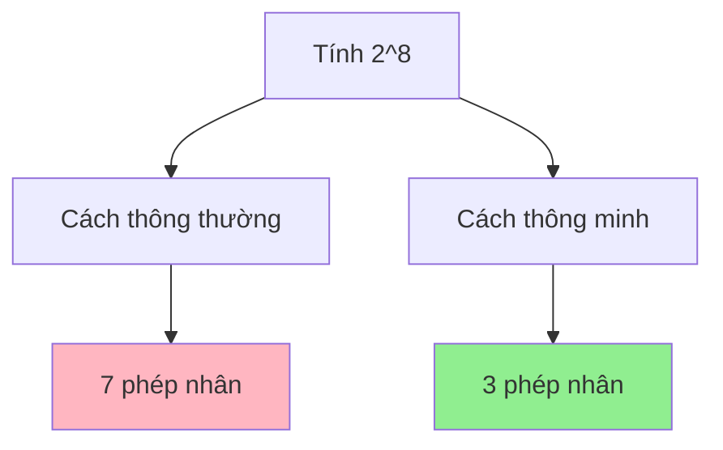
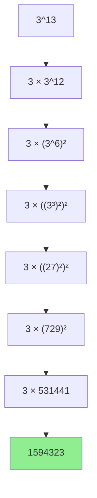
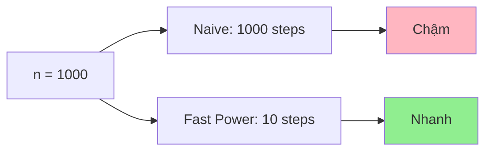

# Tính lũy thừa hiệu quả - Thuật toán lũy thừa nhanh

Bạn có bao giờ phải tính 2^1000 hay 3^500 không? Nếu dùng cách thông thường (nhân 1000 lần), máy tính sẽ mất rất nhiều thời gian! Nhưng với **thuật toán lũy thừa nhanh**, chúng ta có thể giảm từ 1000 phép tính xuống chỉ khoảng 10 phép tính! Thật kỳ diệu phải không? 🚀

<!-- truncate -->

## ⚡ Tại sao cần thuật toán lũy thừa nhanh?

:::info Vấn đề
Tính a^n với n rất lớn bằng cách nhân liên tiếp sẽ:
- **Chậm**: Cần n-1 phép nhân
- **Overflow**: Kết quả quá lớn với số nguyên
- **Không thực tế**: Với n = 10^9, cần tỷ phép tính!
:::

Hãy tưởng tượng bạn cần gấp đôi số tiền 20 lần. Thay vì cộng từng đồng một, bạn có thể:
- Lần 1: 1 → 2
- Lần 2: 2 → 4  
- Lần 3: 4 → 8
- ...
- Lần 20: 524,288 → 1,048,576

Chỉ cần 20 bước thay vì 1,048,575 bước!



## 🧮 Nguyên lý hoạt động

### Công thức cơ bản:

**Quy tắc đệ quy:**
- Nếu n = 0: a^n = 1
- Nếu n = 1: a^n = a  
- Nếu n chẵn: a^n = (a^(n/2))²
- Nếu n lẻ: a^n = a × a^(n-1)

### Ví dụ minh họa: Tính 3^13



**Phân tích nhị phân:**
- 13 = 1101₂ = 8 + 4 + 1
- 3^13 = 3^8 × 3^4 × 3^1

## 🚀 Implementation: Thuật toán cơ bản

### C++:
```cpp
#include <iostream>
using namespace std;

// Phiên bản đệ quy
long long powerRecursive(long long base, long long exp) {
    cout << "Tinh " << base << "^" << exp;
    
    if (exp == 0) {
        cout << " = 1 (co so)" << endl;
        return 1;
    }
    
    if (exp == 1) {
        cout << " = " << base << " (co so)" << endl;
        return base;
    }
    
    if (exp % 2 == 0) {
        cout << " = (" << base << "^" << exp/2 << ")^2" << endl;
        long long half = powerRecursive(base, exp / 2);
        return half * half;
    } else {
        cout << " = " << base << " * " << base << "^" << exp-1 << endl;
        return base * powerRecursive(base, exp - 1);
    }
}

// Phiên bản lặp (iterative)
long long powerIterative(long long base, long long exp) {
    long long result = 1;
    long long current_power = base;
    
    cout << "Tinh " << base << "^" << exp << " bang phuong phap lap:" << endl;
    cout << "Bieu dien nhi phan cua " << exp << ": ";
    
    // In biểu diễn nhị phân
    for (int i = 31; i >= 0; i--) {
        if (exp & (1LL << i)) {
            cout << "1";
        } else if (exp >= (1LL << i)) {
            cout << "0";
        }
    }
    cout << endl;
    
    while (exp > 0) {
        if (exp % 2 == 1) {
            cout << "Bit cuoi = 1: result = " << result << " * " << current_power;
            result *= current_power;
            cout << " = " << result << endl;
        } else {
            cout << "Bit cuoi = 0: bo qua" << endl;
        }
        
        cout << "current_power = " << current_power << "^2";
        current_power *= current_power;
        cout << " = " << current_power << endl;
        
        exp /= 2;
        cout << "exp = exp/2 = " << exp << endl << endl;
    }
    
    return result;
}

int main() {
    int base = 3, exp = 13;
    
    cout << "=== THUAT TOAN LUY THUA NHANH ===" << endl;
    cout << "Tinh " << base << "^" << exp << endl << endl;
    
    cout << "1. Phuong phap de quy:" << endl;
    long long result1 = powerRecursive(base, exp);
    cout << "Ket qua: " << result1 << endl << endl;
    
    cout << "2. Phuong phap lap:" << endl;
    long long result2 = powerIterative(base, exp);
    cout << "Ket qua: " << result2 << endl;
    
    return 0;
}
```

### Python (với visualization):
```python
def power_recursive_visual(base, exp, depth=0):
    """
    Tính lũy thừa bằng đệ quy với visualization
    
    Args:
        base (int): Cơ số
        exp (int): Số mũ
        depth (int): Độ sâu đệ quy (để indent)
    
    Returns:
        int: Kết quả a^n
    """
    indent = "  " * depth
    print(f"{indent}🔸 Tính {base}^{exp}")
    
    # Base cases
    if exp == 0:
        print(f"{indent}✅ {base}^0 = 1")
        return 1
    
    if exp == 1:
        print(f"{indent}✅ {base}^1 = {base}")
        return base
    
    # Recursive cases
    if exp % 2 == 0:
        print(f"{indent}📊 {exp} chẵn → {base}^{exp} = ({base}^{exp//2})²")
        half_result = power_recursive_visual(base, exp // 2, depth + 1)
        result = half_result * half_result
        print(f"{indent}🎯 {base}^{exp} = {half_result}² = {result}")
        return result
    else:
        print(f"{indent}📊 {exp} lẻ → {base}^{exp} = {base} × {base}^{exp-1}")
        sub_result = power_recursive_visual(base, exp - 1, depth + 1)
        result = base * sub_result
        print(f"{indent}🎯 {base}^{exp} = {base} × {sub_result} = {result}")
        return result

def power_iterative_visual(base, exp):
    """
    Tính lũy thừa bằng vòng lặp với visualization
    """
    print(f"🔄 Tính {base}^{exp} bằng phương pháp lặp")
    print(f"📝 Biểu diễn nhị phân của {exp}: {bin(exp)[2:]}")
    
    result = 1
    current_power = base
    original_exp = exp
    step = 1
    
    print(f"\n{'Bước':<5} {'Exp':<10} {'Bit cuối':<10} {'Result':<15} {'Current Power':<15}")
    print("-" * 65)
    
    while exp > 0:
        bit = exp % 2
        if bit == 1:
            old_result = result
            result *= current_power
            action = f"{old_result} × {current_power//base if step > 1 else current_power} = {result}"
        else:
            action = "Bỏ qua"
        
        print(f"{step:<5} {exp:<10} {bit:<10} {action:<15} {current_power:<15}")
        
        # Chuẩn bị cho bước tiếp theo
        if exp > 1:
            current_power *= current_power
        exp //= 2
        step += 1
    
    print(f"\n✅ Kết quả: {base}^{original_exp} = {result}")
    return result

def compare_methods(base, exp):
    """So sánh các phương pháp khác nhau"""
    print(f"{'='*60}")
    print(f"🎯 SO SÁNH PHƯƠNG PHÁP TÍNH {base}^{exp}")
    print(f"{'='*60}")
    
    # Phương pháp naive (chỉ demo với số nhỏ)
    if exp <= 20:
        import time
        
        start = time.time()
        naive_result = base ** exp  # Dùng built-in để demo
        naive_time = time.time() - start
        print(f"🐌 Phương pháp naive: {naive_result} (thời gian: {naive_time:.8f}s)")
    
    # Phương pháp đệ quy
    print(f"\n🌳 Phương pháp đệ quy:")
    recursive_result = power_recursive_visual(base, exp)
    
    # Phương pháp lặp
    print(f"\n🔄 Phương pháp lặp:")
    iterative_result = power_iterative_visual(base, exp)
    
    # Kiểm tra tính đúng đắn
    print(f"\n🔍 Kiểm tra:")
    print(f"   Đệ quy:  {recursive_result}")
    print(f"   Lặp:     {iterative_result}")
    print(f"   Built-in: {base**exp}")
    
    if recursive_result == iterative_result == base**exp:
        print("✅ Tất cả đều cho kết quả đúng!")
    else:
        print("❌ Có sự khác biệt trong kết quả!")

# Demo
test_cases = [(3, 13), (2, 10), (5, 7)]

for base, exp in test_cases:
    compare_methods(base, exp)
    print("\n" + "="*80 + "\n")
```

### Java:
```java
public class FastExponentiation {
    
    public static long powerRecursive(long base, long exp) {
        System.out.println("Tính " + base + "^" + exp);
        
        if (exp == 0) {
            System.out.println("  → Trả về 1 (cơ số)");
            return 1;
        }
        
        if (exp == 1) {
            System.out.println("  → Trả về " + base + " (cơ số)");
            return base;
        }
        
        if (exp % 2 == 0) {
            System.out.println("  → " + exp + " chẵn, tính (" + base + "^" + (exp/2) + ")²");
            long half = powerRecursive(base, exp / 2);
            long result = half * half;
            System.out.println("  → " + half + "² = " + result);
            return result;
        } else {
            System.out.println("  → " + exp + " lẻ, tính " + base + " × " + base + "^" + (exp-1));
            long subResult = powerRecursive(base, exp - 1);
            long result = base * subResult;
            System.out.println("  → " + base + " × " + subResult + " = " + result);
            return result;
        }
    }
    
    public static long powerIterative(long base, long exp) {
        System.out.println("Tính " + base + "^" + exp + " bằng phương pháp lặp:");
        System.out.println("Biểu diễn nhị phân của " + exp + ": " + Long.toBinaryString(exp));
        
        long result = 1;
        long currentPower = base;
        long originalExp = exp;
        
        System.out.printf("%-5s %-10s %-10s %-15s %-15s%n", 
                         "Bước", "Exp", "Bit cuối", "Result", "Current Power");
        System.out.println("-".repeat(65));
        
        int step = 1;
        while (exp > 0) {
            int bit = (int)(exp % 2);
            String action;
            
            if (bit == 1) {
                long oldResult = result;
                result *= currentPower;
                action = oldResult + " × " + currentPower + " = " + result;
            } else {
                action = "Bỏ qua";
            }
            
            System.out.printf("%-5d %-10d %-10d %-15s %-15d%n", 
                             step, exp, bit, action, currentPower);
            
            currentPower *= currentPower;
            exp /= 2;
            step++;
        }
        
        System.out.println("✅ Kết quả: " + base + "^" + originalExp + " = " + result);
        return result;
    }
    
    public static void main(String[] args) {
        long base = 3, exp = 13;
        
        System.out.println("=== THUẬT TOÁN LŨY THỪA NHANH ===");
        System.out.println("Tính " + base + "^" + exp + "\n");
        
        System.out.println("1. Phương pháp đệ quy:");
        long result1 = powerRecursive(base, exp);
        System.out.println("Kết quả: " + result1 + "\n");
        
        System.out.println("2. Phương pháp lặp:");
        long result2 = powerIterative(base, exp);
        System.out.println("Kết quả: " + result2);
    }
}
```

## 🔒 Modular Exponentiation - Xử lý số lớn

Khi tính a^n mod m (thường dùng trong mã hóa), ta cần tránh overflow:

### Python Implementation:
```python
def mod_power(base, exp, mod):
    """
    Tính (base^exp) % mod hiệu quả
    
    Args:
        base (int): Cơ số
        exp (int): Số mũ  
        mod (int): Modulo
    
    Returns:
        int: (base^exp) % mod
    """
    print(f"🔐 Tính ({base}^{exp}) mod {mod}")
    
    if mod == 1:
        return 0
    
    result = 1
    base = base % mod  # Tối ưu ngay từ đầu
    
    print(f"📝 Bước đầu: base = {base} mod {mod} = {base}")
    print(f"📝 Biểu diễn nhị phân của {exp}: {bin(exp)[2:]}")
    print()
    
    step = 1
    while exp > 0:
        print(f"Bước {step}:")
        print(f"  exp = {exp}, bit cuối = {exp % 2}")
        
        if exp % 2 == 1:
            old_result = result
            result = (result * base) % mod
            print(f"  Bit = 1 → result = ({old_result} × {base}) mod {mod} = {result}")
        else:
            print(f"  Bit = 0 → giữ nguyên result = {result}")
        
        old_base = base
        base = (base * base) % mod
        print(f"  base = ({old_base}²) mod {mod} = {base}")
        
        exp //= 2
        print(f"  exp = {exp}")
        print()
        step += 1
    
    print(f"✅ Kết quả cuối: {result}")
    return result

def demonstrate_mod_power():
    """Demo modular exponentiation với các ví dụ thực tế"""
    
    examples = [
        (2, 10, 1000, "Ví dụ cơ bản"),
        (3, 200, 50, "Số mũ lớn"),  
        (123, 456, 789, "RSA nhỏ"),
        (2, 1000, 1000000007, "Competitive Programming")
    ]
    
    for base, exp, mod, description in examples:
        print(f"{'='*60}")
        print(f"📚 {description}")
        print(f"{'='*60}")
        
        result = mod_power(base, exp, mod)
        
        # Verification với built-in function
        builtin_result = pow(base, exp, mod)
        print(f"🔍 Kiểm tra với pow({base}, {exp}, {mod}) = {builtin_result}")
        
        if result == builtin_result:
            print("✅ Chính xác!")
        else:
            print("❌ Sai rồi!")
        
        print("\n" + "="*80 + "\n")

# Chạy demo
demonstrate_mod_power()
```

## 🎮 Ứng dụng thực tế

### 1. RSA Encryption (Simplified)
```python
def simple_rsa_demo():
    """Demo đơn giản về RSA encryption"""
    print("🔐 DEMO RSA ENCRYPTION")
    print("="*40)
    
    # Các số nguyên tố nhỏ để demo
    p, q = 61, 53
    n = p * q  # 3233
    phi_n = (p - 1) * (q - 1)  # 3120
    
    # Khóa công khai
    e = 17  # Phải coprime với phi_n
    
    # Khóa bí mật  
    d = pow(e, -1, phi_n)  # Modular inverse
    
    print(f"p = {p}, q = {q}")
    print(f"n = p × q = {n}")
    print(f"φ(n) = (p-1)(q-1) = {phi_n}")
    print(f"Khóa công khai: (e={e}, n={n})")
    print(f"Khóa bí mật: (d={d}, n={n})")
    print()
    
    # Mã hóa message
    message = 123
    print(f"📝 Message gốc: {message}")
    
    # Encryption: c = m^e mod n
    ciphertext = pow(message, e, n)
    print(f"🔒 Mã hóa: c = {message}^{e} mod {n} = {ciphertext}")
    
    # Decryption: m = c^d mod n  
    decrypted = pow(ciphertext, d, n)
    print(f"🔓 Giải mã: m = {ciphertext}^{d} mod {n} = {decrypted}")
    
    if message == decrypted:
        print("✅ Mã hóa/giải mã thành công!")
    else:
        print("❌ Có lỗi trong quá trình mã hóa!")

simple_rsa_demo()
```

### 2. Tính Fibonacci lớn
```python
def matrix_multiply_mod(A, B, mod):
    """Nhân hai ma trận 2x2 với modulo"""
    return [[(A[0][0]*B[0][0] + A[0][1]*B[1][0]) % mod,
             (A[0][0]*B[0][1] + A[0][1]*B[1][1]) % mod],
            [(A[1][0]*B[0][0] + A[1][1]*B[1][0]) % mod,
             (A[1][0]*B[0][1] + A[1][1]*B[1][1]) % mod]]

def matrix_power_mod(matrix, n, mod):
    """Tính lũy thừa ma trận với modulo"""
    if n == 0:
        return [[1, 0], [0, 1]]  # Identity matrix
    
    if n == 1:
        return matrix
    
    if n % 2 == 0:
        half = matrix_power_mod(matrix, n // 2, mod)
        return matrix_multiply_mod(half, half, mod)
    else:
        return matrix_multiply_mod(matrix, matrix_power_mod(matrix, n - 1, mod), mod)

def fibonacci_fast(n, mod=10**9 + 7):
    """Tính Fibonacci thứ n trong O(log n)"""
    if n <= 1:
        return n
    
    # Ma trận [[1,1],[1,0]]^n = [[F(n+1),F(n)],[F(n),F(n-1)]]
    fib_matrix = [[1, 1], [1, 0]]
    result_matrix = matrix_power_mod(fib_matrix, n, mod)
    
    return result_matrix[0][1]

# Demo
print("🔢 FIBONACCI VỚI LŨY THỪA NHANH")
print("="*40)

test_values = [10, 50, 100, 1000]
for n in test_values:
    result = fibonacci_fast(n)
    print(f"F({n}) mod 10^9+7 = {result}")
```

## 📊 Phân tích độ phức tạp

| Phương pháp | Time Complexity | Space Complexity | Ưu điểm | Nhược điểm |
|-------------|----------------|------------------|---------|------------|
| **Naive** | O(n) | O(1) | Đơn giản | Chậm, overflow |
| **Fast Power (Recursive)** | O(log n) | O(log n) | Nhanh | Dùng stack |
| **Fast Power (Iterative)** | O(log n) | O(1) | Nhanh, ít bộ nhớ | Phức tạp hơn |
| **Modular Fast Power** | O(log n) | O(1) | Xử lý số lớn | Cần hiểu modular |



## 🏃‍♂️ Bài tập thực hành

:::note Thử thách
1. **Cơ bản:** Implement fast power cho số thực (double)
2. **Trung bình:** Tính a^n mod m với n có thể âm
3. **Khó:** Matrix exponentiation để tính dãy Fibonacci
4. **Thách thức:** Implement thuật toán Chinese Remainder Theorem
:::

### Bài tập mẫu - Power với số âm:

```python
def extended_gcd(a, b):
    """Thuật toán Euclidean mở rộng"""
    if a == 0:
        return b, 0, 1
    
    gcd, x1, y1 = extended_gcd(b % a, a)
    x = y1 - (b // a) * x1
    y = x1
    
    return gcd, x, y

def mod_inverse(a, m):
    """Tìm nghịch đảo modular của a theo mod m"""
    gcd, x, _ = extended_gcd(a, m)
    if gcd != 1:
        raise ValueError("Không tồn tại nghịch đảo modular")
    return (x % m + m) % m

def power_with_negative_exp(base, exp, mod):
    """Tính a^n mod m với n có thể âm"""
    if exp >= 0:
        return pow(base, exp, mod)
    else:
        # a^(-n) mod m = (a^(-1))^n mod m
        inv_base = mod_inverse(base, mod)
        return pow(inv_base, -exp, mod)

# Test
print("Tính 3^(-5) mod 7:")
result = power_with_negative_exp(3, -5, 7)
print(f"Kết quả: {result}")
```

## 🎯 Kết luận

Thuật toán lũy thừa nhanh là một trong những thuật toán cơ bản nhưng mạnh mẽ nhất trong khoa học máy tính. Chúng ta đã học được:

1. **Nguyên lý chia để trị** để giảm độ phức tạp từ O(n) xuống O(log n)
2. **Hai cách implement**: đệ quy và lặp, mỗi cách có ưu nhược điểm riêng
3. **Modular exponentiation** để xử lý số lớn và tránh overflow
4. **Ứng dụng thực tế** trong mã hóa, tính toán dãy số, competitive programming

Kỹ năng này sẽ giúp bạn:
- 🚀 Tối ưu hóa các bài toán có liên quan đến lũy thừa
- 🔐 Hiểu rõ hơn về các thuật toán mã hóa
- 🏆 Giải quyết các bài competitive programming khó
- 🧮 Xử lý các phép tính toán học phức tạp

Hãy luyện tập với các bài tập để thành thạo kỹ thuật tuyệt vời này! ⚡

---

**Tags:** #basics #power #optimization #algorithms #divide-and-conquer #modular-arithmetic #competitive-programming
