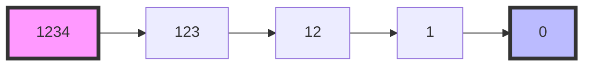

Bạn đã bao giờ tự hỏi làm thế nào để đếm số lượng chữ số trong một số? Ví dụ, số 12345 có 5 chữ số, số 1000 có 4 chữ số. Trong bài viết này, chúng ta sẽ tìm hiểu các cách khác nhau để giải quyết bài toán này, từ cách đơn giản nhất đến cách tối ưu nhất.

<!-- truncate -->

## Hiểu về bài toán

Trước khi đi vào giải pháp, hãy phân tích bài toán một cách chi tiết:

### Input/Output
- **Input**: Một số nguyên n
- **Output**: Số lượng chữ số của n

### Ví dụ
- n = 123 → output = 3
- n = 1000 → output = 4 
- n = 0 → output = 1
- n = -123 → output = 3 (không tính dấu trừ)

:::note
Với số âm, ta chỉ đếm các chữ số và bỏ qua dấu trừ.
:::

## Các phương pháp giải quyết

### 1. Phương pháp chuyển sang chuỗi

Đây là phương pháp đơn giản và hiệu quả nhất:
1. Chuyển số nguyên thành chuỗi (string)
2. Lấy độ dài của chuỗi
3. Nếu là số âm thì trừ đi 1 (bỏ dấu trừ)

:::tip Ý tưởng
Mỗi chữ số tương ứng với một ký tự trong chuỗi. Độ dài chuỗi (trừ đi dấu trừ nếu có) chính là số lượng chữ số.
:::

### 2. Phương pháp chia lặp

Cách tiếp cận bằng toán học là chia số đó cho 10 liên tục cho đến khi bằng 0 và đếm số lần chia:



:::tip Ý tưởng
Mỗi lần chia cho 10 sẽ loại bỏ một chữ số cuối cùng. Đếm số lần chia đến khi số bằng 0 chính là số lượng chữ số.
:::

### 2. Phương pháp logarit

Một cách khác là sử dụng logarit cơ số 10:
- Với số n có d chữ số, ta có: $10^{d-1} ≤ n < 10^d$
- Do đó: $d-1 ≤ \log_{10}(n) < d$
- Vậy: $d = \lfloor\log_{10}(n)\rfloor + 1$

:::info Ví dụ
Với n = 123:
- $\log_{10}(123) ≈ 2.089$
- $\lfloor2.089\rfloor = 2$
- Số chữ số = 2 + 1 = 3
:::

## Cài đặt các giải pháp

### 1. Cài đặt bằng C++

```cpp
#include <iostream>
#include <cmath>
#include <string>
using namespace std;

// Phương pháp chuyển sang chuỗi
int countDigitsString(int n) {
    // Chuyển số thành chuỗi
    string numStr = to_string(abs(n));
    return numStr.length();
}

// Phương pháp chia lặp
int countDigitsDivision(int n) {
    // Chuyển số âm thành dương
    n = abs(n);
    
    // Trường hợp đặc biệt: n = 0
    if (n == 0) return 1;
    
    int count = 0;
    while (n > 0) {
        n /= 10;
        count++;
    }
    return count;
}

// Phương pháp logarit
int countDigitsLog(int n) {
    // Chuyển số âm thành dương
    n = abs(n);
    
    // Trường hợp đặc biệt: n = 0
    if (n == 0) return 1;
    
    return floor(log10(n)) + 1;
}

int main() {
    int n;
    cout << "Nhap so n = ";
    cin >> n;
    
    cout << "So chu so (chuoi): " << countDigitsString(n) << endl;
    cout << "So chu so (chia): " << countDigitsDivision(n) << endl;
    cout << "So chu so (logarit): " << countDigitsLog(n) << endl;
    
    return 0;
}
```

### 2. Cài đặt bằng Python

```python
import math

def count_digits_string(n: int) -> int:
    """Đếm số chữ số bằng phương pháp chuyển sang chuỗi"""
    return len(str(abs(n)))

def count_digits_division(n: int) -> int:
    """Đếm số chữ số bằng phương pháp chia lặp"""
    # Chuyển số âm thành dương
    n = abs(n)
    
    # Trường hợp đặc biệt: n = 0
    if n == 0:
        return 1
    
    count = 0
    while n > 0:
        n //= 10  # Chia lấy phần nguyên trong Python
        count += 1
    return count

def count_digits_log(n: int) -> int:
    """Đếm số chữ số bằng phương pháp logarit"""
    # Chuyển số âm thành dương
    n = abs(n)
    
    # Trường hợp đặc biệt: n = 0
    if n == 0:
        return 1
    
    return math.floor(math.log10(n)) + 1

# Test các hàm
if __name__ == "__main__":
    n = int(input("Nhap n = "))
    print(f"So chu so (chuoi): {count_digits_string(n)}")
    print(f"So chu so (chia): {count_digits_division(n)}")
    print(f"So chu so (logarit): {count_digits_log(n)}")
```

### 3. Cài đặt bằng Java

```java
import java.util.Scanner;

public class CountDigits {
    // Phương pháp chuyển sang chuỗi
    public static int countDigitsString(int n) {
        // Chuyển số thành chuỗi, bỏ dấu âm nếu có
        return String.valueOf(Math.abs(n)).length();
    }
    
    // Phương pháp chia lặp
    public static int countDigitsDivision(int n) {
        // Chuyển số âm thành dương
        n = Math.abs(n);
        
        // Trường hợp đặc biệt: n = 0
        if (n == 0) return 1;
        
        int count = 0;
        while (n > 0) {
            n /= 10;
            count++;
        }
        return count;
    }
    
    // Phương pháp logarit
    public static int countDigitsLog(int n) {
        // Chuyển số âm thành dương
        n = Math.abs(n);
        
        // Trường hợp đặc biệt: n = 0
        if (n == 0) return 1;
        
        return (int) Math.floor(Math.log10(n)) + 1;
    }
    
    public static void main(String[] args) {
        Scanner scanner = new Scanner(System.in);
        System.out.print("Nhap n = ");
        int n = scanner.nextInt();
        
        System.out.println("So chu so (chuoi): " + countDigitsString(n));
        System.out.println("So chu so (chia): " + countDigitsDivision(n));
        System.out.println("So chu so (logarit): " + countDigitsLog(n));
        
        scanner.close();
    }
}
```

## Phân tích độ phức tạp

### 1. Phương pháp chuyển sang chuỗi
- **Thời gian**: O(1) - Chỉ cần chuyển đổi và lấy độ dài
- **Không gian**: O(log n) - Cần lưu chuỗi có độ dài tương ứng số chữ số
- **Ưu điểm**: Đơn giản, dễ hiểu và cài đặt
- **Nhược điểm**: Tốn bộ nhớ để lưu chuỗi

### 2. Phương pháp chia lặp
- **Thời gian**: O(log n) - Với số n, ta cần chia log₁₀(n) lần
- **Không gian**: O(1) - Chỉ cần biến đếm
- **Ưu điểm**: Tiết kiệm bộ nhớ
- **Nhược điểm**: Chậm hơn các phương pháp khác

### 3. Phương pháp logarit
- **Thời gian**: O(1) - Chỉ cần tính logarit một lần
- **Không gian**: O(1) - Không cần thêm biến phụ
- **Ưu điểm**: Nhanh về mặt lý thuyết
- **Nhược điểm**: Phép tính logarit có thể chậm trên thực tế

:::tip So sánh
1. **Về tốc độ**: string > logarit > chia lặp
2. **Về bộ nhớ**: logarit = chia lặp > string
3. **Về tính đơn giản**: string > chia lặp > logarit
4. **Khuyến nghị**:
   - Với số nhỏ: Dùng phương pháp string vì đơn giản
   - Với số rất lớn: Cân nhắc phương pháp chia lặp để tiết kiệm bộ nhớ
   - Trong thực tế: Phương pháp string thường là lựa chọn tốt nhất
:::

## Mở rộng bài toán

1. **Đếm số chữ số của số nguyên lớn**:
   - Với số quá lớn (vượt quá kiểu int/long), ta có thể:
   - Dùng chuỗi string để lưu số
   - Độ dài chuỗi chính là số chữ số

2. **Đếm số chữ số của số thực**:
   - Cần xử lý phần thập phân
   - Có thể chuyển về chuỗi và đếm
   - Hoặc nhân với 10^k để chuyển về số nguyên

## Bài tập thực hành

1. Đếm số chữ số của một số nguyên lớn (> 2⁶⁴)
2. Đếm số chữ số của số thập phân (ví dụ: 123.456)
3. Đếm số lượng chữ số 0 ở cuối của n! (giai thừa)
4. Tìm số có k chữ số nhỏ nhất và lớn nhất

## Tài liệu tham khảo

1. Introduction to Algorithms - CLRS (Phần Number Theory)
2. Mathematics for Computer Science - MIT OpenCourseWare
3. [Project Euler - Problem 25](https://projecteuler.net/problem=25) - Bài tập liên quan
