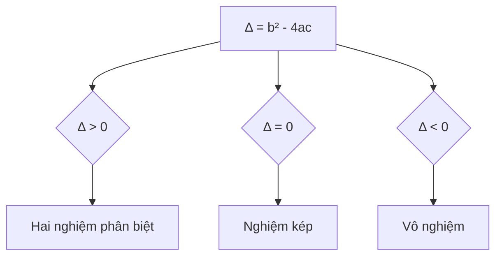

Phương trình bậc hai là một trong những kiến thức cơ bản nhất trong toán học, và việc cài đặt chương trình giải phương trình bậc hai là một bài tập lập trình tuyệt vời để học cách xử lý các trường hợp đặc biệt. Cùng tìm hiểu cách giải quyết bài toán này một cách toàn diện.

<!-- truncate -->

## Hiểu về bài toán

### Định nghĩa
Phương trình bậc hai có dạng tổng quát:

$$ax^2 + bx + c = 0 \quad (a \neq 0)$$

### Input/Output
- **Input**: Các hệ số a, b, c
- **Output**: Nghiệm của phương trình (nếu có)

### Công thức nghiệm

$x = \frac{-b \pm \sqrt{b^2 - 4ac}}{2a}$

## Phân tích các trường hợp

### 1. Phân loại theo biệt số (Delta)

$$
\Delta = b^2 - 4ac
$$



### 2. Các trường hợp đặc biệt

:::warning Lưu ý
1. a = 0: Không phải phương trình bậc 2
2. Phép chia cho 0
3. Số phức (khi Δ < 0)
4. Độ chính xác số thực
:::

## Cài đặt giải pháp

### 1. Cài đặt bằng C++

```cpp
#include <iostream>
#include <cmath>
using namespace std;

// Cấu trúc lưu kết quả
struct QuadraticResult {
    int numSolutions;     // Số lượng nghiệm
    double x1;           // Nghiệm thứ nhất
    double x2;           // Nghiệm thứ hai
    
    // Constructor
    QuadraticResult(int n = 0, double r1 = 0, double r2 = 0) 
        : numSolutions(n), x1(r1), x2(r2) {}
};

// Hàm giải phương trình bậc hai
QuadraticResult solveQuadratic(double a, double b, double c) {
    const double EPSILON = 1e-10;  // Độ chính xác cho số thực
    
    // Kiểm tra a = 0
    if (abs(a) < EPSILON) {
        // Trường hợp bx + c = 0
        if (abs(b) < EPSILON) {
            // Nếu b = 0
            return (abs(c) < EPSILON) 
                ? QuadraticResult(-1, 0, 0)  // Vô số nghiệm
                : QuadraticResult(0, 0, 0);   // Vô nghiệm
        }
        // Phương trình bậc nhất
        return QuadraticResult(1, -c/b, -c/b);
    }
    
    // Tính biệt số
    double delta = b*b - 4*a*c;
    
    // Phân loại theo delta
    if (abs(delta) < EPSILON) {
        // Nghiệm kép
        double x = -b/(2*a);
        return QuadraticResult(1, x, x);
    } else if (delta > 0) {
        // Hai nghiệm phân biệt
        double sqrtDelta = sqrt(delta);
        double x1 = (-b + sqrtDelta)/(2*a);
        double x2 = (-b - sqrtDelta)/(2*a);
        return QuadraticResult(2, x1, x2);
    } else {
        // Vô nghiệm thực
        return QuadraticResult(0, 0, 0);
    }
}

// Hàm in kết quả
void printResult(const QuadraticResult& result) {
    switch (result.numSolutions) {
        case -1:
            cout << "Phuong trinh co vo so nghiem" << endl;
            break;
        case 0:
            cout << "Phuong trinh vo nghiem" << endl;
            break;
        case 1:
            cout << "Phuong trinh co nghiem kep x = " << result.x1 << endl;
            break;
        case 2:
            cout << "Phuong trinh co hai nghiem:" << endl;
            cout << "x1 = " << result.x1 << endl;
            cout << "x2 = " << result.x2 << endl;
            break;
    }
}

int main() {
    double a, b, c;
    
    // Nhập hệ số
    cout << "Nhap he so a = ";
    cin >> a;
    cout << "Nhap he so b = ";
    cin >> b;
    cout << "Nhap he so c = ";
    cin >> c;
    
    // Giải và in kết quả
    QuadraticResult result = solveQuadratic(a, b, c);
    printResult(result);
    
    return 0;
}
```

### 2. Cài đặt bằng Python

```python
from dataclasses import dataclass
from math import sqrt
from typing import Tuple, Optional

@dataclass
class QuadraticResult:
    """Lưu kết quả giải phương trình bậc hai"""
    num_solutions: int  # -1: vô số nghiệm, 0: vô nghiệm, 1: nghiệm kép, 2: hai nghiệm
    x1: float = 0.0    # Nghiệm thứ nhất
    x2: float = 0.0    # Nghiệm thứ hai

def solve_quadratic(a: float, b: float, c: float) -> QuadraticResult:
    """Giải phương trình bậc hai ax² + bx + c = 0"""
    EPSILON = 1e-10  # Độ chính xác cho số thực
    
    # Kiểm tra a = 0
    if abs(a) < EPSILON:
        # Trường hợp bx + c = 0
        if abs(b) < EPSILON:
            # Nếu b = 0
            return QuadraticResult(-1 if abs(c) < EPSILON else 0)
        # Phương trình bậc nhất
        return QuadraticResult(1, -c/b, -c/b)
    
    # Tính biệt số
    delta = b*b - 4*a*c
    
    # Phân loại theo delta
    if abs(delta) < EPSILON:
        # Nghiệm kép
        x = -b/(2*a)
        return QuadraticResult(1, x, x)
    elif delta > 0:
        # Hai nghiệm phân biệt
        sqrt_delta = sqrt(delta)
        x1 = (-b + sqrt_delta)/(2*a)
        x2 = (-b - sqrt_delta)/(2*a)
        return QuadraticResult(2, x1, x2)
    else:
        # Vô nghiệm thực
        return QuadraticResult(0)

def print_result(result: QuadraticResult) -> None:
    """In kết quả giải phương trình"""
    if result.num_solutions == -1:
        print("Phuong trinh co vo so nghiem")
    elif result.num_solutions == 0:
        print("Phuong trinh vo nghiem")
    elif result.num_solutions == 1:
        print(f"Phuong trinh co nghiem kep x = {result.x1}")
    else:
        print("Phuong trinh co hai nghiem:")
        print(f"x1 = {result.x1}")
        print(f"x2 = {result.x2}")

def main():
    # Nhập hệ số
    a = float(input("Nhap he so a = "))
    b = float(input("Nhap he so b = "))
    c = float(input("Nhap he so c = "))
    
    # Giải và in kết quả
    result = solve_quadratic(a, b, c)
    print_result(result)

if __name__ == "__main__":
    main()
```

### 3. Cài đặt bằng Java

```java
import java.util.Scanner;

class QuadraticResult {
    public final int numSolutions;  // -1: vô số nghiệm, 0: vô nghiệm, 1: nghiệm kép, 2: hai nghiệm
    public final double x1;         // Nghiệm thứ nhất
    public final double x2;         // Nghiệm thứ hai
    
    public QuadraticResult(int numSolutions, double x1, double x2) {
        this.numSolutions = numSolutions;
        this.x1 = x1;
        this.x2 = x2;
    }
    
    public QuadraticResult(int numSolutions) {
        this(numSolutions, 0, 0);
    }
}

public class QuadraticEquation {
    private static final double EPSILON = 1e-10;  // Độ chính xác cho số thực
    
    public static QuadraticResult solve(double a, double b, double c) {
        // Kiểm tra a = 0
        if (Math.abs(a) < EPSILON) {
            // Trường hợp bx + c = 0
            if (Math.abs(b) < EPSILON) {
                // Nếu b = 0
                return Math.abs(c) < EPSILON 
                    ? new QuadraticResult(-1) // Vô số nghiệm
                    : new QuadraticResult(0);  // Vô nghiệm
            }
            // Phương trình bậc nhất
            double x = -c/b;
            return new QuadraticResult(1, x, x);
        }
        
        // Tính biệt số
        double delta = b*b - 4*a*c;
        
        // Phân loại theo delta
        if (Math.abs(delta) < EPSILON) {
            // Nghiệm kép
            double x = -b/(2*a);
            return new QuadraticResult(1, x, x);
        } else if (delta > 0) {
            // Hai nghiệm phân biệt
            double sqrtDelta = Math.sqrt(delta);
            double x1 = (-b + sqrtDelta)/(2*a);
            double x2 = (-b - sqrtDelta)/(2*a);
            return new QuadraticResult(2, x1, x2);
        } else {
            // Vô nghiệm thực
            return new QuadraticResult(0);
        }
    }
    
    public static void printResult(QuadraticResult result) {
        switch (result.numSolutions) {
            case -1:
                System.out.println("Phuong trinh co vo so nghiem");
                break;
            case 0:
                System.out.println("Phuong trinh vo nghiem");
                break;
            case 1:
                System.out.printf("Phuong trinh co nghiem kep x = %.6f%n", 
                                result.x1);
                break;
            case 2:
                System.out.println("Phuong trinh co hai nghiem:");
                System.out.printf("x1 = %.6f%n", result.x1);
                System.out.printf("x2 = %.6f%n", result.x2);
                break;
        }
    }
    
    public static void main(String[] args) {
        Scanner scanner = new Scanner(System.in);
        
        // Nhập hệ số
        System.out.print("Nhap he so a = ");
        double a = scanner.nextDouble();
        
        System.out.print("Nhap he so b = ");
        double b = scanner.nextDouble();
        
        System.out.print("Nhap he so c = ");
        double c = scanner.nextDouble();
        
        // Giải và in kết quả
        QuadraticResult result = solve(a, b, c);
        printResult(result);
        
        scanner.close();
    }
}
```

## Xử lý số thực

### 1. Độ chính xác
- Sử dụng hằng số EPSILON để so sánh số thực
- Giá trị thông dụng: 1e-10 hoặc 1e-6

:::tip
```cpp
bool isEqual(double a, double b) {
    return abs(a - b) < EPSILON;
}
```
:::

### 2. Làm tròn số
- Số chữ số thập phân phù hợp
- Tránh hiển thị số quá dài

### 3. Xử lý lỗi số học
- Chia cho 0
- Căn bậc hai số âm
- Tràn số

## Các trường hợp đặc biệt

### 1. Phương trình bậc nhất (a = 0)
- Kiểm tra b = 0
  - Nếu c = 0: Vô số nghiệm
  - Nếu c ≠ 0: Vô nghiệm
- Nếu b ≠ 0: x = -c/b

### 2. Phương trình thuần bậc hai (b = 0)
- $$ax^2 + c = 0$$
- $$x = \pm\sqrt{\frac{-c}{a}}$$ nếu $$\frac{-c}{a} \geq 0$$

### 3. Phương trình có hệ số phức tạp
- Có thể cần xử lý riêng để tránh mất độ chính xác
- Sử dụng thuật toán ổn định số học

## Ứng dụng và mở rộng

### 1. Hệ phương trình bậc hai
- Giải hệ hai ẩn
- Phương pháp thế

### 2. Bất phương trình bậc hai
- Xét dấu $$ax^2 + bx + c$$
- Vẽ đồ thị parabol

### 3. Phương trình bậc cao rút về bậc hai
- Phương trình bậc bốn
- Đặt ẩn phụ

## Phân tích độ phức tạp

### Thời gian
- O(1) - Các phép tính cơ bản
- Không phụ thuộc kích thước input

### Không gian
- O(1) - Chỉ cần vài biến
- Bộ nhớ cố định

## Bài tập thực hành

1. Giải hệ phương trình bậc hai
2. Vẽ đồ thị hàm số bậc hai
3. Tìm các tham số để phương trình có nghiệm đặc biệt
4. Giải phương trình bậc hai với hệ số phức

## Tài liệu tham khảo

1. Numerical Recipes in C++ - W.H. Press
2. Art of Computer Programming - Donald Knuth
3. [What Every Computer Scientist Should Know About Floating-Point Arithmetic](https://docs.oracle.com/cd/E19957-01/806-3568/ncg_goldberg.html)
4. Mathematics for Computer Science - MIT OpenCourseWare
