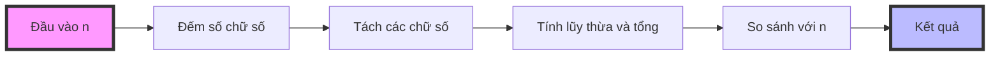

Số Armstrong (hay còn gọi là số Narcissistic) là một số đặc biệt bằng tổng các lũy thừa của các chữ số của nó, với số mũ là số lượng chữ số. Ví dụ, 153 = 1³ + 5³ + 3³. Hãy cùng tìm hiểu cách nhận biết và cài đặt thuật toán kiểm tra loại số thú vị này.

<!-- truncate -->

## Hiểu về số Armstrong

### Định nghĩa
Một số Armstrong n chữ số là số có tổng các lũy thừa bậc n của từng chữ số bằng chính nó.

### Ví dụ
- 153 = 1³ + 5³ + 3³ = 1 + 125 + 27 = 153 (số Armstrong 3 chữ số)
- 370 = 3³ + 7³ + 0³ = 27 + 343 + 0 = 370
- 407 = 4³ + 0³ + 7³ = 64 + 0 + 343 = 407

:::info Lịch sử
Tên gọi "số Armstrong" được đặt theo Michael F. Armstrong, một nhà toán học người Mỹ. Tuy nhiên, trong một số tài liệu, chúng còn được gọi là số narcissistic (tự mãn) vì "tổng các phần tử tạo nên chính nó".
:::

## Phương pháp giải quyết

### 1. Các bước cơ bản



1. Đếm số chữ số của số đầu vào
2. Tách từng chữ số
3. Tính lũy thừa với số mũ là số chữ số
4. Tính tổng các lũy thừa
5. So sánh với số ban đầu

### 2. Tối ưu hóa
- Cần xử lý số 0 riêng vì 0^n = 0
- Có thể tính trước các lũy thừa thường gặp
- Giới hạn khoảng tìm kiếm dựa vào số chữ số

## Cài đặt các giải pháp

### 1. Cài đặt bằng C++

```cpp
#include <iostream>
#include <cmath>
using namespace std;

// Đếm số chữ số
int countDigits(int n) {
    if (n == 0) return 1;
    return floor(log10(abs(n))) + 1;
}

// Kiểm tra số Armstrong
bool isArmstrong(int n) {
    if (n < 0) return false;  // Số âm không phải số Armstrong
    
    int originalNum = n;
    int numDigits = countDigits(n);
    int sum = 0;
    
    // Tính tổng lũy thừa các chữ số
    while (n > 0) {
        int digit = n % 10;
        sum += pow(digit, numDigits);
        n /= 10;
    }
    
    return sum == originalNum;
}

// Tìm các số Armstrong trong khoảng
void findArmstrongNumbers(int start, int end) {
    cout << "Cac so Armstrong trong khoang [" << start << ", " << end << "]: ";
    for (int i = start; i <= end; i++) {
        if (isArmstrong(i)) {
            cout << i << " ";
        }
    }
    cout << endl;
}

int main() {
    // Test số đơn lẻ
    int n;
    cout << "Nhap so can kiem tra: ";
    cin >> n;
    
    if (isArmstrong(n)) {
        cout << n << " la so Armstrong" << endl;
    } else {
        cout << n << " khong phai so Armstrong" << endl;
    }
    
    // Tìm số Armstrong trong khoảng
    findArmstrongNumbers(100, 999);  // Tìm số Armstrong 3 chữ số
    
    return 0;
}
```

### 2. Cài đặt bằng Python

```python
from math import log10, floor

def count_digits(n: int) -> int:
    """Đếm số chữ số của một số"""
    if n == 0:
        return 1
    return floor(log10(abs(n))) + 1

def is_armstrong(n: int) -> bool:
    """Kiểm tra số Armstrong"""
    if n < 0:
        return False
        
    num_digits = count_digits(n)
    total = sum(int(digit) ** num_digits for digit in str(n))
    return total == n

def find_armstrong_numbers(start: int, end: int) -> list:
    """Tìm tất cả số Armstrong trong khoảng [start, end]"""
    return [num for num in range(start, end + 1) if is_armstrong(num)]

# Phiên bản tối ưu với cache lũy thừa
def is_armstrong_optimized(n: int) -> bool:
    """Kiểm tra số Armstrong với cache lũy thừa"""
    if n < 0:
        return False
        
    # Cache các lũy thừa thường dùng
    num_digits = count_digits(n)
    power_cache = {str(d): pow(d, num_digits) for d in range(10)}
    
    total = sum(power_cache[digit] for digit in str(n))
    return total == n

if __name__ == "__main__":
    # Test số đơn lẻ
    n = int(input("Nhap so can kiem tra: "))
    if is_armstrong(n):
        print(f"{n} la so Armstrong")
    else:
        print(f"{n} khong phai so Armstrong")
    
    # Tìm số Armstrong 3 chữ số
    armstrong_numbers = find_armstrong_numbers(100, 999)
    print(f"Cac so Armstrong co 3 chu so: {armstrong_numbers}")
```

### 3. Cài đặt bằng Java

```java
import java.util.ArrayList;
import java.util.List;
import java.util.Scanner;

public class ArmstrongNumber {
    // Đếm số chữ số
    private static int countDigits(int n) {
        if (n == 0) return 1;
        return (int) Math.floor(Math.log10(Math.abs(n))) + 1;
    }
    
    // Kiểm tra số Armstrong
    public static boolean isArmstrong(int n) {
        if (n < 0) return false;
        
        int originalNum = n;
        int numDigits = countDigits(n);
        int sum = 0;
        
        while (n > 0) {
            int digit = n % 10;
            sum += Math.pow(digit, numDigits);
            n /= 10;
        }
        
        return sum == originalNum;
    }
    
    // Tìm số Armstrong trong khoảng
    public static List<Integer> findArmstrongNumbers(int start, int end) {
        List<Integer> result = new ArrayList<>();
        for (int i = start; i <= end; i++) {
            if (isArmstrong(i)) {
                result.add(i);
            }
        }
        return result;
    }
    
    public static void main(String[] args) {
        Scanner scanner = new Scanner(System.in);
        
        // Test số đơn lẻ
        System.out.print("Nhap so can kiem tra: ");
        int n = scanner.nextInt();
        
        if (isArmstrong(n)) {
            System.out.println(n + " la so Armstrong");
        } else {
            System.out.println(n + " khong phai so Armstrong");
        }
        
        // Tìm số Armstrong 3 chữ số
        List<Integer> armstrongNumbers = findArmstrongNumbers(100, 999);
        System.out.println("Cac so Armstrong co 3 chu so: " + armstrongNumbers);
        
        scanner.close();
    }
}
```

## Phân tích độ phức tạp

### Kiểm tra một số
- **Thời gian**: O(d) - với d là số chữ số
- **Không gian**: O(1) - chỉ cần vài biến phụ

### Tìm trong khoảng [a,b]
- **Thời gian**: O((b-a) × d) - kiểm tra mỗi số trong khoảng
- **Không gian**: O(1) - không tính mảng kết quả

:::tip Tối ưu hóa
1. Cache lũy thừa thường dùng
2. Giới hạn khoảng tìm kiếm
3. Sử dụng phép toán bit thay phép chia khi có thể
:::

## Các số Armstrong thú vị

### Số Armstrong 1 chữ số
- Tất cả các số một chữ số đều là số Armstrong
- Vì n¹ = n với n từ 0 đến 9

### Số Armstrong 2 chữ số
- Không tồn tại số Armstrong 2 chữ số!
- Vì ab ≠ a² + b² với mọi số 2 chữ số ab

### Số Armstrong 3 chữ số
- 153 = 1³ + 5³ + 3³
- 370 = 3³ + 7³ + 0³
- 371 = 3³ + 7³ + 1³
- 407 = 4³ + 0³ + 7³

:::note Thống kê
- 1 chữ số: 9 số (0-9)
- 2 chữ số: 0 số
- 3 chữ số: 4 số (153, 370, 371, 407)
- 4 chữ số: 3 số (1634, 8208, 9474)
:::

## Biến thể của bài toán

### 1. Số Armstrong suy rộng
- Cho phép số mũ khác với số chữ số
- Ví dụ: Tổng lũy thừa bậc 2 của các chữ số

### 2. Số Armstrong trong hệ cơ số khác
- Xét trong hệ nhị phân, bát phân...
- Thay đổi cách tính lũy thừa

### 3. Số Munchausen
- Biến thể đặc biệt: mỗi chữ số là cơ số của lũy thừa
- Ví dụ: 3435 = 3³ + 4⁴ + 3³ + 5⁵

## Bài tập thực hành

1. Tìm tất cả số Armstrong có 4 chữ số
2. Tìm số Armstrong nhỏ nhất có n chữ số
3. Kiểm tra số Armstrong trong hệ cơ số 2
4. Cài đặt tối ưu với cache lũy thừa

## Tài liệu tham khảo

1. [OEIS - Sequence A005188](https://oeis.org/A005188) - Dãy số Armstrong
2. The Art of Computer Programming - Donald Knuth (Volume 2)
3. [Wikipedia - Narcissistic number](https://en.wikipedia.org/wiki/Narcissistic_number)
4. Number Theory and Its Applications - S.L. Segal
