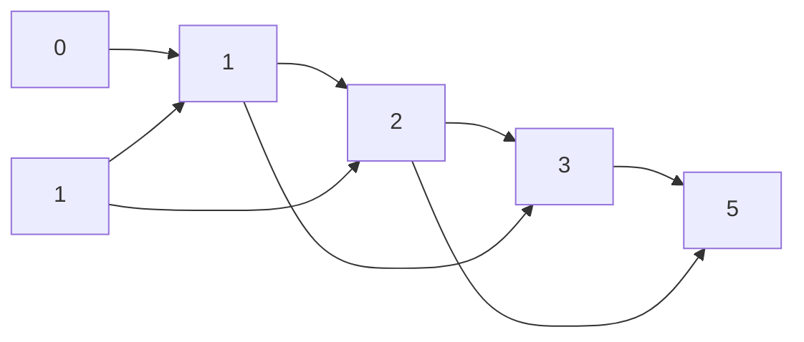
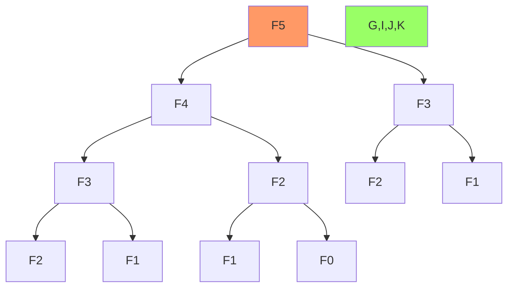
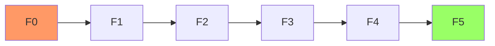

Dãy Fibonacci là một trong những dãy số nổi tiếng nhất trong toán học, xuất hiện trong nhiều hiện tượng tự nhiên. Trong bài viết này, chúng ta sẽ tìm hiểu các phương pháp khác nhau để tính số Fibonacci thứ n, từ cách đơn giản đến các giải thuật tối ưu.

<!-- truncate -->

## Hiểu về dãy Fibonacci

### Định nghĩa
Dãy Fibonacci là dãy số bắt đầu từ 0, 1 và mỗi số tiếp theo bằng tổng hai số liền trước:
- F(0) = 0
- F(1) = 1
- F(n) = F(n-1) + F(n-2) với n ≥ 2



### Ứng dụng thực tế
1. Mô hình tăng trưởng quần thể
2. Xoắn ốc tự nhiên trong vỏ ốc, hoa hướng dương
3. Thiết kế đồ họa và kiến trúc
4. Phân tích thị trường tài chính

## Các phương pháp giải quyết

### 1. Đệ quy đơn giản
Cách tiếp cận trực tiếp từ định nghĩa:


:::warning Nhược điểm
- Tính toán lặp lại nhiều lần
- Độ phức tạp thời gian lớn O(2ⁿ)
:::

### 2. Quy hoạch động
Lưu trữ kết quả đã tính để tái sử dụng:


### 3. Ma trận lũy thừa
Sử dụng tính chất ma trận:
$$
\begin{bmatrix} F_{n+1} \\ F_n \end{bmatrix} = 
\begin{bmatrix} 1 & 1 \\ 1 & 0 \end{bmatrix}^n
\begin{bmatrix} 1 \\ 0 \end{bmatrix}
$$

## Cài đặt các giải pháp

### 1. Cài đặt bằng C++

```cpp
#include <iostream>
#include <vector>
using namespace std;

// Phương pháp đệ quy đơn giản
long long fibRecursive(int n) {
    if (n <= 1) return n;
    return fibRecursive(n - 1) + fibRecursive(n - 2);
}

// Phương pháp quy hoạch động với mảng
long long fibDP(int n) {
    if (n <= 1) return n;
    
    vector<long long> f(n + 1);
    f[0] = 0;
    f[1] = 1;
    
    for (int i = 2; i <= n; i++) {
        f[i] = f[i-1] + f[i-2];
    }
    
    return f[n];
}

// Phương pháp quy hoạch động với 2 biến
long long fibDPOptimized(int n) {
    if (n <= 1) return n;
    
    long long prev = 0, curr = 1;
    for (int i = 2; i <= n; i++) {
        long long next = prev + curr;
        prev = curr;
        curr = next;
    }
    
    return curr;
}

// Phương pháp ma trận lũy thừa
void multiply(long long F[2][2], long long M[2][2]) {
    long long x = F[0][0] * M[0][0] + F[0][1] * M[1][0];
    long long y = F[0][0] * M[0][1] + F[0][1] * M[1][1];
    long long z = F[1][0] * M[0][0] + F[1][1] * M[1][0];
    long long w = F[1][0] * M[0][1] + F[1][1] * M[1][1];
    
    F[0][0] = x;
    F[0][1] = y;
    F[1][0] = z;
    F[1][1] = w;
}

void power(long long F[2][2], int n) {
    if (n <= 1) return;
    
    long long M[2][2] = {{1, 1}, {1, 0}};
    power(F, n/2);
    multiply(F, F);
    
    if (n % 2 != 0)
        multiply(F, M);
}

long long fibMatrix(int n) {
    if (n <= 1) return n;
    
    long long F[2][2] = {{1, 1}, {1, 0}};
    power(F, n - 1);
    return F[0][0];
}

int main() {
    int n;
    cout << "Nhap n = ";
    cin >> n;
    
    cout << "So Fibonacci thu " << n << " (de quy): " 
         << fibRecursive(n) << endl;
         
    cout << "So Fibonacci thu " << n << " (QHD mang): " 
         << fibDP(n) << endl;
         
    cout << "So Fibonacci thu " << n << " (QHD toi uu): " 
         << fibDPOptimized(n) << endl;
         
    cout << "So Fibonacci thu " << n << " (ma tran): " 
         << fibMatrix(n) << endl;
    
    return 0;
}
```

### 2. Cài đặt bằng Python

```python
def fib_recursive(n: int) -> int:
    """Tính số Fibonacci bằng đệ quy đơn giản"""
    if n <= 1:
        return n
    return fib_recursive(n - 1) + fib_recursive(n - 2)

def fib_dp(n: int) -> int:
    """Tính số Fibonacci bằng quy hoạch động với mảng"""
    if n <= 1:
        return n
        
    # Khởi tạo mảng
    f = [0] * (n + 1)
    f[1] = 1
    
    # Điền mảng
    for i in range(2, n + 1):
        f[i] = f[i-1] + f[i-2]
        
    return f[n]

def fib_dp_optimized(n: int) -> int:
    """Tính số Fibonacci bằng quy hoạch động tối ưu"""
    if n <= 1:
        return n
        
    prev, curr = 0, 1
    for _ in range(2, n + 1):
        prev, curr = curr, prev + curr
        
    return curr

def matrix_multiply(A: list, B: list) -> list:
    """Nhân hai ma trận 2x2"""
    return [
        [A[0][0]*B[0][0] + A[0][1]*B[1][0], A[0][0]*B[0][1] + A[0][1]*B[1][1]],
        [A[1][0]*B[0][0] + A[1][1]*B[1][0], A[1][0]*B[0][1] + A[1][1]*B[1][1]]
    ]

def matrix_power(A: list, n: int) -> list:
    """Tính lũy thừa ma trận bằng chia để trị"""
    if n == 0:
        return [[1, 0], [0, 1]]
    if n == 1:
        return A
        
    half = matrix_power(A, n // 2)
    square = matrix_multiply(half, half)
    
    if n % 2 == 0:
        return square
    return matrix_multiply(square, A)

def fib_matrix(n: int) -> int:
    """Tính số Fibonacci bằng phương pháp ma trận"""
    if n <= 1:
        return n
        
    A = [[1, 1], [1, 0]]
    result = matrix_power(A, n - 1)
    return result[0][0]

if __name__ == "__main__":
    n = int(input("Nhap n = "))
    
    # So sánh các phương pháp
    print(f"So Fibonacci thu {n} (de quy): {fib_recursive(n)}")
    print(f"So Fibonacci thu {n} (QHD mang): {fib_dp(n)}")
    print(f"So Fibonacci thu {n} (QHD toi uu): {fib_dp_optimized(n)}")
    print(f"So Fibonacci thu {n} (ma tran): {fib_matrix(n)}")
```

### 3. Cài đặt bằng Java

```java
import java.util.Scanner;

public class Fibonacci {
    // Phương pháp đệ quy
    public static long fibRecursive(int n) {
        if (n <= 1) return n;
        return fibRecursive(n - 1) + fibRecursive(n - 2);
    }
    
    // Phương pháp quy hoạch động với mảng
    public static long fibDP(int n) {
        if (n <= 1) return n;
        
        long[] f = new long[n + 1];
        f[1] = 1;
        
        for (int i = 2; i <= n; i++) {
            f[i] = f[i-1] + f[i-2];
        }
        
        return f[n];
    }
    
    // Phương pháp quy hoạch động tối ưu
    public static long fibDPOptimized(int n) {
        if (n <= 1) return n;
        
        long prev = 0, curr = 1;
        for (int i = 2; i <= n; i++) {
            long next = prev + curr;
            prev = curr;
            curr = next;
        }
        
        return curr;
    }
    
    // Ma trận 2x2
    static class Matrix {
        long[][] data = new long[2][2];
        
        Matrix(long a00, long a01, long a10, long a11) {
            data[0][0] = a00;
            data[0][1] = a01;
            data[1][0] = a10;
            data[1][1] = a11;
        }
        
        Matrix multiply(Matrix other) {
            long a00 = data[0][0] * other.data[0][0] + data[0][1] * other.data[1][0];
            long a01 = data[0][0] * other.data[0][1] + data[0][1] * other.data[1][1];
            long a10 = data[1][0] * other.data[0][0] + data[1][1] * other.data[1][0];
            long a11 = data[1][0] * other.data[0][1] + data[1][1] * other.data[1][1];
            return new Matrix(a00, a01, a10, a11);
        }
    }
    
    // Phương pháp ma trận
    public static long fibMatrix(int n) {
        if (n <= 1) return n;
        
        Matrix base = new Matrix(1, 1, 1, 0);
        Matrix result = matrixPower(base, n - 1);
        return result.data[0][0];
    }
    
    private static Matrix matrixPower(Matrix base, int n) {
        if (n == 0) return new Matrix(1, 0, 0, 1);
        if (n == 1) return base;
        
        Matrix half = matrixPower(base, n / 2);
        Matrix result = half.multiply(half);
        
        if (n % 2 == 0) return result;
        return result.multiply(base);
    }
    
    public static void main(String[] args) {
        Scanner scanner = new Scanner(System.in);
        System.out.print("Nhap n = ");
        int n = scanner.nextInt();
        
        System.out.println("So Fibonacci thu " + n + " (de quy): " + 
                         fibRecursive(n));
                         
        System.out.println("So Fibonacci thu " + n + " (QHD mang): " + 
                         fibDP(n));
                         
        System.out.println("So Fibonacci thu " + n + " (QHD toi uu): " + 
                         fibDPOptimized(n));
                         
        System.out.println("So Fibonacci thu " + n + " (ma tran): " + 
                         fibMatrix(n));
                         
        scanner.close();
    }
}
```

## Phân tích độ phức tạp

### 1. Đệ quy đơn giản
- **Thời gian**: O(2ⁿ)
- **Không gian**: O(n) - độ sâu đệ quy
- **Ưu điểm**: Code đơn giản, dễ hiểu
- **Nhược điểm**: Rất chậm với n lớn

### 2. Quy hoạch động với mảng
- **Thời gian**: O(n)
- **Không gian**: O(n)
- **Ưu điểm**: Nhanh hơn đệ quy nhiều
- **Nhược điểm**: Tốn bộ nhớ

### 3. Quy hoạch động tối ưu
- **Thời gian**: O(n)
- **Không gian**: O(1)
- **Ưu điểm**: Tiết kiệm bộ nhớ
- **Nhược điểm**: Vẫn phải duyệt n lần

### 4. Ma trận lũy thừa
- **Thời gian**: O(log n)
- **Không gian**: O(1)
- **Ưu điểm**: Nhanh nhất với n lớn
- **Nhược điểm**: Code phức tạp hơn

## Các tính chất thú vị của dãy Fibonacci

### 1. Tỷ lệ vàng
Tỷ số giữa hai số Fibonacci liên tiếp tiến dần đến tỷ lệ vàng φ:
$$\lim_{n \to \infty} \frac{F_{n+1}}{F_n} = \phi = \frac{1 + \sqrt{5}}{2} \approx 1.618034$$

### 2. Công thức Binet
Công thức tính trực tiếp số Fibonacci thứ n:
$$F_n = \frac{\phi^n - (-\phi)^{-n}}{\sqrt{5}}$$

### 3. Tính chất chia hết
- F(n) chẵn khi và chỉ khi n chia hết cho 3
- F(n) chia hết cho 3 khi và chỉ khi n chia hết cho 4

## Các biến thể của bài toán

### 1. Dãy Tribonacci
- Mỗi số là tổng ba số trước
- T(n) = T(n-1) + T(n-2) + T(n-3)

### 2. Fibonacci với modulo
- Tìm F(n) mod m
- Sử dụng chu kỳ Pisano

### 3. Ma trận Fibonacci
- Tạo ma trận với các số Fibonacci
- Tìm các tính chất đặc biệt

## Bài tập thực hành

1. Tìm số Fibonacci thứ n mod m
2. Tìm số Fibonacci đầu tiên có n chữ số
3. Tìm GCD của hai số Fibonacci liên tiếp
4. Cài đặt dãy Tribonacci với quy hoạch động

## Tài liệu tham khảo

1. [OEIS - Fibonacci Numbers](https://oeis.org/A000045)
2. The Art of Computer Programming - Donald Knuth
3. Fibonacci Numbers - Václav Kotěšovec
4. [Project Euler - Problem 2](https://projecteuler.net/problem=2)
