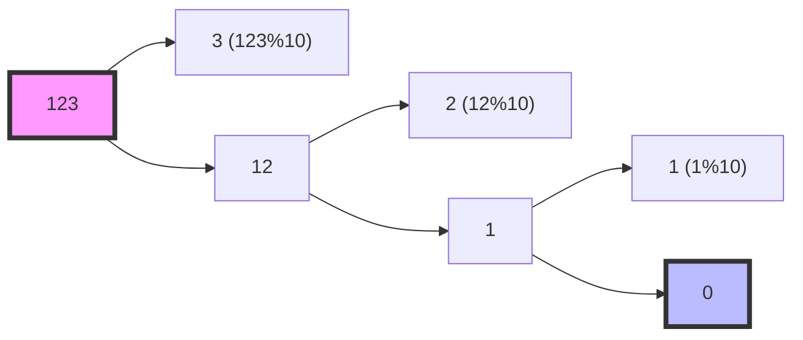

Bạn có biết tổng các chữ số của một số có thể tiết lộ nhiều tính chất toán học thú vị không? Ví dụ, một số chia hết cho 9 khi và chỉ khi tổng các chữ số của nó chia hết cho 9. Trong bài viết này, chúng ta sẽ tìm hiểu cách tính tổng các chữ số và khám phá một số ứng dụng thú vị của nó.

<!-- truncate -->

## Hiểu về bài toán

### Input/Output
- **Input**: Một số nguyên n
- **Output**: Tổng các chữ số của n

### Ví dụ
```
n = 123   → output = 1 + 2 + 3 = 6
n = 1000  → output = 1 + 0 + 0 + 0 = 1
n = -123  → output = 1 + 2 + 3 = 6 (không tính dấu trừ)
```

:::note Quy ước
Với số âm, ta chỉ tính tổng các chữ số và bỏ qua dấu trừ.
:::

## Các phương pháp giải quyết

### 1. Phương pháp chia lấy dư

Cách phổ biến nhất là sử dụng phép chia lấy dư (%) để lấy từng chữ số:



:::tip Công thức
- Chữ số cuối = n % 10
- Số còn lại = n / 10
:::

### 2. Phương pháp chuyển sang chuỗi

Một cách khác là chuyển số thành chuỗi và tính tổng các ký tự số:
1. Chuyển số thành string
2. Duyệt từng ký tự
3. Chuyển ký tự thành số và cộng vào tổng

## Cài đặt các giải pháp

### 1. Cài đặt bằng C++

```cpp
#include <iostream>
#include <string>
#include <cmath>
using namespace std;

// Phương pháp chia lấy dư
int sumDigitsDivision(int n) {
    // Chuyển số âm thành dương
    n = abs(n);
    
    int sum = 0;
    while (n > 0) {
        sum += n % 10;  // Cộng chữ số cuối
        n /= 10;       // Bỏ chữ số cuối
    }
    return sum;
}

// Phương pháp chuyển sang chuỗi
int sumDigitsString(int n) {
    // Chuyển số âm thành dương
    n = abs(n);
    
    // Chuyển số thành chuỗi
    string num = to_string(n);
    
    int sum = 0;
    // Duyệt từng ký tự trong chuỗi
    for (char digit : num) {
        sum += (digit - '0');  // Chuyển ký tự thành số
    }
    return sum;
}

int main() {
    int n;
    cout << "Nhap so n = ";
    cin >> n;
    
    cout << "Tong chu so (phuong phap 1): " << sumDigitsDivision(n) << endl;
    cout << "Tong chu so (phuong phap 2): " << sumDigitsString(n) << endl;
    
    return 0;
}
```

### 2. Cài đặt bằng Python

```python
def sum_digits_division(n: int) -> int:
    """Tính tổng các chữ số bằng phương pháp chia lấy dư"""
    # Chuyển số âm thành dương
    n = abs(n)
    
    total = 0
    while n > 0:
        total += n % 10  # Cộng chữ số cuối
        n //= 10        # Bỏ chữ số cuối
    return total

def sum_digits_string(n: int) -> int:
    """Tính tổng các chữ số bằng phương pháp chuyển sang chuỗi"""
    # Chuyển số âm thành dương và chuyển thành chuỗi
    num_str = str(abs(n))
    
    # Dùng list comprehension để tính tổng
    return sum(int(digit) for digit in num_str)

# Python còn có một cách ngắn gọn hơn
def sum_digits_pythonic(n: int) -> int:
    """Cách Pythonic để tính tổng các chữ số"""
    return sum(map(int, str(abs(n))))

if __name__ == "__main__":
    n = int(input("Nhap n = "))
    print(f"Tong chu so (phuong phap 1): {sum_digits_division(n)}")
    print(f"Tong chu so (phuong phap 2): {sum_digits_string(n)}")
    print(f"Tong chu so (phuong phap 3): {sum_digits_pythonic(n)}")
```

### 3. Cài đặt bằng Java

```java
import java.util.Scanner;

public class SumDigits {
    // Phương pháp chia lấy dư
    public static int sumDigitsDivision(int n) {
        // Chuyển số âm thành dương
        n = Math.abs(n);
        
        int sum = 0;
        while (n > 0) {
            sum += n % 10;  // Cộng chữ số cuối
            n /= 10;       // Bỏ chữ số cuối
        }
        return sum;
    }
    
    // Phương pháp chuyển sang chuỗi
    public static int sumDigitsString(int n) {
        // Chuyển số âm thành dương và chuyển thành chuỗi
        String numStr = String.valueOf(Math.abs(n));
        
        int sum = 0;
        for (char digit : numStr.toCharArray()) {
            sum += Character.getNumericValue(digit);
        }
        return sum;
    }
    
    public static void main(String[] args) {
        Scanner scanner = new Scanner(System.in);
        System.out.print("Nhap n = ");
        int n = scanner.nextInt();
        
        System.out.println("Tong chu so (phuong phap 1): " + sumDigitsDivision(n));
        System.out.println("Tong chu so (phuong phap 2): " + sumDigitsString(n));
        
        scanner.close();
    }
}
```

## Phân tích độ phức tạp

### 1. Phương pháp chia lấy dư
- **Thời gian**: O(log n) - Với số n cần log₁₀(n) bước
- **Không gian**: O(1) - Chỉ cần một biến tổng

### 2. Phương pháp chuyển sang chuỗi
- **Thời gian**: O(log n) - Độ dài chuỗi là log₁₀(n)
- **Không gian**: O(log n) - Cần lưu chuỗi có độ dài log₁₀(n)

:::tip So sánh
1. Phương pháp chia lấy dư:
   - Tốn ít bộ nhớ hơn
   - Hiệu quả với số nhỏ
   - Code dễ hiểu

2. Phương pháp chuyển chuỗi:
   - Code ngắn gọn hơn (đặc biệt trong Python)
   - Dễ mở rộng chức năng
   - Tốn thêm bộ nhớ
:::

## Ứng dụng thú vị

### 1. Kiểm tra chia hết cho 9

Một số chia hết cho 9 khi và chỉ khi tổng các chữ số của nó chia hết cho 9.

```python
def divisible_by_9(n: int) -> bool:
    return sum_digits_division(n) % 9 == 0
```

:::info Ví dụ
- 729 → 7+2+9 = 18 → 1+8 = 9 (chia hết cho 9)
- 123 → 1+2+3 = 6 (không chia hết cho 9)
:::

### 2. Tính căn số (Digital Root)

Căn số là kết quả của việc tính tổng các chữ số lặp đi lặp lại cho đến khi còn 1 chữ số.

```python
def digital_root(n: int) -> int:
    while n > 9:
        n = sum_digits_division(n)
    return n
```

:::info Ví dụ
16 → 1+6 = 7 (kết quả)
942 → 9+4+2 = 15 → 1+5 = 6 (kết quả)
:::

## Các biến thể của bài toán

1. **Tổng các chữ số chẵn/lẻ**:
   ```python
   def sum_even_digits(n: int) -> int:
       return sum(int(d) for d in str(abs(n)) if int(d) % 2 == 0)
   ```

2. **Tích các chữ số**:
   ```python
   def product_digits(n: int) -> int:
       result = 1
       n = abs(n)
       while n:
           result *= n % 10
           n //= 10
       return result
   ```

3. **Số lớn nhất/nhỏ nhất có cùng tổng chữ số**

## Bài tập thực hành

1. Tìm tất cả số có 3 chữ số có tổng chữ số bằng 15
2. Kiểm tra số có phải là số Armstrong không
3. Tìm số có n chữ số mà tích các chữ số lớn nhất
4. Tính tổng các chữ số của n! (giai thừa)

## Tài liệu tham khảo

1. Number Theory - Art of Problem Solving
2. [Project Euler - Problem 16](https://projecteuler.net/problem=16)
3. [GeeksforGeeks - Digital Root](https://www.geeksforgeeks.org/digital-root-sum-digits-number-recursively-single-digit/)
