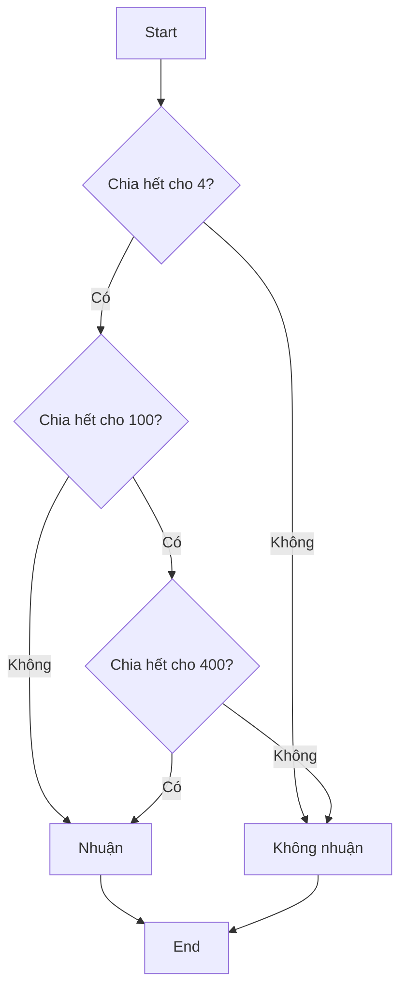

Bài toán kiểm tra năm nhuận là một ví dụ tuyệt vời về cách xử lý logic phức tạp trong lập trình. Tuy quy tắc đơn giản nhưng việc chuyển hóa thành code hiệu quả đòi hỏi sự hiểu biết sâu sắc về cấu trúc điều khiển và phép logic.

<!-- truncate -->

## 1. Hiểu về năm nhuận

### 1.1. Định nghĩa năm nhuận

Năm nhuận là năm có 366 ngày thay vì 365 ngày, với tháng 2 có 29 ngày thay vì 28 ngày. Việc thêm một ngày này giúp điều chỉnh lịch để phù hợp với chu kỳ thiên văn của Trái Đất.

### 1.2. Quy tắc xác định năm nhuận

1. **Quy tắc cơ bản:**
   - Năm chia hết cho 4 là năm nhuận
   
2. **Ngoại lệ thế kỷ:**
   - Năm chia hết cho 100 KHÔNG phải năm nhuận
   - TRỪ KHI năm đó chia hết cho 400

:::note Công thức toán học
Năm $N$ là năm nhuận khi và chỉ khi:
$$(N \bmod 4 = 0 \text{ và } N \bmod 100 \neq 0) \text{ hoặc } (N \bmod 400 = 0)$$
:::



## 2. Phân tích bài toán

### 2.1. Input/Output
- **Input**: Một số nguyên dương N đại diện cho năm cần kiểm tra
- **Output**: true nếu là năm nhuận, false nếu không phải

### 2.2. Các trường hợp cần xử lý

1. **Trường hợp thông thường:**
   - 2024 là năm nhuận (chia hết cho 4)
   - 2023 không phải năm nhuận

2. **Trường hợp thế kỷ:**
   - 2100 không phải năm nhuận (chia hết cho 100)
   - 2000 là năm nhuận (chia hết cho 400)

3. **Edge cases:**
   - Năm âm (lịch trước Công nguyên)
   - Năm 0
   - Số quá lớn

## 3. Giải pháp từng bước

### 3.1. Cách tiếp cận naïve

Cách đơn giản nhất là kiểm tra từng điều kiện một:

```cpp
bool laNamNhuan(int nam) {
    if (nam % 4 == 0) {
        if (nam % 100 == 0) {
            if (nam % 400 == 0) {
                return true;
            }
            return false;
        }
        return true;
    }
    return false;
}
```

### 3.2. Cách tiếp cận tối ưu

Sử dụng phép logic để rút gọn điều kiện:

```cpp
bool laNamNhuan(int nam) {
    return (nam % 4 == 0 && nam % 100 != 0) || (nam % 400 == 0);
}
```

### 3.3. Triển khai hoàn chỉnh

#### C++
```cpp
#include <iostream>
using namespace std;

bool laNamNhuan(int nam) {
    // Kiểm tra input
    if (nam <= 0) {
        cout << "Nam khong hop le!\n";
        return false;
    }
    
    return (nam % 4 == 0 && nam % 100 != 0) || (nam % 400 == 0);
}

int main() {
    int nam;
    cout << "Nhap nam can kiem tra: ";
    cin >> nam;
    
    if (laNamNhuan(nam)) {
        cout << nam << " la nam nhuan\n";
    } else {
        cout << nam << " khong phai nam nhuan\n";
    }
    
    return 0;
}
```

#### Python
```python
def la_nam_nhuan(nam: int) -> bool:
    # Kiểm tra input
    if nam <= 0:
        print("Nam khong hop le!")
        return False
    
    return (nam % 4 == 0 and nam % 100 != 0) or (nam % 400 == 0)

def main():
    try:
        nam = int(input("Nhap nam can kiem tra: "))
        if la_nam_nhuan(nam):
            print(f"{nam} la nam nhuan")
        else:
            print(f"{nam} khong phai nam nhuan")
    except ValueError:
        print("Vui long nhap mot so nguyen!")

if __name__ == "__main__":
    main()
```

#### Java
```java
import java.util.Scanner;

public class NamNhuan {
    public static boolean laNamNhuan(int nam) {
        // Kiểm tra input
        if (nam <= 0) {
            System.out.println("Nam khong hop le!");
            return false;
        }
        
        return (nam % 4 == 0 && nam % 100 != 0) || (nam % 400 == 0);
    }
    
    public static void main(String[] args) {
        Scanner scanner = new Scanner(System.in);
        
        System.out.print("Nhap nam can kiem tra: ");
        try {
            int nam = scanner.nextInt();
            if (laNamNhuan(nam)) {
                System.out.printf("%d la nam nhuan%n", nam);
            } else {
                System.out.printf("%d khong phai nam nhuan%n", nam);
            }
        } catch (Exception e) {
            System.out.println("Vui long nhap mot so nguyen!");
        }
        
        scanner.close();
    }
}
```

## 4. Phân tích độ phức tạp

### 4.1. Độ phức tạp thời gian
- **Time Complexity**: O(1)
  - Các phép toán mod là phép toán cơ bản
  - Số lượng phép toán cố định, không phụ thuộc input

### 4.2. Độ phức tạp không gian
- **Space Complexity**: O(1)
  - Chỉ sử dụng biến nguyên thủy
  - Không cần bộ nhớ phụ thuộc vào input

## 5. Mở rộng bài toán

### 5.1. Tính số ngày trong tháng

```cpp
int soNgayTrongThang(int thang, int nam) {
    if (thang < 1 || thang > 12) {
        return -1;  // Tháng không hợp lệ
    }
    
    switch (thang) {
        case 4: case 6: case 9: case 11:
            return 30;
        case 2:
            return laNamNhuan(nam) ? 29 : 28;
        default:
            return 31;
    }
}
```

### 5.2. Kiểm tra ngày hợp lệ

```cpp
bool laNgayHopLe(int ngay, int thang, int nam) {
    if (nam <= 0 || thang < 1 || thang > 12) {
        return false;
    }
    
    int maxNgay = soNgayTrongThang(thang, nam);
    return (ngay >= 1 && ngay <= maxNgay);
}
```

### 5.3. Tính khoảng cách giữa hai ngày

:::tip
Khi tính khoảng cách giữa hai ngày, việc xác định năm nhuận rất quan trọng để tính chính xác số ngày.
:::

```cpp
struct Date {
    int ngay, thang, nam;
};

int tinhKhoangCach(Date d1, Date d2) {
    // Code tính khoảng cách...
    // Cần xét năm nhuận để tính chính xác
    return 0;  // Placeholder
}
```

## 6. Bài tập thực hành

1. **Tính tuổi chính xác**
   - Input: Ngày sinh và ngày hiện tại
   - Output: Tuổi chính xác (tính cả năm nhuận)

2. **Tìm năm nhuận tiếp theo**
   - Input: Một năm bất kỳ
   - Output: Năm nhuận gần nhất lớn hơn năm đã cho

3. **Đếm số năm nhuận trong khoảng**
   - Input: Hai năm start và end
   - Output: Số năm nhuận trong khoảng [start, end]

## 7. Lỗi thường gặp và cách tránh

### 7.1. Lỗi logic phổ biến

1. **Thứ tự kiểm tra sai**
```cpp
// SAI
if (nam % 400 == 0 || nam % 4 == 0 && nam % 100 != 0)

// ĐÚNG
if ((nam % 4 == 0 && nam % 100 != 0) || nam % 400 == 0)
```

2. **Quên xử lý input không hợp lệ**
```cpp
// THIẾU
bool laNamNhuan(int nam) {
    return (nam % 4 == 0 && nam % 100 != 0) || nam % 400 == 0;
}

// ĐẦY ĐỦ
bool laNamNhuan(int nam) {
    if (nam <= 0) {
        throw invalid_argument("Nam phai lon hon 0");
    }
    return (nam % 4 == 0 && nam % 100 != 0) || nam % 400 == 0;
}
```

### 7.2. Best Practices

1. **Sử dụng hằng số có ý nghĩa**
```cpp
const int CHIA_4 = 4;
const int CHIA_100 = 100;
const int CHIA_400 = 400;
```

2. **Tách logic phức tạp thành hàm nhỏ**
```cpp
bool chiaHetCho4(int nam) {
    return nam % 4 == 0;
}

bool laNamTheKy(int nam) {
    return nam % 100 == 0;
}

bool chiaHetCho400(int nam) {
    return nam % 400 == 0;
}

bool laNamNhuan(int nam) {
    return (chiaHetCho4(nam) && !laNamTheKy(nam)) 
           || chiaHetCho400(nam);
}
```

## Tổng kết

Bài toán năm nhuận là một ví dụ điển hình về:
- Xử lý logic phức tạp trong lập trình
- Tối ưu hóa code để dễ đọc và bảo trì
- Xử lý edge cases và input validation
- Tái sử dụng code trong các bài toán liên quan

:::info Ghi nhớ
1. Luôn kiểm tra input
2. Tối ưu logic để code dễ đọc
3. Xử lý đầy đủ các trường hợp
4. Viết unit tests để đảm bảo code chính xác
:::
