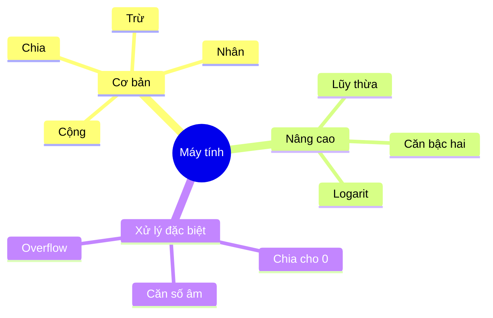
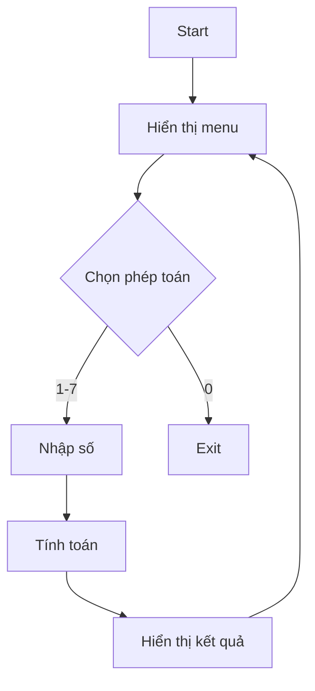

Xây dựng một máy tính đơn giản là một bài tập tuyệt vời để học về cấu trúc điều khiển, xử lý input và exception handling trong lập trình. Bài viết này sẽ hướng dẫn bạn cách xây dựng một máy tính console với các tính năng cơ bản.

<!-- truncate -->

## 1. Phân tích yêu cầu

### 1.1. Các phép toán cần hỗ trợ



### 1.2. Giao diện người dùng

1. **Menu chính**
   - Hiển thị các lựa chọn phép toán
   - Cho phép thoát chương trình

2. **Input/Output**
   - Nhập các toán hạng
   - Hiển thị kết quả
   - Thông báo lỗi

## 2. Thiết kế giải pháp

### 2.1. Cấu trúc chương trình



### 2.2. Xử lý ngoại lệ

1. **Lỗi đầu vào**
   - Nhập không phải số
   - Nhập ngoài phạm vi

2. **Lỗi tính toán**
   - Chia cho 0
   - Căn số âm
   - Tràn số

## 3. Triển khai chi tiết

### 3.1. Cài đặt C++

```cpp
#include <iostream>
#include <cmath>
#include <limits>
#include <iomanip>
using namespace std;

class MayTinh {
private:
    // Constants for error checking
    const double EPSILON = 1e-10;
    const double MAX_VALUE = 1e100;

    bool isZero(double x) {
        return fabs(x) < EPSILON;
    }

    void clearInputBuffer() {
        cin.clear();
        cin.ignore(numeric_limits<streamsize>::max(), '\n');
    }

    void showError(const string& message) {
        cerr << "Loi: " << message << endl;
    }

    double getNumber(const string& prompt) {
        double num;
        while (true) {
            cout << prompt;
            if (cin >> num) {
                clearInputBuffer();
                return num;
            }
            showError("Vui long nhap mot so hop le!");
            clearInputBuffer();
        }
    }

public:
    void showMenu() {
        cout << "\nMAY TINH DON GIAN\n";
        cout << "1. Cong\n";
        cout << "2. Tru\n";
        cout << "3. Nhan\n";
        cout << "4. Chia\n";
        cout << "5. Luy thua\n";
        cout << "6. Can bac hai\n";
        cout << "7. Logarit co so e\n";
        cout << "0. Thoat\n";
        cout << "Lua chon cua ban: ";
    }

    double cong(double a, double b) {
        double result = a + b;
        if (fabs(result) > MAX_VALUE) {
            throw overflow_error("Ket qua qua lon!");
        }
        return result;
    }

    double tru(double a, double b) {
        double result = a - b;
        if (fabs(result) > MAX_VALUE) {
            throw overflow_error("Ket qua qua lon!");
        }
        return result;
    }

    double nhan(double a, double b) {
        double result = a * b;
        if (fabs(result) > MAX_VALUE) {
            throw overflow_error("Ket qua qua lon!");
        }
        return result;
    }

    double chia(double a, double b) {
        if (isZero(b)) {
            throw invalid_argument("Khong the chia cho 0!");
        }
        double result = a / b;
        if (fabs(result) > MAX_VALUE) {
            throw overflow_error("Ket qua qua lon!");
        }
        return result;
    }

    double luyThua(double a, double b) {
        if (isZero(a) && isZero(b)) {
            throw invalid_argument("0^0 khong xac dinh!");
        }
        double result = pow(a, b);
        if (isnan(result) || isinf(result)) {
            throw overflow_error("Ket qua khong hop le!");
        }
        return result;
    }

    double canBacHai(double a) {
        if (a < 0) {
            throw invalid_argument("Khong the tinh can bac hai cua so am!");
        }
        return sqrt(a);
    }

    double logarit(double a) {
        if (a <= 0) {
            throw invalid_argument("Logarit chi xac dinh voi so duong!");
        }
        return log(a);
    }

    void run() {
        while (true) {
            showMenu();
            int choice;
            
            if (!(cin >> choice)) {
                showError("Lua chon khong hop le!");
                clearInputBuffer();
                continue;
            }
            clearInputBuffer();

            if (choice == 0) {
                cout << "Cam on ban da su dung chuong trinh!\n";
                break;
            }

            try {
                double result;
                double a, b;

                switch (choice) {
                    case 1: // Cộng
                        a = getNumber("Nhap so thu nhat: ");
                        b = getNumber("Nhap so thu hai: ");
                        result = cong(a, b);
                        cout << a << " + " << b << " = " << result << endl;
                        break;

                    case 2: // Trừ
                        a = getNumber("Nhap so thu nhat: ");
                        b = getNumber("Nhap so thu hai: ");
                        result = tru(a, b);
                        cout << a << " - " << b << " = " << result << endl;
                        break;

                    case 3: // Nhân
                        a = getNumber("Nhap so thu nhat: ");
                        b = getNumber("Nhap so thu hai: ");
                        result = nhan(a, b);
                        cout << a << " * " << b << " = " << result << endl;
                        break;

                    case 4: // Chia
                        a = getNumber("Nhap so bi chia: ");
                        b = getNumber("Nhap so chia: ");
                        result = chia(a, b);
                        cout << a << " / " << b << " = " << result << endl;
                        break;

                    case 5: // Lũy thừa
                        a = getNumber("Nhap co so: ");
                        b = getNumber("Nhap so mu: ");
                        result = luyThua(a, b);
                        cout << a << " ^ " << b << " = " << result << endl;
                        break;

                    case 6: // Căn bậc hai
                        a = getNumber("Nhap so can tinh can bac hai: ");
                        result = canBacHai(a);
                        cout << "sqrt(" << a << ") = " << result << endl;
                        break;

                    case 7: // Logarit
                        a = getNumber("Nhap so can tinh logarit: ");
                        result = logarit(a);
                        cout << "ln(" << a << ") = " << result << endl;
                        break;

                    default:
                        showError("Lua chon khong hop le!");
                        continue;
                }

            } catch (const exception& e) {
                showError(e.what());
            }
        }
    }
};

int main() {
    cout << fixed << setprecision(6);  // Đặt độ chính xác cho số thực
    MayTinh mayTinh;
    mayTinh.run();
    return 0;
}
```

### 3.2. Cài đặt Python

```python
import math
from typing import Callable
from dataclasses import dataclass

@dataclass
class Operation:
    name: str
    func: Callable
    operands: int
    description: str

class MayTinh:
    EPSILON = 1e-10
    MAX_VALUE = 1e100

    def __init__(self):
        self.operations = {
            1: Operation("Cong", self.cong, 2, "a + b"),
            2: Operation("Tru", self.tru, 2, "a - b"),
            3: Operation("Nhan", self.nhan, 2, "a * b"),
            4: Operation("Chia", self.chia, 2, "a / b"),
            5: Operation("Luy thua", self.luy_thua, 2, "a ^ b"),
            6: Operation("Can bac hai", self.can_bac_hai, 1, "sqrt(a)"),
            7: Operation("Logarit", self.logarit, 1, "ln(a)")
        }

    def is_zero(self, x: float) -> bool:
        return abs(x) < self.EPSILON

    def get_number(self, prompt: str) -> float:
        while True:
            try:
                return float(input(prompt))
            except ValueError:
                print("Loi: Vui long nhap mot so hop le!")

    def show_menu(self):
        print("\nMAY TINH DON GIAN")
        for key, op in self.operations.items():
            print(f"{key}. {op.name}")
        print("0. Thoat")

    def cong(self, a: float, b: float) -> float:
        result = a + b
        if abs(result) > self.MAX_VALUE:
            raise OverflowError("Ket qua qua lon!")
        return result

    def tru(self, a: float, b: float) -> float:
        result = a - b
        if abs(result) > self.MAX_VALUE:
            raise OverflowError("Ket qua qua lon!")
        return result

    def nhan(self, a: float, b: float) -> float:
        result = a * b
        if abs(result) > self.MAX_VALUE:
            raise OverflowError("Ket qua qua lon!")
        return result

    def chia(self, a: float, b: float) -> float:
        if self.is_zero(b):
            raise ValueError("Khong the chia cho 0!")
        result = a / b
        if abs(result) > self.MAX_VALUE:
            raise OverflowError("Ket qua qua lon!")
        return result

    def luy_thua(self, a: float, b: float) -> float:
        if self.is_zero(a) and self.is_zero(b):
            raise ValueError("0^0 khong xac dinh!")
        result = math.pow(a, b)
        if math.isnan(result) or math.isinf(result):
            raise OverflowError("Ket qua khong hop le!")
        return result

    def can_bac_hai(self, a: float) -> float:
        if a < 0:
            raise ValueError("Khong the tinh can bac hai cua so am!")
        return math.sqrt(a)

    def logarit(self, a: float) -> float:
        if a <= 0:
            raise ValueError("Logarit chi xac dinh voi so duong!")
        return math.log(a)

    def run(self):
        while True:
            self.show_menu()
            try:
                choice = int(input("Lua chon cua ban: "))
                if choice == 0:
                    print("Cam on ban da su dung chuong trinh!")
                    break

                if choice not in self.operations:
                    print("Loi: Lua chon khong hop le!")
                    continue

                op = self.operations[choice]
                if op.operands == 1:
                    a = self.get_number("Nhap so: ")
                    result = op.func(a)
                    print(f"{op.description.format(a)} = {result:.6f}")
                else:
                    a = self.get_number("Nhap so thu nhat: ")
                    b = self.get_number("Nhap so thu hai: ")
                    result = op.func(a, b)
                    print(f"{a} {op.description[1]} {b} = {result:.6f}")

            except ValueError as e:
                print(f"Loi: {str(e)}")
            except OverflowError as e:
                print(f"Loi: {str(e)}")
            except Exception as e:
                print(f"Loi: {str(e)}")

def main():
    calculator = MayTinh()
    calculator.run()

if __name__ == "__main__":
    main()
```

### 3.3. Cài đặt Java

```java
import java.util.HashMap;
import java.util.Map;
import java.util.Scanner;
import java.util.function.BiFunction;
import java.util.function.Function;

class Operation {
    String name;
    int operands;
    String description;

    Operation(String name, int operands, String description) {
        this.name = name;
        this.operands = operands;
        this.description = description;
    }
}

public class MayTinh {
    private static final double EPSILON = 1e-10;
    private static final double MAX_VALUE = 1e100;
    private final Scanner scanner;
    private final Map<Integer, Operation> operations;

    public MayTinh() {
        this.scanner = new Scanner(System.in);
        this.operations = new HashMap<>();
        initOperations();
    }

    private void initOperations() {
        operations.put(1, new Operation("Cong", 2, "a + b"));
        operations.put(2, new Operation("Tru", 2, "a - b"));
        operations.put(3, new Operation("Nhan", 2, "a * b"));
        operations.put(4, new Operation("Chia", 2, "a / b"));
        operations.put(5, new Operation("Luy thua", 2, "a ^ b"));
        operations.put(6, new Operation("Can bac hai", 1, "sqrt(a)"));
        operations.put(7, new Operation("Logarit", 1, "ln(a)"));
    }

    private boolean isZero(double x) {
        return Math.abs(x) < EPSILON;
    }

    private void showError(String message) {
        System.err.println("Loi: " + message);
    }

    private double getNumber(String prompt) {
        while (true) {
            try {
                System.out.print(prompt);
                return Double.parseDouble(scanner.nextLine());
            } catch (NumberFormatException e) {
                showError("Vui long nhap mot so hop le!");
            }
        }
    }

    private void showMenu() {
        System.out.println("\nMAY TINH DON GIAN");
        operations.forEach((key, op) -> 
            System.out.println(key + ". " + op.name));
        System.out.println("0. Thoat");
    }

    public double cong(double a, double b) {
        double result = a + b;
        if (Math.abs(result) > MAX_VALUE) {
            throw new ArithmeticException("Ket qua qua lon!");
        }
        return result;
    }

    public double tru(double a, double b) {
        double result = a - b;
        if (Math.abs(result) > MAX_VALUE) {
            throw new ArithmeticException("Ket qua qua lon!");
        }
        return result;
    }

    public double nhan(double a, double b) {
        double result = a * b;
        if (Math.abs(result) > MAX_VALUE) {
            throw new ArithmeticException("Ket qua qua lon!");
        }
        return result;
    }

    public double chia(double a, double b) {
        if (isZero(b)) {
            throw new ArithmeticException("Khong the chia cho 0!");
        }
        double result = a / b;
        if (Math.abs(result) > MAX_VALUE) {
            throw new ArithmeticException("Ket qua qua lon!");
        }
        return result;
    }

    public double luyThua(double a, double b) {
        if (isZero(a) && isZero(b)) {
            throw new ArithmeticException("0^0 khong xac dinh!");
        }
        double result = Math.pow(a, b);
        if (Double.isNaN(result) || Double.isInfinite(result)) {
            throw new ArithmeticException("Ket qua khong hop le!");
        }
        return result;
    }

    public double canBacHai(double a) {
        if (a < 0) {
            throw new ArithmeticException(
                "Khong the tinh can bac hai cua so am!");
        }
        return Math.sqrt(a);
    }

    public double logarit(double a) {
        if (a <= 0) {
            throw new ArithmeticException(
                "Logarit chi xac dinh voi so duong!");
        }
        return Math.log(a);
    }

    public void run() {
        while (true) {
            showMenu();
            System.out.print("Lua chon cua ban: ");
            
            try {
                int choice = Integer.parseInt(scanner.nextLine());

                if (choice == 0) {
                    System.out.println("Cam on ban da su dung chuong trinh!");
                    break;
                }

                if (!operations.containsKey(choice)) {
                    showError("Lua chon khong hop le!");
                    continue;
                }

                Operation op = operations.get(choice);
                double result;
                double a, b;

                switch (choice) {
                    case 1: // Cộng
                        a = getNumber("Nhap so thu nhat: ");
                        b = getNumber("Nhap so thu hai: ");
                        result = cong(a, b);
                        System.out.printf("%f + %f = %f%n", a, b, result);
                        break;

                    case 2: // Trừ
                        a = getNumber("Nhap so thu nhat: ");
                        b = getNumber("Nhap so thu hai: ");
                        result = tru(a, b);
                        System.out.printf("%f - %f = %f%n", a, b, result);
                        break;

                    case 3: // Nhân
                        a = getNumber("Nhap so thu nhat: ");
                        b = getNumber("Nhap so thu hai: ");
                        result = nhan(a, b);
                        System.out.printf("%f * %f = %f%n", a, b, result);
                        break;

                    case 4: // Chia
                        a = getNumber("Nhap so bi chia: ");
                        b = getNumber("Nhap so chia: ");
                        result = chia(a, b);
                        System.out.printf("%f / %f = %f%n", a, b, result);
                        break;

                    case 5: // Lũy thừa
                        a = getNumber("Nhap co so: ");
                        b = getNumber("Nhap so mu: ");
                        result = luyThua(a, b);
                        System.out.printf("%f ^ %f = %f%n", a, b, result);
                        break;

                    case 6: // Căn bậc hai
                        a = getNumber("Nhap so can tinh can bac hai: ");
                        result = canBacHai(a);
                        System.out.printf("sqrt(%f) = %f%n", a, result);
                        break;

                    case 7: // Logarit
                        a = getNumber("Nhap so can tinh logarit: ");
                        result = logarit(a);
                        System.out.printf("ln(%f) = %f%n", a, result);
                        break;
                }

            } catch (NumberFormatException e) {
                showError("Lua chon khong hop le!");
            } catch (ArithmeticException e) {
                showError(e.getMessage());
            } catch (Exception e) {
                showError("Co loi xay ra: " + e.getMessage());
            }
        }
    }

    public static void main(String[] args) {
        MayTinh mayTinh = new MayTinh();
        mayTinh.run();
    }
}
```

## 4. Xử lý trường hợp đặc biệt

### 4.1. Chia cho 0

```cpp
double chia(double a, double b) {
    if (isZero(b)) {
        throw invalid_argument("Khong the chia cho 0!");
    }
    return a / b;
}
```

### 4.2. Căn bậc hai số âm

```cpp
double canBacHai(double a) {
    if (a < 0) {
        throw invalid_argument(
            "Khong the tinh can bac hai cua so am!"
        );
    }
    return sqrt(a);
}
```

### 4.3. Logarit số không hoặc âm

```cpp
double logarit(double a) {
    if (a <= 0) {
        throw invalid_argument(
            "Logarit chi xac dinh voi so duong!"
        );
    }
    return log(a);
}
```

## 5. Cải tiến và mở rộng

### 5.1. Thêm lịch sử tính toán

```cpp
class MayTinhNangCao : public MayTinh {
private:
    vector<string> lichSu;

    void luuLichSu(const string& phepToan, 
                   double ketQua) {
        lichSu.push_back(
            phepToan + " = " + to_string(ketQua)
        );
    }

public:
    void hienThiLichSu() {
        cout << "\nLICH SU TINH TOAN:\n";
        for (const auto& item : lichSu) {
            cout << item << endl;
        }
    }

    void xoaLichSu() {
        lichSu.clear();
        cout << "Da xoa lich su tinh toan!\n";
    }
};
```

### 5.2. Thêm chế độ khoa học

```cpp
class MayTinhKhoaHoc : public MayTinhNangCao {
public:
    double sin(double x) {
        return std::sin(x);
    }

    double cos(double x) {
        return std::cos(x);
    }

    double tan(double x) {
        double result = std::tan(x);
        if (isinf(result)) {
            throw invalid_argument(
                "Tan khong xac dinh tai goc nay!"
            );
        }
        return result;
    }

    double factorial(int n) {
        if (n < 0) {
            throw invalid_argument(
                "Khong the tinh giai thua so am!"
            );
        }
        if (n > 20) {
            throw overflow_error(
                "So qua lon de tinh giai thua!"
            );
        }
        double result = 1;
        for (int i = 2; i <= n; i++) {
            result *= i;
        }
        return result;
    }
};
```

### 5.3. Thêm chế độ lập trình

```cpp
class MayTinhLapTrinh : public MayTinhKhoaHoc {
public:
    int and_(int a, int b) { return a & b; }
    int or_(int a, int b) { return a | b; }
    int xor_(int a, int b) { return a ^ b; }
    int not_(int a) { return ~a; }
    int leftShift(int a, int b) { return a << b; }
    int rightShift(int a, int b) { return a >> b; }
};
```

## 6. Bài tập thực hành

1. **Thêm tính năng mới**
   - Chuyển đổi đơn vị
   - Tính toán phân số
   - Tính toán số phức

2. **Cải thiện giao diện**
   - Thêm màu sắc cho output
   - Tạo menu đa cấp
   - Thêm phím tắt

3. **Tối ưu hóa**
   - Sử dụng design patterns
   - Cải thiện xử lý lỗi
   - Thêm unit tests

## 7. Các lỗi thường gặp

### 7.1. Không xử lý overflow

```cpp
// SAI
double nhan(double a, double b) {
    return a * b;  // Có thể overflow
}

// ĐÚNG
double nhan(double a, double b) {
    double result = a * b;
    if (fabs(result) > MAX_VALUE) {
        throw overflow_error("Ket qua qua lon!");
    }
    return result;
}
```

### 7.2. Không làm sạch input buffer

```cpp
// SAI
int choice;
cin >> choice;  // Có thể để lại newline

// ĐÚNG
int choice;
if (cin >> choice) {
    cin.ignore(numeric_limits<streamsize>::max(), '\n');
} else {
    cin.clear();
    cin.ignore(numeric_limits<streamsize>::max(), '\n');
}
```

### 7.3. So sánh số thực trực tiếp

```cpp
// SAI
if (x == 0)  // Không nên so sánh số thực trực tiếp

// ĐÚNG
if (fabs(x) < EPSILON)  // Sử dụng epsilon
```

## 8. Mẹo và thủ thuật

### 8.1. Định dạng output

```cpp
// Đặt độ chính xác cho số thực
cout << fixed << setprecision(6);

// Căn lề output
cout << setw(10) << left << "Tong:";
cout << setw(15) << right << result << endl;
```

### 8.2. Xử lý input an toàn

```cpp
template<typename T>
T getInput(const string& prompt) {
    T value;
    while (true) {
        cout << prompt;
        if (cin >> value) {
            cin.ignore(numeric_limits<streamsize>::max(), '\n');
            return value;
        }
        cin.clear();
        cin.ignore(numeric_limits<streamsize>::max(), '\n');
        cout << "Nhap sai! Vui long thu lai.\n";
    }
}
```

### 8.3. Tối ưu hiệu năng

```cpp
// Sử dụng const reference khi có thể
void process(const vector<double>& values);

// Tránh copy không cần thiết
string& getLastResult();

// Sử dụng move semantics
history.push_back(std::move(result));
```

## Tổng kết

Bài toán máy tính đơn giản minh họa:
- Cách tổ chức code theo hướng đối tượng
- Xử lý input/output an toàn
- Exception handling
- Mở rộng tính năng theo module

:::info Lưu ý quan trọng
1. Luôn kiểm tra input
2. Xử lý đầy đủ các trường hợp đặc biệt
3. Làm sạch buffer sau khi đọc input
4. Sử dụng epsilon khi so sánh số thực
:::
