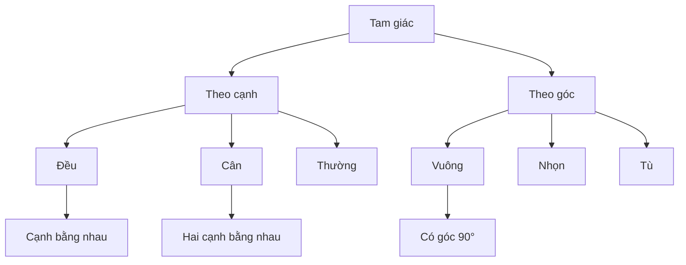

Phân loại tam giác là một bài toán cơ bản nhưng quan trọng trong hình học. Nó không chỉ giúp chúng ta hiểu về cách xử lý điều kiện trong lập trình mà còn rèn luyện tư duy logic và khả năng phân tích bài toán.

<!-- truncate -->

## 1. Tìm hiểu về tam giác

### 1.1. Định nghĩa tam giác

Tam giác là một đa giác có ba cạnh, ba đỉnh và ba góc. Để tạo thành tam giác, tổng của hai cạnh bất kỳ phải lớn hơn cạnh còn lại.

:::note Bất đẳng thức tam giác
Với ba cạnh a, b, c:
- a + b > c
- b + c > a
- a + c > b
:::

### 1.2. Các loại tam giác



## 2. Phân tích bài toán

### 2.1. Input/Output

**Input:**
- Ba số thực dương a, b, c đại diện cho độ dài ba cạnh

**Output:**
- Xác định loại tam giác: đều, cân, vuông, tù, nhọn hoặc không phải tam giác

### 2.2. Các trường hợp cần xử lý

1. **Kiểm tra tính hợp lệ:**
   - Các cạnh phải dương
   - Thỏa mãn bất đẳng thức tam giác

2. **Phân loại theo cạnh:**
   - Tam giác đều: ba cạnh bằng nhau
   - Tam giác cân: hai cạnh bằng nhau
   - Tam giác thường: ba cạnh khác nhau

3. **Phân loại theo góc:**
   - Tam giác vuông: $a^2 + b^2 = c^2$
   - Tam giác tù: $a^2 + b^2 < c^2$
   - Tam giác nhọn: $a^2 + b^2 > c^2$

## 3. Giải pháp từng bước

### 3.1. Kiểm tra tính hợp lệ của tam giác

```cpp
bool laTamGiacHopLe(double a, double b, double c) {
    // Kiểm tra cạnh dương
    if (a <= 0 || b <= 0 || c <= 0) {
        return false;
    }
    
    // Kiểm tra bất đẳng thức tam giác
    return (a + b > c) && (b + c > a) && (a + c > b);
}
```

### 3.2. Phân loại tam giác

#### C++
```cpp
#include <iostream>
#include <cmath>
using namespace std;

class TamGiac {
private:
    double a, b, c;
    const double EPSILON = 1e-10;  // Sai số cho phép khi so sánh số thực

    bool bangNhau(double x, double y) {
        return fabs(x - y) < EPSILON;
    }

public:
    TamGiac(double a, double b, double c) : a(a), b(b), c(c) {}

    bool laHopLe() {
        if (a <= 0 || b <= 0 || c <= 0) {
            return false;
        }
        return (a + b > c) && (b + c > a) && (a + c > b);
    }

    bool laDeu() {
        return bangNhau(a, b) && bangNhau(b, c);
    }

    bool laCan() {
        return bangNhau(a, b) || bangNhau(b, c) || bangNhau(a, c);
    }

    bool laVuong() {
        // Sắp xếp để c là cạnh lớn nhất
        double x = a, y = b, z = c;
        if (x > z) swap(x, z);
        if (y > z) swap(y, z);

        return bangNhau(x*x + y*y, z*z);
    }

    bool laTu() {
        // Sắp xếp để c là cạnh lớn nhất
        double x = a, y = b, z = c;
        if (x > z) swap(x, z);
        if (y > z) swap(y, z);

        return x*x + y*y < z*z;
    }

    string phanLoai() {
        if (!laHopLe()) {
            return "Khong phai tam giac";
        }

        string ketQua = "";

        // Phân loại theo cạnh
        if (laDeu()) {
            ketQua = "Tam giac deu";
        } else if (laCan()) {
            ketQua = "Tam giac can";
        } else {
            ketQua = "Tam giac thuong";
        }

        // Phân loại theo góc
        if (laVuong()) {
            ketQua += " va vuong";
        } else if (laTu()) {
            ketQua += " va tu";
        } else {
            ketQua += " va nhon";
        }

        return ketQua;
    }
};

int main() {
    double a, b, c;
    cout << "Nhap do dai ba canh tam giac:\n";
    cout << "a = ";
    cin >> a;
    cout << "b = ";
    cin >> b;
    cout << "c = ";
    cin >> c;

    TamGiac tamGiac(a, b, c);
    cout << tamGiac.phanLoai() << endl;

    return 0;
}
```

#### Python
```python
from dataclasses import dataclass
from typing import Tuple
import math

@dataclass
class TamGiac:
    a: float
    b: float
    c: float
    EPSILON: float = 1e-10

    def bang_nhau(self, x: float, y: float) -> bool:
        return abs(x - y) < self.EPSILON

    def la_hop_le(self) -> bool:
        if self.a <= 0 or self.b <= 0 or self.c <= 0:
            return False
        return (self.a + self.b > self.c and 
                self.b + self.c > self.a and 
                self.a + self.c > self.b)

    def la_deu(self) -> bool:
        return (self.bang_nhau(self.a, self.b) and 
                self.bang_nhau(self.b, self.c))

    def la_can(self) -> bool:
        return (self.bang_nhau(self.a, self.b) or 
                self.bang_nhau(self.b, self.c) or 
                self.bang_nhau(self.a, self.c))

    def canh_lon_nhat(self) -> Tuple[float, float, float]:
        x, y, z = self.a, self.b, self.c
        if x > z:
            x, z = z, x
        if y > z:
            y, z = z, y
        return x, y, z

    def la_vuong(self) -> bool:
        x, y, z = self.canh_lon_nhat()
        return self.bang_nhau(x*x + y*y, z*z)

    def la_tu(self) -> bool:
        x, y, z = self.canh_lon_nhat()
        return x*x + y*y < z*z

    def phan_loai(self) -> str:
        if not self.la_hop_le():
            return "Khong phai tam giac"

        # Phân loại theo cạnh
        if self.la_deu():
            loai_canh = "Tam giac deu"
        elif self.la_can():
            loai_canh = "Tam giac can"
        else:
            loai_canh = "Tam giac thuong"

        # Phân loại theo góc
        if self.la_vuong():
            loai_goc = "va vuong"
        elif self.la_tu():
            loai_goc = "va tu"
        else:
            loai_goc = "va nhon"

        return f"{loai_canh} {loai_goc}"

def main():
    try:
        print("Nhap do dai ba canh tam giac:")
        a = float(input("a = "))
        b = float(input("b = "))
        c = float(input("c = "))

        tam_giac = TamGiac(a, b, c)
        print(tam_giac.phan_loai())
    except ValueError:
        print("Vui long nhap so hop le!")

if __name__ == "__main__":
    main()
```

#### Java
```java
import java.util.Scanner;

public class TamGiac {
    private final double a, b, c;
    private static final double EPSILON = 1e-10;

    public TamGiac(double a, double b, double c) {
        this.a = a;
        this.b = b;
        this.c = c;
    }

    private boolean bangNhau(double x, double y) {
        return Math.abs(x - y) < EPSILON;
    }

    public boolean laHopLe() {
        if (a <= 0 || b <= 0 || c <= 0) {
            return false;
        }
        return (a + b > c) && (b + c > a) && (a + c > b);
    }

    public boolean laDeu() {
        return bangNhau(a, b) && bangNhau(b, c);
    }

    public boolean laCan() {
        return bangNhau(a, b) || bangNhau(b, c) || bangNhau(a, c);
    }

    private double[] canhLonNhat() {
        double x = a, y = b, z = c;
        if (x > z) {
            double temp = x;
            x = z;
            z = temp;
        }
        if (y > z) {
            double temp = y;
            y = z;
            z = temp;
        }
        return new double[]{x, y, z};
    }

    public boolean laVuong() {
        double[] canh = canhLonNhat();
        return bangNhau(canh[0] * canh[0] + canh[1] * canh[1], 
                       canh[2] * canh[2]);
    }

    public boolean laTu() {
        double[] canh = canhLonNhat();
        return canh[0] * canh[0] + canh[1] * canh[1] < canh[2] * canh[2];
    }

    public String phanLoai() {
        if (!laHopLe()) {
            return "Khong phai tam giac";
        }

        StringBuilder ketQua = new StringBuilder();

        // Phân loại theo cạnh
        if (laDeu()) {
            ketQua.append("Tam giac deu");
        } else if (laCan()) {
            ketQua.append("Tam giac can");
        } else {
            ketQua.append("Tam giac thuong");
        }

        // Phân loại theo góc
        if (laVuong()) {
            ketQua.append(" va vuong");
        } else if (laTu()) {
            ketQua.append(" va tu");
        } else {
            ketQua.append(" va nhon");
        }

        return ketQua.toString();
    }

    public static void main(String[] args) {
        Scanner scanner = new Scanner(System.in);

        try {
            System.out.println("Nhap do dai ba canh tam giac:");
            System.out.print("a = ");
            double a = scanner.nextDouble();
            System.out.print("b = ");
            double b = scanner.nextDouble();
            System.out.print("c = ");
            double c = scanner.nextDouble();

            TamGiac tamGiac = new TamGiac(a, b, c);
            System.out.println(tamGiac.phanLoai());
        } catch (Exception e) {
            System.out.println("Vui long nhap so hop le!");
        } finally {
            scanner.close();
        }
    }
}
```

## 4. Phân tích độ phức tạp

### 4.1. Độ phức tạp thời gian
- **Time Complexity**: O(1)
  - Các phép toán so sánh và tính toán cơ bản
  - Số lượng phép toán cố định

### 4.2. Độ phức tạp không gian
- **Space Complexity**: O(1)
  - Chỉ sử dụng biến nguyên thủy
  - Không cần bộ nhớ phụ thuộc vào input

## 5. Một số tính chất thú vị

### 5.1. Công thức Heron

:::tip Tính diện tích tam giác
Với p là nửa chu vi: $p = \frac{a + b + c}{2}$

Diện tích S được tính bởi công thức Heron:
$$S = \sqrt{p(p-a)(p-b)(p-c)}$$
:::

```cpp
double tinhDienTich(double a, double b, double c) {
    double p = (a + b + c) / 2;  // Nửa chu vi
    return sqrt(p * (p-a) * (p-b) * (p-c));
}
```

### 5.2. Tỷ số các cạnh tam giác vuông

:::note Các bộ số Pytago cơ bản
- (3, 4, 5)
- (5, 12, 13)
- (8, 15, 17)
- (7, 24, 25)
:::

## 6. Bài tập thực hành

1. **Tính diện tích tam giác**
   - Sử dụng công thức Heron
   - Xử lý các trường hợp đặc biệt

2. **Tìm tam giác vuông với cạnh nguyên**
   - Input: Giới hạn độ dài cạnh
   - Output: Các bộ số thỏa mãn

3. **Vẽ tam giác bằng ký tự**
   - Input: Loại tam giác
   - Output: Tam giác được vẽ bằng ký tự *

## 7. Các lỗi thường gặp

### 7.1. So sánh số thực

```cpp
// SAI: So sánh trực tiếp
if (a == b)  // Có thể sai do sai số của số thực

// ĐÚNG: Sử dụng epsilon
if (fabs(a - b) < EPSILON)
```

### 7.2. Bỏ qua kiểm tra tính hợp lệ

```cpp
// THIẾU
string phanLoai(double a, double b, double c) {
    if (a == b && b == c) return "Deu";
    // ...
}

// ĐẦY ĐỦ
string phanLoai(double a, double b, double c) {
    if (a <= 0 || b <= 0 || c <= 0) {
        return "Khong hop le";
    }
    if (a + b <= c || b + c <= a || a + c <= b) {
        return "Khong phai tam giac";
    }
    // ...
}
```

### 7.3. Sai thứ tự kiểm tra

```cpp
// SAI: Kiểm tra tam giác vuông trước
if (laVuong()) return "Vuong";
if (laDeu()) return "Deu";  // Không bao giờ đạt được!

// ĐÚNG: Kiểm tra từ trường hợp đặc biệt
if (laDeu()) return "Deu";
if (laVuong()) return "Vuong";
```

## 8. Tối ưu và mở rộng

### 8.1. Sử dụng Unit Testing

```cpp
void testTamGiac() {
    // Test tam giác đều
    assert(TamGiac(5, 5, 5).laDeu());
    
    // Test tam giác vuông
    assert(TamGiac(3, 4, 5).laVuong());
    
    // Test không phải tam giác
    assert(!TamGiac(1, 1, 3).laHopLe());
}
```

### 8.2. Tính các yếu tố khác

```cpp
class TamGiacNangCao : public TamGiac {
public:
    // Tính chu vi
    double chuVi() {
        return a + b + c;
    }
    
    // Tính diện tích
    double dienTich() {
        double p = chuVi() / 2;
        return sqrt(p * (p-a) * (p-b) * (p-c));
    }
    
    // Tính bán kính đường tròn ngoại tiếp
    double banKinhNgoaiTiep() {
        return (a * b * c) / (4 * dienTich());
    }
};
```

## Tổng kết

Bài toán phân loại tam giác minh họa:
- Cách xử lý logic phức tạp
- Tầm quan trọng của kiểm tra đầu vào
- Cách tổ chức code theo hướng đối tượng
- Xử lý số thực trong lập trình

:::info Lưu ý quan trọng
1. Luôn kiểm tra tính hợp lệ của input
2. Cẩn thận khi so sánh số thực
3. Tổ chức code rõ ràng, dễ bảo trì
4. Xử lý đầy đủ các trường hợp đặc biệt
:::
