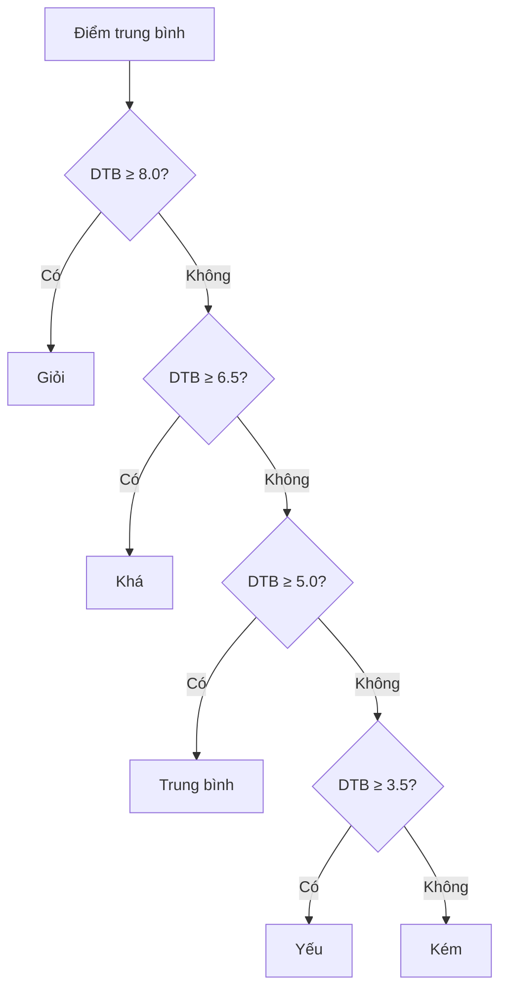

Tính điểm trung bình và xếp loại học lực là một bài toán thực tế mà hầu như ai cũng đã từng gặp trong đời học sinh. Bài viết này sẽ hướng dẫn bạn cách giải quyết bài toán này bằng lập trình, từ cơ bản đến nâng cao.

<!-- truncate -->

## 1. Tìm hiểu bài toán

### 1.1. Quy tắc tính điểm trung bình

Điểm trung bình thường được tính theo công thức:

$$\text{DTB} = \frac{\sum_{i=1}^{n} (d_i \times h_i)}{\sum_{i=1}^{n} h_i}$$

Trong đó:
- $d_i$ là điểm của môn thứ i
- $h_i$ là hệ số của môn thứ i
- $n$ là số lượng môn học

### 1.2. Quy tắc xếp loại học lực



## 2. Phân tích bài toán

### 2.1. Input/Output

**Input:**
- Số lượng môn học n
- Điểm và hệ số của từng môn
- Điểm phải trong khoảng [0, 10]
- Hệ số phải là số nguyên dương

**Output:**
- Điểm trung bình (làm tròn đến 1 chữ số thập phân)
- Xếp loại học lực

### 2.2. Các trường hợp cần xử lý

1. **Kiểm tra tính hợp lệ:**
   - Điểm trong khoảng [0, 10]
   - Hệ số > 0
   - Tổng hệ số > 0

2. **Xếp loại học lực:**
   - Giỏi: DTB ≥ 8.0
   - Khá: 6.5 ≤ DTB < 8.0
   - Trung bình: 5.0 ≤ DTB < 6.5
   - Yếu: 3.5 ≤ DTB < 5.0
   - Kém: DTB < 3.5

3. **Trường hợp đặc biệt:**
   - Có môn dưới 3.0: hạ một bậc xếp loại
   - Làm tròn điểm theo quy định

## 3. Giải pháp từng bước

### 3.1. Cấu trúc dữ liệu cho môn học

#### C++
```cpp
struct MonHoc {
    string ten;
    double diem;
    int heSo;

    MonHoc(string ten, double diem, int heSo) 
        : ten(ten), diem(diem), heSo(heSo) {}
};
```

### 3.2. Triển khai hoàn chỉnh

#### C++
```cpp
#include <iostream>
#include <vector>
#include <iomanip>
#include <algorithm>
using namespace std;

class BangDiem {
private:
    vector<MonHoc> danhSachMon;
    const double DIEM_TOI_THIEU = 3.0;

    bool laDiemHopLe(double diem) {
        return diem >= 0 && diem <= 10;
    }

    bool laHeSoHopLe(int heSo) {
        return heSo > 0;
    }

public:
    void themMon(const MonHoc& mon) {
        if (!laDiemHopLe(mon.diem)) {
            throw invalid_argument("Diem phai nam trong khoang [0, 10]");
        }
        if (!laHeSoHopLe(mon.heSo)) {
            throw invalid_argument("He so phai lon hon 0");
        }
        danhSachMon.push_back(mon);
    }

    double tinhDiemTrungBinh() {
        if (danhSachMon.empty()) {
            return 0.0;
        }

        double tongDiem = 0.0;
        int tongHeSo = 0;

        for (const auto& mon : danhSachMon) {
            tongDiem += mon.diem * mon.heSo;
            tongHeSo += mon.heSo;
        }

        if (tongHeSo == 0) {
            throw runtime_error("Tong he so phai lon hon 0");
        }

        return round(tongDiem / tongHeSo * 10) / 10.0;
    }

    string xepLoai() {
        if (danhSachMon.empty()) {
            return "Chua co diem";
        }

        double dtb = tinhDiemTrungBinh();
        
        // Kiểm tra điểm liệt
        bool coMonDuoiDiemToiThieu = any_of(
            danhSachMon.begin(),
            danhSachMon.end(),
            [this](const MonHoc& mon) {
                return mon.diem < DIEM_TOI_THIEU;
            }
        );

        string xepLoai;
        if (dtb >= 8.0) xepLoai = "Gioi";
        else if (dtb >= 6.5) xepLoai = "Kha";
        else if (dtb >= 5.0) xepLoai = "Trung binh";
        else if (dtb >= 3.5) xepLoai = "Yeu";
        else xepLoai = "Kem";

        // Hạ một bậc nếu có môn dưới điểm tối thiểu
        if (coMonDuoiDiemToiThieu && xepLoai != "Kem") {
            if (xepLoai == "Gioi") xepLoai = "Kha";
            else if (xepLoai == "Kha") xepLoai = "Trung binh";
            else if (xepLoai == "Trung binh") xepLoai = "Yeu";
            else xepLoai = "Kem";
        }

        return xepLoai;
    }

    void inBangDiem() {
        cout << "\nBANG DIEM:\n";
        cout << setw(20) << left << "Ten mon";
        cout << setw(10) << right << "Diem";
        cout << setw(10) << right << "He so" << endl;
        cout << string(40, '-') << endl;

        for (const auto& mon : danhSachMon) {
            cout << setw(20) << left << mon.ten;
            cout << setw(10) << right << fixed << setprecision(1) << mon.diem;
            cout << setw(10) << right << mon.heSo << endl;
        }

        double dtb = tinhDiemTrungBinh();
        cout << "\nDiem trung binh: " << fixed << setprecision(1) << dtb << endl;
        cout << "Xep loai: " << xepLoai() << endl;
    }
};

int main() {
    BangDiem bangDiem;

    try {
        cout << "Nhap so luong mon hoc: ";
        int n;
        cin >> n;

        for (int i = 0; i < n; i++) {
            string ten;
            double diem;
            int heSo;

            cout << "\nMon hoc thu " << i + 1 << ":\n";
            cout << "Ten mon: ";
            cin.ignore();
            getline(cin, ten);
            cout << "Diem: ";
            cin >> diem;
            cout << "He so: ";
            cin >> heSo;

            bangDiem.themMon(MonHoc(ten, diem, heSo));
        }

        bangDiem.inBangDiem();

    } catch (const exception& e) {
        cout << "Loi: " << e.what() << endl;
    }

    return 0;
}
```

#### Python
```python
from dataclasses import dataclass
from typing import List
import math

@dataclass
class MonHoc:
    ten: str
    diem: float
    he_so: int

class BangDiem:
    DIEM_TOI_THIEU = 3.0

    def __init__(self):
        self.danh_sach_mon: List[MonHoc] = []

    def la_diem_hop_le(self, diem: float) -> bool:
        return 0 <= diem <= 10

    def la_he_so_hop_le(self, he_so: int) -> bool:
        return he_so > 0

    def them_mon(self, mon: MonHoc) -> None:
        if not self.la_diem_hop_le(mon.diem):
            raise ValueError("Diem phai nam trong khoang [0, 10]")
        if not self.la_he_so_hop_le(mon.he_so):
            raise ValueError("He so phai lon hon 0")
        self.danh_sach_mon.append(mon)

    def tinh_diem_trung_binh(self) -> float:
        if not self.danh_sach_mon:
            return 0.0

        tong_diem = sum(mon.diem * mon.he_so for mon in self.danh_sach_mon)
        tong_he_so = sum(mon.he_so for mon in self.danh_sach_mon)

        if tong_he_so == 0:
            raise RuntimeError("Tong he so phai lon hon 0")

        return round(tong_diem / tong_he_so * 10) / 10

    def xep_loai(self) -> str:
        if not self.danh_sach_mon:
            return "Chua co diem"

        dtb = self.tinh_diem_trung_binh()
        
        # Kiểm tra điểm liệt
        co_mon_duoi_diem_toi_thieu = any(
            mon.diem < self.DIEM_TOI_THIEU 
            for mon in self.danh_sach_mon
        )

        if dtb >= 8.0:
            xep_loai = "Gioi"
        elif dtb >= 6.5:
            xep_loai = "Kha"
        elif dtb >= 5.0:
            xep_loai = "Trung binh"
        elif dtb >= 3.5:
            xep_loai = "Yeu"
        else:
            xep_loai = "Kem"

        # Hạ một bậc nếu có môn dưới điểm tối thiểu
        if co_mon_duoi_diem_toi_thieu and xep_loai != "Kem":
            bang_xep_loai = ["Kem", "Yeu", "Trung binh", "Kha", "Gioi"]
            vi_tri_hien_tai = bang_xep_loai.index(xep_loai)
            xep_loai = bang_xep_loai[vi_tri_hien_tai - 1]

        return xep_loai

    def in_bang_diem(self) -> None:
        print("\nBANG DIEM:")
        print(f"{'Ten mon':<20}{'Diem':>10}{'He so':>10}")
        print("-" * 40)

        for mon in self.danh_sach_mon:
            print(f"{mon.ten:<20}{mon.diem:>10.1f}{mon.he_so:>10}")

        dtb = self.tinh_diem_trung_binh()
        print(f"\nDiem trung binh: {dtb:.1f}")
        print(f"Xep loai: {self.xep_loai()}")

def main():
    bang_diem = BangDiem()

    try:
        n = int(input("Nhap so luong mon hoc: "))

        for i in range(n):
            print(f"\nMon hoc thu {i + 1}:")
            ten = input("Ten mon: ")
            diem = float(input("Diem: "))
            he_so = int(input("He so: "))

            bang_diem.them_mon(MonHoc(ten, diem, he_so))

        bang_diem.in_bang_diem()

    except ValueError as e:
        print(f"Loi: {e}")
    except Exception as e:
        print(f"Loi: {str(e)}")

if __name__ == "__main__":
    main()
```

#### Java
```java
import java.util.ArrayList;
import java.util.List;
import java.util.Scanner;

class MonHoc {
    String ten;
    double diem;
    int heSo;

    public MonHoc(String ten, double diem, int heSo) {
        this.ten = ten;
        this.diem = diem;
        this.heSo = heSo;
    }
}

public class BangDiem {
    private final List<MonHoc> danhSachMon;
    private static final double DIEM_TOI_THIEU = 3.0;

    public BangDiem() {
        this.danhSachMon = new ArrayList<>();
    }

    private boolean laDiemHopLe(double diem) {
        return diem >= 0 && diem <= 10;
    }

    private boolean laHeSoHopLe(int heSo) {
        return heSo > 0;
    }

    public void themMon(MonHoc mon) {
        if (!laDiemHopLe(mon.diem)) {
            throw new IllegalArgumentException(
                "Diem phai nam trong khoang [0, 10]");
        }
        if (!laHeSoHopLe(mon.heSo)) {
            throw new IllegalArgumentException("He so phai lon hon 0");
        }
        danhSachMon.add(mon);
    }

    public double tinhDiemTrungBinh() {
        if (danhSachMon.isEmpty()) {
            return 0.0;
        }

        double tongDiem = 0.0;
        int tongHeSo = 0;

        for (MonHoc mon : danhSachMon) {
            tongDiem += mon.diem * mon.heSo;
            tongHeSo += mon.heSo;
        }

        if (tongHeSo == 0) {
            throw new RuntimeException("Tong he so phai lon hon 0");
        }

        return Math.round(tongDiem / tongHeSo * 10) / 10.0;
    }

    public String xepLoai() {
        if (danhSachMon.isEmpty()) {
            return "Chua co diem";
        }

        double dtb = tinhDiemTrungBinh();
        
        // Kiểm tra điểm liệt
        boolean coMonDuoiDiemToiThieu = danhSachMon.stream()
            .anyMatch(mon -> mon.diem < DIEM_TOI_THIEU);

        String xepLoai;
        if (dtb >= 8.0) xepLoai = "Gioi";
        else if (dtb >= 6.5) xepLoai = "Kha";
        else if (dtb >= 5.0) xepLoai = "Trung binh";
        else if (dtb >= 3.5) xepLoai = "Yeu";
        else xepLoai = "Kem";

        // Hạ một bậc nếu có môn dưới điểm tối thiểu
        if (coMonDuoiDiemToiThieu && !xepLoai.equals("Kem")) {
            switch (xepLoai) {
                case "Gioi":
                    xepLoai = "Kha";
                    break;
                case "Kha":
                    xepLoai = "Trung binh";
                    break;
                case "Trung binh":
                    xepLoai = "Yeu";
                    break;
                default:
                    xepLoai = "Kem";
            }
        }

        return xepLoai;
    }

    public void inBangDiem() {
        System.out.println("\nBANG DIEM:");
        System.out.printf("%-20s%10s%10s%n", "Ten mon", "Diem", "He so");
        System.out.println("-".repeat(40));

        for (MonHoc mon : danhSachMon) {
            System.out.printf("%-20s%10.1f%10d%n", 
                mon.ten, mon.diem, mon.heSo);
        }

        double dtb = tinhDiemTrungBinh();
        System.out.printf("%nDiem trung binh: %.1f%n", dtb);
        System.out.printf("Xep loai: %s%n", xepLoai());
    }

    public static void main(String[] args) {
        Scanner scanner = new Scanner(System.in);
        BangDiem bangDiem = new BangDiem();

        try {
            System.out.print("Nhap so luong mon hoc: ");
            int n = scanner.nextInt();
            scanner.nextLine(); // Đọc bỏ dòng new line

            for (int i = 0; i < n; i++) {
                System.out.printf("%nMon hoc thu %d:%n", i + 1);
                System.out.print("Ten mon: ");
                String ten = scanner.nextLine();
                System.out.print("Diem: ");
                double diem = scanner.nextDouble();
                System.out.print("He so: ");
                int heSo = scanner.nextInt();
                scanner.nextLine(); // Đọc bỏ dòng new line

                bangDiem.themMon(new MonHoc(ten, diem, heSo));
            }

            bangDiem.inBangDiem();

        } catch (Exception e) {
            System.out.println("Loi: " + e.getMessage());
        } finally {
            scanner.close();
        }
    }
}
```

## 4. Xử lý các trường hợp đặc biệt

### 4.1. Làm tròn điểm
```cpp
double lamTronDiem(double diem) {
    return round(diem * 10) / 10.0;
}
```

:::tip Lưu ý về làm tròn
- Làm tròn đến 1 chữ số thập phân
- 7.35 → 7.4
- 7.34 → 7.3
:::

### 4.2. Xử lý điểm liệt

```cpp
bool coMonDuoiDiemToiThieu(const vector<MonHoc>& danhSachMon) {
    return any_of(danhSachMon.begin(), danhSachMon.end(),
        [](const MonHoc& mon) {
            return mon.diem < DIEM_TOI_THIEU;
        });
}
```

### 4.3. Điều chỉnh xếp loại

```cpp
string dieuChinhXepLoai(string xepLoai, bool coDiemLiet) {
    if (!coDiemLiet || xepLoai == "Kem") {
        return xepLoai;
    }

    vector<string> bangXepLoai = {
        "Kem", "Yeu", "Trung binh", "Kha", "Gioi"
    };
    
    auto it = find(bangXepLoai.begin(), bangXepLoai.end(), xepLoai);
    if (it != bangXepLoai.end() && it != bangXepLoai.begin()) {
        return *(it - 1);
    }
    
    return xepLoai;
}
```

## 5. Tối ưu hóa và mở rộng

### 5.1. Thêm tính năng lưu trữ

```cpp
class BangDiemMoRong : public BangDiem {
public:
    void luuFile(const string& tenFile) {
        ofstream file(tenFile);
        if (!file) {
            throw runtime_error("Khong the mo file");
        }

        for (const auto& mon : danhSachMon) {
            file << mon.ten << "," 
                 << mon.diem << "," 
                 << mon.heSo << "\n";
        }
    }

    void docFile(const string& tenFile) {
        ifstream file(tenFile);
        if (!file) {
            throw runtime_error("Khong the mo file");
        }

        string line;
        while (getline(file, line)) {
            stringstream ss(line);
            string ten;
            double diem;
            int heSo;

            getline(ss, ten, ',');
            ss >> diem;
            ss.ignore();
            ss >> heSo;

            themMon(MonHoc(ten, diem, heSo));
        }
    }
};
```

### 5.2. Thêm tính năng thống kê

```cpp
class BangDiemThongKe : public BangDiem {
public:
    void thongKe() {
        cout << "\nTHONG KE:\n";
        cout << "Tong so mon: " << danhSachMon.size() << endl;
        
        double diemCaoNhat = 0;
        double diemThapNhat = 10;
        string monCaoNhat, monThapNhat;

        for (const auto& mon : danhSachMon) {
            if (mon.diem > diemCaoNhat) {
                diemCaoNhat = mon.diem;
                monCaoNhat = mon.ten;
            }
            if (mon.diem < diemThapNhat) {
                diemThapNhat = mon.diem;
                monThapNhat = mon.ten;
            }
        }

        cout << "Diem cao nhat: " << monCaoNhat 
             << " (" << diemCaoNhat << ")\n";
        cout << "Diem thap nhat: " << monThapNhat 
             << " (" << diemThapNhat << ")\n";
    }
};
```

## 6. Bài tập thực hành

1. **Mở rộng tính năng**
   - Thêm chức năng sửa điểm
   - Thêm chức năng xóa môn học
   - Thêm tính năng sắp xếp theo điểm

2. **Thêm chức năng thống kê**
   - Tính điểm trung bình theo nhóm môn
   - Vẽ biểu đồ phân phối điểm
   - Tính tỷ lệ đạt/không đạt

3. **Tối ưu hóa lưu trữ**
   - Lưu vào file CSV
   - Lưu vào cơ sở dữ liệu
   - Xuất báo cáo PDF

## 7. Các lỗi thường gặp

### 7.1. Không kiểm tra input

```cpp
// SAI
void themMon(MonHoc mon) {
    danhSachMon.push_back(mon);  // Không kiểm tra gì cả
}

// ĐÚNG
void themMon(MonHoc mon) {
    if (!laDiemHopLe(mon.diem)) {
        throw invalid_argument("Diem khong hop le");
    }
    if (!laHeSoHopLe(mon.heSo)) {
        throw invalid_argument("He so khong hop le");
    }
    danhSachMon.push_back(mon);
}
```

### 7.2. Sai trong việc làm tròn

```cpp
// SAI
double lamTronDiem(double diem) {
    return (int)(diem * 10) / 10.0;  // Cắt, không phải làm tròn
}

// ĐÚNG
double lamTronDiem(double diem) {
    return round(diem * 10) / 10.0;  // Làm tròn đúng
}
```

### 7.3. Quên xử lý trường hợp đặc biệt

```cpp
// SAI
string xepLoai(double dtb) {
    if (dtb >= 8.0) return "Gioi";
    if (dtb >= 6.5) return "Kha";
    // ...
}

// ĐÚNG
string xepLoai(double dtb) {
    if (danhSachMon.empty()) {
        return "Chua co diem";
    }
    
    if (coMonDuoiDiemToiThieu()) {
        // Xử lý hạ bậc
    }
    
    if (dtb >= 8.0) return "Gioi";
    // ...
}
```

## Tổng kết

Bài toán tính điểm trung bình và xếp loại học lực minh họa:
- Cách tổ chức và xử lý dữ liệu có cấu trúc
- Xử lý các trường hợp đặc biệt trong logic
- Tối ưu hóa và mở rộng chức năng
- Áp dụng OOP trong thực tế

:::info Lưu ý quan trọng
1. Luôn kiểm tra tính hợp lệ của input
2. Xử lý cẩn thận việc làm tròn số
3. Chú ý các trường hợp đặc biệt
4. Thiết kế code dễ bảo trì và mở rộng
:::
