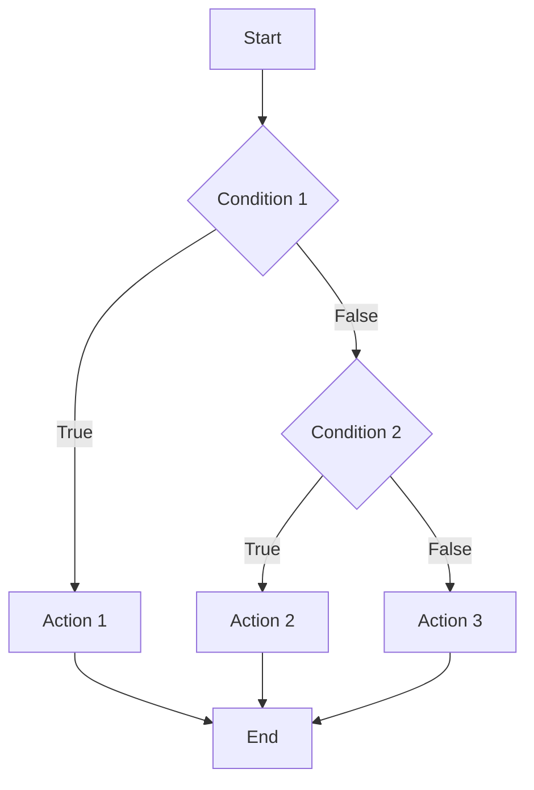
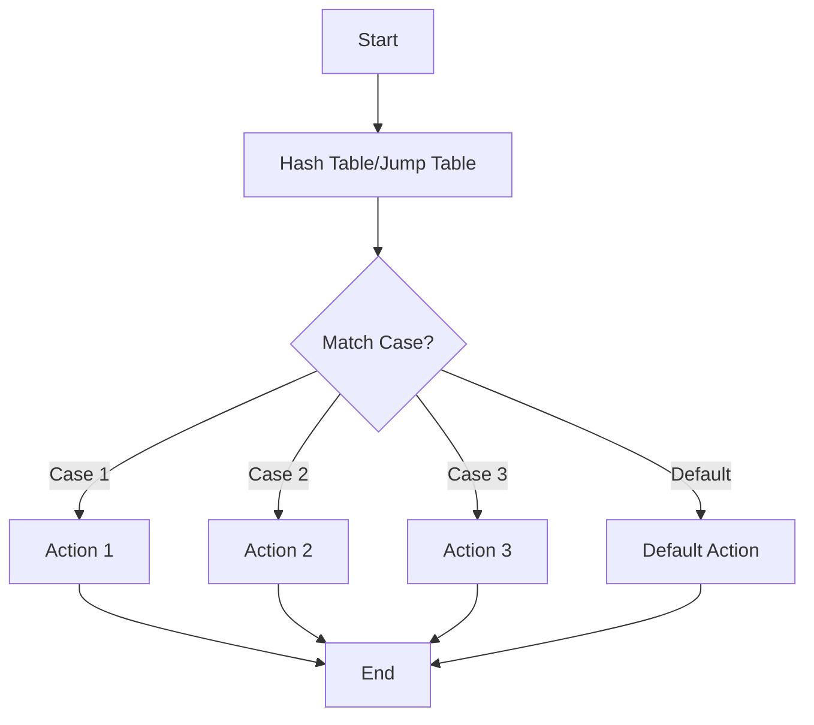

Khi mới học lập trình, việc xử lý các điều kiện phức tạp thường khiến nhiều bạn cảm thấy rối. Bao giờ nên dùng if-else? Khi nào switch-case sẽ tốt hơn? Bài viết này sẽ giúp bạn hiểu rõ và lựa chọn cấu trúc điều khiển phù hợp cho từng tình huống.

<!-- truncate -->

## 1. Hiểu về cấu trúc điều khiển

Cấu trúc điều khiển giúp chúng ta quyết định chương trình sẽ chạy những đoạn code nào dựa trên các điều kiện. Hai cấu trúc phổ biến nhất là:
- if-else: kiểm tra điều kiện logic phức tạp
- switch-case: so sánh một giá trị với nhiều hằng số

### 1.1. Cấu trúc if-else

:::note Cú pháp cơ bản
```cpp
if (điều_kiện_1) {
    // Code khi điều kiện 1 đúng
}
else if (điều_kiện_2) {
    // Code khi điều kiện 2 đúng
}
else {
    // Code khi không điều kiện nào đúng
}
```
:::

### 1.2. Cấu trúc switch-case

:::note Cú pháp cơ bản
```cpp
switch (biến_kiểm_tra) {
    case giá_trị_1:
        // Code cho giá trị 1
        break;
    case giá_trị_2:
        // Code cho giá trị 2
        break;
    default:
        // Code mặc định
}
```
:::

## 2. So sánh if-else và switch-case

### 2.1. Khi nào nên dùng if-else?

1. **Điều kiện logic phức tạp**
   - So sánh phức tạp ($>, <, >=, <=$)
   - Kết hợp nhiều điều kiện (&&, ||)
   - Kiểm tra khoảng giá trị

2. **Điều kiện không cố định**
   - Giá trị so sánh là biến
   - Điều kiện phụ thuộc runtime

3. **Số lượng nhánh ít** (2-3 nhánh)

:::tip Ví dụ thích hợp cho if-else
```cpp
// Kiểm tra điểm và xếp loại
if (diem >= 8.0) {
    cout << "Gioi";
} 
else if (diem >= 6.5) {
    cout << "Kha";
}
else {
    cout << "Trung binh";
}
```
:::

### 2.2. Khi nào nên dùng switch-case?

1. **So sánh một giá trị với nhiều hằng số**
   - Menu lựa chọn
   - Mã lỗi
   - Trạng thái hệ thống

2. **Số lượng nhánh nhiều** (4+ nhánh)

3. **Giá trị so sánh là số nguyên hoặc enum**

:::tip Ví dụ thích hợp cho switch-case
```cpp
// Menu chương trình
switch (luaChon) {
    case 1:
        themSinhVien();
        break;
    case 2:
        xoaSinhVien();
        break;
    case 3:
        suaSinhVien();
        break;
    case 4:
        hienThiDanhSach();
        break;
    default:
        cout << "Lua chon khong hop le";
}
```
:::

## 3. Hiệu năng và tối ưu hóa

### 3.1. Hiệu năng if-else



Với if-else:
- Kiểm tra tuần tự từng điều kiện
- Độ phức tạp: O(n) với n là số điều kiện
- Thích hợp khi số nhánh ít

### 3.2. Hiệu năng switch-case



Với switch-case:
- Compiler tạo bảng jump/hash
- Độ phức tạp: O(1) cho hầu hết trường hợp
- Hiệu quả với nhiều nhánh

## 4. Ví dụ thực tế

### 4.1. Xử lý lệnh trong game đơn giản

Đây là ví dụ về một game text-based đơn giản, thể hiện cách sử dụng cả if-else và switch-case:

```cpp
#include <iostream>
#include <string>
using namespace std;

void xuLyLenh(string lenh, int& viTri) {
    // Dùng if-else cho điều kiện phức tạp
    if (lenh.length() > 10) {
        cout << "Lenh qua dai!\n";
        return;
    }

    // Dùng switch cho các lệnh cơ bản
    switch (lenh[0]) {
        case 'W':
        case 'w':
            viTri += 1;  // Di chuyển lên
            break;
        case 'S':
        case 's':
            viTri -= 1;  // Di chuyển xuống
            break;
        case 'Q':
        case 'q':
            cout << "Thoat game!\n";
            exit(0);
            break;
        default:
            cout << "Lenh khong hop le!\n";
    }
}
```

```python
def xu_ly_lenh(lenh: str, vi_tri: dict) -> None:
    # Dùng if-else cho điều kiện phức tạp
    if len(lenh) > 10:
        print("Lenh qua dai!")
        return

    # Dùng match-case (Python 3.10+) cho các lệnh cơ bản
    match lenh[0].lower():
        case 'w':
            vi_tri['y'] += 1  # Di chuyển lên
        case 's':
            vi_tri['y'] -= 1  # Di chuyển xuống
        case 'q':
            print("Thoat game!")
            exit(0)
        case _:
            print("Lenh khong hop le!")
```

```java
public class GameControl {
    public static void xuLyLenh(String lenh, Position viTri) {
        // Dùng if-else cho điều kiện phức tạp
        if (lenh.length() > 10) {
            System.out.println("Lenh qua dai!");
            return;
        }

        // Dùng switch cho các lệnh cơ bản
        switch (lenh.toLowerCase().charAt(0)) {
            case 'w':
                viTri.y += 1;  // Di chuyển lên
                break;
            case 's':
                viTri.y -= 1;  // Di chuyển xuống
                break;
            case 'q':
                System.out.println("Thoat game!");
                System.exit(0);
                break;
            default:
                System.out.println("Lenh khong hop le!");
        }
    }
}
```

### 4.2. Xử lý form đăng ký

Ví dụ về việc kiểm tra form đăng ký, sử dụng if-else cho các điều kiện phức tạp:

```cpp
bool kiemTraDangKy(const string& email, const string& matKhau, int tuoi) {
    // Kiểm tra email
    if (email.empty() || email.find("@") == string::npos) {
        cout << "Email khong hop le!\n";
        return false;
    }

    // Kiểm tra độ dài và độ phức tạp của mật khẩu
    if (matKhau.length() < 8 || 
        !any_of(matKhau.begin(), matKhau.end(), ::isupper) ||
        !any_of(matKhau.begin(), matKhau.end(), ::isdigit)) {
        cout << "Mat khau phai co it nhat 8 ky tu, 1 chu hoa va 1 so!\n";
        return false;
    }

    // Kiểm tra tuổi
    if (tuoi < 18 || tuoi > 100) {
        cout << "Tuoi khong hop le!\n";
        return false;
    }

    return true;
}
```

## 5. Các lỗi thường gặp và cách tránh

### 5.1. Lỗi với if-else

1. **Quá nhiều nhánh lồng nhau**
```cpp
// KHÔNG NÊN
if (condition1) {
    if (condition2) {
        if (condition3) {
            // Code
        }
    }
}

// NÊN
if (!condition1 || !condition2 || !condition3) {
    return;
}
// Code
```

2. **Điều kiện phức tạp khó đọc**
```cpp
// KHÔNG NÊN
if (a > 0 && b > 0 && c > 0 && a + b > c && b + c > a && a + c > b) {
    // Code
}

// NÊN
bool laTamGiacHopLe(int a, int b, int c) {
    bool canhDuong = (a > 0 && b > 0 && c > 0);
    bool thoaManBatDangThuc = (a + b > c && b + c > a && a + c > b);
    return canhDuong && thoaManBatDangThuc;
}

if (laTamGiacHopLe(a, b, c)) {
    // Code
}
```

### 5.2. Lỗi với switch-case

1. **Quên break**
```cpp
// KHÔNG NÊN
switch (value) {
    case 1:
        cout << "Mot";  // Thiếu break!
    case 2:
        cout << "Hai";
        break;
}

// NÊN
switch (value) {
    case 1:
        cout << "Mot";
        break;
    case 2:
        cout << "Hai";
        break;
}
```

2. **Sử dụng switch cho logic phức tạp**
```cpp
// KHÔNG NÊN
switch (diem) {
    case 10:
    case 9:
        cout << "Xuat sac";
        break;
    case 8:
        cout << "Gioi";
        break;
    // ...
}

// NÊN dùng if-else cho khoảng giá trị
if (diem >= 9) {
    cout << "Xuat sac";
}
else if (diem >= 8) {
    cout << "Gioi";
}
```

## 6. Tối ưu hóa và mở rộng

### 6.1. Sử dụng hàm thay thế if-else dài

```cpp
// KHÔNG NÊN
if (loaiKhachHang == "VIP") {
    giamGia = 0.2;
    diemThuong = 100;
    quaTang = true;
} else if (loaiKhachHang == "Than thiet") {
    giamGia = 0.1;
    diemThuong = 50;
    quaTang = false;
} else {
    giamGia = 0;
    diemThuong = 10;
    quaTang = false;
}

// NÊN
struct ChinhSachKhachHang {
    double giamGia;
    int diemThuong;
    bool quaTang;
};

ChinhSachKhachHang layChinhSach(const string& loaiKhachHang) {
    static const map<string, ChinhSachKhachHang> chinhSach = {
        {"VIP", {0.2, 100, true}},
        {"Than thiet", {0.1, 50, false}},
        {"Thuong", {0.0, 10, false}}
    };
    
    return chinhSach.at(loaiKhachHang);
}
```

### 6.2. Sử dụng enum thay vì magic numbers

```cpp
// KHÔNG NÊN
switch (trangThai) {
    case 0:  // Magic number
        cout << "Cho xu ly";
        break;
    case 1:
        cout << "Dang xu ly";
        break;
    case 2:
        cout << "Hoan thanh";
        break;
}

// NÊN
enum TrangThaiDonHang {
    CHO_XU_LY,
    DANG_XU_LY,
    HOAN_THANH
};

switch (trangThai) {
    case CHO_XU_LY:
        cout << "Cho xu ly";
        break;
    case DANG_XU_LY:
        cout << "Dang xu ly";
        break;
    case HOAN_THANH:
        cout << "Hoan thanh";
        break;
}
```

## 7. Bài tập thực hành

1. **Máy tính đơn giản**
   - Sử dụng switch-case cho các phép toán
   - Dùng if-else để xử lý chia cho 0

2. **Xử lý menu game**
   - Thiết kế menu nhiều cấp
   - Kết hợp if-else và switch-case

3. **Validation form**
   - Kiểm tra các trường input
   - Xử lý các điều kiện logic phức tạp

## Tổng kết

- **If-else** thích hợp cho:
  - Điều kiện logic phức tạp
  - So sánh khoảng giá trị
  - Số nhánh ít

- **Switch-case** thích hợp cho:
  - So sánh với hằng số
  - Menu lựa chọn
  - Số nhánh nhiều

:::tip Nguyên tắc chọn cấu trúc điều khiển
1. Ưu tiên đơn giản và dễ đọc
2. Xem xét số lượng nhánh
3. Đánh giá độ phức tạp của điều kiện
4. Cân nhắc yếu tố hiệu năng
:::
