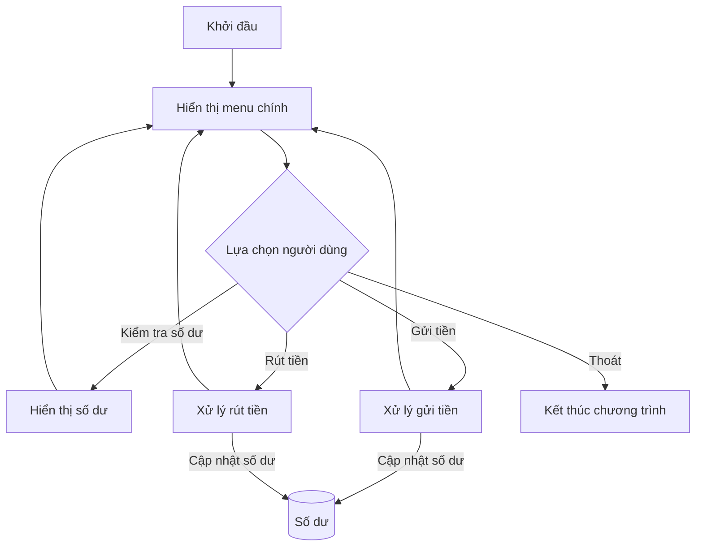

Xây dựng một chương trình ATM đơn giản là bài tập tuyệt vời để hiểu về cách thiết kế hệ thống menu, xử lý giao dịch và quản lý trạng thái trong ứng dụng tương tác với người dùng. Chương trình này mô phỏng các chức năng cơ bản của máy ATM như kiểm tra số dư, rút tiền, gửi tiền và chuyển khoản, đồng thời áp dụng nhiều khái niệm lập trình quan trọng như cấu trúc điều khiển, hàm, và xử lý lỗi.

Trong bài viết này, chúng ta sẽ học cách xây dựng một chương trình ATM đơn giản từ đầu, hiểu rõ cách tổ chức luồng điều khiển và triển khai các chức năng ngân hàng cơ bản. Dù bạn là người mới học lập trình hay đã có kinh nghiệm, dự án này sẽ giúp bạn rèn luyện kỹ năng thiết kế ứng dụng tương tác.

<!-- truncate -->

## Hiểu rõ về ứng dụng ATM

Trước khi bắt đầu lập trình, hãy hiểu rõ các chức năng cơ bản mà một máy ATM thực hiện:

1. **Xác thực người dùng**: Kiểm tra số tài khoản và mã PIN
2. **Kiểm tra số dư**: Hiển thị số tiền hiện có trong tài khoản
3. **Rút tiền**: Cho phép người dùng rút tiền nếu số dư đủ
4. **Gửi tiền**: Cho phép người dùng gửi tiền vào tài khoản
5. **Chuyển khoản**: Cho phép chuyển tiền giữa các tài khoản
6. **Hiển thị menu và xử lý lựa chọn của người dùng**

Để đơn giản hóa, chúng ta sẽ tập trung vào một chương trình ATM cho một người dùng duy nhất (không cần đăng nhập), với các chức năng cơ bản là: kiểm tra số dư, gửi tiền, rút tiền và thoát.

## Thiết kế chương trình

Trước khi viết code, chúng ta cần phác thảo cấu trúc và luồng làm việc của chương trình:

### Các thành phần chính:
1. **Biến lưu trữ số dư tài khoản**
2. **Menu chính với các lựa chọn**
3. **Các hàm xử lý cho từng chức năng**
4. **Vòng lặp chính để duy trì chương trình**

### Luồng làm việc của chương trình:



## Triển khai chương trình

Giờ chúng ta sẽ triển khai chương trình ATM đơn giản trong ba ngôn ngữ lập trình phổ biến: C++, Python, và Java.

### C++ Implementation

```cpp
#include <iostream>
#include <limits>
#include <iomanip> // Để định dạng tiền tệ
using namespace std;

// Hàm để xóa buffer và xử lý lỗi nhập liệu
void clearInputBuffer() {
    cin.clear();
    cin.ignore(numeric_limits<streamsize>::max(), '\n');
}

int main() {
    // Khởi tạo số dư ban đầu
    double balance = 1000000; // 1,000,000 VND
    int choice;
    double amount;
    bool running = true;
    
    cout << "Chao mung den voi Chuong trinh ATM!" << endl;
    
    while (running) {
        // Hiển thị menu
        cout << "\n===== MENU ATM =====\n";
        cout << "1. Kiem tra so du\n";
        cout << "2. Gui tien\n";
        cout << "3. Rut tien\n";
        cout << "4. Thoat\n";
        cout << "====================\n";
        cout << "Vui long chon: ";
        
        // Kiểm tra lựa chọn hợp lệ
        if (!(cin >> choice)) {
            cout << "Loi: Vui long nhap mot so!\n";
            clearInputBuffer();
            continue;
        }
        
        // Xử lý lựa chọn
        switch (choice) {
            case 1: // Kiểm tra số dư
                cout << "So du cua ban la: " << fixed << setprecision(0) << balance << " VND" << endl;
                break;
                
            case 2: // Gửi tiền
                cout << "Nhap so tien muon gui: ";
                if (!(cin >> amount)) {
                    cout << "Loi: Vui long nhap mot so!\n";
                    clearInputBuffer();
                    break;
                }
                
                if (amount <= 0) {
                    cout << "So tien gui phai lon hon 0!" << endl;
                } else {
                    balance += amount;
                    cout << "Ban vua gui " << fixed << setprecision(0) << amount << " VND vao tai khoan." << endl;
                    cout << "So du moi la: " << fixed << setprecision(0) << balance << " VND" << endl;
                }
                break;
                
            case 3: // Rút tiền
                cout << "Nhap so tien muon rut: ";
                if (!(cin >> amount)) {
                    cout << "Loi: Vui long nhap mot so!\n";
                    clearInputBuffer();
                    break;
                }
                
                if (amount <= 0) {
                    cout << "So tien rut phai lon hon 0!" << endl;
                } else if (amount > balance) {
                    cout << "So du khong du! Ban chi co " << fixed << setprecision(0) << balance << " VND trong tai khoan." << endl;
                } else {
                    balance -= amount;
                    cout << "Ban vua rut " << fixed << setprecision(0) << amount << " VND tu tai khoan." << endl;
                    cout << "So du moi la: " << fixed << setprecision(0) << balance << " VND" << endl;
                }
                break;
                
            case 4: // Thoát
                cout << "Cam on ban da su dung dich vu ATM. Hen gap lai!" << endl;
                running = false;
                break;
                
            default:
                cout << "Lua chon khong hop le. Vui long thu lai!" << endl;
        }
        
        // Xóa buffer cho lần nhập tiếp theo
        clearInputBuffer();
    }
    
    return 0;
}
```

### Python Implementation

```python
def display_menu():
    """Hiển thị menu ATM"""
    print("\n===== MENU ATM =====")
    print("1. Kiểm tra số dư")
    print("2. Gửi tiền")
    print("3. Rút tiền")
    print("4. Thoát")
    print("====================")

def format_currency(amount):
    """Định dạng số tiền thành chuỗi có dấu phân cách hàng nghìn"""
    return f"{amount:,.0f} VND"

def main():
    # Khởi tạo số dư ban đầu
    balance = 1000000  # 1,000,000 VND
    running = True
    
    print("Chào mừng đến với Chương trình ATM!")
    
    while running:
        display_menu()
        
        # Nhận lựa chọn từ người dùng
        try:
            choice = int(input("Vui lòng chọn: "))
        except ValueError:
            print("Lỗi: Vui lòng nhập một số!")
            continue
            
        # Xử lý lựa chọn
        if choice == 1:  # Kiểm tra số dư
            print(f"Số dư của bạn là: {format_currency(balance)}")
            
        elif choice == 2:  # Gửi tiền
            try:
                amount = float(input("Nhập số tiền muốn gửi: "))
                if amount <= 0:
                    print("Số tiền gửi phải lớn hơn 0!")
                else:
                    balance += amount
                    print(f"Bạn vừa gửi {format_currency(amount)} vào tài khoản.")
                    print(f"Số dư mới là: {format_currency(balance)}")
            except ValueError:
                print("Lỗi: Vui lòng nhập một số hợp lệ!")
                
        elif choice == 3:  # Rút tiền
            try:
                amount = float(input("Nhập số tiền muốn rút: "))
                if amount <= 0:
                    print("Số tiền rút phải lớn hơn 0!")
                elif amount > balance:
                    print(f"Số dư không đủ! Bạn chỉ có {format_currency(balance)} trong tài khoản.")
                else:
                    balance -= amount
                    print(f"Bạn vừa rút {format_currency(amount)} từ tài khoản.")
                    print(f"Số dư mới là: {format_currency(balance)}")
            except ValueError:
                print("Lỗi: Vui lòng nhập một số hợp lệ!")
                
        elif choice == 4:  # Thoát
            print("Cảm ơn bạn đã sử dụng dịch vụ ATM. Hẹn gặp lại!")
            running = False
            
        else:
            print("Lựa chọn không hợp lệ. Vui lòng thử lại!")

if __name__ == "__main__":
    main()
```

### Java Implementation

```java
import java.text.NumberFormat;
import java.util.Locale;
import java.util.Scanner;

public class SimpleATM {
    
    // Định dạng tiền tệ
    private static String formatCurrency(double amount) {
        NumberFormat currencyFormatter = NumberFormat.getNumberInstance(new Locale("vi", "VN"));
        return currencyFormatter.format(amount) + " VND";
    }
    
    // Hiển thị menu
    private static void displayMenu() {
        System.out.println("\n===== MENU ATM =====");
        System.out.println("1. Kiem tra so du");
        System.out.println("2. Gui tien");
        System.out.println("3. Rut tien");
        System.out.println("4. Thoat");
        System.out.println("====================");
    }

    public static void main(String[] args) {
        // Khởi tạo Scanner để đọc input
        Scanner scanner = new Scanner(System.in);
        
        // Khởi tạo số dư ban đầu
        double balance = 1000000; // 1,000,000 VND
        boolean running = true;
        
        System.out.println("Chao mung den voi Chuong trinh ATM!");
        
        while (running) {
            displayMenu();
            System.out.print("Vui long chon: ");
            
            // Kiểm tra input hợp lệ
            if (!scanner.hasNextInt()) {
                System.out.println("Loi: Vui long nhap mot so!");
                scanner.next(); // Xóa input không hợp lệ
                continue;
            }
            
            int choice = scanner.nextInt();
            scanner.nextLine(); // Xóa newline
            
            // Xử lý lựa chọn
            switch (choice) {
                case 1: // Kiểm tra số dư
                    System.out.println("So du cua ban la: " + formatCurrency(balance));
                    break;
                    
                case 2: // Gửi tiền
                    System.out.print("Nhap so tien muon gui: ");
                    try {
                        double amount = scanner.nextDouble();
                        scanner.nextLine(); // Xóa newline
                        
                        if (amount <= 0) {
                            System.out.println("So tien gui phai lon hon 0!");
                        } else {
                            balance += amount;
                            System.out.println("Ban vua gui " + formatCurrency(amount) + " vao tai khoan.");
                            System.out.println("So du moi la: " + formatCurrency(balance));
                        }
                    } catch (Exception e) {
                        System.out.println("Loi: Vui long nhap mot so hop le!");
                        scanner.nextLine(); // Xóa input không hợp lệ
                    }
                    break;
                    
                case 3: // Rút tiền
                    System.out.print("Nhap so tien muon rut: ");
                    try {
                        double amount = scanner.nextDouble();
                        scanner.nextLine(); // Xóa newline
                        
                        if (amount <= 0) {
                            System.out.println("So tien rut phai lon hon 0!");
                        } else if (amount > balance) {
                            System.out.println("So du khong du! Ban chi co " + formatCurrency(balance) + " trong tai khoan.");
                        } else {
                            balance -= amount;
                            System.out.println("Ban vua rut " + formatCurrency(amount) + " tu tai khoan.");
                            System.out.println("So du moi la: " + formatCurrency(balance));
                        }
                    } catch (Exception e) {
                        System.out.println("Loi: Vui long nhap mot so hop le!");
                        scanner.nextLine(); // Xóa input không hợp lệ
                    }
                    break;
                    
                case 4: // Thoát
                    System.out.println("Cam on ban da su dung dich vu ATM. Hen gap lai!");
                    running = false;
                    break;
                    
                default:
                    System.out.println("Lua chon khong hop le. Vui long thu lai!");
            }
        }
        
        scanner.close();
    }
}
```

## Phân tích chương trình ATM

### Cấu trúc chính
1. **Khởi tạo**: Thiết lập số dư ban đầu và các biến cần thiết
2. **Vòng lặp chính**: Hiển thị menu và xử lý lựa chọn người dùng
3. **Xử lý nghiệp vụ**: Các chức năng chính như kiểm tra số dư, rút tiền, gửi tiền
4. **Xử lý lỗi**: Kiểm tra nhập liệu và xử lý các trường hợp đặc biệt

### Các khái niệm lập trình quan trọng

1. **Cấu trúc điều khiển**:
   - Vòng lặp while để duy trì chương trình
   - Switch/if-else để xử lý lựa chọn menu
   - Kiểm tra điều kiện cho các giao dịch

2. **Quản lý trạng thái**:
   - Biến `balance` lưu trữ số dư hiện tại
   - Biến `running` kiểm soát vòng lặp chính

3. **Xử lý đầu vào/đầu ra**:
   - Hiển thị menu và thông báo
   - Đọc và xử lý lựa chọn người dùng
   - Định dạng hiển thị tiền tệ

4. **Xử lý lỗi**:
   - Kiểm tra đầu vào không hợp lệ (nhập chữ thay vì số)
   - Xử lý trường hợp số dư không đủ
   - Xử lý số tiền âm hoặc bằng không

## Mở rộng chương trình

Chương trình ATM cơ bản có thể được mở rộng với nhiều tính năng hơn. Dưới đây là một số ý tưởng:

### 1. Xác thực người dùng

```cpp
// C++ (đoạn mã được thêm vào phần đầu main)
string correctPin = "1234";
string enteredPin;
int attempts = 0;
const int MAX_ATTEMPTS = 3;

cout << "Chao mung den voi Chuong trinh ATM!" << endl;

while (attempts < MAX_ATTEMPTS) {
    cout << "Nhap ma PIN: ";
    cin >> enteredPin;
    
    if (enteredPin == correctPin) {
        cout << "Xac thuc thanh cong!" << endl;
        break;
    } else {
        attempts++;
        cout << "Ma PIN khong dung! Con " << (MAX_ATTEMPTS - attempts) << " lan thu." << endl;
        
        if (attempts >= MAX_ATTEMPTS) {
            cout << "Ban da nhap sai PIN qua nhieu lan. The bi khoa!" << endl;
            return 0;
        }
    }
}
```

### 2. Chức năng chuyển khoản

```java
// Java (thêm case mới vào switch)
case 5: // Chuyển khoản
    System.out.print("Nhap so tai khoan nguoi nhan: ");
    String accountNumber = scanner.nextLine();
    
    System.out.print("Nhap so tien muon chuyen: ");
    try {
        double amount = scanner.nextDouble();
        scanner.nextLine(); // Xóa newline
        
        if (amount <= 0) {
            System.out.println("So tien chuyen phai lon hon 0!");
        } else if (amount > balance) {
            System.out.println("So du khong du! Ban chi co " + formatCurrency(balance) + " trong tai khoan.");
        } else {
            balance -= amount;
            System.out.println("Ban vua chuyen " + formatCurrency(amount) + 
                               " den tai khoan " + accountNumber + ".");
            System.out.println("So du moi la: " + formatCurrency(balance));
        }
    } catch (Exception e) {
        System.out.println("Loi: Vui long nhap mot so hop le!");
        scanner.nextLine(); // Xóa input không hợp lệ
    }
    break;
```

### 3. Lịch sử giao dịch

```python
# Python (thêm vào đầu main)
transaction_history = []

# Python (thêm vào mỗi giao dịch)
def record_transaction(transaction_type, amount):
    import datetime
    transaction_history.append({
        'type': transaction_type,
        'amount': amount,
        'date': datetime.datetime.now().strftime("%Y-%m-%d %H:%M:%S")
    })

# Python (thêm lựa chọn menu)
elif choice == 5:  # Xem lịch sử giao dịch
    print("\n=== LỊCH SỬ GIAO DỊCH ===")
    if not transaction_history:
        print("Chưa có giao dịch nào!")
    else:
        for i, transaction in enumerate(transaction_history, 1):
            print(f"{i}. {transaction['type']} - {format_currency(transaction['amount'])} - {transaction['date']}")
```

### 4. Rút tiền theo mệnh giá

```cpp
// C++ (thay thế case 3 trong switch)
case 3: // Rút tiền
    cout << "\n=== RUT TIEN ===\n";
    cout << "1. 50,000 VND\n";
    cout << "2. 100,000 VND\n";
    cout << "3. 200,000 VND\n";
    cout << "4. 500,000 VND\n";
    cout << "5. So tien khac\n";
    cout << "6. Tro ve menu chinh\n";
    cout << "================\n";
    cout << "Vui long chon: ";
    
    int withdrawOption;
    if (!(cin >> withdrawOption)) {
        cout << "Loi: Vui long nhap mot so!\n";
        clearInputBuffer();
        break;
    }
    
    double withdrawAmount = 0;
    switch (withdrawOption) {
        case 1: withdrawAmount = 50000; break;
        case 2: withdrawAmount = 100000; break;
        case 3: withdrawAmount = 200000; break;
        case 4: withdrawAmount = 500000; break;
        case 5:
            cout << "Nhap so tien muon rut: ";
            if (!(cin >> withdrawAmount)) {
                cout << "Loi: Vui long nhap mot so!\n";
                clearInputBuffer();
                break;
            }
            break;
        case 6:
            break;
        default:
            cout << "Lua chon khong hop le!\n";
            break;
    }
    
    if (withdrawOption != 6 && withdrawAmount > 0) {
        if (withdrawAmount > balance) {
            cout << "So du khong du! Ban chi co " << fixed << setprecision(0) << balance << " VND trong tai khoan." << endl;
        } else {
            balance -= withdrawAmount;
            cout << "Ban vua rut " << fixed << setprecision(0) << withdrawAmount << " VND tu tai khoan." << endl;
            cout << "So du moi la: " << fixed << setprecision(0) << balance << " VND" << endl;
        }
    }
    break;
```

## Bài học và kỹ năng thu được

Thông qua việc xây dựng chương trình ATM đơn giản, chúng ta đã học được nhiều khái niệm và kỹ thuật quan trọng:

1. **Thiết kế menu tương tác**: Cách tạo và xử lý menu người dùng
2. **Quản lý trạng thái**: Cập nhật và theo dõi trạng thái của hệ thống (số dư)
3. **Xử lý đầu vào và validation**: Kiểm tra đầu vào hợp lệ
4. **Định dạng đầu ra**: Hiển thị tiền tệ với dấu phân cách hàng nghìn
5. **Xử lý lỗi**: Bắt và xử lý các trường hợp đặc biệt
6. **Cấu trúc điều khiển**: Sử dụng switch/if-else và vòng lặp để điều khiển luồng

:::tip Mẹo cho người mới học lập trình
Khi xây dựng hệ thống menu, hãy luôn nhớ xử lý **mọi** đầu vào của người dùng, kể cả những đầu vào không mong đợi. Validation là một phần quan trọng của lập trình thực tế!
:::

## Tính toán độ phức tạp

### Độ phức tạp thời gian

Chương trình ATM của chúng ta có độ phức tạp thời gian là $O(1)$ cho mỗi giao dịch, vì các thao tác gửi tiền, rút tiền và kiểm tra số dư đều được thực hiện trong thời gian không đổi.

Nếu thêm tính năng lịch sử giao dịch và hiển thị toàn bộ lịch sử, độ phức tạp có thể trở thành $O(n)$ với n là số lượng giao dịch đã thực hiện.

### Độ phức tạp không gian

Đối với chương trình ATM cơ bản, độ phức tạp không gian là $O(1)$ vì chúng ta chỉ lưu trữ một số lượng biến cố định.

Nếu mở rộng với tính năng lịch sử giao dịch, độ phức tạp không gian sẽ trở thành $O(n)$ với n là số lượng giao dịch.

## Ứng dụng trong thực tế

Mặc dù đây chỉ là một chương trình ATM đơn giản, nhưng nó minh họa nhiều nguyên tắc được sử dụng trong phần mềm thực tế:

1. **Ứng dụng ngân hàng**: Các ứng dụng ngân hàng thực tế sử dụng các nguyên tắc tương tự nhưng phức tạp hơn nhiều
2. **Hệ thống menu**: Cách thiết kế này được sử dụng trong nhiều ứng dụng dòng lệnh và GUI
3. **Xác thực và bảo mật**: Các hệ thống đăng nhập dựa trên PIN/mật khẩu
4. **Xử lý giao dịch tài chính**: Nguyên tắc kiểm tra và cập nhật số dư

## Bài tập thực hành

Để hiểu rõ hơn về chương trình ATM, hãy thử các bài tập sau:

1. **Thêm chức năng thanh toán hóa đơn**: Cho phép người dùng thanh toán các loại hóa đơn khác nhau
2. **Lưu trữ thông tin vào file**: Lưu số dư và lịch sử giao dịch vào file để dữ liệu không mất khi thoát chương trình
3. **Thêm hệ thống người dùng**: Mở rộng chương trình để hỗ trợ nhiều người dùng khác nhau, mỗi người có tài khoản và số dư riêng
4. **Tính năng đổi PIN**: Cho phép người dùng thay đổi mã PIN của họ
5. **Giao diện đồ họa đơn giản**: Nâng cấp lên giao diện đồ họa đơn giản sử dụng thư viện như ncurses (C++), Tkinter (Python), hoặc JavaFX (Java)

## Tổng kết

Xây dựng một chương trình ATM đơn giản là một bài tập thú vị và giàu tính giáo dục, giúp chúng ta áp dụng nhiều khái niệm lập trình quan trọng trong một dự án thực tế. Qua bài viết này, chúng ta đã học được:

1. Cách thiết kế và triển khai hệ thống menu tương tác
2. Quản lý trạng thái và xử lý giao dịch tài chính
3. Xử lý đầu vào người dùng và validation
4. Xử lý các trường hợp đặc biệt và ngoại lệ
5. Cách mở rộng ứng dụng với các tính năng bổ sung

Chương trình ATM là một nền tảng tuyệt vời để xây dựng các ứng dụng phức tạp hơn, và các kỹ năng học được có thể áp dụng cho nhiều loại dự án phần mềm khác.
