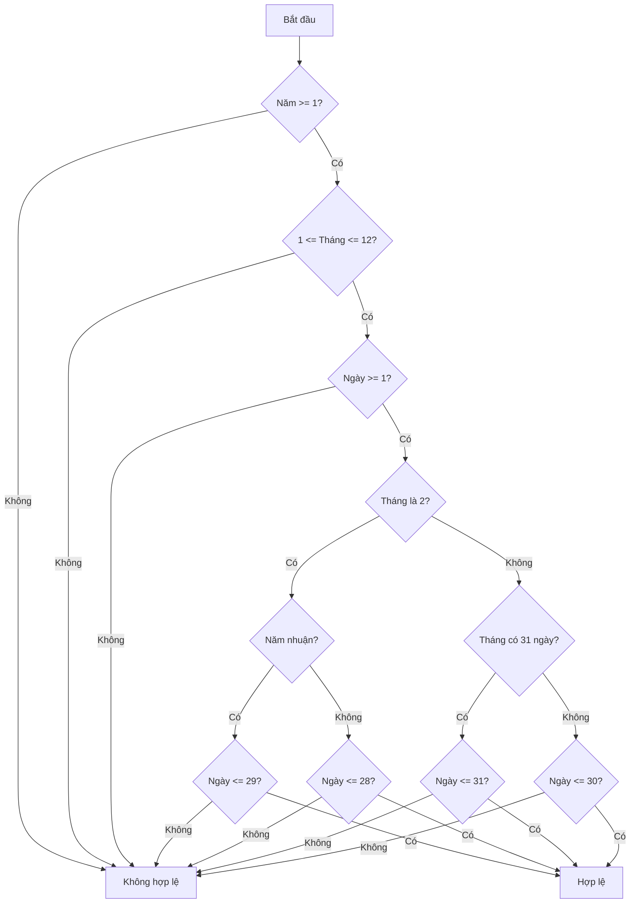
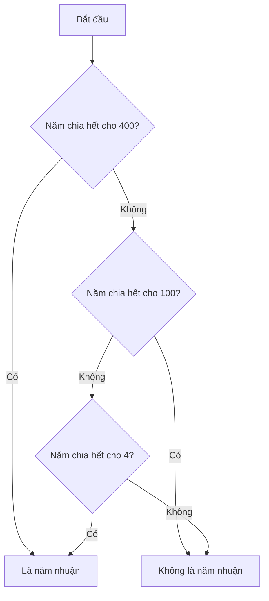

Việc kiểm tra tính hợp lệ của một ngày tháng năm là một bài toán phổ biến trong lập trình, đặc biệt khi làm việc với hệ thống xử lý thông tin cá nhân, đặt lịch, hoặc các ứng dụng liên quan đến thời gian. Bài toán này đòi hỏi xử lý nhiều điều kiện logic phức tạp và kết hợp kiến thức về lịch như năm nhuận, số ngày trong tháng, và mối quan hệ giữa các giá trị ngày, tháng, năm.

Trong bài viết này, chúng ta sẽ xây dựng từng bước chương trình kiểm tra tính hợp lệ của ngày tháng năm, phân tích logic cần thiết và cách triển khai nó trong các ngôn ngữ lập trình phổ biến. Bạn sẽ học được cách xử lý các trường hợp đặc biệt và áp dụng điều kiện logic phức tạp một cách hiệu quả.

<!-- truncate -->

## Hiểu rõ bài toán: Kiểm tra tính hợp lệ của ngày tháng năm

Trước khi bắt đầu lập trình, chúng ta cần hiểu rõ bài toán đang giải quyết. Việc kiểm tra tính hợp lệ của ngày tháng năm bao gồm:

1. **Kiểm tra phạm vi cơ bản**:
   - Ngày phải từ 1-31
   - Tháng phải từ 1-12
   - Năm thường là số nguyên dương (hoặc trong một phạm vi cụ thể)

2. **Kiểm tra sự tương thích giữa ngày và tháng**:
   - Tháng 4, 6, 9, 11 có tối đa 30 ngày
   - Tháng 1, 3, 5, 7, 8, 10, 12 có tối đa 31 ngày
   - Tháng 2 đặc biệt: 28 hoặc 29 ngày tùy thuộc vào năm nhuận

3. **Kiểm tra năm nhuận**:
   - Năm chia hết cho 4 và không chia hết cho 100, hoặc
   - Năm chia hết cho 400

### Phân tích yêu cầu

Để xây dựng một chương trình kiểm tra tính hợp lệ của ngày, chúng ta sẽ:

1. Nhận vào 3 tham số: ngày, tháng, năm
2. Kiểm tra phạm vi cơ bản của mỗi tham số
3. Kiểm tra tính hợp lệ của ngày dựa trên tháng và năm
4. Trả về kết quả: hợp lệ hoặc không hợp lệ

## Tiếp cận bài toán

Trước khi đi vào mã nguồn, chúng ta cần có một thuật toán rõ ràng để xử lý vấn đề này. Dưới đây là cách tiếp cận từng bước:

### Thuật toán kiểm tra tính hợp lệ của ngày tháng năm



Phân tích từng bước:
1. Đầu tiên kiểm tra xem năm có hợp lệ không (năm >= 1)
2. Sau đó kiểm tra tháng có nằm trong khoảng hợp lệ từ 1-12
3. Kiểm tra ngày có lớn hơn hoặc bằng 1
4. Xét các trường hợp đặc biệt:
   - Nếu là tháng 2, cần xét đến năm nhuận (29 ngày) hoặc không nhuận (28 ngày)
   - Nếu là tháng có 31 ngày (1, 3, 5, 7, 8, 10, 12), ngày phải $<= 31$
   - Nếu là tháng có 30 ngày (4, 6, 9, 11), ngày phải $<= 30$

### Hàm kiểm tra năm nhuận

Để kiểm tra năm nhuận, chúng ta có thể sử dụng logic sau:



## Triển khai chương trình

Giờ chúng ta sẽ triển khai thuật toán này trong C++, Python và Java. Chúng ta sẽ tạo hàm kiểm tra năm nhuận và hàm kiểm tra tính hợp lệ của ngày tháng năm.

### C++ Implementation

```cpp
#include <iostream>
using namespace std;

// Hàm kiểm tra năm nhuận
bool isLeapYear(int year) {
    if (year % 400 == 0)
        return true;
    if (year % 100 == 0)
        return false;
    if (year % 4 == 0)
        return true;
    return false;
}

// Hàm kiểm tra tính hợp lệ của ngày tháng năm
bool isValidDate(int day, int month, int year) {
    // Kiểm tra năm
    if (year < 1)
        return false;
        
    // Kiểm tra tháng
    if (month < 1 || month > 12)
        return false;
        
    // Kiểm tra ngày
    if (day < 1)
        return false;
        
    // Mảng lưu số ngày tối đa của các tháng (không tính năm nhuận)
    int daysInMonth[] = {0, 31, 28, 31, 30, 31, 30, 31, 31, 30, 31, 30, 31};
    
    // Cập nhật tháng 2 trong năm nhuận
    if (month == 2 && isLeapYear(year))
        daysInMonth[2] = 29;
        
    // Kiểm tra ngày có vượt quá số ngày tối đa của tháng không
    if (day > daysInMonth[month])
        return false;
        
    return true;
}

int main() {
    int day, month, year;
    
    cout << "Nhap ngay: ";
    cin >> day;
    cout << "Nhap thang: ";
    cin >> month;
    cout << "Nhap nam: ";
    cin >> year;
    
    if (isValidDate(day, month, year)) {
        cout << "Ngay " << day << "/" << month << "/" << year << " la ngay hop le." << endl;
    } else {
        cout << "Ngay " << day << "/" << month << "/" << year << " la ngay KHONG hop le." << endl;
    }
    
    return 0;
}
```

### Python Implementation

```python
def is_leap_year(year):
    """Kiểm tra năm nhuận"""
    if year % 400 == 0:
        return True
    if year % 100 == 0:
        return False
    if year % 4 == 0:
        return True
    return False

def is_valid_date(day, month, year):
    """Kiểm tra tính hợp lệ của ngày tháng năm"""
    # Kiểm tra năm
    if year < 1:
        return False
    
    # Kiểm tra tháng
    if month < 1 or month > 12:
        return False
    
    # Kiểm tra ngày
    if day < 1:
        return False
    
    # Danh sách số ngày tối đa của các tháng (không tính năm nhuận)
    days_in_month = [0, 31, 28, 31, 30, 31, 30, 31, 31, 30, 31, 30, 31]
    
    # Cập nhật tháng 2 trong năm nhuận
    if month == 2 and is_leap_year(year):
        days_in_month[2] = 29
    
    # Kiểm tra ngày có vượt quá số ngày tối đa của tháng không
    if day > days_in_month[month]:
        return False
    
    return True

def main():
    try:
        day = int(input("Nhập ngày: "))
        month = int(input("Nhập tháng: "))
        year = int(input("Nhập năm: "))
        
        if is_valid_date(day, month, year):
            print(f"Ngày {day}/{month}/{year} là ngày hợp lệ.")
        else:
            print(f"Ngày {day}/{month}/{year} là ngày KHÔNG hợp lệ.")
    
    except ValueError:
        print("Lỗi: Vui lòng nhập số nguyên cho ngày, tháng, năm.")

if __name__ == "__main__":
    main()
```

### Java Implementation

```java
import java.util.Scanner;

public class DateValidator {
    
    // Hàm kiểm tra năm nhuận
    public static boolean isLeapYear(int year) {
        if (year % 400 == 0)
            return true;
        if (year % 100 == 0)
            return false;
        if (year % 4 == 0)
            return true;
        return false;
    }
    
    // Hàm kiểm tra tính hợp lệ của ngày tháng năm
    public static boolean isValidDate(int day, int month, int year) {
        // Kiểm tra năm
        if (year < 1)
            return false;
        
        // Kiểm tra tháng
        if (month < 1 || month > 12)
            return false;
        
        // Kiểm tra ngày
        if (day < 1)
            return false;
        
        // Mảng lưu số ngày tối đa của các tháng (không tính năm nhuận)
        int[] daysInMonth = {0, 31, 28, 31, 30, 31, 30, 31, 31, 30, 31, 30, 31};
        
        // Cập nhật tháng 2 trong năm nhuận
        if (month == 2 && isLeapYear(year))
            daysInMonth[2] = 29;
        
        // Kiểm tra ngày có vượt quá số ngày tối đa của tháng không
        if (day > daysInMonth[month])
            return false;
        
        return true;
    }
    
    public static void main(String[] args) {
        Scanner scanner = new Scanner(System.in);
        
        try {
            System.out.print("Nhap ngay: ");
            int day = scanner.nextInt();
            System.out.print("Nhap thang: ");
            int month = scanner.nextInt();
            System.out.print("Nhap nam: ");
            int year = scanner.nextInt();
            
            if (isValidDate(day, month, year)) {
                System.out.println("Ngay " + day + "/" + month + "/" + year + " la ngay hop le.");
            } else {
                System.out.println("Ngay " + day + "/" + month + "/" + year + " la ngay KHONG hop le.");
            }
        } catch (Exception e) {
            System.out.println("Loi: Vui long nhap so nguyen cho ngay, thang, nam.");
        } finally {
            scanner.close();
        }
    }
}
```

## Cải tiến và tối ưu hóa

Mã nguồn trên đã giải quyết được vấn đề cơ bản, nhưng chúng ta có thể cải tiến nó để làm cho chương trình hiệu quả và dễ bảo trì hơn.

### Tối ưu hóa hàm kiểm tra năm nhuận

Thay vì sử dụng nhiều câu lệnh if, chúng ta có thể viết gọn lại:

```cpp
// C++
bool isLeapYear(int year) {
    return (year % 400 == 0) || (year % 4 == 0 && year % 100 != 0);
}
```

```python
# Python
def is_leap_year(year):
    return year % 400 == 0 or (year % 4 == 0 and year % 100 != 0)
```

```java
// Java
public static boolean isLeapYear(int year) {
    return (year % 400 == 0) || (year % 4 == 0 && year % 100 != 0);
}
```

### Xử lý các trường hợp đặc biệt

Ngoài các kiểm tra cơ bản, có thể có các yêu cầu bổ sung như:

1. **Giới hạn năm**: Có thể yêu cầu năm phải nằm trong một khoảng cụ thể (ví dụ: từ 1900 đến 2100)
2. **Định dạng ngày**: Phụ thuộc vào quốc gia, ngày có thể được hiển thị theo nhiều định dạng khác nhau (DD/MM/YYYY hoặc MM/DD/YYYY)
3. **Xử lý lịch cụ thể**: Một số hệ thống có thể yêu cầu xử lý đặc biệt như lịch Julian hoặc các hệ thống lịch khác

:::tip Mẹo
Trong thực tế, các ngôn ngữ lập trình hiện đại thường có thư viện xử lý ngày tháng rất mạnh mẽ, chẳng hạn như `Datetime` trong Python, `LocalDate` trong Java, hoặc `<chrono>` trong C++. Sử dụng các thư viện này thường là cách tốt nhất để xử lý ngày tháng trong ứng dụng thực tế.
:::

## Xử lý lỗi và validation nhập liệu

Trong môi trường thực tế, người dùng có thể nhập dữ liệu không hợp lệ. Việc xử lý lỗi nhập liệu là rất quan trọng:

### C++ với xử lý lỗi nhập liệu

```cpp
#include <iostream>
#include <limits>
using namespace std;

int getValidInput(string prompt) {
    int value;
    while (true) {
        cout << prompt;
        if (cin >> value) {
            // Nhập thành công
            cin.ignore(numeric_limits<streamsize>::max(), '\n'); // Xóa buffer
            return value;
        } else {
            // Nhập không thành công
            cout << "Loi: Vui long nhap mot so nguyen.\n";
            cin.clear(); // Xóa trạng thái lỗi
            cin.ignore(numeric_limits<streamsize>::max(), '\n'); // Xóa buffer
        }
    }
}

int main() {
    int day = getValidInput("Nhap ngay: ");
    int month = getValidInput("Nhap thang: ");
    int year = getValidInput("Nhap nam: ");
    
    if (isValidDate(day, month, year)) {
        cout << "Ngay " << day << "/" << month << "/" << year << " la ngay hop le." << endl;
    } else {
        cout << "Ngay " << day << "/" << month << "/" << year << " la ngay KHONG hop le." << endl;
    }
    
    return 0;
}
```

### Python với xử lý lỗi toàn diện

```python
def get_valid_input(prompt):
    while True:
        try:
            return int(input(prompt))
        except ValueError:
            print("Lỗi: Vui lòng nhập một số nguyên.")

def main():
    day = get_valid_input("Nhập ngày: ")
    month = get_valid_input("Nhập tháng: ")
    year = get_valid_input("Nhập năm: ")
    
    if is_valid_date(day, month, year):
        print(f"Ngày {day}/{month}/{year} là ngày hợp lệ.")
    else:
        print(f"Ngày {day}/{month}/{year} là ngày KHÔNG hợp lệ.")

if __name__ == "__main__":
    main()
```

## Áp dụng trong thực tế

Việc kiểm tra tính hợp lệ của ngày tháng năm có nhiều ứng dụng thực tế:

1. **Hệ thống đăng ký người dùng**: Xác thực ngày sinh
2. **Ứng dụng đặt vé**: Kiểm tra ngày khởi hành/kết thúc hợp lệ
3. **Phần mềm kế toán**: Kiểm tra ngày thanh toán, ngày đáo hạn
4. **Ứng dụng lên lịch**: Đảm bảo ngày được chọn là hợp lệ

:::info Ứng dụng nâng cao
Phần mở rộng của bài toán này có thể bao gồm:
- Tính khoảng cách giữa hai ngày
- Tìm ngày kế tiếp hoặc trước đó
- Xác định thứ trong tuần của một ngày cụ thể
:::

## Tính toán độ phức tạp

### Độ phức tạp thời gian

Thuật toán kiểm tra tính hợp lệ của ngày tháng năm có độ phức tạp thời gian là $O(1)$. Tất cả các phép kiểm tra đều được thực hiện trong thời gian không đổi, không phụ thuộc vào giá trị đầu vào.

### Độ phức tạp không gian

Thuật toán sử dụng một mảng cố định để lưu trữ số ngày của mỗi tháng, do đó độ phức tạp không gian cũng là $O(1)$.

## Bài tập thực hành

Để hiểu rõ hơn về bài toán này, bạn có thể thử các bài tập sau:

1. Mở rộng chương trình để tính ngày tiếp theo (tomorrow) của một ngày cho trước
2. Tính khoảng cách giữa hai ngày (số ngày)
3. Xác định thứ trong tuần của một ngày cụ thể (Thứ 2, Thứ 3, ...)
4. Hiển thị lịch của một tháng cụ thể trong năm

## Tổng kết

Kiểm tra tính hợp lệ của ngày tháng năm là một bài toán thú vị đòi hỏi sự hiểu biết về xử lý điều kiện logic phức tạp. Chúng ta đã học được:

1. Cách phân tích yêu cầu và xây dựng thuật toán bước-bước
2. Triển khai giải pháp trong nhiều ngôn ngữ lập trình
3. Xử lý các trường hợp đặc biệt như năm nhuận
4. Cách tiếp cận và cải tiến mã nguồn

Việc xử lý ngày tháng là kỹ năng quan trọng trong lập trình thực tế và có nhiều ứng dụng trong các hệ thống phần mềm. Thông qua ví dụ này, bạn không chỉ học được cách xử lý ngày tháng mà còn cách tư duy logic và xử lý điều kiện phức tạp, là nền tảng cho nhiều bài toán lập trình khác.
