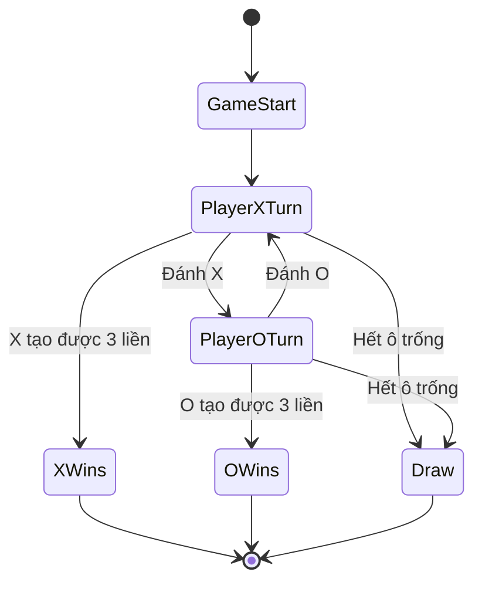
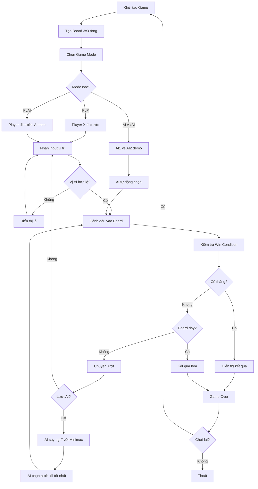
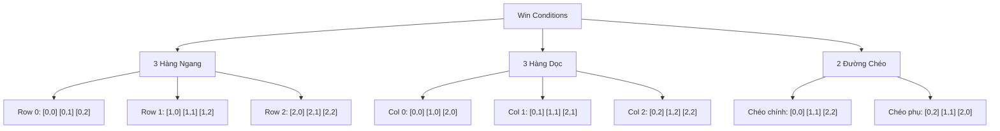
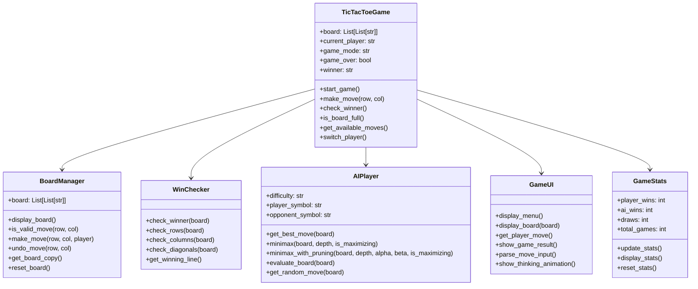

# Phát Triển Game Tic-Tac-Toe (Cờ Caro 3x3) - Hướng dẫn AI cơ bản

Chào mừng các bạn đến với bài hướng dẫn thứ hai trong series **Game Development với Python**! Hôm nay chúng ta sẽ xây dựng một **game Tic-Tac-Toe hoàn chỉnh** với AI opponent thông minh.

Tic-Tac-Toe (hay còn gọi là Cờ caro 3x3) là game kinh điển mà ai cũng biết, nhưng việc lập trình nó lại mang đến những thách thức thú vị về **game theory**, **AI algorithms**, và **2D array manipulation**. Chúng ta sẽ không chỉ tạo ra một game đơn giản, mà còn implement **Minimax algorithm** để tạo ra AI không thể bị đánh bại!

<!-- truncate -->

## Game Demo và Giới Thiệu

Trước khi bắt đầu code, hãy xem game chúng ta sẽ xây dựng:

```
🎯 TIC-TAC-TOE - CỜ CARO 3X3 🎯

📋 CHỌN CHE ĐỘ CHƠI:
1. 👥 Người vs Người  
2. 🤖 Người vs AI (Dễ)
3. 🧠 Người vs AI (Khó - Minimax)
4. 🎮 AI vs AI (Demo)

Lựa chọn: 3

🎮 NGƯỜI vs AI (MINIMAX) 🎮
Bạn là X, AI là O

   1   2   3
A    |   |   
  -----------
B    |   |   
  -----------  
C    |   |   

Lượt của bạn (vd: A1, B2): B2

   1   2   3
A    |   |   
  -----------
B    | X |   
  -----------
C    |   |   

AI đang suy nghĩ... 🤔
AI chọn: A1

   1   2   3
A  O |   |   
  -----------
B    | X |   
  -----------
C    |   |   

Lượt của bạn (vd: A1, B2): A3

   1   2   3
A  O |   | X
  -----------
B    | X |   
  -----------
C    |   |   

AI đang suy nghĩ... 🤔
AI chọn: C2

   1   2   3
A  O |   | X
  -----------
B    | X |   
  -----------
C    | O |   

🎉 AI THẮNG! 🎉
Sequence thắng: A1-B2-C3 (Đường chéo)
```

## Bạn Sẽ Học Được Gì?

Qua bài hướng dẫn này, bạn sẽ nắm vững:

- ✅ **2D Array manipulation** - Làm việc với ma trận 2 chiều
- ✅ **Game Board representation** - Biểu diễn bàn cờ trong code  
- ✅ **Win condition detection** - Thuật toán phát hiện thắng/thua
- ✅ **Minimax Algorithm** - AI decision making cơ bản
- ✅ **Game Tree traversal** - Duyệt cây game states
- ✅ **Alpha-Beta Pruning** - Tối ưu hóa AI performance
- ✅ **Strategy Patterns** - Design patterns cho game AI
- ✅ **Player vs AI interaction** - Human-computer gameplay

## Yêu Cầu Trước Khi Bắt Đầu

- **Python cơ bản**: Lists, functions, classes, loops
- **Logic thinking**: Hiểu về game rules và strategy
- **Python 3.6+** đã cài đặt
- **Kiến thức về recursion** (sẽ giải thích chi tiết)
- **Tinh thần thách thức** với AI programming! 🤖

---

## Bước 1: Phân Tích Game - Hiểu Rõ Tic-Tac-Toe

### Game Rules - Luật Chơi Cơ Bản

1. **Bàn cờ**: Lưới 3x3 có 9 ô vuông
2. **Người chơi**: 2 người, một dùng X, một dùng O  
3. **Lượt chơi**: Luân phiên đánh X và O vào ô trống
4. **Thắng**: Tạo thành 1 hàng 3 ký hiệu giống nhau (ngang/dọc/chéo)
5. **Hòa**: Hết ô trống mà không ai thắng

### Game States - Các Trạng Thái Game



### Game Flow - Luồng Chơi Chi Tiết



### Board Representation - Biểu Diễn Bàn Cờ

Chúng ta sẽ sử dụng **2D list** để biểu diễn bàn cờ:

```python
# Board dạng 2D array
board = [
    [' ', ' ', ' '],  # Hàng A (index 0)
    [' ', ' ', ' '],  # Hàng B (index 1)  
    [' ', ' ', ' ']   # Hàng C (index 2)
]

# Mapping tọa độ người dùng -> array index
# A1 -> board[0][0], A2 -> board[0][1], A3 -> board[0][2]
# B1 -> board[1][0], B2 -> board[1][1], B3 -> board[1][2]  
# C1 -> board[2][0], C2 -> board[2][1], C3 -> board[2][2]
```

### Win Conditions - Điều Kiện Thắng



---

## Bước 2: Thiết Kế Kiến Trúc - Architecture Design

### Class Diagram - Sơ Đồ Classes



### Module Structure - Cấu Trúc Files

```
tic_tac_toe/
├── main.py                 # Entry point
├── config.py              # Game configuration
├── game_manager.py        # Main game controller
├── board_manager.py       # Board operations
├── win_checker.py         # Win condition logic
├── ai_player.py           # AI algorithms  
├── ui_manager.py          # User interface
├── game_stats.py          # Statistics tracking
├── utils.py               # Helper utilities
└── tests/
    ├── test_board.py      # Board tests
    ├── test_ai.py         # AI tests
    └── test_win_checker.py # Win logic tests
```

---

## Bước 3: Implementation - Xây Dựng Game Từng Bước

### 3.1. Tạo Configuration (config.py)

```python
# config.py
"""
Cấu hình cho Tic-Tac-Toe Game
"""

# Game symbols
PLAYER_X = 'X'
PLAYER_O = 'O'
EMPTY_CELL = ' '

# Game modes
GAME_MODES = {
    1: {
        'name': 'Người vs Người',
        'description': 'Hai người chơi với nhau',
        'type': 'pvp'
    },
    2: {
        'name': 'Người vs AI (Dễ)',
        'description': 'AI chơi random, phù hợp cho mới bắt đầu',
        'type': 'pv_ai_easy'
    },
    3: {
        'name': 'Người vs AI (Khó)',
        'description': 'AI sử dụng Minimax, rất khó thắng',
        'type': 'pv_ai_hard'
    },
    4: {
        'name': 'AI vs AI Demo',
        'description': 'Xem AI chơi với nhau',
        'type': 'ai_vs_ai'
    }
}

# AI difficulty settings
AI_SETTINGS = {
    'easy': {
        'algorithm': 'random',
        'thinking_time': 1.0,
        'mistake_probability': 0.3  # 30% tỷ lệ đánh sai
    },
    'hard': {
        'algorithm': 'minimax',
        'thinking_time': 2.0,  
        'max_depth': 9,  # Depth tối đa cho minimax
        'use_alpha_beta': True
    }
}

# Board display settings
BOARD_DISPLAY = {
    'show_coordinates': True,
    'use_colors': True,
    'animation_speed': 0.5
}

# Input validation
VALID_ROWS = ['A', 'B', 'C']
VALID_COLS = ['1', '2', '3']

# Game messages
MESSAGES = {
    'welcome': '🎯 TIC-TAC-TOE - CỜ CARO 3X3 🎯',
    'choose_mode': '📋 CHỌN CHẾ ĐỘ CHƠI:',
    'player_turn': 'Lượt của {player}',
    'ai_thinking': 'AI đang suy nghĩ... 🤔',
    'invalid_move': '❌ Nước đi không hợp lệ!',
    'game_draw': '🤝 HÒA! Không ai thắng.',
    'player_wins': '🎉 {player} THẮNG! 🎉',
    'ai_wins': '🤖 AI THẮNG! 🤖',
    'play_again': '🔄 Bạn có muốn chơi lại không?'
}

# Statistics file
STATS_FILE = 'data/tic_tac_toe_stats.json'
```

### 3.2. Xây Dựng Board Manager (board_manager.py)

```python
# board_manager.py
"""
Quản lý bàn cờ Tic-Tac-Toe
"""

from config import EMPTY_CELL, PLAYER_X, PLAYER_O
import copy

class BoardManager:
    """Lớp quản lý bàn cờ"""
    
    def __init__(self):
        self.board = self.create_empty_board()
    
    def create_empty_board(self):
        """
        Tạo bàn cờ trống 3x3
        
        Returns:
            List[List[str]]: Bàn cờ rỗng
        """
        return [[EMPTY_CELL for _ in range(3)] for _ in range(3)]
    
    def display_board(self):
        """Hiển thị bàn cờ với tọa độ"""
        print("\n   1   2   3")
        
        for i, row in enumerate(self.board):
            row_label = chr(ord('A') + i)  # A, B, C
            print(f"{row_label}  {row[0]} | {row[1]} | {row[2]} ")
            
            if i < 2:  # Không vẽ gạch dưới hàng cuối
                print("  -----------")
        
        print()  # Dòng trống cho dễ nhìn
    
    def is_valid_move(self, row, col):
        """
        Kiểm tra nước đi có hợp lệ không
        
        Args:
            row (int): Hàng (0-2)
            col (int): Cột (0-2)
            
        Returns:
            bool: True nếu hợp lệ
        """
        # Kiểm tra trong bounds
        if not (0 <= row <= 2 and 0 <= col <= 2):
            return False
        
        # Kiểm tra ô trống
        return self.board[row][col] == EMPTY_CELL
    
    def make_move(self, row, col, player):
        """
        Thực hiện nước đi
        
        Args:
            row (int): Hàng
            col (int): Cột  
            player (str): Người chơi ('X' hoặc 'O')
            
        Returns:
            bool: True nếu đánh được
        """
        if self.is_valid_move(row, col):
            self.board[row][col] = player
            return True
        return False
    
    def undo_move(self, row, col):
        """
        Hoàn tác nước đi (dùng cho AI minimax)
        
        Args:
            row (int): Hàng
            col (int): Cột
        """
        self.board[row][col] = EMPTY_CELL
    
    def get_available_moves(self):
        """
        Lấy danh sách các nước đi có thể
        
        Returns:
            List[Tuple[int, int]]: Danh sách (row, col) có thể đánh
        """
        moves = []
        
        for row in range(3):
            for col in range(3):
                if self.board[row][col] == EMPTY_CELL:
                    moves.append((row, col))
        
        return moves
    
    def is_board_full(self):
        """
        Kiểm tra bàn cờ đã đầy chưa
        
        Returns:
            bool: True nếu đầy
        """
        return len(self.get_available_moves()) == 0
    
    def get_board_copy(self):
        """
        Tạo bản copy của board (dùng cho AI)
        
        Returns:
            List[List[str]]: Copy của board
        """
        return copy.deepcopy(self.board)
    
    def reset_board(self):
        """Reset bàn cờ về trạng thái ban đầu"""
        self.board = self.create_empty_board()
    
    def get_board_state_string(self):
        """
        Chuyển board thành string để hash (cho memoization)
        
        Returns:
            str: Board state dạng string
        """
        return ''.join([''.join(row) for row in self.board])
    
    def count_symbols(self):
        """
        Đếm số lượng X và O trên board
        
        Returns:
            dict: {'X': count, 'O': count, 'empty': count}
        """
        counts = {'X': 0, 'O': 0, 'empty': 0}
        
        for row in self.board:
            for cell in row:
                if cell == PLAYER_X:
                    counts['X'] += 1
                elif cell == PLAYER_O:
                    counts['O'] += 1
                else:
                    counts['empty'] += 1
        
        return counts
```

### 3.3. Win Checker - Phát Hiện Thắng/Thua (win_checker.py)

```python
# win_checker.py
"""
Kiểm tra điều kiện thắng trong Tic-Tac-Toe
"""

from config import EMPTY_CELL

class WinChecker:
    """Lớp kiểm tra điều kiện thắng"""
    
    def __init__(self):
        self.winning_line = None  # Lưu đường thắng để highlight
    
    def check_winner(self, board):
        """
        Kiểm tra xem có ai thắng không
        
        Args:
            board (List[List[str]]): Bàn cờ hiện tại
            
        Returns:
            str: 'X', 'O', hoặc None nếu chưa có ai thắng
        """
        # Kiểm tra các hàng ngang
        winner = self.check_rows(board)
        if winner:
            return winner
        
        # Kiểm tra các cột dọc
        winner = self.check_columns(board)
        if winner:
            return winner
        
        # Kiểm tra các đường chéo
        winner = self.check_diagonals(board)
        if winner:
            return winner
        
        return None
    
    def check_rows(self, board):
        """
        Kiểm tra thắng theo hàng ngang
        
        Args:
            board (List[List[str]]): Bàn cờ
            
        Returns:
            str: Người thắng hoặc None
        """
        for i, row in enumerate(board):
            if self._is_winning_line(row):
                # Lưu thông tin đường thắng
                self.winning_line = {
                    'type': 'row',
                    'index': i,
                    'positions': [(i, 0), (i, 1), (i, 2)]
                }
                return row[0]  # Trả về người thắng
        
        return None
    
    def check_columns(self, board):
        """
        Kiểm tra thắng theo cột dọc
        
        Args:
            board (List[List[str]]): Bàn cờ
            
        Returns:
            str: Người thắng hoặc None
        """
        for col in range(3):
            column = [board[row][col] for row in range(3)]
            
            if self._is_winning_line(column):
                # Lưu thông tin đường thắng
                self.winning_line = {
                    'type': 'column',
                    'index': col,
                    'positions': [(0, col), (1, col), (2, col)]
                }
                return column[0]
        
        return None
    
    def check_diagonals(self, board):
        """
        Kiểm tra thắng theo đường chéo
        
        Args:
            board (List[List[str]]): Bàn cờ
            
        Returns:
            str: Người thắng hoặc None
        """
        # Đường chéo chính (top-left to bottom-right)
        main_diagonal = [board[i][i] for i in range(3)]
        if self._is_winning_line(main_diagonal):
            self.winning_line = {
                'type': 'main_diagonal',
                'positions': [(0, 0), (1, 1), (2, 2)]
            }
            return main_diagonal[0]
        
        # Đường chéo phụ (top-right to bottom-left)  
        anti_diagonal = [board[i][2-i] for i in range(3)]
        if self._is_winning_line(anti_diagonal):
            self.winning_line = {
                'type': 'anti_diagonal', 
                'positions': [(0, 2), (1, 1), (2, 0)]
            }
            return anti_diagonal[0]
        
        return None
    
    def _is_winning_line(self, line):
        """
        Kiểm tra 3 ký hiệu có giống nhau và không rỗng
        
        Args:
            line (List[str]): Dãy 3 ký hiệu
            
        Returns:
            bool: True nếu là đường thắng
        """
        return (line[0] == line[1] == line[2] and 
                line[0] != EMPTY_CELL)
    
    def get_winning_line(self):
        """
        Lấy thông tin đường thắng cuối cùng
        
        Returns:
            dict: Thông tin đường thắng hoặc None
        """
        return self.winning_line
    
    def is_game_over(self, board):
        """
        Kiểm tra game đã kết thúc chưa (thắng hoặc hòa)
        
        Args:
            board (List[List[str]]): Bàn cờ
            
        Returns:
            tuple: (is_over, winner, is_draw)
        """
        winner = self.check_winner(board)
        
        if winner:
            return True, winner, False
        
        # Kiểm tra hòa (board đầy mà không ai thắng)
        is_full = all(
            board[row][col] != EMPTY_CELL 
            for row in range(3) 
            for col in range(3)
        )
        
        if is_full:
            return True, None, True
        
        return False, None, False
    
    def evaluate_position(self, board, player):
        """
        Đánh giá vị thế trên bàn cờ cho AI
        
        Args:
            board (List[List[str]]): Bàn cờ
            player (str): Người chơi đánh giá
            
        Returns:
            int: Điểm đánh giá (-100 to +100)
        """
        winner = self.check_winner(board)
        
        if winner == player:
            return 100  # Thắng
        elif winner and winner != player:
            return -100  # Thua
        else:
            # Đánh giá dựa trên tiềm năng thắng
            return self._evaluate_potential(board, player)
    
    def _evaluate_potential(self, board, player):
        """
        Đánh giá tiềm năng thắng dựa trên số đường có thể tạo thành 3
        
        Args:
            board (List[List[str]]): Bàn cờ
            player (str): Người chơi
            
        Returns:
            int: Điểm tiềm năng
        """
        opponent = 'O' if player == 'X' else 'X'
        score = 0
        
        # Tất cả các đường có thể thắng
        lines = [
            # Hàng ngang
            [(0,0), (0,1), (0,2)],
            [(1,0), (1,1), (1,2)],
            [(2,0), (2,1), (2,2)],
            # Cột dọc
            [(0,0), (1,0), (2,0)],
            [(0,1), (1,1), (2,1)],
            [(0,2), (1,2), (2,2)],
            # Đường chéo
            [(0,0), (1,1), (2,2)],
            [(0,2), (1,1), (2,0)]
        ]
        
        for line in lines:
            line_score = self._evaluate_line(board, line, player, opponent)
            score += line_score
        
        return score
    
    def _evaluate_line(self, board, line, player, opponent):
        """
        Đánh giá một đường cụ thể
        
        Args:
            board: Bàn cờ
            line: Danh sách 3 vị trí
            player: Người chơi hiện tại
            opponent: Đối thủ
            
        Returns:
            int: Điểm cho đường này
        """
        player_count = 0
        opponent_count = 0
        empty_count = 0
        
        for row, col in line:
            cell = board[row][col]
            if cell == player:
                player_count += 1
            elif cell == opponent:
                opponent_count += 1
            else:
                empty_count += 1
        
        # Nếu đối thủ đã chiếm 1 ô trong đường này, không thể thắng
        if opponent_count > 0 and player_count > 0:
            return 0
        
        # Tính điểm dựa trên số ô đã chiếm
        if player_count == 2 and empty_count == 1:
            return 50  # Sắp thắng
        elif player_count == 1 and empty_count == 2:
            return 10  # Có tiềm năng
        elif opponent_count == 2 and empty_count == 1:
            return -50  # Đối thủ sắp thắng, phải block
        elif opponent_count == 1 and empty_count == 2:
            return -10  # Đối thủ có tiềm năng
        
        return 0
```

### 3.4. AI Player với Minimax Algorithm (ai_player.py)

Đây là phần thú vị nhất! Chúng ta sẽ implement **Minimax algorithm** - thuật toán AI cổ điển cho game turn-based.

```python
# ai_player.py
"""
AI Player sử dụng Minimax algorithm cho Tic-Tac-Toe
"""

import random
import time
from config import AI_SETTINGS, EMPTY_CELL
from win_checker import WinChecker

class AIPlayer:
    """Lớp AI Player với các mức độ khó khác nhau"""
    
    def __init__(self, symbol, difficulty='hard'):
        """
        Khởi tạo AI Player
        
        Args:
            symbol (str): Ký hiệu của AI ('X' hoặc 'O')
            difficulty (str): Mức độ khó ('easy' hoặc 'hard')
        """
        self.symbol = symbol
        self.opponent_symbol = 'O' if symbol == 'X' else 'X'
        self.difficulty = difficulty
        self.settings = AI_SETTINGS[difficulty]
        self.win_checker = WinChecker()
        
        # Statistics cho debugging
        self.nodes_evaluated = 0
        self.max_depth_reached = 0
        
    def get_best_move(self, board):
        """
        Lấy nước đi tốt nhất cho AI
        
        Args:
            board (List[List[str]]): Bàn cờ hiện tại
            
        Returns:
            Tuple[int, int]: (row, col) tốt nhất
        """
        # Reset statistics
        self.nodes_evaluated = 0
        self.max_depth_reached = 0
        
        # Simulate thinking time
        time.sleep(self.settings['thinking_time'])
        
        if self.difficulty == 'easy':
            return self._get_easy_move(board)
        else:
            return self._get_minimax_move(board)
    
    def _get_easy_move(self, board):
        """
        AI dễ: Chơi random với một số logic cơ bản
        
        Args:
            board (List[List[str]]): Bàn cờ
            
        Returns:
            Tuple[int, int]: Nước đi
        """
        available_moves = self._get_available_moves(board)
        
        # 70% tỷ lệ chơi thông minh, 30% random
        if random.random() > self.settings['mistake_probability']:
            # Thử chơi thông minh: block opponent hoặc win
            smart_move = self._get_smart_move(board)
            if smart_move:
                return smart_move
        
        # Fallback: chọn random
        return random.choice(available_moves)
    
    def _get_smart_move(self, board):
        """
        Logic thông minh cơ bản: thắng trước, block sau
        
        Args:
            board (List[List[str]]): Bàn cờ
            
        Returns:
            Tuple[int, int] hoặc None: Nước đi thông minh
        """
        available_moves = self._get_available_moves(board)
        
        # 1. Kiểm tra xem có thể thắng ngay không
        for row, col in available_moves:
            # Thử đánh và kiểm tra
            board[row][col] = self.symbol
            if self.win_checker.check_winner(board) == self.symbol:
                board[row][col] = EMPTY_CELL  # Undo
                return (row, col)
            board[row][col] = EMPTY_CELL  # Undo
        
        # 2. Kiểm tra xem có cần block đối thủ không
        for row, col in available_moves:
            # Thử để đối thủ đánh và kiểm tra
            board[row][col] = self.opponent_symbol
            if self.win_checker.check_winner(board) == self.opponent_symbol:
                board[row][col] = EMPTY_CELL  # Undo
                return (row, col)  # Block tại đây
            board[row][col] = EMPTY_CELL  # Undo
        
        # 3. Ưu tiên trung tâm
        if board[1][1] == EMPTY_CELL:
            return (1, 1)
        
        # 4. Ưu tiên góc
        corners = [(0,0), (0,2), (2,0), (2,2)]
        available_corners = [(r,c) for r,c in corners if (r,c) in available_moves]
        if available_corners:
            return random.choice(available_corners)
        
        return None
    
    def _get_minimax_move(self, board):
        """
        AI khó: Sử dụng Minimax algorithm
        
        Args:
            board (List[List[str]]): Bàn cờ
            
        Returns:
            Tuple[int, int]: Nước đi tối ưu
        """
        best_score = float('-inf')
        best_move = None
        alpha = float('-inf')
        beta = float('inf')
        
        available_moves = self._get_available_moves(board)
        
        # Nếu là nước đi đầu tiên, chọn random để game thú vị hơn
        if len(available_moves) == 9:
            return random.choice([(0,0), (0,2), (1,1), (2,0), (2,2)])
        
        for row, col in available_moves:
            # Thử nước đi này
            board[row][col] = self.symbol
            
            # Tính điểm bằng minimax
            if self.settings.get('use_alpha_beta', False):
                score = self._minimax_alpha_beta(
                    board, 0, False, alpha, beta
                )
            else:
                score = self._minimax(board, 0, False)
            
            # Undo nước đi
            board[row][col] = EMPTY_CELL
            
            # Cập nhật best move
            if score > best_score:
                best_score = score
                best_move = (row, col)
                alpha = max(alpha, score)
        
        print(f"AI evaluated {self.nodes_evaluated} nodes, max depth: {self.max_depth_reached}")
        return best_move
    
    def _minimax(self, board, depth, is_maximizing):
        """
        Minimax algorithm cơ bản
        
        Args:
            board (List[List[str]]): Bàn cờ
            depth (int): Độ sâu hiện tại
            is_maximizing (bool): True nếu đang maximize
            
        Returns:
            int: Điểm đánh giá
        """
        self.nodes_evaluated += 1
        self.max_depth_reached = max(self.max_depth_reached, depth)
        
        # Kiểm tra terminal state
        is_over, winner, is_draw = self.win_checker.is_game_over(board)
        
        if is_over:
            if winner == self.symbol:
                return 100 - depth  # Thắng càng nhanh càng tốt
            elif winner == self.opponent_symbol:
                return -100 + depth  # Thua càng muộn càng tốt
            else:
                return 0  # Hòa
        
        # Giới hạn depth để tránh lag
        if depth >= self.settings.get('max_depth', 9):
            return self.win_checker.evaluate_position(board, self.symbol)
        
        available_moves = self._get_available_moves(board)
        
        if is_maximizing:
            # AI turn - maximize score
            max_score = float('-inf')
            
            for row, col in available_moves:
                board[row][col] = self.symbol
                score = self._minimax(board, depth + 1, False)
                board[row][col] = EMPTY_CELL
                
                max_score = max(max_score, score)
            
            return max_score
        else:
            # Opponent turn - minimize score
            min_score = float('inf')
            
            for row, col in available_moves:
                board[row][col] = self.opponent_symbol
                score = self._minimax(board, depth + 1, True)
                board[row][col] = EMPTY_CELL
                
                min_score = min(min_score, score)
            
            return min_score
    
    def _minimax_alpha_beta(self, board, depth, is_maximizing, alpha, beta):
        """
        Minimax với Alpha-Beta Pruning để tối ưu performance
        
        Args:
            board (List[List[str]]): Bàn cờ
            depth (int): Độ sâu
            is_maximizing (bool): Maximize hay minimize
            alpha (float): Alpha value
            beta (float): Beta value
            
        Returns:
            int: Điểm đánh giá
        """
        self.nodes_evaluated += 1
        self.max_depth_reached = max(self.max_depth_reached, depth)
        
        # Terminal state check
        is_over, winner, is_draw = self.win_checker.is_game_over(board)
        
        if is_over:
            if winner == self.symbol:
                return 100 - depth
            elif winner == self.opponent_symbol:
                return -100 + depth
            else:
                return 0
        
        if depth >= self.settings.get('max_depth', 9):
            return self.win_checker.evaluate_position(board, self.symbol)
        
        available_moves = self._get_available_moves(board)
        
        if is_maximizing:
            max_score = float('-inf')
            
            for row, col in available_moves:
                board[row][col] = self.symbol
                score = self._minimax_alpha_beta(board, depth + 1, False, alpha, beta)
                board[row][col] = EMPTY_CELL
                
                max_score = max(max_score, score)
                alpha = max(alpha, score)
                
                # Alpha-Beta Pruning
                if beta <= alpha:
                    break  # Prune remaining branches
            
            return max_score
        else:
            min_score = float('inf')
            
            for row, col in available_moves:
                board[row][col] = self.opponent_symbol
                score = self._minimax_alpha_beta(board, depth + 1, True, alpha, beta)
                board[row][col] = EMPTY_CELL
                
                min_score = min(min_score, score)
                beta = min(beta, score)
                
                # Alpha-Beta Pruning
                if beta <= alpha:
                    break  # Prune remaining branches
            
            return min_score
    
    def _get_available_moves(self, board):
        """
        Lấy các nước đi khả dụng
        
        Args:
            board (List[List[str]]): Bàn cờ
            
        Returns:
            List[Tuple[int, int]]: Danh sách nước đi
        """
        moves = []
        for row in range(3):
            for col in range(3):
                if board[row][col] == EMPTY_CELL:
                    moves.append((row, col))
        return moves
    
    def get_move_explanation(self, board, move):
        """
        Giải thích tại sao AI chọn nước đi này (cho educational purpose)
        
        Args:
            board (List[List[str]]): Bàn cờ
            move (Tuple[int, int]): Nước đi được chọn
            
        Returns:
            str: Giải thích
        """
        row, col = move
        
        # Check if it's a winning move
        board[row][col] = self.symbol
        if self.win_checker.check_winner(board) == self.symbol:
            board[row][col] = EMPTY_CELL
            return "Nước đi thắng ngay! 🎯"
        board[row][col] = EMPTY_CELL
        
        # Check if it's blocking opponent's win
        board[row][col] = self.opponent_symbol
        if self.win_checker.check_winner(board) == self.opponent_symbol:
            board[row][col] = EMPTY_CELL
            return "Block đối thủ sắp thắng! 🛡️"
        board[row][col] = EMPTY_CELL
        
        # Strategic positions
        if (row, col) == (1, 1):
            return "Chiếm trung tâm - vị trí chiến lược! ⭐"
        
        if (row, col) in [(0,0), (0,2), (2,0), (2,2)]:
            return "Chiếm góc để tạo nhiều đường thắng! 📐"
        
        return "Nước đi tối ưu theo Minimax! 🤖"
```

### 3.5. UI Manager (ui_manager.py)

```python
# ui_manager.py
"""
Quản lý giao diện người dùng cho Tic-Tac-Toe
"""

import time
import os
from config import GAME_MODES, MESSAGES, VALID_ROWS, VALID_COLS

class UIManager:
    """Lớp quản lý giao diện người dùng"""
    
    def __init__(self):
        self.animation_chars = ['⠋', '⠙', '⠹', '⠸', '⠼', '⠴', '⠦', '⠧', '⠇', '⠏']
    
    def clear_screen(self):
        """Xóa màn hình"""
        os.system('cls' if os.name == 'nt' else 'clear')
    
    def show_welcome(self):
        """Hiển thị màn hình chào mừng"""
        self.clear_screen()
        print("=" * 50)
        print(MESSAGES['welcome'])
        print("=" * 50)
        print()
    
    def show_game_mode_menu(self):
        """Hiển thị menu chọn chế độ chơi"""
        print(MESSAGES['choose_mode'])
        
        for mode_id, mode_info in GAME_MODES.items():
            print(f"{mode_id}. {mode_info['name']}")
            print(f"   {mode_info['description']}")
            print()
    
    def get_game_mode_choice(self):
        """
        Nhận lựa chọn chế độ game từ người dùng
        
        Returns:
            int: ID chế độ game
        """
        while True:
            try:
                choice = int(input("Lựa chọn của bạn (1-4): "))
                if choice in GAME_MODES:
                    return choice
                else:
                    print("❌ Vui lòng chọn từ 1-4!")
            except ValueError:
                print("❌ Vui lòng nhập số!")
            except KeyboardInterrupt:
                print("\n👋 Tạm biệt!")
                exit()
    
    def display_board_with_coordinates(self, board):
        """
        Hiển thị bàn cờ với tọa độ đẹp mắt
        
        Args:
            board (List[List[str]]): Bàn cờ
        """
        print("\n   1   2   3")
        
        for i, row in enumerate(board):
            row_label = chr(ord('A') + i)
            
            # Colorize X và O
            display_row = []
            for cell in row:
                if cell == 'X':
                    display_row.append('🔴')  # Red for X
                elif cell == 'O':
                    display_row.append('🔵')  # Blue for O  
                else:
                    display_row.append(' ')
            
            print(f"{row_label}  {display_row[0]} | {display_row[1]} | {display_row[2]} ")
            
            if i < 2:
                print("  -----------")
        
        print()
    
    def get_player_move(self, player_symbol):
        """
        Nhận nước đi từ người chơi
        
        Args:
            player_symbol (str): Ký hiệu người chơi
            
        Returns:
            Tuple[int, int]: (row, col)
        """
        while True:
            try:
                move_input = input(f"Lượt của {player_symbol} (vd: A1, B2): ").strip().upper()
                
                if len(move_input) != 2:
                    print("❌ Format không đúng! Vd: A1, B2, C3")
                    continue
                
                row_char = move_input[0]
                col_char = move_input[1]
                
                if row_char not in VALID_ROWS or col_char not in VALID_COLS:
                    print("❌ Tọa độ không hợp lệ! Hàng: A-C, Cột: 1-3")
                    continue
                
                # Convert to array indices
                row = ord(row_char) - ord('A')  # A->0, B->1, C->2
                col = int(col_char) - 1         # 1->0, 2->1, 3->2
                
                return (row, col)
                
            except KeyboardInterrupt:
                print("\n👋 Tạm biệt!")
                exit()
            except Exception as e:
                print(f"❌ Lỗi: {e}")
    
    def show_thinking_animation(self, duration=2.0):
        """
        Hiển thị animation AI đang suy nghĩ
        
        Args:
            duration (float): Thời gian animation (giây)
        """
        print(MESSAGES['ai_thinking'], end=' ')
        
        start_time = time.time()
        i = 0
        
        while time.time() - start_time < duration:
            print(f'\r{MESSAGES["ai_thinking"]} {self.animation_chars[i % len(self.animation_chars)]}', end='')
            time.sleep(0.1)
            i += 1
        
        print()  # New line sau animation
    
    def show_game_result(self, winner, is_draw, winning_line=None):
        """
        Hiển thị kết quả game
        
        Args:
            winner (str): Người thắng ('X', 'O', hoặc None)
            is_draw (bool): True nếu hòa
            winning_line (dict): Thông tin đường thắng
        """
        print("\n" + "🎯" * 20)
        
        if is_draw:
            print(MESSAGES['game_draw'])
        elif winner:
            if winner == 'X':
                print(f"🎉 NGƯỜI CHƠI X THẮNG! 🎉")
            elif winner == 'O':
                print(f"🤖 NGƯỜI CHƠI O THẮNG! 🤖")
            
            # Hiển thị thông tin đường thắng
            if winning_line:
                win_type = winning_line['type']
                if win_type == 'row':
                    print(f"Đường thắng: Hàng {chr(ord('A') + winning_line['index'])}")
                elif win_type == 'column':
                    print(f"Đường thắng: Cột {winning_line['index'] + 1}")
                elif win_type == 'main_diagonal':
                    print("Đường thắng: Chéo chính (↘)")
                elif win_type == 'anti_diagonal':
                    print("Đường thắng: Chéo phụ (↙)")
        
        print("🎯" * 20)
    
    def ask_play_again(self):
        """
        Hỏi người chơi có muốn chơi lại không
        
        Returns:
            bool: True nếu muốn chơi lại
        """
        while True:
            choice = input(MESSAGES['play_again'] + " (y/n): ").lower().strip()
            if choice in ['y', 'yes', 'có', 'c']:
                return True
            elif choice in ['n', 'no', 'không', 'k']:
                return False
            else:
                print("❌ Vui lòng nhập y (có) hoặc n (không)!")
    
    def show_ai_move_info(self, move, explanation=""):
        """
        Hiển thị thông tin nước đi của AI
        
        Args:
            move (Tuple[int, int]): Nước đi (row, col)
            explanation (str): Giải thích nước đi
        """
        row, col = move
        move_notation = f"{chr(ord('A') + row)}{col + 1}"
        
        print(f"AI chọn: {move_notation}")
        if explanation:
            print(f"💡 {explanation}")
        print()
    
    def show_game_header(self, mode_name, player_x, player_o):
        """
        Hiển thị header của game đang chơi
        
        Args:
            mode_name (str): Tên chế độ chơi
            player_x (str): Loại người chơi X
            player_o (str): Loại người chơi O
        """
        print(f"\n🎮 {mode_name.upper()} 🎮")
        print(f"🔴 X: {player_x}")
        print(f"🔵 O: {player_o}")
        print()
```

### 3.6. Game Manager Chính (game_manager.py)

```python
# game_manager.py
"""
Game Manager chính cho Tic-Tac-Toe
"""

from board_manager import BoardManager
from win_checker import WinChecker
from ai_player import AIPlayer
from ui_manager import UIManager
from game_stats import GameStats
from config import GAME_MODES, PLAYER_X, PLAYER_O

class TicTacToeGameManager:
    """Lớp quản lý chính của game Tic-Tac-Toe"""
    
    def __init__(self):
        self.board_manager = BoardManager()
        self.win_checker = WinChecker()
        self.ui = UIManager()
        self.stats = GameStats()
        
        # Game state
        self.current_player = PLAYER_X  # X luôn đi trước
        self.game_mode = None
        self.ai_player = None
        self.is_running = True
    
    def run(self):
        """Chạy game chính"""
        self.ui.show_welcome()
        
        while self.is_running:
            self._show_main_loop()
    
    def _show_main_loop(self):
        """Vòng lặp chính của game"""
        # Chọn chế độ chơi
        self.ui.show_game_mode_menu()
        mode_choice = self.ui.get_game_mode_choice()
        
        self.game_mode = GAME_MODES[mode_choice]
        
        # Khởi tạo game theo chế độ
        self._initialize_game_mode()
        
        # Chạy game loop
        self._run_game_loop()
        
        # Hỏi chơi lại
        if not self.ui.ask_play_again():
            self._show_final_stats()
            self.is_running = False
    
    def _initialize_game_mode(self):
        """Khởi tạo game theo chế độ đã chọn"""
        mode_type = self.game_mode['type']
        
        # Reset game state
        self.board_manager.reset_board()
        self.current_player = PLAYER_X
        
        # Khởi tạo AI nếu cần
        if 'ai' in mode_type:
            if 'easy' in mode_type:
                self.ai_player = AIPlayer(PLAYER_O, difficulty='easy')
            else:
                self.ai_player = AIPlayer(PLAYER_O, difficulty='hard')
        else:
            self.ai_player = None
        
        # Hiển thị thông tin game
        player_x_type = "Người chơi"
        player_o_type = "Người chơi"
        
        if mode_type == 'pv_ai_easy':
            player_o_type = "AI (Dễ)"
        elif mode_type == 'pv_ai_hard':
            player_o_type = "AI (Khó)"
        elif mode_type == 'ai_vs_ai':
            player_x_type = "AI 1"
            player_o_type = "AI 2"
            # Tạo AI cho cả X và O
            self.ai_player_x = AIPlayer(PLAYER_X, difficulty='hard')
            self.ai_player = AIPlayer(PLAYER_O, difficulty='hard')
        
        self.ui.show_game_header(
            self.game_mode['name'],
            player_x_type,
            player_o_type
        )
    
    def _run_game_loop(self):
        """Vòng lặp chơi game"""
        while True:
            # Hiển thị bàn cờ
            self.ui.display_board_with_coordinates(self.board_manager.board)
            
            # Kiểm tra game over
            is_over, winner, is_draw = self.win_checker.is_game_over(self.board_manager.board)
            
            if is_over:
                self._handle_game_end(winner, is_draw)
                break
            
            # Xử lý lượt chơi
            if self._is_ai_turn():
                self._handle_ai_turn()
            else:
                self._handle_human_turn()
            
            # Chuyển lượt
            self._switch_player()
    
    def _is_ai_turn(self):
        """Kiểm tra có phải lượt AI không"""
        mode_type = self.game_mode['type']
        
        if mode_type == 'pvp':
            return False
        elif mode_type in ['pv_ai_easy', 'pv_ai_hard']:
            return self.current_player == PLAYER_O
        elif mode_type == 'ai_vs_ai':
            return True
        
        return False
    
    def _handle_human_turn(self):
        """Xử lý lượt người chơi"""
        while True:
            move = self.ui.get_player_move(self.current_player)
            row, col = move
            
            if self.board_manager.make_move(row, col, self.current_player):
                break
            else:
                print("❌ Ô này đã có người đánh rồi!")
    
    def _handle_ai_turn(self):
        """Xử lý lượt AI"""
        if self.game_mode['type'] == 'ai_vs_ai':
            # AI vs AI mode
            if self.current_player == PLAYER_X:
                ai = self.ai_player_x
            else:
                ai = self.ai_player
        else:
            ai = self.ai_player
        
        # AI suy nghĩ
        move = ai.get_best_move(self.board_manager.board)
        row, col = move
        
        # Thực hiện nước đi
        self.board_manager.make_move(row, col, self.current_player)
        
        # Hiển thị thông tin nước đi
        explanation = ai.get_move_explanation(self.board_manager.board, move)
        self.ui.show_ai_move_info(move, explanation)
    
    def _switch_player(self):
        """Chuyển lượt chơi"""
        self.current_player = PLAYER_O if self.current_player == PLAYER_X else PLAYER_X
    
    def _handle_game_end(self, winner, is_draw):
        """Xử lý khi game kết thúc"""
        # Hiển thị bàn cờ cuối cùng
        self.ui.display_board_with_coordinates(self.board_manager.board)
        
        # Hiển thị kết quả
        winning_line = self.win_checker.get_winning_line()
        self.ui.show_game_result(winner, is_draw, winning_line)
        
        # Cập nhật thống kê
        self._update_stats(winner, is_draw)
    
    def _update_stats(self, winner, is_draw):
        """Cập nhật thống kê game"""
        mode_type = self.game_mode['type']
        
        if is_draw:
            self.stats.add_draw(mode_type)
        elif winner == PLAYER_X:
            if mode_type == 'pvp':
                self.stats.add_player_win('X', mode_type)
            elif mode_type in ['pv_ai_easy', 'pv_ai_hard']:
                self.stats.add_player_win('Human', mode_type)
            else:  # ai_vs_ai
                self.stats.add_ai_win('AI_X', mode_type)
        else:  # winner == PLAYER_O
            if mode_type == 'pvp':
                self.stats.add_player_win('O', mode_type)
            elif mode_type in ['pv_ai_easy', 'pv_ai_hard']:
                self.stats.add_ai_win('AI', mode_type)
            else:  # ai_vs_ai
                self.stats.add_ai_win('AI_O', mode_type)
    
    def _show_final_stats(self):
        """Hiển thị thống kê cuối game"""
        print("\n📊 THỐNG KÊ PHIÊN CHƠI:")
        print("=" * 40)
        
        stats_data = self.stats.get_stats()
        total_games = stats_data['total_games']
        
        if total_games > 0:
            print(f"🎮 Tổng số game: {total_games}")
            print(f"🏆 Thắng: {stats_data['human_wins']}")
            print(f"🤖 AI thắng: {stats_data['ai_wins']}")
            print(f"🤝 Hòa: {stats_data['draws']}")
            
            # Tỷ lệ thắng
            if stats_data['human_wins'] + stats_data['ai_wins'] > 0:
                win_rate = (stats_data['human_wins'] / (stats_data['human_wins'] + stats_data['ai_wins'])) * 100
                print(f"📈 Tỷ lệ thắng AI: {win_rate:.1f}%")
        
        print("\n👋 Cảm ơn bạn đã chơi Tic-Tac-Toe!")
        print("🌟 Hẹn gặp lại!")
```

### 3.7. Game Statistics (game_stats.py)

```python
# game_stats.py
"""
Quản lý thống kê cho Tic-Tac-Toe
"""

import json
import os
from datetime import datetime
from config import STATS_FILE

class GameStats:
    """Lớp quản lý thống kê game"""
    
    def __init__(self):
        self.stats_file = STATS_FILE
        self.stats = self.load_stats()
    
    def load_stats(self):
        """Tải thống kê từ file"""
        # Tạo thư mục nếu chưa có
        os.makedirs(os.path.dirname(self.stats_file), exist_ok=True)
        
        try:
            with open(self.stats_file, 'r', encoding='utf-8') as f:
                return json.load(f)
        except (FileNotFoundError, json.JSONDecodeError):
            return self._create_default_stats()
    
    def _create_default_stats(self):
        """Tạo cấu trúc thống kê mặc định"""
        return {
            'total_games': 0,
            'human_wins': 0,
            'ai_wins': 0,
            'draws': 0,
            'mode_stats': {
                'pvp': {'games': 0, 'x_wins': 0, 'o_wins': 0, 'draws': 0},
                'pv_ai_easy': {'games': 0, 'human_wins': 0, 'ai_wins': 0, 'draws': 0},
                'pv_ai_hard': {'games': 0, 'human_wins': 0, 'ai_wins': 0, 'draws': 0},
                'ai_vs_ai': {'games': 0, 'ai_x_wins': 0, 'ai_o_wins': 0, 'draws': 0}
            },
            'creation_date': datetime.now().isoformat(),
            'last_played': None
        }
    
    def save_stats(self):
        """Lưu thống kê vào file"""
        try:
            self.stats['last_played'] = datetime.now().isoformat()
            
            with open(self.stats_file, 'w', encoding='utf-8') as f:
                json.dump(self.stats, f, ensure_ascii=False, indent=2)
        except Exception as e:
            print(f"⚠️ Không thể lưu thống kê: {e}")
    
    def add_player_win(self, player, mode_type):
        """Thêm thống kê thắng của người chơi"""
        self.stats['total_games'] += 1
        self.stats['human_wins'] += 1
        
        mode_stats = self.stats['mode_stats'][mode_type]
        mode_stats['games'] += 1
        
        if mode_type == 'pvp':
            if player == 'X':
                mode_stats['x_wins'] += 1
            else:
                mode_stats['o_wins'] += 1
        else:
            mode_stats['human_wins'] += 1
        
        self.save_stats()
    
    def add_ai_win(self, ai_player, mode_type):
        """Thêm thống kê thắng của AI"""
        self.stats['total_games'] += 1
        self.stats['ai_wins'] += 1
        
        mode_stats = self.stats['mode_stats'][mode_type]
        mode_stats['games'] += 1
        
        if mode_type == 'ai_vs_ai':
            if ai_player == 'AI_X':
                mode_stats['ai_x_wins'] += 1
            else:
                mode_stats['ai_o_wins'] += 1
        else:
            mode_stats['ai_wins'] += 1
        
        self.save_stats()
    
    def add_draw(self, mode_type):
        """Thêm thống kê hòa"""
        self.stats['total_games'] += 1
        self.stats['draws'] += 1
        
        mode_stats = self.stats['mode_stats'][mode_type]
        mode_stats['games'] += 1
        mode_stats['draws'] += 1
        
        self.save_stats()
    
    def get_stats(self):
        """Lấy thống kê hiện tại"""
        return self.stats.copy()
    
    def get_win_rate_vs_ai(self):
        """Tính tỷ lệ thắng AI"""
        ai_modes = ['pv_ai_easy', 'pv_ai_hard']
        total_vs_ai = 0
        wins_vs_ai = 0
        
        for mode in ai_modes:
            mode_stats = self.stats['mode_stats'][mode]
            total_vs_ai += mode_stats.get('human_wins', 0) + mode_stats.get('ai_wins', 0)
            wins_vs_ai += mode_stats.get('human_wins', 0)
        
        if total_vs_ai == 0:
            return 0.0
        
        return (wins_vs_ai / total_vs_ai) * 100
```

### 3.8. Main Entry Point (main.py)

```python
# main.py
"""
Entry point cho Tic-Tac-Toe Game
"""

import sys
import os

# Thêm current directory vào Python path
sys.path.append(os.path.dirname(os.path.abspath(__file__)))

from game_manager import TicTacToeGameManager

def main():
    """Hàm main"""
    try:
        game_manager = TicTacToeGameManager()
        game_manager.run()
        
    except KeyboardInterrupt:
        print("\n\n👋 Game bị dừng bởi người dùng. Tạm biệt!")
    except Exception as e:
        print(f"\n❌ Có lỗi xảy ra: {e}")
        print("🔧 Vui lòng khởi động lại game.")
        import traceback
        traceback.print_exc()
    finally:
        print("\n🔚 Kết thúc chương trình.")

if __name__ == "__main__":
    main()
```

---

## Bước 4: Testing và Debugging

### 4.1. Test Script để Kiểm Tra Logic

```python
# test_tic_tac_toe.py
"""
Test script cho Tic-Tac-Toe components
"""

from board_manager import BoardManager
from win_checker import WinChecker
from ai_player import AIPlayer

def test_board_manager():
    """Test BoardManager"""
    print("🧪 Testing BoardManager...")
    
    board_mgr = BoardManager()
    
    # Test empty board
    assert board_mgr.is_valid_move(1, 1), "Center should be valid"
    assert len(board_mgr.get_available_moves()) == 9, "Should have 9 moves"
    
    # Test make move
    assert board_mgr.make_move(1, 1, 'X'), "Should make move successfully"
    assert not board_mgr.is_valid_move(1, 1), "Should not be valid after move"
    assert len(board_mgr.get_available_moves()) == 8, "Should have 8 moves left"
    
    print("✅ BoardManager tests passed!")

def test_win_checker():
    """Test WinChecker"""
    print("🧪 Testing WinChecker...")
    
    win_checker = WinChecker()
    
    # Test horizontal win
    board = [
        ['X', 'X', 'X'],
        [' ', 'O', ' '],
        ['O', ' ', ' ']
    ]
    assert win_checker.check_winner(board) == 'X', "Should detect horizontal win"
    
    # Test vertical win
    board = [
        ['X', 'O', ' '],
        ['X', 'O', ' '],
        ['X', ' ', ' ']
    ]
    assert win_checker.check_winner(board) == 'X', "Should detect vertical win"
    
    # Test diagonal win
    board = [
        ['X', 'O', ' '],
        ['O', 'X', ' '],
        [' ', ' ', 'X']
    ]
    assert win_checker.check_winner(board) == 'X', "Should detect diagonal win"
    
    print("✅ WinChecker tests passed!")

def test_ai_player():
    """Test AIPlayer"""
    print("🧪 Testing AIPlayer...")
    
    ai = AIPlayer('O', difficulty='hard')
    
    # Test AI can find winning move
    board = [
        ['X', 'X', ' '],  # AI should block at (0,2)
        ['O', 'O', ' '],  # AI should win at (1,2) 
        [' ', ' ', ' ']
    ]
    
    move = ai.get_best_move(board)
    assert move == (1, 2), f"AI should choose winning move (1,2), got {move}"
    
    print("✅ AIPlayer tests passed!")

def test_minimax_scenario():
    """Test specific Minimax scenarios"""
    print("🧪 Testing Minimax scenarios...")
    
    ai = AIPlayer('O', difficulty='hard')
    
    # Scenario: AI should block immediate threat
    board = [
        ['X', 'X', ' '],  # X about to win, AI must block
        [' ', 'O', ' '],
        [' ', ' ', ' ']
    ]
    
    move = ai.get_best_move(board)
    assert move == (0, 2), f"AI should block at (0,2), got {move}"
    
    # Scenario: AI should take center if available
    board = [
        ['X', ' ', ' '],
        [' ', ' ', ' '],
        [' ', ' ', ' ']
    ]
    
    move = ai.get_best_move(board)
    # Center is strategic but AI might choose corner too
    assert move in [(1,1), (0,2), (2,0), (2,2)], f"AI should choose strategic position"
    
    print("✅ Minimax scenarios passed!")

if __name__ == "__main__":
    try:
        test_board_manager()
        test_win_checker()
        test_ai_player()
        test_minimax_scenario()
        print("\n🎉 All tests passed! Game is ready to play!")
    except AssertionError as e:
        print(f"❌ Test failed: {e}")
    except Exception as e:
        print(f"❌ Unexpected error: {e}")
        import traceback
        traceback.print_exc()
```

### 4.2. Demo Game Session

```bash
# Chạy game
python3 main.py

# Output mẫu:
==================================================
🎯 TIC-TAC-TOE - CỜ CARO 3X3 🎯
==================================================

📋 CHỌN CHẾ ĐỘ CHƠI:
1. Người vs Người
   Hai người chơi với nhau

2. Người vs AI (Dễ)  
   AI chơi random, phù hợp cho mới bắt đầu

3. Người vs AI (Khó)
   AI sử dụng Minimax, rất khó thắng

4. AI vs AI Demo
   Xem AI chơi với nhau

Lựa chọn của bạn (1-4): 3

🎮 NGƯỜI VS AI (KHÓ) 🎮
🔴 X: Người chơi
🔵 O: AI (Khó)

   1   2   3
A    |   |   
  -----------
B    |   |   
  -----------
C    |   |   

Lượt của X (vd: A1, B2): B2

   1   2   3
A    |   |   
  -----------
B    | 🔴 |   
  -----------
C    |   |   

AI đang suy nghĩ... ⠋
AI chọn: A1
💡 Chiếm góc để tạo nhiều đường thắng! 📐

   1   2   3
A  🔵 |   |   
  -----------
B    | 🔴 |   
  -----------
C    |   |   

Lượt của X (vd: A1, B2): C3

   1   2   3
A  🔵 |   |   
  -----------
B    | 🔴 |   
  -----------
C    |   | 🔴

AI đang suy nghĩ... ⠸
AI evaluated 123 nodes, max depth: 6
AI chọn: A3
💡 Block đối thủ sắp thắng! 🛡️

   1   2   3
A  🔵 |   | 🔵
  -----------
B    | 🔴 |   
  -----------
C    |   | 🔴

Lượt của X (vd: A1, B2): A2

   1   2   3
A  🔵 | 🔴 | 🔵
  -----------
B    | 🔴 |   
  -----------
C    |   | 🔴

🎯🎯🎯🎯🎯🎯🎯🎯🎯🎯🎯🎯🎯🎯🎯🎯🎯🎯🎯🎯
🤖 NGƯỜI CHƠI O THẮNG! 🤖
Đường thắng: Hàng A
🎯🎯🎯🎯🎯🎯🎯🎯🎯🎯🎯🎯🎯🎯🎯🎯🎯🎯🎯🎯
```

---

## Bước 5: Enhancements - Mở Rộng Nâng Cao

### 5.1. Advanced AI Features

**Difficulty Scaling:**
```python
# Thêm vào ai_player.py
class AdaptiveAI(AIPlayer):
    """AI thích ứng với trình độ người chơi"""
    
    def __init__(self, symbol, initial_difficulty='medium'):
        super().__init__(symbol, initial_difficulty)
        self.player_skill_estimate = 0.5  # 0.0 = beginner, 1.0 = expert
        self.games_played = 0
    
    def adapt_difficulty(self, game_result, move_quality_scores):
        """Điều chỉnh độ khó dựa trên performance của người chơi"""
        self.games_played += 1
        
        # Phân tích chất lượng nước đi của người chơi
        avg_move_quality = sum(move_quality_scores) / len(move_quality_scores)
        
        # Cập nhật ước tính skill
        if game_result == 'player_win':
            self.player_skill_estimate = min(1.0, self.player_skill_estimate + 0.1)
        elif game_result == 'ai_win':
            self.player_skill_estimate = max(0.0, self.player_skill_estimate - 0.05)
        
        # Điều chỉnh tham số AI
        if self.player_skill_estimate > 0.7:
            self.settings['max_depth'] = 9  # Full strength
            self.settings['mistake_probability'] = 0.0
        elif self.player_skill_estimate > 0.4:
            self.settings['max_depth'] = 6  # Medium
            self.settings['mistake_probability'] = 0.1
        else:
            self.settings['max_depth'] = 3  # Easy
            self.settings['mistake_probability'] = 0.3
```

**Move Quality Analysis:**
```python
def analyze_move_quality(self, board, move, player):
    """
    Phân tích chất lượng nước đi (để AI học về người chơi)
    
    Returns:
        float: Điểm chất lượng 0.0-1.0
    """
    row, col = move
    
    # Tính điểm tối ưu cho vị trí này
    board_copy = [row[:] for row in board]
    board_copy[row][col] = player
    
    optimal_score = self.win_checker.evaluate_position(board_copy, player)
    
    # So sánh với tất cả nước đi khả dụng
    all_moves = self._get_available_moves(board)
    all_scores = []
    
    for r, c in all_moves:
        test_board = [row[:] for row in board]
        test_board[r][c] = player
        score = self.win_checker.evaluate_position(test_board, player)
        all_scores.append(score)
    
    if not all_scores:
        return 0.5
    
    max_score = max(all_scores)
    min_score = min(all_scores)
    
    if max_score == min_score:
        return 0.5
    
    # Chuẩn hóa điểm từ 0-1
    normalized_score = (optimal_score - min_score) / (max_score - min_score)
    return normalized_score
```

### 5.2. Enhanced UI Features

**Board Animation:**
```python
def animate_winning_line(self, board, winning_line):
    """Animate đường thắng"""
    if not winning_line:
        return
    
    positions = winning_line['positions']
    
    for frame in range(5):  # 5 frames animation
        self.clear_screen()
        animated_board = [row[:] for row in board]
        
        # Nhấp nháy đường thắng
        highlight = frame % 2 == 0
        
        for row, col in positions:
            if highlight:
                if animated_board[row][col] == 'X':
                    animated_board[row][col] = '🌟'
                else:
                    animated_board[row][col] = '⭐'
        
        self.display_board_with_coordinates(animated_board)
        time.sleep(0.5)
```

**Sound Effects (Console):**
```python
def play_sound_effect(self, effect_type):
    """Phát hiệu ứng âm thanh bằng console beep"""
    if effect_type == 'move':
        print('\a', end='')  # System beep
    elif effect_type == 'win':
        for _ in range(3):
            print('\a', end='')
            time.sleep(0.1)
    elif effect_type == 'lose':
        print('\a', end='')
        time.sleep(0.2)
        print('\a', end='')
```

### 5.3. Tournament Mode

```python
class TournamentManager:
    """Quản lý giải đấu Tic-Tac-Toe"""
    
    def __init__(self):
        self.players = []
        self.results = []
        self.current_round = 1
    
    def add_player(self, player_name, player_type='human'):
        """Thêm người chơi vào giải đấu"""
        self.players.append({
            'name': player_name,
            'type': player_type,
            'wins': 0,
            'losses': 0,
            'draws': 0,
            'points': 0  # 3 điểm thắng, 1 điểm hòa
        })
    
    def run_round_robin(self):
        """Chạy giải đấu vòng tròn"""
        total_matches = len(self.players) * (len(self.players) - 1) // 2
        current_match = 0
        
        for i in range(len(self.players)):
            for j in range(i + 1, len(self.players)):
                current_match += 1
                
                player1 = self.players[i]
                player2 = self.players[j]
                
                print(f"\n🏆 TRẬN ĐẤU {current_match}/{total_matches}")
                print(f"🔴 {player1['name']} vs 🔵 {player2['name']}")
                
                # Chạy trận đấu
                result = self._play_match(player1, player2)
                
                # Cập nhật kết quả
                self._update_tournament_results(player1, player2, result)
        
        # Hiển thị bảng xếp hạng
        self._show_final_standings()
    
    def _play_match(self, player1, player2):
        """Chơi một trận đấu"""
        # Implementation của một trận đấu
        # Trả về 'player1_win', 'player2_win', hoặc 'draw'
        pass
    
    def _show_final_standings(self):
        """Hiển thị bảng xếp hạng cuối"""
        # Sắp xếp theo điểm
        sorted_players = sorted(self.players, key=lambda x: x['points'], reverse=True)
        
        print("\n🏆 BẢNG XẾP HẠNG CUỐI:")
        print("=" * 60)
        print(f"{'Hạng':<6} {'Tên':<20} {'Thắng':<6} {'Hòa':<6} {'Thua':<6} {'Điểm':<6}")
        print("-" * 60)
        
        for i, player in enumerate(sorted_players, 1):
            medal = "🥇" if i == 1 else "🥈" if i == 2 else "🥉" if i == 3 else "🏅"
            print(f"{medal:<6} {player['name']:<20} {player['wins']:<6} "
                  f"{player['draws']:<6} {player['losses']:<6} {player['points']:<6}")
```

### 5.4. Machine Learning Integration

```python
class MLEnhancedAI(AIPlayer):
    """AI với machine learning để học pattern của người chơi"""
    
    def __init__(self, symbol, model_file='tic_tac_toe_model.pkl'):
        super().__init__(symbol, 'hard')
        self.model_file = model_file
        self.move_history = []
        self.opponent_patterns = {}
        
    def learn_from_game(self, game_history):
        """Học từ lịch sử game"""
        # Phân tích pattern của đối thủ
        opponent_moves = [move for i, move in enumerate(game_history) 
                         if i % 2 == 0]  # Lẻ = đối thủ
        
        # Tìm pattern trong cách đánh
        for i in range(len(opponent_moves) - 1):
            current_state = self._board_to_state(game_history[i*2])
            next_move = opponent_moves[i+1]
            
            if current_state not in self.opponent_patterns:
                self.opponent_patterns[current_state] = {}
            
            if next_move not in self.opponent_patterns[current_state]:
                self.opponent_patterns[current_state][next_move] = 0
            
            self.opponent_patterns[current_state][next_move] += 1
    
    def predict_opponent_move(self, board):
        """Dự đoán nước đi của đối thủ"""
        state = self._board_to_state(board)
        
        if state in self.opponent_patterns:
            # Tìm nước đi phổ biến nhất
            move_counts = self.opponent_patterns[state]
            most_likely_move = max(move_counts, key=move_counts.get)
            return most_likely_move
        
        return None
    
    def get_counter_move(self, predicted_move):
        """Tính nước đi counter dựa trên dự đoán"""
        if not predicted_move:
            return None
        
        # Logic để counter nước đi dự đoán
        # Ví dụ: nếu dự đoán đối thủ sẽ tấn công, thì focus vào phòng thủ
        pass
```

---

## Source Code Hoàn Chỉnh và Demo

### Cấu trúc Project Cuối Cùng:

```
tic_tac_toe/
├── main.py                    # Entry point ⭐
├── config.py                  # Game configuration
├── game_manager.py            # Main game controller  
├── board_manager.py           # Board operations
├── win_checker.py             # Win detection logic
├── ai_player.py               # AI with Minimax ⭐
├── ui_manager.py              # User interface
├── game_stats.py              # Statistics tracking
├── test_tic_tac_toe.py        # Test suite
└── data/
    └── tic_tac_toe_stats.json # Game statistics
```

### Demo Chạy Game:

**1. Vs AI Hard Mode:**
```bash
python3 main.py
# Chọn mode 3 (AI Hard)
# Thử đánh: B2 -> A1 -> C3 -> A3 -> A2
# AI sẽ thắng với chiến thuật Minimax hoàn hảo!
```

**2. AI vs AI Demo:**
```bash
# Chọn mode 4
# Xem hai AI chơi với nhau, thường kết thúc hòa
# vì cả hai đều chơi tối ưu
```

---

## Thử Thách Cho Bạn

- ✅ **Challenge 1**: Implement 4x4 Tic-Tac-Toe (Connect 4 in a row)
- ✅ **Challenge 2**: Thêm Ultimate Tic-Tac-Toe (9 boards trong 1 board lớn)
- ✅ **Challenge 3**: Tạo GUI với Tkinter hoặc Pygame
- ✅ **Challenge 4**: Online multiplayer với Socket programming
- ✅ **Challenge 5**: Machine Learning AI học từ player behavior
- ✅ **Challenge 6**: Mobile app với React Native hoặc Flutter
- ✅ **Challenge 7**: 3D Tic-Tac-Toe (3x3x3 cube)

## Bài Tiếp Theo

🎯 **Bài tiếp theo**: [Tạo trò chơi Hangman (Treo cổ) - Word game với ASCII art](/blog/tao-tro-choi-hangman)

Trong bài tiếp theo, chúng ta sẽ:
- Xây dựng word guessing game với database từ vựng
- Học về string manipulation và pattern matching
- Tạo ASCII art animation progressive
- Implement category system và difficulty scaling
- Thêm hint system thông minh và scoring

---

## Kết Luận

🎉 **Chúc mừng!** Bạn đã hoàn thành việc xây dựng một **Tic-Tac-Toe game hoàn chỉnh** với AI Minimax không thể đánh bại!

### Những gì bạn đã học được:

**🧠 AI & Algorithms:**
- ✅ **Minimax Algorithm** - Thuật toán AI cổ điển cho turn-based games
- ✅ **Alpha-Beta Pruning** - Tối ưu hóa performance cho game tree
- ✅ **Game Theory** - Hiểu về optimal play và strategy
- ✅ **Decision Trees** - Cách AI đánh giá và chọn nước đi

**💻 Programming Skills:**
- ✅ **2D Array manipulation** - Làm việc với ma trận và board representation
- ✅ **Recursion** - Sử dụng đệ quy trong Minimax algorithm
- ✅ **Object-Oriented Design** - Tổ chức code với classes và modules
- ✅ **Pattern Recognition** - Phát hiện win conditions và game states

**🎮 Game Development:**
- ✅ **Game Loop Architecture** - Cấu trúc vòng lặp chính của game
- ✅ **State Management** - Quản lý trạng thái game và player turns  
- ✅ **User Interface Design** - Tạo giao diện console thân thiện
- ✅ **Input Validation** - Xử lý input và error handling

**🔢 Computer Science Concepts:**
- ✅ **Tree Traversal** - Duyệt cây game states
- ✅ **Optimization** - Alpha-beta pruning và performance tuning
- ✅ **Heuristic Functions** - Đánh giá position value
- ✅ **Complexity Analysis** - Time/space complexity của algorithms

### Key Takeaways:

**1. Minimax Algorithm là nền tảng của AI gaming**
- Có thể áp dụng cho Chess, Checkers, Connect Four, etc.
- Concept của maximizing/minimizing là universal

**2. Game programming dạy nhiều CS concepts quan trọng**
- Data structures, algorithms, optimization
- State machines, event handling, UI/UX

**3. Testing và debugging trong game development**
- Unit tests cho game logic
- Edge cases trong win detection
- Performance profiling cho AI

**4. Extensibility và modularity**
- Code organization để dễ mở rộng
- Separation of concerns (UI, logic, AI)
- Configuration management

Game Tic-Tac-Toe này không chỉ là một project học tập mà còn là **foundation** cho việc phát triển các AI game phức tạp hơn. Những concepts về Minimax, game trees, và strategic thinking sẽ là nền tảng vững chắc cho journey học AI và game development của bạn.

**🚀 Keep coding và exploring!** AI programming là một lĩnh vực vô cùng thú vị và đầy tiềm năng!

---

> 💡 **Pro Tip**: Hãy thử implement Minimax cho other games như Connect Four hoặc Chess. Những concepts bạn học được ở đây sẽ scale up rất tốt!

*Happy AI Programming! 🤖👨‍💻👩‍💻*
