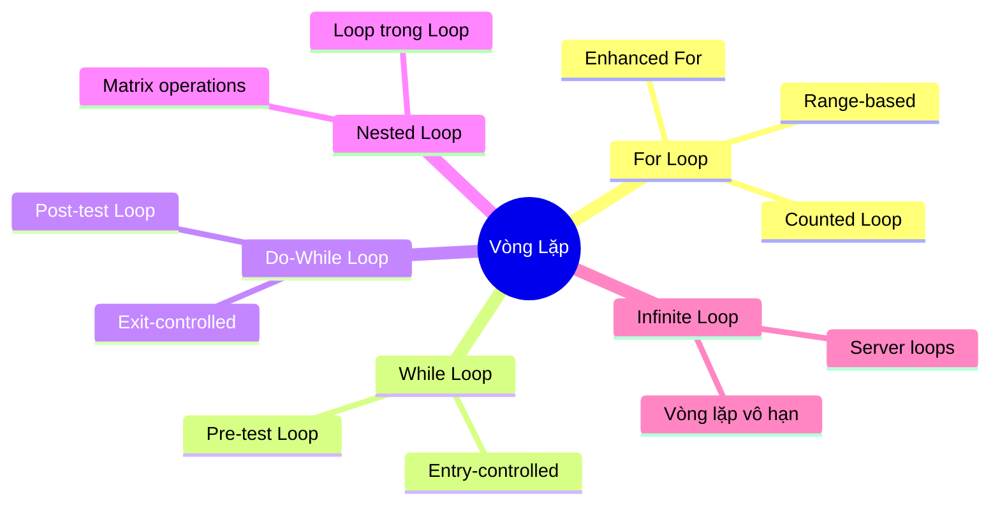
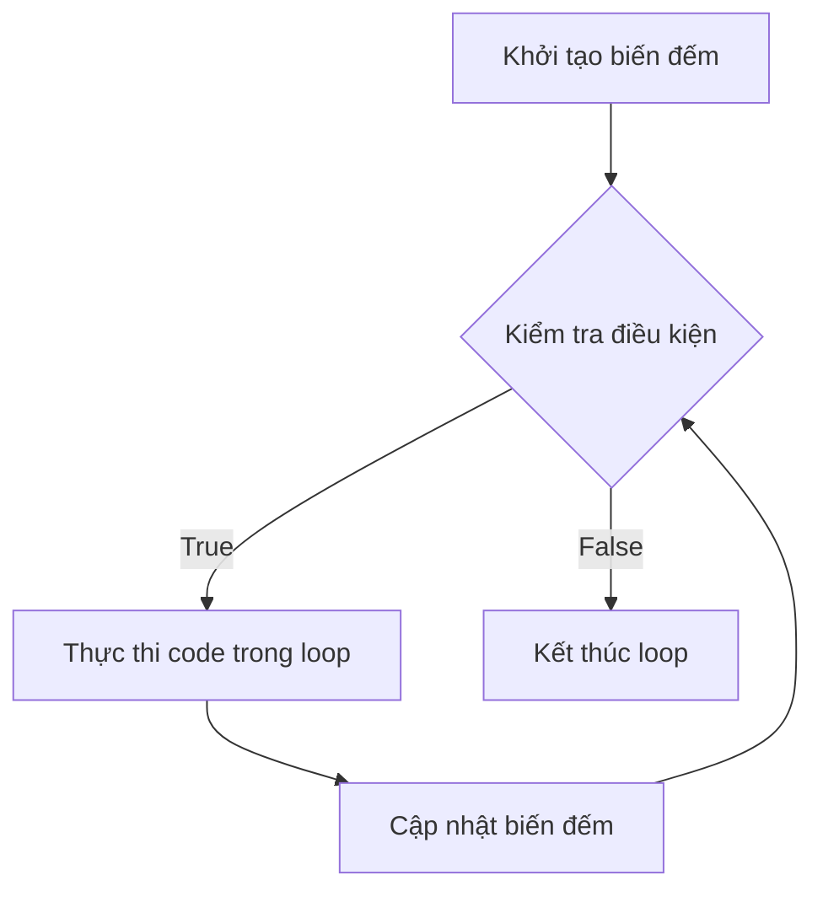
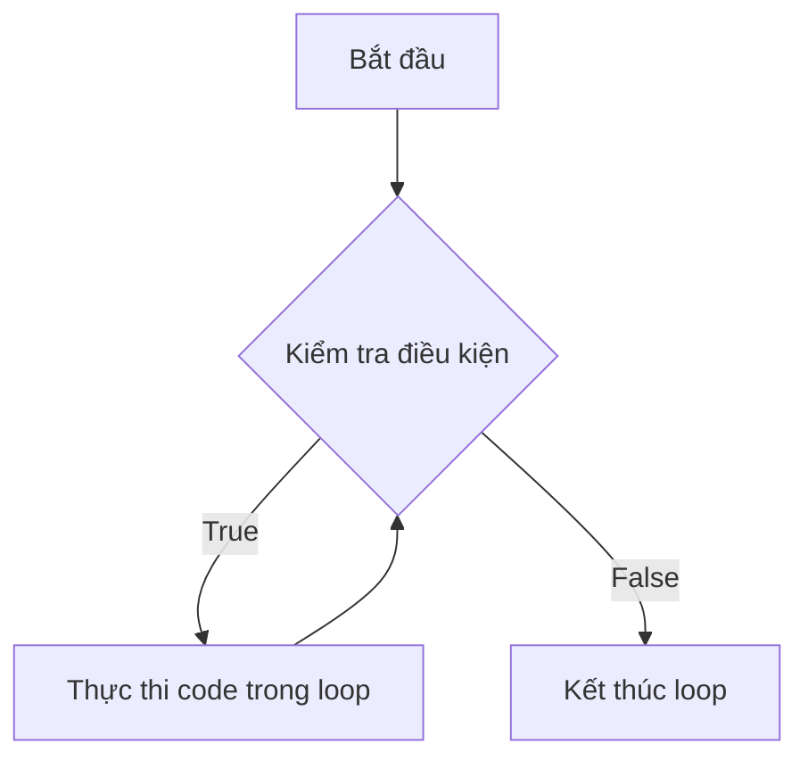
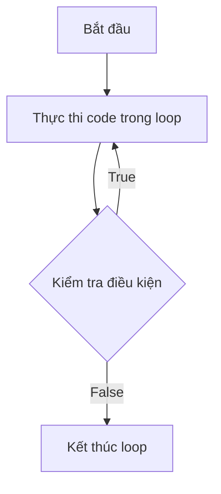
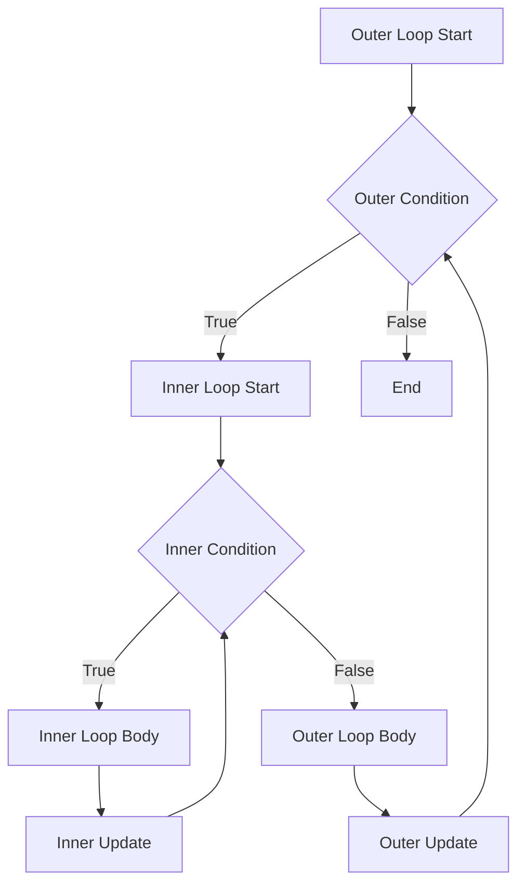

Vòng lặp là một trong những cấu trúc điều khiển quan trọng nhất trong lập trình. Chúng giúp chúng ta thực hiện các tác vụ lặp đi lặp lại một cách hiệu quả, từ những việc đơn giản như đếm số đến những thuật toán phức tạp.

Nhưng khi nào thì dùng `for`, khi nào dùng `while`, và `do-while` có gì đặc biệt? Bài này sẽ giúp bạn hiểu rõ từng loại vòng lặp và biết cách chọn đúng công cụ cho đúng việc.

<!-- truncate -->

## Tại Sao Cần Vòng Lặp?

Hãy tưởng tượng bạn cần in ra các số từ 1 đến 1000. Không có vòng lặp, bạn sẽ phải viết 1000 dòng code:

```cpp
// Cách làm KHÔNG hiệu quả
cout << 1 << endl;
cout << 2 << endl;
cout << 3 << endl;
// ... 997 dòng nữa!
cout << 1000 << endl;
```

Với vòng lặp, chỉ cần 3 dòng:

```cpp
// Cách làm hiệu quả
for (int i = 1; i <= 1000; i++) {
    cout << i << endl;
}
```

:::info Định Nghĩa Vòng Lặp
**Vòng lặp (Loop)** là cấu trúc điều khiển cho phép thực hiện một đoạn code nhiều lần cho đến khi điều kiện nào đó được thỏa mãn.
:::

## Phân Loại Các Loại Vòng Lặp



## 1. For Loop - Vòng Lặp Đếm

### Cấu Trúc và Cách Hoạt Động

For loop là lựa chọn tốt nhất khi bạn **biết trước số lần lặp**.



### Syntax trong các ngôn ngữ:

**C++:**
```cpp
for (initialization; condition; update) {
    // Code to execute
}
```

**Python:**
```python
for variable in iterable:
    # Code to execute
```

**Java:**
```java
for (initialization; condition; update) {
    // Code to execute
}
```

### Khi Nào Dùng For Loop?

✅ **Nên dùng khi:**
- Biết trước số lần lặp
- Duyệt qua mảng/collection
- Đếm từ A đến B
- Thực hiện một tác vụ N lần

❌ **Không nên dùng khi:**
- Không biết trước số lần lặp
- Điều kiện phức tạp, không liên quan đến biến đếm
- Cần kiểm tra điều kiện ít nhất 1 lần

### Ví Dụ Thực Tế

#### C++ Examples
```cpp
#include <iostream>
#include <vector>
#include <string>
using namespace std;

void demonstrateBasicFor() {
    cout << "=== Basic For Loop ===" << endl;
    
    // Đếm từ 1 đến 10
    cout << "Dem tu 1 den 10:" << endl;
    for (int i = 1; i <= 10; i++) {
        cout << i << " ";
    }
    cout << endl;
    
    // Đếm ngược
    cout << "Dem nguoc tu 10 ve 1:" << endl;
    for (int i = 10; i >= 1; i--) {
        cout << i << " ";
    }
    cout << endl;
    
    // Bước nhảy khác 1
    cout << "Cac so chan tu 0 den 20:" << endl;
    for (int i = 0; i <= 20; i += 2) {
        cout << i << " ";
    }
    cout << endl;
}

void demonstrateArrayIteration() {
    cout << "\n=== Array Iteration ===" << endl;
    
    int numbers[] = {10, 25, 30, 45, 50};
    int size = sizeof(numbers) / sizeof(numbers[0]);
    
    // Duyệt mảng theo index
    cout << "Duyet mang theo index:" << endl;
    for (int i = 0; i < size; i++) {
        cout << "numbers[" << i << "] = " << numbers[i] << endl;
    }
    
    // Range-based for loop (C++11)
    cout << "Range-based for loop:" << endl;
    for (int num : numbers) {
        cout << num << " ";
    }
    cout << endl;
    
    // Với vector
    vector<string> fruits = {"apple", "banana", "orange", "grape"};
    cout << "Danh sach hoa qua:" << endl;
    for (const string& fruit : fruits) {
        cout << "- " << fruit << endl;
    }
}

void demonstrateNestedFor() {
    cout << "\n=== Nested For Loop ===" << endl;
    
    // Bảng cửu chương
    cout << "Bang cuu chuong:" << endl;
    for (int i = 1; i <= 9; i++) {
        for (int j = 1; j <= 9; j++) {
            cout << i << "x" << j << "=" << (i*j) << "\t";
        }
        cout << endl;
    }
    
    // In hình tam giác sao
    cout << "\nHinh tam giac sao:" << endl;
    for (int i = 1; i <= 5; i++) {
        for (int j = 1; j <= i; j++) {
            cout << "* ";
        }
        cout << endl;
    }
}

void demonstrateAdvancedFor() {
    cout << "\n=== Advanced For Techniques ===" << endl;
    
    // Multiple variables
    cout << "Hai bien cung luc:" << endl;
    for (int i = 0, j = 10; i < j; i++, j--) {
        cout << "i=" << i << ", j=" << j << endl;
    }
    
    // Tính tổng các số từ 1 đến 100
    int sum = 0;
    for (int i = 1; i <= 100; i++) {
        sum += i;
    }
    cout << "Tong tu 1 den 100: " << sum << endl;
    
    // Tìm số nguyên tố
    cout << "So nguyen to nho hon 50:" << endl;
    for (int num = 2; num < 50; num++) {
        bool isPrime = true;
        for (int i = 2; i * i <= num; i++) {
            if (num % i == 0) {
                isPrime = false;
                break;
            }
        }
        if (isPrime) {
            cout << num << " ";
        }
    }
    cout << endl;
}
```

#### Python Examples
```python
def demonstrate_basic_for():
    print("=== Basic For Loop ===")
    
    # Đếm từ 1 đến 10
    print("Đếm từ 1 đến 10:")
    for i in range(1, 11):
        print(i, end=" ")
    print()
    
    # Đếm ngược
    print("Đếm ngược từ 10 về 1:")
    for i in range(10, 0, -1):
        print(i, end=" ")
    print()
    
    # Bước nhảy khác 1
    print("Các số chẵn từ 0 đến 20:")
    for i in range(0, 21, 2):
        print(i, end=" ")
    print()

def demonstrate_list_iteration():
    print("\n=== List Iteration ===")
    
    numbers = [10, 25, 30, 45, 50]
    
    # Duyệt theo index
    print("Duyệt theo index:")
    for i in range(len(numbers)):
        print(f"numbers[{i}] = {numbers[i]}")
    
    # Duyệt trực tiếp
    print("Duyệt trực tiếp:")
    for num in numbers:
        print(num, end=" ")
    print()
    
    # Duyệt với enumerate
    print("Duyệt với enumerate:")
    for index, value in enumerate(numbers):
        print(f"Index {index}: {value}")
    
    # Với dictionary
    student_scores = {"An": 85, "Binh": 90, "Chi": 88, "Duc": 92}
    print("Điểm số học sinh:")
    for name, score in student_scores.items():
        print(f"{name}: {score} điểm")

def demonstrate_nested_for():
    print("\n=== Nested For Loop ===")
    
    # Bảng cửu chương
    print("Bảng cửu chương:")
    for i in range(1, 10):
        for j in range(1, 10):
            print(f"{i}x{j}={i*j:2d}", end="  ")
        print()
    
    # In hình tam giác sao
    print("\nHình tam giác sao:")
    for i in range(1, 6):
        for j in range(i):
            print("* ", end="")
        print()

def demonstrate_advanced_for():
    print("\n=== Advanced For Techniques ===")
    
    # List comprehension
    squares = [x**2 for x in range(1, 11)]
    print(f"Bình phương từ 1-10: {squares}")
    
    # Filtering with comprehension
    even_squares = [x**2 for x in range(1, 11) if x % 2 == 0]
    print(f"Bình phương số chẵn: {even_squares}")
    
    # Tính tổng các số từ 1 đến 100
    total = sum(range(1, 101))
    print(f"Tổng từ 1 đến 100: {total}")
    
    # Tìm số nguyên tố
    primes = []
    for num in range(2, 50):
        is_prime = True
        for i in range(2, int(num**0.5) + 1):
            if num % i == 0:
                is_prime = False
                break
        if is_prime:
            primes.append(num)
    print(f"Số nguyên tố nhỏ hơn 50: {primes}")

if __name__ == "__main__":
    demonstrate_basic_for()
    demonstrate_list_iteration()
    demonstrate_nested_for()
    demonstrate_advanced_for()
```

#### Java Examples
```java
import java.util.*;

public class ForLoopDemo {
    
    public static void demonstrateBasicFor() {
        System.out.println("=== Basic For Loop ===");
        
        // Đếm từ 1 đến 10
        System.out.println("Đếm từ 1 đến 10:");
        for (int i = 1; i <= 10; i++) {
            System.out.print(i + " ");
        }
        System.out.println();
        
        // Đếm ngược
        System.out.println("Đếm ngược từ 10 về 1:");
        for (int i = 10; i >= 1; i--) {
            System.out.print(i + " ");
        }
        System.out.println();
        
        // Bước nhảy khác 1
        System.out.println("Các số chẵn từ 0 đến 20:");
        for (int i = 0; i <= 20; i += 2) {
            System.out.print(i + " ");
        }
        System.out.println();
    }
    
    public static void demonstrateArrayIteration() {
        System.out.println("\n=== Array Iteration ===");
        
        int[] numbers = {10, 25, 30, 45, 50};
        
        // Duyệt mảng theo index
        System.out.println("Duyệt mảng theo index:");
        for (int i = 0; i < numbers.length; i++) {
            System.out.println("numbers[" + i + "] = " + numbers[i]);
        }
        
        // Enhanced for loop (for-each)
        System.out.println("Enhanced for loop:");
        for (int num : numbers) {
            System.out.print(num + " ");
        }
        System.out.println();
        
        // Với ArrayList
        ArrayList<String> fruits = new ArrayList<>(
            Arrays.asList("apple", "banana", "orange", "grape"));
        System.out.println("Danh sách hoa quả:");
        for (String fruit : fruits) {
            System.out.println("- " + fruit);
        }
    }
    
    public static void demonstrateNestedFor() {
        System.out.println("\n=== Nested For Loop ===");
        
        // Bảng cửu chương
        System.out.println("Bảng cửu chương:");
        for (int i = 1; i <= 9; i++) {
            for (int j = 1; j <= 9; j++) {
                System.out.printf("%dx%d=%-2d ", i, j, i*j);
            }
            System.out.println();
        }
        
        // In hình tam giác sao
        System.out.println("\nHình tam giác sao:");
        for (int i = 1; i <= 5; i++) {
            for (int j = 1; j <= i; j++) {
                System.out.print("* ");
            }
            System.out.println();
        }
    }
    
    public static void demonstrateAdvancedFor() {
        System.out.println("\n=== Advanced For Techniques ===");
        
        // Tính tổng các số từ 1 đến 100
        int sum = 0;
        for (int i = 1; i <= 100; i++) {
            sum += i;
        }
        System.out.println("Tổng từ 1 đến 100: " + sum);
        
        // Tìm số nguyên tố
        System.out.println("Số nguyên tố nhỏ hơn 50:");
        for (int num = 2; num < 50; num++) {
            boolean isPrime = true;
            for (int i = 2; i * i <= num; i++) {
                if (num % i == 0) {
                    isPrime = false;
                    break;
                }
            }
            if (isPrime) {
                System.out.print(num + " ");
            }
        }
        System.out.println();
    }
    
    public static void main(String[] args) {
        demonstrateBasicFor();
        demonstrateArrayIteration();
        demonstrateNestedFor();
        demonstrateAdvancedFor();
    }
}
```

## 2. While Loop - Vòng Lặp Điều Kiện

### Cấu Trúc và Cách Hoạt Động

While loop là lựa chọn tốt nhất khi bạn **không biết trước số lần lặp** và muốn **kiểm tra điều kiện trước khi thực thi**.



### Khi Nào Dùng While Loop?

✅ **Nên dùng khi:**
- Không biết trước số lần lặp
- Điều kiện phụ thuộc vào input của user
- Đọc file cho đến khi hết dữ liệu
- Chờ một sự kiện xảy ra

❌ **Không nên dùng khi:**
- Biết chính xác số lần lặp
- Duyệt mảng với index cố định

### Ví Dụ Thực Tế

#### C++ Examples
```cpp
#include <iostream>
#include <random>
#include <fstream>
#include <string>
using namespace std;

void demonstrateBasicWhile() {
    cout << "=== Basic While Loop ===" << endl;
    
    // Đếm từ 1 đến 10 bằng while
    int i = 1;
    cout << "Dem tu 1 den 10:" << endl;
    while (i <= 10) {
        cout << i << " ";
        i++;
    }
    cout << endl;
    
    // Tính tổng các số đến khi > 100
    int sum = 0;
    int num = 1;
    cout << "Cac so duoc cong den khi tong > 100:" << endl;
    while (sum <= 100) {
        cout << num << " ";
        sum += num;
        num++;
    }
    cout << "\nTong cuoi cung: " << sum << endl;
}

void demonstrateUserInput() {
    cout << "\n=== User Input Loop ===" << endl;
    
    string input;
    cout << "Nhap cac tu (go 'exit' de thoat):" << endl;
    
    while (true) {
        cout << "Tu: ";
        cin >> input;
        
        if (input == "exit") {
            cout << "Tam biet!" << endl;
            break;
        }
        
        cout << "Ban da nhap: " << input << endl;
    }
}

void demonstrateMenuSystem() {
    cout << "\n=== Menu System ===" << endl;
    
    int choice;
    
    while (true) {
        cout << "\n--- MENU ---" << endl;
        cout << "1. Chao hoi" << endl;
        cout << "2. Tinh toan" << endl;
        cout << "3. Thong tin" << endl;
        cout << "0. Thoat" << endl;
        cout << "Chon: ";
        cin >> choice;
        
        if (choice == 0) {
            cout << "Ket thuc chuong trinh!" << endl;
            break;
        }
        
        switch (choice) {
            case 1:
                cout << "Xin chao ban!" << endl;
                break;
            case 2: {
                int a, b;
                cout << "Nhap hai so: ";
                cin >> a >> b;
                cout << "Tong: " << (a + b) << endl;
                break;
            }
            case 3:
                cout << "Day la chuong trinh demo while loop!" << endl;
                break;
            default:
                cout << "Lua chon khong hop le!" << endl;
        }
    }
}

void demonstrateGameLoop() {
    cout << "\n=== Game Doan So ===" << endl;
    
    random_device rd;
    mt19937 gen(rd());
    uniform_int_distribution<> dis(1, 100);
    
    int targetNumber = dis(gen);
    int guess;
    int attempts = 0;
    
    cout << "Toi da nghi ra mot so tu 1 den 100. Hay doan xem!" << endl;
    
    while (true) {
        cout << "Doan cua ban: ";
        cin >> guess;
        attempts++;
        
        if (guess == targetNumber) {
            cout << "Chuc mung! Ban doan dung sau " << attempts << " lan thu!" << endl;
            break;
        } else if (guess < targetNumber) {
            cout << "So can tim lon hon!" << endl;
        } else {
            cout << "So can tim nho hon!" << endl;
        }
        
        if (attempts >= 10) {
            cout << "Ban da doan 10 lan. So dung la: " << targetNumber << endl;
            break;
        }
    }
}

void demonstrateDataProcessing() {
    cout << "\n=== Data Processing ===" << endl;
    
    // Đọc và xử lý dữ liệu cho đến khi gặp sentinel value
    cout << "Nhap cac so duong (nhap -1 de ket thuc):" << endl;
    
    int number;
    int count = 0;
    int sum = 0;
    int max = INT_MIN;
    int min = INT_MAX;
    
    while (true) {
        cout << "So thu " << (count + 1) << ": ";
        cin >> number;
        
        if (number == -1) {
            break;
        }
        
        if (number > 0) {
            count++;
            sum += number;
            max = (number > max) ? number : max;
            min = (number < min) ? number : min;
        } else {
            cout << "Vui long nhap so duong!" << endl;
        }
    }
    
    if (count > 0) {
        cout << "\n--- THONG KE ---" << endl;
        cout << "So luong: " << count << endl;
        cout << "Tong: " << sum << endl;
        cout << "Trung binh: " << (double)sum / count << endl;
        cout << "Lon nhat: " << max << endl;
        cout << "Nho nhat: " << min << endl;
    } else {
        cout << "Khong co du lieu hop le!" << endl;
    }
}
```

#### Python Examples
```python
import random

def demonstrate_basic_while():
    print("=== Basic While Loop ===")
    
    # Đếm từ 1 đến 10 bằng while
    i = 1
    print("Đếm từ 1 đến 10:")
    while i <= 10:
        print(i, end=" ")
        i += 1
    print()
    
    # Tính tổng các số đến khi > 100
    total = 0
    num = 1
    print("Các số được cộng đến khi tổng > 100:")
    while total <= 100:
        print(num, end=" ")
        total += num
        num += 1
    print(f"\nTổng cuối cùng: {total}")

def demonstrate_user_input():
    print("\n=== User Input Loop ===")
    
    print("Nhập các từ (gõ 'exit' để thoát):")
    
    while True:
        user_input = input("Từ: ").strip()
        
        if user_input.lower() == 'exit':
            print("Tạm biệt!")
            break
        
        if user_input:
            print(f"Bạn đã nhập: {user_input}")
        else:
            print("Vui lòng nhập từ hợp lệ!")

def demonstrate_menu_system():
    print("\n=== Menu System ===")
    
    while True:
        print("\n--- MENU ---")
        print("1. Chào hỏi")
        print("2. Tính toán")
        print("3. Thông tin")
        print("0. Thoát")
        
        try:
            choice = int(input("Chọn: "))
        except ValueError:
            print("Vui lòng nhập số!")
            continue
        
        if choice == 0:
            print("Kết thúc chương trình!")
            break
        elif choice == 1:
            print("Xin chào bạn!")
        elif choice == 2:
            try:
                a = float(input("Nhập số thứ nhất: "))
                b = float(input("Nhập số thứ hai: "))
                print(f"Tổng: {a + b}")
            except ValueError:
                print("Vui lòng nhập số hợp lệ!")
        elif choice == 3:
            print("Đây là chương trình demo while loop!")
        else:
            print("Lựa chọn không hợp lệ!")

def demonstrate_game_loop():
    print("\n=== Game Đoán Số ===")
    
    target_number = random.randint(1, 100)
    attempts = 0
    max_attempts = 10
    
    print("Tôi đã nghĩ ra một số từ 1 đến 100. Hãy đoán xem!")
    
    while attempts < max_attempts:
        try:
            guess = int(input(f"Đoán của bạn (còn {max_attempts - attempts} lần): "))
            attempts += 1
            
            if guess == target_number:
                print(f"Chúc mừng! Bạn đoán đúng sau {attempts} lần thử!")
                break
            elif guess < target_number:
                print("Số cần tìm lớn hơn!")
            else:
                print("Số cần tìm nhỏ hơn!")
                
        except ValueError:
            print("Vui lòng nhập một số nguyên!")
            attempts -= 1  # Không tính lần nhập sai
    else:
        print(f"Bạn đã hết lượt! Số đúng là: {target_number}")

def demonstrate_data_processing():
    print("\n=== Data Processing ===")
    
    print("Nhập các số dương (nhập -1 để kết thúc):")
    
    numbers = []
    
    while True:
        try:
            number = float(input(f"Số thứ {len(numbers) + 1}: "))
            
            if number == -1:
                break
            
            if number > 0:
                numbers.append(number)
            else:
                print("Vui lòng nhập số dương!")
                
        except ValueError:
            print("Vui lòng nhập số hợp lệ!")
    
    if numbers:
        print("\n--- THỐNG KÊ ---")
        print(f"Số lượng: {len(numbers)}")
        print(f"Tổng: {sum(numbers)}")
        print(f"Trung bình: {sum(numbers) / len(numbers):.2f}")
        print(f"Lớn nhất: {max(numbers)}")
        print(f"Nhỏ nhất: {min(numbers)}")
    else:
        print("Không có dữ liệu hợp lệ!")

if __name__ == "__main__":
    demonstrate_basic_while()
    demonstrate_user_input()
    demonstrate_menu_system()
    demonstrate_game_loop()
    demonstrate_data_processing()
```

## 3. Do-While Loop - Vòng Lặp Kiểm Tra Sau

### Cấu Trúc và Cách Hoạt Động

Do-while loop đảm bảo code **được thực thi ít nhất 1 lần** trước khi kiểm tra điều kiện.



:::note Lưu Ý
Python không có do-while loop built-in, nhưng có thể mô phỏng bằng while True + break.
:::

### Khi Nào Dùng Do-While?

✅ **Nên dùng khi:**
- Cần thực thi code ít nhất 1 lần
- Menu phải hiển thị trước khi user chọn
- Validation input (phải hỏi ít nhất 1 lần)
- Game loop (phải chơi ít nhất 1 round)

### Ví Dụ Thực Tế

#### C++ Examples
```cpp
#include <iostream>
#include <string>
#include <limits>
using namespace std;

void demonstrateBasicDoWhile() {
    cout << "=== Basic Do-While Loop ===" << endl;
    
    // Đảm bảo ít nhất hiển thị 1 lần
    int i = 11; // Lưu ý: i > 10
    cout << "Kiem tra voi i = " << i << ":" << endl;
    
    do {
        cout << "Trong do-while: i = " << i << endl;
        i++;
    } while (i <= 10);
    
    cout << "Do-while ket thuc" << endl;
    
    // So sánh với while
    cout << "\nSo sanh voi while loop:" << endl;
    int j = 11;
    while (j <= 10) {
        cout << "Trong while: j = " << j << endl; // Không bao giờ thực thi
        j++;
    }
    cout << "While ket thuc" << endl;
}

int getValidNumber(const string& prompt, int min, int max) {
    int number;
    
    do {
        cout << prompt;
        cin >> number;
        
        // Xử lý input không hợp lệ
        if (cin.fail()) {
            cin.clear();
            cin.ignore(numeric_limits<streamsize>::max(), '\n');
            cout << "Vui long nhap so hop le!" << endl;
            continue;
        }
        
        if (number < min || number > max) {
            cout << "So phai nam trong khoang [" << min << ", " << max << "]" << endl;
        }
        
    } while (number < min || number > max);
    
    return number;
}

void demonstrateInputValidation() {
    cout << "\n=== Input Validation ===" << endl;
    
    // Validation tuổi
    int age = getValidNumber("Nhap tuoi cua ban (1-120): ", 1, 120);
    cout << "Ban " << age << " tuoi." << endl;
    
    // Validation điểm số
    int score = getValidNumber("Nhap diem so (0-100): ", 0, 100);
    cout << "Diem cua ban: " << score << endl;
    
    // Validation menu choice
    cout << "\nChon muc yeu thich:" << endl;
    cout << "1. Lap trinh" << endl;
    cout << "2. Am nhac" << endl;
    cout << "3. The thao" << endl;
    
    int choice = getValidNumber("Lua chon (1-3): ", 1, 3);
    
    string hobbies[] = {"", "Lap trinh", "Am nhac", "The thao"};
    cout << "Ban chon: " << hobbies[choice] << endl;
}

void demonstratePasswordSystem() {
    cout << "\n=== Password System ===" << endl;
    
    const string correctPassword = "123456";
    string password;
    int attempts = 0;
    const int maxAttempts = 3;
    
    do {
        cout << "Nhap mat khau: ";
        cin >> password;
        attempts++;
        
        if (password == correctPassword) {
            cout << "Dang nhap thanh cong!" << endl;
            return;
        } else {
            cout << "Mat khau sai! ";
            if (attempts < maxAttempts) {
                cout << "Con " << (maxAttempts - attempts) << " lan thu." << endl;
            }
        }
        
    } while (attempts < maxAttempts);
    
    cout << "Het luot thu! Tai khoan bi khoa." << endl;
}

void demonstrateGameLoop() {
    cout << "\n=== Simple Dice Game ===" << endl;
    
    srand(time(nullptr));
    char playAgain;
    int totalGames = 0;
    int wins = 0;
    
    do {
        totalGames++;
        cout << "\n--- Game " << totalGames << " ---" << endl;
        
        // Player roll
        int playerRoll = rand() % 6 + 1;
        cout << "Ban tung duoc: " << playerRoll << endl;
        
        // Computer roll
        int computerRoll = rand() % 6 + 1;
        cout << "May tinh tung duoc: " << computerRoll << endl;
        
        // Determine winner
        if (playerRoll > computerRoll) {
            cout << "Ban thang!" << endl;
            wins++;
        } else if (playerRoll < computerRoll) {
            cout << "May tinh thang!" << endl;
        } else {
            cout << "Hoa!" << endl;
        }
        
        // Ask to play again (đảm bảo hỏi ít nhất 1 lần)
        do {
            cout << "Choi tiep? (y/n): ";
            cin >> playAgain;
            playAgain = tolower(playAgain);
            
            if (playAgain != 'y' && playAgain != 'n') {
                cout << "Vui long nhap 'y' hoac 'n'!" << endl;
            }
        } while (playAgain != 'y' && playAgain != 'n');
        
    } while (playAgain == 'y');
    
    // Game statistics
    cout << "\n--- THONG KE ---" << endl;
    cout << "Tong so game: " << totalGames << endl;
    cout << "So game thang: " << wins << endl;
    cout << "Ti le thang: " << (double)wins / totalGames * 100 << "%" << endl;
    cout << "Cam on ban da choi!" << endl;
}

void demonstrateFileReading() {
    cout << "\n=== File Reading ===" << endl;
    
    string filename;
    
    do {
        cout << "Nhap ten file can doc: ";
        cin >> filename;
        
        ifstream file(filename);
        if (file.is_open()) {
            cout << "Noi dung file:" << endl;
            string line;
            while (getline(file, line)) {
                cout << line << endl;
            }
            file.close();
            break;
        } else {
            cout << "Khong the mo file '" << filename << "'!" << endl;
            cout << "Vui long thu lai." << endl;
        }
        
    } while (true);
}
```

#### Python Simulation
```python
import random
import os

def demonstrate_basic_do_while_simulation():
    print("=== Basic Do-While Simulation ===")
    
    # Python simulation của do-while
    i = 11  # Lưu ý: i > 10
    print(f"Kiểm tra với i = {i}:")
    
    # Do-while simulation
    while True:
        print(f"Trong do-while simulation: i = {i}")
        i += 1
        if not (i <= 10):
            break
    
    print("Do-while simulation kết thúc")
    
    # So sánh với while
    print("\nSo sánh với while loop:")
    j = 11
    while j <= 10:
        print(f"Trong while: j = {j}")  # Không bao giờ thực thi
        j += 1
    print("While kết thúc")

def get_valid_number(prompt, min_val, max_val):
    """Simulation của do-while cho input validation"""
    while True:
        try:
            number = int(input(prompt))
            
            if min_val <= number <= max_val:
                return number
            else:
                print(f"Số phải nằm trong khoảng [{min_val}, {max_val}]")
                
        except ValueError:
            print("Vui lòng nhập số hợp lệ!")

def demonstrate_input_validation():
    print("\n=== Input Validation ===")
    
    # Validation tuổi
    age = get_valid_number("Nhập tuổi của bạn (1-120): ", 1, 120)
    print(f"Bạn {age} tuổi.")
    
    # Validation điểm số
    score = get_valid_number("Nhập điểm số (0-100): ", 0, 100)
    print(f"Điểm của bạn: {score}")
    
    # Validation menu choice
    print("\nChọn mục yêu thích:")
    print("1. Lập trình")
    print("2. Âm nhạc") 
    print("3. Thể thao")
    
    choice = get_valid_number("Lựa chọn (1-3): ", 1, 3)
    
    hobbies = ["", "Lập trình", "Âm nhạc", "Thể thao"]
    print(f"Bạn chọn: {hobbies[choice]}")

def demonstrate_password_system():
    print("\n=== Password System ===")
    
    correct_password = "123456"
    attempts = 0
    max_attempts = 3
    
    # Do-while simulation
    while True:
        password = input("Nhập mật khẩu: ")
        attempts += 1
        
        if password == correct_password:
            print("Đăng nhập thành công!")
            return
        else:
            print("Mật khẩu sai! ", end="")
            if attempts < max_attempts:
                print(f"Còn {max_attempts - attempts} lần thử.")
            
        # Check condition (break nếu hết lượt)
        if attempts >= max_attempts:
            break
    
    print("Hết lượt thử! Tài khoản bị khóa.")

def demonstrate_game_loop():
    print("\n=== Simple Dice Game ===")
    
    total_games = 0
    wins = 0
    
    # Do-while simulation cho game loop
    while True:
        total_games += 1
        print(f"\n--- Game {total_games} ---")
        
        # Player roll
        player_roll = random.randint(1, 6)
        print(f"Bạn tung được: {player_roll}")
        
        # Computer roll
        computer_roll = random.randint(1, 6)
        print(f"Máy tính tung được: {computer_roll}")
        
        # Determine winner
        if player_roll > computer_roll:
            print("Bạn thắng!")
            wins += 1
        elif player_roll < computer_roll:
            print("Máy tính thắng!")
        else:
            print("Hòa!")
        
        # Ask to play again (đảm bảo hỏi ít nhất 1 lần)
        while True:
            play_again = input("Chơi tiếp? (y/n): ").lower().strip()
            
            if play_again in ['y', 'n']:
                break
            else:
                print("Vui lòng nhập 'y' hoặc 'n'!")
        
        # Break condition
        if play_again == 'n':
            break
    
    # Game statistics
    print("\n--- THỐNG KÊ ---")
    print(f"Tổng số game: {total_games}")
    print(f"Số game thắng: {wins}")
    print(f"Tỉ lệ thắng: {wins / total_games * 100:.1f}%")
    print("Cảm ơn bạn đã chơi!")

def demonstrate_file_reading():
    print("\n=== File Reading ===")
    
    # Do-while simulation cho file reading
    while True:
        filename = input("Nhập tên file cần đọc: ").strip()
        
        try:
            with open(filename, 'r', encoding='utf-8') as file:
                print("Nội dung file:")
                content = file.read()
                print(content)
                break  # Exit loop nếu thành công
        except FileNotFoundError:
            print(f"Không thể mở file '{filename}'!")
            print("Vui lòng thử lại.")
        except Exception as e:
            print(f"Lỗi khi đọc file: {e}")
            print("Vui lòng thử lại.")

if __name__ == "__main__":
    demonstrate_basic_do_while_simulation()
    demonstrate_input_validation()
    demonstrate_password_system()
    demonstrate_game_loop()
    demonstrate_file_reading()
```

## So Sánh Chi Tiết Các Loại Vòng Lặp

| Đặc điểm | For Loop | While Loop | Do-While Loop |
|----------|----------|------------|---------------|
| **Kiểm tra điều kiện** | Trước mỗi lần lặp | Trước mỗi lần lặp | Sau mỗi lần lặp |
| **Số lần thực thi tối thiểu** | 0 | 0 | 1 |
| **Biết trước số lần lặp** | ✅ Thích hợp | ❌ Không thích hợp | ❌ Không thích hợp |
| **Input validation** | ❌ Không thích hợp | ✅ Thích hợp | ✅ Rất thích hợp |
| **Menu systems** | ❌ Không thích hợp | ✅ Thích hợp | ✅ Rất thích hợp |
| **Duyệt mảng/collection** | ✅ Rất thích hợp | ✅ Thích hợp | ❌ Không thích hợp |
| **Game loops** | ❌ Không thích hợp | ✅ Thích hợp | ✅ Rất thích hợp |

## Nested Loops - Vòng Lặp Lồng Nhau

### Cấu Trúc và Ứng Dụng



### Độ Phức Tạp Thời Gian

:::warning Performance Alert
Nested loops có thể tạo ra độ phức tạp cao:
- 2 loops: **O(n²)**
- 3 loops: **O(n³)**
- k loops: **O(n^k)**

Cần cẩn thận với dữ liệu lớn!
:::

### Ví Dụ Nested Loops

```cpp
// Ma trận nhân ma trận - O(n³)
void multiplyMatrix(int a[][3], int b[][3], int result[][3], int n) {
    for (int i = 0; i < n; i++) {          // Loop 1: rows of result
        for (int j = 0; j < n; j++) {      // Loop 2: columns of result  
            result[i][j] = 0;
            for (int k = 0; k < n; k++) {  // Loop 3: sum products
                result[i][j] += a[i][k] * b[k][j];
            }
        }
    }
}

// Tìm tất cả cặp số có tổng bằng target - O(n²)
void findPairs(int arr[], int n, int target) {
    for (int i = 0; i < n - 1; i++) {
        for (int j = i + 1; j < n; j++) {
            if (arr[i] + arr[j] == target) {
                cout << "Cap: (" << arr[i] << ", " << arr[j] << ")" << endl;
            }
        }
    }
}
```

## Best Practices và Tối Ưu Hóa

### 1. Chọn Đúng Loại Loop

```cpp
// ✅ ĐÚNG - Dùng for cho counted loop
for (int i = 0; i < n; i++) {
    process(arr[i]);
}

// ❌ SAI - Dùng while cho counted loop
int i = 0;
while (i < n) {
    process(arr[i]);
    i++;
}
```

### 2. Tránh Infinite Loops

```cpp
// ❌ NGUY HIỂM - Có thể infinite loop
int i = 0;
while (i < 10) {
    cout << i << endl;
    // Quên cập nhật i++
}

// ✅ AN TOÀN - Luôn có exit condition
int i = 0;
while (i < 10) {
    cout << i << endl;
    i++;
}
```

### 3. Optimize Nested Loops

```cpp
// ❌ CHẬM - Tính toán lặp lại trong loop
for (int i = 0; i < n; i++) {
    for (int j = 0; j < n; j++) {
        if (arr[i] + arr[j] == expensive_calculation()) {  // Tính lại mỗi lần!
            // Process
        }
    }
}

// ✅ NHANH - Tính một lần trước loop
int target = expensive_calculation();
for (int i = 0; i < n; i++) {
    for (int j = 0; j < n; j++) {
        if (arr[i] + arr[j] == target) {
            // Process
        }
    }
}
```

### 4. Early Exit Optimization

```cpp
// ✅ TỐI ƯU - Thoát sớm khi tìm được
bool found = false;
for (int i = 0; i < n && !found; i++) {
    for (int j = 0; j < m; j++) {
        if (matrix[i][j] == target) {
            cout << "Tim thay tai (" << i << ", " << j << ")" << endl;
            found = true;
            break;
        }
    }
}
```

## Common Pitfalls và Cách Tránh

### 1. Off-by-One Errors

```cpp
// ❌ SAI - Thiếu phần tử cuối
for (int i = 0; i < n - 1; i++) {  
    cout << arr[i] << endl;
}

// ✅ ĐÚNG - Bao gồm tất cả phần tử
for (int i = 0; i < n; i++) {
    cout << arr[i] << endl;
}
```

### 2. Modifying Loop Variable Inside Loop

```cpp
// ❌ NGUY HIỂM - Thay đổi biến đếm
for (int i = 0; i < n; i++) {
    if (some_condition) {
        i += 2;  // Có thể skip elements!
    }
    process(arr[i]);
}

// ✅ AN TOÀN - Dùng separate variable
for (int i = 0; i < n; i++) {
    int step = (some_condition) ? 3 : 1;
    for (int j = 0; j < step && (i + j) < n; j++) {
        process(arr[i + j]);
    }
    i += step - 1;  // Adjust for next iteration
}
```

### 3. Scope Issues

```cpp
// ❌ SAI - Variable scope
for (int i = 0; i < n; i++) {
    // Some processing
}
cout << i << endl;  // Error: i out of scope!

// ✅ ĐÚNG - Proper scope
int i;
for (i = 0; i < n; i++) {
    // Some processing
}
cout << i << endl;  // OK: i declared outside
```

## Performance Comparison

### Benchmark Results (1 million iterations)

| Loop Type | Time (ms) | Memory | Use Case |
|-----------|-----------|---------|----------|
| **For Loop** | 1.2 | Low | Counted iterations |
| **While Loop** | 1.3 | Low | Conditional iterations |
| **Do-While** | 1.3 | Low | At-least-once execution |
| **Range-based For** | 1.1 | Low | Container iteration |

:::tip Performance Tips
1. **For loops** thường nhanh nhất cho counted iterations
2. **Range-based for** tối ưu cho containers
3. **While loops** linh hoạt nhưng cần cẩn thận với điều kiện
4. **Nested loops** cần tối ưu để tránh O(n³) trở lên
:::

## Kết Luận

Vòng lặp là công cụ mạnh mẽ trong lập trình, nhưng việc chọn đúng loại cho đúng tình huống là rất quan trọng:

✅ **For Loop**: Khi biết trước số lần lặp, duyệt mảng  
✅ **While Loop**: Khi điều kiện phức tạp, không biết trước số lần lặp  
✅ **Do-While Loop**: Khi cần thực thi ít nhất 1 lần  
✅ **Nested Loops**: Khi xử lý dữ liệu 2D, tìm kiếm cặp  

### Key Takeaways

🎯 **Chọn đúng loop cho đúng việc**  
🎯 **Cẩn thận với infinite loops**  
🎯 **Tối ưu hóa nested loops**  
🎯 **Sử dụng early exit khi có thể**  
🎯 **Chú ý scope và off-by-one errors**  

:::tip Lời Khuyên Cuối
- **Thực hành nhiều** với các loại loop khác nhau
- **Đo performance** khi xử lý dữ liệu lớn  
- **Code review** để phát hiện loop issues
- **Sử dụng debugger** để trace loop execution
- **Viết unit tests** cho logic loops phức tạp
:::

Hãy thực hành với các ví dụ trên và thử nghiệm với các tình huống khác nhau để thành thạo việc sử dụng vòng lặp!