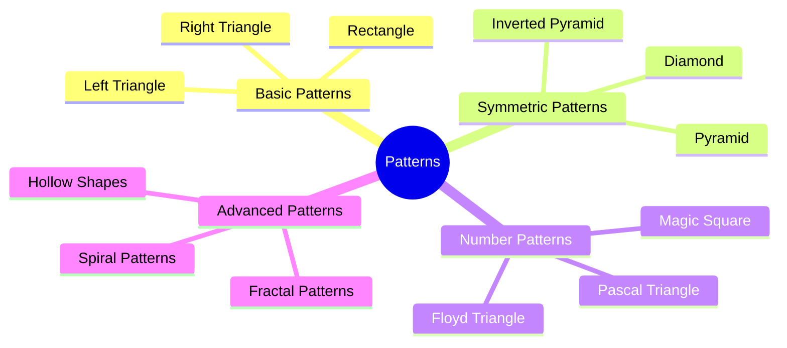
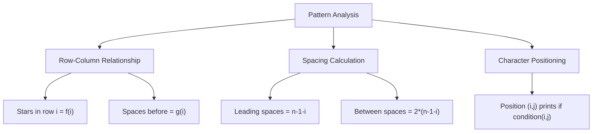

Bạn có bao giờ thắc mắc làm thế nào để tạo ra những hình tam giác, kim cương hay các pattern phức tạp chỉ bằng các ký tự? Đây là một trong những bài tập kinh điển giúp bạn hiểu sâu về vòng lặp lồng nhau và tư duy logic.

Từ những hình đơn giản như tam giác vuông đến những pattern phức tạp như kim cương, mỗi hình đều ẩn chứa một logic toán học thú vị. Hãy cùng khám phá nghệ thuật ASCII art trong lập trình!

<!-- truncate -->

## Tại Sao Cần Học Pattern Printing?

Pattern printing không chỉ là bài tập vui mà còn giúp bạn:

🧠 **Phát triển tư duy logic**: Phân tích mối quan hệ giữa hàng, cột  
🔄 **Thành thạo nested loops**: Hiểu cách hoạt động của vòng lặp lồng nhau  
📐 **Hiểu về tọa độ và không gian**: Tư duy về hệ tọa độ 2D  
🎨 **Sáng tạo và thẩm mỹ**: Tạo ra những hình đẹp mắt  
💻 **Chuẩn bị cho graphics**: Nền tảng cho lập trình đồ họa

:::info Nguyên Lý Cơ Bản
Mọi pattern đều dựa trên mối quan hệ giữa:
- **Hàng (row)**: Vòng lặp ngoài
- **Cột (column)**: Vòng lặp trong  
- **Ký tự**: Gì sẽ được in tại vị trí (row, col)
:::

## Phân Loại Các Loại Pattern



## 1. Basic Patterns - Hình Cơ Bản

### Rectangle (Hình Chữ Nhật)

Đây là pattern đơn giản nhất để bắt đầu:

```
*****
*****
*****
*****
```

**Logic**: In n ký tự * trên m hàng.

#### Implementation

**C++:**
```cpp
#include <iostream>
using namespace std;

void printRectangle(int rows, int cols) {
    cout << "=== RECTANGLE " << rows << "x" << cols << " ===" << endl;
    
    for (int i = 0; i < rows; i++) {        // Vòng lặp hàng
        for (int j = 0; j < cols; j++) {    // Vòng lặp cột
            cout << "* ";
        }
        cout << endl;                       // Xuống hàng
    }
}

void printHollowRectangle(int rows, int cols) {
    cout << "=== HOLLOW RECTANGLE " << rows << "x" << cols << " ===" << endl;
    
    for (int i = 0; i < rows; i++) {
        for (int j = 0; j < cols; j++) {
            // Viền: hàng đầu, hàng cuối, cột đầu, cột cuối
            if (i == 0 || i == rows-1 || j == 0 || j == cols-1) {
                cout << "* ";
            } else {
                cout << "  ";  // Khoảng trắng bên trong
            }
        }
        cout << endl;
    }
}
```

**Python:**
```python
def print_rectangle(rows, cols):
    print(f"=== RECTANGLE {rows}x{cols} ===")
    
    for i in range(rows):
        for j in range(cols):
            print("*", end=" ")
        print()  # Xuống hàng

def print_hollow_rectangle(rows, cols):
    print(f"=== HOLLOW RECTANGLE {rows}x{cols} ===")
    
    for i in range(rows):
        for j in range(cols):
            # Viền: hàng đầu, hàng cuối, cột đầu, cột cuối
            if i == 0 or i == rows-1 or j == 0 or j == cols-1:
                print("*", end=" ")
            else:
                print(" ", end=" ")
        print()
```

### Right Triangle (Tam Giác Vuông)

```
*
**
***
****
*****
```

**Logic**: Hàng thứ i có i+1 ký tự *.

```cpp
void printRightTriangle(int n) {
    cout << "=== RIGHT TRIANGLE ===" << endl;
    
    for (int i = 0; i < n; i++) {           // i từ 0 đến n-1
        for (int j = 0; j <= i; j++) {      // j từ 0 đến i
            cout << "* ";
        }
        cout << endl;
    }
}
```

### Left Triangle (Tam Giác Trái)

```
    *
   **
  ***
 ****
*****
```

**Logic**: Hàng thứ i có (n-1-i) khoảng trắng + (i+1) ký tự *.

```cpp
void printLeftTriangle(int n) {
    cout << "=== LEFT TRIANGLE ===" << endl;
    
    for (int i = 0; i < n; i++) {
        // In khoảng trắng
        for (int j = 0; j < n-1-i; j++) {
            cout << " ";
        }
        // In dấu sao
        for (int j = 0; j <= i; j++) {
            cout << "*";
        }
        cout << endl;
    }
}
```

## 2. Symmetric Patterns - Hình Đối Xứng

### Pyramid (Kim Tự Tháp)

```
    *
   * *
  * * *
 * * * *
* * * * *
```

**Logic**: 
- Hàng thứ i có (n-1-i) khoảng trắng
- Sau đó có (i+1) ký tự * cách nhau bởi khoảng trắng

#### Complete Implementation

**C++:**
```cpp
#include <iostream>
#include <iomanip>
using namespace std;

class PatternPrinter {
public:
    static void printPyramid(int n) {
        cout << "=== PYRAMID ===" << endl;
        
        for (int i = 0; i < n; i++) {
            // In khoảng trắng đầu
            for (int j = 0; j < n-1-i; j++) {
                cout << " ";
            }
            
            // In dấu sao với khoảng cách
            for (int j = 0; j <= i; j++) {
                cout << "* ";
            }
            cout << endl;
        }
    }
    
    static void printInvertedPyramid(int n) {
        cout << "=== INVERTED PYRAMID ===" << endl;
        
        for (int i = 0; i < n; i++) {
            // In khoảng trắng đầu
            for (int j = 0; j < i; j++) {
                cout << " ";
            }
            
            // In dấu sao
            for (int j = 0; j < n-i; j++) {
                cout << "* ";
            }
            cout << endl;
        }
    }
    
    static void printDiamond(int n) {
        cout << "=== DIAMOND ===" << endl;
        
        // Nửa trên (pyramid)
        for (int i = 0; i < n; i++) {
            for (int j = 0; j < n-1-i; j++) {
                cout << " ";
            }
            for (int j = 0; j <= i; j++) {
                cout << "* ";
            }
            cout << endl;
        }
        
        // Nửa dưới (inverted pyramid)
        for (int i = n-2; i >= 0; i--) {
            for (int j = 0; j < n-1-i; j++) {
                cout << " ";
            }
            for (int j = 0; j <= i; j++) {
                cout << "* ";
            }
            cout << endl;
        }
    }
    
    static void printHollowDiamond(int n) {
        cout << "=== HOLLOW DIAMOND ===" << endl;
        
        // Nửa trên
        for (int i = 0; i < n; i++) {
            // Khoảng trắng đầu
            for (int j = 0; j < n-1-i; j++) {
                cout << " ";
            }
            
            // In viền
            for (int j = 0; j <= i; j++) {
                if (j == 0 || j == i) {
                    cout << "* ";
                } else {
                    cout << "  ";
                }
            }
            cout << endl;
        }
        
        // Nửa dưới
        for (int i = n-2; i >= 0; i--) {
            for (int j = 0; j < n-1-i; j++) {
                cout << " ";
            }
            for (int j = 0; j <= i; j++) {
                if (j == 0 || j == i) {
                    cout << "* ";
                } else {
                    cout << "  ";
                }
            }
            cout << endl;
        }
    }
    
    static void printButterfly(int n) {
        cout << "=== BUTTERFLY ===" << endl;
        
        // Nửa trên
        for (int i = 0; i < n; i++) {
            // Sao bên trái
            for (int j = 0; j <= i; j++) {
                cout << "* ";
            }
            
            // Khoảng trắng giữa
            for (int j = 0; j < 2*(n-1-i); j++) {
                cout << "  ";
            }
            
            // Sao bên phải
            for (int j = 0; j <= i; j++) {
                cout << "* ";
            }
            cout << endl;
        }
        
        // Nửa dưới
        for (int i = n-2; i >= 0; i--) {
            // Sao bên trái
            for (int j = 0; j <= i; j++) {
                cout << "* ";
            }
            
            // Khoảng trắng giữa
            for (int j = 0; j < 2*(n-1-i); j++) {
                cout << "  ";
            }
            
            // Sao bên phải  
            for (int j = 0; j <= i; j++) {
                cout << "* ";
            }
            cout << endl;
        }
    }
    
    static void printHeart(int n) {
        cout << "=== HEART ===" << endl;
        
        // Phần trên của trái tim
        for (int i = n/2; i <= n; i += 2) {
            // Khoảng trắng đầu
            for (int j = 1; j < n-i; j += 2) {
                cout << " ";
            }
            
            // Nửa trái tim trái
            for (int j = 1; j <= i; j++) {
                cout << "*";
            }
            
            // Khoảng trắng giữa
            for (int j = 1; j <= n-i; j++) {
                cout << " ";
            }
            
            // Nửa trái tim phải
            for (int j = 1; j <= i; j++) {
                cout << "*";
            }
            cout << endl;
        }
        
        // Phần dưới (tam giác ngược)
        for (int i = n; i >= 1; i--) {
            for (int j = i; j < n; j++) {
                cout << " ";
            }
            for (int j = 1; j <= (i*2-1); j++) {
                cout << "*";
            }
            cout << endl;
        }
    }
};
```

**Python:**
```python
class PatternPrinter:
    @staticmethod
    def print_pyramid(n):
        print("=== PYRAMID ===")
        
        for i in range(n):
            # In khoảng trắng đầu
            print(" " * (n-1-i), end="")
            
            # In dấu sao với khoảng cách
            print("* " * (i+1))
    
    @staticmethod
    def print_inverted_pyramid(n):
        print("=== INVERTED PYRAMID ===")
        
        for i in range(n):
            # In khoảng trắng đầu
            print(" " * i, end="")
            
            # In dấu sao
            print("* " * (n-i))
    
    @staticmethod
    def print_diamond(n):
        print("=== DIAMOND ===")
        
        # Nửa trên (pyramid)
        for i in range(n):
            print(" " * (n-1-i) + "* " * (i+1))
        
        # Nửa dưới (inverted pyramid)
        for i in range(n-2, -1, -1):
            print(" " * (n-1-i) + "* " * (i+1))
    
    @staticmethod
    def print_hollow_diamond(n):
        print("=== HOLLOW DIAMOND ===")
        
        # Nửa trên
        for i in range(n):
            # Khoảng trắng đầu
            print(" " * (n-1-i), end="")
            
            # In viền
            for j in range(i+1):
                if j == 0 or j == i:
                    print("* ", end="")
                else:
                    print("  ", end="")
            print()
        
        # Nửa dưới
        for i in range(n-2, -1, -1):
            print(" " * (n-1-i), end="")
            for j in range(i+1):
                if j == 0 or j == i:
                    print("* ", end="")
                else:
                    print("  ", end="")
            print()
    
    @staticmethod
    def print_butterfly(n):
        print("=== BUTTERFLY ===")
        
        # Nửa trên
        for i in range(n):
            # Sao bên trái
            print("* " * (i+1), end="")
            
            # Khoảng trắng giữa
            print("  " * (n-1-i), end="")
            
            # Sao bên phải
            print("* " * (i+1))
        
        # Nửa dưới
        for i in range(n-2, -1, -1):
            # Sao bên trái
            print("* " * (i+1), end="")
            
            # Khoảng trắng giữa
            print("  " * (n-1-i), end="")
            
            # Sao bên phải
            print("* " * (i+1))
    
    @staticmethod
    def print_heart(n):
        print("=== HEART ===")
        
        # Phần trên của trái tim
        for i in range(n//2, n+1, 2):
            # Khoảng trắng đầu
            spaces = (n - i) // 2
            print(" " * spaces, end="")
            
            # Nửa trái tim trái
            print("*" * i, end="")
            
            # Khoảng trắng giữa
            print(" " * (n - i), end="")
            
            # Nửa trái tim phải
            print("*" * i)
        
        # Phần dưới (tam giác ngược)
        for i in range(n, 0, -1):
            spaces = n - i
            print(" " * spaces, end="")
            print("*" * (2 * i - 1))
```

**Java:**
```java
public class PatternPrinter {
    
    public static void printPyramid(int n) {
        System.out.println("=== PYRAMID ===");
        
        for (int i = 0; i < n; i++) {
            // In khoảng trắng đầu
            for (int j = 0; j < n-1-i; j++) {
                System.out.print(" ");
            }
            
            // In dấu sao với khoảng cách
            for (int j = 0; j <= i; j++) {
                System.out.print("* ");
            }
            System.out.println();
        }
    }
    
    public static void printInvertedPyramid(int n) {
        System.out.println("=== INVERTED PYRAMID ===");
        
        for (int i = 0; i < n; i++) {
            // In khoảng trắng đầu
            for (int j = 0; j < i; j++) {
                System.out.print(" ");
            }
            
            // In dấu sao
            for (int j = 0; j < n-i; j++) {
                System.out.print("* ");
            }
            System.out.println();
        }
    }
    
    public static void printDiamond(int n) {
        System.out.println("=== DIAMOND ===");
        
        // Nửa trên (pyramid)
        for (int i = 0; i < n; i++) {
            for (int j = 0; j < n-1-i; j++) {
                System.out.print(" ");
            }
            for (int j = 0; j <= i; j++) {
                System.out.print("* ");
            }
            System.out.println();
        }
        
        // Nửa dưới (inverted pyramid)
        for (int i = n-2; i >= 0; i--) {
            for (int j = 0; j < n-1-i; j++) {
                System.out.print(" ");
            }
            for (int j = 0; j <= i; j++) {
                System.out.print("* ");
            }
            System.out.println();
        }
    }
    
    public static void printButterfly(int n) {
        System.out.println("=== BUTTERFLY ===");
        
        // Nửa trên
        for (int i = 0; i < n; i++) {
            // Sao bên trái
            for (int j = 0; j <= i; j++) {
                System.out.print("* ");
            }
            
            // Khoảng trắng giữa
            for (int j = 0; j < 2*(n-1-i); j++) {
                System.out.print("  ");
            }
            
            // Sao bên phải
            for (int j = 0; j <= i; j++) {
                System.out.print("* ");
            }
            System.out.println();
        }
        
        // Nửa dưới
        for (int i = n-2; i >= 0; i--) {
            // Sao bên trái
            for (int j = 0; j <= i; j++) {
                System.out.print("* ");
            }
            
            // Khoảng trắng giữa
            for (int j = 0; j < 2*(n-1-i); j++) {
                System.out.print("  ");
            }
            
            // Sao bên phải
            for (int j = 0; j <= i; j++) {
                System.out.print("* ");
            }
            System.out.println();
        }
    }
    
    public static void main(String[] args) {
        int n = 5;
        
        printPyramid(n);
        System.out.println();
        
        printInvertedPyramid(n);
        System.out.println();
        
        printDiamond(n);
        System.out.println();
        
        printButterfly(n);
    }
}
```

## 3. Number Patterns - Hình Số

### Pascal Triangle (Tam Giác Pascal)

```
    1
   1 1
  1 2 1
 1 3 3 1
1 4 6 4 1
```

**Logic**: Mỗi số là tổng của 2 số ở hàng trên.

```cpp
void printPascalTriangle(int n) {
    cout << "=== PASCAL TRIANGLE ===" << endl;
    
    // Tạo ma trận lưu giá trị
    vector<vector<int>> triangle(n);
    
    for (int i = 0; i < n; i++) {
        triangle[i].resize(i + 1);
        
        // Đầu và cuối mỗi hàng là 1
        triangle[i][0] = triangle[i][i] = 1;
        
        // Tính các giá trị ở giữa
        for (int j = 1; j < i; j++) {
            triangle[i][j] = triangle[i-1][j-1] + triangle[i-1][j];
        }
    }
    
    // In tam giác
    for (int i = 0; i < n; i++) {
        // In khoảng trắng
        for (int j = 0; j < n-1-i; j++) {
            cout << " ";
        }
        
        // In số
        for (int j = 0; j <= i; j++) {
            cout << triangle[i][j] << " ";
        }
        cout << endl;
    }
}
```

### Floyd Triangle (Tam Giác Floyd)

```
1
2 3
4 5 6
7 8 9 10
11 12 13 14 15
```

**Logic**: In các số tự nhiên liên tiếp theo hình tam giác.

```cpp
void printFloydTriangle(int n) {
    cout << "=== FLOYD TRIANGLE ===" << endl;
    
    int num = 1;
    for (int i = 1; i <= n; i++) {
        for (int j = 1; j <= i; j++) {
            cout << setw(3) << num << " ";
            num++;
        }
        cout << endl;
    }
}
```

## 4. Advanced Patterns - Hình Nâng Cao

### Spiral Pattern (Hình Xoắn Ốc)

```cpp
void printSpiral(int n) {
    cout << "=== SPIRAL PATTERN ===" << endl;
    
    vector<vector<int>> matrix(n, vector<int>(n, 0));
    
    int top = 0, bottom = n-1, left = 0, right = n-1;
    int num = 1;
    
    while (top <= bottom && left <= right) {
        // Đi từ trái sang phải (hàng trên)
        for (int i = left; i <= right; i++) {
            matrix[top][i] = num++;
        }
        top++;
        
        // Đi từ trên xuống dưới (cột phải)
        for (int i = top; i <= bottom; i++) {
            matrix[i][right] = num++;
        }
        right--;
        
        // Đi từ phải sang trái (hàng dưới)
        if (top <= bottom) {
            for (int i = right; i >= left; i--) {
                matrix[bottom][i] = num++;
            }
            bottom--;
        }
        
        // Đi từ dưới lên trên (cột trái)
        if (left <= right) {
            for (int i = bottom; i >= top; i--) {
                matrix[i][left] = num++;
            }
            left++;
        }
    }
    
    // In ma trận
    for (int i = 0; i < n; i++) {
        for (int j = 0; j < n; j++) {
            cout << setw(3) << matrix[i][j] << " ";
        }
        cout << endl;
    }
}
```

### Zigzag Pattern (Hình Zigzag)

```cpp
void printZigzag(int rows, int cols) {
    cout << "=== ZIGZAG PATTERN ===" << endl;
    
    for (int i = 0; i < rows; i++) {
        for (int j = 0; j < cols; j++) {
            if ((i + j) % 4 == 0 || (i + j) % 4 == 1) {
                cout << "* ";
            } else {
                cout << "  ";
            }
        }
        cout << endl;
    }
}
```

## Mathematical Analysis của Patterns

### Time Complexity

| Pattern Type | Time Complexity | Space Complexity |
|--------------|-----------------|------------------|
| Rectangle | O(rows × cols) | O(1) |
| Triangle | O(n²) | O(1) |
| Diamond | O(n²) | O(1) |
| Pascal Triangle | O(n²) | O(n²) |
| Spiral | O(n²) | O(n²) |

### Pattern Formulas



### Key Formulas

**Pyramid:**
- Leading spaces: `n - 1 - i`
- Stars in row i: `i + 1`

**Diamond:**
- Upper half: Same as pyramid
- Lower half: Mirror of upper half

**Hollow shapes:**
- Print star if: `border condition(i, j)`
- Otherwise: print space

## Interactive Pattern Generator

```cpp
#include <iostream>
#include <vector>
#include <iomanip>
using namespace std;

class InteractivePatternGenerator {
private:
    int size;
    char symbol;
    
public:
    InteractivePatternGenerator() {
        cout << "=== INTERACTIVE PATTERN GENERATOR ===" << endl;
        cout << "Nhap kich thuoc pattern (1-20): ";
        cin >> size;
        
        cout << "Nhap ky tu muon su dung (* hoac #): ";
        cin >> symbol;
        
        if (size < 1 || size > 20) {
            size = 5;
            cout << "Kich thuoc khong hop le, su dung mac dinh: 5" << endl;
        }
    }
    
    void showMenu() {
        int choice;
        
        do {
            cout << "\n=== MENU PATTERN ===" << endl;
            cout << "1. Rectangle" << endl;
            cout << "2. Right Triangle" << endl;
            cout << "3. Pyramid" << endl;
            cout << "4. Diamond" << endl;
            cout << "5. Butterfly" << endl;
            cout << "6. Heart" << endl;
            cout << "7. Pascal Triangle" << endl;
            cout << "8. Floyd Triangle" << endl;
            cout << "9. Spiral" << endl;
            cout << "0. Thoat" << endl;
            cout << "Chon pattern (0-9): ";
            cin >> choice;
            
            switch (choice) {
                case 1: generateRectangle(); break;
                case 2: generateRightTriangle(); break;
                case 3: generatePyramid(); break;
                case 4: generateDiamond(); break;
                case 5: generateButterfly(); break;
                case 6: generateHeart(); break;
                case 7: generatePascalTriangle(); break;
                case 8: generateFloydTriangle(); break;
                case 9: generateSpiral(); break;
                case 0: cout << "Tam biet!" << endl; break;
                default: cout << "Lua chon khong hop le!" << endl;
            }
            
        } while (choice != 0);
    }
    
private:
    void generateRectangle() {
        cout << "\n=== RECTANGLE " << size << "x" << size << " ===" << endl;
        for (int i = 0; i < size; i++) {
            for (int j = 0; j < size; j++) {
                cout << symbol << " ";
            }
            cout << endl;
        }
    }
    
    void generateRightTriangle() {
        cout << "\n=== RIGHT TRIANGLE ===" << endl;
        for (int i = 0; i < size; i++) {
            for (int j = 0; j <= i; j++) {
                cout << symbol << " ";
            }
            cout << endl;
        }
    }
    
    void generatePyramid() {
        cout << "\n=== PYRAMID ===" << endl;
        for (int i = 0; i < size; i++) {
            for (int j = 0; j < size-1-i; j++) {
                cout << " ";
            }
            for (int j = 0; j <= i; j++) {
                cout << symbol << " ";
            }
            cout << endl;
        }
    }
    
    void generateDiamond() {
        cout << "\n=== DIAMOND ===" << endl;
        
        // Nửa trên
        for (int i = 0; i < size; i++) {
            for (int j = 0; j < size-1-i; j++) {
                cout << " ";
            }
            for (int j = 0; j <= i; j++) {
                cout << symbol << " ";
            }
            cout << endl;
        }
        
        // Nửa dưới
        for (int i = size-2; i >= 0; i--) {
            for (int j = 0; j < size-1-i; j++) {
                cout << " ";
            }
            for (int j = 0; j <= i; j++) {
                cout << symbol << " ";
            }
            cout << endl;
        }
    }
    
    void generateButterfly() {
        cout << "\n=== BUTTERFLY ===" << endl;
        
        // Nửa trên
        for (int i = 0; i < size; i++) {
            for (int j = 0; j <= i; j++) {
                cout << symbol << " ";
            }
            for (int j = 0; j < 2*(size-1-i); j++) {
                cout << "  ";
            }
            for (int j = 0; j <= i; j++) {
                cout << symbol << " ";
            }
            cout << endl;
        }
        
        // Nửa dưới
        for (int i = size-2; i >= 0; i--) {
            for (int j = 0; j <= i; j++) {
                cout << symbol << " ";
            }
            for (int j = 0; j < 2*(size-1-i); j++) {
                cout << "  ";
            }
            for (int j = 0; j <= i; j++) {
                cout << symbol << " ";
            }
            cout << endl;
        }
    }
    
    void generateHeart() {
        cout << "\n=== HEART ===" << endl;
        
        // Phần trên của trái tim
        for (int i = size/2; i <= size; i += 2) {
            for (int j = 1; j < size-i; j += 2) {
                cout << " ";
            }
            for (int j = 1; j <= i; j++) {
                cout << symbol;
            }
            for (int j = 1; j <= size-i; j++) {
                cout << " ";
            }
            for (int j = 1; j <= i; j++) {
                cout << symbol;
            }
            cout << endl;
        }
        
        // Phần dưới
        for (int i = size; i >= 1; i--) {
            for (int j = i; j < size; j++) {
                cout << " ";
            }
            for (int j = 1; j <= (i*2-1); j++) {
                cout << symbol;
            }
            cout << endl;
        }
    }
    
    void generatePascalTriangle() {
        cout << "\n=== PASCAL TRIANGLE ===" << endl;
        
        vector<vector<int>> triangle(size);
        
        for (int i = 0; i < size; i++) {
            triangle[i].resize(i + 1);
            triangle[i][0] = triangle[i][i] = 1;
            
            for (int j = 1; j < i; j++) {
                triangle[i][j] = triangle[i-1][j-1] + triangle[i-1][j];
            }
        }
        
        for (int i = 0; i < size; i++) {
            for (int j = 0; j < size-1-i; j++) {
                cout << " ";
            }
            for (int j = 0; j <= i; j++) {
                cout << triangle[i][j] << " ";
            }
            cout << endl;
        }
    }
    
    void generateFloydTriangle() {
        cout << "\n=== FLOYD TRIANGLE ===" << endl;
        
        int num = 1;
        for (int i = 1; i <= size; i++) {
            for (int j = 1; j <= i; j++) {
                cout << setw(3) << num << " ";
                num++;
            }
            cout << endl;
        }
    }
    
    void generateSpiral() {
        cout << "\n=== SPIRAL PATTERN ===" << endl;
        
        vector<vector<int>> matrix(size, vector<int>(size, 0));
        
        int top = 0, bottom = size-1, left = 0, right = size-1;
        int num = 1;
        
        while (top <= bottom && left <= right) {
            for (int i = left; i <= right; i++) {
                matrix[top][i] = num++;
            }
            top++;
            
            for (int i = top; i <= bottom; i++) {
                matrix[i][right] = num++;
            }
            right--;
            
            if (top <= bottom) {
                for (int i = right; i >= left; i--) {
                    matrix[bottom][i] = num++;
                }
                bottom--;
            }
            
            if (left <= right) {
                for (int i = bottom; i >= top; i--) {
                    matrix[i][left] = num++;
                }
                left++;
            }
        }
        
        for (int i = 0; i < size; i++) {
            for (int j = 0; j < size; j++) {
                cout << setw(3) << matrix[i][j] << " ";
            }
            cout << endl;
        }
    }
};

int main() {
    InteractivePatternGenerator generator;
    generator.showMenu();
    return 0;
}
```

## Tips và Tricks cho Pattern Printing

### 1. Debugging Strategies

```cpp
void debugPattern(int n) {
    cout << "=== DEBUG PATTERN ===" << endl;
    
    for (int i = 0; i < n; i++) {
        cout << "Row " << i << ": ";
        
        for (int j = 0; j < n; j++) {
            // Debug: hiển thị tọa độ thay vì pattern
            cout << "(" << i << "," << j << ") ";
        }
        cout << endl;
    }
}
```

### 2. Pattern Validation

```cpp
bool isValidPosition(int row, int col, int n, string patternType) {
    if (patternType == "pyramid") {
        return col <= row && row < n;
    } else if (patternType == "diamond") {
        int mid = n / 2;
        if (row <= mid) {
            return col <= row;
        } else {
            return col <= (n - 1 - row);
        }
    }
    return false;
}
```

### 3. Memory Optimization

```cpp
// Thay vì lưu toàn bộ pattern trong memory
// Tính toán on-the-fly
void printPatternOptimized(int n, string type) {
    for (int i = 0; i < n; i++) {
        for (int j = 0; j < n; j++) {
            if (shouldPrintAt(i, j, n, type)) {
                cout << "* ";
            } else {
                cout << "  ";
            }
        }
        cout << endl;
    }
}
```

## Thực Hành và Bài Tập

### Bài Tập Cơ Bản

1. **Tam giác số**: In tam giác với số thay vì dấu *
2. **Hình thoi rỗng**: Tạo hình thoi chỉ có viền
3. **Cầu thang**: Tạo pattern như cầu thang
4. **Sóng sin**: Pattern mô phỏng sóng

### Bài Tập Nâng Cao

1. **Fractal patterns**: Tam giác Sierpinski
2. **3D patterns**: Mô phỏng hình khối 3D
3. **Animated patterns**: Pattern thay đổi theo thời gian
4. **Color patterns**: Pattern với màu sắc (terminal colors)

### Bài Tập Thực Tế

1. **ASCII Art Generator**: Chuyển text thành ASCII art
2. **Banner Generator**: Tạo banner cho console app
3. **Progress Bar**: Thanh tiến trình với pattern
4. **Game Map**: Tạo map cho game console

## Performance Optimization

### Memory Usage Optimization

```python
# Thay vì lưu toàn bộ pattern
def print_pattern_memory_efficient(n, pattern_type):
    """In pattern mà không lưu vào memory"""
    for i in range(n):
        line = ""
        for j in range(n):
            if should_print_char(i, j, n, pattern_type):
                line += "* "
            else:
                line += "  "
        print(line.rstrip())  # Remove trailing spaces
```

### Time Complexity Optimization

```cpp
// Tối ưu cho pattern lớn
void printLargePattern(int n) {
    // Pre-calculate common values
    vector<int> spaces(n);
    vector<int> stars(n);
    
    for (int i = 0; i < n; i++) {
        spaces[i] = n - 1 - i;
        stars[i] = i + 1;
    }
    
    // Use pre-calculated values
    for (int i = 0; i < n; i++) {
        cout << string(spaces[i], ' ');
        cout << string(stars[i] * 2 - 1, '*');
        cout << endl;
    }
}
```

## Kết Luận

Pattern printing là một cách tuyệt vời để:

✅ **Thành thạo nested loops**: Hiểu sâu về vòng lặp lồng nhau  
✅ **Phát triển tư duy logic**: Phân tích mối quan hệ toán học  
✅ **Chuẩn bị cho graphics**: Nền tảng cho lập trình đồ họa  
✅ **Rèn luyện debugging**: Phát hiện và sửa lỗi logic  
✅ **Sáng tạo và thẩm mỹ**: Tạo ra những hình đẹp mắt  

### Key Takeaways

🎯 **Hiểu mối quan hệ row-column**: Nền tảng của mọi pattern  
🎯 **Master nested loops**: Vòng lặp ngoài cho hàng, trong cho cột  
🎯 **Think mathematically**: Mọi pattern đều có công thức  
🎯 **Debug systematically**: In tọa độ để hiểu logic  
🎯 **Optimize when needed**: Memory và time complexity  

:::tip Lời Khuyên Cuối
- **Bắt đầu từ đơn giản**: Rectangle → Triangle → Pyramid → Diamond
- **Vẽ trên giấy trước**: Sketch pattern trước khi code
- **Debug bằng tọa độ**: In (i,j) thay vì * để hiểu logic
- **Tạo function riêng**: Mỗi pattern một function
- **Thử nghiệm sáng tạo**: Kết hợp các pattern cơ bản
:::

Pattern printing không chỉ là bài tập mà còn là nghệ thuật. Hãy thực hành và sáng tạo những pattern độc đáo của riêng bạn!