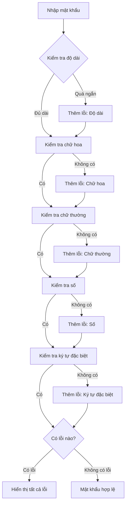

Mật khẩu mạnh là tuyến phòng thủ đầu tiên bảo vệ tài khoản của chúng ta. Trong bài này, chúng ta sẽ học cách xây dựng một hệ thống kiểm tra mật khẩu hoàn chỉnh, từ những quy tắc cơ bản đến các điều kiện phức tạp hơn.

Bạn sẽ học được cách sử dụng cấu trúc điều khiển để xử lý nhiều điều kiện đồng thời, kỹ thuật xử lý chuỗi, và cách tạo ra thông báo lỗi hữu ích cho người dùng.

<!-- truncate -->

## Tại Sao Cần Kiểm Tra Mật Khẩu?

Trong thế giới số ngày nay, mật khẩu yếu là nguyên nhân chính dẫn đến các vụ tấn công mạng. Một mật khẩu tốt cần đáp ứng nhiều tiêu chí khác nhau để đảm bảo tính bảo mật.

:::info Thống Kê Thú Vị
Theo nghiên cứu của SplashData, những mật khẩu phổ biến nhất năm 2024 vẫn là "123456", "password", và "qwerty". Những mật khẩu này có thể bị hack trong vài giây!
:::

## Phân Tích Yêu Cầu Mật Khẩu Mạnh

Một mật khẩu được coi là mạnh thường cần đáp ứng các điều kiện sau:

### Điều Kiện Cơ Bản
1. **Độ dài tối thiểu**: Thường từ 8-12 ký tự
2. **Chứa chữ hoa**: Ít nhất 1 ký tự in hoa (A-Z)
3. **Chứa chữ thường**: Ít nhất 1 ký tự thường (a-z)
4. **Chứa số**: Ít nhất 1 chữ số (0-9)
5. **Chứa ký tự đặc biệt**: Ít nhất 1 ký tự như !@#$%^&*

### Điều Kiện Nâng Cao
- Không chứa tên người dùng
- Không chứa từ phổ biến
- Không có chuỗi lặp lại (như "aaa" hoặc "123")
- Không giống mật khẩu cũ

## Chiến Lược Giải Quyết

Để kiểm tra tính hợp lệ của mật khẩu, chúng ta sẽ:

1. **Tách nhỏ vấn đề**: Kiểm tra từng điều kiện một cách độc lập
2. **Sử dụng flags**: Đánh dấu điều kiện nào đã được thỏa mãn
3. **Tích lũy lỗi**: Thu thập tất cả lỗi để hiển thị cho người dùng
4. **Tính điểm mạnh**: Đánh giá mức độ bảo mật của mật khẩu



## Cách Tiếp Cận Step-by-Step

### Bước 1: Định Nghĩa Các Hằng Số

Trước tiên, chúng ta cần định nghĩa các yêu cầu:

```cpp
const int MIN_LENGTH = 8;
const string SPECIAL_CHARS = "!@#$%^&*()_+-=[]{}|;:,.<>?";
```

### Bước 2: Tạo Các Hàm Kiểm Tra Riêng Biệt

Mỗi điều kiện sẽ có một hàm kiểm tra riêng:
- `hasUpperCase()`: Kiểm tra chữ hoa
- `hasLowerCase()`: Kiểm tra chữ thường  
- `hasDigit()`: Kiểm tra số
- `hasSpecialChar()`: Kiểm tra ký tự đặc biệt

### Bước 3: Tích Hợp Và Báo Lỗi

Kết hợp tất cả điều kiện và tạo thông báo lỗi rõ ràng.

## Implementation

### C++ Implementation

```cpp
#include <iostream>
#include <string>
#include <vector>
#include <cctype>
using namespace std;

class PasswordValidator {
private:
    static const int MIN_LENGTH = 8;
    static const string SPECIAL_CHARS;
    
public:
    struct ValidationResult {
        bool isValid;
        vector<string> errors;
        int strengthScore;
        string strengthLevel;
    };
    
    static bool hasUpperCase(const string& password) {
        for (char c : password) {
            if (isupper(c)) return true;
        }
        return false;
    }
    
    static bool hasLowerCase(const string& password) {
        for (char c : password) {
            if (islower(c)) return true;
        }
        return false;
    }
    
    static bool hasDigit(const string& password) {
        for (char c : password) {
            if (isdigit(c)) return true;
        }
        return false;
    }
    
    static bool hasSpecialChar(const string& password) {
        for (char c : password) {
            if (SPECIAL_CHARS.find(c) != string::npos) {
                return true;
            }
        }
        return false;
    }
    
    static bool hasRepeatingChars(const string& password) {
        for (int i = 0; i < password.length() - 2; i++) {
            if (password[i] == password[i+1] && password[i+1] == password[i+2]) {
                return true;
            }
        }
        return false;
    }
    
    static ValidationResult validatePassword(const string& password) {
        ValidationResult result;
        result.isValid = true;
        result.strengthScore = 0;
        
        // Kiểm tra độ dài
        if (password.length() < MIN_LENGTH) {
            result.errors.push_back("Mat khau phai co it nhat " + to_string(MIN_LENGTH) + " ky tu");
            result.isValid = false;
        } else {
            result.strengthScore += 1;
        }
        
        // Kiểm tra chữ hoa
        if (!hasUpperCase(password)) {
            result.errors.push_back("Mat khau phai chua it nhat 1 chu hoa (A-Z)");
            result.isValid = false;
        } else {
            result.strengthScore += 1;
        }
        
        // Kiểm tra chữ thường
        if (!hasLowerCase(password)) {
            result.errors.push_back("Mat khau phai chua it nhat 1 chu thuong (a-z)");
            result.isValid = false;
        } else {
            result.strengthScore += 1;
        }
        
        // Kiểm tra số
        if (!hasDigit(password)) {
            result.errors.push_back("Mat khau phai chua it nhat 1 so (0-9)");
            result.isValid = false;
        } else {
            result.strengthScore += 1;
        }
        
        // Kiểm tra ký tự đặc biệt
        if (!hasSpecialChar(password)) {
            result.errors.push_back("Mat khau phai chua it nhat 1 ky tu dac biet (!@#$%^&*...)");
            result.isValid = false;
        } else {
            result.strengthScore += 1;
        }
        
        // Kiểm tra ký tự lặp
        if (hasRepeatingChars(password)) {
            result.errors.push_back("Mat khau khong duoc chua 3 ky tu lien tiep giong nhau");
            result.isValid = false;
        }
        
        // Bonus điểm cho độ dài
        if (password.length() >= 12) result.strengthScore += 1;
        if (password.length() >= 16) result.strengthScore += 1;
        
        // Xác định mức độ mạnh
        if (result.strengthScore <= 2) {
            result.strengthLevel = "Yeu";
        } else if (result.strengthScore <= 4) {
            result.strengthLevel = "Trung binh";
        } else if (result.strengthScore <= 6) {
            result.strengthLevel = "Manh";
        } else {
            result.strengthLevel = "Rat manh";
        }
        
        return result;
    }
};

const string PasswordValidator::SPECIAL_CHARS = "!@#$%^&*()_+-=[]{}|;:,.<>?";

int main() {
    string password;
    
    cout << "=== Chuong trinh kiem tra mat khau ===" << endl;
    cout << "Nhap mat khau can kiem tra: ";
    getline(cin, password);
    
    auto result = PasswordValidator::validatePassword(password);
    
    cout << "\n=== KET QUA KIEM TRA ===" << endl;
    
    if (result.isValid) {
        cout << "✓ Mat khau hop le!" << endl;
    } else {
        cout << "✗ Mat khau khong hop le!" << endl;
        cout << "\nCac loi can sua:" << endl;
        for (int i = 0; i < result.errors.size(); i++) {
            cout << (i + 1) << ". " << result.errors[i] << endl;
        }
    }
    
    cout << "\nMuc do bao mat: " << result.strengthLevel;
    cout << " (" << result.strengthScore << "/7 diem)" << endl;
    
    // Hiển thị thanh tiến trình
    cout << "Do manh: [";
    for (int i = 0; i < 7; i++) {
        if (i < result.strengthScore) {
            cout << "█";
        } else {
            cout << "░";
        }
    }
    cout << "]" << endl;
    
    return 0;
}
```

### Python Implementation

```python
import re
import string

class PasswordValidator:
    MIN_LENGTH = 8
    SPECIAL_CHARS = "!@#$%^&*()_+-=[]{}|;:,.<>?"
    
    @staticmethod
    def has_upper_case(password):
        """Kiểm tra có chữ hoa không"""
        return any(c.isupper() for c in password)
    
    @staticmethod
    def has_lower_case(password):
        """Kiểm tra có chữ thường không"""
        return any(c.islower() for c in password)
    
    @staticmethod
    def has_digit(password):
        """Kiểm tra có số không"""
        return any(c.isdigit() for c in password)
    
    @staticmethod
    def has_special_char(password):
        """Kiểm tra có ký tự đặc biệt không"""
        return any(c in PasswordValidator.SPECIAL_CHARS for c in password)
    
    @staticmethod
    def has_repeating_chars(password):
        """Kiểm tra có 3 ký tự lặp liên tiếp không"""
        for i in range(len(password) - 2):
            if password[i] == password[i+1] == password[i+2]:
                return True
        return False
    
    @staticmethod
    def check_common_patterns(password):
        """Kiểm tra các mẫu phổ biến yếu"""
        common_patterns = [
            r'123456',
            r'password',
            r'qwerty',
            r'abc123',
            r'111111',
            r'000000'
        ]
        
        password_lower = password.lower()
        for pattern in common_patterns:
            if pattern in password_lower:
                return True
        return False
    
    @staticmethod
    def validate_password(password):
        """Validate mật khẩu và trả về kết quả chi tiết"""
        result = {
            'is_valid': True,
            'errors': [],
            'strength_score': 0,
            'strength_level': ''
        }
        
        # Kiểm tra độ dài
        if len(password) < PasswordValidator.MIN_LENGTH:
            result['errors'].append(f"Mật khẩu phải có ít nhất {PasswordValidator.MIN_LENGTH} ký tự")
            result['is_valid'] = False
        else:
            result['strength_score'] += 1
        
        # Kiểm tra chữ hoa
        if not PasswordValidator.has_upper_case(password):
            result['errors'].append("Mật khẩu phải chứa ít nhất 1 chữ hoa (A-Z)")
            result['is_valid'] = False
        else:
            result['strength_score'] += 1
        
        # Kiểm tra chữ thường
        if not PasswordValidator.has_lower_case(password):
            result['errors'].append("Mật khẩu phải chứa ít nhất 1 chữ thường (a-z)")
            result['is_valid'] = False
        else:
            result['strength_score'] += 1
        
        # Kiểm tra số
        if not PasswordValidator.has_digit(password):
            result['errors'].append("Mật khẩu phải chứa ít nhất 1 số (0-9)")
            result['is_valid'] = False
        else:
            result['strength_score'] += 1
        
        # Kiểm tra ký tự đặc biệt
        if not PasswordValidator.has_special_char(password):
            result['errors'].append("Mật khẩu phải chứa ít nhất 1 ký tự đặc biệt (!@#$%^&*...)")
            result['is_valid'] = False
        else:
            result['strength_score'] += 1
        
        # Kiểm tra ký tự lặp
        if PasswordValidator.has_repeating_chars(password):
            result['errors'].append("Mật khẩu không được chứa 3 ký tự liên tiếp giống nhau")
            result['is_valid'] = False
        
        # Kiểm tra mẫu phổ biến
        if PasswordValidator.check_common_patterns(password):
            result['errors'].append("Mật khẩu không được chứa các mẫu phổ biến yếu")
            result['is_valid'] = False
        
        # Bonus điểm cho độ dài
        if len(password) >= 12:
            result['strength_score'] += 1
        if len(password) >= 16:
            result['strength_score'] += 1
        
        # Xác định mức độ mạnh
        if result['strength_score'] <= 2:
            result['strength_level'] = "Yếu"
        elif result['strength_score'] <= 4:
            result['strength_level'] = "Trung bình"
        elif result['strength_score'] <= 6:
            result['strength_level'] = "Mạnh"
        else:
            result['strength_level'] = "Rất mạnh"
        
        return result

def display_strength_bar(score, max_score=7):
    """Hiển thị thanh tiến trình độ mạnh mật khẩu"""
    filled = '█' * score
    empty = '░' * (max_score - score)
    return f"[{filled}{empty}]"

def main():
    print("=== Chương trình kiểm tra mật khẩu ===")
    password = input("Nhập mật khẩu cần kiểm tra: ")
    
    result = PasswordValidator.validate_password(password)
    
    print("\n=== KẾT QUẢ KIỂM TRA ===")
    
    if result['is_valid']:
        print("✓ Mật khẩu hợp lệ!")
    else:
        print("✗ Mật khẩu không hợp lệ!")
        print("\nCác lỗi cần sửa:")
        for i, error in enumerate(result['errors'], 1):
            print(f"{i}. {error}")
    
    print(f"\nMức độ bảo mật: {result['strength_level']}")
    print(f"Điểm số: {result['strength_score']}/7")
    print(f"Độ mạnh: {display_strength_bar(result['strength_score'])}")
    
    # Gợi ý cải thiện
    if result['strength_score'] < 5:
        print("\n💡 Gợi ý cải thiện:")
        if len(password) < 12:
            print("- Tăng độ dài lên ít nhất 12 ký tự")
        print("- Sử dụng kết hợp chữ hoa, chữ thường, số và ký tự đặc biệt")
        print("- Tránh các mẫu dễ đoán như '123456', 'password'")

if __name__ == "__main__":
    main()
```

### Java Implementation

```java
import java.util.*;
import java.util.regex.Pattern;

public class PasswordValidator {
    private static final int MIN_LENGTH = 8;
    private static final String SPECIAL_CHARS = "!@#$%^&*()_+-=[]{}|;:,.<>?";
    
    public static class ValidationResult {
        public boolean isValid;
        public List<String> errors;
        public int strengthScore;
        public String strengthLevel;
        
        public ValidationResult() {
            this.isValid = true;
            this.errors = new ArrayList<>();
            this.strengthScore = 0;
            this.strengthLevel = "";
        }
    }
    
    public static boolean hasUpperCase(String password) {
        return password.chars().anyMatch(Character::isUpperCase);
    }
    
    public static boolean hasLowerCase(String password) {
        return password.chars().anyMatch(Character::isLowerCase);
    }
    
    public static boolean hasDigit(String password) {
        return password.chars().anyMatch(Character::isDigit);
    }
    
    public static boolean hasSpecialChar(String password) {
        return password.chars().anyMatch(c -> SPECIAL_CHARS.indexOf(c) >= 0);
    }
    
    public static boolean hasRepeatingChars(String password) {
        for (int i = 0; i < password.length() - 2; i++) {
            if (password.charAt(i) == password.charAt(i+1) && 
                password.charAt(i+1) == password.charAt(i+2)) {
                return true;
            }
        }
        return false;
    }
    
    public static boolean checkCommonPatterns(String password) {
        String[] commonPatterns = {
            "123456", "password", "qwerty", "abc123", 
            "111111", "000000", "admin", "user"
        };
        
        String passwordLower = password.toLowerCase();
        for (String pattern : commonPatterns) {
            if (passwordLower.contains(pattern)) {
                return true;
            }
        }
        return false;
    }
    
    public static ValidationResult validatePassword(String password) {
        ValidationResult result = new ValidationResult();
        
        // Kiểm tra độ dài
        if (password.length() < MIN_LENGTH) {
            result.errors.add("Mật khẩu phải có ít nhất " + MIN_LENGTH + " ký tự");
            result.isValid = false;
        } else {
            result.strengthScore += 1;
        }
        
        // Kiểm tra chữ hoa
        if (!hasUpperCase(password)) {
            result.errors.add("Mật khẩu phải chứa ít nhất 1 chữ hoa (A-Z)");
            result.isValid = false;
        } else {
            result.strengthScore += 1;
        }
        
        // Kiểm tra chữ thường
        if (!hasLowerCase(password)) {
            result.errors.add("Mật khẩu phải chứa ít nhất 1 chữ thường (a-z)");
            result.isValid = false;
        } else {
            result.strengthScore += 1;
        }
        
        // Kiểm tra số
        if (!hasDigit(password)) {
            result.errors.add("Mật khẩu phải chứa ít nhất 1 số (0-9)");
            result.isValid = false;
        } else {
            result.strengthScore += 1;
        }
        
        // Kiểm tra ký tự đặc biệt
        if (!hasSpecialChar(password)) {
            result.errors.add("Mật khẩu phải chứa ít nhất 1 ký tự đặc biệt (!@#$%^&*...)");
            result.isValid = false;
        } else {
            result.strengthScore += 1;
        }
        
        // Kiểm tra ký tự lặp
        if (hasRepeatingChars(password)) {
            result.errors.add("Mật khẩu không được chứa 3 ký tự liên tiếp giống nhau");
            result.isValid = false;
        }
        
        // Kiểm tra mẫu phổ biến
        if (checkCommonPatterns(password)) {
            result.errors.add("Mật khẩu không được chứa các mẫu phổ biến yếu");
            result.isValid = false;
        }
        
        // Bonus điểm cho độ dài
        if (password.length() >= 12) result.strengthScore += 1;
        if (password.length() >= 16) result.strengthScore += 1;
        
        // Xác định mức độ mạnh
        if (result.strengthScore <= 2) {
            result.strengthLevel = "Yếu";
        } else if (result.strengthScore <= 4) {
            result.strengthLevel = "Trung bình";
        } else if (result.strengthScore <= 6) {
            result.strengthLevel = "Mạnh";
        } else {
            result.strengthLevel = "Rất mạnh";
        }
        
        return result;
    }
    
    public static String displayStrengthBar(int score, int maxScore) {
        StringBuilder bar = new StringBuilder("[");
        for (int i = 0; i < maxScore; i++) {
            if (i < score) {
                bar.append("█");
            } else {
                bar.append("░");
            }
        }
        bar.append("]");
        return bar.toString();
    }
    
    public static void main(String[] args) {
        Scanner scanner = new Scanner(System.in);
        
        System.out.println("=== Chương trình kiểm tra mật khẩu ===");
        System.out.print("Nhập mật khẩu cần kiểm tra: ");
        String password = scanner.nextLine();
        
        ValidationResult result = validatePassword(password);
        
        System.out.println("\n=== KẾT QUẢ KIỂM TRA ===");
        
        if (result.isValid) {
            System.out.println("✓ Mật khẩu hợp lệ!");
        } else {
            System.out.println("✗ Mật khẩu không hợp lệ!");
            System.out.println("\nCác lỗi cần sửa:");
            for (int i = 0; i < result.errors.size(); i++) {
                System.out.println((i + 1) + ". " + result.errors.get(i));
            }
        }
        
        System.out.println("\nMức độ bảo mật: " + result.strengthLevel);
        System.out.println("Điểm số: " + result.strengthScore + "/7");
        System.out.println("Độ mạnh: " + displayStrengthBar(result.strengthScore, 7));
        
        // Gợi ý cải thiện
        if (result.strengthScore < 5) {
            System.out.println("\n💡 Gợi ý cải thiện:");
            if (password.length() < 12) {
                System.out.println("- Tăng độ dài lên ít nhất 12 ký tự");
            }
            System.out.println("- Sử dụng kết hợp chữ hoa, chữ thường, số và ký tự đặc biệt");
            System.out.println("- Tránh các mẫu dễ đoán như '123456', 'password'");
        }
        
        scanner.close();
    }
}
```

## Phân Tích Độ Phức Tạp

### Time Complexity
- **O(n)** - với n là độ dài mật khẩu
- Mỗi điều kiện kiểm tra đều duyệt qua chuỗi một lần
- Tổng thời gian vẫn là tuyến tính

### Space Complexity  
- **O(k)** - với k là số lượng lỗi tối đa
- Lưu trữ danh sách lỗi và một số biến boolean

## Các Trường Hợp Đặc Biệt

:::warning Lưu Ý Quan Trọng
1. **Empty Password**: Cần xử lý trường hợp mật khẩu rỗng
2. **Unicode Characters**: Xử lý ký tự đặc biệt từ các bảng mã khác
3. **Very Long Passwords**: Đặt giới hạn độ dài tối đa để tránh DOS
4. **Whitespace**: Quyết định có cho phép khoảng trắng hay không
:::

## Mở Rộng Và Cải Tiến

### 1. Password Strength Meter
```python
def calculate_entropy(password):
    """Tính entropy của mật khẩu"""
    charset_size = 0
    if any(c.islower() for c in password):
        charset_size += 26
    if any(c.isupper() for c in password):  
        charset_size += 26
    if any(c.isdigit() for c in password):
        charset_size += 10
    if any(c in SPECIAL_CHARS for c in password):
        charset_size += len(SPECIAL_CHARS)
    
    import math
    return len(password) * math.log2(charset_size) if charset_size > 0 else 0
```

### 2. Dictionary Attack Protection
```python
def check_dictionary_words(password):
    """Kiểm tra từ phổ biến trong từ điển"""
    common_words = ['password', 'admin', 'user', 'login', '123456']
    password_lower = password.lower()
    
    for word in common_words:
        if word in password_lower:
            return True
    return False
```

### 3. Personal Information Check
```python
def check_personal_info(password, username, email=None, name=None):
    """Kiểm tra thông tin cá nhân trong mật khẩu"""
    password_lower = password.lower()
    
    if username and username.lower() in password_lower:
        return True
    if email and email.split('@')[0].lower() in password_lower:
        return True
    if name and name.lower() in password_lower:
        return True
        
    return False
```

## Thực Hành Và Bài Tập

### Bài Tập 1: Cơ Bản
Viết chương trình kiểm tra mật khẩu với các điều kiện:
- Độ dài 6-20 ký tự
- Chứa ít nhất 1 số
- Chứa ít nhất 1 chữ cái

### Bài Tập 2: Nâng Cao
Mở rộng chương trình để:
- Tính toán thời gian crack mật khẩu
- Gợi ý mật khẩu mạnh
- Lưu lại lịch sử mật khẩu

### Bài Tập 3: Thực Tế
Xây dựng API kiểm tra mật khẩu:
- REST endpoint nhận JSON
- Trả về kết quả chi tiết
- Rate limiting để tránh abuse

## Kết Luận

Kiểm tra tính hợp lệ của mật khẩu là một kỹ năng quan trọng trong lập trình. Qua bài này, bạn đã học được:

✅ **Cách phân tích và chia nhỏ vấn đề phức tạp**  
✅ **Sử dụng cấu trúc điều khiển hiệu quả**  
✅ **Xử lý nhiều điều kiện đồng thời**  
✅ **Tạo thông báo lỗi hữu ích cho người dùng**  
✅ **Đánh giá và phân loại độ mạnh mật khẩu**

:::tip Lời Khuyên Cuối
Trong thực tế, nên sử dụng các thư viện chuyên dụng như `zxcvbn` (JavaScript), `passwordmeter` (Python) thay vì tự implement từ đầu. Tuy nhiên, việc hiểu cách hoạt động bên trong sẽ giúp bạn tùy chỉnh theo nhu cầu cụ thể.
:::

Hãy thực hành với các ví dụ trên và thử nghiệm với các mật khẩu khác nhau để hiểu rõ hơn về cách thức hoạt động!