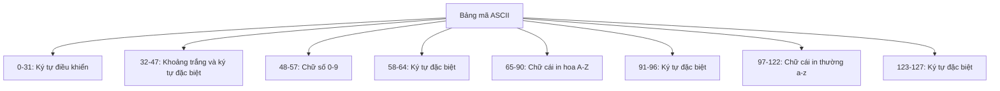

Việc phân loại ký tự là một kỹ năng cơ bản và cực kỳ quan trọng trong lập trình. Từ việc xác thực dữ liệu đầu vào, xử lý chuỗi, đến phân tích văn bản, khả năng xác định loại ký tự (chữ cái, chữ số, hay ký tự đặc biệt) là nền tảng cho nhiều thuật toán và ứng dụng thực tế.

Bài viết này sẽ đi sâu vào cách phân loại ký tự, các phương pháp kiểm tra loại ký tự trong các ngôn ngữ lập trình phổ biến, và cung cấp các ví dụ minh họa chi tiết để bạn có thể áp dụng vào các dự án thực tế của mình. Dù bạn đang xây dựng một chương trình xác thực mật khẩu, phân tích văn bản, hay đơn giản là cần xử lý dữ liệu đầu vào, bài viết này sẽ trang bị cho bạn kiến thức cần thiết.

<!-- truncate -->

## Hiểu về các loại ký tự trong lập trình

Trước khi đi vào cách phân loại ký tự, chúng ta cần hiểu rõ về các loại ký tự cơ bản trong lập trình:

### 1. Chữ cái (Alphabetic characters)

- **Chữ cái in hoa**: A, B, C, ..., Z
- **Chữ cái in thường**: a, b, c, ..., z
- Trong một số ngôn ngữ và bộ ký tự, còn có các chữ cái có dấu và ký tự đặc biệt khác như: é, è, ü, ñ, ...

### 2. Chữ số (Digits)

- 0, 1, 2, 3, 4, 5, 6, 7, 8, 9

### 3. Ký tự đặc biệt (Special characters)

- Các ký tự dấu câu: . , : ; ! ? ...
- Các ký tự toán học: + - * / % ^ ...
- Các ký tự đặc biệt khác: @ # $ & _ ...
- Khoảng trắng và ký tự điều khiển: dấu cách, tab, dòng mới, ...

### 4. Ký tự điều khiển (Control characters)

- Các ký tự không in được như: xuống dòng (\n), tab (\t), xóa (DEL), ...

## Cách máy tính biểu diễn ký tự

### Bảng mã ASCII

Bảng mã ASCII (American Standard Code for Information Interchange) là một tiêu chuẩn mã hóa ký tự sử dụng các số từ 0 đến 127 để biểu diễn các ký tự. Trong đó:

- 0-31: Các ký tự điều khiển không in được
- 32-47: Khoảng trắng và các ký tự đặc biệt đầu tiên
- 48-57: Các chữ số từ 0 đến 9
- 58-64: Các ký tự đặc biệt
- 65-90: Các chữ cái in hoa từ A đến Z
- 91-96: Các ký tự đặc biệt
- 97-122: Các chữ cái in thường từ a đến z
- 123-127: Các ký tự đặc biệt cuối cùng



### Mã Unicode và UTF-8

Trong khi ASCII chỉ hỗ trợ 128 ký tự, Unicode mở rộng phạm vi này lên hơn 140,000 ký tự, bao gồm các ký tự từ hầu hết các ngôn ngữ trên thế giới, biểu tượng và emoji.

UTF-8 là một cách mã hóa Unicode phổ biến, nó tương thích với ASCII và sử dụng từ 1 đến 4 byte để biểu diễn một ký tự.

## Các phương pháp phân loại ký tự

### 1. Sử dụng mã ASCII

Phương pháp truyền thống là kiểm tra giá trị ASCII của ký tự:

```
- Nếu mã ASCII nằm trong khoảng 48-57, đó là chữ số
- Nếu mã ASCII nằm trong khoảng 65-90, đó là chữ cái in hoa
- Nếu mã ASCII nằm trong khoảng 97-122, đó là chữ cái in thường
- Còn lại là ký tự đặc biệt hoặc ký tự điều khiển
```

### 2. Sử dụng hàm có sẵn trong thư viện

Hầu hết các ngôn ngữ lập trình đều cung cấp các hàm để kiểm tra loại ký tự:

- **C/C++**: `isalpha()`, `isdigit()`, `isalnum()`, `isspace()`, `ispunct()`, ...
- **Java**: `Character.isLetter()`, `Character.isDigit()`, `Character.isLetterOrDigit()`, `Character.isWhitespace()`, ...
- **Python**: `isalpha()`, `isdigit()`, `isalnum()`, `isspace()`, ... (là các phương thức của đối tượng chuỗi)

### 3. Sử dụng biểu thức chính quy (Regular Expressions)

Biểu thức chính quy (regex) là một công cụ mạnh mẽ để kiểm tra và phân loại ký tự, đặc biệt khi làm việc với chuỗi:

- `[a-zA-Z]`: Khớp với bất kỳ chữ cái Latin nào
- `[0-9]` hoặc `\d`: Khớp với bất kỳ chữ số nào
- `[a-zA-Z0-9]` hoặc `\w`: Khớp với bất kỳ chữ cái hoặc chữ số nào
- `\s`: Khớp với khoảng trắng
- `[^a-zA-Z0-9]` hoặc `\W`: Khớp với bất kỳ ký tự nào không phải chữ cái hoặc chữ số

## Triển khai trong các ngôn ngữ lập trình

### C++ Implementation

```cpp
#include <iostream>
#include <cctype>
#include <string>
using namespace std;

// Hàm phân loại ký tự sử dụng thư viện cctype
void classifyCharacter(char ch) {
    cout << "Ky tu: '" << ch << "'\n";
    
    if (isalpha(ch)) {
        cout << "- La chu cai";
        if (isupper(ch))
            cout << " (in hoa)";
        else
            cout << " (in thuong)";
        cout << "\n";
    }
    
    if (isdigit(ch))
        cout << "- La chu so\n";
    
    if (isalnum(ch))
        cout << "- La chu cai hoac chu so\n";
    
    if (isspace(ch))
        cout << "- La khoang trang\n";
    
    if (ispunct(ch))
        cout << "- La dau cau\n";
    
    if (iscntrl(ch))
        cout << "- La ky tu dieu khien\n";
    
    if (!isalnum(ch) && !isspace(ch) && !iscntrl(ch))
        cout << "- La ky tu dac biet\n";
    
    cout << "- Ma ASCII: " << static_cast<int>(ch) << "\n\n";
}

// Hàm phân loại ký tự tự triển khai (không dùng thư viện)
void classifyCharacterManually(char ch) {
    int ascii = static_cast<int>(ch);
    cout << "Phan loai thu cong cho ky tu '" << ch << "':\n";
    
    if ((ascii >= 65 && ascii <= 90) || (ascii >= 97 && ascii <= 122)) {
        cout << "- La chu cai";
        if (ascii >= 65 && ascii <= 90)
            cout << " (in hoa)";
        else
            cout << " (in thuong)";
        cout << "\n";
    }
    
    if (ascii >= 48 && ascii <= 57)
        cout << "- La chu so\n";
    
    if ((ascii >= 32 && ascii <= 47) || 
        (ascii >= 58 && ascii <= 64) || 
        (ascii >= 91 && ascii <= 96) || 
        (ascii >= 123 && ascii <= 126))
        cout << "- La ky tu dac biet\n";
    
    if (ascii < 32 || ascii == 127)
        cout << "- La ky tu dieu khien\n";
    
    cout << "\n";
}

// Hàm thống kê các loại ký tự trong chuỗi
void analyzeString(const string& str) {
    int alphabets = 0;
    int digits = 0;
    int spaces = 0;
    int specials = 0;
    
    for (char ch : str) {
        if (isalpha(ch))
            alphabets++;
        else if (isdigit(ch))
            digits++;
        else if (isspace(ch))
            spaces++;
        else
            specials++;
    }
    
    cout << "Thong ke chuoi: \"" << str << "\"\n";
    cout << "- Tong so ky tu: " << str.length() << "\n";
    cout << "- So chu cai: " << alphabets << "\n";
    cout << "- So chu so: " << digits << "\n";
    cout << "- So khoang trang: " << spaces << "\n";
    cout << "- So ky tu dac biet: " << specials << "\n\n";
}

int main() {
    cout << "CHUONG TRINH PHAN LOAI KY TU\n";
    cout << "=============================\n\n";
    
    // Phân loại một số ký tự ví dụ
    cout << "1. PHAN LOAI CAC KY TU\n";
    classifyCharacter('A');
    classifyCharacter('z');
    classifyCharacter('5');
    classifyCharacter(' ');
    classifyCharacter('\n');
    classifyCharacter('@');
    
    // Phân loại thủ công (không dùng thư viện)
    cout << "2. PHAN LOAI THU CONG (KHONG DUNG THU VIEN)\n";
    classifyCharacterManually('A');
    classifyCharacterManually('9');
    classifyCharacterManually('#');
    
    // Thống kê các loại ký tự trong chuỗi
    cout << "3. THONG KE CAC LOAI KY TU TRONG CHUOI\n";
    analyzeString("Hello, World! 123");
    analyzeString("Programming@2023");
    
    // Nhập và phân tích chuỗi từ người dùng
    cout << "4. NHAP VA PHAN TICH CHUOI\n";
    string userInput;
    cout << "Nhap mot chuoi bat ky: ";
    getline(cin, userInput);
    analyzeString(userInput);
    
    return 0;
}
```

### Python Implementation

```python
import re

def classify_character(char):
    """Phân loại một ký tự dựa trên các phương thức có sẵn"""
    print(f"Ký tự: '{char}'")
    
    if char.isalpha():
        print(f"- Là chữ cái {'(in hoa)' if char.isupper() else '(in thường)'}")
    
    if char.isdigit():
        print("- Là chữ số")
    
    if char.isalnum():
        print("- Là chữ cái hoặc chữ số")
    
    if char.isspace():
        print("- Là khoảng trắng")
    
    if char in "!\"#$%&'()*+,-./:;<=>?@[\\]^_`{|}~":
        print("- Là dấu câu")
    
    # Kiểm tra ký tự điều khiển (ASCII 0-31 hoặc 127)
    if ord(char) < 32 or ord(char) == 127:
        print("- Là ký tự điều khiển")
    
    # Kiểm tra ký tự đặc biệt (không phải chữ cái, chữ số, khoảng trắng)
    if not char.isalnum() and not char.isspace() and ord(char) >= 32 and ord(char) != 127:
        print("- Là ký tự đặc biệt")
    
    print(f"- Mã Unicode: {ord(char)}")
    print()

def classify_character_manually(char):
    """Phân loại một ký tự thủ công dựa trên mã Unicode"""
    unicode_value = ord(char)
    print(f"Phân loại thủ công cho ký tự '{char}':")
    
    # Kiểm tra chữ cái
    if (65 <= unicode_value <= 90) or (97 <= unicode_value <= 122):
        if 65 <= unicode_value <= 90:
            print("- Là chữ cái (in hoa)")
        else:
            print("- Là chữ cái (in thường)")
    
    # Kiểm tra chữ số
    if 48 <= unicode_value <= 57:
        print("- Là chữ số")
    
    # Kiểm tra ký tự đặc biệt
    if ((32 <= unicode_value <= 47) or 
        (58 <= unicode_value <= 64) or 
        (91 <= unicode_value <= 96) or 
        (123 <= unicode_value <= 126)):
        print("- Là ký tự đặc biệt")
    
    # Kiểm tra ký tự điều khiển
    if unicode_value < 32 or unicode_value == 127:
        print("- Là ký tự điều khiển")
    
    print()

def analyze_string(text):
    """Thống kê các loại ký tự trong một chuỗi"""
    alphabets = sum(1 for char in text if char.isalpha())
    digits = sum(1 for char in text if char.isdigit())
    spaces = sum(1 for char in text if char.isspace())
    specials = len(text) - alphabets - digits - spaces
    
    print(f'Thống kê chuỗi: "{text}"')
    print(f"- Tổng số ký tự: {len(text)}")
    print(f"- Số chữ cái: {alphabets}")
    print(f"- Số chữ số: {digits}")
    print(f"- Số khoảng trắng: {spaces}")
    print(f"- Số ký tự đặc biệt: {specials}")
    print()

def analyze_string_with_regex(text):
    """Thống kê các loại ký tự trong chuỗi sử dụng regex"""
    letters = len(re.findall(r'[a-zA-Z]', text))
    digits = len(re.findall(r'\d', text))
    spaces = len(re.findall(r'\s', text))
    specials = len(re.findall(r'[^\w\s]', text))
    
    print(f'Thống kê chuỗi (regex): "{text}"')
    print(f"- Tổng số ký tự: {len(text)}")
    print(f"- Số chữ cái: {letters}")
    print(f"- Số chữ số: {digits}")
    print(f"- Số khoảng trắng: {spaces}")
    print(f"- Số ký tự đặc biệt: {specials}")
    print()

def categorize_characters(text):
    """Phân loại và nhóm các ký tự trong chuỗi"""
    uppercase = []
    lowercase = []
    digits = []
    specials = []
    
    for char in text:
        if char.isupper():
            uppercase.append(char)
        elif char.islower():
            lowercase.append(char)
        elif char.isdigit():
            digits.append(char)
        else:
            specials.append(char)
    
    print(f'Phân loại ký tự trong chuỗi: "{text}"')
    print(f"- Chữ in hoa: {''.join(uppercase)}")
    print(f"- Chữ in thường: {''.join(lowercase)}")
    print(f"- Chữ số: {''.join(digits)}")
    print(f"- Ký tự đặc biệt: {''.join(specials)}")
    print()

def main():
    print("CHƯƠNG TRÌNH PHÂN LOẠI KÝ TỰ")
    print("=============================\n")
    
    # Phân loại một số ký tự ví dụ
    print("1. PHÂN LOẠI CÁC KÝ TỰ")
    classify_character('A')
    classify_character('z')
    classify_character('5')
    classify_character(' ')
    classify_character('\n')
    classify_character('@')
    
    # Phân loại thủ công
    print("2. PHÂN LOẠI THỦ CÔNG (KHÔNG DÙNG PHƯƠNG THỨC CÓ SẴN)")
    classify_character_manually('A')
    classify_character_manually('9')
    classify_character_manually('#')
    
    # Thống kê các loại ký tự trong chuỗi
    print("3. THỐNG KÊ CÁC LOẠI KÝ TỰ TRONG CHUỖI")
    analyze_string("Hello, World! 123")
    analyze_string("Programming@2023")
    
    # Thống kê sử dụng regex
    print("4. THỐNG KÊ SỬ DỤNG REGEX")
    analyze_string_with_regex("Hello, World! 123")
    
    # Phân loại và nhóm các ký tự
    print("5. PHÂN LOẠI VÀ NHÓM CÁC KÝ TỰ")
    categorize_characters("Hello, World! 123")
    
    # Nhập và phân tích chuỗi từ người dùng
    print("6. NHẬP VÀ PHÂN TÍCH CHUỖI")
    user_input = input("Nhập một chuỗi bất kỳ: ")
    analyze_string(user_input)
    categorize_characters(user_input)

if __name__ == "__main__":
    main()
```

### Java Implementation

```java
import java.util.Scanner;
import java.util.regex.Matcher;
import java.util.regex.Pattern;

public class CharacterClassifier {
    
    // Phân loại một ký tự sử dụng các phương thức của Character
    public static void classifyCharacter(char ch) {
        System.out.println("Ky tu: '" + ch + "'");
        
        if (Character.isLetter(ch)) {
            System.out.print("- La chu cai");
            if (Character.isUpperCase(ch)) {
                System.out.println(" (in hoa)");
            } else {
                System.out.println(" (in thuong)");
            }
        }
        
        if (Character.isDigit(ch)) {
            System.out.println("- La chu so");
        }
        
        if (Character.isLetterOrDigit(ch)) {
            System.out.println("- La chu cai hoac chu so");
        }
        
        if (Character.isWhitespace(ch)) {
            System.out.println("- La khoang trang");
        }
        
        if (!Character.isLetterOrDigit(ch) && !Character.isWhitespace(ch)) {
            System.out.println("- La ky tu dac biet");
        }
        
        System.out.println("- Ma Unicode: " + (int)ch);
        System.out.println();
    }
    
    // Phân loại một ký tự thủ công
    public static void classifyCharacterManually(char ch) {
        int unicode = (int)ch;
        System.out.println("Phan loai thu cong cho ky tu '" + ch + "':");
        
        if ((unicode >= 65 && unicode <= 90) || (unicode >= 97 && unicode <= 122)) {
            if (unicode >= 65 && unicode <= 90) {
                System.out.println("- La chu cai (in hoa)");
            } else {
                System.out.println("- La chu cai (in thuong)");
            }
        }
        
        if (unicode >= 48 && unicode <= 57) {
            System.out.println("- La chu so");
        }
        
        if ((unicode >= 32 && unicode <= 47) || 
            (unicode >= 58 && unicode <= 64) || 
            (unicode >= 91 && unicode <= 96) || 
            (unicode >= 123 && unicode <= 126)) {
            System.out.println("- La ky tu dac biet");
        }
        
        if (unicode < 32 || unicode == 127) {
            System.out.println("- La ky tu dieu khien");
        }
        
        System.out.println();
    }
    
    // Thống kê các loại ký tự trong chuỗi
    public static void analyzeString(String text) {
        int alphabets = 0;
        int digits = 0;
        int spaces = 0;
        int specials = 0;
        
        for (int i = 0; i < text.length(); i++) {
            char ch = text.charAt(i);
            if (Character.isLetter(ch)) {
                alphabets++;
            } else if (Character.isDigit(ch)) {
                digits++;
            } else if (Character.isWhitespace(ch)) {
                spaces++;
            } else {
                specials++;
            }
        }
        
        System.out.println("Thong ke chuoi: \"" + text + "\"");
        System.out.println("- Tong so ky tu: " + text.length());
        System.out.println("- So chu cai: " + alphabets);
        System.out.println("- So chu so: " + digits);
        System.out.println("- So khoang trang: " + spaces);
        System.out.println("- So ky tu dac biet: " + specials);
        System.out.println();
    }
    
    // Thống kê các loại ký tự trong chuỗi sử dụng regex
    public static void analyzeStringWithRegex(String text) {
        // Đếm chữ cái
        Pattern letterPattern = Pattern.compile("[a-zA-Z]");
        Matcher letterMatcher = letterPattern.matcher(text);
        int letterCount = 0;
        while (letterMatcher.find()) {
            letterCount++;
        }
        
        // Đếm chữ số
        Pattern digitPattern = Pattern.compile("\\d");
        Matcher digitMatcher = digitPattern.matcher(text);
        int digitCount = 0;
        while (digitMatcher.find()) {
            digitCount++;
        }
        
        // Đếm khoảng trắng
        Pattern spacePattern = Pattern.compile("\\s");
        Matcher spaceMatcher = spacePattern.matcher(text);
        int spaceCount = 0;
        while (spaceMatcher.find()) {
            spaceCount++;
        }
        
        // Đếm ký tự đặc biệt
        Pattern specialPattern = Pattern.compile("[^\\w\\s]");
        Matcher specialMatcher = specialPattern.matcher(text);
        int specialCount = 0;
        while (specialMatcher.find()) {
            specialCount++;
        }
        
        System.out.println("Thong ke chuoi (regex): \"" + text + "\"");
        System.out.println("- Tong so ky tu: " + text.length());
        System.out.println("- So chu cai: " + letterCount);
        System.out.println("- So chu so: " + digitCount);
        System.out.println("- So khoang trang: " + spaceCount);
        System.out.println("- So ky tu dac biet: " + specialCount);
        System.out.println();
    }
    
    // Phân loại và nhóm các ký tự trong chuỗi
    public static void categorizeCharacters(String text) {
        StringBuilder uppercase = new StringBuilder();
        StringBuilder lowercase = new StringBuilder();
        StringBuilder digits = new StringBuilder();
        StringBuilder specials = new StringBuilder();
        
        for (int i = 0; i < text.length(); i++) {
            char ch = text.charAt(i);
            if (Character.isUpperCase(ch)) {
                uppercase.append(ch);
            } else if (Character.isLowerCase(ch)) {
                lowercase.append(ch);
            } else if (Character.isDigit(ch)) {
                digits.append(ch);
            } else {
                specials.append(ch);
            }
        }
        
        System.out.println("Phan loai ky tu trong chuoi: \"" + text + "\"");
        System.out.println("- Chu in hoa: " + uppercase.toString());
        System.out.println("- Chu in thuong: " + lowercase.toString());
        System.out.println("- Chu so: " + digits.toString());
        System.out.println("- Ky tu dac biet: " + specials.toString());
        System.out.println();
    }
    
    public static void main(String[] args) {
        System.out.println("CHUONG TRINH PHAN LOAI KY TU");
        System.out.println("=============================\n");
        
        // Phân loại một số ký tự ví dụ
        System.out.println("1. PHAN LOAI CAC KY TU");
        classifyCharacter('A');
        classifyCharacter('z');
        classifyCharacter('5');
        classifyCharacter(' ');
        classifyCharacter('\n');
        classifyCharacter('@');
        
        // Phân loại thủ công
        System.out.println("2. PHAN LOAI THU CONG (KHONG DUNG PHUONG THUC CO SAN)");
        classifyCharacterManually('A');
        classifyCharacterManually('9');
        classifyCharacterManually('#');
        
        // Thống kê các loại ký tự trong chuỗi
        System.out.println("3. THONG KE CAC LOAI KY TU TRONG CHUOI");
        analyzeString("Hello, World! 123");
        analyzeString("Programming@2023");
        
        // Thống kê sử dụng regex
        System.out.println("4. THONG KE SU DUNG REGEX");
        analyzeStringWithRegex("Hello, World! 123");
        
        // Phân loại và nhóm các ký tự
        System.out.println("5. PHAN LOAI VA NHOM CAC KY TU");
        categorizeCharacters("Hello, World! 123");
        
        // Nhập và phân tích chuỗi từ người dùng
        System.out.println("6. NHAP VA PHAN TICH CHUOI");
        Scanner scanner = new Scanner(System.in);
        System.out.print("Nhap mot chuoi bat ky: ");
        String userInput = scanner.nextLine();
        analyzeString(userInput);
        categorizeCharacters(userInput);
        
        scanner.close();
    }
}
```

## Giải thích chi tiết mã nguồn

### Phân loại ký tự trong C++

Trong C++, chúng ta sử dụng thư viện `<cctype>` để phân loại ký tự:

- **isalpha(ch)**: Kiểm tra xem ký tự có phải là chữ cái không
- **isdigit(ch)**: Kiểm tra xem ký tự có phải là chữ số không
- **isalnum(ch)**: Kiểm tra xem ký tự có phải là chữ cái hoặc chữ số không
- **isspace(ch)**: Kiểm tra xem ký tự có phải là khoảng trắng không
- **ispunct(ch)**: Kiểm tra xem ký tự có phải là dấu câu không
- **iscntrl(ch)**: Kiểm tra xem ký tự có phải là ký tự điều khiển không

Khi phân loại thủ công, chúng ta chuyển đổi ký tự thành mã ASCII bằng `static_cast<int>(ch)` và so sánh với các khoảng giá trị đã biết.

### Phân loại ký tự trong Python

Python cung cấp các phương thức cho đối tượng chuỗi để phân loại ký tự:

- **isalpha()**: Kiểm tra xem ký tự có phải là chữ cái không
- **isdigit()**: Kiểm tra xem ký tự có phải là chữ số không
- **isalnum()**: Kiểm tra xem ký tự có phải là chữ cái hoặc chữ số không
- **isspace()**: Kiểm tra xem ký tự có phải là khoảng trắng không
- **isupper()**: Kiểm tra xem ký tự có phải là chữ in hoa không
- **islower()**: Kiểm tra xem ký tự có phải là chữ in thường không

Python cũng hỗ trợ biểu thức chính quy thông qua module `re`, giúp việc tìm kiếm và phân loại ký tự trở nên linh hoạt hơn.

### Phân loại ký tự trong Java

Java sử dụng lớp `Character` để phân loại ký tự:

- **Character.isLetter(ch)**: Kiểm tra xem ký tự có phải là chữ cái không
- **Character.isDigit(ch)**: Kiểm tra xem ký tự có phải là chữ số không
- **Character.isLetterOrDigit(ch)**: Kiểm tra xem ký tự có phải là chữ cái hoặc chữ số không
- **Character.isWhitespace(ch)**: Kiểm tra xem ký tự có phải là khoảng trắng không
- **Character.isUpperCase(ch)**: Kiểm tra xem ký tự có phải là chữ in hoa không
- **Character.isLowerCase(ch)**: Kiểm tra xem ký tự có phải là chữ in thường không

Java cũng cung cấp lớp `Pattern` và `Matcher` để làm việc với biểu thức chính quy, tương tự như module `re` trong Python.

## Các ứng dụng của phân loại ký tự

Phân loại ký tự có nhiều ứng dụng thực tế trong lập trình:

### 1. Xác thực dữ liệu đầu vào

Kiểm tra tính hợp lệ của dữ liệu nhập từ người dùng:

```cpp
// Kiểm tra một chuỗi có chỉ chứa chữ số không
bool isNumeric(const string& str) {
    for (char ch : str) {
        if (!isdigit(ch))
            return false;
    }
    return !str.empty();
}

// Kiểm tra định dạng email đơn giản
bool isValidEmail(const string& email) {
    // Kiểm tra ký tự @
    size_t atPos = email.find('@');
    if (atPos == string::npos || atPos == 0 || atPos == email.length() - 1)
        return false;
    
    // Kiểm tra dấu . sau @
    size_t dotPos = email.find('.', atPos);
    if (dotPos == string::npos || dotPos == atPos + 1 || dotPos == email.length() - 1)
        return false;
    
    return true;
}
```

### 2. Xử lý và phân tích văn bản

Phân tích và thống kê các loại ký tự trong văn bản:

```python
def analyze_text(text):
    """Phân tích văn bản"""
    words = text.split()
    num_words = len(words)
    num_sentences = text.count('.') + text.count('!') + text.count('?')
    
    # Đếm số ký tự (không tính khoảng trắng)
    chars_no_spaces = sum(1 for char in text if not char.isspace())
    
    return {
        'words': num_words,
        'sentences': num_sentences,
        'characters': len(text),
        'characters_no_spaces': chars_no_spaces
    }
```

### 3. Xác thực mật khẩu

Kiểm tra mật khẩu có đủ mạnh không:

```java
public static boolean isStrongPassword(String password) {
    // Kiểm tra độ dài
    if (password.length() < 8)
        return false;
    
    boolean hasUppercase = false;
    boolean hasLowercase = false;
    boolean hasDigit = false;
    boolean hasSpecial = false;
    
    for (int i = 0; i < password.length(); i++) {
        char ch = password.charAt(i);
        if (Character.isUpperCase(ch))
            hasUppercase = true;
        else if (Character.isLowerCase(ch))
            hasLowercase = true;
        else if (Character.isDigit(ch))
            hasDigit = true;
        else if (!Character.isLetterOrDigit(ch))
            hasSpecial = true;
    }
    
    // Mật khẩu phải có ít nhất một chữ hoa, một chữ thường, một chữ số và một ký tự đặc biệt
    return hasUppercase && hasLowercase && hasDigit && hasSpecial;
}
```

### 4. Mã hóa và giải mã

Các thuật toán mã hóa thường xử lý từng ký tự riêng biệt:

```cpp
// Mã hóa Caesar đơn giản
string caesarEncrypt(const string& text, int shift) {
    string result;
    
    for (char ch : text) {
        if (isalpha(ch)) {
            char base = isupper(ch) ? 'A' : 'a';
            result += static_cast<char>((ch - base + shift) % 26 + base);
        } else {
            result += ch;
        }
    }
    
    return result;
}
```

### 5. Chuyển đổi định dạng

Chuyển đổi giữa các định dạng khác nhau:

```python
def snake_to_camel_case(snake_case):
    """Chuyển đổi từ snake_case sang camelCase"""
    components = snake_case.split('_')
    return components[0] + ''.join(x.title() for x in components[1:])

def camel_to_snake_case(camel_case):
    """Chuyển đổi từ camelCase sang snake_case"""
    import re
    s1 = re.sub('(.)([A-Z][a-z]+)', r'\1_\2', camel_case)
    return re.sub('([a-z0-9])([A-Z])', r'\1_\2', s1).lower()
```

## Xử lý các trường hợp đặc biệt

### 1. Ký tự Unicode và đa ngôn ngữ

Các ngôn ngữ lập trình hiện đại hỗ trợ Unicode, cho phép làm việc với các ký tự từ nhiều ngôn ngữ khác nhau. Tuy nhiên, phân loại các ký tự không thuộc bảng mã ASCII có thể phức tạp hơn.

```python
import unicodedata

def analyze_unicode_character(char):
    """Phân tích một ký tự Unicode"""
    name = unicodedata.name(char, "Không xác định")
    category = unicodedata.category(char)
    
    print(f"Ký tự: '{char}'")
    print(f"Tên: {name}")
    print(f"Mã Unicode: U+{ord(char):04X}")
    print(f"Loại: {category}")
    
    # Giải thích loại ký tự
    category_explanations = {
        'Lu': 'Chữ cái in hoa',
        'Ll': 'Chữ cái in thường',
        'Lt': 'Chữ cái in hoa đầu',
        'Lo': 'Chữ cái khác',
        'Nd': 'Chữ số thập phân',
        'Nl': 'Chữ số chữ',
        'No': 'Chữ số khác',
        'Zs': 'Dấu cách',
        'Zl': 'Ngắt dòng',
        'Zp': 'Ngắt đoạn',
        'Cc': 'Ký tự điều khiển',
        'Cf': 'Ký tự định dạng',
        'Cs': 'Ký tự thay thế',
        'Co': 'Ký tự riêng tư',
        'Cn': 'Ký tự không gán',
        'Mc': 'Kết hợp đánh dấu',
        'Me': 'Dấu bao quanh',
        'Mn': 'Dấu không chiếm chỗ',
        'Pc': 'Dấu nối',
        'Pd': 'Dấu gạch ngang',
        'Ps': 'Dấu mở ngoặc',
        'Pe': 'Dấu đóng ngoặc',
        'Pi': 'Dấu mở trích dẫn',
        'Pf': 'Dấu đóng trích dẫn',
        'Po': 'Dấu câu khác',
        'Sm': 'Ký hiệu toán học',
        'Sc': 'Ký hiệu tiền tệ',
        'Sk': 'Ký hiệu biến thể',
        'So': 'Ký hiệu khác'
    }
    
    if category in category_explanations:
        print(f"Giải thích: {category_explanations[category]}")
    
    print()

# Ví dụ sử dụng
analyze_unicode_character('A')  # ASCII
analyze_unicode_character('é')  # Latin với dấu
analyze_unicode_character('Ж')  # Cyrillic
analyze_unicode_character('日')  # Hanzi/Kanji
analyze_unicode_character('😊')  # Emoji
```

### 2. Xử lý chuỗi có dấu

Đặc biệt trong tiếng Việt, việc xử lý các chữ cái có dấu cần chú ý:

```python
def remove_vietnamese_accents(text):
    """Loại bỏ dấu tiếng Việt"""
    import unicodedata
    
    # Chuyển chuỗi Unicode sang dạng tổ hợp
    text = unicodedata.normalize('NFD', text)
    
    # Loại bỏ các dấu
    result = ''.join(c for c in text if not unicodedata.combining(c))
    
    # Đổi một số ký tự đặc biệt
    vietnamese_replacements = {
        'đ': 'd', 'Đ': 'D',
    }
    
    for vietnamese, latin in vietnamese_replacements.items():
        result = result.replace(vietnamese, latin)
    
    return result

# Ví dụ
print(remove_vietnamese_accents('Xin chào thế giới!'))  # Kết quả: "Xin chao the gioi!"
```

### 3. Kiểm tra ký tự hợp lệ trong tên file

Một ứng dụng thực tế là kiểm tra tên file có chứa các ký tự không hợp lệ không:

```cpp
bool isValidFilename(const string& filename) {
    const string invalidChars = "\\/:*?\"<>|";
    
    for (char ch : filename) {
        // Kiểm tra ký tự không hợp lệ trong tên file Windows
        if (invalidChars.find(ch) != string::npos) {
            return false;
        }
        
        // Kiểm tra ký tự điều khiển
        if (iscntrl(ch)) {
            return false;
        }
    }
    
    return !filename.empty();
}
```

## Tối ưu hóa hiệu suất

Khi làm việc với chuỗi lớn, việc phân loại ký tự có thể tốn thời gian. Dưới đây là một số kỹ thuật tối ưu hóa:

### 1. Sử dụng bảng tra cứu (Lookup Tables)

```cpp
// Khởi tạo bảng tra cứu một lần
bool isLetterLookup[256] = {false};

void initLookupTable() {
    for (int i = 0; i < 256; i++) {
        char ch = static_cast<char>(i);
        isLetterLookup[i] = isalpha(ch);
    }
}

// Sử dụng bảng tra cứu (nhanh hơn gọi isalpha mỗi lần)
bool isLetter(char ch) {
    return isLetterLookup[static_cast<unsigned char>(ch)];
}
```

### 2. Sử dụng biểu thức chính quy biên dịch trước

```python
import re

# Biên dịch biểu thức chính quy một lần
LETTER_PATTERN = re.compile(r'[a-zA-Z]')
DIGIT_PATTERN = re.compile(r'\d')
SPECIAL_PATTERN = re.compile(r'[^\w\s]')

def count_letters(text):
    """Đếm số chữ cái trong chuỗi (phiên bản tối ưu)"""
    return len(LETTER_PATTERN.findall(text))
```

### 3. Xử lý theo nhóm

```java
public static int countDigits(String text) {
    // Sử dụng biểu thức chính quy và đếm một lần
    return text.replaceAll("[^0-9]", "").length();
}
```

## Bài tập thực hành

### Bài tập 1: Kiểm tra tính hợp lệ của mật khẩu

Viết chương trình kiểm tra một mật khẩu có đáp ứng các yêu cầu sau không:
- Ít nhất 8 ký tự
- Chứa ít nhất một chữ cái in hoa
- Chứa ít nhất một chữ cái in thường
- Chứa ít nhất một chữ số
- Chứa ít nhất một ký tự đặc biệt

```cpp
// C++
bool isValidPassword(const string& password) {
    if (password.length() < 8)
        return false;
        
    bool hasUpper = false;
    bool hasLower = false;
    bool hasDigit = false;
    bool hasSpecial = false;
    
    for (char ch : password) {
        if (isupper(ch))
            hasUpper = true;
        else if (islower(ch))
            hasLower = true;
        else if (isdigit(ch))
            hasDigit = true;
        else if (!isalnum(ch))
            hasSpecial = true;
    }
    
    return hasUpper && hasLower && hasDigit && hasSpecial;
}
```

### Bài tập 2: Đếm từ trong một đoạn văn bản

Viết chương trình đếm số từ trong một đoạn văn bản, không tính các từ có độ dài nhỏ hơn 3 ký tự.

```python
# Python
def count_words(text, min_length=3):
    """Đếm số từ có độ dài >= min_length trong văn bản"""
    # Loại bỏ dấu câu
    import string
    for punctuation in string.punctuation:
        text = text.replace(punctuation, ' ')
    
    # Tách thành các từ và đếm
    words = [word for word in text.lower().split() if len(word) >= min_length]
    return len(words)
```

### Bài tập 3: Chuẩn hóa tên

Viết chương trình chuẩn hóa tên người (viết hoa chữ cái đầu của mỗi từ, viết thường các chữ cái còn lại).

```java
// Java
public static String normalizeName(String name) {
    if (name == null || name.isEmpty())
        return name;
    
    StringBuilder result = new StringBuilder();
    boolean capitalizeNext = true;
    
    for (int i = 0; i < name.length(); i++) {
        char ch = name.charAt(i);
        
        if (Character.isWhitespace(ch)) {
            capitalizeNext = true;
            result.append(ch);
        } else if (capitalizeNext) {
            result.append(Character.toUpperCase(ch));
            capitalizeNext = false;
        } else {
            result.append(Character.toLowerCase(ch));
        }
    }
    
    return result.toString();
}
```

### Bài tập 4: Tạo mật khẩu ngẫu nhiên

Viết chương trình tạo một mật khẩu ngẫu nhiên với độ dài cho trước, đảm bảo mật khẩu chứa tất cả các loại ký tự.

```python
# Python
def generate_password(length=12):
    """Tạo mật khẩu ngẫu nhiên có độ dài cho trước"""
    import random
    import string
    
    # Đảm bảo mật khẩu có đủ các loại ký tự
    lowercase = string.ascii_lowercase
    uppercase = string.ascii_uppercase
    digits = string.digits
    special = string.punctuation
    
    # Đảm bảo có ít nhất 1 ký tự mỗi loại
    password = [
        random.choice(lowercase),
        random.choice(uppercase),
        random.choice(digits),
        random.choice(special)
    ]
    
    # Thêm các ký tự ngẫu nhiên cho đến khi đủ độ dài
    all_chars = lowercase + uppercase + digits + special
    password.extend(random.choice(all_chars) for _ in range(length - 4))
    
    # Trộn ngẫu nhiên các ký tự
    random.shuffle(password)
    
    return ''.join(password)
```

## Tổng kết

Phân loại ký tự là một kỹ năng cơ bản nhưng cực kỳ quan trọng trong lập trình. Chúng ta đã tìm hiểu về:

1. **Các loại ký tự cơ bản**: Chữ cái, chữ số, ký tự đặc biệt và ký tự điều khiển
2. **Cách biểu diễn ký tự**: ASCII, Unicode và UTF-8
3. **Các phương pháp phân loại**: Sử dụng mã ASCII, hàm có sẵn trong thư viện và biểu thức chính quy
4. **Triển khai trong các ngôn ngữ lập trình**: C++, Python và Java
5. **Các ứng dụng thực tế**: Xác thực dữ liệu, xử lý văn bản, mã hóa, chuyển đổi định dạng, ...
6. **Xử lý trường hợp đặc biệt**: Ký tự Unicode, văn bản có dấu, ...
7. **Tối ưu hóa hiệu suất**: Bảng tra cứu, biểu thức chính quy biên dịch trước, xử lý theo nhóm

Với kiến thức này, bạn có thể tự tin xử lý các bài toán liên quan đến phân loại và xử lý ký tự trong các dự án thực tế.

:::tip Mẹo cho người mới học lập trình
Khi làm việc với chuỗi và ký tự, hãy ưu tiên sử dụng các hàm có sẵn trong thư viện thay vì tự triển khai. Các hàm này đã được tối ưu hóa và xử lý các trường hợp đặc biệt, giúp code của bạn ngắn gọn, dễ đọc và ít lỗi hơn!
:::

Hy vọng bài viết này giúp bạn hiểu rõ hơn về cách phân loại và xử lý ký tự trong lập trình, và có thể áp dụng kiến thức này vào các dự án thực tế của mình!