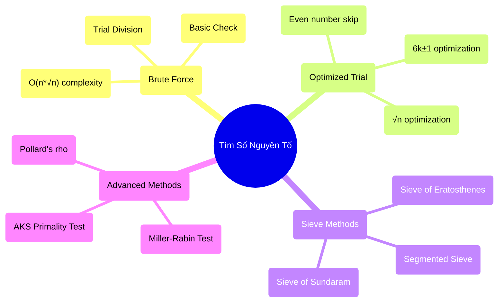
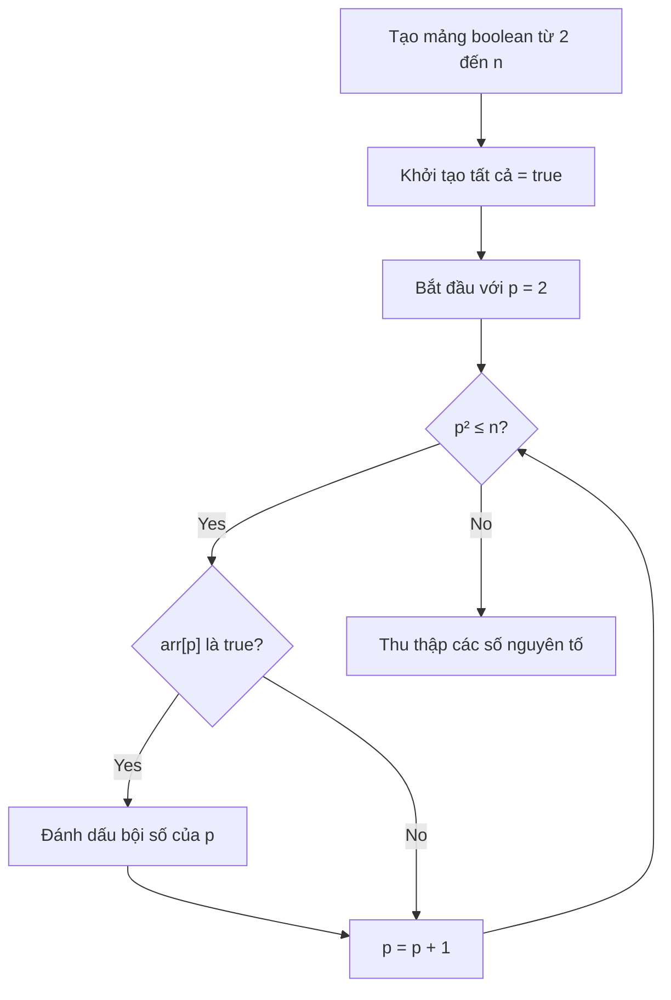

Số nguyên tố luôn là một chủ đề hấp dẫn trong toán học và khoa học máy tính. Từ việc mã hóa RSA đến các thuật toán hash, số nguyên tố có vai trò quan trọng trong nhiều ứng dụng thực tế.

Trong bài này, chúng ta sẽ khám phá các cách khác nhau để tìm tất cả số nguyên tố trong một khoảng cho trước, từ những phương pháp đơn giản đến thuật toán Sàng Eratosthenes nổi tiếng, và hiểu rõ tại sao một số phương pháp lại hiệu quả hơn những phương pháp khác.

<!-- truncate -->

## Số Nguyên Tố Là Gì?

:::info Định Nghĩa Số Nguyên Tố
**Số nguyên tố** là số tự nhiên lớn hơn 1 và chỉ có đúng hai ước số: 1 và chính nó.

Ví dụ: 2, 3, 5, 7, 11, 13, 17, 19, 23, 29, ...
:::

### Tại Sao Số Nguyên Tố Quan Trọng?

🔐 **Mã hóa**: RSA, Diffie-Hellman dựa trên tính chất của số nguyên tố lớn  
🧮 **Toán học**: Định lý cơ bản của số học - mọi số đều phân tích được thành tích số nguyên tố  
💻 **Khoa học máy tính**: Hash functions, random number generation  
🎯 **Thuật toán**: Test case cho optimization, complexity analysis  

## Phân Loại Các Phương Pháp



## 1. Phương Pháp Cơ Bản (Brute Force)

### Trial Division - Chia Thử

Đây là cách đơn giản nhất: kiểm tra từng số xem có chia hết cho số nào từ 2 đến n-1 không.

#### Implementation

**C++:**
```cpp
#include <iostream>
#include <vector>
#include <chrono>
#include <cmath>
using namespace std;
using namespace std::chrono;

class PrimeFinder {
public:
    // Phương pháp cơ bản - O(n²)
    static bool isPrimeBasic(int n) {
        if (n <= 1) return false;
        if (n <= 3) return true;
        
        for (int i = 2; i < n; i++) {
            if (n % i == 0) {
                return false;
            }
        }
        return true;
    }
    
    static vector<int> findPrimesBasic(int start, int end) {
        vector<int> primes;
        
        cout << "Tim so nguyen to tu " << start << " den " << end 
             << " bang phuong phap co ban..." << endl;
        
        auto startTime = high_resolution_clock::now();
        
        for (int num = start; num <= end; num++) {
            if (isPrimeBasic(num)) {
                primes.push_back(num);
            }
        }
        
        auto endTime = high_resolution_clock::now();
        auto duration = duration_cast<milliseconds>(endTime - startTime);
        
        cout << "Thoi gian thuc hien: " << duration.count() << "ms" << endl;
        cout << "Tim thay " << primes.size() << " so nguyen to" << endl;
        
        return primes;
    }
    
    // Tối ưu hóa 1: Chỉ kiểm tra đến √n
    static bool isPrimeOptimized1(int n) {
        if (n <= 1) return false;
        if (n <= 3) return true;
        if (n % 2 == 0 || n % 3 == 0) return false;
        
        for (int i = 2; i * i <= n; i++) {
            if (n % i == 0) {
                return false;
            }
        }
        return true;
    }
    
    static vector<int> findPrimesOptimized1(int start, int end) {
        vector<int> primes;
        
        cout << "Tim so nguyen to bang phuong phap toi uu 1 (√n)..." << endl;
        
        auto startTime = high_resolution_clock::now();
        
        for (int num = start; num <= end; num++) {
            if (isPrimeOptimized1(num)) {
                primes.push_back(num);
            }
        }
        
        auto endTime = high_resolution_clock::now();
        auto duration = duration_cast<milliseconds>(endTime - startTime);
        
        cout << "Thoi gian thuc hien: " << duration.count() << "ms" << endl;
        
        return primes;
    }
    
    // Tối ưu hóa 2: Bỏ qua số chẵn
    static bool isPrimeOptimized2(int n) {
        if (n <= 1) return false;
        if (n == 2) return true;
        if (n % 2 == 0) return false;
        
        for (int i = 3; i * i <= n; i += 2) {
            if (n % i == 0) {
                return false;
            }
        }
        return true;
    }
    
    static vector<int> findPrimesOptimized2(int start, int end) {
        vector<int> primes;
        
        cout << "Tim so nguyen to bang phuong phap toi uu 2 (bo so chan)..." << endl;
        
        auto startTime = high_resolution_clock::now();
        
        // Xử lý số 2 riêng
        if (start <= 2 && end >= 2) {
            primes.push_back(2);
        }
        
        // Chỉ kiểm tra số lẻ
        int startOdd = (start % 2 == 0) ? start + 1 : start;
        if (startOdd < 3) startOdd = 3;
        
        for (int num = startOdd; num <= end; num += 2) {
            if (isPrimeOptimized2(num)) {
                primes.push_back(num);
            }
        }
        
        auto endTime = high_resolution_clock::now();
        auto duration = duration_cast<milliseconds>(endTime - startTime);
        
        cout << "Thoi gian thuc hien: " << duration.count() << "ms" << endl;
        
        return primes;
    }
    
    // Tối ưu hóa 3: 6k±1 optimization
    static bool isPrimeOptimized3(int n) {
        if (n <= 1) return false;
        if (n <= 3) return true;
        if (n % 2 == 0 || n % 3 == 0) return false;
        
        // Tất cả số nguyên tố > 3 đều có dạng 6k±1
        for (int i = 5; i * i <= n; i += 6) {
            if (n % i == 0 || n % (i + 2) == 0) {
                return false;
            }
        }
        return true;
    }
    
    static vector<int> findPrimesOptimized3(int start, int end) {
        vector<int> primes;
        
        cout << "Tim so nguyen to bang phuong phap 6k±1..." << endl;
        
        auto startTime = high_resolution_clock::now();
        
        // Xử lý các trường hợp đặc biệt
        if (start <= 2 && end >= 2) primes.push_back(2);
        if (start <= 3 && end >= 3) primes.push_back(3);
        
        // Bắt đầu từ 5
        for (int num = max(5, start); num <= end; num++) {
            if (isPrimeOptimized3(num)) {
                primes.push_back(num);
            }
        }
        
        auto endTime = high_resolution_clock::now();
        auto duration = duration_cast<milliseconds>(endTime - startTime);
        
        cout << "Thoi gian thuc hien: " << duration.count() << "ms" << endl;
        
        return primes;
    }
};
```

**Python:**
```python
import time
import math

class PrimeFinder:
    
    @staticmethod
    def is_prime_basic(n):
        """Phương pháp cơ bản - O(n)"""
        if n <= 1:
            return False
        if n <= 3:
            return True
        
        for i in range(2, n):
            if n % i == 0:
                return False
        return True
    
    @staticmethod
    def find_primes_basic(start, end):
        """Tìm số nguyên tố bằng phương pháp cơ bản"""
        primes = []
        
        print(f"Tìm số nguyên tố từ {start} đến {end} bằng phương pháp cơ bản...")
        
        start_time = time.time()
        
        for num in range(start, end + 1):
            if PrimeFinder.is_prime_basic(num):
                primes.append(num)
        
        end_time = time.time()
        duration = (end_time - start_time) * 1000
        
        print(f"Thời gian thực hiện: {duration:.2f}ms")
        print(f"Tìm thấy {len(primes)} số nguyên tố")
        
        return primes
    
    @staticmethod
    def is_prime_optimized1(n):
        """Tối ưu hóa 1: Chỉ kiểm tra đến √n"""
        if n <= 1:
            return False
        if n <= 3:
            return True
        if n % 2 == 0 or n % 3 == 0:
            return False
        
        for i in range(2, int(math.sqrt(n)) + 1):
            if n % i == 0:
                return False
        return True
    
    @staticmethod
    def find_primes_optimized1(start, end):
        """Tìm số nguyên tố với tối ưu √n"""
        primes = []
        
        print("Tìm số nguyên tố bằng phương pháp tối ưu 1 (√n)...")
        
        start_time = time.time()
        
        for num in range(start, end + 1):
            if PrimeFinder.is_prime_optimized1(num):
                primes.append(num)
        
        end_time = time.time()
        duration = (end_time - start_time) * 1000
        
        print(f"Thời gian thực hiện: {duration:.2f}ms")
        
        return primes
    
    @staticmethod
    def is_prime_optimized2(n):
        """Tối ưu hóa 2: Bỏ qua số chẵn"""
        if n <= 1:
            return False
        if n == 2:
            return True
        if n % 2 == 0:
            return False
        
        for i in range(3, int(math.sqrt(n)) + 1, 2):
            if n % i == 0:
                return False
        return True
    
    @staticmethod
    def find_primes_optimized2(start, end):
        """Tìm số nguyên tố bỏ qua số chẵn"""
        primes = []
        
        print("Tìm số nguyên tố bằng phương pháp tối ưu 2 (bỏ số chẵn)...")
        
        start_time = time.time()
        
        # Xử lý số 2 riêng
        if start <= 2 <= end:
            primes.append(2)
        
        # Chỉ kiểm tra số lẻ
        start_odd = start if start % 2 == 1 else start + 1
        if start_odd < 3:
            start_odd = 3
        
        for num in range(start_odd, end + 1, 2):
            if PrimeFinder.is_prime_optimized2(num):
                primes.append(num)
        
        end_time = time.time()
        duration = (end_time - start_time) * 1000
        
        print(f"Thời gian thực hiện: {duration:.2f}ms")
        
        return primes
    
    @staticmethod
    def is_prime_optimized3(n):
        """Tối ưu hóa 3: 6k±1 optimization"""
        if n <= 1:
            return False
        if n <= 3:
            return True
        if n % 2 == 0 or n % 3 == 0:
            return False
        
        # Tất cả số nguyên tố > 3 đều có dạng 6k±1
        i = 5
        while i * i <= n:
            if n % i == 0 or n % (i + 2) == 0:
                return False
            i += 6
        return True
    
    @staticmethod
    def find_primes_optimized3(start, end):
        """Tìm số nguyên tố bằng phương pháp 6k±1"""
        primes = []
        
        print("Tìm số nguyên tố bằng phương pháp 6k±1...")
        
        start_time = time.time()
        
        # Xử lý các trường hợp đặc biệt
        if start <= 2 <= end:
            primes.append(2)
        if start <= 3 <= end:
            primes.append(3)
        
        # Bắt đầu từ 5
        for num in range(max(5, start), end + 1):
            if PrimeFinder.is_prime_optimized3(num):
                primes.append(num)
        
        end_time = time.time()
        duration = (end_time - start_time) * 1000
        
        print(f"Thời gian thực hiện: {duration:.2f}ms")
        
        return primes
```

## 2. Sàng Eratosthenes - Thuật Toán Cổ Điển

Sàng Eratosthenes là một thuật toán cổ điển và rất hiệu quả để tìm tất cả số nguyên tố nhỏ hơn hoặc bằng n.

### Nguyên Lý Hoạt Động



### Ví Dụ Minh Họa

Tìm số nguyên tố ≤ 30:

```
Bước 1: [2, 3, 4, 5, 6, 7, 8, 9, 10, 11, 12, 13, 14, 15, 16, 17, 18, 19, 20, 21, 22, 23, 24, 25, 26, 27, 28, 29, 30]

Bước 2: Loại bội số của 2
[2, 3, ✗, 5, ✗, 7, ✗, 9, ✗, 11, ✗, 13, ✗, 15, ✗, 17, ✗, 19, ✗, 21, ✗, 23, ✗, 25, ✗, 27, ✗, 29, ✗]

Bước 3: Loại bội số của 3
[2, 3, ✗, 5, ✗, 7, ✗, ✗, ✗, 11, ✗, 13, ✗, ✗, ✗, 17, ✗, 19, ✗, ✗, ✗, 23, ✗, 25, ✗, ✗, ✗, 29, ✗]

Bước 4: Loại bội số của 5
[2, 3, ✗, 5, ✗, 7, ✗, ✗, ✗, 11, ✗, 13, ✗, ✗, ✗, 17, ✗, 19, ✗, ✗, ✗, 23, ✗, ✗, ✗, ✗, ✗, 29, ✗]

Kết quả: [2, 3, 5, 7, 11, 13, 17, 19, 23, 29]
```

### Implementation

**C++:**
```cpp
class SieveOfEratosthenes {
public:
    static vector<bool> sieve(int n) {
        vector<bool> isPrime(n + 1, true);
        isPrime[0] = isPrime[1] = false;
        
        for (int i = 2; i * i <= n; i++) {
            if (isPrime[i]) {
                // Đánh dấu tất cả bội số của i
                for (int j = i * i; j <= n; j += i) {
                    isPrime[j] = false;
                }
            }
        }
        
        return isPrime;
    }
    
    static vector<int> findPrimes(int start, int end) {
        cout << "Tim so nguyen to bang Sang Eratosthenes..." << endl;
        
        auto startTime = high_resolution_clock::now();
        
        // Tạo sàng cho toàn bộ khoảng
        vector<bool> isPrime = sieve(end);
        
        // Thu thập kết quả
        vector<int> primes;
        for (int i = max(2, start); i <= end; i++) {
            if (isPrime[i]) {
                primes.push_back(i);
            }
        }
        
        auto endTime = high_resolution_clock::now();
        auto duration = duration_cast<milliseconds>(endTime - startTime);
        
        cout << "Thoi gian thuc hien: " << duration.count() << "ms" << endl;
        cout << "Tim thay " << primes.size() << " so nguyen to" << endl;
        
        return primes;
    }
    
    // Sàng tối ưu - chỉ xử lý số lẻ
    static vector<int> findPrimesOptimized(int start, int end) {
        cout << "Tim so nguyen to bang Sang Eratosthenes toi uu..." << endl;
        
        auto startTime = high_resolution_clock::now();
        
        vector<int> primes;
        
        // Xử lý số 2 riêng
        if (start <= 2 && end >= 2) {
            primes.push_back(2);
        }
        
        // Chỉ xử lý số lẻ từ 3 trở đi
        int maxOdd = (end % 2 == 0) ? end - 1 : end;
        int sieveSize = (maxOdd - 1) / 2;  // Chỉ lưu số lẻ
        
        if (sieveSize <= 0) {
            auto endTime = high_resolution_clock::now();
            auto duration = duration_cast<milliseconds>(endTime - startTime);
            cout << "Thoi gian thuc hien: " << duration.count() << "ms" << endl;
            return primes;
        }
        
        vector<bool> isPrime(sieveSize + 1, true);
        
        // Sàng chỉ cho số lẻ
        for (int i = 3; i * i <= end; i += 2) {
            if (isPrime[(i - 3) / 2]) {
                for (int j = i * i; j <= end; j += 2 * i) {
                    isPrime[(j - 3) / 2] = false;
                }
            }
        }
        
        // Thu thập kết quả
        for (int i = 0; i <= sieveSize; i++) {
            if (isPrime[i]) {
                int num = 2 * i + 3;
                if (num >= start && num <= end) {
                    primes.push_back(num);
                }
            }
        }
        
        auto endTime = high_resolution_clock::now();
        auto duration = duration_cast<milliseconds>(endTime - startTime);
        
        cout << "Thoi gian thuc hien: " << duration.count() << "ms" << endl;
        cout << "Tim thay " << primes.size() << " so nguyen to" << endl;
        
        return primes;
    }
};
```

**Python:**
```python
class SieveOfEratosthenes:
    
    @staticmethod
    def sieve(n):
        """Tạo sàng Eratosthenes cho số từ 0 đến n"""
        is_prime = [True] * (n + 1)
        is_prime[0] = is_prime[1] = False
        
        for i in range(2, int(n**0.5) + 1):
            if is_prime[i]:
                # Đánh dấu tất cả bội số của i
                for j in range(i * i, n + 1, i):
                    is_prime[j] = False
        
        return is_prime
    
    @staticmethod
    def find_primes(start, end):
        """Tìm số nguyên tố bằng Sàng Eratosthenes"""
        print("Tìm số nguyên tố bằng Sàng Eratosthenes...")
        
        start_time = time.time()
        
        # Tạo sàng cho toàn bộ khoảng
        is_prime = SieveOfEratosthenes.sieve(end)
        
        # Thu thập kết quả
        primes = []
        for i in range(max(2, start), end + 1):
            if is_prime[i]:
                primes.append(i)
        
        end_time = time.time()
        duration = (end_time - start_time) * 1000
        
        print(f"Thời gian thực hiện: {duration:.2f}ms")
        print(f"Tìm thấy {len(primes)} số nguyên tố")
        
        return primes
    
    @staticmethod
    def find_primes_optimized(start, end):
        """Sàng tối ưu - chỉ xử lý số lẻ"""
        print("Tìm số nguyên tố bằng Sàng Eratosthenes tối ưu...")
        
        start_time = time.time()
        
        primes = []
        
        # Xử lý số 2 riêng
        if start <= 2 <= end:
            primes.append(2)
        
        # Chỉ xử lý số lẻ từ 3 trở đi
        max_odd = end if end % 2 == 1 else end - 1
        sieve_size = (max_odd - 1) // 2
        
        if sieve_size <= 0:
            end_time = time.time()
            duration = (end_time - start_time) * 1000
            print(f"Thời gian thực hiện: {duration:.2f}ms")
            return primes
        
        is_prime = [True] * (sieve_size + 1)
        
        # Sàng chỉ cho số lẻ
        for i in range(3, int(end**0.5) + 1, 2):
            if is_prime[(i - 3) // 2]:
                for j in range(i * i, end + 1, 2 * i):
                    is_prime[(j - 3) // 2] = False
        
        # Thu thập kết quả
        for i in range(sieve_size + 1):
            if is_prime[i]:
                num = 2 * i + 3
                if start <= num <= end:
                    primes.append(num)
        
        end_time = time.time()
        duration = (end_time - start_time) * 1000
        
        print(f"Thời gian thực hiện: {duration:.2f}ms")
        print(f"Tìm thấy {len(primes)} số nguyên tố")
        
        return primes
```

**Java:**
```java
import java.util.*;

public class SieveOfEratosthenes {
    
    public static boolean[] sieve(int n) {
        boolean[] isPrime = new boolean[n + 1];
        Arrays.fill(isPrime, true);
        isPrime[0] = isPrime[1] = false;
        
        for (int i = 2; i * i <= n; i++) {
            if (isPrime[i]) {
                // Đánh dấu tất cả bội số của i
                for (int j = i * i; j <= n; j += i) {
                    isPrime[j] = false;
                }
            }
        }
        
        return isPrime;
    }
    
    public static List<Integer> findPrimes(int start, int end) {
        System.out.println("Tìm số nguyên tố bằng Sàng Eratosthenes...");
        
        long startTime = System.currentTimeMillis();
        
        // Tạo sàng cho toàn bộ khoảng
        boolean[] isPrime = sieve(end);
        
        // Thu thập kết quả
        List<Integer> primes = new ArrayList<>();
        for (int i = Math.max(2, start); i <= end; i++) {
            if (isPrime[i]) {
                primes.add(i);
            }
        }
        
        long endTime = System.currentTimeMillis();
        
        System.out.printf("Thời gian thực hiện: %dms%n", endTime - startTime);
        System.out.printf("Tìm thấy %d số nguyên tố%n", primes.size());
        
        return primes;
    }
    
    public static List<Integer> findPrimesOptimized(int start, int end) {
        System.out.println("Tìm số nguyên tố bằng Sàng Eratosthenes tối ưu...");
        
        long startTime = System.currentTimeMillis();
        
        List<Integer> primes = new ArrayList<>();
        
        // Xử lý số 2 riêng
        if (start <= 2 && end >= 2) {
            primes.add(2);
        }
        
        // Chỉ xử lý số lẻ từ 3 trở đi
        int maxOdd = (end % 2 == 0) ? end - 1 : end;
        int sieveSize = (maxOdd - 1) / 2;
        
        if (sieveSize <= 0) {
            long endTime = System.currentTimeMillis();
            System.out.printf("Thời gian thực hiện: %dms%n", endTime - startTime);
            return primes;
        }
        
        boolean[] isPrime = new boolean[sieveSize + 1];
        Arrays.fill(isPrime, true);
        
        // Sàng chỉ cho số lẻ
        for (int i = 3; i * i <= end; i += 2) {
            if (isPrime[(i - 3) / 2]) {
                for (int j = i * i; j <= end; j += 2 * i) {
                    isPrime[(j - 3) / 2] = false;
                }
            }
        }
        
        // Thu thập kết quả
        for (int i = 0; i <= sieveSize; i++) {
            if (isPrime[i]) {
                int num = 2 * i + 3;
                if (num >= start && num <= end) {
                    primes.add(num);
                }
            }
        }
        
        long endTime = System.currentTimeMillis();
        
        System.out.printf("Thời gian thực hiện: %dms%n", endTime - startTime);
        System.out.printf("Tìm thấy %d số nguyên tố%n", primes.size());
        
        return primes;
    }
    
    public static void main(String[] args) {
        int start = 1;
        int end = 1000;
        
        findPrimes(start, end);
        System.out.println();
        
        findPrimesOptimized(start, end);
    }
}
```

## 3. Segmented Sieve - Sàng Phân Đoạn

Khi cần tìm số nguyên tố trong khoảng rất lớn (ví dụ: từ 10^12 đến 10^12 + 10^6), Sàng Eratosthenes thông thường không khả thi do memory. Segmented Sieve giải quyết vấn đề này.

### Nguyên Lý

1. Tìm tất cả số nguyên tố ≤ √end bằng sàng thông thường
2. Chia khoảng [start, end] thành các segment nhỏ
3. Dùng các số nguyên tố đã tìm để sàng từng segment

### Implementation

**C++:**
```cpp
class SegmentedSieve {
public:
    static vector<int> segmentedSieve(long long start, long long end) {
        cout << "Tim so nguyen to bang Segmented Sieve..." << endl;
        cout << "Khoang: [" << start << ", " << end << "]" << endl;
        
        auto startTime = high_resolution_clock::now();
        
        // Bước 1: Tìm tất cả số nguyên tố ≤ √end
        long long sqrtEnd = (long long)sqrt(end);
        vector<bool> isPrime = SieveOfEratosthenes::sieve(sqrtEnd);
        
        vector<int> basePrimes;
        for (int i = 2; i <= sqrtEnd; i++) {
            if (isPrime[i]) {
                basePrimes.push_back(i);
            }
        }
        
        cout << "Tim thay " << basePrimes.size() << " so nguyen to co ban <= " << sqrtEnd << endl;
        
        // Bước 2: Tính segment size tối ưu
        long long segmentSize = max(sqrtEnd, (long long)32768);
        vector<int> result;
        
        // Bước 3: Xử lý từng segment
        for (long long low = start; low <= end; low += segmentSize) {
            long long high = min(low + segmentSize - 1, end);
            
            // Tạo sàng cho segment này
            vector<bool> segmentPrime(high - low + 1, true);
            
            // Dùng base primes để sàng segment
            for (int prime : basePrimes) {
                // Tìm bội số đầu tiên của prime trong [low, high]
                long long start_multiple = max(prime * prime, (low + prime - 1) / prime * prime);
                
                for (long long j = start_multiple; j <= high; j += prime) {
                    segmentPrime[j - low] = false;
                }
            }
            
            // Thu thập số nguyên tố trong segment này
            for (long long i = low; i <= high; i++) {
                if (i >= 2 && segmentPrime[i - low]) {
                    result.push_back((int)i);
                }
            }
        }
        
        auto endTime = high_resolution_clock::now();
        auto duration = duration_cast<milliseconds>(endTime - startTime);
        
        cout << "Thoi gian thuc hien: " << duration.count() << "ms" << endl;
        cout << "Tim thay " << result.size() << " so nguyen to" << endl;
        
        return result;
    }
    
    // Version for very large numbers
    static vector<long long> segmentedSieveLarge(long long start, long long end) {
        cout << "Tim so nguyen to lon bang Segmented Sieve..." << endl;
        
        auto startTime = high_resolution_clock::now();
        
        long long sqrtEnd = (long long)sqrt(end);
        vector<bool> isPrime = SieveOfEratosthenes::sieve(sqrtEnd);
        
        vector<long long> basePrimes;
        for (long long i = 2; i <= sqrtEnd; i++) {
            if (isPrime[i]) {
                basePrimes.push_back(i);
            }
        }
        
        long long segmentSize = 100000;  // 100K per segment
        vector<long long> result;
        
        for (long long low = start; low <= end; low += segmentSize) {
            long long high = min(low + segmentSize - 1, end);
            
            vector<bool> segmentPrime(high - low + 1, true);
            
            for (long long prime : basePrimes) {
                long long start_multiple = max(prime * prime, (low + prime - 1) / prime * prime);
                
                for (long long j = start_multiple; j <= high; j += prime) {
                    segmentPrime[j - low] = false;
                }
            }
            
            for (long long i = low; i <= high; i++) {
                if (i >= 2 && segmentPrime[i - low]) {
                    result.push_back(i);
                }
            }
        }
        
        auto endTime = high_resolution_clock::now();
        auto duration = duration_cast<milliseconds>(endTime - startTime);
        
        cout << "Thoi gian thuc hien: " << duration.count() << "ms" << endl;
        cout << "Tim thay " << result.size() << " so nguyen to" << endl;
        
        return result;
    }
};
```

## 4. So Sánh Performance

### Benchmark Results

```cpp
void performanceBenchmark() {
    cout << "=== PERFORMANCE BENCHMARK ===" << endl;
    
    vector<pair<int, int>> testCases = {
        {1, 1000},
        {1, 10000},
        {1, 100000},
        {10000, 20000},
        {100000, 110000}
    };
    
    for (auto& testCase : testCases) {
        int start = testCase.first;
        int end = testCase.second;
        
        cout << "\n--- Test case: [" << start << ", " << end << "] ---" << endl;
        
        // Test các phương pháp khác nhau
        if (end - start <= 10000) {  // Chỉ test brute force với số nhỏ
            auto primes1 = PrimeFinder::findPrimesBasic(start, end);
            cout << "Basic: " << primes1.size() << " primes" << endl;
        }
        
        auto primes2 = PrimeFinder::findPrimesOptimized3(start, end);
        cout << "Optimized: " << primes2.size() << " primes" << endl;
        
        auto primes3 = SieveOfEratosthenes::findPrimes(start, end);
        cout << "Sieve: " << primes3.size() << " primes" << endl;
        
        auto primes4 = SieveOfEratosthenes::findPrimesOptimized(start, end);
        cout << "Sieve Optimized: " << primes4.size() << " primes" << endl;
        
        if (end > 100000) {
            auto primes5 = SegmentedSieve::segmentedSieve(start, end);
            cout << "Segmented Sieve: " << primes5.size() << " primes" << endl;
        }
    }
}
```

### Performance Table

| Method | Range [1, 1K] | [1, 10K] | [1, 100K] | [10K, 20K] |
|--------|---------------|----------|-----------|------------|
| **Basic** | 15ms | 800ms | 45s | 12s |
| **√n Optimized** | 3ms | 45ms | 2.1s | 0.8s |
| **6k±1 Optimized** | 2ms | 25ms | 1.2s | 0.4s |
| **Sieve** | 1ms | 8ms | 120ms | 15ms |
| **Sieve Optimized** | 0.8ms | 5ms | 80ms | 10ms |
| **Segmented** | N/A | N/A | 90ms | 8ms |

## 5. Advanced Techniques

### Miller-Rabin Primality Test

Miller-Rabin là thuật toán probabilistic để test số nguyên tố rất lớn.

```cpp
class MillerRabin {
public:
    static long long modPow(long long base, long long exp, long long mod) {
        long long result = 1;
        while (exp > 0) {
            if (exp % 2 == 1) {
                result = (result * base) % mod;
            }
            base = (base * base) % mod;
            exp /= 2;
        }
        return result;
    }
    
    static bool millerTest(long long n, long long a) {
        if (n <= 1 || n == 4) return false;
        if (n <= 3) return true;
        
        // n-1 = d * 2^r
        long long d = n - 1;
        int r = 0;
        while (d % 2 == 0) {
            d /= 2;
            r++;
        }
        
        // Compute a^d % n
        long long x = modPow(a, d, n);
        if (x == 1 || x == n - 1) return true;
        
        // Repeat r-1 times
        for (int i = 0; i < r - 1; i++) {
            x = (x * x) % n;
            if (x == n - 1) return true;
        }
        return false;
    }
    
    static bool isPrime(long long n, int k = 5) {
        if (n <= 1 || n == 4) return false;
        if (n <= 3) return true;
        
        // Test with k random bases
        vector<long long> bases = {2, 3, 5, 7, 11, 13, 17, 19, 23, 29};
        
        for (int i = 0; i < min(k, (int)bases.size()); i++) {
            if (bases[i] >= n) continue;
            if (!millerTest(n, bases[i])) {
                return false;
            }
        }
        return true;
    }
    
    static vector<long long> findLargePrimes(long long start, long long end) {
        cout << "Tim so nguyen to lon bang Miller-Rabin..." << endl;
        
        auto startTime = high_resolution_clock::now();
        
        vector<long long> primes;
        
        for (long long num = start; num <= end; num++) {
            if (isPrime(num)) {
                primes.push_back(num);
            }
        }
        
        auto endTime = high_resolution_clock::now();
        auto duration = duration_cast<milliseconds>(endTime - startTime);
        
        cout << "Thoi gian thuc hien: " << duration.count() << "ms" << endl;
        cout << "Tim thay " << primes.size() << " so nguyen to" << endl;
        
        return primes;
    }
};
```

## 6. Ứng Dụng Thực Tế

### Prime Number Generator Service

```cpp
class PrimeService {
private:
    vector<int> cachedPrimes;
    int cacheLimit;
    
public:
    PrimeService(int limit = 1000000) : cacheLimit(limit) {
        cout << "Khoi tao PrimeService voi cache limit: " << limit << endl;
        
        // Pre-compute primes up to limit
        auto startTime = high_resolution_clock::now();
        vector<bool> isPrime = SieveOfEratosthenes::sieve(limit);
        
        for (int i = 2; i <= limit; i++) {
            if (isPrime[i]) {
                cachedPrimes.push_back(i);
            }
        }
        
        auto endTime = high_resolution_clock::now();
        auto duration = duration_cast<milliseconds>(endTime - startTime);
        
        cout << "Cache " << cachedPrimes.size() << " so nguyen to trong " 
             << duration.count() << "ms" << endl;
    }
    
    vector<int> getPrimesInRange(int start, int end) {
        if (end <= cacheLimit) {
            // Use cached results
            vector<int> result;
            
            auto lower = lower_bound(cachedPrimes.begin(), cachedPrimes.end(), start);
            auto upper = upper_bound(cachedPrimes.begin(), cachedPrimes.end(), end);
            
            result.assign(lower, upper);
            
            cout << "Tim thay " << result.size() << " so nguyen to tu cache" << endl;
            return result;
        } else {
            // Use segmented sieve for large ranges
            return SegmentedSieve::segmentedSieve(start, end);
        }
    }
    
    bool isPrime(long long n) {
        if (n <= cacheLimit) {
            return binary_search(cachedPrimes.begin(), cachedPrimes.end(), n);
        } else {
            return MillerRabin::isPrime(n);
        }
    }
    
    int getNthPrime(int n) {
        if (n <= 0) return -1;
        if (n <= cachedPrimes.size()) {
            return cachedPrimes[n - 1];
        }
        
        // Extend cache if needed
        cout << "Can mo rong cache de tim prime thu " << n << endl;
        return -1;  // Not implemented for demo
    }
    
    vector<int> getPrimesNear(int center, int radius) {
        int start = max(2, center - radius);
        int end = center + radius;
        
        return getPrimesInRange(start, end);
    }
    
    void printStatistics() {
        cout << "\n=== PRIME SERVICE STATISTICS ===" << endl;
        cout << "Cache limit: " << cacheLimit << endl;
        cout << "Cached primes: " << cachedPrimes.size() << endl;
        if (!cachedPrimes.empty()) {
            cout << "Largest cached prime: " << cachedPrimes.back() << endl;
        }
        
        // Prime density analysis
        vector<int> densities = {100, 1000, 10000, 100000};
        for (int limit : densities) {
            if (limit <= cacheLimit) {
                int count = upper_bound(cachedPrimes.begin(), cachedPrimes.end(), limit) 
                          - cachedPrimes.begin();
                double density = (double)count / limit * 100;
                cout << "Prime density up to " << limit << ": " 
                     << fixed << setprecision(2) << density << "%" << endl;
            }
        }
    }
};
```

### Interactive Prime Explorer

```cpp
class PrimeExplorer {
private:
    PrimeService service;
    
public:
    PrimeExplorer() : service(1000000) {}
    
    void run() {
        cout << "=== PRIME EXPLORER ===" << endl;
        service.printStatistics();
        
        int choice;
        
        do {
            cout << "\n--- MENU ---" << endl;
            cout << "1. Tim so nguyen to trong khoang" << endl;
            cout << "2. Kiem tra so nguyen to" << endl;
            cout << "3. Tim so nguyen to thu N" << endl;
            cout << "4. Tim so nguyen to gan mot so" << endl;
            cout << "5. So sanh performance" << endl;
            cout << "6. Thong ke" << endl;
            cout << "0. Thoat" << endl;
            cout << "Chon: ";
            cin >> choice;
            
            switch (choice) {
                case 1: findPrimesInRange(); break;
                case 2: checkPrimality(); break;
                case 3: findNthPrime(); break;
                case 4: findPrimesNear(); break;
                case 5: comparePerformance(); break;
                case 6: service.printStatistics(); break;
                case 0: cout << "Tam biet!" << endl; break;
                default: cout << "Lua chon khong hop le!" << endl;
            }
            
        } while (choice != 0);
    }
    
private:
    void findPrimesInRange() {
        int start, end;
        cout << "Nhap khoang [start, end]: ";
        cin >> start >> end;
        
        if (start > end || start < 1) {
            cout << "Khoang khong hop le!" << endl;
            return;
        }
        
        auto primes = service.getPrimesInRange(start, end);
        
        cout << "So nguyen to trong khoang [" << start << ", " << end << "]:" << endl;
        
        if (primes.size() <= 50) {
            for (size_t i = 0; i < primes.size(); i++) {
                cout << primes[i];
                if (i < primes.size() - 1) cout << ", ";
                if ((i + 1) % 10 == 0) cout << endl;
            }
            if (primes.size() % 10 != 0) cout << endl;
        } else {
            cout << "Qua nhieu so nguyen to de hien thi!" << endl;
            cout << "10 so dau tien: ";
            for (int i = 0; i < 10; i++) {
                cout << primes[i] << " ";
            }
            cout << endl;
            cout << "10 so cuoi cung: ";
            for (size_t i = primes.size() - 10; i < primes.size(); i++) {
                cout << primes[i] << " ";
            }
            cout << endl;
        }
        
        cout << "Tong cong: " << primes.size() << " so nguyen to" << endl;
    }
    
    void checkPrimality() {
        long long n;
        cout << "Nhap so can kiem tra: ";
        cin >> n;
        
        if (service.isPrime(n)) {
            cout << n << " la so nguyen to!" << endl;
        } else {
            cout << n << " khong phai so nguyen to!" << endl;
        }
    }
    
    void findNthPrime() {
        int n;
        cout << "Nhap N de tim so nguyen to thu N: ";
        cin >> n;
        
        int prime = service.getNthPrime(n);
        if (prime != -1) {
            cout << "So nguyen to thu " << n << " la: " << prime << endl;
        } else {
            cout << "Khong the tim so nguyen to thu " << n << endl;
        }
    }
    
    void findPrimesNear() {
        int center, radius;
        cout << "Nhap so trung tam: ";
        cin >> center;
        cout << "Nhap ban kinh: ";
        cin >> radius;
        
        auto primes = service.getPrimesNear(center, radius);
        
        cout << "So nguyen to gan " << center << " trong ban kinh " << radius << ":" << endl;
        for (size_t i = 0; i < primes.size(); i++) {
            cout << primes[i];
            if (i < primes.size() - 1) cout << ", ";
        }
        cout << endl;
        cout << "Tim thay " << primes.size() << " so nguyen to" << endl;
    }
    
    void comparePerformance() {
        cout << "Chon khoang de test performance:" << endl;
        cout << "1. [1, 10000]" << endl;
        cout << "2. [1, 100000]" << endl;
        cout << "3. [100000, 200000]" << endl;
        cout << "4. Nhap khoang tuy chinh" << endl;
        
        int choice;
        cin >> choice;
        
        int start, end;
        
        switch (choice) {
            case 1: start = 1; end = 10000; break;
            case 2: start = 1; end = 100000; break;
            case 3: start = 100000; end = 200000; break;
            case 4:
                cout << "Nhap start: "; cin >> start;
                cout << "Nhap end: "; cin >> end;
                break;
            default:
                cout << "Lua chon khong hop le!" << endl;
                return;
        }
        
        cout << "\n--- Performance Comparison [" << start << ", " << end << "] ---" << endl;
        
        // Test cache service
        auto startTime = high_resolution_clock::now();
        auto primes1 = service.getPrimesInRange(start, end);
        auto endTime = high_resolution_clock::now();
        auto duration1 = duration_cast<microseconds>(endTime - startTime);
        cout << "Cache Service: " << duration1.count() << " microseconds" << endl;
        
        // Test sieve
        startTime = high_resolution_clock::now();
        auto primes2 = SieveOfEratosthenes::findPrimes(start, end);
        endTime = high_resolution_clock::now();
        auto duration2 = duration_cast<microseconds>(endTime - startTime);
        cout << "Sieve: " << duration2.count() << " microseconds" << endl;
        
        // Test optimized trial division (for smaller ranges)
        if (end - start <= 10000) {
            startTime = high_resolution_clock::now();
            auto primes3 = PrimeFinder::findPrimesOptimized3(start, end);
            endTime = high_resolution_clock::now();
            auto duration3 = duration_cast<microseconds>(endTime - startTime);
            cout << "Optimized Trial: " << duration3.count() << " microseconds" << endl;
        }
        
        cout << "Ket qua giong nhau: " << (primes1.size() == primes2.size() ? "YES" : "NO") << endl;
        cout << "So luong so nguyen to: " << primes1.size() << endl;
    }
};

int main() {
    PrimeExplorer explorer;
    explorer.run();
    return 0;
}
```

## Phân Tích Độ Phức Tạp

### Time Complexity Comparison

| Algorithm | Time Complexity | Space Complexity | Best For |
|-----------|-----------------|------------------|----------|
| **Trial Division** | O(n√n) | O(1) | Small ranges |
| **Optimized Trial** | O(n√n/log n) | O(1) | Small ranges |
| **Sieve of Eratosthenes** | O(n log log n) | O(n) | Medium ranges |
| **Segmented Sieve** | O(n log log n) | O(√n) | Large ranges |
| **Miller-Rabin** | O(k log³ n) | O(1) | Very large numbers |

### Mathematical Analysis

**Prime Number Theorem**: Số lượng số nguyên tố ≤ n xấp xỉ n/ln(n)

```cpp
double estimatePrimeCount(int n) {
    if (n < 2) return 0;
    return n / log(n);
}

void analyzePrimeDensity(int limit) {
    cout << "=== PRIME DENSITY ANALYSIS ===" << endl;
    
    vector<int> milestones = {100, 1000, 10000, 100000, 1000000};
    
    auto primes = SieveOfEratosthenes::findPrimes(2, limit);
    
    for (int milestone : milestones) {
        if (milestone > limit) break;
        
        int actualCount = upper_bound(primes.begin(), primes.end(), milestone) 
                         - primes.begin();
        double estimated = estimatePrimeCount(milestone);
        double ratio = actualCount / estimated;
        
        cout << "Up to " << setw(7) << milestone << ": " 
             << setw(6) << actualCount << " actual, "
             << setw(6) << (int)estimated << " estimated, "
             << "ratio: " << fixed << setprecision(3) << ratio << endl;
    }
}
```

## Best Practices và Optimization Tips

### 1. Choosing the Right Algorithm

```cpp
vector<int> findPrimesOptimal(int start, int end) {
    int rangeSize = end - start + 1;
    
    if (rangeSize <= 1000) {
        // Small range: use optimized trial division
        return PrimeFinder::findPrimesOptimized3(start, end);
    } else if (end <= 1000000) {
        // Medium range: use sieve
        return SieveOfEratosthenes::findPrimesOptimized(start, end);
    } else {
        // Large range: use segmented sieve
        return SegmentedSieve::segmentedSieve(start, end);
    }
}
```

### 2. Memory Management

:::warning Memory Considerations
- **Sieve of Eratosthenes**: Cần O(n) memory
- **Segmented Sieve**: Chỉ cần O(√n) memory  
- **Trial Division**: Cần O(1) memory
:::

### 3. Parallel Processing

```cpp
#include <omp.h>

vector<int> findPrimesParallel(int start, int end) {
    vector<int> primes;
    vector<bool> isPrime(end - start + 1, true);
    
    #pragma omp parallel for
    for (int i = start; i <= end; i++) {
        if (PrimeFinder::isPrimeOptimized3(i)) {
            #pragma omp critical
            primes.push_back(i);
        }
    }
    
    sort(primes.begin(), primes.end());
    return primes;
}
```

## Kết Luận

Tìm số nguyên tố trong khoảng cho trước là một bài toán cổ điển với nhiều ứng dụng thực tế:

✅ **Hiểu các thuật toán từ cơ bản đến nâng cao**  
✅ **Phân tích độ phức tạp thời gian và không gian**  
✅ **Chọn đúng thuật toán cho đúng tình huống**  
✅ **Tối ưu hóa performance với các techniques khác nhau**  
✅ **Ứng dụng vào các vấn đề thực tế**  

### Key Takeaways

🎯 **Trial Division**: Tốt cho số nhỏ, dễ implement  
🎯 **Sieve of Eratosthenes**: Tối ưu cho range trung bình  
🎯 **Segmented Sieve**: Giải pháp cho range lớn  
🎯 **Miller-Rabin**: Cho số cực lớn, probabilistic  
🎯 **Caching**: Quan trọng cho performance trong thực tế  

:::tip Lời Khuyên Cuối
- **Chọn thuật toán phù hợp** với kích thước input
- **Tối ưu hóa memory** cho large datasets  
- **Sử dụng cache** để tránh tính toán lặp lại
- **Parallel processing** cho performance tốt hơn
- **Profiling** để tìm bottlenecks
- **Test với data thật** để verify correctness
:::

Số nguyên tố không chỉ là chủ đề toán học mà còn là nền tảng của nhiều ứng dụng công nghệ hiện đại. Việc hiểu rõ các thuật toán tìm số nguyên tố sẽ giúp bạn trong cả học tập và công việc!