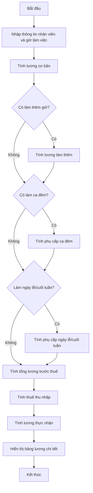

Tính tiền lương dựa trên giờ làm việc là một trong những ứng dụng phổ biến của lập trình trong quản lý nhân sự và tài chính. Bài toán này không chỉ đơn thuần là nhân số giờ làm với mức lương, mà còn liên quan đến nhiều quy tắc phức tạp như tính làm thêm giờ, phụ cấp theo ca, thuế và các khoản khấu trừ. Hiểu và ứng dụng được những khái niệm này sẽ giúp bạn không chỉ xây dựng hệ thống tính lương cơ bản mà còn là nền tảng cho các ứng dụng quản lý nhân sự chuyên nghiệp.

Trong bài viết này, chúng ta sẽ xây dựng một chương trình tính lương toàn diện từ cơ bản đến nâng cao, đồng thời triển khai nó trong nhiều ngôn ngữ lập trình phổ biến. Qua đó, bạn sẽ nắm được cách áp dụng cấu trúc điều khiển, xử lý điều kiện và tính toán trong thực tế.

<!-- truncate -->

## Hiểu rõ bài toán tính lương theo giờ làm việc

Trước khi bắt đầu lập trình, hãy hiểu rõ về quy tắc tính lương theo giờ và các yếu tố ảnh hưởng:

### Các thành phần của tiền lương theo giờ

1. **Lương cơ bản**: Số tiền trả cho mỗi giờ làm việc trong thời gian làm việc tiêu chuẩn (thường là 8 giờ/ngày hoặc 40 giờ/tuần)
2. **Làm thêm giờ (Overtime)**: Tiền lương trả cho thời gian làm việc vượt quá thời gian tiêu chuẩn, thường được tính với hệ số cao hơn (1.5x hoặc 2x)
3. **Phụ cấp ca đêm**: Khoản bổ sung khi làm việc vào ca đêm (thường từ 22:00 đến 6:00)
4. **Phụ cấp ngày lễ/cuối tuần**: Khoản bổ sung khi làm việc vào ngày lễ hoặc cuối tuần
5. **Thuế và khấu trừ**: Các khoản thuế thu nhập và bảo hiểm xã hội được khấu trừ từ tổng lương

### Các công thức tính lương cơ bản

1. **Lương cơ bản**:
   ```
   Lương cơ bản = Số giờ làm việc tiêu chuẩn * Mức lương theo giờ
   ```

2. **Lương làm thêm giờ**:
   ```
   Lương làm thêm = Số giờ làm thêm * Mức lương theo giờ * Hệ số làm thêm
   ```

3. **Phụ cấp ca đêm**:
   ```
   Phụ cấp ca đêm = Số giờ làm ca đêm * Mức phụ cấp ca đêm
   ```

4. **Tổng lương trước thuế**:
   ```
   Tổng lương trước thuế = Lương cơ bản + Lương làm thêm + Phụ cấp
   ```

5. **Thuế thu nhập**:
   ```
   Thuế thu nhập = Tổng lương trước thuế * Tỷ lệ thuế
   ```

6. **Lương thực nhận**:
   ```
   Lương thực nhận = Tổng lương trước thuế - Thuế thu nhập - Các khoản khấu trừ khác
   ```

## Thiết kế chương trình tính lương

Trước khi đi vào code, chúng ta cần phác thảo thiết kế của chương trình tính lương để đảm bảo tính rõ ràng và dễ bảo trì:

### Thông số đầu vào cần thiết

1. Số giờ làm việc cơ bản
2. Số giờ làm thêm
3. Số giờ làm ca đêm
4. Mức lương theo giờ
5. Hệ số làm thêm giờ
6. Mức phụ cấp ca đêm
7. Tỷ lệ thuế thu nhập
8. Các thông tin bổ sung (ngày làm việc cuối tuần, ngày lễ...)

### Các bước tính toán



## Triển khai chương trình

Bây giờ chúng ta sẽ triển khai chương trình tính lương trong ba ngôn ngữ lập trình phổ biến: C++, Python, và Java. Mỗi phiên bản sẽ có cùng chức năng nhưng được triển khai theo phong cách của từng ngôn ngữ.

### C++ Implementation

```cpp
#include <iostream>
#include <iomanip>
#include <string>
using namespace std;

// Cấu trúc lưu trữ thông tin nhân viên
struct Employee {
    string name;
    double hourlyRate;
    double standardHours;
    double overtimeHours;
    double nightShiftHours;
    bool weekendWork;
    bool holidayWork;
};

// Hàm nhập thông tin nhân viên
Employee inputEmployeeInfo() {
    Employee emp;
    
    cout << "===== NHAP THONG TIN NHAN VIEN =====\n";
    cout << "Ten nhan vien: ";
    cin.ignore();
    getline(cin, emp.name);
    
    cout << "Muc luong theo gio (VND): ";
    cin >> emp.hourlyRate;
    
    cout << "So gio lam viec tieu chuan: ";
    cin >> emp.standardHours;
    
    cout << "So gio lam them: ";
    cin >> emp.overtimeHours;
    
    cout << "So gio lam ca dem: ";
    cin >> emp.nightShiftHours;
    
    cout << "Lam viec vao cuoi tuan? (1: Co, 0: Khong): ";
    cin >> emp.weekendWork;
    
    cout << "Lam viec vao ngay le? (1: Co, 0: Khong): ";
    cin >> emp.holidayWork;
    
    return emp;
}

// Hàm tính lương chi tiết
void calculateSalary(const Employee& emp) {
    // Các hệ số
    const double OVERTIME_RATE = 1.5;
    const double NIGHT_SHIFT_BONUS = 0.2;
    const double WEEKEND_BONUS = 0.5;
    const double HOLIDAY_BONUS = 1.0;
    const double TAX_RATE = 0.1;  // 10% thuế
    
    // Tính lương cơ bản
    double basicSalary = emp.standardHours * emp.hourlyRate;
    
    // Tính lương làm thêm giờ
    double overtimeSalary = emp.overtimeHours * emp.hourlyRate * OVERTIME_RATE;
    
    // Tính phụ cấp ca đêm
    double nightShiftBonus = emp.nightShiftHours * emp.hourlyRate * NIGHT_SHIFT_BONUS;
    
    // Phụ cấp cuối tuần và ngày lễ
    double weekendBonus = emp.weekendWork ? emp.hourlyRate * WEEKEND_BONUS * 8 : 0;
    double holidayBonus = emp.holidayWork ? emp.hourlyRate * HOLIDAY_BONUS * 8 : 0;
    
    // Tổng lương trước thuế
    double grossSalary = basicSalary + overtimeSalary + nightShiftBonus + weekendBonus + holidayBonus;
    
    // Tính thuế thu nhập
    double incomeTax = grossSalary * TAX_RATE;
    
    // Lương thực nhận
    double netSalary = grossSalary - incomeTax;
    
    // Hiển thị kết quả chi tiết
    cout << "\n===== BANG LUONG CHI TIET =====\n";
    cout << "Ten nhan vien: " << emp.name << "\n\n";
    
    cout << fixed << setprecision(0);  // Định dạng số không có phần thập phân
    
    cout << "1. Luong co ban:\n";
    cout << "   " << emp.standardHours << " gio x " << emp.hourlyRate << " VND = " << basicSalary << " VND\n\n";
    
    cout << "2. Luong lam them gio:\n";
    cout << "   " << emp.overtimeHours << " gio x " << emp.hourlyRate << " VND x " << OVERTIME_RATE << " = " << overtimeSalary << " VND\n\n";
    
    cout << "3. Phu cap ca dem:\n";
    cout << "   " << emp.nightShiftHours << " gio x " << emp.hourlyRate << " VND x " << NIGHT_SHIFT_BONUS << " = " << nightShiftBonus << " VND\n\n";
    
    cout << "4. Phu cap khac:\n";
    if (emp.weekendWork)
        cout << "   Phu cap cuoi tuan: " << weekendBonus << " VND\n";
    if (emp.holidayWork)
        cout << "   Phu cap ngay le: " << holidayBonus << " VND\n\n";
    
    cout << "Tong luong truoc thue: " << grossSalary << " VND\n";
    cout << "Thue thu nhap (" << TAX_RATE * 100 << "%): " << incomeTax << " VND\n";
    cout << "LUONG THUC NHAN: " << netSalary << " VND\n";
    cout << "==============================\n";
}

int main() {
    cout << "CHUONG TRINH TINH LUONG THEO GIO\n";
    cout << "================================\n\n";
    
    Employee emp = inputEmployeeInfo();
    calculateSalary(emp);
    
    return 0;
}
```

### Python Implementation

```python
def input_employee_info():
    """Nhập thông tin nhân viên"""
    print("===== NHẬP THÔNG TIN NHÂN VIÊN =====")
    employee = {}
    
    employee['name'] = input("Tên nhân viên: ")
    employee['hourly_rate'] = float(input("Mức lương theo giờ (VND): "))
    employee['standard_hours'] = float(input("Số giờ làm việc tiêu chuẩn: "))
    employee['overtime_hours'] = float(input("Số giờ làm thêm: "))
    employee['night_shift_hours'] = float(input("Số giờ làm ca đêm: "))
    
    weekend_work = input("Làm việc vào cuối tuần? (y/n): ").lower()
    employee['weekend_work'] = weekend_work == 'y'
    
    holiday_work = input("Làm việc vào ngày lễ? (y/n): ").lower()
    employee['holiday_work'] = holiday_work == 'y'
    
    return employee

def calculate_salary(employee):
    """Tính lương chi tiết"""
    # Các hệ số
    OVERTIME_RATE = 1.5
    NIGHT_SHIFT_BONUS = 0.2
    WEEKEND_BONUS = 0.5
    HOLIDAY_BONUS = 1.0
    TAX_RATE = 0.1  # 10% thuế
    
    # Tính lương cơ bản
    basic_salary = employee['standard_hours'] * employee['hourly_rate']
    
    # Tính lương làm thêm giờ
    overtime_salary = employee['overtime_hours'] * employee['hourly_rate'] * OVERTIME_RATE
    
    # Tính phụ cấp ca đêm
    night_shift_bonus = employee['night_shift_hours'] * employee['hourly_rate'] * NIGHT_SHIFT_BONUS
    
    # Phụ cấp cuối tuần và ngày lễ
    weekend_bonus = employee['hourly_rate'] * WEEKEND_BONUS * 8 if employee['weekend_work'] else 0
    holiday_bonus = employee['hourly_rate'] * HOLIDAY_BONUS * 8 if employee['holiday_work'] else 0
    
    # Tổng lương trước thuế
    gross_salary = basic_salary + overtime_salary + night_shift_bonus + weekend_bonus + holiday_bonus
    
    # Tính thuế thu nhập
    income_tax = gross_salary * TAX_RATE
    
    # Lương thực nhận
    net_salary = gross_salary - income_tax
    
    # Hiển thị kết quả chi tiết
    print("\n===== BẢNG LƯƠNG CHI TIẾT =====")
    print(f"Tên nhân viên: {employee['name']}\n")
    
    print("1. Lương cơ bản:")
    print(f"   {employee['standard_hours']} giờ x {employee['hourly_rate']:,.0f} VND = {basic_salary:,.0f} VND\n")
    
    print("2. Lương làm thêm giờ:")
    print(f"   {employee['overtime_hours']} giờ x {employee['hourly_rate']:,.0f} VND x {OVERTIME_RATE} = {overtime_salary:,.0f} VND\n")
    
    print("3. Phụ cấp ca đêm:")
    print(f"   {employee['night_shift_hours']} giờ x {employee['hourly_rate']:,.0f} VND x {NIGHT_SHIFT_BONUS} = {night_shift_bonus:,.0f} VND\n")
    
    print("4. Phụ cấp khác:")
    if employee['weekend_work']:
        print(f"   Phụ cấp cuối tuần: {weekend_bonus:,.0f} VND")
    if employee['holiday_work']:
        print(f"   Phụ cấp ngày lễ: {holiday_bonus:,.0f} VND")
    print()
    
    print(f"Tổng lương trước thuế: {gross_salary:,.0f} VND")
    print(f"Thuế thu nhập ({TAX_RATE * 100}%): {income_tax:,.0f} VND")
    print(f"LƯƠNG THỰC NHẬN: {net_salary:,.0f} VND")
    print("==============================")

def main():
    print("CHƯƠNG TRÌNH TÍNH LƯƠNG THEO GIỜ")
    print("================================\n")
    
    try:
        employee = input_employee_info()
        calculate_salary(employee)
    except ValueError as e:
        print(f"\nLỗi: Nhập sai định dạng số. {e}")
    except Exception as e:
        print(f"\nLỗi không xác định: {e}")

if __name__ == "__main__":
    main()
```

### Java Implementation

```java
import java.text.NumberFormat;
import java.util.Locale;
import java.util.Scanner;

public class SalaryCalculator {
    // Cấu trúc lưu trữ thông tin nhân viên
    static class Employee {
        String name;
        double hourlyRate;
        double standardHours;
        double overtimeHours;
        double nightShiftHours;
        boolean weekendWork;
        boolean holidayWork;
    }
    
    // Hàm nhập thông tin nhân viên
    public static Employee inputEmployeeInfo(Scanner scanner) {
        Employee emp = new Employee();
        
        System.out.println("===== NHAP THONG TIN NHAN VIEN =====");
        System.out.print("Ten nhan vien: ");
        scanner.nextLine(); // Xóa buffer
        emp.name = scanner.nextLine();
        
        System.out.print("Muc luong theo gio (VND): ");
        emp.hourlyRate = scanner.nextDouble();
        
        System.out.print("So gio lam viec tieu chuan: ");
        emp.standardHours = scanner.nextDouble();
        
        System.out.print("So gio lam them: ");
        emp.overtimeHours = scanner.nextDouble();
        
        System.out.print("So gio lam ca dem: ");
        emp.nightShiftHours = scanner.nextDouble();
        
        System.out.print("Lam viec vao cuoi tuan? (1: Co, 0: Khong): ");
        emp.weekendWork = scanner.nextInt() == 1;
        
        System.out.print("Lam viec vao ngay le? (1: Co, 0: Khong): ");
        emp.holidayWork = scanner.nextInt() == 1;
        
        return emp;
    }
    
    // Hàm tính lương chi tiết
    public static void calculateSalary(Employee emp) {
        // Các hệ số
        final double OVERTIME_RATE = 1.5;
        final double NIGHT_SHIFT_BONUS = 0.2;
        final double WEEKEND_BONUS = 0.5;
        final double HOLIDAY_BONUS = 1.0;
        final double TAX_RATE = 0.1;  // 10% thuế
        
        // Tính lương cơ bản
        double basicSalary = emp.standardHours * emp.hourlyRate;
        
        // Tính lương làm thêm giờ
        double overtimeSalary = emp.overtimeHours * emp.hourlyRate * OVERTIME_RATE;
        
        // Tính phụ cấp ca đêm
        double nightShiftBonus = emp.nightShiftHours * emp.hourlyRate * NIGHT_SHIFT_BONUS;
        
        // Phụ cấp cuối tuần và ngày lễ
        double weekendBonus = emp.weekendWork ? emp.hourlyRate * WEEKEND_BONUS * 8 : 0;
        double holidayBonus = emp.holidayWork ? emp.hourlyRate * HOLIDAY_BONUS * 8 : 0;
        
        // Tổng lương trước thuế
        double grossSalary = basicSalary + overtimeSalary + nightShiftBonus + weekendBonus + holidayBonus;
        
        // Tính thuế thu nhập
        double incomeTax = grossSalary * TAX_RATE;
        
        // Lương thực nhận
        double netSalary = grossSalary - incomeTax;
        
        // Định dạng tiền tệ
        NumberFormat currencyFormat = NumberFormat.getNumberInstance(Locale.US);
        
        // Hiển thị kết quả chi tiết
        System.out.println("\n===== BANG LUONG CHI TIET =====");
        System.out.println("Ten nhan vien: " + emp.name + "\n");
        
        System.out.println("1. Luong co ban:");
        System.out.println("   " + emp.standardHours + " gio x " + 
                          currencyFormat.format(emp.hourlyRate) + " VND = " + 
                          currencyFormat.format(basicSalary) + " VND\n");
        
        System.out.println("2. Luong lam them gio:");
        System.out.println("   " + emp.overtimeHours + " gio x " + 
                          currencyFormat.format(emp.hourlyRate) + " VND x " + 
                          OVERTIME_RATE + " = " + 
                          currencyFormat.format(overtimeSalary) + " VND\n");
        
        System.out.println("3. Phu cap ca dem:");
        System.out.println("   " + emp.nightShiftHours + " gio x " + 
                          currencyFormat.format(emp.hourlyRate) + " VND x " + 
                          NIGHT_SHIFT_BONUS + " = " + 
                          currencyFormat.format(nightShiftBonus) + " VND\n");
        
        System.out.println("4. Phu cap khac:");
        if (emp.weekendWork)
            System.out.println("   Phu cap cuoi tuan: " + currencyFormat.format(weekendBonus) + " VND");
        if (emp.holidayWork)
            System.out.println("   Phu cap ngay le: " + currencyFormat.format(holidayBonus) + " VND");
        System.out.println();
        
        System.out.println("Tong luong truoc thue: " + currencyFormat.format(grossSalary) + " VND");
        System.out.println("Thue thu nhap (" + (TAX_RATE * 100) + "%): " + currencyFormat.format(incomeTax) + " VND");
        System.out.println("LUONG THUC NHAN: " + currencyFormat.format(netSalary) + " VND");
        System.out.println("==============================");
    }
    
    public static void main(String[] args) {
        Scanner scanner = new Scanner(System.in);
        
        System.out.println("CHUONG TRINH TINH LUONG THEO GIO");
        System.out.println("================================\n");
        
        try {
            Employee emp = inputEmployeeInfo(scanner);
            calculateSalary(emp);
        } catch (Exception e) {
            System.out.println("\nLoi: " + e.getMessage());
        } finally {
            scanner.close();
        }
    }
}
```

## Phân tích và giải thích chương trình

### Cấu trúc chính

Chương trình tính lương được chia thành các phần chính sau:

1. **Lưu trữ thông tin nhân viên**: 
   - Tên nhân viên
   - Mức lương theo giờ
   - Số giờ làm việc tiêu chuẩn, làm thêm, ca đêm
   - Thông tin về làm việc vào cuối tuần, ngày lễ

2. **Nhập dữ liệu từ người dùng**: 
   - Các hàm `inputEmployeeInfo()` thu thập dữ liệu đầu vào
   - Xử lý ngoại lệ để đảm bảo dữ liệu hợp lệ (đặc biệt trong Python và Java)

3. **Tính toán lương chi tiết**:
   - Lương cơ bản
   - Lương làm thêm giờ (với hệ số 1.5)
   - Phụ cấp ca đêm (20% lương theo giờ)
   - Phụ cấp cuối tuần và ngày lễ
   - Thuế thu nhập (giả định 10%)

4. **Hiển thị kết quả**:
   - In bảng lương chi tiết với từng khoản
   - Định dạng tiền tệ cho dễ đọc

### Điểm quan trọng trong code

1. **Tính mô-đun**: 
   - Chia nhỏ chương trình thành các hàm riêng biệt
   - Dễ dàng bảo trì và mở rộng

2. **Xử lý lỗi đầu vào**:
   - Python và Java có xử lý ngoại lệ (try-catch)
   - Ngăn chặn lỗi khi người dùng nhập sai định dạng

3. **Định dạng đầu ra**:
   - C++: Sử dụng `fixed` và `setprecision` để định dạng số
   - Python: Sử dụng f-strings với định dạng `:,.0f`
   - Java: Sử dụng `NumberFormat` để định dạng tiền tệ

4. **Tính linh hoạt**: 
   - Các hệ số như OVERTIME_RATE, TAX_RATE có thể dễ dàng điều chỉnh
   - Cấu trúc chương trình cho phép thêm các loại phụ cấp hoặc khấu trừ mới

## Nâng cao: Mở rộng chương trình

Chương trình cơ bản có thể được mở rộng với nhiều tính năng phức tạp hơn. Dưới đây là một số gợi ý:

### 1. Tính lương cho nhiều nhân viên

```cpp
// C++ (đoạn mã được thêm vào main)
vector<Employee> employees;
int numEmployees;

cout << "Nhap so luong nhan vien: ";
cin >> numEmployees;

for (int i = 0; i < numEmployees; i++) {
    cout << "\nNHAP THONG TIN NHAN VIEN " << (i + 1) << "\n";
    employees.push_back(inputEmployeeInfo());
}

cout << "\n===== BANG LUONG TONG HOP =====\n";
for (const auto& emp : employees) {
    calculateSalary(emp);
    cout << "\n";
}
```

### 2. Lưu và đọc dữ liệu từ file

```python
# Python (thêm vào cuối chương trình)
def save_to_file(employee, salary_details):
    """Lưu thông tin lương vào file"""
    try:
        with open(f"salary_{employee['name'].replace(' ', '_')}.txt", 'w') as file:
            file.write(f"===== BẢNG LƯƠNG CHI TIẾT =====\n")
            file.write(f"Tên nhân viên: {employee['name']}\n\n")
            # ... (Ghi các thông tin khác)
            file.write(f"LƯƠNG THỰC NHẬN: {salary_details['net_salary']:,.0f} VND\n")
            file.write("==============================\n")
        print(f"\nĐã lưu thông tin lương vào file salary_{employee['name'].replace(' ', '_')}.txt")
    except Exception as e:
        print(f"Lỗi khi lưu file: {e}")
```

### 3. Tính thuế theo thang lũy tiến

```java
// Java (thay thế đoạn tính thuế)
public static double calculateProgressiveTax(double income) {
    // Giả định thang thuế lũy tiến
    if (income <= 5000000) { // 5 triệu
        return income * 0.05; // 5%
    } else if (income <= 10000000) { // 10 triệu
        return 5000000 * 0.05 + (income - 5000000) * 0.1; // 5% và 10%
    } else if (income <= 18000000) { // 18 triệu
        return 5000000 * 0.05 + 5000000 * 0.1 + (income - 10000000) * 0.15; // 5%, 10% và 15%
    } else {
        return 5000000 * 0.05 + 5000000 * 0.1 + 8000000 * 0.15 + (income - 18000000) * 0.2; // 5%, 10%, 15% và 20%
    }
}
```

### 4. Tính lương theo ngày trong tháng

```cpp
// C++ (thêm vào cấu trúc Employee)
struct Employee {
    // ... thông tin hiện tại
    int daysWorked;
    int totalDaysInMonth;
};

// Thêm vào hàm tính lương
double calculateMonthlySalary(const Employee& emp) {
    // ... tính lương theo giờ như trước
    
    // Điều chỉnh theo số ngày làm việc thực tế
    double workingRatio = static_cast<double>(emp.daysWorked) / emp.totalDaysInMonth;
    double monthlySalary = netSalary * workingRatio;
    
    return monthlySalary;
}
```

### 5. Tạo giao diện đồ họa đơn giản với bảng tính lương

```python
# Python (sử dụng tkinter để tạo giao diện)
import tkinter as tk
from tkinter import ttk

def create_salary_gui():
    root = tk.Tk()
    root.title("Chương trình tính lương")
    root.geometry("600x400")
    
    # Tạo các label và entry
    tk.Label(root, text="Tên nhân viên:").grid(row=0, column=0, sticky="w", padx=10, pady=5)
    name_entry = tk.Entry(root, width=30)
    name_entry.grid(row=0, column=1, padx=10, pady=5)
    
    tk.Label(root, text="Mức lương theo giờ (VND):").grid(row=1, column=0, sticky="w", padx=10, pady=5)
    hourly_rate_entry = tk.Entry(root, width=30)
    hourly_rate_entry.grid(row=1, column=1, padx=10, pady=5)
    
    # ... Thêm các trường nhập liệu khác
    
    # Nút tính lương
    calculate_button = tk.Button(root, text="Tính lương", command=lambda: on_calculate())
    calculate_button.grid(row=7, column=0, columnspan=2, pady=10)
    
    # Khu vực hiển thị kết quả
    result_text = tk.Text(root, width=50, height=15)
    result_text.grid(row=8, column=0, columnspan=2, padx=10, pady=10)
    
    # Hàm tính lương khi nhấn nút
    def on_calculate():
        try:
            employee = {
                'name': name_entry.get(),
                'hourly_rate': float(hourly_rate_entry.get()),
                # ... Lấy các giá trị khác
            }
            
            # Tính toán lương (có thể tái sử dụng hàm calculate_salary đã viết)
            result = "===== BẢNG LƯƠNG CHI TIẾT =====\n"
            # ... Thêm chi tiết kết quả
            
            result_text.delete(1.0, tk.END)  # Xóa nội dung cũ
            result_text.insert(tk.END, result)  # Hiển thị kết quả mới
            
        except Exception as e:
            result_text.delete(1.0, tk.END)
            result_text.insert(tk.END, f"Lỗi: {e}")
    
    root.mainloop()
```

## Bài học và kỹ năng thu được

Thông qua việc xây dựng chương trình tính lương theo giờ, chúng ta đã học được nhiều khái niệm và kỹ thuật quan trọng:

1. **Xử lý đầu vào người dùng**: Đọc và kiểm tra dữ liệu đầu vào
2. **Tính toán và xử lý logic phức tạp**: Áp dụng nhiều quy tắc tính toán khác nhau
3. **Định dạng đầu ra**: Hiển thị kết quả dễ đọc, có định dạng
4. **Xử lý ngoại lệ**: Ngăn chặn lỗi khi người dùng nhập sai
5. **Thiết kế mô-đun**: Chia nhỏ chương trình thành các phần riêng biệt
6. **Phong cách lập trình theo từng ngôn ngữ**: C++, Python và Java

:::tip Mẹo cho người mới học lập trình
Khi xây dựng chương trình tính toán như hệ thống tính lương, hãy luôn kiểm tra kết quả với một vài trường hợp bạn đã biết kết quả trước để đảm bảo chương trình hoạt động chính xác!
:::

## Tính toán độ phức tạp

### Độ phức tạp thời gian

Chương trình tính lương của chúng ta có độ phức tạp thời gian là $O(1)$ vì tất cả các phép tính được thực hiện trong thời gian không đổi, không phụ thuộc vào kích thước đầu vào.

Nếu mở rộng để tính lương cho nhiều nhân viên, độ phức tạp có thể trở thành $O(n)$ với n là số lượng nhân viên.

### Độ phức tạp không gian

Độ phức tạp không gian của chương trình cũng là $O(1)$ vì chúng ta chỉ lưu trữ một số lượng biến cố định cho mỗi nhân viên.

Nếu mở rộng để tính lương cho nhiều nhân viên, độ phức tạp không gian sẽ là $O(n)$.

## Ứng dụng trong thực tế

Chương trình tính lương theo giờ có nhiều ứng dụng thực tế:

1. **Doanh nghiệp nhỏ**: Tính lương cho nhân viên làm theo giờ
2. **Hệ thống chấm công**: Tính lương tự động dựa trên giờ check-in/check-out
3. **Phần mềm quản lý nhân sự**: Mô-đun tính lương trong hệ thống lớn hơn
4. **Dịch vụ freelance**: Tính phí dựa trên số giờ làm việc

## Bài tập thực hành

Để hiểu rõ hơn về chương trình tính lương, hãy thử các bài tập sau:

1. **Thêm phụ cấp khác**: Bổ sung phụ cấp ăn trưa, đi lại, hoặc phụ cấp chức vụ
2. **Tính lương theo kỳ**: Mở rộng chương trình để tính lương theo tuần, tháng hoặc năm
3. **Lưu thông tin nhân viên**: Thêm tính năng lưu và đọc thông tin nhân viên từ file
4. **Biểu đồ thống kê**: Tạo biểu đồ thể hiện cơ cấu lương (cần thư viện đồ họa)
5. **Kết nối database**: Lưu dữ liệu vào cơ sở dữ liệu như SQLite

## Tổng kết

Xây dựng một chương trình tính lương theo giờ là một bài tập thú vị và thực tế, giúp áp dụng nhiều khái niệm lập trình quan trọng. Qua bài viết này, chúng ta đã học được:

1. Cách phân tích và hiểu rõ bài toán tính lương trong thực tế
2. Thiết kế chương trình có cấu trúc rõ ràng với các thành phần mô-đun
3. Triển khai giải pháp trong ba ngôn ngữ lập trình phổ biến
4. Xử lý đầu vào và định dạng đầu ra một cách chuyên nghiệp
5. Mở rộng và phát triển thêm tính năng nâng cao

Mô hình tính lương này có thể được mở rộng thành một hệ thống hoàn chỉnh với nhiều tính năng phức tạp hơn như kết nối cơ sở dữ liệu, xuất báo cáo, hoặc tích hợp với hệ thống chấm công, phù hợp với nhu cầu của nhiều doanh nghiệp và tổ chức.