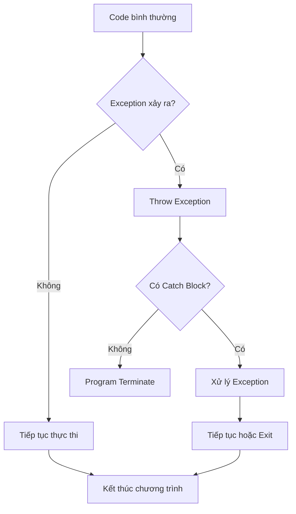
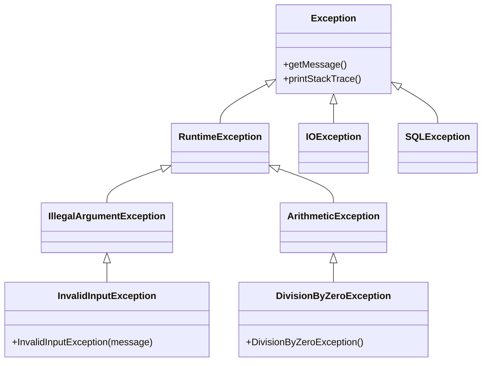

Lỗi là một phần không thể tránh khỏi trong lập trình. Điều quan trọng không phải là làm sao để không có lỗi, mà là làm sao để xử lý chúng một cách thông minh và chuyên nghiệp.

Trong bài này, chúng ta sẽ học cách sử dụng exception handling để xây dựng những chương trình robust, dễ maintain và user-friendly. Từ những khái niệm cơ bản đến các pattern nâng cao được sử dụng trong thực tế.

<!-- truncate -->

## Tại Sao Cần Exception Handling?

Hãy tưởng tượng bạn đang viết một chương trình tính toán đơn giản. Người dùng nhập "abc" thay vì một số. Chương trình sẽ crash ngay lập tức với thông báo lỗi khó hiểu.

```cpp
// Code không xử lý lỗi - NGUY HIỂM!
int main() {
    int a, b;
    cout << "Nhap a: ";
    cin >> a;  // Nếu user nhập "abc" -> chương trình crash!
    cout << "Nhap b: ";
    cin >> b;
    cout << "Ket qua: " << a / b;  // Nếu b = 0 -> crash!
    return 0;
}
```

Exception handling giúp chúng ta:
- **Tránh crash**: Chương trình không đột ngột dừng
- **Thông báo rõ ràng**: User hiểu được vấn đề là gì
- **Khôi phục graceful**: Có thể tiếp tục hoặc dọn dẹp tài nguyên
- **Debug dễ dàng**: Trace được nguồn gốc lỗi

:::info Định Nghĩa Exception
**Exception** là một sự kiện đặc biệt xảy ra trong quá trình thực thi chương trình, làm gián đoạn luồng bình thường của chương trình.
:::

## Phân Loại Các Loại Lỗi

### 1. Compile-time Errors (Lỗi biên dịch)
```cpp
int main() {
    int x = 10
    // Thiếu dấu ; -> Compile error
    cout << x << endl;
    return 0;
}
```

### 2. Runtime Errors (Lỗi thời gian chạy)
```cpp
int main() {
    int a = 10, b = 0;
    cout << a / b;  // Division by zero -> Runtime error
    return 0;
}
```

### 3. Logic Errors (Lỗi logic)
```cpp
// Tính tổng từ 1 đến n nhưng logic sai
int sum = 0;
for (int i = 1; i <= n; i--) {  // i-- thay vì i++ -> Logic error
    sum += i;
}
```

## Hiểu Về Exception Handling Mechanism

Exception handling hoạt động theo nguyên tắc "ném và bắt" (throw and catch):



### Cơ Chế Hoạt Động

1. **Normal Flow**: Code chạy bình thường
2. **Exception Occurs**: Gặp lỗi, tạo exception object
3. **Stack Unwinding**: Tìm kiếm handler phù hợp
4. **Exception Handling**: Xử lý lỗi trong catch block
5. **Resume or Exit**: Tiếp tục hoặc kết thúc chương trình

## Implementation Chi Tiết

### C++ Implementation

```cpp
#include <iostream>
#include <stdexcept>
#include <string>
#include <limits>
#include <fstream>
#include <vector>
using namespace std;

// Custom Exception Classes
class DivisionByZeroException : public runtime_error {
public:
    DivisionByZeroException() : runtime_error("Loi: Khong the chia cho 0!") {}
};

class InvalidInputException : public invalid_argument {
public:
    InvalidInputException(const string& msg) : invalid_argument("Loi input: " + msg) {}
};

class Calculator {
public:
    // Phép chia với exception handling
    static double divide(double a, double b) {
        if (b == 0) {
            throw DivisionByZeroException();
        }
        return a / b;
    }
    
    // Tính căn bậc hai
    static double sqrt_safe(double x) {
        if (x < 0) {
            throw invalid_argument("Khong the tinh can bac hai cua so am!");
        }
        return sqrt(x);
    }
    
    // Tính factorial với kiểm tra overflow
    static long long factorial(int n) {
        if (n < 0) {
            throw invalid_argument("Factorial khong xac dinh cho so am!");
        }
        if (n > 20) {
            throw overflow_error("Ket qua qua lon, vuot qua gioi han long long!");
        }
        
        long long result = 1;
        for (int i = 2; i <= n; i++) {
            result *= i;
        }
        return result;
    }
};

class FileManager {
public:
    static string readFile(const string& filename) {
        ifstream file(filename);
        if (!file.is_open()) {
            throw runtime_error("Khong the mo file: " + filename);
        }
        
        string content, line;
        while (getline(file, line)) {
            content += line + "\n";
        }
        
        if (file.bad()) {
            throw runtime_error("Loi khi doc file: " + filename);
        }
        
        return content;
    }
    
    static void writeFile(const string& filename, const string& content) {
        ofstream file(filename);
        if (!file.is_open()) {
            throw runtime_error("Khong the tao file: " + filename);
        }
        
        file << content;
        
        if (file.fail()) {
            throw runtime_error("Loi khi ghi file: " + filename);
        }
    }
};

// Utility functions
double getValidNumber(const string& prompt) {
    double number;
    string input;
    
    while (true) {
        cout << prompt;
        getline(cin, input);
        
        try {
            // Kiểm tra input rỗng
            if (input.empty()) {
                throw InvalidInputException("Khong duoc de trong!");
            }
            
            // Convert string to number
            size_t pos;
            number = stod(input, &pos);
            
            // Kiểm tra có ký tự thừa không
            if (pos != input.length()) {
                throw InvalidInputException("Chua ky tu khong hop le: '" + input + "'");
            }
            
            return number;
            
        } catch (const invalid_argument& e) {
            cout << "Loi: Input khong phai la so hop le!" << endl;
        } catch (const out_of_range& e) {
            cout << "Loi: So qua lon hoac qua nho!" << endl;
        } catch (const InvalidInputException& e) {
            cout << e.what() << endl;
        }
        
        cout << "Vui long thu lai!" << endl;
    }
}

int getValidInteger(const string& prompt, int min = INT_MIN, int max = INT_MAX) {
    int number;
    
    while (true) {
        try {
            double temp = getValidNumber(prompt);
            
            // Kiểm tra có phải số nguyên không
            if (temp != static_cast<int>(temp)) {
                throw InvalidInputException("Phai la so nguyen!");
            }
            
            number = static_cast<int>(temp);
            
            // Kiểm tra phạm vi
            if (number < min || number > max) {
                throw out_of_range("So phai trong khoang [" + to_string(min) + ", " + to_string(max) + "]");
            }
            
            return number;
            
        } catch (const exception& e) {
            cout << e.what() << endl;
            cout << "Vui long thu lai!" << endl;
        }
    }
}

void demonstrateBasicExceptions() {
    cout << "\n=== DEMO: Basic Exception Handling ===" << endl;
    
    try {
        // Test division by zero
        double a = getValidNumber("Nhap so chia: ");
        double b = getValidNumber("Nhap so bi chia: ");
        
        double result = Calculator::divide(a, b);
        cout << "Ket qua: " << a << " / " << b << " = " << result << endl;
        
    } catch (const DivisionByZeroException& e) {
        cout << e.what() << endl;
        cout << "Goi y: Hay thu voi so khac 0!" << endl;
    } catch (const exception& e) {
        cout << "Loi khong mong muon: " << e.what() << endl;
    }
}

void demonstrateNestedExceptions() {
    cout << "\n=== DEMO: Nested Exception Handling ===" << endl;
    
    try {
        int n = getValidInteger("Nhap n de tinh factorial (0-20): ", 0, 20);
        
        try {
            long long result = Calculator::factorial(n);
            cout << n << "! = " << result << endl;
            
        } catch (const overflow_error& e) {
            cout << e.what() << endl;
            cout << "Goi y: Thu voi so nho hon!" << endl;
            
            // Retry with smaller number
            throw runtime_error("Can nhap lai gia tri nho hon!");
        }
        
    } catch (const invalid_argument& e) {
        cout << e.what() << endl;
    } catch (const runtime_error& e) {
        cout << e.what() << endl;
    }
}

void demonstrateFileExceptions() {
    cout << "\n=== DEMO: File Exception Handling ===" << endl;
    
    string filename;
    cout << "Nhap ten file can doc: ";
    getline(cin, filename);
    
    try {
        string content = FileManager::readFile(filename);
        cout << "Noi dung file:" << endl;
        cout << content << endl;
        
        // Try to write backup
        string backupName = filename + ".backup";
        FileManager::writeFile(backupName, content);
        cout << "Da tao file backup: " << backupName << endl;
        
    } catch (const runtime_error& e) {
        cout << e.what() << endl;
        cout << "Goi y: Kiem tra ten file va quyen truy cap!" << endl;
    }
}

void demonstrateExceptionPropagation() {
    cout << "\n=== DEMO: Exception Propagation ===" << endl;
    
    try {
        // Level 1: Main function
        try {
            // Level 2: Calculation level
            double x = getValidNumber("Nhap so de tinh can bac hai: ");
            
            try {
                // Level 3: Math operation level
                double result = Calculator::sqrt_safe(x);
                cout << "Can bac hai cua " << x << " = " << result << endl;
                
            } catch (const invalid_argument& e) {
                cout << "Loi muc 3: " << e.what() << endl;
                throw runtime_error("Tinh toan that bai o muc 3!");
            }
            
        } catch (const runtime_error& e) {
            cout << "Loi muc 2: " << e.what() << endl;
            throw logic_error("Xu ly that bai o muc 2!");
        }
        
    } catch (const logic_error& e) {
        cout << "Loi muc 1: " << e.what() << endl;
        cout << "Chuong trinh se tiep tuc..." << endl;
    } catch (...) {
        cout << "Loi khong xac dinh!" << endl;
    }
}

int main() {
    cout << "=== Chuong trinh demo Exception Handling ===" << endl;
    
    int choice;
    
    do {
        cout << "\n--- MENU ---" << endl;
        cout << "1. Basic Exception Demo" << endl;
        cout << "2. Nested Exception Demo" << endl;
        cout << "3. File Exception Demo" << endl;
        cout << "4. Exception Propagation Demo" << endl;
        cout << "0. Thoat" << endl;
        
        choice = getValidInteger("Chon chuc nang (0-4): ", 0, 4);
        
        switch (choice) {
            case 1:
                demonstrateBasicExceptions();
                break;
            case 2:
                demonstrateNestedExceptions();
                break;
            case 3:
                demonstrateFileExceptions();
                break;
            case 4:
                demonstrateExceptionPropagation();
                break;
            case 0:
                cout << "Cam on ban da su dung chuong trinh!" << endl;
                break;
        }
        
    } while (choice != 0);
    
    return 0;
}
```

### Python Implementation

```python
import sys
import traceback
import logging
from typing import Optional, Union
import os
import json

# Configure logging
logging.basicConfig(
    level=logging.INFO,
    format='%(asctime)s - %(levelname)s - %(message)s',
    handlers=[
        logging.FileHandler('error.log'),
        logging.StreamHandler(sys.stdout)
    ]
)

# Custom Exception Classes
class DivisionByZeroError(Exception):
    """Custom exception for division by zero"""
    def __init__(self, message="Lỗi: Không thể chia cho 0!"):
        self.message = message
        super().__init__(self.message)

class InvalidInputError(ValueError):
    """Custom exception for invalid input"""
    def __init__(self, message="Lỗi input không hợp lệ"):
        self.message = message
        super().__init__(self.message)

class Calculator:
    @staticmethod
    def divide(a: float, b: float) -> float:
        """Chia hai số với exception handling"""
        if b == 0:
            raise DivisionByZeroError()
        return a / b
    
    @staticmethod
    def sqrt_safe(x: float) -> float:
        """Tính căn bậc hai an toàn"""
        if x < 0:
            raise ValueError("Không thể tính căn bậc hai của số âm!")
        return x ** 0.5
    
    @staticmethod
    def factorial(n: int) -> int:
        """Tính factorial với kiểm tra"""
        if not isinstance(n, int):
            raise TypeError("Factorial chỉ áp dụng cho số nguyên!")
        if n < 0:
            raise ValueError("Factorial không xác định cho số âm!")
        if n > 170:  # Giới hạn của float trong Python
            raise OverflowError("Kết quả quá lớn!")
        
        result = 1
        for i in range(2, n + 1):
            result *= i
        return result

class FileManager:
    @staticmethod
    def read_file(filename: str) -> str:
        """Đọc file với exception handling"""
        try:
            with open(filename, 'r', encoding='utf-8') as file:
                content = file.read()
                if not content:
                    raise ValueError(f"File {filename} trống!")
                return content
        except FileNotFoundError:
            raise FileNotFoundError(f"Không tìm thấy file: {filename}")
        except PermissionError:
            raise PermissionError(f"Không có quyền đọc file: {filename}")
        except UnicodeDecodeError:
            raise UnicodeDecodeError("Không thể decode file, có thể file bị hỏng!")
    
    @staticmethod
    def write_file(filename: str, content: str) -> None:
        """Ghi file với exception handling"""
        try:
            # Tạo thư mục nếu chưa tồn tại
            os.makedirs(os.path.dirname(filename), exist_ok=True)
            
            with open(filename, 'w', encoding='utf-8') as file:
                file.write(content)
                
        except PermissionError:
            raise PermissionError(f"Không có quyền ghi file: {filename}")
        except OSError as e:
            raise OSError(f"Lỗi hệ thống khi ghi file: {e}")

class InputValidator:
    @staticmethod
    def get_valid_number(prompt: str) -> float:
        """Lấy số hợp lệ từ user"""
        while True:
            try:
                user_input = input(prompt).strip()
                
                if not user_input:
                    raise InvalidInputError("Không được để trống!")
                
                # Kiểm tra ký tự đặc biệt
                if any(char in user_input for char in ['inf', 'nan', 'infinity']):
                    raise InvalidInputError("Không được nhập infinity hoặc NaN!")
                
                number = float(user_input)
                
                # Kiểm tra overflow
                if abs(number) > sys.float_info.max:
                    raise OverflowError("Số quá lớn!")
                
                return number
                
            except ValueError as e:
                if "could not convert" in str(e):
                    print("Lỗi: Input không phải là số hợp lệ!")
                else:
                    print(f"Lỗi: {e}")
            except (InvalidInputError, OverflowError) as e:
                print(e)
            except KeyboardInterrupt:
                print("\nThoát chương trình...")
                sys.exit(0)
            
            print("Vui lòng thử lại!")
    
    @staticmethod
    def get_valid_integer(prompt: str, min_val: int = None, max_val: int = None) -> int:
        """Lấy số nguyên hợp lệ từ user"""
        while True:
            try:
                number = InputValidator.get_valid_number(prompt)
                
                # Kiểm tra có phải số nguyên không
                if number != int(number):
                    raise InvalidInputError("Phải là số nguyên!")
                
                int_number = int(number)
                
                # Kiểm tra phạm vi
                if min_val is not None and int_number < min_val:
                    raise ValueError(f"Số phải >= {min_val}")
                if max_val is not None and int_number > max_val:
                    raise ValueError(f"Số phải <= {max_val}")
                
                return int_number
                
            except (ValueError, InvalidInputError) as e:
                print(f"Lỗi: {e}")
                print("Vui lòng thử lại!")

class ExceptionLogger:
    @staticmethod
    def log_exception(func_name: str, exception: Exception) -> None:
        """Log exception với thông tin chi tiết"""
        error_info = {
            'function': func_name,
            'exception_type': type(exception).__name__,
            'message': str(exception),
            'traceback': traceback.format_exc()
        }
        
        logging.error(f"Exception in {func_name}: {error_info}")

def demonstrate_basic_exceptions():
    """Demo exception handling cơ bản"""
    print("\n=== DEMO: Basic Exception Handling ===")
    
    try:
        a = InputValidator.get_valid_number("Nhập số chia: ")
        b = InputValidator.get_valid_number("Nhập số bị chia: ")
        
        result = Calculator.divide(a, b)
        print(f"Kết quả: {a} / {b} = {result}")
        
    except DivisionByZeroError as e:
        print(e)
        print("Gợi ý: Hãy thử với số khác 0!")
        ExceptionLogger.log_exception("demonstrate_basic_exceptions", e)
    except Exception as e:
        print(f"Lỗi không mong muốn: {e}")
        ExceptionLogger.log_exception("demonstrate_basic_exceptions", e)

def demonstrate_multiple_exceptions():
    """Demo xử lý nhiều loại exception"""
    print("\n=== DEMO: Multiple Exception Types ===")
    
    try:
        n = InputValidator.get_valid_integer("Nhập n để tính factorial (0-170): ", 0, 170)
        result = Calculator.factorial(n)
        print(f"{n}! = {result}")
        
    except ValueError as e:
        print(f"Lỗi giá trị: {e}")
    except TypeError as e:
        print(f"Lỗi kiểu dữ liệu: {e}")
    except OverflowError as e:
        print(f"Lỗi tràn số: {e}")
        print("Gợi ý: Thử với số nhỏ hơn!")
    except Exception as e:
        print(f"Lỗi không xác định: {e}")
        ExceptionLogger.log_exception("demonstrate_multiple_exceptions", e)

def demonstrate_file_exceptions():
    """Demo xử lý exception với file"""
    print("\n=== DEMO: File Exception Handling ===")
    
    filename = input("Nhập tên file cần đọc: ").strip()
    
    try:
        content = FileManager.read_file(filename)
        print(f"Nội dung file ({len(content)} ký tự):")
        print(content[:200] + "..." if len(content) > 200 else content)
        
        # Thử tạo backup
        backup_name = filename + ".backup"
        FileManager.write_file(backup_name, content)
        print(f"Đã tạo file backup: {backup_name}")
        
    except FileNotFoundError as e:
        print(e)
        print("Gợi ý: Kiểm tra tên file và đường dẫn!")
    except PermissionError as e:
        print(e)
        print("Gợi ý: Kiểm tra quyền truy cập file!")
    except UnicodeDecodeError as e:
        print(f"Lỗi encoding: {e}")
        print("Gợi ý: File có thể không phải text hoặc encoding khác UTF-8!")
    except Exception as e:
        print(f"Lỗi không mong muốn: {e}")
        ExceptionLogger.log_exception("demonstrate_file_exceptions", e)

def demonstrate_exception_chaining():
    """Demo exception chaining và context"""
    print("\n=== DEMO: Exception Chaining ===")
    
    def level_3_function(x):
        """Function level 3 - nơi exception xảy ra"""
        if x < 0:
            raise ValueError("Số âm không được phép!")
        return Calculator.sqrt_safe(x)
    
    def level_2_function(x):
        """Function level 2 - truyền exception lên"""
        try:
            return level_3_function(x)
        except ValueError as e:
            # Chain exception with additional context
            raise RuntimeError("Tính toán thất bại ở level 2!") from e
    
    def level_1_function(x):
        """Function level 1 - xử lý cuối cùng"""
        try:
            return level_2_function(x)
        except RuntimeError as e:
            print(f"Lỗi level 1: {e}")
            print(f"Nguyên nhân gốc: {e.__cause__}")
            raise  # Re-raise để caller có thể xử lý tiếp
    
    try:
        x = InputValidator.get_valid_number("Nhập số để tính căn bậc hai: ")
        result = level_1_function(x)
        print(f"Căn bậc hai của {x} = {result}")
        
    except RuntimeError as e:
        print("Xử lý cuối cùng tại main:")
        print(f"Exception: {e}")
        if e.__cause__:
            print(f"Root cause: {e.__cause__}")

def demonstrate_context_manager():
    """Demo exception handling với context manager"""
    print("\n=== DEMO: Context Manager Exception Handling ===")
    
    class DatabaseConnection:
        def __init__(self, db_name):
            self.db_name = db_name
            self.connected = False
        
        def __enter__(self):
            print(f"Kết nối đến database: {self.db_name}")
            self.connected = True
            return self
        
        def __exit__(self, exc_type, exc_val, exc_tb):
            print(f"Đóng kết nối database: {self.db_name}")
            self.connected = False
            
            if exc_type:
                print(f"Exception xảy ra: {exc_type.__name__}: {exc_val}")
                print("Đã dọn dẹp tài nguyên an toàn!")
                return False  # Don't suppress exception
        
        def query(self, sql):
            if not self.connected:
                raise RuntimeError("Chưa kết nối database!")
            
            if "DROP" in sql.upper():
                raise RuntimeError("Không được phép DROP table!")
            
            return f"Thực thi: {sql}"
    
    try:
        with DatabaseConnection("MyDB") as db:
            result1 = db.query("SELECT * FROM users")
            print(result1)
            
            # Trigger exception
            result2 = db.query("DROP TABLE users")
            print(result2)
            
    except RuntimeError as e:
        print(f"Lỗi database: {e}")

def main():
    print("=== Chương trình demo Exception Handling ===")
    
    while True:
        try:
            print("\n--- MENU ---")
            print("1. Basic Exception Demo")
            print("2. Multiple Exception Types Demo")
            print("3. File Exception Demo")
            print("4. Exception Chaining Demo")
            print("5. Context Manager Demo")
            print("0. Thoát")
            
            choice = InputValidator.get_valid_integer("Chọn chức năng (0-5): ", 0, 5)
            
            if choice == 1:
                demonstrate_basic_exceptions()
            elif choice == 2:
                demonstrate_multiple_exceptions()
            elif choice == 3:
                demonstrate_file_exceptions()
            elif choice == 4:
                demonstrate_exception_chaining()
            elif choice == 5:
                demonstrate_context_manager()
            elif choice == 0:
                print("Cảm ơn bạn đã sử dụng chương trình!")
                break
                
        except KeyboardInterrupt:
            print("\nThoát chương trình...")
            break
        except Exception as e:
            print(f"Lỗi không mong muốn trong main: {e}")
            ExceptionLogger.log_exception("main", e)

if __name__ == "__main__":
    main()
```

### Java Implementation

```java
import java.io.*;
import java.nio.file.*;
import java.util.*;
import java.util.logging.*;

// Custom Exception Classes
class DivisionByZeroException extends ArithmeticException {
    public DivisionByZeroException() {
        super("Lỗi: Không thể chia cho 0!");
    }
}

class InvalidInputException extends IllegalArgumentException {
    public InvalidInputException(String message) {
        super("Lỗi input: " + message);
    }
}

class Calculator {
    public static double divide(double a, double b) throws DivisionByZeroException {
        if (b == 0) {
            throw new DivisionByZeroException();
        }
        return a / b;
    }
    
    public static double sqrtSafe(double x) throws IllegalArgumentException {
        if (x < 0) {
            throw new IllegalArgumentException("Không thể tính căn bậc hai của số âm!");
        }
        return Math.sqrt(x);
    }
    
    public static long factorial(int n) throws IllegalArgumentException, ArithmeticException {
        if (n < 0) {
            throw new IllegalArgumentException("Factorial không xác định cho số âm!");
        }
        if (n > 20) {
            throw new ArithmeticException("Kết quả quá lớn, vượt qua giới hạn long!");
        }
        
        long result = 1;
        for (int i = 2; i <= n; i++) {
            result *= i;
        }
        return result;
    }
}

class FileManager {
    public static String readFile(String filename) throws IOException {
        try {
            return Files.readString(Paths.get(filename));
        } catch (NoSuchFileException e) {
            throw new FileNotFoundException("Không tìm thấy file: " + filename);
        } catch (AccessDeniedException e) {
            throw new IOException("Không có quyền đọc file: " + filename);
        }
    }
    
    public static void writeFile(String filename, String content) throws IOException {
        try {
            // Tạo thư mục nếu cần
            Path path = Paths.get(filename);
            Files.createDirectories(path.getParent());
            
            Files.writeString(path, content);
        } catch (AccessDeniedException e) {
            throw new IOException("Không có quyền ghi file: " + filename);
        }
    }
}

class InputValidator {
    private static Scanner scanner = new Scanner(System.in);
    private static Logger logger = Logger.getLogger(InputValidator.class.getName());
    
    static {
        // Configure logger
        try {
            FileHandler fileHandler = new FileHandler("error.log", true);
            logger.addHandler(fileHandler);
            logger.setLevel(Level.ALL);
        } catch (IOException e) {
            System.err.println("Không thể tạo log file: " + e.getMessage());
        }
    }
    
    public static double getValidNumber(String prompt) {
        while (true) {
            try {
                System.out.print(prompt);
                String input = scanner.nextLine().trim();
                
                if (input.isEmpty()) {
                    throw new InvalidInputException("Không được để trống!");
                }
                
                // Kiểm tra ký tự đặc biệt
                if (input.toLowerCase().contains("infinity") || 
                    input.toLowerCase().contains("nan")) {
                    throw new InvalidInputException("Không được nhập infinity hoặc NaN!");
                }
                
                double number = Double.parseDouble(input);
                
                // Kiểm tra infinity và NaN
                if (Double.isInfinite(number) || Double.isNaN(number)) {
                    throw new InvalidInputException("Số không hợp lệ!");
                }
                
                return number;
                
            } catch (NumberFormatException e) {
                System.out.println("Lỗi: Input không phải là số hợp lệ!");
            } catch (InvalidInputException e) {
                System.out.println(e.getMessage());
            } catch (Exception e) {
                System.out.println("Lỗi không mong muốn: " + e.getMessage());
                logger.severe("Unexpected error in getValidNumber: " + e.getMessage());
            }
            
            System.out.println("Vui lòng thử lại!");
        }
    }
    
    public static int getValidInteger(String prompt, int min, int max) {
        while (true) {
            try {
                double temp = getValidNumber(prompt);
                
                // Kiểm tra có phải số nguyên không
                if (temp != (int) temp) {
                    throw new InvalidInputException("Phải là số nguyên!");
                }
                
                int number = (int) temp;
                
                // Kiểm tra phạm vi
                if (number < min || number > max) {
                    throw new IllegalArgumentException(
                        String.format("Số phải trong khoảng [%d, %d]", min, max));
                }
                
                return number;
                
            } catch (InvalidInputException | IllegalArgumentException e) {
                System.out.println(e.getMessage());
                System.out.println("Vui lòng thử lại!");
            }
        }
    }
}

// Exception handling với custom resource management
class DatabaseConnection implements AutoCloseable {
    private String dbName;
    private boolean connected;
    
    public DatabaseConnection(String dbName) throws SQLException {
        this.dbName = dbName;
        connect();
    }
    
    private void connect() throws SQLException {
        System.out.println("Kết nối đến database: " + dbName);
        // Simulate connection failure
        if (dbName.equals("invalid")) {
            throw new SQLException("Không thể kết nối đến database: " + dbName);
        }
        this.connected = true;
    }
    
    public String query(String sql) throws SQLException {
        if (!connected) {
            throw new SQLException("Chưa kết nối database!");
        }
        
        if (sql.toUpperCase().contains("DROP")) {
            throw new SQLException("Không được phép DROP table!");
        }
        
        return "Thực thi: " + sql;
    }
    
    @Override
    public void close() {
        if (connected) {
            System.out.println("Đóng kết nối database: " + dbName);
            connected = false;
        }
    }
}

public class ExceptionHandlingDemo {
    private static Logger logger = Logger.getLogger(ExceptionHandlingDemo.class.getName());
    
    public static void demonstrateBasicExceptions() {
        System.out.println("\n=== DEMO: Basic Exception Handling ===");
        
        try {
            double a = InputValidator.getValidNumber("Nhập số chia: ");
            double b = InputValidator.getValidNumber("Nhập số bị chia: ");
            
            double result = Calculator.divide(a, b);
            System.out.printf("Kết quả: %.2f / %.2f = %.2f%n", a, b, result);
            
        } catch (DivisionByZeroException e) {
            System.out.println(e.getMessage());
            System.out.println("Gợi ý: Hãy thử với số khác 0!");
            logger.warning("Division by zero attempted");
        } catch (Exception e) {
            System.out.println("Lỗi không mong muốn: " + e.getMessage());
            logger.severe("Unexpected error: " + e.getMessage());
        }
    }
    
    public static void demonstrateMultipleExceptions() {
        System.out.println("\n=== DEMO: Multiple Exception Types ===");
        
        try {
            int n = InputValidator.getValidInteger("Nhập n để tính factorial (0-20): ", 0, 20);
            long result = Calculator.factorial(n);
            System.out.printf("%d! = %d%n", n, result);
            
        } catch (IllegalArgumentException e) {
            System.out.println("Lỗi tham số: " + e.getMessage());
        } catch (ArithmeticException e) {
            System.out.println("Lỗi tính toán: " + e.getMessage());
            System.out.println("Gợi ý: Thử với số nhỏ hơn!");
        } catch (Exception e) {
            System.out.println("Lỗi không xác định: " + e.getMessage());
            logger.severe("Unexpected error in factorial calculation: " + e.getMessage());
        }
    }
    
    public static void demonstrateFileExceptions() {
        System.out.println("\n=== DEMO: File Exception Handling ===");
        
        Scanner scanner = new Scanner(System.in);
        System.out.print("Nhập tên file cần đọc: ");
        String filename = scanner.nextLine().trim();
        
        try {
            String content = FileManager.readFile(filename);
            System.out.printf("Nội dung file (%d ký tự):%n", content.length());
            
            // Hiển thị một phần nội dung
            if (content.length() > 200) {
                System.out.println(content.substring(0, 200) + "...");
            } else {
                System.out.println(content);
            }
            
            // Thử tạo backup
            String backupName = filename + ".backup";
            FileManager.writeFile(backupName, content);
            System.out.println("Đã tạo file backup: " + backupName);
            
        } catch (FileNotFoundException e) {
            System.out.println(e.getMessage());
            System.out.println("Gợi ý: Kiểm tra tên file và đường dẫn!");
        } catch (IOException e) {
            System.out.println("Lỗi I/O: " + e.getMessage());
            System.out.println("Gợi ý: Kiểm tra quyền truy cập file!");
        } catch (Exception e) {
            System.out.println("Lỗi không mong muốn: " + e.getMessage());
            logger.severe("Unexpected error in file operations: " + e.getMessage());
        }
    }
    
    public static void demonstrateExceptionChaining() {
        System.out.println("\n=== DEMO: Exception Chaining ===");
        
        try {
            // Level 1: Main calculation
            double x = InputValidator.getValidNumber("Nhập số để tính căn bậc hai: ");
            
            try {
                // Level 2: Validation and calculation
                double result = Calculator.sqrtSafe(x);
                System.out.printf("Căn bậc hai của %.2f = %.2f%n", x, result);
                
            } catch (IllegalArgumentException e) {
                // Chain exception with additional context
                RuntimeException chainedException = new RuntimeException(
                    "Tính toán thất bại ở level 2!");
                chainedException.initCause(e);
                throw chainedException;
            }
            
        } catch (RuntimeException e) {
            System.out.println("Lỗi: " + e.getMessage());
            if (e.getCause() != null) {
                System.out.println("Nguyên nhân gốc: " + e.getCause().getMessage());
            }
            
            // Print full stack trace for debugging
            System.out.println("\nStack trace đầy đủ:");
            e.printStackTrace();
        }
    }
    
    public static void demonstrateTryWithResources() {
        System.out.println("\n=== DEMO: Try-with-resources ===");
        
        Scanner scanner = new Scanner(System.in);
        System.out.print("Nhập tên database: ");
        String dbName = scanner.nextLine().trim();
        
        // Try-with-resources tự động close resource
        try (DatabaseConnection db = new DatabaseConnection(dbName)) {
            
            String result1 = db.query("SELECT * FROM users");
            System.out.println(result1);
            
            // Trigger exception
            String result2 = db.query("DROP TABLE users");
            System.out.println(result2);
            
        } catch (SQLException e) {
            System.out.println("Lỗi SQL: " + e.getMessage());
            System.out.println("Kết nối đã được đóng an toàn!");
        }
    }
    
    public static void main(String[] args) {
        System.out.println("=== Chương trình demo Exception Handling ===");
        
        Scanner scanner = new Scanner(System.in);
        int choice;
        
        do {
            try {
                System.out.println("\n--- MENU ---");
                System.out.println("1. Basic Exception Demo");
                System.out.println("2. Multiple Exception Types Demo");
                System.out.println("3. File Exception Demo");
                System.out.println("4. Exception Chaining Demo");
                System.out.println("5. Try-with-resources Demo");
                System.out.println("0. Thoát");
                
                choice = InputValidator.getValidInteger("Chọn chức năng (0-5): ", 0, 5);
                
                switch (choice) {
                    case 1:
                        demonstrateBasicExceptions();
                        break;
                    case 2:
                        demonstrateMultipleExceptions();
                        break;
                    case 3:
                        demonstrateFileExceptions();
                        break;
                    case 4:
                        demonstrateExceptionChaining();
                        break;
                    case 5:
                        demonstrateTryWithResources();
                        break;
                    case 0:
                        System.out.println("Cảm ơn bạn đã sử dụng chương trình!");
                        break;
                }
                
            } catch (Exception e) {
                System.out.println("Lỗi không mong muốn trong main: " + e.getMessage());
                logger.severe("Unexpected error in main: " + e.getMessage());
            }
            
        } while (choice != 0);
        
        scanner.close();
    }
}
```

## Best Practices và Design Patterns

### 1. Exception Hierarchy


### 2. Exception Safety Levels

:::tip Exception Safety Guarantees
1. **No-throw guarantee**: Function never throws exceptions
2. **Strong guarantee**: Function either succeeds completely or has no effect
3. **Basic guarantee**: No resource leaks, object remains in valid state
4. **No guarantee**: Anything can happen
:::

### 3. RAII (Resource Acquisition Is Initialization)
```cpp
class FileHandler {
private:
    FILE* file;
public:
    FileHandler(const string& filename) {
        file = fopen(filename.c_str(), "r");
        if (!file) {
            throw runtime_error("Khong the mo file");
        }
    }
    
    ~FileHandler() {
        if (file) {
            fclose(file);  // Tự động đóng file khi object bị destroy
        }
    }
    
    // Disable copy để tránh double-close
    FileHandler(const FileHandler&) = delete;
    FileHandler& operator=(const FileHandler&) = delete;
};
```

## Common Anti-patterns Cần Tránh

### ❌ Swallowing Exceptions
```python
# SAIIII - Nuốt exception
try:
    risky_operation()
except:
    pass  # Không làm gì cả!
```

### ❌ Catching Too General
```java
// SAI - Catch quá rộng
try {
    specificOperation();
} catch (Exception e) {  // Quá rộng!
    // Handle everything the same way
}
```

### ❌ Exception as Control Flow
```cpp
// SAI - Dùng exception để control flow
try {
    while (true) {
        processNextItem();
    }
} catch (NoMoreItemsException e) {
    // End of loop - WRONG!
}
```

### ✅ Correct Approaches
```python
# ĐÚNG - Specific handling
try:
    result = divide(a, b)
except ZeroDivisionError:
    print("Không thể chia cho 0")
except ValueError as e:
    print(f"Giá trị không hợp lệ: {e}")
except Exception as e:
    print(f"Lỗi không mong muốn: {e}")
    raise  # Re-raise để caller xử lý
```

## Performance Considerations

### Exception Overhead
:::warning Performance Impact
- Exception throwing có cost cao (stack unwinding)
- Không nên dùng exceptions cho control flow
- Try-catch blocks có overhead minimal nếu không throw
:::

### Benchmarking Example
```python
import timeit

# Normal flow
def normal_check(x):
    if x == 0:
        return None
    return 10 / x

# Exception-based
def exception_check(x):
    try:
        return 10 / x
    except ZeroDivisionError:
        return None

# Test performance
normal_time = timeit.timeit(lambda: normal_check(5), number=1000000)
exception_time = timeit.timeit(lambda: exception_check(5), number=1000000)

print(f"Normal check: {normal_time:.4f}s")
print(f"Exception check: {exception_time:.4f}s")
```

## Logging và Monitoring

### Structured Logging
```python
import logging
import json
from datetime import datetime

class JSONFormatter(logging.Formatter):
    def format(self, record):
        log_entry = {
            'timestamp': datetime.utcnow().isoformat(),
            'level': record.levelname,
            'message': record.getMessage(),
            'module': record.module,
            'function': record.funcName,
            'line': record.lineno
        }
        
        if hasattr(record, 'exc_info') and record.exc_info:
            log_entry['exception'] = self.formatException(record.exc_info)
            
        return json.dumps(log_entry)

# Usage
logger = logging.getLogger(__name__)
handler = logging.StreamHandler()
handler.setFormatter(JSONFormatter())
logger.addHandler(handler)
```

## Kết Luận

Exception handling là một trong những kỹ năng quan trọng nhất trong lập trình. Qua bài này, bạn đã học được:

✅ **Hiểu bản chất và phân loại exceptions**  
✅ **Sử dụng try-catch-finally hiệu quả**  
✅ **Tạo custom exceptions phù hợp**  
✅ **Best practices và anti-patterns**  
✅ **Resource management với RAII/context managers**  
✅ **Exception chaining và propagation**  
✅ **Performance considerations**  
✅ **Logging và monitoring**

:::tip Lời Khuyên Cuối
- **Fail fast**: Phát hiện lỗi sớm nhất có thể
- **Be specific**: Catch exception cụ thể, không quá rộng
- **Clean up**: Luôn dọn dẹp resource
- **Log properly**: Ghi log chi tiết để debug
- **User friendly**: Hiển thị thông báo dễ hiểu cho user
- **Test exceptions**: Viết unit test cho exception paths
:::

Exception handling không chỉ là về việc bắt lỗi, mà là về việc xây dựng những hệ thống robust, maintainable và user-friendly. Hãy thực hành với các ví dụ trên và áp dụng vào dự án thực tế của bạn!