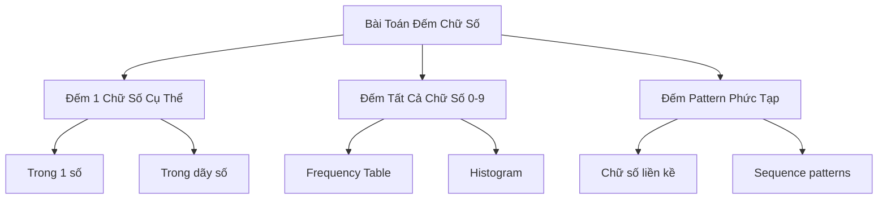

Đếm số lần xuất hiện của các chữ số trong dãy số là một bài toán thú vị và có nhiều ứng dụng thực tế. Từ việc phân tích dữ liệu thống kê đến xử lý mã số, kỹ năng này giúp bạn hiểu sâu hơn về cách làm việc với digits và patterns. Trong bài viết này, chúng ta sẽ khám phá nhiều cách tiếp cận khác nhau để giải quyết bài toán này.

Bạn sẽ học được cách xử lý từng chữ số trong một số, đếm frequency, phân tích patterns, và áp dụng vào các tình huống thực tế như phân tích số điện thoại, mã ZIP, hay dữ liệu tài chính.

<!-- truncate -->

## Hiểu Về Bài Toán Đếm Chữ Số

### Định Nghĩa Bài Toán

Cho một dãy số và một chữ số cụ thể (0-9), đếm tổng số lần chữ số đó xuất hiện trong tất cả các số của dãy.

**Ví dụ:**
- Dãy số: [123, 456, 789, 321]
- Chữ số cần đếm: 2
- Kết quả: 2 (xuất hiện trong 123 và 321)

### Các Biến Thể Của Bài Toán



## Các Phương Pháp Đếm Chữ Số

### 1. Phương Pháp Chia Lấy Dư (Modulo)

**Cài đặt bằng C++:**
```cpp
#include <iostream>
#include <vector>
#include <cmath>
using namespace std;

int countDigitInNumber(int number, int digit) {
    if (number == 0 && digit == 0) {
        return 1; // Trường hợp đặc biệt
    }
    
    number = abs(number); // Xử lý số âm
    int count = 0;
    
    cout << "Dem chu so " << digit << " trong so " << number << ":" << endl;
    
    if (number == 0) {
        return digit == 0 ? 1 : 0;
    }
    
    while (number > 0) {
        int lastDigit = number % 10;
        cout << "Chu so cuoi: " << lastDigit;
        
        if (lastDigit == digit) {
            count++;
            cout << " -> Tim thay! (count = " << count << ")";
        }
        cout << endl;
        
        number /= 10;
    }
    
    return count;
}

int countDigitInSequence(const vector<int>& sequence, int digit) {
    int totalCount = 0;
    
    cout << "\n=== DEM CHU SO " << digit << " TRONG DAY SO ===" << endl;
    cout << "Day so: ";
    for (int i = 0; i < sequence.size(); i++) {
        cout << sequence[i];
        if (i < sequence.size() - 1) cout << ", ";
    }
    cout << endl << endl;
    
    for (int i = 0; i < sequence.size(); i++) {
        int count = countDigitInNumber(sequence[i], digit);
        totalCount += count;
        
        cout << "So " << sequence[i] << " chua " << count 
             << " chu so " << digit << endl;
        cout << "Tong hien tai: " << totalCount << endl << endl;
    }
    
    return totalCount;
}

void demonstrateBasicCounting() {
    vector<int> testSequence = {123, 456, 789, 321, 222, 1002};
    int targetDigit = 2;
    
    int result = countDigitInSequence(testSequence, targetDigit);
    
    cout << "=== KET QUA CUOI CUNG ===" << endl;
    cout << "Chu so " << targetDigit << " xuat hien " 
         << result << " lan trong day" << endl;
}

int main() {
    demonstrateBasicCounting();
    return 0;
}
```

### 2. Phương Pháp Chuyển Đổi String

**Cài đặt bằng Python:**
```python
def count_digit_string_method(number, digit):
    """Đếm chữ số bằng cách chuyển thành string"""
    number_str = str(abs(number))  # Xử lý số âm
    digit_str = str(digit)
    
    count = number_str.count(digit_str)
    
    print(f"Số {number} -> String '{number_str}'")
    print(f"Đếm '{digit_str}': {count} lần")
    
    return count

def count_digit_in_sequence_detailed(sequence, digit):
    """Đếm chữ số trong dãy với thông tin chi tiết"""
    print(f"🔍 ĐẾM CHỮ SỐ {digit} TRONG DÃY")
    print("=" * 50)
    
    total_count = 0
    digit_positions = []  # Lưu vị trí xuất hiện
    
    for i, number in enumerate(sequence):
        count = count_digit_string_method(number, digit)
        total_count += count
        
        if count > 0:
            digit_positions.append((i, number, count))
        
        print(f"Vị trí {i}: {number} -> {count} lần")
        print(f"Tổng hiện tại: {total_count}")
        print("-" * 30)
    
    return total_count, digit_positions

def analyze_digit_distribution(sequence):
    """Phân tích phân bố tất cả các chữ số 0-9"""
    print(f"\n📊 PHÂN TÍCH PHÂN BỐ CHỮ SỐ")
    print("=" * 40)
    
    # Đếm frequency cho tất cả chữ số
    digit_counts = {}
    for digit in range(10):
        digit_counts[digit] = 0
    
    for number in sequence:
        number_str = str(abs(number))
        for char in number_str:
            digit = int(char)
            digit_counts[digit] += 1
    
    # In kết quả
    print("Chữ số | Số lần | Tỷ lệ %")
    print("-" * 25)
    
    total_digits = sum(digit_counts.values())
    
    for digit in range(10):
        count = digit_counts[digit]
        percentage = (count / total_digits * 100) if total_digits > 0 else 0
        
        # Tạo bar chart đơn giản
        bar = "█" * (count // 2) if count > 0 else ""
        
        print(f"   {digit}   |   {count:2d}   | {percentage:5.1f}% {bar}")
    
    return digit_counts

def find_most_frequent_digit(sequence):
    """Tìm chữ số xuất hiện nhiều nhất"""
    digit_counts = {}
    for digit in range(10):
        digit_counts[digit] = 0
    
    for number in sequence:
        for char in str(abs(number)):
            digit = int(char)
            digit_counts[digit] += 1
    
    most_frequent = max(digit_counts, key=digit_counts.get)
    max_count = digit_counts[most_frequent]
    
    return most_frequent, max_count, digit_counts

def main():
    test_sequence = [123, 456, 789, 321, 222, 1002, 505]
    target_digit = 2
    
    # Đếm chữ số cụ thể
    total_count, positions = count_digit_in_sequence_detailed(test_sequence, target_digit)
    
    print(f"\n🎯 KẾT QUẢ CUỐI CÙNG")
    print(f"Chữ số {target_digit} xuất hiện {total_count} lần")
    print(f"Tại các vị trí: {positions}")
    
    # Phân tích tổng thể
    analyze_digit_distribution(test_sequence)
    
    # Tìm chữ số phổ biến nhất
    most_freq, count, all_counts = find_most_frequent_digit(test_sequence)
    print(f"\n🏆 Chữ số xuất hiện nhiều nhất: {most_freq} ({count} lần)")

if __name__ == "__main__":
    main()
```

### 3. Phương Pháp Tối Ưu với Xử Lý Nâng Cao

**Cài đặt bằng Java:**
```java
import java.util.*;
import java.util.stream.Collectors;

public class AdvancedDigitCounter {
    
    public static class DigitAnalysis {
        private int digit;
        private int totalOccurrences;
        private List<PositionInfo> positions;
        private Map<Integer, Integer> numberFrequency;
        
        public DigitAnalysis(int digit) {
            this.digit = digit;
            this.totalOccurrences = 0;
            this.positions = new ArrayList<>();
            this.numberFrequency = new HashMap<>();
        }
        
        public void addOccurrence(int sequenceIndex, int number, int count) {
            positions.add(new PositionInfo(sequenceIndex, number, count));
            totalOccurrences += count;
            numberFrequency.put(number, numberFrequency.getOrDefault(number, 0) + count);
        }
        
        // Getters...
        public int getTotalOccurrences() { return totalOccurrences; }
        public List<PositionInfo> getPositions() { return positions; }
        public Map<Integer, Integer> getNumberFrequency() { return numberFrequency; }
    }
    
    public static class PositionInfo {
        private int sequenceIndex;
        private int number;
        private int count;
        
        public PositionInfo(int sequenceIndex, int number, int count) {
            this.sequenceIndex = sequenceIndex;
            this.number = number;
            this.count = count;
        }
        
        @Override
        public String toString() {
            return String.format("Vị trí %d: số %d (%d lần)", 
                               sequenceIndex, number, count);
        }
    }
    
    public static int countDigitInNumber(int number, int digit) {
        if (number == 0 && digit == 0) return 1;
        
        number = Math.abs(number);
        int count = 0;
        
        if (number == 0) {
            return digit == 0 ? 1 : 0;
        }
        
        while (number > 0) {
            if (number % 10 == digit) {
                count++;
            }
            number /= 10;
        }
        
        return count;
    }
    
    public static DigitAnalysis analyzeDigitInSequence(int[] sequence, int digit) {
        DigitAnalysis analysis = new DigitAnalysis(digit);
        
        for (int i = 0; i < sequence.length; i++) {
            int count = countDigitInNumber(sequence[i], digit);
            if (count > 0) {
                analysis.addOccurrence(i, sequence[i], count);
            }
        }
        
        return analysis;
    }
    
    public static Map<Integer, Integer> countAllDigits(int[] sequence) {
        Map<Integer, Integer> digitCounts = new HashMap<>();
        
        // Khởi tạo counter cho tất cả chữ số
        for (int i = 0; i <= 9; i++) {
            digitCounts.put(i, 0);
        }
        
        for (int number : sequence) {
            String numberStr = String.valueOf(Math.abs(number));
            for (char c : numberStr.toCharArray()) {
                int digit = Character.getNumericValue(c);
                digitCounts.put(digit, digitCounts.get(digit) + 1);
            }
        }
        
        return digitCounts;
    }
    
    public static void printDetailedAnalysis(int[] sequence, int targetDigit) {
        System.out.println("=".repeat(60));
        System.out.println("PHÂN TÍCH CHI TIẾT CHỮ SỐ " + targetDigit);
        System.out.println("=".repeat(60));
        
        // In dãy số
        System.out.println("Dãy số: " + Arrays.toString(sequence));
        System.out.println();
        
        DigitAnalysis analysis = analyzeDigitInSequence(sequence, targetDigit);
        
        System.out.println("CHI TIẾT XUẤT HIỆN:");
        System.out.println("-".repeat(40));
        
        if (analysis.getPositions().isEmpty()) {
            System.out.println("❌ Không tìm thấy chữ số " + targetDigit + " trong dãy!");
        } else {
            for (PositionInfo pos : analysis.getPositions()) {
                System.out.println("✅ " + pos);
            }
        }
        
        System.out.println();
        System.out.println("THỐNG KÊ:");
        System.out.println("Tổng số lần xuất hiện: " + analysis.getTotalOccurrences());
        System.out.println("Số lượng số chứa chữ số " + targetDigit + ": " + 
                         analysis.getPositions().size());
        
        // Số chứa nhiều chữ số này nhất
        if (!analysis.getNumberFrequency().isEmpty()) {
            int maxCount = Collections.max(analysis.getNumberFrequency().values());
            List<Integer> numbersWithMax = analysis.getNumberFrequency().entrySet()
                .stream()
                .filter(entry -> entry.getValue() == maxCount)
                .map(Map.Entry::getKey)
                .collect(Collectors.toList());
            
            System.out.println("Số chứa nhiều chữ số " + targetDigit + " nhất: " + 
                             numbersWithMax + " (" + maxCount + " lần)");
        }
    }
    
    public static void printDigitDistribution(int[] sequence) {
        System.out.println("\n" + "=".repeat(50));
        System.out.println("PHÂN BỐ TẤT CẢ CHỮ SỐ (0-9)");
        System.out.println("=".repeat(50));
        
        Map<Integer, Integer> digitCounts = countAllDigits(sequence);
        int totalDigits = digitCounts.values().stream().mapToInt(Integer::intValue).sum();
        
        System.out.println("Chữ số | Tần suất | Tỷ lệ % | Biểu đồ");
        System.out.println("-".repeat(45));
        
        for (int digit = 0; digit <= 9; digit++) {
            int count = digitCounts.get(digit);
            double percentage = totalDigits > 0 ? (double) count / totalDigits * 100 : 0;
            
            // Tạo biểu đồ đơn giản
            String bar = "█".repeat(Math.min(count, 20));
            
            System.out.printf("%4d   | %6d   | %5.1f%% | %s%n", 
                            digit, count, percentage, bar);
        }
        
        System.out.println("-".repeat(45));
        System.out.println("Tổng số chữ số: " + totalDigits);
    }
    
    public static void compareMethodsPerformance(int[] sequence, int digit) {
        System.out.println("\n" + "=".repeat(40));
        System.out.println("SO SÁNH HIỆU SUẤT CÁC PHƯƠNG PHÁP");
        System.out.println("=".repeat(40));
        
        // Phương pháp 1: Modulo
        long start1 = System.nanoTime();
        int result1 = 0;
        for (int number : sequence) {
            result1 += countDigitInNumber(number, digit);
        }
        long time1 = System.nanoTime() - start1;
        
        // Phương pháp 2: String
        long start2 = System.nanoTime();
        int result2 = 0;
        for (int number : sequence) {
            String numStr = String.valueOf(Math.abs(number));
            for (char c : numStr.toCharArray()) {
                if (Character.getNumericValue(c) == digit) {
                    result2++;
                }
            }
        }
        long time2 = System.nanoTime() - start2;
        
        System.out.println("Phương pháp Modulo:");
        System.out.println("  Kết quả: " + result1);
        System.out.println("  Thời gian: " + time1 + " nanoseconds");
        
        System.out.println("Phương pháp String:");
        System.out.println("  Kết quả: " + result2);
        System.out.println("  Thời gian: " + time2 + " nanoseconds");
        
        System.out.println("Tỷ lệ hiệu suất: " + 
                         String.format("%.2f", (double) time2 / time1) + "x");
    }
    
    public static void main(String[] args) {
        int[] testSequence = {123, 456, 789, 321, 222, 1002, 505, 12321};
        int targetDigit = 2;
        
        // Phân tích chi tiết
        printDetailedAnalysis(testSequence, targetDigit);
        
        // Phân bố tổng thể
        printDigitDistribution(testSequence);
        
        // So sánh hiệu suất
        compareMethodsPerformance(testSequence, targetDigit);
        
        // Interactive mode
        Scanner scanner = new Scanner(System.in);
        System.out.println("\n" + "=".repeat(40));
        System.out.println("CHẾ ĐỘ TƯƠNG TÁC");
        
        while (true) {
            System.out.print("\nNhập chữ số cần đếm (0-9) hoặc 'quit': ");
            String input = scanner.nextLine().trim();
            
            if (input.equalsIgnoreCase("quit")) break;
            
            try {
                int digit = Integer.parseInt(input);
                if (digit >= 0 && digit <= 9) {
                    printDetailedAnalysis(testSequence, digit);
                } else {
                    System.out.println("❌ Vui lòng nhập chữ số từ 0-9!");
                }
            } catch (NumberFormatException e) {
                System.out.println("❌ Vui lòng nhập số hợp lệ!");
            }
        }
        
        System.out.println("👋 Cảm ơn bạn đã sử dụng chương trình!");
        scanner.close();
    }
}
```

## Ứng Dụng Thực Tế

### 1. Phân Tích Số Điện Thoại

**Cài đặt bằng Python:**
```python
def analyze_phone_numbers(phone_list):
    """Phân tích patterns trong danh sách số điện thoại"""
    print("📞 PHÂN TÍCH SỐ ĐIỆN THOẠI")
    print("=" * 40)
    
    digit_stats = {str(i): 0 for i in range(10)}
    position_stats = {}  # Thống kê theo vị trí
    
    for phone in phone_list:
        # Loại bỏ ký tự không phải số
        digits_only = ''.join(filter(str.isdigit, phone))
        
        print(f"Số gốc: {phone} -> Chỉ số: {digits_only}")
        
        # Đếm theo chữ số
        for digit in digits_only:
            digit_stats[digit] += 1
        
        # Đếm theo vị trí
        for i, digit in enumerate(digits_only):
            if i not in position_stats:
                position_stats[i] = {str(j): 0 for j in range(10)}
            position_stats[i][digit] += 1
    
    # In thống kê tổng thể
    print(f"\n📊 THỐNG KÊ CHỮ SỐ:")
    for digit, count in digit_stats.items():
        percentage = count / sum(digit_stats.values()) * 100
        print(f"Số {digit}: {count} lần ({percentage:.1f}%)")
    
    # In thống kê theo vị trí
    print(f"\n📍 THỐNG KÊ THEO VỊ TRÍ:")
    for pos in sorted(position_stats.keys()):
        most_common = max(position_stats[pos], key=position_stats[pos].get)
        count = position_stats[pos][most_common]
        print(f"Vị trí {pos}: số {most_common} xuất hiện nhiều nhất ({count} lần)")

def detect_phone_patterns(phone_list):
    """Phát hiện patterns đặc biệt trong số điện thoại"""
    print(f"\n🔍 PHÁT HIỆN PATTERNS")
    print("-" * 30)
    
    patterns = {
        'repeated_digits': [],  # Số có chữ số lặp lại
        'ascending': [],        # Số tăng dần
        'descending': [],       # Số giảm dần
        'palindrome': []        # Số đối xứng
    }
    
    for phone in phone_list:
        digits_only = ''.join(filter(str.isdigit, phone))
        
        # Kiểm tra chữ số lặp lại
        if len(set(digits_only)) < len(digits_only):
            repeated = [d for d in set(digits_only) if digits_only.count(d) > 1]
            patterns['repeated_digits'].append((phone, repeated))
        
        # Kiểm tra tăng dần
        if all(int(digits_only[i]) <= int(digits_only[i+1]) 
               for i in range(len(digits_only)-1)):
            patterns['ascending'].append(phone)
        
        # Kiểm tra giảm dần
        if all(int(digits_only[i]) >= int(digits_only[i+1]) 
               for i in range(len(digits_only)-1)):
            patterns['descending'].append(phone)
        
        # Kiểm tra đối xứng
        if digits_only == digits_only[::-1]:
            patterns['palindrome'].append(phone)
    
    # In kết quả
    for pattern_name, matches in patterns.items():
        if matches:
            print(f"✅ {pattern_name.replace('_', ' ').title()}: {matches}")

def main():
    phone_numbers = [
        "0123-456-789",
        "0987-654-321",
        "0111-222-333",
        "0123-321-123",
        "0555-666-777",
        "0987-987-987"
    ]
    
    analyze_phone_numbers(phone_numbers)
    detect_phone_patterns(phone_numbers)

if __name__ == "__main__":
    main()
```

### 2. Phân Tích Dữ Liệu Tài Chính

**Cài đặt bằng C++:**
```cpp
#include <iostream>
#include <vector>
#include <map>
#include <string>
#include <algorithm>
#include <iomanip>
using namespace std;

class FinancialDataAnalyzer {
private:
    vector<double> prices;
    map<int, int> digitFrequency;
    
public:
    void addPrice(double price) {
        prices.push_back(price);
        analyzeDigitsInPrice(price);
    }
    
    void analyzeDigitsInPrice(double price) {
        // Chuyển đổi thành string để xử lý
        string priceStr = to_string(price);
        
        for (char c : priceStr) {
            if (isdigit(c)) {
                int digit = c - '0';
                digitFrequency[digit]++;
            }
        }
    }
    
    void printDigitAnalysis() {
        cout << "\n=== PHAN TICH CHU SO TRONG GIA ===\n";
        cout << "Chu so | Tan suat | Ty le %\n";
        cout << "-------|----------|--------\n";
        
        int totalDigits = 0;
        for (auto& pair : digitFrequency) {
            totalDigits += pair.second;
        }
        
        for (int i = 0; i <= 9; i++) {
            int count = digitFrequency[i];
            double percentage = totalDigits > 0 ? (double)count / totalDigits * 100 : 0;
            
            cout << setw(4) << i << "   | " 
                 << setw(8) << count << " | "
                 << setw(6) << fixed << setprecision(1) << percentage << "%\n";
        }
    }
    
    void analyzePricePatterns() {
        cout << "\n=== PHAN TICH PATTERN GIA ===\n";
        
        int roundNumbers = 0;  // Số kết thúc bằng 0 hoặc 5
        int repeatedDigits = 0; // Giá có chữ số lặp lại
        
        for (double price : prices) {
            string priceStr = to_string(price);
            
            // Loại bỏ phần thập phân .000000
            size_t dotPos = priceStr.find('.');
            if (dotPos != string::npos) {
                priceStr = priceStr.substr(0, dotPos);
            }
            
            // Kiểm tra số tròn
            if (priceStr.back() == '0' || priceStr.back() == '5') {
                roundNumbers++;
            }
            
            // Kiểm tra chữ số lặp lại
            map<char, int> charCount;
            for (char c : priceStr) {
                charCount[c]++;
            }
            
            bool hasRepeated = false;
            for (auto& pair : charCount) {
                if (pair.second > 1) {
                    hasRepeated = true;
                    break;
                }
            }
            
            if (hasRepeated) {
                repeatedDigits++;
            }
        }
        
        cout << "So gia tron (ket thuc bang 0 hoac 5): " << roundNumbers 
             << " (" << (double)roundNumbers / prices.size() * 100 << "%)\n";
        cout << "So gia co chu so lap lai: " << repeatedDigits 
             << " (" << (double)repeatedDigits / prices.size() * 100 << "%)\n";
    }
    
    int countSpecificDigit(int digit) {
        return digitFrequency[digit];
    }
};

int main() {
    FinancialDataAnalyzer analyzer;
    
    // Thêm dữ liệu giá mẫu
    vector<double> samplePrices = {
        1250.75, 1125.50, 1300.25, 1175.00, 1225.75,
        1150.25, 1275.50, 1200.00, 1325.75, 1100.50
    };
    
    cout << "Du lieu gia mau:\n";
    for (double price : samplePrices) {
        analyzer.addPrice(price);
        cout << "$" << fixed << setprecision(2) << price << " ";
    }
    cout << "\n";
    
    analyzer.printDigitAnalysis();
    analyzer.analyzePricePatterns();
    
    // Đếm chữ số cụ thể
    cout << "\nDem chu so cu the:\n";
    for (int digit = 0; digit <= 9; digit++) {
        int count = analyzer.countSpecificDigit(digit);
        if (count > 0) {
            cout << "Chu so " << digit << ": " << count << " lan\n";
        }
    }
    
    return 0;
}
```

### 3. Validation Mã ZIP/Postal Code

**Cài đặt bằng Java:**
```java
import java.util.*;
import java.util.regex.Pattern;

public class PostalCodeAnalyzer {
    
    public static class PostalCodeStats {
        private Map<Integer, Integer> digitFrequency;
        private Map<String, Integer> patternFrequency;
        private List<String> validCodes;
        private List<String> invalidCodes;
        
        public PostalCodeStats() {
            this.digitFrequency = new HashMap<>();
            this.patternFrequency = new HashMap<>();
            this.validCodes = new ArrayList<>();
            this.invalidCodes = new ArrayList<>();
            
            // Khởi tạo digit frequency
            for (int i = 0; i <= 9; i++) {
                digitFrequency.put(i, 0);
            }
        }
        
        public void processCode(String code, boolean isValid) {
            if (isValid) {
                validCodes.add(code);
                analyzeDigits(code);
                analyzePattern(code);
            } else {
                invalidCodes.add(code);
            }
        }
        
        private void analyzeDigits(String code) {
            for (char c : code.toCharArray()) {
                if (Character.isDigit(c)) {
                    int digit = Character.getNumericValue(c);
                    digitFrequency.put(digit, digitFrequency.get(digit) + 1);
                }
            }
        }
        
        private void analyzePattern(String code) {
            // Phân tích pattern: ví dụ 12345 -> "NNNNN"
            StringBuilder pattern = new StringBuilder();
            for (char c : code.toCharArray()) {
                if (Character.isDigit(c)) {
                    pattern.append('N');
                } else if (Character.isLetter(c)) {
                    pattern.append('L');
                } else {
                    pattern.append('S'); // Symbol
                }
            }
            
            String patternStr = pattern.toString();
            patternFrequency.put(patternStr, 
                               patternFrequency.getOrDefault(patternStr, 0) + 1);
        }
        
        public void printStatistics() {
            System.out.println("=== THỐNG KÊ MÃ POSTAL ===");
            System.out.println("Mã hợp lệ: " + validCodes.size());
            System.out.println("Mã không hợp lệ: " + invalidCodes.size());
            
            if (!validCodes.isEmpty()) {
                System.out.println("\nTần suất chữ số:");
                digitFrequency.entrySet().stream()
                    .filter(entry -> entry.getValue() > 0)
                    .forEach(entry -> 
                        System.out.println("Số " + entry.getKey() + 
                                         ": " + entry.getValue() + " lần"));
                
                System.out.println("\nPatterns phổ biến:");
                patternFrequency.entrySet().stream()
                    .sorted((e1, e2) -> e2.getValue().compareTo(e1.getValue()))
                    .forEach(entry -> 
                        System.out.println(entry.getKey() + 
                                         ": " + entry.getValue() + " lần"));
            }
        }
    }
    
    public static boolean isValidUSZipCode(String zip) {
        // US ZIP: 12345 hoặc 12345-6789
        Pattern pattern = Pattern.compile("^\\d{5}(-\\d{4})?$");
        return pattern.matcher(zip).matches();
    }
    
    public static boolean isValidCanadaPostalCode(String postal) {
        // Canada: A1A 1A1
        Pattern pattern = Pattern.compile("^[A-Za-z]\\d[A-Za-z] \\d[A-Za-z]\\d$");
        return pattern.matcher(postal).matches();
    }
    
    public static int countDigitInPostalCodes(List<String> codes, int digit) {
        int totalCount = 0;
        
        System.out.println("Đếm chữ số " + digit + " trong mã postal:");
        
        for (String code : codes) {
            int count = 0;
            for (char c : code.toCharArray()) {
                if (Character.isDigit(c) && Character.getNumericValue(c) == digit) {
                    count++;
                }
            }
            
            if (count > 0) {
                System.out.println("  " + code + ": " + count + " lần");
                totalCount += count;
            }
        }
        
        return totalCount;
    }
    
    public static void main(String[] args) {
        List<String> testCodes = Arrays.asList(
            "12345",        // Valid US ZIP
            "12345-6789",   // Valid US ZIP+4
            "A1A 1A1",      // Valid Canada
            "123456",       // Invalid - too long
            "1234",         // Invalid - too short
            "ABCDE",        // Invalid - no digits
            "90210",        // Valid US ZIP (Beverly Hills!)
            "M5V 3A8"       // Valid Canada (Toronto)
        );
        
        PostalCodeStats stats = new PostalCodeStats();
        
        System.out.println("=== VALIDATION MÃ POSTAL ===");
        for (String code : testCodes) {
            boolean validUS = isValidUSZipCode(code);
            boolean validCA = isValidCanadaPostalCode(code);
            boolean isValid = validUS || validCA;
            
            String type = validUS ? "US ZIP" : (validCA ? "Canada" : "Invalid");
            System.out.println(code + " -> " + type);
            
            stats.processCode(code, isValid);
        }
        
        stats.printStatistics();
        
        // Đếm chữ số cụ thể
        System.out.println("\n=== ĐẾM CHỮ SỐ CỤ THỂ ===");
        int count1 = countDigitInPostalCodes(testCodes, 1);
        System.out.println("Tổng số chữ số 1: " + count1 + " lần");
        
        int count2 = countDigitInPostalCodes(testCodes, 2);
        System.out.println("Tổng số chữ số 2: " + count2 + " lần");
    }
}
```

## Tối Ưu Hóa và Hiệu Suất

### 1. So Sánh Các Phương Pháp

```python
import time
import random

def benchmark_digit_counting_methods():
    """So sánh hiệu suất các phương pháp đếm chữ số"""
    
    # Tạo dữ liệu test lớn
    test_numbers = [random.randint(100000, 999999) for _ in range(10000)]
    target_digit = 5
    
    print("=== BENCHMARK DIGIT COUNTING ===")
    print(f"Dữ liệu test: {len(test_numbers)} số")
    print(f"Chữ số cần đếm: {target_digit}")
    print("-" * 40)
    
    # Phương pháp 1: Modulo
    start_time = time.time()
    count1 = 0
    for number in test_numbers:
        temp = abs(number)
        while temp > 0:
            if temp % 10 == target_digit:
                count1 += 1
            temp //= 10
    time1 = time.time() - start_time
    
    # Phương pháp 2: String
    start_time = time.time()
    count2 = 0
    for number in test_numbers:
        count2 += str(abs(number)).count(str(target_digit))
    time2 = time.time() - start_time
    
    # Phương pháp 3: List comprehension
    start_time = time.time()
    all_digits = ''.join(str(abs(num)) for num in test_numbers)
    count3 = all_digits.count(str(target_digit))
    time3 = time.time() - start_time
    
    # In kết quả
    methods = [
        ("Modulo", count1, time1),
        ("String", count2, time2),
        ("List Comprehension", count3, time3)
    ]
    
    print(f"{'Phương pháp':<20} {'Kết quả':<10} {'Thời gian (ms)':<15} {'Tốc độ'}")
    print("-" * 60)
    
    fastest_time = min(time1, time2, time3)
    
    for method, count, duration in methods:
        speed_ratio = duration / fastest_time
        print(f"{method:<20} {count:<10} {duration*1000:<15.3f} {speed_ratio:.2f}x")

def memory_efficient_counting(numbers, digit):
    """Phương pháp tiết kiệm memory cho dãy số lớn"""
    count = 0
    digit_str = str(digit)
    
    # Xử lý từng số một, không lưu trữ tất cả
    for number in numbers:
        count += str(abs(number)).count(digit_str)
    
    return count

if __name__ == "__main__":
    benchmark_digit_counting_methods()
```

### 2. Xử Lý Parallel

**Cài đặt bằng Java với Streams:**
```java
import java.util.*;
import java.util.stream.IntStream;
import java.util.concurrent.ForkJoinPool;

public class ParallelDigitCounter {
    
    public static long countDigitSequential(int[] numbers, int digit) {
        return Arrays.stream(numbers)
                    .mapToLong(num -> countDigitInNumber(num, digit))
                    .sum();
    }
    
    public static long countDigitParallel(int[] numbers, int digit) {
        return Arrays.stream(numbers)
                    .parallel()
                    .mapToLong(num -> countDigitInNumber(num, digit))
                    .sum();
    }
    
    private static long countDigitInNumber(int number, int digit) {
        number = Math.abs(number);
        long count = 0;
        
        if (number == 0) {
            return digit == 0 ? 1 : 0;
        }
        
        while (number > 0) {
            if (number % 10 == digit) {
                count++;
            }
            number /= 10;
        }
        
        return count;
    }
    
    public static void benchmarkParallelProcessing() {
        Random random = new Random();
        int[] testData = random.ints(1_000_000, 100_000, 999_999).toArray();
        int targetDigit = 7;
        
        System.out.println("=== BENCHMARK PARALLEL vs SEQUENTIAL ===");
        System.out.println("Kích thước dữ liệu: " + testData.length);
        System.out.println("Số CPU cores: " + Runtime.getRuntime().availableProcessors());
        
        // Sequential
        long startTime = System.nanoTime();
        long result1 = countDigitSequential(testData, targetDigit);
        long sequentialTime = System.nanoTime() - startTime;
        
        // Parallel
        startTime = System.nanoTime();
        long result2 = countDigitParallel(testData, targetDigit);
        long parallelTime = System.nanoTime() - startTime;
        
        System.out.println("\nKết quả:");
        System.out.println("Sequential: " + result1 + " (" + 
                         sequentialTime / 1_000_000 + " ms)");
        System.out.println("Parallel: " + result2 + " (" + 
                         parallelTime / 1_000_000 + " ms)");
        System.out.println("Speedup: " + 
                         String.format("%.2f", (double) sequentialTime / parallelTime) + "x");
    }
    
    public static void main(String[] args) {
        benchmarkParallelProcessing();
    }
}
```

## Bài Tập Thực Hành

### Bài Tập 1: Đếm Chữ Số Theo Vị Trí
Đếm số lần xuất hiện của mỗi chữ số ở từng vị trí (hàng đơn vị, chục, trăm, ...).

### Bài Tập 2: Tìm Pattern Đặc Biệt
Tìm các số trong dãy có pattern đặc biệt (tăng dần, giảm dần, đối xứng).

### Bài Tập 3: Phân Tích Benford's Law
Kiểm tra xem dữ liệu có tuân theo quy luật Benford không (chữ số đầu tiên).

### Bài Tập 4: Compression Analysis
Phân tích tần suất chữ số để đánh giá khả năng nén dữ liệu.

## Tổng Kết

Qua bài viết này, bạn đã học được:

1. **Các phương pháp đếm**: Modulo, String processing, Stream operations
2. **Tối ưu hóa hiệu suất**: Sequential vs Parallel, Memory efficiency
3. **Ứng dụng thực tế**: Phone analysis, Financial data, Postal codes
4. **Phân tích nâng cao**: Pattern detection, Statistical analysis
5. **Best practices**: Xử lý edge cases, Performance benchmarking

:::tip Lời Khuyên
- **Chọn phương pháp phù hợp**: String cho đơn giản, Modulo cho hiệu suất
- **Xử lý edge cases**: Số 0, số âm, dãy rỗng
- **Tối ưu với dữ liệu lớn**: Sử dụng streaming và parallel processing
- **Validation input**: Luôn kiểm tra tính hợp lệ của dữ liệu đầu vào
:::

Kỹ năng đếm và phân tích chữ số là nền tảng quan trọng cho data analysis, pattern recognition, và nhiều ứng dụng xử lý dữ liệu khác. Hãy thực hành với các bài tập để thành thạo!