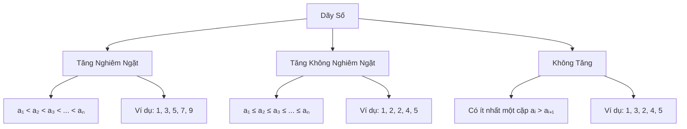

Kiểm tra tính tăng dần của một dãy số là một bài toán validation cơ bản nhưng rất quan trọng trong lập trình. Từ việc kiểm tra dữ liệu đầu vào đến phân tích xu hướng, kỹ năng này xuất hiện trong nhiều tình huống thực tế. Trong bài viết này, chúng ta sẽ khám phá các cách tiếp cận khác nhau để giải quyết bài toán này.

Bạn sẽ học được cách phân biệt giữa tăng nghiêm ngặt và tăng không nghiêm ngặt, xử lý các trường hợp đặc biệt, và áp dụng vào những tình huống thực tế như validation form, phân tích dữ liệu thống kê.

<!-- truncate -->

## Hiểu Về Dãy Số Tăng Dần

### Định Nghĩa Các Loại Dãy



:::info Phân Biệt Quan Trọng
- **Tăng nghiêm ngặt**: Mỗi phần tử sau phải lớn hơn phần tử trước
- **Tăng không nghiêm ngặt**: Mỗi phần tử sau có thể bằng hoặc lớn hơn phần tử trước
- **Không tăng**: Có ít nhất một vị trí vi phạm tính tăng
:::

### Tại Sao Cần Kiểm Tra Dãy Tăng?

**Ứng dụng trong thực tế:**
- **Validation dữ liệu**: Kiểm tra tính hợp lệ của input
- **Phân tích xu hướng**: Doanh số, nhiệt độ, chỉ số chứng khoán
- **Sắp xếp**: Kiểm tra mảng đã được sắp xếp chưa
- **Game development**: Kiểm tra level progression
- **Data analysis**: Tìm pattern trong dữ liệu

## Các Phương Pháp Kiểm Tra

### 1. Kiểm Tra Tăng Nghiêm Ngặt

**Cài đặt bằng C++:**
```cpp
#include <iostream>
#include <vector>
using namespace std;

bool isStrictlyIncreasing(const vector<int>& arr) {
    if (arr.size() <= 1) {
        return true; // Dãy rỗng hoặc 1 phần tử luôn tăng
    }
    
    cout << "Kiem tra day tang nghiem ngat:" << endl;
    cout << "Day: ";
    for (int i = 0; i < arr.size(); i++) {
        cout << arr[i];
        if (i < arr.size() - 1) cout << ", ";
    }
    cout << endl;
    
    for (int i = 0; i < arr.size() - 1; i++) {
        cout << "So sanh " << arr[i] << " va " << arr[i + 1] << ": ";
        
        if (arr[i] >= arr[i + 1]) {
            cout << arr[i] << " >= " << arr[i + 1] << " -> Vi pham!" << endl;
            return false;
        }
        
        cout << arr[i] << " < " << arr[i + 1] << " -> OK" << endl;
    }
    
    return true;
}

bool isNonDecreasing(const vector<int>& arr) {
    if (arr.size() <= 1) {
        return true;
    }
    
    cout << "\nKiem tra day tang khong nghiem ngat:" << endl;
    
    for (int i = 0; i < arr.size() - 1; i++) {
        cout << "So sanh " << arr[i] << " va " << arr[i + 1] << ": ";
        
        if (arr[i] > arr[i + 1]) {
            cout << arr[i] << " > " << arr[i + 1] << " -> Vi pham!" << endl;
            return false;
        }
        
        cout << arr[i] << " <= " << arr[i + 1] << " -> OK" << endl;
    }
    
    return true;
}

int main() {
    vector<vector<int>> testCases = {
        {1, 2, 3, 4, 5},     // Tăng nghiêm ngặt
        {1, 2, 2, 3, 4},     // Tăng không nghiêm ngặt
        {5, 4, 3, 2, 1},     // Giảm
        {1, 3, 2, 4, 5},     // Không tăng
        {42},                 // Một phần tử
        {}                    // Dãy rỗng
    };
    
    for (int i = 0; i < testCases.size(); i++) {
        cout << "\n=== Test case " << (i + 1) << " ===" << endl;
        
        bool strictly = isStrictlyIncreasing(testCases[i]);
        bool nonDecreasing = isNonDecreasing(testCases[i]);
        
        cout << "\nKet qua:" << endl;
        cout << "Tang nghiem ngat: " << (strictly ? "Co" : "Khong") << endl;
        cout << "Tang khong nghiem ngat: " << (nonDecreasing ? "Co" : "Khong") << endl;
        cout << string(40, '-') << endl;
    }
    
    return 0;
}
```

### 2. Phiên Bản Tương Tác với Input Validation

**Cài đặt bằng Python:**
```python
def get_sequence_from_user():
    """Nhận dãy số từ người dùng với validation"""
    while True:
        try:
            print("Nhập dãy số (cách nhau bằng dấu cách):")
            user_input = input("Ví dụ: 1 2 3 4 5\n> ")
            
            if not user_input.strip():
                print("❌ Vui lòng nhập ít nhất một số!")
                continue
            
            numbers = list(map(int, user_input.split()))
            
            if len(numbers) == 0:
                print("❌ Dãy không được rỗng!")
                continue
                
            return numbers
            
        except ValueError:
            print("❌ Vui lòng chỉ nhập các số nguyên hợp lệ!")
            continue

def check_strictly_increasing(sequence):
    """Kiểm tra dãy tăng nghiêm ngặt với thông tin chi tiết"""
    if len(sequence) <= 1:
        return True, "Dãy có ≤ 1 phần tử luôn được coi là tăng"
    
    print(f"\n🔍 Kiểm tra tăng nghiêm ngặt: {sequence}")
    print("-" * 50)
    
    for i in range(len(sequence) - 1):
        current = sequence[i]
        next_val = sequence[i + 1]
        
        print(f"Bước {i + 1}: So sánh {current} và {next_val}")
        
        if current >= next_val:
            if current == next_val:
                reason = f"Có 2 số bằng nhau: {current} = {next_val}"
            else:
                reason = f"Có số giảm: {current} > {next_val}"
            
            print(f"❌ {reason}")
            return False, reason
        
        print(f"✅ {current} < {next_val} - OK")
    
    return True, "Tất cả các cặp đều tăng nghiêm ngặt"

def check_non_decreasing(sequence):
    """Kiểm tra dãy tăng không nghiêm ngặt"""
    if len(sequence) <= 1:
        return True, "Dãy có ≤ 1 phần tử luôn được coi là tăng"
    
    print(f"\n🔍 Kiểm tra tăng không nghiêm ngặt: {sequence}")
    print("-" * 50)
    
    for i in range(len(sequence) - 1):
        current = sequence[i]
        next_val = sequence[i + 1]
        
        print(f"Bước {i + 1}: So sánh {current} và {next_val}")
        
        if current > next_val:
            reason = f"Có số giảm: {current} > {next_val}"
            print(f"❌ {reason}")
            return False, reason
        
        if current == next_val:
            print(f"✅ {current} = {next_val} - OK (bằng nhau được phép)")
        else:
            print(f"✅ {current} < {next_val} - OK")
    
    return True, "Dãy không có phần tử nào giảm"

def analyze_sequence_pattern(sequence):
    """Phân tích pattern của dãy số"""
    if len(sequence) <= 1:
        return
    
    print(f"\n📊 PHÂN TÍCH PATTERN CỦA DÃY")
    print("=" * 40)
    
    # Đếm các loại transition
    increasing = 0
    decreasing = 0
    equal = 0
    
    transitions = []
    
    for i in range(len(sequence) - 1):
        current = sequence[i]
        next_val = sequence[i + 1]
        
        if current < next_val:
            increasing += 1
            transitions.append("↑")
        elif current > next_val:
            decreasing += 1
            transitions.append("↓")
        else:
            equal += 1
            transitions.append("=")
    
    print(f"Dãy số: {' '.join(map(str, sequence))}")
    print(f"Pattern: {' '.join(transitions)}")
    print(f"Tăng: {increasing} lần")
    print(f"Giảm: {decreasing} lần")
    print(f"Bằng nhau: {equal} lần")
    
    # Phân loại
    if decreasing == 0 and equal == 0:
        print("🟢 Loại: Tăng nghiêm ngặt")
    elif decreasing == 0:
        print("🟡 Loại: Tăng không nghiêm ngặt")
    elif increasing == 0 and equal == 0:
        print("🔴 Loại: Giảm nghiêm ngặt")
    elif increasing == 0:
        print("🟠 Loại: Giảm không nghiêm ngặt")
    else:
        print("🔵 Loại: Không có pattern rõ ràng")

def main():
    print("🔢 CHƯƠNG TRÌNH KIỂM TRA DÃY TĂNG DẦN")
    print("=" * 50)
    
    while True:
        sequence = get_sequence_from_user()
        
        # Kiểm tra tăng nghiêm ngặt
        is_strict, strict_reason = check_strictly_increasing(sequence)
        
        # Kiểm tra tăng không nghiêm ngặt
        is_non_dec, non_dec_reason = check_non_decreasing(sequence)
        
        # Phân tích pattern
        analyze_sequence_pattern(sequence)
        
        # Tổng kết
        print(f"\n📋 KẾT QUẢ CUỐI CÙNG")
        print("=" * 30)
        print(f"Tăng nghiêm ngặt: {'✅ CÓ' if is_strict else '❌ KHÔNG'}")
        print(f"Lý do: {strict_reason}")
        print(f"Tăng không nghiêm ngặt: {'✅ CÓ' if is_non_dec else '❌ KHÔNG'}")
        print(f"Lý do: {non_dec_reason}")
        
        # Hỏi tiếp tục
        print("\nBạn có muốn kiểm tra dãy khác không? (y/n)")
        if input("> ").lower() != 'y':
            break
    
    print("👋 Cảm ơn bạn đã sử dụng chương trình!")

if __name__ == "__main__":
    main()
```

### 3. Xử Lý Với Mảng Lớn và Tối Ưu Hóa

**Cài đặt bằng Java:**
```java
import java.util.*;
import java.util.stream.IntStream;

public class SequenceValidator {
    
    public enum SequenceType {
        STRICTLY_INCREASING("Tăng nghiêm ngặt"),
        NON_DECREASING("Tăng không nghiêm ngặt"),
        STRICTLY_DECREASING("Giảm nghiêm ngặt"),
        NON_INCREASING("Giảm không nghiêm ngặt"),
        MIXED("Hỗn hợp"),
        CONSTANT("Không đổi"),
        SINGLE_OR_EMPTY("Đơn lẻ hoặc rỗng");
        
        private final String description;
        
        SequenceType(String description) {
            this.description = description;
        }
        
        public String getDescription() {
            return description;
        }
    }
    
    public static class ValidationResult {
        private final boolean isValid;
        private final SequenceType type;
        private final String reason;
        private final int violationIndex;
        
        public ValidationResult(boolean isValid, SequenceType type, 
                               String reason, int violationIndex) {
            this.isValid = isValid;
            this.type = type;
            this.reason = reason;
            this.violationIndex = violationIndex;
        }
        
        // Getters
        public boolean isValid() { return isValid; }
        public SequenceType getType() { return type; }
        public String getReason() { return reason; }
        public int getViolationIndex() { return violationIndex; }
    }
    
    public static ValidationResult validateStrictlyIncreasing(int[] arr) {
        if (arr.length <= 1) {
            return new ValidationResult(true, SequenceType.SINGLE_OR_EMPTY, 
                                      "Dãy có ≤ 1 phần tử", -1);
        }
        
        for (int i = 0; i < arr.length - 1; i++) {
            if (arr[i] >= arr[i + 1]) {
                String reason = arr[i] == arr[i + 1] ? 
                    String.format("Có 2 số bằng nhau tại vị trí %d và %d: %d = %d", 
                                 i, i + 1, arr[i], arr[i + 1]) :
                    String.format("Có số giảm tại vị trí %d và %d: %d > %d", 
                                 i, i + 1, arr[i], arr[i + 1]);
                return new ValidationResult(false, SequenceType.MIXED, reason, i);
            }
        }
        
        return new ValidationResult(true, SequenceType.STRICTLY_INCREASING, 
                                  "Tất cả các cặp đều tăng nghiêm ngặt", -1);
    }
    
    public static ValidationResult validateNonDecreasing(int[] arr) {
        if (arr.length <= 1) {
            return new ValidationResult(true, SequenceType.SINGLE_OR_EMPTY, 
                                      "Dãy có ≤ 1 phần tử", -1);
        }
        
        boolean hasEqual = false;
        
        for (int i = 0; i < arr.length - 1; i++) {
            if (arr[i] > arr[i + 1]) {
                String reason = String.format("Có số giảm tại vị trí %d và %d: %d > %d", 
                                            i, i + 1, arr[i], arr[i + 1]);
                return new ValidationResult(false, SequenceType.MIXED, reason, i);
            }
            
            if (arr[i] == arr[i + 1]) {
                hasEqual = true;
            }
        }
        
        SequenceType type = hasEqual ? SequenceType.NON_DECREASING : 
                                      SequenceType.STRICTLY_INCREASING;
        return new ValidationResult(true, type, 
                                  "Dãy không có phần tử nào giảm", -1);
    }
    
    public static SequenceType analyzeSequenceType(int[] arr) {
        if (arr.length <= 1) {
            return SequenceType.SINGLE_OR_EMPTY;
        }
        
        boolean hasIncrease = false;
        boolean hasDecrease = false;
        boolean hasEqual = false;
        
        for (int i = 0; i < arr.length - 1; i++) {
            if (arr[i] < arr[i + 1]) {
                hasIncrease = true;
            } else if (arr[i] > arr[i + 1]) {
                hasDecrease = true;
            } else {
                hasEqual = true;
            }
        }
        
        // Phân loại
        if (!hasDecrease && !hasEqual) {
            return SequenceType.STRICTLY_INCREASING;
        } else if (!hasDecrease) {
            return SequenceType.NON_DECREASING;
        } else if (!hasIncrease && !hasEqual) {
            return SequenceType.STRICTLY_DECREASING;
        } else if (!hasIncrease) {
            return SequenceType.NON_INCREASING;
        } else if (!hasIncrease && !hasDecrease) {
            return SequenceType.CONSTANT;
        } else {
            return SequenceType.MIXED;
        }
    }
    
    public static void demonstrateValidation() {
        int[][] testCases = {
            {1, 2, 3, 4, 5},
            {1, 2, 2, 3, 4},
            {5, 4, 3, 2, 1},
            {1, 3, 2, 4, 5},
            {5, 5, 5, 5, 5},
            {42},
            {},
            {1, 1, 2, 2, 3, 3}
        };
        
        System.out.println("=== DEMO VALIDATION DÃY SỐ ===");
        
        for (int i = 0; i < testCases.length; i++) {
            int[] arr = testCases[i];
            
            System.out.println("\nTest case " + (i + 1) + ": " + 
                             Arrays.toString(arr));
            System.out.println("-".repeat(50));
            
            // Kiểm tra tăng nghiêm ngặt
            ValidationResult strictResult = validateStrictlyIncreasing(arr);
            System.out.println("Tăng nghiêm ngặt: " + 
                             (strictResult.isValid() ? "✅ CÓ" : "❌ KHÔNG"));
            System.out.println("Lý do: " + strictResult.getReason());
            
            // Kiểm tra tăng không nghiêm ngặt
            ValidationResult nonDecResult = validateNonDecreasing(arr);
            System.out.println("Tăng không nghiêm ngặt: " + 
                             (nonDecResult.isValid() ? "✅ CÓ" : "❌ KHÔNG"));
            System.out.println("Lý do: " + nonDecResult.getReason());
            
            // Phân tích tổng thể
            SequenceType type = analyzeSequenceType(arr);
            System.out.println("Loại dãy: " + type.getDescription());
        }
    }
    
    public static void main(String[] args) {
        demonstrateValidation();
        
        // Interactive mode
        Scanner scanner = new Scanner(System.in);
        System.out.println("\n" + "=".repeat(50));
        System.out.println("CHẾ ĐỘ TƯƠNG TÁC");
        
        while (true) {
            System.out.println("\nNhập dãy số (cách nhau bằng dấu cách), " +
                             "hoặc 'quit' để thoát:");
            System.out.print("> ");
            
            String input = scanner.nextLine().trim();
            
            if (input.equalsIgnoreCase("quit")) {
                break;
            }
            
            try {
                int[] numbers = Arrays.stream(input.split("\\s+"))
                                     .mapToInt(Integer::parseInt)
                                     .toArray();
                
                System.out.println("Dãy đã nhập: " + Arrays.toString(numbers));
                
                ValidationResult result = validateStrictlyIncreasing(numbers);
                System.out.println("Kết quả: " + 
                                 (result.isValid() ? "Tăng nghiêm ngặt" : 
                                  "Không tăng nghiêm ngặt"));
                System.out.println("Chi tiết: " + result.getReason());
                
            } catch (NumberFormatException e) {
                System.out.println("❌ Lỗi: Vui lòng nhập các số nguyên hợp lệ!");
            }
        }
        
        System.out.println("👋 Cảm ơn bạn đã sử dụng chương trình!");
        scanner.close();
    }
}
```

## Ứng Dụng Thực Tế

### 1. Validation Form Input

**Cài đặt bằng Python:**
```python
def validate_age_sequence(ages):
    """Validate dãy tuổi trong gia đình (phải tăng dần)"""
    if not ages:
        return False, "Danh sách tuổi không được rỗng"
    
    if len(ages) == 1:
        return True, "Chỉ có một người trong gia đình"
    
    for i in range(len(ages) - 1):
        if ages[i] >= ages[i + 1]:
            return False, f"Tuổi không hợp lệ: người thứ {i+1} ({ages[i]} tuổi) >= người thứ {i+2} ({ages[i+1]} tuổi)"
    
    return True, "Dãy tuổi hợp lệ"

def validate_salary_progression(salaries, years):
    """Validate tiến trình lương theo năm"""
    if len(salaries) != len(years):
        return False, "Số lượng lương và năm không khớp"
    
    # Kiểm tra năm tăng dần
    for i in range(len(years) - 1):
        if years[i] >= years[i + 1]:
            return False, f"Năm không tăng dần: {years[i]} >= {years[i + 1]}"
    
    # Kiểm tra lương có xu hướng tăng (cho phép giảm tối đa 1 lần)
    decrease_count = 0
    for i in range(len(salaries) - 1):
        if salaries[i] > salaries[i + 1]:
            decrease_count += 1
            if decrease_count > 1:
                return False, f"Lương giảm quá nhiều lần (> 1 lần)"
    
    return True, "Tiến trình lương hợp lệ"

def validate_test_scores(scores):
    """Validate điểm thi qua các môn (mong muốn tăng dần)"""
    if len(scores) < 2:
        return True, "Cần ít nhất 2 điểm để so sánh"
    
    strictly_increasing = True
    non_decreasing = True
    
    for i in range(len(scores) - 1):
        if scores[i] >= scores[i + 1]:
            strictly_increasing = False
        if scores[i] > scores[i + 1]:
            non_decreasing = False
    
    if strictly_increasing:
        return True, "Điểm tăng đều qua các môn - Rất tốt!"
    elif non_decreasing:
        return True, "Điểm ổn định hoặc tăng - Tốt!"
    else:
        return False, "Có môn bị giảm điểm - Cần cải thiện!"

def main():
    print("🏠 VALIDATION TRONG THỰC TẾ")
    print("=" * 40)
    
    # Test validation tuổi
    family_ages = [25, 27, 30, 28, 35]  # Có lỗi
    is_valid, message = validate_age_sequence(family_ages)
    print(f"Tuổi gia đình {family_ages}: {message}")
    
    # Test validation lương
    years = [2020, 2021, 2022, 2023]
    salaries = [1000, 1200, 1100, 1300]  # Có 1 lần giảm - OK
    is_valid, message = validate_salary_progression(salaries, years)
    print(f"Lương qua các năm: {message}")
    
    # Test điểm thi
    test_scores = [7.5, 8.0, 8.2, 8.5]
    is_valid, message = validate_test_scores(test_scores)
    print(f"Điểm thi {test_scores}: {message}")

if __name__ == "__main__":
    main()
```

### 2. Phân Tích Dữ Liệu Tài Chính

**Cài đặt bằng Java:**
```java
import java.util.*;
import java.time.LocalDate;
import java.time.format.DateTimeFormatter;

public class FinancialTrendAnalyzer {
    
    public static class DataPoint {
        private LocalDate date;
        private double value;
        
        public DataPoint(LocalDate date, double value) {
            this.date = date;
            this.value = value;
        }
        
        public LocalDate getDate() { return date; }
        public double getValue() { return value; }
        
        @Override
        public String toString() {
            return String.format("%s: %.2f", 
                               date.format(DateTimeFormatter.ofPattern("dd/MM/yyyy")), 
                               value);
        }
    }
    
    public static class TrendAnalysis {
        private boolean isIncreasing;
        private boolean isStrictlyIncreasing;
        private int increaseCount;
        private int decreaseCount;
        private int equalCount;
        private double totalGrowth;
        private double averageGrowthRate;
        
        // Constructor và getters...
        public TrendAnalysis(boolean isIncreasing, boolean isStrictlyIncreasing,
                           int increaseCount, int decreaseCount, int equalCount,
                           double totalGrowth, double averageGrowthRate) {
            this.isIncreasing = isIncreasing;
            this.isStrictlyIncreasing = isStrictlyIncreasing;
            this.increaseCount = increaseCount;
            this.decreaseCount = decreaseCount;
            this.equalCount = equalCount;
            this.totalGrowth = totalGrowth;
            this.averageGrowthRate = averageGrowthRate;
        }
        
        public boolean isIncreasing() { return isIncreasing; }
        public boolean isStrictlyIncreasing() { return isStrictlyIncreasing; }
        public int getIncreaseCount() { return increaseCount; }
        public int getDecreaseCount() { return decreaseCount; }
        public double getTotalGrowth() { return totalGrowth; }
        public double getAverageGrowthRate() { return averageGrowthRate; }
    }
    
    public static TrendAnalysis analyzeTrend(List<DataPoint> data) {
        if (data.size() <= 1) {
            return new TrendAnalysis(true, true, 0, 0, 0, 0.0, 0.0);
        }
        
        int increaseCount = 0;
        int decreaseCount = 0;
        int equalCount = 0;
        
        for (int i = 0; i < data.size() - 1; i++) {
            double current = data.get(i).getValue();
            double next = data.get(i + 1).getValue();
            
            if (current < next) {
                increaseCount++;
            } else if (current > next) {
                decreaseCount++;
            } else {
                equalCount++;
            }
        }
        
        boolean isIncreasing = decreaseCount == 0;
        boolean isStrictlyIncreasing = decreaseCount == 0 && equalCount == 0;
        
        double totalGrowth = data.get(data.size() - 1).getValue() - 
                            data.get(0).getValue();
        double averageGrowthRate = totalGrowth / (data.size() - 1);
        
        return new TrendAnalysis(isIncreasing, isStrictlyIncreasing,
                               increaseCount, decreaseCount, equalCount,
                               totalGrowth, averageGrowthRate);
    }
    
    public static void printTrendReport(List<DataPoint> data, String title) {
        System.out.println("\n" + "=".repeat(50));
        System.out.println(title.toUpperCase());
        System.out.println("=".repeat(50));
        
        // In dữ liệu
        System.out.println("DỮ LIỆU:");
        for (DataPoint point : data) {
            System.out.println("  " + point);
        }
        
        // Phân tích xu hướng
        TrendAnalysis analysis = analyzeTrend(data);
        
        System.out.println("\nPHÂN TÍCH XU HƯỚNG:");
        System.out.println("📈 Tăng không nghiêm ngặt: " + 
                         (analysis.isIncreasing() ? "✅ CÓ" : "❌ KHÔNG"));
        System.out.println("📊 Tăng nghiêm ngặt: " + 
                         (analysis.isStrictlyIncreasing() ? "✅ CÓ" : "❌ KHÔNG"));
        System.out.println("⬆️  Số lần tăng: " + analysis.getIncreaseCount());
        System.out.println("⬇️  Số lần giảm: " + analysis.getDecreaseCount());
        System.out.printf("💰 Tăng trưởng tổng: %.2f\n", analysis.getTotalGrowth());
        System.out.printf("📊 Tăng trưởng trung bình/kỳ: %.2f\n", 
                         analysis.getAverageGrowthRate());
        
        // Đánh giá
        if (analysis.isStrictlyIncreasing()) {
            System.out.println("🎉 ĐÁNH GIÁ: Xu hướng tăng trưởng mạnh và ổn định!");
        } else if (analysis.isIncreasing()) {
            System.out.println("😊 ĐÁNH GIÁ: Xu hướng tích cực, có thể cải thiện tốc độ tăng trưởng.");
        } else {
            System.out.println("⚠️  ĐÁNH GIÁ: Cần chú ý - có thời kỳ suy giảm.");
        }
    }
    
    public static void main(String[] args) {
        // Dữ liệu doanh thu theo tháng
        List<DataPoint> revenue = Arrays.asList(
            new DataPoint(LocalDate.of(2023, 1, 1), 100000),
            new DataPoint(LocalDate.of(2023, 2, 1), 105000),
            new DataPoint(LocalDate.of(2023, 3, 1), 110000),
            new DataPoint(LocalDate.of(2023, 4, 1), 108000), // Giảm
            new DataPoint(LocalDate.of(2023, 5, 1), 115000),
            new DataPoint(LocalDate.of(2023, 6, 1), 120000)
        );
        
        // Dữ liệu giá cổ phiếu
        List<DataPoint> stockPrice = Arrays.asList(
            new DataPoint(LocalDate.of(2023, 1, 1), 50.0),
            new DataPoint(LocalDate.of(2023, 2, 1), 52.5),
            new DataPoint(LocalDate.of(2023, 3, 1), 55.0),
            new DataPoint(LocalDate.of(2023, 4, 1), 58.5),
            new DataPoint(LocalDate.of(2023, 5, 1), 62.0),
            new DataPoint(LocalDate.of(2023, 6, 1), 65.5)
        );
        
        printTrendReport(revenue, "Phân tích doanh thu 6 tháng đầu năm");
        printTrendReport(stockPrice, "Phân tích giá cổ phiếu");
    }
}
```

## Xử Lý Trường Hợp Đặc Biệt

### 1. Dãy Có Floating Point

**Cài đặt bằng C++:**
```cpp
#include <iostream>
#include <vector>
#include <cmath>
#include <iomanip>
using namespace std;

const double EPSILON = 1e-9;

bool isEqual(double a, double b) {
    return abs(a - b) < EPSILON;
}

bool isStrictlyIncreasingFloat(const vector<double>& arr) {
    if (arr.size() <= 1) return true;
    
    cout << fixed << setprecision(6);
    cout << "Kiem tra day so thuc tang nghiem ngat:" << endl;
    
    for (int i = 0; i < arr.size() - 1; i++) {
        cout << "So sanh " << arr[i] << " va " << arr[i + 1] << ": ";
        
        if (arr[i] >= arr[i + 1] - EPSILON) {
            if (isEqual(arr[i], arr[i + 1])) {
                cout << "Bang nhau (trong sai so cho phep)" << endl;
            } else {
                cout << "Giam hoac bang nhau" << endl;
            }
            return false;
        }
        
        cout << "Tang" << endl;
    }
    
    return true;
}

int main() {
    vector<double> testFloat = {1.0, 1.5, 2.0000001, 2.5, 3.0};
    
    cout << "Test voi so thuc:" << endl;
    for (double x : testFloat) {
        cout << x << " ";
    }
    cout << endl;
    
    bool result = isStrictlyIncreasingFloat(testFloat);
    cout << "Ket qua: " << (result ? "Tang nghiem ngat" : "Khong tang nghiem ngat") << endl;
    
    return 0;
}
```

### 2. Xử Lý Với Big Data

```python
def check_large_sequence_streaming(file_path, chunk_size=1000):
    """Kiểm tra dãy số lớn bằng cách đọc từng chunk"""
    
    def is_increasing_chunk(chunk):
        """Kiểm tra một chunk có tăng dần không"""
        for i in range(len(chunk) - 1):
            if chunk[i] >= chunk[i + 1]:
                return False, i
        return True, -1
    
    try:
        with open(file_path, 'r') as file:
            previous_last = None
            chunk_index = 0
            
            while True:
                # Đọc chunk
                lines = []
                for _ in range(chunk_size):
                    line = file.readline()
                    if not line:
                        break
                    lines.append(float(line.strip()))
                
                if not lines:
                    break
                
                chunk_index += 1
                print(f"Xử lý chunk {chunk_index}: {len(lines)} phần tử")
                
                # Kiểm tra liên kết với chunk trước
                if previous_last is not None:
                    if previous_last >= lines[0]:
                        return False, f"Vi phạm giữa chunk {chunk_index-1} và {chunk_index}: {previous_last} >= {lines[0]}"
                
                # Kiểm tra trong chunk
                is_valid, error_index = is_increasing_chunk(lines)
                if not is_valid:
                    global_index = (chunk_index - 1) * chunk_size + error_index
                    return False, f"Vi phạm trong chunk {chunk_index} tại vị trí {global_index}: {lines[error_index]} >= {lines[error_index + 1]}"
                
                previous_last = lines[-1]
        
        return True, "Toàn bộ dãy tăng nghiêm ngặt"
    
    except FileNotFoundError:
        return False, f"Không tìm thấy file {file_path}"
    except Exception as e:
        return False, f"Lỗi xử lý: {str(e)}"

# Test với file lớn
def create_test_file(filename, size=10000):
    """Tạo file test với dãy số tăng dần"""
    with open(filename, 'w') as f:
        for i in range(size):
            f.write(f"{i + 1}\n")
    print(f"Đã tạo file {filename} với {size} số")

def main():
    # Tạo file test
    create_test_file("test_sequence.txt", 5000)
    
    # Kiểm tra
    is_valid, message = check_large_sequence_streaming("test_sequence.txt")
    print(f"Kết quả: {message}")

if __name__ == "__main__":
    main()
```

## So Sánh Hiệu Suất

### Bảng So Sánh Các Phương Pháp

| Phương pháp | Độ phức tạp | Memory | Phù hợp cho |
|-------------|-------------|---------|-------------|
| Đơn giản | O(n) | O(1) | Dãy nhỏ |
| Streaming | O(n) | O(chunk_size) | Dãy lớn |
| Parallel | O(n/p) | O(n) | Dãy cực lớn |
| Early stop | O(k) | O(1) | Tìm vi phạm nhanh |

### Benchmark Test

```python
import time
import random

def benchmark_sequence_validation():
    sizes = [1000, 10000, 100000, 1000000]
    
    print("=== BENCHMARK KIỂM TRA DÃY TĂNG ===")
    print(f"{'Size':<10} {'Time (ms)':<12} {'Memory':<10}")
    print("-" * 35)
    
    for size in sizes:
        # Tạo dãy tăng dần
        sequence = list(range(size))
        
        start_time = time.time()
        
        # Kiểm tra tăng nghiêm ngặt
        is_increasing = True
        for i in range(len(sequence) - 1):
            if sequence[i] >= sequence[i + 1]:
                is_increasing = False
                break
        
        end_time = time.time()
        
        time_ms = (end_time - start_time) * 1000
        memory_mb = size * 8 / (1024 * 1024)  # Ước tính
        
        print(f"{size:<10} {time_ms:<12.3f} {memory_mb:<10.2f}MB")

if __name__ == "__main__":
    benchmark_sequence_validation()
```

## Bài Tập Thực Hành

### Bài Tập 1: Kiểm Tra Nhiều Điều Kiện
Viết hàm kiểm tra dãy số vừa tăng dần vừa có các phần tử đều chẵn.

### Bài Tập 2: Tìm Dãy Con Tăng Dài Nhất
Trong một dãy số, tìm dãy con liên tiếp tăng dần dài nhất.

### Bài Tập 3: Sửa Dãy Thành Tăng Dần
Cho dãy số, tìm số phần tử tối thiểu cần xóa để dãy trở nên tăng dần.

### Bài Tập 4: Kiểm Tra Dãy 2D
Kiểm tra ma trận có mỗi hàng và mỗi cột đều tăng dần không.

## Tổng Kết

Qua bài viết này, bạn đã học được:

1. **Phân biệt các loại dãy**: Tăng nghiêm ngặt vs không nghiêm ngặt
2. **Thuật toán kiểm tra**: Từ cơ bản đến tối ưu hóa
3. **Xử lý trường hợp đặc biệt**: Floating point, big data
4. **Ứng dụng thực tế**: Validation, phân tích xu hướng
5. **Tối ưu hóa hiệu suất**: Streaming, early stopping

:::tip Lời Khuyên
- Luôn xác định rõ yêu cầu: tăng nghiêm ngặt hay không nghiêm ngặt
- Xử lý các trường hợp edge case: dãy rỗng, một phần tử
- Với dữ liệu lớn, sử dụng streaming để tiết kiệm memory
- Early stopping giúp tăng hiệu suất khi chỉ cần biết có vi phạm hay không
:::

Kỹ năng kiểm tra dãy tăng dần là nền tảng cho nhiều thuật toán phức tạp hơn như sorting validation, binary search applicability, và data trend analysis. Hãy thực hành với các bài tập để thành thạo!