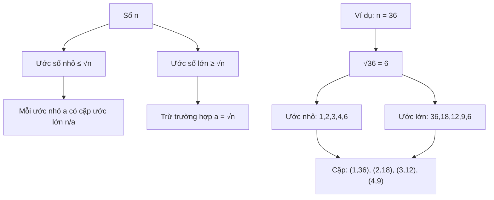

Tìm các ước số của một số là một bài toán cơ bản trong toán học và lập trình. Từ việc phân tích số học đến các ứng dụng trong mật mã học, việc hiểu cách tìm ước số hiệu quả là rất quan trọng. Trong bài viết này, chúng ta sẽ khám phá nhiều cách tiếp cận khác nhau, từ đơn giản đến tối ưu.

Bạn sẽ học được cách cải thiện thuật toán từ O(n) xuống O(√n), hiểu được tại sao và khi nào nên áp dụng từng phương pháp. Đây là nền tảng quan trọng cho nhiều bài toán nâng cao hơn.

<!-- truncate -->

## Hiểu Về Ước Số

### Định Nghĩa Ước Số

Ước số (divisor/factor) của một số nguyên dương n là những số nguyên dương chia hết cho n.

**Ví dụ:**
- Ước số của 12: 1, 2, 3, 4, 6, 12
- Ước số của 16: 1, 2, 4, 8, 16
- Ước số của 7: 1, 7 (số nguyên tố chỉ có 2 ước số)

### Tính Chất Quan Trọng



:::info Tính Chất Cốt Lõi
Nếu a là ước số của n, thì n/a cũng là ước số của n. Điều này giúp chúng ta chỉ cần kiểm tra đến √n thay vì đến n.
:::

## Các Phương Pháp Tìm Ước Số

### 1. Phương Pháp Brute Force - O(n)

Cách đơn giản nhất là kiểm tra tất cả các số từ 1 đến n:

**Cài đặt bằng C++:**
```cpp
#include <iostream>
#include <vector>
#include <algorithm>
using namespace std;

vector<int> findDivisorsBruteForce(int n) {
    vector<int> divisors;
    
    cout << "Tim uoc so cua " << n << ":" << endl;
    cout << "Kiem tra tu 1 den " << n << endl;
    
    for (int i = 1; i <= n; i++) {
        if (n % i == 0) {
            divisors.push_back(i);
            cout << i << " la uoc so cua " << n << endl;
        }
    }
    
    return divisors;
}

void printDivisors(const vector<int>& divisors) {
    cout << "Cac uoc so: ";
    for (int i = 0; i < divisors.size(); i++) {
        cout << divisors[i];
        if (i < divisors.size() - 1) cout << ", ";
    }
    cout << endl;
    cout << "Tong so uoc so: " << divisors.size() << endl;
}

int main() {
    int n;
    cout << "Nhap so nguyen duong n: ";
    cin >> n;
    
    vector<int> divisors = findDivisorsBruteForce(n);
    printDivisors(divisors);
    
    return 0;
}
```

**Phân tích:**
- **Ưu điểm**: Đơn giản, dễ hiểu, đảm bảo tìm được tất cả ước số
- **Nhược điểm**: Chậm với n lớn, độ phức tạp O(n)

### 2. Phương Pháp Tối Ưu - O(√n)

Sử dụng tính chất của ước số để giảm số lần kiểm tra:

**Cài đặt bằng Python:**
```python
import math

def find_divisors_optimized(n):
    """Tìm ước số với độ phức tạp O(√n)"""
    divisors = []
    sqrt_n = int(math.sqrt(n))
    
    print(f"Tìm ước số của {n}:")
    print(f"Chỉ cần kiểm tra từ 1 đến {sqrt_n} (√{n})")
    
    for i in range(1, sqrt_n + 1):
        if n % i == 0:
            divisors.append(i)
            print(f"{i} là ước số")
            
            # Thêm ước số tương ứng n/i (nếu khác i)
            if i != n // i:
                divisors.append(n // i)
                print(f"{n // i} cũng là ước số (vì {n} ÷ {i} = {n // i})")
    
    # Sắp xếp kết quả
    divisors.sort()
    return divisors

def analyze_divisors(n, divisors):
    """Phân tích thống kê về ước số"""
    print(f"\n=== PHÂN TÍCH ƯỚC SỐ CỦA {n} ===")
    print(f"Tất cả ước số: {divisors}")
    print(f"Số lượng ước số: {len(divisors)}")
    print(f"Tổng các ước số: {sum(divisors)}")
    
    # Phân loại ước số
    proper_divisors = [d for d in divisors if d != n]
    print(f"Ước số thực sự (không kể {n}): {proper_divisors}")
    
    # Kiểm tra số hoàn hảo
    if sum(proper_divisors) == n:
        print(f"🎉 {n} là số hoàn hảo!")
    elif sum(proper_divisors) > n:
        print(f"📈 {n} là số thừa (abundant)")
    else:
        print(f"📉 {n} là số thiếu (deficient)")

def main():
    n = int(input("Nhập số nguyên dương: "))
    
    if n <= 0:
        print("Vui lòng nhập số nguyên dương!")
        return
    
    divisors = find_divisors_optimized(n)
    analyze_divisors(n, divisors)

if __name__ == "__main__":
    main()
```

### 3. Cài Đặt Với Theo Dõi Hiệu Suất

**Cài đặt bằng Java:**
```java
import java.util.*;
import java.util.stream.Collectors;

public class DivisorFinder {
    
    public static class Result {
        List<Integer> divisors;
        long timeNanos;
        int comparisons;
        
        Result(List<Integer> divisors, long timeNanos, int comparisons) {
            this.divisors = divisors;
            this.timeNanos = timeNanos;
            this.comparisons = comparisons;
        }
    }
    
    public static Result findDivisorsBruteForce(int n) {
        long startTime = System.nanoTime();
        List<Integer> divisors = new ArrayList<>();
        int comparisons = 0;
        
        for (int i = 1; i <= n; i++) {
            comparisons++;
            if (n % i == 0) {
                divisors.add(i);
            }
        }
        
        long endTime = System.nanoTime();
        return new Result(divisors, endTime - startTime, comparisons);
    }
    
    public static Result findDivisorsOptimized(int n) {
        long startTime = System.nanoTime();
        Set<Integer> divisorSet = new HashSet<>();
        int comparisons = 0;
        
        int sqrt = (int) Math.sqrt(n);
        for (int i = 1; i <= sqrt; i++) {
            comparisons++;
            if (n % i == 0) {
                divisorSet.add(i);
                divisorSet.add(n / i);
            }
        }
        
        List<Integer> divisors = new ArrayList<>(divisorSet);
        Collections.sort(divisors);
        
        long endTime = System.nanoTime();
        return new Result(divisors, endTime - startTime, comparisons);
    }
    
    public static void comparePerformance(int n) {
        System.out.println("=== SO SÁNH HIỆU SUẤT ===");
        System.out.println("Số cần tìm ước: " + n);
        System.out.println();
        
        Result bruteForce = findDivisorsBruteForce(n);
        System.out.println("BRUTE FORCE:");
        System.out.println("Ước số: " + bruteForce.divisors);
        System.out.println("Thời gian: " + bruteForce.timeNanos + " nanoseconds");
        System.out.println("Số phép so sánh: " + bruteForce.comparisons);
        System.out.println();
        
        Result optimized = findDivisorsOptimized(n);
        System.out.println("OPTIMIZED:");
        System.out.println("Ước số: " + optimized.divisors);
        System.out.println("Thời gian: " + optimized.timeNanos + " nanoseconds");
        System.out.println("Số phép so sánh: " + optimized.comparisons);
        System.out.println();
        
        double speedup = (double) bruteForce.timeNanos / optimized.timeNanos;
        double comparisonReduction = (double) bruteForce.comparisons / optimized.comparisons;
        
        System.out.println("TỐI ƯU HÓA:");
        System.out.printf("Nhanh hơn: %.2fx%n", speedup);
        System.out.printf("Giảm phép so sánh: %.2fx%n", comparisonReduction);
    }
    
    public static void main(String[] args) {
        Scanner scanner = new Scanner(System.in);
        
        System.out.print("Nhập số cần tìm ước (thử với số lớn để thấy sự khác biệt): ");
        int n = scanner.nextInt();
        
        comparePerformance(n);
        
        scanner.close();
    }
}
```

## Các Trường Hợp Đặc Biệt

### 1. Xử Lý Số Chính Phương

Với số chính phương, cần chú ý không thêm √n hai lần:

**Cài đặt bằng C++:**
```cpp
#include <iostream>
#include <vector>
#include <cmath>
#include <algorithm>
using namespace std;

vector<int> findDivisorsPerfectSquare(int n) {
    vector<int> divisors;
    int sqrtN = sqrt(n);
    
    cout << "So " << n;
    if (sqrtN * sqrtN == n) {
        cout << " la so chinh phuong (" << sqrtN << "²)" << endl;
    } else {
        cout << " khong phai so chinh phuong" << endl;
    }
    
    for (int i = 1; i <= sqrtN; i++) {
        if (n % i == 0) {
            divisors.push_back(i);
            
            // Chỉ thêm n/i nếu i khác √n
            if (i != sqrtN || sqrtN * sqrtN != n) {
                divisors.push_back(n / i);
            }
        }
    }
    
    sort(divisors.begin(), divisors.end());
    return divisors;
}

void demonstratePerfectSquares() {
    vector<int> testNumbers = {16, 25, 36, 15, 20, 24};
    
    for (int n : testNumbers) {
        cout << "\n--- Test với n = " << n << " ---" << endl;
        vector<int> divisors = findDivisorsPerfectSquare(n);
        
        cout << "Uoc so: ";
        for (int i = 0; i < divisors.size(); i++) {
            cout << divisors[i];
            if (i < divisors.size() - 1) cout << ", ";
        }
        cout << endl;
    }
}

int main() {
    demonstratePerfectSquares();
    return 0;
}
```

### 2. Tìm Ước Số Nguyên Tố

**Cài đặt bằng Python:**
```python
def is_prime(n):
    """Kiểm tra n có phải số nguyên tố"""
    if n < 2:
        return False
    if n == 2:
        return True
    if n % 2 == 0:
        return False
    
    for i in range(3, int(n**0.5) + 1, 2):
        if n % i == 0:
            return False
    return True

def find_prime_divisors(n):
    """Tìm tất cả ước số nguyên tố"""
    all_divisors = []
    sqrt_n = int(n**0.5)
    
    for i in range(1, sqrt_n + 1):
        if n % i == 0:
            all_divisors.append(i)
            if i != n // i:
                all_divisors.append(n // i)
    
    all_divisors.sort()
    prime_divisors = [d for d in all_divisors if is_prime(d)]
    
    return all_divisors, prime_divisors

def prime_factorization(n):
    """Phân tích thành thừa số nguyên tố"""
    factors = []
    d = 2
    
    while d * d <= n:
        while n % d == 0:
            factors.append(d)
            n //= d
        d += 1
    
    if n > 1:
        factors.append(n)
    
    return factors

def main():
    n = int(input("Nhập số cần phân tích: "))
    
    all_divisors, prime_divisors = find_prime_divisors(n)
    prime_factors = prime_factorization(n)
    
    print(f"\n=== PHÂN TÍCH SỐ {n} ===")
    print(f"Tất cả ước số: {all_divisors}")
    print(f"Ước số nguyên tố: {prime_divisors}")
    print(f"Phân tích thừa số nguyên tố: {' × '.join(map(str, prime_factors))}")
    
    # Kiểm tra tính chất
    if len(prime_divisors) == 1 and prime_divisors[0] == n:
        print(f"🔹 {n} là số nguyên tố")
    elif len(all_divisors) == 2:
        print(f"🔹 {n} là số nguyên tố")
    else:
        print(f"🔹 {n} là hợp số")

if __name__ == "__main__":
    main()
```

## Ứng Dụng Thực Tế

### 1. Tìm Các Cặp Ước Số

**Cài đặt bằng Java:**
```java
import java.util.*;

public class DivisorPairs {
    
    public static class Pair {
        int first, second;
        
        Pair(int first, int second) {
            this.first = first;
            this.second = second;
        }
        
        @Override
        public String toString() {
            return "(" + first + ", " + second + ")";
        }
    }
    
    public static List<Pair> findDivisorPairs(int n) {
        List<Pair> pairs = new ArrayList<>();
        int sqrt = (int) Math.sqrt(n);
        
        for (int i = 1; i <= sqrt; i++) {
            if (n % i == 0) {
                int j = n / i;
                pairs.add(new Pair(i, j));
            }
        }
        
        return pairs;
    }
    
    public static void analyzeNumber(int n) {
        List<Pair> pairs = findDivisorPairs(n);
        
        System.out.println("=== PHÂN TÍCH SỐ " + n + " ===");
        System.out.println("Các cặp ước số (a, b) với a × b = " + n + ":");
        
        for (Pair pair : pairs) {
            System.out.printf("%d × %d = %d%n", 
                             pair.first, pair.second, n);
        }
        
        // Ứng dụng: Tìm kích thước hình chữ nhật
        System.out.println("\nỨng dụng - Các kích thước hình chữ nhật có diện tích " + n + ":");
        for (Pair pair : pairs) {
            System.out.printf("Chiều rộng: %d, Chiều dài: %d%n", 
                             pair.first, pair.second);
        }
    }
    
    public static void main(String[] args) {
        Scanner scanner = new Scanner(System.in);
        
        System.out.print("Nhập diện tích hình chữ nhật: ");
        int area = scanner.nextInt();
        
        analyzeNumber(area);
        
        scanner.close();
    }
}
```

### 2. Tìm Ước Số Chung Lớn Nhất (GCD)

```python
def find_all_divisors(n):
    """Tìm tất cả ước số của n"""
    divisors = []
    for i in range(1, int(n**0.5) + 1):
        if n % i == 0:
            divisors.append(i)
            if i != n // i:
                divisors.append(n // i)
    return sorted(divisors)

def find_common_divisors(a, b):
    """Tìm tất cả ước số chung của a và b"""
    divisors_a = set(find_all_divisors(a))
    divisors_b = set(find_all_divisors(b))
    
    common_divisors = divisors_a.intersection(divisors_b)
    return sorted(list(common_divisors))

def gcd_euclidean(a, b):
    """Tính GCD bằng thuật toán Euclid"""
    while b:
        a, b = b, a % b
    return a

def main():
    print("=== TÌM ƯỚC SỐ CHUNG ===")
    a = int(input("Nhập số thứ nhất: "))
    b = int(input("Nhập số thứ hai: "))
    
    print(f"\nƯớc số của {a}: {find_all_divisors(a)}")
    print(f"Ước số của {b}: {find_all_divisors(b)}")
    
    common_divisors = find_common_divisors(a, b)
    print(f"Ước số chung: {common_divisors}")
    
    if common_divisors:
        print(f"GCD({a}, {b}) = {max(common_divisors)}")
        
    # So sánh với thuật toán Euclid
    gcd_result = gcd_euclidean(a, b)
    print(f"Kiểm tra với thuật toán Euclid: {gcd_result}")

if __name__ == "__main__":
    main()
```

## Tối Ưu Hóa Nâng Cao

### 1. Sử Dụng Sàng Eratosthenes cho Nhiều Số

**Cài đặt bằng C++:**
```cpp
#include <iostream>
#include <vector>
#include <unordered_map>
using namespace std;

class DivisorCalculator {
private:
    vector<bool> is_prime;
    vector<int> primes;
    int max_n;
    
public:
    DivisorCalculator(int max_n) : max_n(max_n) {
        sieveOfEratosthenes();
    }
    
    void sieveOfEratosthenes() {
        is_prime.assign(max_n + 1, true);
        is_prime[0] = is_prime[1] = false;
        
        for (int i = 2; i * i <= max_n; i++) {
            if (is_prime[i]) {
                for (int j = i * i; j <= max_n; j += i) {
                    is_prime[j] = false;
                }
            }
        }
        
        for (int i = 2; i <= max_n; i++) {
            if (is_prime[i]) {
                primes.push_back(i);
            }
        }
    }
    
    int countDivisors(int n) {
        int count = 1;
        int temp = n;
        
        for (int prime : primes) {
            if (prime * prime > temp) break;
            
            int power = 0;
            while (temp % prime == 0) {
                temp /= prime;
                power++;
            }
            
            if (power > 0) {
                count *= (power + 1);
            }
        }
        
        if (temp > 1) {
            count *= 2; // temp is a prime factor
        }
        
        return count;
    }
    
    vector<int> findDivisorsUsingSieve(int n) {
        vector<int> divisors;
        
        for (int i = 1; i * i <= n; i++) {
            if (n % i == 0) {
                divisors.push_back(i);
                if (i != n / i) {
                    divisors.push_back(n / i);
                }
            }
        }
        
        sort(divisors.begin(), divisors.end());
        return divisors;
    }
};

int main() {
    const int MAX_N = 100000;
    DivisorCalculator calc(MAX_N);
    
    vector<int> test_numbers = {12, 36, 60, 100, 1000};
    
    for (int n : test_numbers) {
        cout << "=== So " << n << " ===" << endl;
        
        auto divisors = calc.findDivisorsUsingSieve(n);
        cout << "Uoc so: ";
        for (int d : divisors) {
            cout << d << " ";
        }
        cout << endl;
        
        int count = calc.countDivisors(n);
        cout << "So luong uoc so: " << count << endl;
        cout << "Kiem tra: " << divisors.size() << endl << endl;
    }
    
    return 0;
}
```

### 2. Memoization cho Tính Toán Lặp

```python
from functools import lru_cache

class DivisorManager:
    def __init__(self):
        self.cache = {}
    
    @lru_cache(maxsize=1000)
    def find_divisors_cached(self, n):
        """Tìm ước số với cache để tránh tính toán lặp"""
        if n in self.cache:
            return self.cache[n]
        
        divisors = []
        sqrt_n = int(n**0.5)
        
        for i in range(1, sqrt_n + 1):
            if n % i == 0:
                divisors.append(i)
                if i != n // i:
                    divisors.append(n // i)
        
        divisors.sort()
        self.cache[n] = divisors
        return divisors
    
    def bulk_process(self, numbers):
        """Xử lý hàng loạt với cache"""
        results = {}
        
        for n in numbers:
            results[n] = self.find_divisors_cached(n)
        
        return results
    
    def get_cache_stats(self):
        """Thống kê hiệu quả cache"""
        return {
            'cache_size': len(self.cache),
            'cache_info': self.find_divisors_cached.cache_info()
        }

def main():
    manager = DivisorManager()
    
    # Test với các số có mối quan hệ (nhiều số chia hết cho nhau)
    test_numbers = [12, 24, 36, 48, 60, 72, 84, 96]
    
    print("=== XỬ LÝ HÀNG LOẠT VỚI CACHE ===")
    results = manager.bulk_process(test_numbers)
    
    for n, divisors in results.items():
        print(f"{n}: {divisors}")
    
    print(f"\nThống kê cache: {manager.get_cache_stats()}")

if __name__ == "__main__":
    main()
```

## So Sánh Hiệu Suất

### Bảng So Sánh

| Phương pháp | Độ phức tạp | Memory | Phù hợp cho |
|-------------|-------------|---------|-------------|
| Brute Force | O(n) | O(1) | Số nhỏ (< 10³) |
| Optimized | O(√n) | O(1) | Số vừa (< 10⁶) |
| With Sieve | O(√n) | O(n) | Nhiều số |
| Cached | O(√n) | O(k) | Tính toán lặp |

### Test Hiệu Suất

```python
import time
import math

def performance_test():
    test_cases = [100, 1000, 10000, 100000]
    
    print("=== TEST HIỆU SUẤT ===")
    print(f"{'N':<10} {'Brute Force':<15} {'Optimized':<15} {'Speedup':<10}")
    print("-" * 55)
    
    for n in test_cases:
        # Brute force
        start = time.time()
        divisors_bf = []
        for i in range(1, n + 1):
            if n % i == 0:
                divisors_bf.append(i)
        time_bf = time.time() - start
        
        # Optimized
        start = time.time()
        divisors_opt = []
        sqrt_n = int(math.sqrt(n))
        for i in range(1, sqrt_n + 1):
            if n % i == 0:
                divisors_opt.append(i)
                if i != n // i:
                    divisors_opt.append(n // i)
        divisors_opt.sort()
        time_opt = time.time() - start
        
        speedup = time_bf / time_opt if time_opt > 0 else float('inf')
        
        print(f"{n:<10} {time_bf*1000:<15.3f} {time_opt*1000:<15.3f} {speedup:<10.1f}x")

if __name__ == "__main__":
    performance_test()
```

## Bài Tập Thực Hành

### Bài Tập 1: Số Có Nhiều Ước Nhất
Tìm số có nhiều ước số nhất trong khoảng [1, n].

### Bài Tập 2: Cặp Số Có GCD Lớn Nhất
Trong mảng số nguyên, tìm cặp số có GCD lớn nhất.

### Bài Tập 3: Số Hoàn Hảo
Tìm tất cả số hoàn hảo trong khoảng cho trước.

### Bài Tập 4: Phân Tích Thành Tích
Cho số n, tìm cách biểu diễn n = a × b sao cho |a - b| nhỏ nhất.

## Tổng Kết

Qua bài viết này, bạn đã học được:

1. **Thuật toán cơ bản**: Từ brute force đến tối ưu hóa O(√n)
2. **Tính chất toán học**: Mối quan hệ giữa các ước số
3. **Kỹ thuật tối ưu**: Cache, sàng, tiền xử lý
4. **Ứng dụng thực tế**: GCD, số hoàn hảo, phân tích thừa số
5. **Phân tích hiệu suất**: So sánh các phương pháp khác nhau

:::tip Lời Khuyên
- Với n ≤ 10³: Dùng brute force cho đơn giản
- Với n ≤ 10⁶: Dùng thuật toán O(√n)
- Với nhiều truy vấn: Sử dụng cache hoặc tiền xử lý
- Luôn kiểm tra trường hợp số chính phương để tránh trùng lặp
:::

Việc tìm ước số không chỉ là bài tập cơ bản mà còn là nền tảng cho nhiều thuật toán quan trọng khác như phân tích thừa số nguyên tố, tìm GCD/LCM, và các bài toán số học nâng cao!