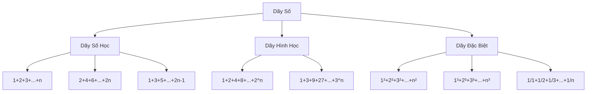
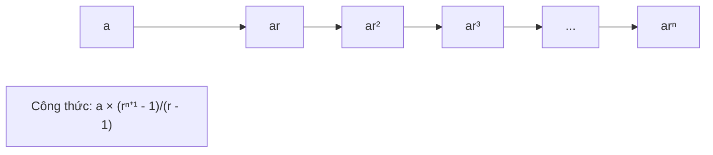

Việc tính tổng các dãy số là một trong những bài toán cơ bản nhất trong lập trình. Từ việc tính tổng các số từ 1 đến n, đến những dãy số phức tạp hơn như lũy thừa hay số Fibonacci. Trong bài viết này, chúng ta sẽ khám phá các cách tiếp cận khác nhau để giải quyết những bài toán này một cách hiệu quả.

Bạn sẽ học được cách sử dụng vòng lặp cơ bản, áp dụng công thức toán học để tối ưu hóa, và hiểu được khi nào nên dùng phương pháp nào. Đây là nền tảng quan trọng cho việc giải quyết các bài toán phức tạp hơn sau này.

<!-- truncate -->

## Hiểu Về Bài Toán Tính Tổng Dãy Số

### Vấn Đề Cần Giải Quyết

Trong cuộc sống và lập trình, chúng ta thường gặp các tình huống cần tính tổng một dãy số theo quy luật nhất định:

- **Tính điểm trung bình**: Cần tổng tất cả điểm số rồi chia cho số lượng
- **Tính tổng tiền hàng**: Tổng giá trị các sản phẩm trong giỏ hàng
- **Phân tích dữ liệu**: Tổng doanh thu theo tháng, quý, năm
- **Toán học**: Tính tổng các chuỗi số học, hình học

### Phân Loại Các Dãy Số Phổ Biến



## Cách Tiếp Cận Bài Toán

### 1. Phương Pháp Vòng Lặp (Brute Force)

Đây là cách tiếp cận trực quan nhất - sử dụng vòng lặp để cộng dồn từng phần tử:

**Ưu điểm:**
- Dễ hiểu, dễ cài đặt
- Áp dụng được cho mọi loại dãy số
- Không cần nhớ công thức phức tạp

**Nhược điểm:**
- Độ phức tạp thời gian O(n)
- Có thể chậm với n lớn

### 2. Phương Pháp Công Thức Toán Học

Sử dụng các công thức đã được chứng minh để tính trực tiếp:

**Ưu điểm:**
- Độ phức tạp thời gian O(1)
- Rất nhanh với n lớn
- Elegant và tối ưu

**Nhược điểm:**
- Cần nhớ công thức
- Không áp dụng được cho tất cả dãy số

## Các Dãy Số Cơ Bản và Cách Giải

### 1. Tổng Các Số Tự Nhiên (1 + 2 + 3 + ... + n)

:::info Công Thức Toán Học
$$\sum_{i=1}^{n} i = \frac{n(n+1)}{2}$$
:::

**Cách suy luận công thức:**
Nếu ta viết tổng xuôi và ngược:
```
S = 1 + 2 + 3 + ... + n
S = n + (n-1) + (n-2) + ... + 1
```
Cộng hai dòng: `2S = (n+1) + (n+1) + ... + (n+1) = n(n+1)`
Vậy `S = n(n+1)/2`

**Cài đặt bằng C++:**
```cpp
#include <iostream>
using namespace std;

// Phương pháp vòng lặp
long long sumNaturalLoop(int n) {
    long long sum = 0;
    for (int i = 1; i <= n; i++) {
        sum += i;
    }
    return sum;
}

// Phương pháp công thức
long long sumNaturalFormula(int n) {
    return (long long)n * (n + 1) / 2;
}

int main() {
    int n;
    cout << "Nhap n: ";
    cin >> n;
    
    cout << "Tong 1+2+...+" << n << " = " << sumNaturalFormula(n) << endl;
    
    return 0;
}
```

**Cài đặt bằng Python:**
```python
def sum_natural_loop(n):
    """Tính tổng bằng vòng lặp"""
    total = 0
    for i in range(1, n + 1):
        total += i
    return total

def sum_natural_formula(n):
    """Tính tổng bằng công thức"""
    return n * (n + 1) // 2

def main():
    n = int(input("Nhập n: "))
    result = sum_natural_formula(n)
    print(f"Tổng 1+2+...+{n} = {result}")

if __name__ == "__main__":
    main()
```

**Cài đặt bằng Java:**
```java
import java.util.Scanner;

public class SumNaturalNumbers {
    
    // Phương pháp vòng lặp
    public static long sumNaturalLoop(int n) {
        long sum = 0;
        for (int i = 1; i <= n; i++) {
            sum += i;
        }
        return sum;
    }
    
    // Phương pháp công thức
    public static long sumNaturalFormula(int n) {
        return (long) n * (n + 1) / 2;
    }
    
    public static void main(String[] args) {
        Scanner scanner = new Scanner(System.in);
        System.out.print("Nhập n: ");
        int n = scanner.nextInt();
        
        long result = sumNaturalFormula(n);
        System.out.println("Tổng 1+2+...+" + n + " = " + result);
        
        scanner.close();
    }
}
```

### 2. Tổng Các Số Chẵn (2 + 4 + 6 + ... + 2n)

:::info Công Thức Toán Học
$$\sum_{i=1}^{n} 2i = 2 \sum_{i=1}^{n} i = n(n+1)$$
:::

**Cài đặt bằng C++:**
```cpp
#include <iostream>
using namespace std;

long long sumEvenNumbers(int n) {
    // Công thức: n(n+1)
    return (long long)n * (n + 1);
}

// Hoặc bằng vòng lặp
long long sumEvenLoop(int n) {
    long long sum = 0;
    for (int i = 1; i <= n; i++) {
        sum += 2 * i;
    }
    return sum;
}

int main() {
    int n;
    cout << "Nhap n (so luong so chan): ";
    cin >> n;
    
    cout << "Tong " << n << " so chan dau tien: " << sumEvenNumbers(n) << endl;
    
    return 0;
}
```

### 3. Tổng Các Số Lẻ (1 + 3 + 5 + ... + (2n-1))

:::tip Điều Thú Vị
Tổng n số lẻ đầu tiên luôn bằng n²!
:::

:::info Công Thức Toán Học
$$\sum_{i=1}^{n} (2i-1) = n^2$$
:::

**Cài đặt bằng Python:**
```python
def sum_odd_numbers(n):
    """Tính tổng n số lẻ đầu tiên"""
    return n * n

def sum_odd_loop(n):
    """Tính bằng vòng lặp để minh họa"""
    total = 0
    for i in range(1, n + 1):
        odd_number = 2 * i - 1
        total += odd_number
    return total

def main():
    n = int(input("Nhập số lượng số lẻ: "))
    
    result_formula = sum_odd_numbers(n)
    result_loop = sum_odd_loop(n)
    
    print(f"Tổng {n} số lẻ đầu tiên:")
    print(f"Bằng công thức: {result_formula}")
    print(f"Bằng vòng lặp: {result_loop}")
    
    # In chi tiết các số lẻ
    odd_numbers = [2*i - 1 for i in range(1, n + 1)]
    print(f"Các số lẻ: {' + '.join(map(str, odd_numbers))} = {result_formula}")

if __name__ == "__main__":
    main()
```

### 4. Tổng Bình Phương (1² + 2² + 3² + ... + n²)

:::info Công Thức Toán Học
$$\sum_{i=1}^{n} i^2 = \frac{n(n+1)(2n+1)}{6}$$
:::

**Cài đặt bằng Java:**
```java
import java.util.Scanner;

public class SumSquares {
    
    public static long sumSquares(int n) {
        return (long) n * (n + 1) * (2 * n + 1) / 6;
    }
    
    public static long sumSquaresLoop(int n) {
        long sum = 0;
        for (int i = 1; i <= n; i++) {
            sum += (long) i * i;
        }
        return sum;
    }
    
    public static void main(String[] args) {
        Scanner scanner = new Scanner(System.in);
        System.out.print("Nhập n: ");
        int n = scanner.nextInt();
        
        long result = sumSquares(n);
        System.out.println("Tổng 1² + 2² + ... + " + n + "² = " + result);
        
        // Verify bằng vòng lặp
        long verification = sumSquaresLoop(n);
        System.out.println("Kiểm tra bằng vòng lặp: " + verification);
        System.out.println("Kết quả khớp: " + (result == verification));
        
        scanner.close();
    }
}
```

### 5. Tổng Lập Phương (1³ + 2³ + 3³ + ... + n³)

:::info Công Thức Đặc Biệt
$$\sum_{i=1}^{n} i^3 = \left(\frac{n(n+1)}{2}\right)^2$$

Thú vị là tổng lập phương bằng bình phương của tổng số tự nhiên!
:::

**Cài đặt bằng C++:**
```cpp
#include <iostream>
using namespace std;

long long sumCubes(int n) {
    long long sum_natural = (long long)n * (n + 1) / 2;
    return sum_natural * sum_natural;
}

long long sumCubesLoop(int n) {
    long long sum = 0;
    for (int i = 1; i <= n; i++) {
        sum += (long long)i * i * i;
    }
    return sum;
}

int main() {
    int n;
    cout << "Nhap n: ";
    cin >> n;
    
    long long result = sumCubes(n);
    cout << "Tong 1³ + 2³ + ... + " << n << "³ = " << result << endl;
    
    // Minh họa công thức
    long long sum_natural = (long long)n * (n + 1) / 2;
    cout << "= (" << sum_natural << ")² = " << result << endl;
    
    return 0;
}
```

## Dãy Số Phức Tạp Hơn

### 1. Tổng Cấp Số Nhân (1 + r + r² + ... + rⁿ)



**Cài đặt bằng Python:**
```python
def geometric_series_sum(a, r, n):
    """
    Tính tổng cấp số nhân: a + ar + ar² + ... + arⁿ
    a: số hạng đầu
    r: công bội
    n: số lượng số hạng
    """
    if r == 1:
        return a * (n + 1)
    else:
        return a * (r**(n + 1) - 1) // (r - 1)

def geometric_series_loop(a, r, n):
    """Tính bằng vòng lặp"""
    total = 0
    power = 1
    for i in range(n + 1):
        total += a * power
        power *= r
    return total

def main():
    print("Tính tổng cấp số nhân: a + ar + ar² + ... + arⁿ")
    a = int(input("Nhập số hạng đầu a: "))
    r = int(input("Nhập công bội r: "))
    n = int(input("Nhập số mũ lớn nhất n: "))
    
    result = geometric_series_sum(a, r, n)
    print(f"Tổng = {result}")
    
    # In chi tiết
    terms = [f"{a}×{r}^{i}" if i > 0 else str(a) for i in range(n + 1)]
    print(f"= {' + '.join(terms)}")

if __name__ == "__main__":
    main()
```

### 2. Tổng Phân Số (1/1 + 1/2 + 1/3 + ... + 1/n)

Đây là dãy điều hòa, không có công thức đóng đơn giản:

**Cài đặt bằng Java:**
```java
import java.util.Scanner;

public class HarmonicSeries {
    
    public static double harmonicSum(int n) {
        double sum = 0.0;
        for (int i = 1; i <= n; i++) {
            sum += 1.0 / i;
        }
        return sum;
    }
    
    // Xấp xỉ bằng công thức Euler-Mascheroni
    public static double harmonicApprox(int n) {
        double gamma = 0.5772156649; // Euler-Mascheroni constant
        return Math.log(n) + gamma + 1.0 / (2 * n);
    }
    
    public static void main(String[] args) {
        Scanner scanner = new Scanner(System.in);
        System.out.print("Nhập n: ");
        int n = scanner.nextInt();
        
        double exact = harmonicSum(n);
        double approx = harmonicApprox(n);
        
        System.out.printf("Tổng chính xác: %.6f%n", exact);
        System.out.printf("Xấp xỉ: %.6f%n", approx);
        System.out.printf("Sai số: %.6f%n", Math.abs(exact - approx));
        
        scanner.close();
    }
}
```

## So Sánh Hiệu Suất

### Đo Thời Gian Thực Thi

**Cài đặt bằng C++:**
```cpp
#include <iostream>
#include <chrono>
using namespace std;
using namespace std::chrono;

int main() {
    int n = 1000000;
    
    // Đo thời gian vòng lặp
    auto start = high_resolution_clock::now();
    long long sum_loop = 0;
    for (int i = 1; i <= n; i++) {
        sum_loop += i;
    }
    auto end = high_resolution_clock::now();
    auto duration_loop = duration_cast<microseconds>(end - start);
    
    // Đo thời gian công thức
    start = high_resolution_clock::now();
    long long sum_formula = (long long)n * (n + 1) / 2;
    end = high_resolution_clock::now();
    auto duration_formula = duration_cast<microseconds>(end - start);
    
    cout << "Với n = " << n << ":" << endl;
    cout << "Vòng lặp: " << duration_loop.count() << " microseconds" << endl;
    cout << "Công thức: " << duration_formula.count() << " microseconds" << endl;
    cout << "Tỷ lệ: " << (double)duration_loop.count() / duration_formula.count() << "x" << endl;
    
    return 0;
}
```

### Bảng So Sánh Độ Phức Tạp

| Phương pháp | Thời gian | Không gian | Ưu điểm | Nhược điểm |
|-------------|-----------|------------|---------|------------|
| Vòng lặp | O(n) | O(1) | Đơn giản, tổng quát | Chậm với n lớn |
| Công thức | O(1) | O(1) | Rất nhanh | Cần nhớ công thức |

## Ứng Dụng Thực Tế

### 1. Tính Tiền Lãi Đơn Giản

```python
def simple_interest_sum(principal, rate, years):
    """
    Tính tổng tiền sau n năm với lãi đơn giản
    Công thức: P + P×r×1 + P×r×2 + ... + P×r×n
    = P(1 + r(1+2+...+n)) = P(1 + r×n(n+1)/2)
    """
    sum_years = years * (years + 1) // 2
    return principal * (1 + rate * sum_years)

# Ví dụ: 100 triệu, lãi 5%/năm, số năm tích lũy
principal = 100_000_000  # 100 triệu
rate = 0.05  # 5%
years = 10

total = simple_interest_sum(principal, rate, years)
print(f"Sau {years} năm: {total:,.0f} VND")
```

### 2. Tối Ưu Hóa Thuật Toán

:::caution Lưu Ý
Khi n rất lớn (> 10⁶), luôn ưu tiên dùng công thức toán học thay vì vòng lặp để tránh timeout.
:::

### 3. Xử Lý Dữ Liệu Lớn

```python
def batch_sum_calculator(data_ranges):
    """
    Tính tổng cho nhiều khoảng dữ liệu
    data_ranges: list of (start, end) tuples
    """
    results = []
    for start, end in data_ranges:
        n = end - start + 1
        first_term = start
        # Tổng cấp số cộng: n/2 × (2a + (n-1)d) với d=1
        total = n * (2 * first_term + n - 1) // 2
        results.append(total)
    return results

# Ví dụ sử dụng
ranges = [(1, 100), (101, 200), (201, 300)]
results = batch_sum_calculator(ranges)
for i, (start, end) in enumerate(ranges):
    print(f"Tổng từ {start} đến {end}: {results[i]}")
```

## Bài Tập Thực Hành

### Bài Tập 1: Tổng Số Chính Phương
Tính tổng tất cả các số chính phương từ 1 đến n.

### Bài Tập 2: Tổng Các Số Fibonacci
Tính tổng n số Fibonacci đầu tiên.

### Bài Tập 3: Tổng Giai Thừa
Tính tổng 1! + 2! + 3! + ... + n!

### Bài Tập 4: Tổng Theo Điều Kiện
Tính tổng các số từ a đến b, chỉ lấy những số chia hết cho k.

## Tổng Kết

Việc tính tổng dãy số là một kỹ năng cơ bản nhưng quan trọng trong lập trình. Qua bài viết này, bạn đã học được:

1. **Hai phương pháp chính**: Vòng lặp và công thức toán học
2. **Các dãy số phổ biến**: Tự nhiên, chẵn/lẻ, bình phương, lập phương
3. **Cách tối ưu hóa**: Khi nào dùng phương pháp nào
4. **Ứng dụng thực tế**: Từ tính toán tài chính đến xử lý dữ liệu

:::tip Lời Khuyên
- Với n nhỏ (< 1000): Dùng vòng lặp cho dễ hiểu
- Với n lớn (> 10⁶): Bắt buộc dùng công thức toán học
- Luôn kiểm tra overflow với số lớn
- Học thuộc các công thức cơ bản để áp dụng nhanh
:::

Hãy thực hành với các bài tập để củng cố kiến thức. Kỹ năng này sẽ là nền tảng vững chắc cho việc giải quyết các bài toán phức tạp hơn trong tương lai!