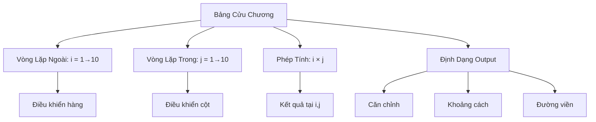
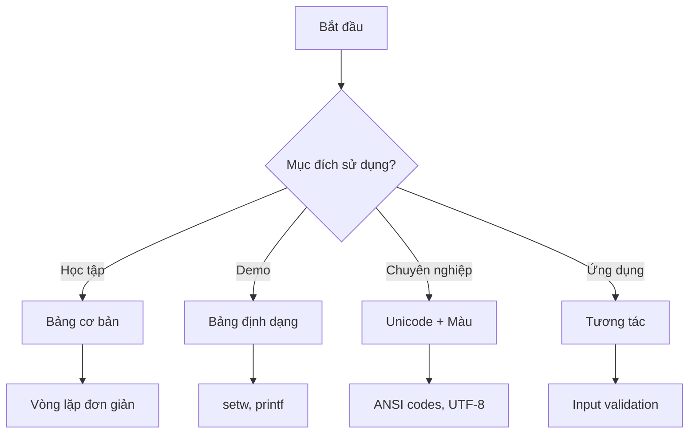

Bảng cửu chương không chỉ là công cụ học toán quan trọng mà còn là một bài tập lập trình cổ điển giúp bạn thành thạo vòng lặp lồng nhau và kỹ thuật định dạng output. Trong bài viết này, chúng ta sẽ tìm hiểu cách tạo ra những bảng cửu chương đẹp mắt với nhiều kiểu hiển thị khác nhau.

Từ bảng đơn giản nhất đến những thiết kế phức tạp với màu sắc và ký tự đặc biệt, bạn sẽ học được cách làm cho chương trình của mình không chỉ chạy đúng mà còn trông chuyên nghiệp và dễ đọc.

<!-- truncate -->

## Hiểu Về Bảng Cửu Chương

### Tại Sao Bảng Cửu Chương Quan Trọng?

Bảng cửu chương là nền tảng của phép nhân, giúp chúng ta:

- **Học toán cơ bản**: Ghi nhớ các phép nhân từ 1×1 đến 10×10
- **Lập trình**: Thực hành vòng lặp lồng nhau (nested loops)
- **Định dạng**: Học cách căn chỉnh và hiển thị dữ liệu đẹp mắt
- **Logic tư duy**: Hiểu mối quan hệ giữa hàng và cột trong ma trận

### Cấu Trúc Bảng Cửu Chương



## Các Cách Tiếp Cận

### 1. Bảng Cửu Chương Cơ Bản

Cách đơn giản nhất là sử dụng hai vòng lặp lồng nhau:

**Cài đặt bằng C++:**
```cpp
#include <iostream>
#include <iomanip>
using namespace std;

void basicMultiplicationTable() {
    cout << "BANG CUU CHUONG CO BAN" << endl;
    cout << "=======================" << endl;
    
    for (int i = 1; i <= 10; i++) {
        for (int j = 1; j <= 10; j++) {
            cout << setw(4) << i * j;
        }
        cout << endl;
    }
}

int main() {
    basicMultiplicationTable();
    return 0;
}
```

### 2. Bảng Với Header và Định Dạng

Thêm header để dễ đọc hơn:

**Cài đặt bằng Python:**
```python
def formatted_multiplication_table():
    """Tạo bảng cửu chương với header và định dạng đẹp"""
    print("BẢNG CỬU CHƯƠNG")
    print("=" * 50)
    
    # In header
    print("   ", end="")
    for j in range(1, 11):
        print(f"{j:4}", end="")
    print()
    
    # In đường kẻ ngang
    print("   " + "-" * 40)
    
    # In nội dung bảng
    for i in range(1, 11):
        print(f"{i:2}|", end="")
        for j in range(1, 11):
            result = i * j
            print(f"{result:4}", end="")
        print()

def main():
    formatted_multiplication_table()

if __name__ == "__main__":
    main()
```

### 3. Bảng Với Đường Viền Đẹp

**Cài đặt bằng Java:**
```java
public class BeautifulMultiplicationTable {
    
    public static void printBorder(int width) {
        System.out.print("+");
        for (int i = 0; i < width - 2; i++) {
            System.out.print("-");
        }
        System.out.println("+");
    }
    
    public static void beautifulTable() {
        int tableWidth = 45;
        
        // Header
        printBorder(tableWidth);
        System.out.println("|           BẢNG CỬU CHƯƠNG              |");
        printBorder(tableWidth);
        
        // Column headers
        System.out.print("|   ");
        for (int j = 1; j <= 10; j++) {
            System.out.printf("%3d", j);
        }
        System.out.println("   |");
        printBorder(tableWidth);
        
        // Table content
        for (int i = 1; i <= 10; i++) {
            System.out.printf("|%2d ", i);
            for (int j = 1; j <= 10; j++) {
                System.out.printf("%3d", i * j);
            }
            System.out.println("   |");
        }
        
        printBorder(tableWidth);
    }
    
    public static void main(String[] args) {
        beautifulTable();
    }
}
```

## Các Kiểu Hiển Thị Nâng Cao

### 1. Bảng Tam Giác (Chỉ Hiển Thị Nửa)

Tiết kiệm không gian và tránh lặp lại:

**Cài đặt bằng C++:**
```cpp
#include <iostream>
#include <iomanip>
using namespace std;

void triangularTable() {
    cout << "BANG CUU CHUONG TAM GIAC" << endl;
    cout << "========================" << endl;
    
    // Header
    cout << "   ";
    for (int j = 1; j <= 10; j++) {
        cout << setw(4) << j;
    }
    cout << endl;
    
    cout << "   " << string(40, '-') << endl;
    
    // Chỉ in nửa trên của bảng
    for (int i = 1; i <= 10; i++) {
        cout << setw(2) << i << "|";
        
        // In khoảng trắng cho phần dưới tam giác
        for (int k = 1; k < i; k++) {
            cout << "    ";
        }
        
        // In các giá trị từ i đến 10
        for (int j = i; j <= 10; j++) {
            cout << setw(4) << i * j;
        }
        cout << endl;
    }
}

int main() {
    triangularTable();
    return 0;
}
```

### 2. Bảng Có Màu Sắc (Terminal Colors)

**Cài đặt bằng Python:**
```python
class Colors:
    """ANSI color codes for terminal output"""
    RED = '\033[91m'
    GREEN = '\033[92m'
    YELLOW = '\033[93m'
    BLUE = '\033[94m'
    PURPLE = '\033[95m'
    CYAN = '\033[96m'
    WHITE = '\033[97m'
    BOLD = '\033[1m'
    UNDERLINE = '\033[4m'
    END = '\033[0m'

def colorful_multiplication_table():
    """Tạo bảng cửu chương có màu sắc"""
    print(f"{Colors.BOLD}{Colors.CYAN}BẢNG CỬU CHƯƠNG CÓ MÀU{Colors.END}")
    print("=" * 50)
    
    # Header with colors
    print("   ", end="")
    for j in range(1, 11):
        print(f"{Colors.YELLOW}{j:4}{Colors.END}", end="")
    print()
    
    print("   " + "-" * 40)
    
    for i in range(1, 11):
        # Row header with color
        print(f"{Colors.GREEN}{i:2}{Colors.END}|", end="")
        
        for j in range(1, 11):
            result = i * j
            
            # Color coding based on value
            if result % 10 == 0:  # Multiples of 10 in red
                color = Colors.RED
            elif result % 5 == 0:  # Multiples of 5 in blue
                color = Colors.BLUE
            elif result % 2 == 0:  # Even numbers in purple
                color = Colors.PURPLE
            else:  # Odd numbers in default
                color = Colors.WHITE
            
            print(f"{color}{result:4}{Colors.END}", end="")
        print()

def main():
    colorful_multiplication_table()

if __name__ == "__main__":
    main()
```

### 3. Bảng Tương Tác (Interactive)

Cho phép người dùng chọn phạm vi:

**Cài đặt bằng Java:**
```java
import java.util.Scanner;

public class InteractiveMultiplicationTable {
    
    public static void printCustomTable(int startRow, int endRow, 
                                      int startCol, int endCol) {
        // Calculate column width for proper formatting
        int maxValue = endRow * endCol;
        int colWidth = String.valueOf(maxValue).length() + 1;
        
        System.out.println("BẢNG CỬU CHƯƠNG TÙY CHỈNH");
        System.out.println("=".repeat(30));
        
        // Header
        System.out.printf("%" + colWidth + "s", "");
        for (int j = startCol; j <= endCol; j++) {
            System.out.printf("%" + colWidth + "d", j);
        }
        System.out.println();
        
        // Separator
        System.out.print(" ".repeat(colWidth));
        System.out.println("-".repeat((endCol - startCol + 1) * colWidth));
        
        // Table content
        for (int i = startRow; i <= endRow; i++) {
            System.out.printf("%" + (colWidth-1) + "d|", i);
            for (int j = startCol; j <= endCol; j++) {
                System.out.printf("%" + colWidth + "d", i * j);
            }
            System.out.println();
        }
    }
    
    public static void main(String[] args) {
        Scanner scanner = new Scanner(System.in);
        
        System.out.println("=== BẢNG CỬU CHƯƠNG TƯƠNG TÁC ===");
        
        System.out.print("Nhập hàng bắt đầu: ");
        int startRow = scanner.nextInt();
        
        System.out.print("Nhập hàng kết thúc: ");
        int endRow = scanner.nextInt();
        
        System.out.print("Nhập cột bắt đầu: ");
        int startCol = scanner.nextInt();
        
        System.out.print("Nhập cột kết thúc: ");
        int endCol = scanner.nextInt();
        
        System.out.println();
        printCustomTable(startRow, endRow, startCol, endCol);
        
        scanner.close();
    }
}
```

## Kỹ Thuật Định Dạng Nâng Cao

### 1. Căn Chỉnh Động Theo Độ Rộng

**Cài đặt bằng Python:**
```python
def dynamic_width_table(max_num=10):
    """Tự động tính toán độ rộng cột dựa trên giá trị lớn nhất"""
    max_value = max_num * max_num
    col_width = len(str(max_value)) + 1
    
    print("BẢNG CỬU CHƯƠNG CĂNG CHỈNH ĐỘNG")
    print("=" * 40)
    
    # Header
    print(" " * col_width, end="")
    for j in range(1, max_num + 1):
        print(f"{j:>{col_width}}", end="")
    print()
    
    # Separator
    print(" " * col_width + "-" * (max_num * col_width))
    
    # Content
    for i in range(1, max_num + 1):
        print(f"{i:>{col_width-1}}|", end="")
        for j in range(1, max_num + 1):
            result = i * j
            print(f"{result:>{col_width}}", end="")
        print()

def main():
    # Test với các kích thước khác nhau
    for size in [5, 10, 12]:
        print(f"\nBảng {size}x{size}:")
        dynamic_width_table(size)
        print()

if __name__ == "__main__":
    main()
```

### 2. Bảng Với Ký Tự Unicode Đẹp

**Cài đặt bằng C++ (với UTF-8 support):**
```cpp
#include <iostream>
#include <iomanip>
#include <string>
using namespace std;

void unicodeTable() {
    // Unicode box drawing characters
    string topLeft = "┌";
    string topRight = "┐";
    string bottomLeft = "└";
    string bottomRight = "┘";
    string horizontal = "─";
    string vertical = "│";
    string cross = "┼";
    string tDown = "┬";
    string tUp = "┴";
    string tRight = "├";
    string tLeft = "┤";
    
    cout << "BẢNG CỬU CHƯƠNG UNICODE" << endl;
    
    int colWidth = 4;
    int numCols = 10;
    int totalWidth = (numCols + 1) * colWidth + numCols + 1;
    
    // Top border
    cout << topLeft;
    for (int i = 0; i < colWidth; i++) cout << horizontal;
    for (int col = 0; col < numCols; col++) {
        cout << tDown;
        for (int i = 0; i < colWidth; i++) cout << horizontal;
    }
    cout << topRight << endl;
    
    // Header row
    cout << vertical << "   " << " ";
    for (int j = 1; j <= 10; j++) {
        cout << vertical << setw(colWidth) << j;
    }
    cout << vertical << endl;
    
    // Middle border
    cout << tRight;
    for (int i = 0; i < colWidth; i++) cout << horizontal;
    for (int col = 0; col < numCols; col++) {
        cout << cross;
        for (int i = 0; i < colWidth; i++) cout << horizontal;
    }
    cout << tLeft << endl;
    
    // Data rows
    for (int i = 1; i <= 10; i++) {
        cout << vertical << setw(colWidth) << i;
        for (int j = 1; j <= 10; j++) {
            cout << vertical << setw(colWidth) << i * j;
        }
        cout << vertical << endl;
    }
    
    // Bottom border
    cout << bottomLeft;
    for (int i = 0; i < colWidth; i++) cout << horizontal;
    for (int col = 0; col < numCols; col++) {
        cout << tUp;
        for (int i = 0; i < colWidth; i++) cout << horizontal;
    }
    cout << bottomRight << endl;
}

int main() {
    unicodeTable();
    return 0;
}
```

## Ứng Dụng Thực Tế

### 1. Bảng Giá Cước Vận Chuyển

```python
def shipping_cost_table():
    """Tạo bảng giá cước vận chuyển theo trọng lượng và khoảng cách"""
    weights = [1, 2, 3, 4, 5]  # kg
    distances = [10, 20, 50, 100, 200]  # km
    base_rate = 1000  # VND per kg per 10km
    
    print("BẢNG GIÁ CƯỚC VẬN CHUYỂN (VND)")
    print("=" * 50)
    
    # Header
    print("Trọng lượng\\Khoảng cách", end="")
    for distance in distances:
        print(f"{distance:>8}km", end="")
    print()
    
    print("-" * 50)
    
    # Content
    for weight in weights:
        print(f"{weight:>15}kg", end="")
        for distance in distances:
            cost = weight * (distance // 10) * base_rate
            print(f"{cost:>10,}", end="")
        print()

def main():
    shipping_cost_table()

if __name__ == "__main__":
    main()
```

### 2. Bảng Chuyển Đổi Đơn Vị

**Cài đặt bằng Java:**
```java
public class ConversionTable {
    
    public static void temperatureConversionTable() {
        System.out.println("BẢNG CHUYỂN ĐỔI NHIỆT ĐỘ");
        System.out.println("=".repeat(40));
        System.out.printf("%10s %10s %10s %10s%n", 
                         "Celsius", "Fahrenheit", "Kelvin", "Rankine");
        System.out.println("-".repeat(40));
        
        for (int celsius = 0; celsius <= 100; celsius += 10) {
            double fahrenheit = celsius * 9.0 / 5.0 + 32;
            double kelvin = celsius + 273.15;
            double rankine = fahrenheit + 459.67;
            
            System.out.printf("%10d %10.1f %10.1f %10.1f%n",
                             celsius, fahrenheit, kelvin, rankine);
        }
    }
    
    public static void main(String[] args) {
        temperatureConversionTable();
    }
}
```

## So Sánh Các Phương Pháp

### Bảng So Sánh

| Phương pháp | Độ phức tạp | Tính đẹp | Tương tác | Phù hợp cho |
|-------------|-------------|----------|-----------|-------------|
| Cơ bản | Thấp | Thấp | Không | Học tập |
| Định dạng | Trung bình | Trung bình | Không | Demo |
| Unicode | Cao | Cao | Không | Chuyên nghiệp |
| Tương tác | Cao | Trung bình | Cao | Ứng dụng |
| Màu sắc | Trung bình | Cao | Không | Terminal |

### Lựa Chọn Phương Pháp



## Tối Ưu Hóa và Hiệu Suất

### 1. Tránh Tính Toán Lặp Lại

```cpp
#include <iostream>
#include <vector>
#include <iomanip>
using namespace std;

void optimizedTable(int size) {
    // Pre-calculate results to avoid repeated multiplication
    vector<vector<int>> table(size + 1, vector<int>(size + 1));
    
    for (int i = 1; i <= size; i++) {
        for (int j = 1; j <= size; j++) {
            table[i][j] = i * j;
        }
    }
    
    // Display pre-calculated results
    cout << "BẢNG ĐÃ TỐI ƯU" << endl;
    for (int i = 1; i <= size; i++) {
        for (int j = 1; j <= size; j++) {
            cout << setw(4) << table[i][j];
        }
        cout << endl;
    }
}
```

### 2. Memory-Friendly cho Bảng Lớn

```python
def memory_efficient_table(size):
    """Không lưu trữ toàn bộ bảng trong memory"""
    print("BẢNG TIẾT KIỆM MEMORY")
    print("=" * 30)
    
    def get_cell_value(i, j):
        """Tính giá trị theo yêu cầu"""
        return i * j
    
    # Header
    print("   ", end="")
    for j in range(1, size + 1):
        print(f"{j:4}", end="")
    print()
    
    # Content - tính theo từng hàng
    for i in range(1, size + 1):
        print(f"{i:2}|", end="")
        for j in range(1, size + 1):
            print(f"{get_cell_value(i, j):4}", end="")
        print()

def main():
    memory_efficient_table(20)  # Bảng 20x20 không tốn memory

if __name__ == "__main__":
    main()
```

## Bài Tập Thực Hành

### Bài Tập 1: Bảng Cửu Chương Dọc
Tạo bảng hiển thị theo cột thay vì theo hàng.

### Bài Tập 2: Bảng Với Điều Kiện
Chỉ hiển thị các ô có kết quả chẵn/lẻ theo yêu cầu.

### Bài Tập 3: Bảng 3D
Tạo nhiều bảng cửu chương với các hệ số khác nhau.

### Bài Tập 4: Export Ra File
Lưu bảng cửu chương vào file CSV hoặc HTML.

## Tổng Kết

Qua bài viết này, bạn đã học được:

1. **Vòng lặp lồng nhau**: Cách sử dụng nested loops hiệu quả
2. **Kỹ thuật định dạng**: Căn chỉnh, màu sắc, ký tự đặc biệt
3. **Tương tác với người dùng**: Tạo chương trình linh hoạt
4. **Tối ưu hóa**: Cân bằng giữa đẹp mắt và hiệu suất
5. **Ứng dụng thực tế**: Từ bảng cửu chương đến bảng dữ liệu chuyên nghiệp

:::tip Lời Khuyên
- Bắt đầu với bảng đơn giản, sau đó nâng cấp dần
- Chú ý đến trải nghiệm người dùng khi thiết kế giao diện
- Kiểm tra output trên các terminal khác nhau
- Sử dụng màu sắc một cách tiết chế để không làm rối mắt
:::

Việc tạo bảng cửu chương đẹp mắt không chỉ giúp bạn thành thạo vòng lặp mà còn phát triển kỹ năng thiết kế giao diện và chú ý đến detail - những kỹ năng quan trọng của một lập trình viên chuyên nghiệp!