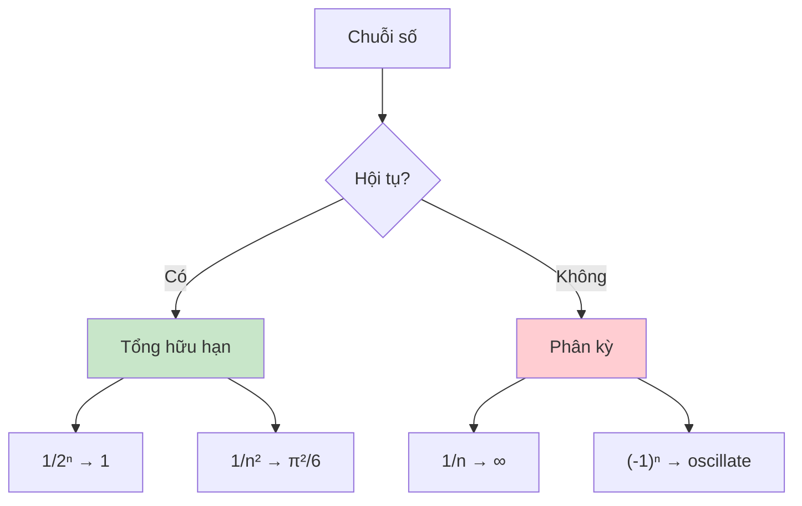
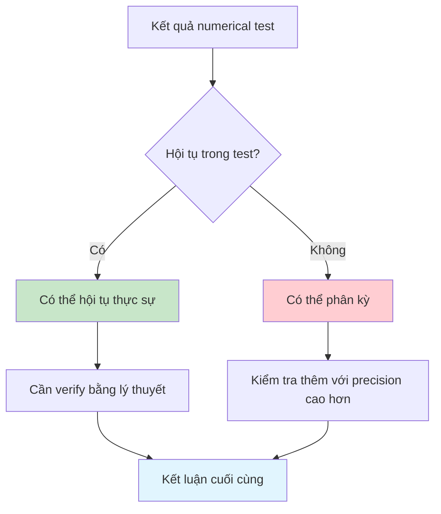

Trong toán học, việc hiểu một chuỗi vô hạn có "hội tụ" hay "phân kỳ" là rất quan trọng. Một chuỗi hội tụ nghĩa là tổng của nó tiến về một giá trị xác định, còn chuỗi phân kỳ thì không. Nhưng làm sao để biết điều này mà không phải tính đến vô cùng?

Bài viết này sẽ hướng dẫn bạn các phương pháp kiểm tra tính hội tụ của chuỗi số, từ những tiêu chuẩn toán học cổ điển đến cách cài đặt thuật toán thực tế để "cảm nhận" sự hội tụ.

<!-- truncate -->

## Hiểu Về Chuỗi Và Tính Hội Tụ

### Định Nghĩa Cơ Bản

**Chuỗi vô hạn** là tổng của vô số hạng tử:

$$S = \sum_{n=1}^{\infty} a_n = a_1 + a_2 + a_3 + \ldots$$

**Tính hội tụ**: Chuỗi hội tụ về giá trị $L$ nếu:

$$\lim_{n \to \infty} S_n = L$$

trong đó $S_n = \sum_{k=1}^{n} a_k$ là tổng riêng phần thứ $n$.

### Ví Dụ Minh Họa



:::tip Intuition về Hội Tụ
Hãy tưởng tượng bạn đang cộng dồn tiền xu vào một cái hũ:
- **Hội tụ**: Dù cộng mãi, số tiền không vượt quá một mức nào đó
- **Phân kỳ**: Số tiền cứ tăng không ngừng hoặc dao động liên tục
:::

## Các Tiêu Chuẩn Kiểm Tra Hội Tụ

### 1. Điều Kiện Cần Thiết

:::warning Điều Kiện Bắt Buộc
Nếu chuỗi $\sum a_n$ hội tụ thì $\lim_{n \to \infty} a_n = 0$

**Nghịch đảo**: Nếu $\lim_{n \to \infty} a_n \neq 0$ thì chuỗi phân kỳ.
:::

### 2. Tiêu Chuẩn Tỷ Số (Ratio Test)

Cho chuỗi $\sum a_n$ với $a_n > 0$:

$$L = \lim_{n \to \infty} \frac{a_{n+1}}{a_n}$$

- **$L < 1$**: Chuỗi hội tụ
- **$L > 1$**: Chuỗi phân kỳ  
- **$L = 1$**: Không kết luận được

### 3. Tiêu Chuẩn Căn (Root Test)

$$L = \lim_{n \to \infty} \sqrt[n]{|a_n|}$$

Kết luận tương tự như tiêu chuẩn tỷ số.

### 4. Tiêu Chuẩn So Sánh

Nếu $0 \leq a_n \leq b_n$ và $\sum b_n$ hội tụ thì $\sum a_n$ hội tụ.

### 5. Tiêu Chuẩn Tích Phân

Nếu $f(x)$ giảm và dương, thì $\sum f(n)$ và $\int_1^{\infty} f(x)dx$ cùng hội tụ hoặc cùng phân kỳ.

## Cài Đặt Thuật Toán Kiểm Tra

### Kiểm Tra Hội Tụ Thực Nghiệm - C++

```cpp
#include <iostream>
#include <iomanip>
#include <cmath>
#include <vector>
#include <functional>
using namespace std;

struct ConvergenceResult {
    bool converged;
    double estimatedSum;
    int iterations;
    double lastTerm;
    string method;
};

class ConvergenceTester {
private:
    double tolerance;
    int maxIterations;
    
public:
    ConvergenceTester(double tol = 1e-8, int maxIter = 1000000) 
        : tolerance(tol), maxIterations(maxIter) {}
    
    // Kiểm tra hội tụ bằng tổng riêng phần
    ConvergenceResult testByPartialSums(function<double(int)> termFunction) {
        double sum = 0.0;
        double prevSum = 0.0;
        
        cout << "Kiem tra hoi tu bang tong rieng phan:" << endl;
        cout << "n      | a_n        | S_n        | |S_n - S_{n-1}|" << endl;
        cout << "-------|------------|------------|---------------" << endl;
        
        for (int n = 1; n <= maxIterations; n++) {
            double term = termFunction(n);
            sum += term;
            
            double difference = abs(sum - prevSum);
            
            // In kết quả mỗi 10^k lần lặp
            if (n <= 10 || n % (int)pow(10, (int)log10(n)) == 0) {
                cout << setw(6) << n << " | ";
                cout << setw(10) << scientific << setprecision(3) << term << " | ";
                cout << setw(10) << fixed << setprecision(6) << sum << " | ";
                cout << setw(13) << scientific << setprecision(3) << difference << endl;
            }
            
            // Kiểm tra điều kiện hội tụ
            if (n > 100 && difference < tolerance) {
                return {true, sum, n, term, "Partial Sums"};
            }
            
            // Kiểm tra phân kỳ (tổng quá lớn)
            if (abs(sum) > 1e10) {
                return {false, sum, n, term, "Divergent (Large Sum)"};
            }
            
            prevSum = sum;
        }
        
        return {false, sum, maxIterations, termFunction(maxIterations), "Max Iterations Reached"};
    }
    
    // Kiểm tra điều kiện cần thiết
    bool checkNecessaryCondition(function<double(int)> termFunction, int testPoints = 10000) {
        cout << "\nKiem tra dieu kien can thiet (lim a_n = 0):" << endl;
        
        double lastTerms[5];
        for (int i = 0; i < 5; i++) {
            int n = testPoints + i * testPoints / 5;
            lastTerms[i] = termFunction(n);
            cout << "a_" << n << " = " << scientific << lastTerms[i] << endl;
        }
        
        // Kiểm tra xem các hạng tử có tiến về 0 không
        bool approaching_zero = true;
        for (int i = 0; i < 5; i++) {
            if (abs(lastTerms[i]) > 1e-6) {
                approaching_zero = false;
                break;
            }
        }
        
        cout << "Dieu kien can thiet: " << (approaching_zero ? "THOA MAN" : "KHONG THOA MAN") << endl;
        return approaching_zero;
    }
    
    // Tiêu chuẩn tỷ số
    ConvergenceResult ratioTest(function<double(int)> termFunction) {
        cout << "\nTieu chuan ty so (Ratio Test):" << endl;
        cout << "n      | a_n        | a_{n+1}/a_n | Ket luan" << endl;
        cout << "-------|------------|-------------|----------" << endl;
        
        vector<double> ratios;
        
        for (int n = 10; n <= 1000; n += 10) {
            double an = termFunction(n);
            double an1 = termFunction(n + 1);
            
            if (abs(an) > 1e-15) {  // Tránh chia cho 0
                double ratio = abs(an1 / an);
                ratios.push_back(ratio);
                
                if (n <= 100 || n % 100 == 0) {
                    cout << setw(6) << n << " | ";
                    cout << setw(10) << scientific << setprecision(3) << an << " | ";
                    cout << setw(11) << fixed << setprecision(6) << ratio << " | ";
                    
                    if (ratio < 0.9) cout << "Hoi tu";
                    else if (ratio > 1.1) cout << "Phan ky";
                    else cout << "Khong ro";
                    cout << endl;
                }
            }
        }
        
        // Tính trung bình của các tỷ số cuối
        double avgRatio = 0;
        int count = min(10, (int)ratios.size());
        for (int i = ratios.size() - count; i < ratios.size(); i++) {
            avgRatio += ratios[i];
        }
        avgRatio /= count;
        
        cout << "Ty so trung binh cuoi: " << avgRatio << endl;
        
        bool converged = avgRatio < 1.0;
        return {converged, 0, 0, 0, "Ratio Test"};
    }
};

// Định nghĩa một số chuỗi thông dụng
namespace SeriesExamples {
    double geometric(int n) { return pow(0.5, n); }           // 1/2^n - hội tụ
    double harmonic(int n) { return 1.0 / n; }                // 1/n - phân kỳ
    double pSeries2(int n) { return 1.0 / (n * n); }          // 1/n² - hội tụ
    double alternating(int n) { return pow(-1, n+1) / n; }     // (-1)^n/n - hội tụ
    double exponential(int n) { return 1.0 / tgamma(n + 1); } // 1/n! - hội tụ nhanh
    double factorial(int n) { return tgamma(n + 1); }          // n! - phân kỳ nhanh
}

int main() {
    ConvergenceTester tester(1e-10, 100000);
    
    cout << "=== KIEM TRA TINH HOI TU CUA CHUOI SO ===" << endl;
    
    // Test chuỗi hình học
    cout << "\n1. CHUOI HINH HOC: sum(1/2^n)" << endl;
    tester.checkNecessaryCondition(SeriesExamples::geometric);
    ConvergenceResult result1 = tester.testByPartialSums(SeriesExamples::geometric);
    cout << "Ket qua: " << (result1.converged ? "HOI TU" : "PHAN KY") 
         << " den " << result1.estimatedSum << endl;
    
    // Test chuỗi điều hòa
    cout << "\n2. CHUOI DIEU HOA: sum(1/n)" << endl;
    tester.checkNecessaryCondition(SeriesExamples::harmonic);
    ConvergenceResult result2 = tester.testByPartialSums(SeriesExamples::harmonic);
    cout << "Ket qua: " << (result2.converged ? "HOI TU" : "PHAN KY") << endl;
    
    // Test p-series với p=2
    cout << "\n3. P-SERIES: sum(1/n^2)" << endl;
    ConvergenceResult result3 = tester.testByPartialSums(SeriesExamples::pSeries2);
    cout << "Ket qua: " << (result3.converged ? "HOI TU" : "PHAN KY") 
         << " den " << result3.estimatedSum << " (pi^2/6 = " << M_PI*M_PI/6 << ")" << endl;
    
    return 0;
}
```

### Phân Tích Chuỗi Nâng Cao - Python

```python
import numpy as np
import matplotlib.pyplot as plt
from scipy import special
import math

class AdvancedSeriesAnalyzer:
    def __init__(self, tolerance=1e-10, max_iterations=100000):
        self.tolerance = tolerance
        self.max_iterations = max_iterations
        
    def analyze_series(self, term_function, series_name, known_sum=None):
        """
        Phân tích toàn diện một chuỗi số
        """
        print(f"\n=== PHÂN TÍCH CHUỖI: {series_name} ===")
        
        # 1. Kiểm tra điều kiện cần thiết
        necessary_result = self._check_necessary_condition(term_function)
        
        # 2. Tính tổng riêng phần
        partial_sums, terms, convergence_data = self._compute_partial_sums(term_function)
        
        # 3. Tiêu chuẩn tỷ số
        ratio_result = self._ratio_test(term_function)
        
        # 4. Phân tích tốc độ hội tụ
        convergence_rate = self._analyze_convergence_rate(partial_sums)
        
        # 5. Báo cáo kết quả
        self._generate_report(series_name, necessary_result, convergence_data, 
                            ratio_result, convergence_rate, known_sum)
        
        return {
            'converged': convergence_data['converged'],
            'estimated_sum': convergence_data['final_sum'],
            'iterations': convergence_data['iterations'],
            'convergence_rate': convergence_rate
        }
    
    def _check_necessary_condition(self, term_function):
        """Kiểm tra điều kiện cần thiết: lim a_n = 0"""
        print("1. ĐIỀU KIỆN CẦN THIẾT")
        
        test_points = [1000, 5000, 10000, 50000, 100000]
        terms = [term_function(n) for n in test_points]
        
        for i, (n, term) in enumerate(zip(test_points, terms)):
            print(f"   a_{n} = {term:.2e}")
        
        # Kiểm tra xu hướng giảm
        is_decreasing = all(abs(terms[i]) >= abs(terms[i+1]) for i in range(len(terms)-1))
        approaches_zero = abs(terms[-1]) < 1e-6
        
        result = is_decreasing and approaches_zero
        print(f"   Kết luận: {'✓ THỎA MÃN' if result else '✗ KHÔNG THỎA MÃN'}")
        
        return result
    
    def _compute_partial_sums(self, term_function):
        """Tính toán tổng riêng phần và kiểm tra hội tụ"""
        print("\n2. TỔNG RIÊNG PHẦN")
        
        partial_sums = []
        terms = []
        sum_value = 0.0
        
        print("   n      | a_n        | S_n        | |S_n - S_{n-1}|")
        print("   -------|------------|------------|---------------")
        
        converged = False
        final_iteration = 0
        
        for n in range(1, self.max_iterations + 1):
            term = term_function(n)
            sum_value += term
            
            terms.append(term)
            partial_sums.append(sum_value)
            
            # In kết quả theo logarithmic scale
            if n <= 10 or n in [50, 100, 500, 1000, 5000, 10000] or n % 10000 == 0:
                diff = abs(partial_sums[-1] - partial_sums[-2]) if len(partial_sums) > 1 else float('inf')
                print(f"   {n:6d} | {term:10.3e} | {sum_value:10.6f} | {diff:13.3e}")
            
            # Kiểm tra hội tụ
            if n > 100:
                recent_changes = [abs(partial_sums[i] - partial_sums[i-1]) 
                                for i in range(max(1, len(partial_sums)-10), len(partial_sums))]
                
                if max(recent_changes) < self.tolerance:
                    converged = True
                    final_iteration = n
                    break
            
            # Kiểm tra phân kỳ
            if abs(sum_value) > 1e10:
                print(f"   >>> PHÂN KỲ: Tổng quá lớn tại n = {n}")
                break
        
        return partial_sums, terms, {
            'converged': converged,
            'final_sum': sum_value,
            'iterations': final_iteration or len(partial_sums)
        }
    
    def _ratio_test(self, term_function):
        """Tiêu chuẩn tỷ số"""
        print("\n3. TIÊU CHUẨN TỶ SỐ")
        
        ratios = []
        print("   n      | a_n        | |a_{n+1}/a_n| | Nhận xét")
        print("   -------|------------|-------------|----------")
        
        for n in range(10, 1001, 10):
            an = term_function(n)
            an1 = term_function(n + 1)
            
            if abs(an) > 1e-15:
                ratio = abs(an1 / an)
                ratios.append(ratio)
                
                if n <= 100 or n % 100 == 0:
                    comment = ""
                    if ratio < 0.9:
                        comment = "Hội tụ"
                    elif ratio > 1.1:
                        comment = "Phân kỳ"
                    else:
                        comment = "Không rõ"
                    
                    print(f"   {n:6d} | {an:10.3e} | {ratio:11.6f} | {comment}")
        
        if ratios:
            avg_ratio = np.mean(ratios[-10:])  # Trung bình 10 tỷ số cuối
            print(f"   Tỷ số trung bình cuối: {avg_ratio:.6f}")
            
            if avg_ratio < 1:
                conclusion = "HỘI TỤ"
            elif avg_ratio > 1:
                conclusion = "PHÂN KỲ"
            else:
                conclusion = "KHÔNG KẾT LUẬN"
            
            print(f"   Kết luận: {conclusion}")
            return {'ratio': avg_ratio, 'conclusion': conclusion}
        
        return {'ratio': None, 'conclusion': 'KHÔNG THỂ TÍNH'}
    
    def _analyze_convergence_rate(self, partial_sums):
        """Phân tích tốc độ hội tụ"""
        if len(partial_sums) < 100:
            return "Không đủ dữ liệu"
        
        # Tính tốc độ hội tụ bằng cách xem sự thay đổi của các hiệu số
        differences = [abs(partial_sums[i] - partial_sums[i-1]) 
                      for i in range(1, len(partial_sums))]
        
        # Fit exponential decay: diff ~ e^(-α*n)
        n_points = np.arange(1, len(differences) + 1)
        
        # Lấy log để tuyến tính hóa
        log_diffs = []
        valid_n = []
        
        for i, diff in enumerate(differences):
            if diff > 1e-15:  # Tránh log(0)
                log_diffs.append(math.log(diff))
                valid_n.append(n_points[i])
        
        if len(log_diffs) > 10:
            # Linear regression
            coeffs = np.polyfit(valid_n[-100:], log_diffs[-100:], 1)
            decay_rate = -coeffs[0]
            
            if decay_rate > 0.1:
                return "Nhanh"
            elif decay_rate > 0.01:
                return "Trung bình"
            else:
                return "Chậm"
        
        return "Không xác định"
    
    def _generate_report(self, series_name, necessary_ok, convergence_data, 
                        ratio_result, convergence_rate, known_sum):
        """Tạo báo cáo tổng hợp"""
        print(f"\n4. BÁO CÁO TỔNG HỢP - {series_name}")
        print("=" * 50)
        
        print(f"Điều kiện cần thiết: {'✓' if necessary_ok else '✗'}")
        print(f"Hội tụ: {'✓' if convergence_data['converged'] else '✗'}")
        print(f"Số lần lặp: {convergence_data['iterations']:,}")
        print(f"Tổng ước tính: {convergence_data['final_sum']:.10f}")
        
        if known_sum is not None:
            error = abs(convergence_data['final_sum'] - known_sum)
            print(f"Giá trị thực: {known_sum:.10f}")
            print(f"Sai số: {error:.2e}")
            print(f"Độ chính xác: {-math.log10(error):.1f} chữ số")
        
        print(f"Tiêu chuẩn tỷ số: {ratio_result['conclusion']}")
        print(f"Tốc độ hội tụ: {convergence_rate}")

# Định nghĩa các chuỗi để test
def series_examples():
    return {
        'geometric_half': (lambda n: 0.5**n, "Chuỗi hình học 1/2^n", 1.0),
        'harmonic': (lambda n: 1/n, "Chuỗi điều hòa 1/n", None),
        'p_series_2': (lambda n: 1/(n**2), "P-series 1/n²", math.pi**2/6),
        'exponential': (lambda n: 1/math.factorial(n), "Chuỗi e: 1/n!", math.e - 1),
        'alternating_harmonic': (lambda n: (-1)**(n+1)/n, "Chuỗi điều hòa xen kẽ", math.log(2)),
        'basel_problem': (lambda n: 1/(n**2), "Basel problem", math.pi**2/6),
    }

# Ví dụ sử dụng
if __name__ == "__main__":
    analyzer = AdvancedSeriesAnalyzer(tolerance=1e-12, max_iterations=50000)
    
    examples = series_examples()
    
    print("🔍 PHÂN TÍCH CÁC CHUỖI SỐ KINH ĐIỂN")
    print("=" * 60)
    
    results = {}
    
    for key, (func, name, known_sum) in examples.items():
        if key in ['geometric_half', 'p_series_2', 'alternating_harmonic']:  # Chọn một vài chuỗi
            results[key] = analyzer.analyze_series(func, name, known_sum)
            print("\n" + "="*60)
    
    # Tóm tắt kết quả
    print("\n🎯 TÓM TẮT KẾT QUẢ")
    print("-" * 40)
    for key, result in results.items():
        status = "✓ Hội tụ" if result['converged'] else "✗ Phân kỳ"
        print(f"{examples[key][1]}: {status}")
```

### Visualization và Interactive Tool - Java

```java
import java.util.*;
import java.util.function.Function;

public class SeriesConvergenceAnalyzer {
    private double tolerance;
    private int maxIterations;
    
    public SeriesConvergenceAnalyzer(double tolerance, int maxIterations) {
        this.tolerance = tolerance;
        this.maxIterations = maxIterations;
    }
    
    /**
     * Phân tích tổng quát một chuỗi số
     */
    public ConvergenceAnalysis analyzeSeries(Function<Integer, Double> termFunction, 
                                           String seriesName) {
        System.out.println("\n=== PHÂN TÍCH CHUỖI: " + seriesName + " ===");
        
        // 1. Kiểm tra điều kiện cần thiết
        boolean necessaryCondition = checkNecessaryCondition(termFunction);
        
        // 2. Tính toán tổng riêng phần
        PartialSumResult partialSumResult = computePartialSums(termFunction);
        
        // 3. Tiêu chuẩn tỷ số
        RatioTestResult ratioResult = performRatioTest(termFunction);
        
        // 4. Phân tích pattern
        ConvergencePattern pattern = analyzePattern(partialSumResult.partialSums);
        
        return new ConvergenceAnalysis(necessaryCondition, partialSumResult, 
                                     ratioResult, pattern);
    }
    
    private boolean checkNecessaryCondition(Function<Integer, Double> termFunction) {
        System.out.println("1. KIỂM TRA ĐIỀU KIỆN CẦN THIẾT");
        
        int[] testPoints = {1000, 5000, 10000, 50000, 100000};
        double[] terms = new double[testPoints.length];
        
        for (int i = 0; i < testPoints.length; i++) {
            terms[i] = termFunction.apply(testPoints[i]);
            System.out.printf("   a_%d = %.2e%n", testPoints[i], terms[i]);
        }
        
        // Kiểm tra xu hướng về 0
        boolean approachesZero = Math.abs(terms[terms.length - 1]) < 1e-6;
        
        // Kiểm tra tính giảm dần
        boolean decreasing = true;
        for (int i = 1; i < terms.length; i++) {
            if (Math.abs(terms[i]) > Math.abs(terms[i-1])) {
                decreasing = false;
                break;
            }
        }
        
        boolean result = approachesZero && decreasing;
        System.out.println("   Kết luận: " + (result ? "✓ THỎA MÃN" : "✗ KHÔNG THỎA MÃN"));
        
        return result;
    }
    
    private PartialSumResult computePartialSums(Function<Integer, Double> termFunction) {
        System.out.println("\n2. TÍNH TOÁN TỔNG RIÊNG PHẦN");
        System.out.println("   n      | a_n        | S_n        | |S_n - S_{n-1}|");
        System.out.println("   -------|------------|------------|---------------");
        
        List<Double> partialSums = new ArrayList<>();
        double sum = 0.0;
        boolean converged = false;
        int convergenceIteration = 0;
        
        for (int n = 1; n <= maxIterations; n++) {
            double term = termFunction.apply(n);
            sum += term;
            partialSums.add(sum);
            
            // In kết quả
            if (n <= 10 || isPowerOf10(n) || n % 10000 == 0) {
                double diff = n > 1 ? Math.abs(sum - partialSums.get(n-2)) : Double.POSITIVE_INFINITY;
                System.out.printf("   %6d | %10.3e | %10.6f | %13.3e%n", 
                                n, term, sum, diff);
            }
            
            // Kiểm tra hội tụ
            if (n > 100 && checkConvergence(partialSums, n)) {
                converged = true;
                convergenceIteration = n;
                System.out.println("   >>> HỘI TỤ tại n = " + n);
                break;
            }
            
            // Kiểm tra phân kỳ
            if (Math.abs(sum) > 1e10) {
                System.out.println("   >>> PHÂN KỲ: Tổng quá lớn tại n = " + n);
                break;
            }
        }
        
        return new PartialSumResult(partialSums, converged, convergenceIteration, sum);
    }
    
    private boolean isPowerOf10(int n) {
        return n > 0 && Math.log10(n) % 1 == 0;
    }
    
    private boolean checkConvergence(List<Double> partialSums, int currentIndex) {
        if (currentIndex < 20) return false;
        
        // Kiểm tra 10 giá trị gần nhất
        double maxChange = 0;
        for (int i = Math.max(0, currentIndex - 10); i < currentIndex; i++) {
            double change = Math.abs(partialSums.get(i) - partialSums.get(i-1));
            maxChange = Math.max(maxChange, change);
        }
        
        return maxChange < tolerance;
    }
    
    private RatioTestResult performRatioTest(Function<Integer, Double> termFunction) {
        System.out.println("\n3. TIÊU CHUẨN TỶ SỐ");
        System.out.println("   n      | a_n        | |a_{n+1}/a_n| | Nhận xét");
        System.out.println("   -------|------------|-------------|----------");
        
        List<Double> ratios = new ArrayList<>();
        
        for (int n = 10; n <= 1000; n += 10) {
            double an = termFunction.apply(n);
            double an1 = termFunction.apply(n + 1);
            
            if (Math.abs(an) > 1e-15) {
                double ratio = Math.abs(an1 / an);
                ratios.add(ratio);
                
                if (n <= 100 || n % 100 == 0) {
                    String comment = "";
                    if (ratio < 0.9) comment = "Hội tụ";
                    else if (ratio > 1.1) comment = "Phân kỳ";
                    else comment = "Không rõ";
                    
                    System.out.printf("   %6d | %10.3e | %11.6f | %s%n", 
                                    n, an, ratio, comment);
                }
            }
        }
        
        if (!ratios.isEmpty()) {
            // Tính trung bình của 10 tỷ số cuối
            double avgRatio = ratios.subList(Math.max(0, ratios.size() - 10), ratios.size())
                                   .stream()
                                   .mapToDouble(Double::doubleValue)
                                   .average()
                                   .orElse(Double.NaN);
            
            System.out.printf("   Tỷ số trung bình cuối: %.6f%n", avgRatio);
            
            String conclusion;
            if (avgRatio < 1) conclusion = "HỘI TỤ";
            else if (avgRatio > 1) conclusion = "PHÂN KỲ";
            else conclusion = "KHÔNG KẾT LUẬN";
            
            System.out.println("   Kết luận: " + conclusion);
            
            return new RatioTestResult(avgRatio, conclusion);
        }
        
        return new RatioTestResult(Double.NaN, "KHÔNG THỂ TÍNH");
    }
    
    private ConvergencePattern analyzePattern(List<Double> partialSums) {
        if (partialSums.size() < 100) {
            return new ConvergencePattern("KHÔNG ĐỦ DỮ LIỆU", 0);
        }
        
        // Phân tích tốc độ hội tụ
        List<Double> differences = new ArrayList<>();
        for (int i = 1; i < partialSums.size(); i++) {
            differences.add(Math.abs(partialSums.get(i) - partialSums.get(i-1)));
        }
        
        // Tính tỷ lệ giảm trung bình
        double avgDecayRate = 0;
        int validPoints = 0;
        
        for (int i = differences.size() - 100; i < differences.size() - 1; i++) {
            if (i >= 0 && differences.get(i) > 1e-15 && differences.get(i+1) > 1e-15) {
                double ratio = differences.get(i+1) / differences.get(i);
                if (ratio < 1) {
                    avgDecayRate += -Math.log(ratio);
                    validPoints++;
                }
            }
        }
        
        if (validPoints > 0) {
            avgDecayRate /= validPoints;
        }
        
        String speed;
        if (avgDecayRate > 0.1) speed = "NHANH";
        else if (avgDecayRate > 0.01) speed = "TRUNG BÌNH";
        else speed = "CHẬM";
        
        return new ConvergencePattern(speed, avgDecayRate);
    }
    
    // Các lớp dữ liệu helper
    public static class ConvergenceAnalysis {
        public final boolean necessaryCondition;
        public final PartialSumResult partialSumResult;
        public final RatioTestResult ratioResult;
        public final ConvergencePattern pattern;
        
        public ConvergenceAnalysis(boolean necessaryCondition, 
                                 PartialSumResult partialSumResult,
                                 RatioTestResult ratioResult, 
                                 ConvergencePattern pattern) {
            this.necessaryCondition = necessaryCondition;
            this.partialSumResult = partialSumResult;
            this.ratioResult = ratioResult;
            this.pattern = pattern;
        }
        
        public void printSummary(String seriesName) {
            System.out.println("\n4. BÁO CÁO TỔNG HỢP - " + seriesName);
            System.out.println("=".repeat(50));
            System.out.println("Điều kiện cần thiết: " + (necessaryCondition ? "✓" : "✗"));
            System.out.println("Hội tụ: " + (partialSumResult.converged ? "✓" : "✗"));
            System.out.println("Số lần lặp: " + String.format("%,d", partialSumResult.iterations));
            System.out.println("Tổng ước tính: " + String.format("%.10f", partialSumResult.finalSum));
            System.out.println("Tiêu chuẩn tỷ số: " + ratioResult.conclusion);
            System.out.println("Tốc độ hội tụ: " + pattern.speed);
        }
    }
    
    public static class PartialSumResult {
        public final List<Double> partialSums;
        public final boolean converged;
        public final int iterations;
        public final double finalSum;
        
        public PartialSumResult(List<Double> partialSums, boolean converged, 
                              int iterations, double finalSum) {
            this.partialSums = partialSums;
            this.converged = converged;
            this.iterations = iterations;
            this.finalSum = finalSum;
        }
    }
    
    public static class RatioTestResult {
        public final double ratio;
        public final String conclusion;
        
        public RatioTestResult(double ratio, String conclusion) {
            this.ratio = ratio;
            this.conclusion = conclusion;
        }
    }
    
    public static class ConvergencePattern {
        public final String speed;
        public final double decayRate;
        
        public ConvergencePattern(String speed, double decayRate) {
            this.speed = speed;
            this.decayRate = decayRate;
        }
    }
    
    // Các ví dụ chuỗi
    public static void main(String[] args) {
        SeriesConvergenceAnalyzer analyzer = new SeriesConvergenceAnalyzer(1e-10, 50000);
        
        System.out.println("🔍 PHÂN TÍCH CÁC CHUỖI SỐ KINH ĐIỂN");
        System.out.println("=".repeat(60));
        
        // Chuỗi hình học
        Function<Integer, Double> geometric = n -> Math.pow(0.5, n);
        ConvergenceAnalysis result1 = analyzer.analyzeSeries(geometric, "Chuỗi hình học 1/2^n");
        result1.printSummary("Chuỗi hình học 1/2^n");
        
        // P-series
        Function<Integer, Double> pSeries = n -> 1.0 / (n * n);
        ConvergenceAnalysis result2 = analyzer.analyzeSeries(pSeries, "P-series 1/n²");
        result2.printSummary("P-series 1/n²");
        
        // Chuỗi điều hòa xen kẽ
        Function<Integer, Double> alternatingHarmonic = n -> Math.pow(-1, n+1) / n;
        ConvergenceAnalysis result3 = analyzer.analyzeSeries(alternatingHarmonic, 
                                                           "Chuỗi điều hòa xen kẽ");
        result3.printSummary("Chuỗi điều hòa xen kẽ");
        
        System.out.println("\n🎯 HOÀN THÀNH PHÂN TÍCH!");
    }
}
```

## Ứng Dụng Trong Thực Tế

### 1. Numerical Integration

```python
def simpson_rule_convergence(f, a, b, max_iterations=20):
    """
    Kiểm tra hội tụ của quy tắc Simpson
    """
    results = []
    
    for k in range(1, max_iterations):
        n = 2**k  # Số khoảng chia
        h = (b - a) / n
        
        # Simpson's rule
        integral = f(a) + f(b)
        for i in range(1, n):
            x = a + i * h
            if i % 2 == 0:
                integral += 2 * f(x)
            else:
                integral += 4 * f(x)
        
        integral *= h / 3
        results.append(integral)
        
        # Kiểm tra hội tụ
        if len(results) > 3:
            diff = abs(results[-1] - results[-2])
            if diff < 1e-12:
                print(f"Hội tụ sau {k} lần chia đôi")
                break
    
    return results
```

### 2. Machine Learning - Gradient Descent

```cpp
class GradientDescentAnalyzer {
private:
    function<double(vector<double>&)> costFunction;
    function<vector<double>(vector<double>&)> gradientFunction;
    
public:
    bool checkConvergence(vector<vector<double>>& history, double tolerance) {
        if (history.size() < 10) return false;
        
        // Kiểm tra cost function có giảm đều không
        vector<double> costs;
        for (auto& params : history) {
            costs.push_back(costFunction(params));
        }
        
        // So sánh 5 giá trị cuối
        double maxChange = 0;
        for (int i = costs.size() - 5; i < costs.size() - 1; i++) {
            maxChange = max(maxChange, abs(costs[i+1] - costs[i]));
        }
        
        return maxChange < tolerance;
    }
};
```

## Bài Tập Thực Hành

### Bài Tập Cơ Bản

1. **Kiểm tra hội tụ** của các chuỗi:
   - $\sum \frac{1}{n^3}$
   - $\sum \frac{n}{2^n}$
   - $\sum \frac{(-1)^n}{\sqrt{n}}$

2. **Cài đặt tiêu chuẩn căn** (Root Test)

3. **So sánh tốc độ hội tụ** của các chuỗi khác nhau

### Bài Tập Nâng Cao

1. **Adaptive tolerance**: Tự động điều chỉnh độ chính xác
2. **Acceleration methods**: Aitken's Δ² process
3. **Chuỗi 2D**: Kiểm tra hội tụ của chuỗi kép

### Dự Án Thực Tế

```python
# Project: Series Convergence Dashboard
class ConvergenceDashboard:
    def __init__(self):
        self.series_library = {}
        self.test_methods = {}
    
    def add_series(self, name, function, known_sum=None):
        # Thêm chuỗi vào thư viện
        pass
    
    def run_full_analysis(self, series_name):
        # Chạy tất cả các test
        pass
    
    def generate_report(self):
        # Tạo báo cáo HTML/PDF
        pass
    
    def interactive_mode(self):
        # Chế độ tương tác
        pass
```

## Những Lưu Ý Quan Trọng

### 1. Giới Hạn Của Phương Pháp Số

:::warning Hạn Chế Thực Tế
- **Floating point errors**: Sai số làm tròn
- **Convergence illusion**: Hội tụ giả do precision hạn chế
- **Computational limits**: Không thể tính đến vô cùng thực sự
:::

### 2. Cách Diễn Giải Kết Quả



### 3. Best Practices

✅ **Luôn kết hợp** numerical test với lý thuyết  
✅ **Test với nhiều precision** khác nhau  
✅ **So sánh nhiều methods** để cross-validate  
✅ **Hiểu rõ giới hạn** của từng phương pháp  

## Tổng Kết

Kiểm tra tính hội tụ của chuỗi số là một kỹ năng quan trọng kết hợp giữa toán học lý thuyết và tính toán thực tế:

🎯 **Mục tiêu chính**:
- Hiểu bản chất của sự hội tụ
- Áp dụng các tiêu chuẩn toán học
- Cài đặt thuật toán kiểm tra
- Phân tích và diễn giải kết quả

🔧 **Công cụ sử dụng**:
- Điều kiện cần thiết
- Tiêu chuẩn tỷ số và căn
- Tổng riêng phần
- Phân tích tốc độ hội tụ

💡 **Ứng dụng thực tế**:
- Numerical methods
- Machine learning optimization
- Signal processing
- Physical simulations

:::note Lời Khuyên Cuối
Việc kiểm tra hội tụ không chỉ là bài tập toán học mà là kỹ năng cần thiết trong nhiều lĩnh vực khoa học và kỹ thuật. Hãy thực hành với nhiều loại chuỗi khác nhau để phát triển trực giác về sự hội tụ!
:::

Bắt đầu với những chuỗi đơn giản và dần dần thử thách bản thân với những chuỗi phức tạp hơn!