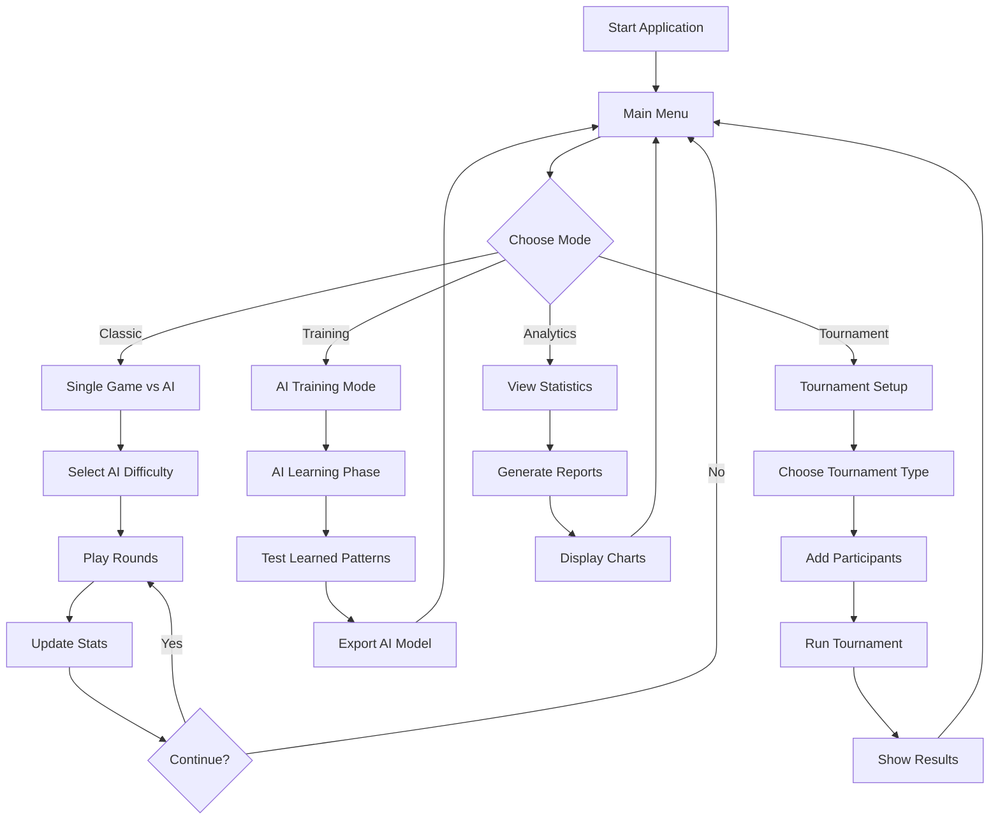
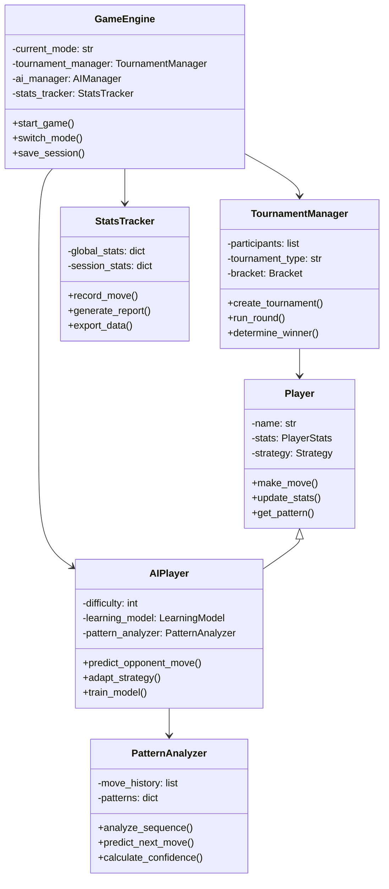

Rock-Paper-Scissors (Kéo-Búa-Bao) tưởng chừng đơn giản nhưng ẩn chứa nhiều bài học thú vị về lập trình AI, phân tích pattern, và xây dựng hệ thống tournament. Trong bài này, chúng ta sẽ phát triển một phiên bản nâng cao với AI thông minh có thể học hỏi từ lối chơi của bạn!

Dự án này sẽ dạy chúng ta về machine learning cơ bản, pattern recognition, statistical analysis, và cách xây dựng một hệ thống game hoàn chỉnh từ A đến Z.

<!-- truncate -->

## Game Demo và Giới Thiệu

Hãy cùng xem phiên bản nâng cao của Rock-Paper-Scissors:

```
🎮 ═══════════ ROCK-PAPER-SCISSORS CHAMPIONSHIP ═══════════ 🎮

🏆 Tournament Mode: Round Robin (8 players)
🤖 AI Level: Expert (Adaptive Learning)
📊 Current Match: Player vs SmartAI

Round 15/20 
┌─────────────────┬─────────────────┐
│     YOU         │    SMART AI     │
│      ✂️         │       🗿        │
│   (Scissors)    │     (Rock)      │
│                 │    🏆 WINS!     │
└─────────────────┴─────────────────┘

📈 Pattern Analysis:
   Your tendency: Rock(35%) > Scissors(35%) > Paper(30%)
   AI Prediction: Rock (Confidence: 78%)
   
💯 Score History: W-L-W-L-L-W-W-L-W-W-L-W-W-L-L
🎯 Win Rate: 53% | AI Win Rate: 47%

═══════════════════════════════════════════════════════════

1. 🗿 Rock      3. 📊 View Stats
2. 📄 Paper     4. 🎯 Strategy Hint  
3. ✂️ Scissors  5. 🔄 Change AI Level

Your choice: 
```

## Bạn Sẽ Học Được Gì?

Qua dự án nâng cao này, bạn sẽ thành thạo:

- [x] **AI và Machine Learning**: Pattern recognition, adaptive algorithms
- [x] **Data Analysis**: Statistical analysis, trend prediction  
- [x] **Tournament Systems**: Round robin, elimination brackets
- [x] **Advanced OOP**: Strategy pattern, factory pattern, observer pattern
- [x] **Performance Optimization**: Caching, efficient data structures
- [x] **Visualization**: ASCII charts, progress bars, animated displays

## Yêu Cầu Trước Khi Bắt Đầu

- **Python trung cấp**: OOP, decorators, generators
- **Math cơ bản**: Statistics, probability
- **Thuật toán**: Understanding của sorting, searching

:::info Game Modes Sẽ Xây Dựng
🎯 **Classic Mode**: Chơi đơn với AI  
🏆 **Tournament Mode**: Giải đấu nhiều người/AI  
📊 **Training Mode**: AI học từ lối chơi của bạn  
🤖 **AI Battle**: Xem các AI đấu với nhau  
📈 **Analytics Mode**: Phân tích chi tiết patterns
:::

## Phần 1: Phân Tích Hệ Thống Nâng Cao

### Game Flow Architecture



### Component Architecture



## Phần 2: Core Game Implementation

### Bước 1: Base Classes và Enums

```python
from enum import Enum
import random
import time
from collections import defaultdict, deque
from abc import ABC, abstractmethod
import json
from datetime import datetime
import statistics

class Move(Enum):
    """Enum cho các nước đi"""
    ROCK = "🗿"
    PAPER = "📄" 
    SCISSORS = "✂️"
    
    def beats(self, other):
        """Kiểm tra nước đi này có thắng nước đi khác không"""
        winning_combinations = {
            Move.ROCK: Move.SCISSORS,
            Move.PAPER: Move.ROCK,
            Move.SCISSORS: Move.PAPER
        }
        return winning_combinations[self] == other
    
    def __str__(self):
        return self.value

class GameResult(Enum):
    """Kết quả của một round"""
    WIN = "WIN"
    LOSE = "LOSE"  
    DRAW = "DRAW"

class AILevel(Enum):
    """Mức độ AI"""
    RANDOM = "Random"
    BASIC = "Basic Pattern"
    INTERMEDIATE = "Frequency Analysis"
    ADVANCED = "Markov Chain"
    EXPERT = "Adaptive Learning"
    MASTER = "Deep Pattern Recognition"

class PlayerStats:
    """Class theo dõi thống kê của người chơi"""
    
    def __init__(self, name="Player"):
        self.name = name
        self.total_games = 0
        self.wins = 0
        self.losses = 0
        self.draws = 0
        self.move_history = deque(maxlen=1000)  # Giữ 1000 nước đi gần nhất
        self.move_counts = {Move.ROCK: 0, Move.PAPER: 0, Move.SCISSORS: 0}
        self.win_streaks = []
        self.current_streak = 0
        self.longest_streak = 0
        self.session_start = datetime.now()
    
    def record_game(self, my_move, opponent_move, result):
        """Ghi lại kết quả một game"""
        self.total_games += 1
        self.move_history.append((my_move, opponent_move, result, datetime.now()))
        self.move_counts[my_move] += 1
        
        if result == GameResult.WIN:
            self.wins += 1
            self.current_streak += 1
            self.longest_streak = max(self.longest_streak, self.current_streak)
        elif result == GameResult.LOSE:
            self.losses += 1
            if self.current_streak > 0:
                self.win_streaks.append(self.current_streak)
                self.current_streak = 0
        else:
            self.draws += 1
    
    def get_win_rate(self):
        """Tính tỷ lệ thắng"""
        if self.total_games == 0:
            return 0
        return (self.wins / self.total_games) * 100
    
    def get_move_distribution(self):
        """Phân bố các nước đi"""
        if self.total_games == 0:
            return {move: 0 for move in Move}
        
        return {
            move: (count / self.total_games) * 100 
            for move, count in self.move_counts.items()
        }
    
    def get_recent_pattern(self, length=10):
        """Lấy pattern gần đây"""
        if len(self.move_history) < length:
            return [move for move, _, _, _ in self.move_history]
        return [move for move, _, _, _ in list(self.move_history)[-length:]]
    
    def to_dict(self):
        """Chuyển thành dictionary để lưu file"""
        return {
            'name': self.name,
            'total_games': self.total_games,
            'wins': self.wins,
            'losses': self.losses,
            'draws': self.draws,
            'move_counts': {move.name: count for move, count in self.move_counts.items()},
            'longest_streak': self.longest_streak,
            'session_start': self.session_start.isoformat()
        }
```

### Bước 2: Pattern Analysis Engine

```python
class PatternAnalyzer:
    """AI engine phân tích pattern của đối thủ"""
    
    def __init__(self):
        self.move_history = deque(maxlen=100)
        self.sequence_patterns = defaultdict(lambda: defaultdict(int))
        self.frequency_analysis = {Move.ROCK: 0, Move.PAPER: 0, Move.SCISSORS: 0}
        self.markov_chain = defaultdict(lambda: defaultdict(int))
        self.adaptation_rate = 0.1
    
    def record_move(self, move):
        """Ghi lại nước đi của đối thủ"""
        self.move_history.append(move)
        self.frequency_analysis[move] += 1
        
        # Cập nhật Markov chain
        if len(self.move_history) >= 2:
            prev_move = self.move_history[-2]
            self.markov_chain[prev_move][move] += 1
        
        # Phân tích sequence patterns (2-4 moves)
        for seq_len in range(2, min(5, len(self.move_history) + 1)):
            if len(self.move_history) >= seq_len:
                sequence = tuple(list(self.move_history)[-seq_len:-1])
                next_move = self.move_history[-1]
                self.sequence_patterns[sequence][next_move] += 1
    
    def predict_next_move(self, method="combined"):
        """Dự đoán nước đi tiếp theo"""
        if len(self.move_history) < 2:
            return random.choice(list(Move)), 0.33
        
        predictions = {}
        
        if method in ["frequency", "combined"]:
            predictions["frequency"] = self._frequency_prediction()
        
        if method in ["markov", "combined"]:
            predictions["markov"] = self._markov_prediction()
        
        if method in ["sequence", "combined"]:
            predictions["sequence"] = self._sequence_prediction()
        
        if method == "combined":
            return self._combine_predictions(predictions)
        else:
            pred_move, confidence = predictions.get(method, (random.choice(list(Move)), 0.33))
            return pred_move, confidence
    
    def _frequency_prediction(self):
        """Dự đoán dựa trên tần suất"""
        total_moves = sum(self.frequency_analysis.values())
        if total_moves == 0:
            return random.choice(list(Move)), 0.33
        
        # Tìm move có tần suất cao nhất
        most_frequent = max(self.frequency_analysis, key=self.frequency_analysis.get)
        confidence = self.frequency_analysis[most_frequent] / total_moves
        
        return most_frequent, confidence
    
    def _markov_prediction(self):
        """Dự đoán dựa trên Markov chain"""
        if len(self.move_history) == 0:
            return random.choice(list(Move)), 0.33
        
        last_move = self.move_history[-1]
        transitions = self.markov_chain[last_move]
        
        if not transitions:
            return random.choice(list(Move)), 0.33
        
        total_transitions = sum(transitions.values())
        most_likely = max(transitions, key=transitions.get)
        confidence = transitions[most_likely] / total_transitions
        
        return most_likely, confidence
    
    def _sequence_prediction(self):
        """Dự đoán dựa trên sequence patterns"""
        best_prediction = None
        best_confidence = 0
        
        # Thử các sequence lengths khác nhau
        for seq_len in range(2, min(5, len(self.move_history) + 1)):
            if len(self.move_history) >= seq_len - 1:
                sequence = tuple(list(self.move_history)[-(seq_len-1):])
                
                if sequence in self.sequence_patterns:
                    patterns = self.sequence_patterns[sequence]
                    total_occurrences = sum(patterns.values())
                    
                    if total_occurrences > 0:
                        most_likely = max(patterns, key=patterns.get)
                        confidence = patterns[most_likely] / total_occurrences
                        
                        # Ưu tiên sequence dài hơn nếu confidence tương đương
                        if confidence > best_confidence or (
                            confidence == best_confidence and seq_len > len(sequence)
                        ):
                            best_prediction = most_likely
                            best_confidence = confidence
        
        if best_prediction:
            return best_prediction, best_confidence
        else:
            return random.choice(list(Move)), 0.33
    
    def _combine_predictions(self, predictions):
        """Kết hợp nhiều phương pháp dự đoán"""
        if not predictions:
            return random.choice(list(Move)), 0.33
        
        # Weighted combination
        weights = {
            "sequence": 0.4,    # Ưu tiên pattern sequences
            "markov": 0.35,     # Markov chain
            "frequency": 0.25   # Frequency analysis
        }
        
        combined_scores = defaultdict(float)
        total_weight = 0
        
        for method, (move, confidence) in predictions.items():
            if method in weights:
                weight = weights[method] * confidence
                combined_scores[move] += weight
                total_weight += weight
        
        if not combined_scores:
            return random.choice(list(Move)), 0.33
        
        # Normalize scores
        for move in combined_scores:
            combined_scores[move] /= total_weight
        
        best_move = max(combined_scores, key=combined_scores.get)
        best_confidence = combined_scores[best_move]
        
        return best_move, best_confidence
    
    def get_counter_move(self, predicted_move, confidence):
        """Lấy nước đi counter lại dự đoán"""
        counter_moves = {
            Move.ROCK: Move.PAPER,
            Move.PAPER: Move.SCISSORS,
            Move.SCISSORS: Move.ROCK
        }
        
        # Thêm một chút randomness nếu confidence thấp
        if confidence < 0.6 and random.random() < 0.3:
            return random.choice(list(Move))
        
        return counter_moves[predicted_move]
```

### Bước 3: AI Player Implementation

```python
class AIPlayer:
    """AI Player với nhiều mức độ thông minh khác nhau"""
    
    def __init__(self, name, level=AILevel.INTERMEDIATE):
        self.name = name
        self.level = level
        self.stats = PlayerStats(name)
        self.pattern_analyzer = PatternAnalyzer()
        self.adaptation_counter = 0
        self.performance_history = deque(maxlen=20)
        
        # AI learning parameters
        self.learning_rate = 0.1
        self.exploration_rate = 0.2
        self.confidence_threshold = 0.7
    
    def make_move(self, opponent_history=None):
        """AI đưa ra quyết định"""
        self.adaptation_counter += 1
        
        if self.level == AILevel.RANDOM:
            return self._random_move()
        elif self.level == AILevel.BASIC:
            return self._basic_pattern_move()
        elif self.level == AILevel.INTERMEDIATE:
            return self._frequency_analysis_move()
        elif self.level == AILevel.ADVANCED:
            return self._markov_chain_move()
        elif self.level == AILevel.EXPERT:
            return self._adaptive_learning_move()
        elif self.level == AILevel.MASTER:
            return self._deep_pattern_move()
        else:
            return self._random_move()
    
    def _random_move(self):
        """Nước đi ngẫu nhiên hoàn toàn"""
        return random.choice(list(Move))
    
    def _basic_pattern_move(self):
        """Phát hiện pattern đơn giản"""
        if len(self.pattern_analyzer.move_history) < 3:
            return random.choice(list(Move))
        
        # Kiểm tra pattern lặp lại đơn giản
        recent_moves = list(self.pattern_analyzer.move_history)[-3:]
        if recent_moves[0] == recent_moves[1] == recent_moves[2]:
            # Đối thủ có thể sẽ tiếp tục pattern này
            predicted = recent_moves[0]
            return self.pattern_analyzer.get_counter_move(predicted, 0.6)
        
        return random.choice(list(Move))
    
    def _frequency_analysis_move(self):
        """Phân tích tần suất và counter"""
        predicted_move, confidence = self.pattern_analyzer.predict_next_move("frequency")
        
        if confidence > 0.4:
            return self.pattern_analyzer.get_counter_move(predicted_move, confidence)
        else:
            return random.choice(list(Move))
    
    def _markov_chain_move(self):
        """Sử dụng Markov chain để dự đoán"""
        predicted_move, confidence = self.pattern_analyzer.predict_next_move("markov")
        
        # Thêm một chút exploration
        if random.random() < self.exploration_rate:
            return random.choice(list(Move))
        
        return self.pattern_analyzer.get_counter_move(predicted_move, confidence)
    
    def _adaptive_learning_move(self):
        """AI học thích ứng từ performance"""
        predicted_move, confidence = self.pattern_analyzer.predict_next_move("combined")
        
        # Điều chỉnh strategy dựa trên performance gần đây
        if len(self.performance_history) >= 5:
            recent_performance = sum(self.performance_history[-5:]) / 5
            
            if recent_performance < 0.4:  # Đang thua nhiều
                # Tăng exploration và thử phương pháp khác
                self.exploration_rate = min(0.4, self.exploration_rate + 0.05)
                if random.random() < 0.3:
                    return random.choice(list(Move))
            else:  # Đang thắng
                # Giảm exploration, tin tưởng vào prediction
                self.exploration_rate = max(0.1, self.exploration_rate - 0.02)
        
        if confidence > self.confidence_threshold:
            return self.pattern_analyzer.get_counter_move(predicted_move, confidence)
        else:
            # Exploration move
            if random.random() < self.exploration_rate:
                return random.choice(list(Move))
            return self.pattern_analyzer.get_counter_move(predicted_move, confidence)
    
    def _deep_pattern_move(self):
        """AI master với deep pattern recognition"""
        # Kết hợp nhiều phương pháp và meta-learning
        predictions = {}
        
        # Multiple prediction methods
        for method in ["frequency", "markov", "sequence"]:
            move, conf = self.pattern_analyzer.predict_next_move(method)
            predictions[method] = (move, conf)
        
        # Meta-analysis: which method has been most accurate recently?
        method_weights = self._calculate_method_weights()
        
        # Weighted prediction
        final_prediction = self._weighted_prediction(predictions, method_weights)
        
        # Advanced counter-strategy
        return self._advanced_counter_strategy(final_prediction)
    
    def _calculate_method_weights(self):
        """Tính trọng số cho các phương pháp dự đoán"""
        # Simplified version - trong thực tế sẽ track accuracy của từng method
        return {
            "sequence": 0.4,
            "markov": 0.35,
            "frequency": 0.25
        }
    
    def _weighted_prediction(self, predictions, weights):
        """Kết hợp predictions với trọng số"""
        move_scores = defaultdict(float)
        
        for method, (move, confidence) in predictions.items():
            weight = weights.get(method, 0.33)
            move_scores[move] += confidence * weight
        
        if move_scores:
            best_move = max(move_scores, key=move_scores.get)
            best_confidence = move_scores[best_move]
            return best_move, best_confidence
        else:
            return random.choice(list(Move)), 0.33
    
    def _advanced_counter_strategy(self, prediction):
        """Chiến thuật counter nâng cao"""
        predicted_move, confidence = prediction
        
        # Level 1: Direct counter
        if confidence > 0.8:
            return self.pattern_analyzer.get_counter_move(predicted_move, confidence)
        
        # Level 2: Meta-gaming (đối thủ có thể biết mình sẽ counter)
        elif confidence > 0.6:
            if random.random() < 0.3:  # 30% chance meta-game
                # Counter the counter
                counter_move = self.pattern_analyzer.get_counter_move(predicted_move, confidence)
                return self.pattern_analyzer.get_counter_move(counter_move, confidence)
            else:
                return self.pattern_analyzer.get_counter_move(predicted_move, confidence)
        
        # Level 3: Mixed strategy khi không chắc chắn
        else:
            return random.choice(list(Move))
    
    def update_opponent_move(self, opponent_move, result):
        """Cập nhật thông tin về nước đi của đối thủ"""
        self.pattern_analyzer.record_move(opponent_move)
        
        # Ghi lại performance để adaptive learning
        performance_score = 1.0 if result == GameResult.WIN else (0.5 if result == GameResult.DRAW else 0.0)
        self.performance_history.append(performance_score)
        
        # Update stats
        my_move = None  # Cần track move của AI
        self.stats.record_game(my_move, opponent_move, result)
    
    def get_strategy_info(self):
        """Lấy thông tin về chiến thuật hiện tại"""
        info = {
            "level": self.level.value,
            "exploration_rate": self.exploration_rate,
            "confidence_threshold": self.confidence_threshold,
            "games_analyzed": len(self.pattern_analyzer.move_history),
            "current_performance": sum(self.performance_history) / len(self.performance_history) if self.performance_history else 0
        }
        
        if len(self.pattern_analyzer.move_history) > 0:
            predicted_move, confidence = self.pattern_analyzer.predict_next_move()
            info["next_prediction"] = predicted_move.name
            info["prediction_confidence"] = confidence
        
        return info
```

### Bước 4: Game Engine và Display

```python
class GameDisplay:
    """Class xử lý hiển thị game"""
    
    @staticmethod
    def clear_screen():
        """Xóa màn hình"""
        import os
        os.system('cls' if os.name == 'nt' else 'clear')
    
    @staticmethod
    def display_title():
        """Hiển thị title"""
        print("🎮 ═══════════ ROCK-PAPER-SCISSORS CHAMPIONSHIP ═══════════ 🎮")
        print()
    
    @staticmethod
    def display_round_result(player_move, ai_move, result, round_num):
        """Hiển thị kết quả round"""
        print(f"\n🎯 Round {round_num}")
        print("┌─────────────────┬─────────────────┐")
        print("│     YOU         │    OPPONENT     │")
        print(f"│      {player_move}         │       {ai_move}        │")
        print(f"│   ({player_move.name.title()})    │     ({ai_move.name.title()})      │")
        
        if result == GameResult.WIN:
            print("│    🏆 WINS!     │                 │")
        elif result == GameResult.LOSE:
            print("│                 │    🏆 WINS!     │")
        else:
            print("│    🤝 DRAW      │    🤝 DRAW      │")
        
        print("└─────────────────┴─────────────────┘")
    
    @staticmethod
    def display_stats(stats, ai_stats=None):
        """Hiển thị thống kê"""
        print(f"\n📊 Your Stats:")
        print(f"   Games: {stats.total_games} | W: {stats.wins} | L: {stats.losses} | D: {stats.draws}")
        print(f"   Win Rate: {stats.get_win_rate():.1f}% | Streak: {stats.current_streak}")
        
        distribution = stats.get_move_distribution()
        print(f"   Moves: 🗿{distribution[Move.ROCK]:.0f}% 📄{distribution[Move.PAPER]:.0f}% ✂️{distribution[Move.SCISSORS]:.0f}%")
        
        if ai_stats:
            print(f"\n🤖 AI Stats:")
            print(f"   Games: {ai_stats.total_games} | W: {ai_stats.wins} | Win Rate: {ai_stats.get_win_rate():.1f}%")
    
    @staticmethod
    def display_pattern_analysis(analyzer):
        """Hiển thị phân tích pattern"""
        if len(analyzer.move_history) < 3:
            return
        
        print(f"\n📈 Pattern Analysis:")
        
        # Recent moves
        recent = list(analyzer.move_history)[-10:]
        recent_str = " → ".join([move.value for move in recent])
        print(f"   Recent: {recent_str}")
        
        # Frequency analysis
        total = sum(analyzer.frequency_analysis.values())
        if total > 0:
            freq_str = " | ".join([
                f"{move.value}({count/total*100:.0f}%)" 
                for move, count in analyzer.frequency_analysis.items()
            ])
            print(f"   Frequency: {freq_str}")
        
        # Prediction
        predicted_move, confidence = analyzer.predict_next_move()
        print(f"   AI Prediction: {predicted_move.value} (Confidence: {confidence*100:.0f}%)")
    
    @staticmethod
    def display_menu():
        """Hiển thị menu chính"""
        print("\n🎮 Main Menu:")
        print("1. 🎯 Classic Game")
        print("2. 🏆 Tournament Mode") 
        print("3. 🤖 AI Training")
        print("4. 📊 View Statistics")
        print("5. ⚙️ Settings")
        print("6. 🚪 Exit")
    
    @staticmethod
    def display_game_menu():
        """Hiển thị menu trong game"""
        print("\n📋 Your move:")
        print("1. 🗿 Rock")
        print("2. 📄 Paper")
        print("3. ✂️ Scissors")
        print("4. 📊 View Stats")
        print("5. 🎯 Strategy Hint")
        print("6. 🔄 Change AI Level")
        print("7. 🏃 Quit to Menu")

class RockPaperScissorsGame:
    """Game engine chính"""
    
    def __init__(self):
        self.player_stats = PlayerStats("Player")
        self.ai_player = AIPlayer("SmartAI", AILevel.INTERMEDIATE)
        self.current_round = 0
        self.session_stats = {
            'start_time': datetime.now(),
            'games_played': 0,
            'different_ais_faced': set()
        }
        self.display = GameDisplay()
    
    def start(self):
        """Bắt đầu game"""
        self.display.clear_screen()
        self.display.display_title()
        
        print("🌟 Welcome to Rock-Paper-Scissors Championship!")
        print("   Advanced AI • Pattern Analysis • Tournament Mode")
        
        while True:
            self.display.display_menu()
            choice = input("\nChoose an option: ").strip()
            
            if choice == '1':
                self.play_classic_game()
            elif choice == '2':
                self.tournament_mode()
            elif choice == '3':
                self.ai_training_mode()
            elif choice == '4':
                self.view_statistics()
            elif choice == '5':
                self.settings_menu()
            elif choice == '6':
                print("👋 Thanks for playing! See you next time!")
                break
            else:
                print("❌ Invalid choice! Please try again.")
                time.sleep(1)
    
    def play_classic_game(self):
        """Chơi game classic với AI"""
        self.display.clear_screen()
        print("🎯 Classic Game Mode")
        print(f"🤖 Current AI: {self.ai_player.name} ({self.ai_player.level.value})")
        
        rounds_to_play = self.get_rounds_input()
        if rounds_to_play is None:
            return
        
        round_count = 0
        
        while round_count < rounds_to_play:
            self.display.clear_screen()
            self.display.display_title()
            print(f"🎯 Round {round_count + 1}/{rounds_to_play}")
            
            # Hiển thị stats và pattern analysis
            if round_count > 0:
                self.display.display_stats(self.player_stats, self.ai_player.stats)
                self.display.display_pattern_analysis(self.ai_player.pattern_analyzer)
            
            self.display.display_game_menu()
            choice = input("\nYour choice: ").strip()
            
            if choice in ['1', '2', '3']:
                moves = {
                    '1': Move.ROCK,
                    '2': Move.PAPER, 
                    '3': Move.SCISSORS
                }
                player_move = moves[choice]
                
                # AI makes move
                ai_move = self.ai_player.make_move()
                
                # Determine result
                result = self.determine_result(player_move, ai_move)
                
                # Update stats
                self.update_game_stats(player_move, ai_move, result)
                
                # Display result
                self.display.display_round_result(player_move, ai_move, result, round_count + 1)
                
                round_count += 1
                
                if round_count < rounds_to_play:
                    input("\nPress Enter to continue...")
                
            elif choice == '4':
                self.show_detailed_stats()
            elif choice == '5':
                self.show_strategy_hint()
            elif choice == '6':
                self.change_ai_level()
            elif choice == '7':
                break
            else:
                print("❌ Invalid choice!")
                time.sleep(1)
        
        # Show final results
        if round_count > 0:
            self.show_game_summary(rounds_to_play)
    
    def determine_result(self, player_move, ai_move):
        """Xác định kết quả game"""
        if player_move == ai_move:
            return GameResult.DRAW
        elif player_move.beats(ai_move):
            return GameResult.WIN
        else:
            return GameResult.LOSE
    
    def update_game_stats(self, player_move, ai_move, result):
        """Cập nhật thống kê"""
        self.player_stats.record_game(player_move, ai_move, result)
        
        # Update AI
        ai_result = GameResult.LOSE if result == GameResult.WIN else (
            GameResult.WIN if result == GameResult.LOSE else GameResult.DRAW
        )
        self.ai_player.update_opponent_move(player_move, ai_result)
        self.ai_player.stats.record_game(ai_move, player_move, ai_result)
        
        self.session_stats['games_played'] += 1
        self.session_stats['different_ais_faced'].add(self.ai_player.name)
    
    def get_rounds_input(self):
        """Lấy số rounds muốn chơi"""
        while True:
            try:
                rounds = input("How many rounds? (1-100, or 'back' to return): ").strip()
                if rounds.lower() == 'back':
                    return None
                rounds = int(rounds)
                if 1 <= rounds <= 100:
                    return rounds
                else:
                    print("❌ Please enter a number between 1 and 100!")
            except ValueError:
                print("❌ Please enter a valid number!")
    
    def show_detailed_stats(self):
        """Hiển thị thống kê chi tiết"""
        self.display.clear_screen()
        print("📊 ═══ DETAILED STATISTICS ═══")
        
        # Player stats
        print(f"\n👤 Player Stats:")
        print(f"   Total Games: {self.player_stats.total_games}")
        print(f"   Wins: {self.player_stats.wins} ({self.player_stats.get_win_rate():.1f}%)")
        print(f"   Losses: {self.player_stats.losses}")
        print(f"   Draws: {self.player_stats.draws}")
        print(f"   Current Streak: {self.player_stats.current_streak}")
        print(f"   Longest Streak: {self.player_stats.longest_streak}")
        
        # Move distribution
        dist = self.player_stats.get_move_distribution()
        print(f"\n🎯 Move Distribution:")
        for move, percentage in dist.items():
            print(f"   {move.value} {move.name}: {percentage:.1f}%")
        
        # AI stats  
        print(f"\n🤖 AI Stats:")
        ai_info = self.ai_player.get_strategy_info()
        for key, value in ai_info.items():
            print(f"   {key.replace('_', ' ').title()}: {value}")
        
        input("\nPress Enter to continue...")
    
    def show_strategy_hint(self):
        """Hiển thị gợi ý chiến thuật"""
        if len(self.ai_player.pattern_analyzer.move_history) < 3:
            print("\n💡 Not enough data for analysis yet. Play more rounds!")
        else:
            predicted_move, confidence = self.ai_player.pattern_analyzer.predict_next_move()
            counter_move = self.ai_player.pattern_analyzer.get_counter_move(predicted_move, confidence)
            
            print(f"\n💡 Strategy Hint:")
            print(f"   AI predicts you'll play: {predicted_move.value} ({confidence*100:.0f}% confidence)")
            print(f"   Suggested counter: {counter_move.value}")
            
            # Additional advice
            if confidence > 0.7:
                print(f"   💪 High confidence prediction - consider the counter!")
            elif confidence > 0.5:
                print(f"   🤔 Medium confidence - mix up your strategy")
            else:
                print(f"   🎲 Low confidence - your pattern is unpredictable!")
        
        input("\nPress Enter to continue...")
    
    def change_ai_level(self):
        """Thay đổi mức độ AI"""
        print("\n🔧 Choose AI Level:")
        levels = list(AILevel)
        for i, level in enumerate(levels, 1):
            current = " (Current)" if level == self.ai_player.level else ""
            print(f"   {i}. {level.value}{current}")
        
        try:
            choice = int(input("\nSelect level (1-6): ")) - 1
            if 0 <= choice < len(levels):
                old_level = self.ai_player.level
                self.ai_player.level = levels[choice]
                print(f"✅ AI level changed from {old_level.value} to {levels[choice].value}")
            else:
                print("❌ Invalid choice!")
        except ValueError:
            print("❌ Please enter a number!")
        
        time.sleep(2)
    
    def show_game_summary(self, total_rounds):
        """Hiển thị tổng kết game"""
        self.display.clear_screen()
        print("🏁 ═══ GAME SUMMARY ═══")
        
        print(f"\n📊 Results after {total_rounds} rounds:")
        print(f"   Your wins: {self.player_stats.wins}")
        print(f"   AI wins: {self.ai_player.stats.wins}")
        print(f"   Draws: {self.player_stats.draws}")
        
        if self.player_stats.wins > self.ai_player.stats.wins:
            print("\n🎉 Congratulations! You won the match!")
        elif self.player_stats.wins < self.ai_player.stats.wins:
            print("\n🤖 AI wins this match! Better luck next time!")
        else:
            print("\n🤝 It's a tie! Great match!")
        
        print(f"\n📈 Your final win rate: {self.player_stats.get_win_rate():.1f}%")
        
        input("\nPress Enter to return to menu...")
    
    def tournament_mode(self):
        """Chế độ tournament (simplified for now)"""
        print("\n🏆 Tournament Mode - Coming Soon!")
        print("   Features in development:")
        print("   • Round Robin tournaments")
        print("   • Elimination brackets") 
        print("   • Multiple AI opponents")
        print("   • Leaderboards")
        
        input("\nPress Enter to return to menu...")
    
    def ai_training_mode(self):
        """Chế độ training AI"""
        print("\n🤖 AI Training Mode - Coming Soon!")
        print("   Features in development:")
        print("   • Train AI with your playing style")
        print("   • Export/Import AI models")
        print("   • Create custom AI opponents")
        
        input("\nPress Enter to return to menu...")
    
    def view_statistics(self):
        """Xem thống kê tổng quát"""
        self.show_detailed_stats()
    
    def settings_menu(self):
        """Menu cài đặt"""
        print("\n⚙️ Settings - Coming Soon!")
        print("   • Save/Load game data")
        print("   • Customize display")
        print("   • Export statistics")
        
        input("\nPress Enter to return to menu...")

if __name__ == "__main__":
    game = RockPaperScissorsGame()
    game.start()
```

## Phần 3: Tournament System (Preview)

### Tournament Manager

```python
class TournamentManager:
    """Quản lý hệ thống tournament"""
    
    def __init__(self):
        self.participants = []
        self.tournament_type = None
        self.results = []
        
    def create_round_robin(self, participants):
        """Tạo tournament round robin"""
        matches = []
        for i in range(len(participants)):
            for j in range(i + 1, len(participants)):
                matches.append((participants[i], participants[j]))
        return matches
    
    def create_elimination(self, participants):
        """Tạo tournament elimination"""
        # Implementation for elimination brackets
        pass
    
    def run_tournament(self):
        """Chạy tournament"""
        # Implementation for running matches
        pass
```

## Phần 4: Advanced Features (Preview)

### Machine Learning Integration

```python
import numpy as np
from sklearn.naive_bayes import MultinomialNB

class MLPredictor:
    """Machine Learning predictor cho nâng cao hơn"""
    
    def __init__(self):
        self.model = MultinomialNB()
        self.is_trained = False
        self.feature_history = []
        self.target_history = []
    
    def extract_features(self, move_history):
        """Trích xuất features từ lịch sử moves"""
        # Convert moves to numerical features
        # Implementation tùy thuộc vào strategy
        pass
    
    def train(self, training_data):
        """Train model với dữ liệu"""
        # Implementation for ML training
        pass
    
    def predict(self, current_features):
        """Dự đoán move tiếp theo"""
        # Implementation for prediction
        pass
```

## Thử Thách Cho Bạn

Hãy mở rộng game với những tính năng này:

- [ ] **Tournament System**: Hoàn thiện round robin và elimination brackets
- [ ] **Machine Learning**: Tích hợp scikit-learn cho prediction nâng cao
- [ ] **Multiplayer Online**: Chơi qua mạng với socket programming
- [ ] **GUI Version**: Tạo giao diện đồ họa với Tkinter/Pygame
- [ ] **Statistics Dashboard**: Biểu đồ và visualization với matplotlib
- [ ] **AI Personality**: Tạo AI với các "tính cách" chơi khác nhau
- [ ] **Voice Control**: Điều khiển bằng giọng nói
- [ ] **Mobile App**: Port sang Android/iOS

## Source Code và Resources

:::tip Tài Nguyên Học Tập
**GitHub Repository**: [rps-championship-python](https://github.com/behitek/rps-championship-python)  
**Documentation**: Hướng dẫn chi tiết từng component  
**Video Series**: Playlist giải thích các algorithms  
:::

## Bài Tiếp Theo

Trong bài tiếp theo, chúng ta sẽ học cách **"Tạo Text Adventure Game"** - xây dựng thế giới game RPG với story branching, inventory system và quest management!

:::note Kết Luận
Rock-Paper-Scissors tưởng đơn giản nhưng đã dạy chúng ta rất nhiều về AI, pattern recognition, và system design. Từ game cơ bản, chúng ta đã xây dựng một hệ thống hoàn chỉnh với nhiều tính năng nâng cao. Đây là bước đệm tuyệt vời cho việc phát triển AI game phức tạp hơn!
:::

Chúc bạn coding vui vẻ và chiến thắng mọi AI! 🚀🤖