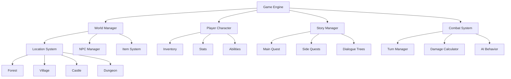
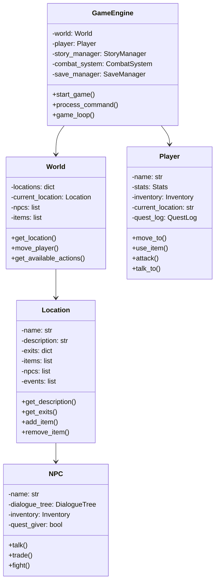

Text Adventure Games là những trò chơi kinh điển đã tạo ra nền tảng cho ngành công nghiệp game hiện đại. Từ những tượng đài như Zork đến các indie games modern, text adventures vẫn luôn có sức hấp dẫn đặc biệt với khả năng kể chuyện sâu sắc và tương tác phong phú.

Trong bài hướng dẫn này, chúng ta sẽ xây dựng một Text Adventure Game hoàn chỉnh với hệ thống câu chuyện phân nhánh, inventory management, combat system, và nhiều tính năng RPG thú vị khác.

<!-- truncate -->

## Game Demo và Giới Thiệu

Hãy cùng xem Text Adventure Game của chúng ta sẽ trông như thế nào:

```
🏰 ═══════════════ THE DRAGON'S QUEST ═══════════════ 🏰

📍 Current Location: Dark Forest
🗣️  You are standing in a mysterious dark forest. Ancient trees tower 
    above you, their branches forming a thick canopy that blocks most 
    of the sunlight. You can hear strange sounds in the distance.

🎒 Inventory: Rusty Sword, Health Potion (x2), Ancient Key
❤️  Health: 85/100  ⚡ Mana: 40/50  💰 Gold: 127

🔍 You can see:
   • A glimmering treasure chest (locked)
   • A wounded traveler sitting by a tree  
   • A narrow path leading north
   • A cave entrance to the east

📋 Available Actions:
1. 🗡️  Attack goblin
2. 💬 Talk to traveler
3. 🚪 Open chest
4. 🍺 Use health potion
5. 🧭 Go north
6. 🕳️  Enter cave
7. 🎒 Check inventory
8. 💾 Save game

> 
```

## Bạn Sẽ Học Được Gì?

Qua dự án Text Adventure này, bạn sẽ thành thạo:

- [x] **Story Design**: Branching narratives, quest systems, dialogue trees
- [x] **Game State Management**: Save/load, inventory, character progression
- [x] **Text Parsing**: Command interpretation, natural language processing
- [x] **World Building**: Rooms, connections, interactive objects
- [x] **Combat Systems**: Turn-based combat, damage calculation, AI enemies
- [x] **Data Persistence**: JSON save files, configuration management

## Yêu Cầu Trước Khi Bắt Đầu

- **Python trung cấp**: OOP, file I/O, exception handling
- **Creative writing**: Khả năng viết story và dialogue
- **Game design**: Hiểu cơ bản về RPG mechanics

:::info Game Features Sẽ Có
🌍 **Open World**: Multiple connected locations  
📜 **Story Quests**: Main story với side quests  
⚔️ **Combat System**: Turn-based battles với strategy  
🎒 **Inventory**: Items, weapons, magic potions  
💬 **NPCs**: Dialogue system với choices và consequences  
🎲 **Random Events**: Dynamic encounters  
💾 **Save System**: Multiple save slots
:::

## Phần 1: Architecture và World Design

### Game World Structure



### Core Component Design



## Phần 2: Core Game Implementation

### Bước 1: Basic Data Structures

```python
import json
import random
import re
from collections import defaultdict
from enum import Enum
from dataclasses import dataclass
from typing import Dict, List, Optional, Tuple
import os
from datetime import datetime

class ItemType(Enum):
    WEAPON = "weapon"
    ARMOR = "armor"
    CONSUMABLE = "consumable"
    KEY_ITEM = "key_item"
    TREASURE = "treasure"

class QuestStatus(Enum):
    NOT_STARTED = "not_started"
    ACTIVE = "active"
    COMPLETED = "completed"
    FAILED = "failed"

@dataclass
class Stats:
    """Character stats"""
    health: int = 100
    max_health: int = 100
    mana: int = 50
    max_mana: int = 50
    strength: int = 10
    defense: int = 5
    agility: int = 8
    intelligence: int = 7
    level: int = 1
    experience: int = 0
    gold: int = 100

    def take_damage(self, damage: int) -> int:
        """Take damage and return actual damage taken"""
        actual_damage = max(0, damage - self.defense)
        self.health = max(0, self.health - actual_damage)
        return actual_damage
    
    def heal(self, amount: int) -> int:
        """Heal and return actual amount healed"""
        old_health = self.health
        self.health = min(self.max_health, self.health + amount)
        return self.health - old_health
    
    def use_mana(self, amount: int) -> bool:
        """Use mana if available"""
        if self.mana >= amount:
            self.mana -= amount
            return True
        return False
    
    def gain_experience(self, exp: int):
        """Gain experience and level up if needed"""
        self.experience += exp
        # Simple level up formula
        while self.experience >= self.level * 100:
            self.level_up()
    
    def level_up(self):
        """Level up character"""
        self.level += 1
        self.max_health += 10
        self.max_mana += 5
        self.strength += 2
        self.defense += 1
        self.agility += 1
        self.intelligence += 1
        # Restore to full health/mana on level up
        self.health = self.max_health
        self.mana = self.max_mana

@dataclass
class Item:
    """Game item"""
    name: str
    description: str
    item_type: ItemType
    value: int = 0
    consumable: bool = False
    effect: Dict = None
    
    def __post_init__(self):
        if self.effect is None:
            self.effect = {}
    
    def use(self, target_stats: Stats) -> str:
        """Use item on target"""
        if not self.consumable:
            return f"You can't use {self.name}"
        
        result_msg = f"You use {self.name}. "
        
        if "heal" in self.effect:
            healed = target_stats.heal(self.effect["heal"])
            result_msg += f"You recover {healed} health. "
        
        if "mana" in self.effect:
            old_mana = target_stats.mana
            target_stats.mana = min(target_stats.max_mana, 
                                  target_stats.mana + self.effect["mana"])
            mana_gained = target_stats.mana - old_mana
            result_msg += f"You recover {mana_gained} mana. "
        
        if "strength" in self.effect:
            target_stats.strength += self.effect["strength"]
            result_msg += f"Your strength increases by {self.effect['strength']}! "
        
        return result_msg.strip()

class Inventory:
    """Player inventory system"""
    
    def __init__(self, max_size: int = 20):
        self.items: Dict[str, int] = {}  # item_name: quantity
        self.equipped: Dict[str, Item] = {}  # slot: item
        self.max_size = max_size
    
    def add_item(self, item: Item, quantity: int = 1) -> bool:
        """Add item to inventory"""
        if self.get_total_items() + quantity > self.max_size:
            return False
        
        if item.name in self.items:
            self.items[item.name] += quantity
        else:
            self.items[item.name] = quantity
        return True
    
    def remove_item(self, item_name: str, quantity: int = 1) -> bool:
        """Remove item from inventory"""
        if item_name not in self.items or self.items[item_name] < quantity:
            return False
        
        self.items[item_name] -= quantity
        if self.items[item_name] <= 0:
            del self.items[item_name]
        return True
    
    def has_item(self, item_name: str, quantity: int = 1) -> bool:
        """Check if inventory has item"""
        return self.items.get(item_name, 0) >= quantity
    
    def get_total_items(self) -> int:
        """Get total number of items"""
        return sum(self.items.values())
    
    def equip_item(self, item: Item, slot: str) -> Optional[Item]:
        """Equip item and return previously equipped item"""
        old_item = self.equipped.get(slot)
        self.equipped[slot] = item
        return old_item
    
    def unequip_item(self, slot: str) -> Optional[Item]:
        """Unequip item from slot"""
        return self.equipped.pop(slot, None)
    
    def get_equipped_bonus(self) -> Dict[str, int]:
        """Get stat bonuses from equipped items"""
        bonuses = defaultdict(int)
        for item in self.equipped.values():
            if item.effect:
                for stat, value in item.effect.items():
                    bonuses[stat] += value
        return dict(bonuses)
```

### Bước 2: Location and World System

```python
class Location:
    """Game location/room"""
    
    def __init__(self, name: str, description: str):
        self.name = name
        self.description = description
        self.exits: Dict[str, str] = {}  # direction: location_name
        self.items: List[Item] = []
        self.npcs: List['NPC'] = []
        self.visited = False
        self.events: List['Event'] = []
        self.hidden_exits: Dict[str, str] = {}  # Exits that need discovery
        
    def get_full_description(self) -> str:
        """Get complete location description"""
        desc = self.description
        
        if not self.visited:
            desc += "\n\n🌟 This is your first time here."
            self.visited = True
        
        # Add items description
        if self.items:
            desc += "\n\n🔍 You can see:"
            for item in self.items:
                desc += f"\n   • {item.name}"
        
        # Add NPCs description
        if self.npcs:
            desc += "\n\n👥 Characters here:"
            for npc in self.npcs:
                desc += f"\n   • {npc.name} - {npc.short_description}"
        
        # Add exits
        exits = list(self.exits.keys()) + list(self.hidden_exits.keys())
        if exits:
            desc += "\n\n🧭 Exits: " + ", ".join(exits)
        
        return desc
    
    def add_exit(self, direction: str, destination: str):
        """Add exit to location"""
        self.exits[direction] = destination
    
    def add_hidden_exit(self, direction: str, destination: str):
        """Add hidden exit that needs to be discovered"""
        self.hidden_exits[direction] = destination
    
    def discover_exit(self, direction: str) -> bool:
        """Discover a hidden exit"""
        if direction in self.hidden_exits:
            destination = self.hidden_exits.pop(direction)
            self.exits[direction] = destination
            return True
        return False
    
    def add_item(self, item: Item):
        """Add item to location"""
        self.items.append(item)
    
    def remove_item(self, item_name: str) -> Optional[Item]:
        """Remove and return item from location"""
        for i, item in enumerate(self.items):
            if item.name.lower() == item_name.lower():
                return self.items.pop(i)
        return None
    
    def get_item(self, item_name: str) -> Optional[Item]:
        """Get item without removing"""
        for item in self.items:
            if item.name.lower() == item_name.lower():
                return item
        return None
    
    def add_npc(self, npc: 'NPC'):
        """Add NPC to location"""
        self.npcs.append(npc)
    
    def remove_npc(self, npc_name: str) -> Optional['NPC']:
        """Remove NPC from location"""
        for i, npc in enumerate(self.npcs):
            if npc.name.lower() == npc_name.lower():
                return self.npcs.pop(i)
        return None
    
    def get_npc(self, npc_name: str) -> Optional['NPC']:
        """Get NPC by name"""
        for npc in self.npcs:
            if npc.name.lower() == npc_name.lower():
                return npc
        return None

class World:
    """Game world containing all locations"""
    
    def __init__(self):
        self.locations: Dict[str, Location] = {}
        self.current_location = None
        self.items_database: Dict[str, Item] = {}
        self.load_world_data()
    
    def add_location(self, location: Location):
        """Add location to world"""
        self.locations[location.name] = location
    
    def get_location(self, name: str) -> Optional[Location]:
        """Get location by name"""
        return self.locations.get(name)
    
    def set_current_location(self, location_name: str) -> bool:
        """Set current location"""
        if location_name in self.locations:
            self.current_location = self.locations[location_name]
            return True
        return False
    
    def can_move(self, direction: str) -> bool:
        """Check if player can move in direction"""
        if not self.current_location:
            return False
        return direction in self.current_location.exits
    
    def move(self, direction: str) -> Tuple[bool, str]:
        """Move player in direction"""
        if not self.current_location:
            return False, "You are nowhere!"
        
        if direction not in self.current_location.exits:
            return False, f"You can't go {direction} from here."
        
        destination_name = self.current_location.exits[direction]
        if self.set_current_location(destination_name):
            return True, f"You move {direction} to {destination_name}."
        else:
            return False, "Something went wrong with the movement."
    
    def load_world_data(self):
        """Load world data from JSON files"""
        self.create_default_world()
    
    def create_default_world(self):
        """Create a default world for the game"""
        # Village
        village = Location("Village Square", 
                         "You are in the heart of a bustling village. "
                         "Merchants hawk their wares while children play in the dusty streets. "
                         "The village well sits in the center, surrounded by cobblestone paths.")
        
        # Forest  
        forest = Location("Dark Forest",
                        "You stand in a mysterious dark forest. Ancient trees tower above you, "
                        "their branches forming a thick canopy that blocks most sunlight. "
                        "Strange sounds echo from deeper in the woods.")
        
        # Cave
        cave = Location("Mysterious Cave",
                       "You are inside a damp, echoing cave. Water drips from stalactites above, "
                       "and strange crystals embedded in the walls provide an eerie blue glow. "
                       "The air is cool and thick with mystery.")
        
        # Castle
        castle = Location("Ancient Castle",
                        "You stand before the gates of an imposing castle. "
                        "Its towers reach high into the cloudy sky, and banners flutter in the wind. "
                        "The massive wooden doors are bound with iron and look very old.")
        
        # Dungeon
        dungeon = Location("Underground Dungeon",
                         "You are in a dark, musty dungeon. Iron bars line the walls, "
                         "and the floor is covered with old straw. Rats scurry in the shadows, "
                         "and the air smells of dampness and despair.")
        
        # Set up connections
        village.add_exit("north", "Dark Forest")
        village.add_exit("east", "Ancient Castle")
        
        forest.add_exit("south", "Village Square") 
        forest.add_exit("west", "Mysterious Cave")
        forest.add_hidden_exit("down", "Underground Dungeon")  # Hidden entrance
        
        cave.add_exit("east", "Dark Forest")
        
        castle.add_exit("west", "Village Square")
        castle.add_exit("down", "Underground Dungeon")
        
        dungeon.add_exit("up", "Ancient Castle")
        
        # Add locations to world
        for location in [village, forest, cave, castle, dungeon]:
            self.add_location(location)
        
        # Set starting location
        self.set_current_location("Village Square")
        
        # Add some items to locations
        self.add_default_items()
    
    def add_default_items(self):
        """Add default items to world"""
        # Create items
        sword = Item("Iron Sword", "A sturdy iron sword with a sharp blade", 
                    ItemType.WEAPON, 50, effect={"strength": 5})
        
        potion = Item("Health Potion", "A red potion that restores health",
                     ItemType.CONSUMABLE, 25, True, {"heal": 30})
        
        key = Item("Ancient Key", "An old brass key with mystical engravings",
                  ItemType.KEY_ITEM, 0)
        
        armor = Item("Leather Armor", "Sturdy leather armor that provides protection",
                    ItemType.ARMOR, 75, effect={"defense": 3})
        
        treasure = Item("Golden Coin", "A shiny gold coin worth quite a bit",
                       ItemType.TREASURE, 10)
        
        # Store in database
        for item in [sword, potion, key, armor, treasure]:
            self.items_database[item.name] = item
        
        # Add items to locations
        if "Dark Forest" in self.locations:
            self.locations["Dark Forest"].add_item(potion)
            self.locations["Dark Forest"].add_item(key)
        
        if "Mysterious Cave" in self.locations:
            self.locations["Mysterious Cave"].add_item(sword)
            self.locations["Mysterious Cave"].add_item(treasure)
        
        if "Village Square" in self.locations:
            self.locations["Village Square"].add_item(armor)
```

### Bước 3: NPC và Dialogue System

```python
class DialogueOption:
    """A dialogue choice for the player"""
    
    def __init__(self, text: str, response: str, action: str = None, 
                 condition: callable = None, consequence: callable = None):
        self.text = text  # What player sees
        self.response = response  # NPC's response
        self.action = action  # Optional action ID
        self.condition = condition  # Function to check if option is available
        self.consequence = consequence  # Function to execute when chosen
    
    def is_available(self, player: 'Player', npc: 'NPC') -> bool:
        """Check if this option is available"""
        return self.condition is None or self.condition(player, npc)

class DialogueTree:
    """Manages NPC dialogue conversations"""
    
    def __init__(self, greeting: str):
        self.greeting = greeting
        self.dialogue_nodes: Dict[str, List[DialogueOption]] = {}
        self.current_node = "main"
        self.conversation_state = {}
    
    def add_dialogue_node(self, node_id: str, options: List[DialogueOption]):
        """Add a dialogue node with options"""
        self.dialogue_nodes[node_id] = options
    
    def get_current_options(self, player: 'Player', npc: 'NPC') -> List[DialogueOption]:
        """Get available dialogue options for current node"""
        if self.current_node not in self.dialogue_nodes:
            return []
        
        available_options = []
        for option in self.dialogue_nodes[self.current_node]:
            if option.is_available(player, npc):
                available_options.append(option)
        
        return available_options
    
    def choose_option(self, option_index: int, player: 'Player', npc: 'NPC') -> str:
        """Process dialogue choice"""
        options = self.get_current_options(player, npc)
        
        if 0 <= option_index < len(options):
            chosen_option = options[option_index]
            
            # Execute consequence if any
            if chosen_option.consequence:
                chosen_option.consequence(player, npc)
            
            # Change dialogue node if specified
            if chosen_option.action:
                if chosen_option.action.startswith("goto_"):
                    self.current_node = chosen_option.action[5:]
                elif chosen_option.action == "end":
                    self.current_node = "main"
            
            return chosen_option.response
        
        return "I don't understand."

class NPC:
    """Non-player character"""
    
    def __init__(self, name: str, description: str, short_description: str = ""):
        self.name = name
        self.description = description
        self.short_description = short_description or description
        self.dialogue_tree = None
        self.inventory = Inventory()
        self.stats = Stats(health=50, strength=8, defense=3)
        self.is_hostile = False
        self.is_trader = False
        self.quest_giver = False
        self.quests: List['Quest'] = []
        
    def set_dialogue(self, dialogue_tree: DialogueTree):
        """Set NPC's dialogue tree"""
        self.dialogue_tree = dialogue_tree
    
    def talk(self, player: 'Player') -> str:
        """Start conversation with player"""
        if not self.dialogue_tree:
            return f"{self.name} doesn't seem interested in talking."
        
        return self.dialogue_tree.greeting
    
    def get_dialogue_options(self, player: 'Player') -> List[DialogueOption]:
        """Get current dialogue options"""
        if not self.dialogue_tree:
            return []
        return self.dialogue_tree.get_current_options(player, self)
    
    def choose_dialogue_option(self, option_index: int, player: 'Player') -> str:
        """Process dialogue choice"""
        if not self.dialogue_tree:
            return "They don't respond."
        return self.dialogue_tree.choose_option(option_index, player, self)
    
    def add_item_to_inventory(self, item: Item, quantity: int = 1):
        """Add item to NPC inventory"""
        self.inventory.add_item(item, quantity)
    
    def trade_with_player(self, player: 'Player', item_name: str, price: int) -> bool:
        """Trade item with player"""
        if not self.is_trader:
            return False
        
        if player.stats.gold >= price and self.inventory.has_item(item_name):
            # Find the actual item object (simplified)
            # In real implementation, you'd need proper item lookup
            self.inventory.remove_item(item_name)
            player.stats.gold -= price
            return True
        return False

def create_village_merchant() -> NPC:
    """Create a merchant NPC"""
    merchant = NPC("Marcus the Merchant", 
                  "A portly man with a friendly smile and a twinkle in his eye. "
                  "His cart is loaded with various goods and trinkets.",
                  "a friendly merchant")
    
    merchant.is_trader = True
    
    # Create dialogue tree
    dialogue = DialogueTree("Welcome, traveler! I have the finest goods in all the land!")
    
    # Main dialogue options
    main_options = [
        DialogueOption(
            "What do you have for sale?",
            "Ah, interested in my wares? I have potions, weapons, armor... what catches your eye?",
            "goto_shop"
        ),
        DialogueOption(
            "Tell me about this village.",
            "This humble village has been my home for many years. Peaceful place, though "
            "strange things have been happening in the forest lately...",
            None
        ),
        DialogueOption(
            "I need to go.",
            "Safe travels, friend! Come back anytime!",
            "end"
        )
    ]
    
    # Shop options
    shop_options = [
        DialogueOption(
            "Buy Health Potion (25 gold)",
            "Excellent choice! This will heal your wounds in no time.",
            None,
            condition=lambda p, n: p.stats.gold >= 25,
            consequence=lambda p, n: buy_health_potion(p)
        ),
        DialogueOption(
            "Buy Iron Dagger (40 gold)",
            "A fine blade! It will serve you well.",
            None,
            condition=lambda p, n: p.stats.gold >= 40,
            consequence=lambda p, n: buy_iron_dagger(p)
        ),
        DialogueOption(
            "Never mind.",
            "No problem! Let me know if you change your mind.",
            "goto_main"
        )
    ]
    
    dialogue.add_dialogue_node("main", main_options)
    dialogue.add_dialogue_node("shop", shop_options)
    
    merchant.set_dialogue(dialogue)
    
    return merchant

def buy_health_potion(player):
    """Helper function for buying health potion"""
    if player.stats.gold >= 25:
        player.stats.gold -= 25
        # Add potion to inventory (simplified)
        return True
    return False

def buy_iron_dagger(player):
    """Helper function for buying iron dagger"""
    if player.stats.gold >= 40:
        player.stats.gold -= 40
        # Add dagger to inventory (simplified)
        return True
    return False
```

### Bước 4: Player Class và Command Parser

```python
class Player:
    """The player character"""
    
    def __init__(self, name: str = "Hero"):
        self.name = name
        self.stats = Stats()
        self.inventory = Inventory()
        self.current_location = None
        self.quest_log = []
        self.flags = {}  # For tracking story progress
        
    def move_to(self, location: Location):
        """Move player to new location"""
        self.current_location = location
    
    def pick_up_item(self, item_name: str) -> Tuple[bool, str]:
        """Pick up item from current location"""
        if not self.current_location:
            return False, "You are nowhere!"
        
        item = self.current_location.remove_item(item_name)
        if item:
            if self.inventory.add_item(item):
                return True, f"You pick up {item.name}."
            else:
                # Put item back if inventory is full
                self.current_location.add_item(item)
                return False, "Your inventory is full!"
        else:
            return False, f"There is no {item_name} here."
    
    def use_item(self, item_name: str) -> Tuple[bool, str]:
        """Use item from inventory"""
        if not self.inventory.has_item(item_name):
            return False, f"You don't have {item_name}."
        
        # Get the item object (simplified - in real implementation need proper lookup)
        # For now, assume we have a way to get item by name
        if item_name.lower() == "health potion":
            if self.inventory.remove_item(item_name):
                healed = self.stats.heal(30)
                return True, f"You drink the health potion and recover {healed} health."
        
        return False, f"You can't use {item_name} right now."
    
    def talk_to_npc(self, npc_name: str) -> Tuple[bool, str, 'NPC']:
        """Talk to an NPC"""
        if not self.current_location:
            return False, "You are nowhere!", None
        
        npc = self.current_location.get_npc(npc_name)
        if npc:
            response = npc.talk(self)
            return True, response, npc
        else:
            return False, f"There is no {npc_name} here.", None
    
    def get_status(self) -> str:
        """Get player status string"""
        status = f"\n👤 {self.name} - Level {self.stats.level}\n"
        status += f"❤️  Health: {self.stats.health}/{self.stats.max_health}  "
        status += f"⚡ Mana: {self.stats.mana}/{self.stats.max_mana}  "
        status += f"💰 Gold: {self.stats.gold}\n"
        status += f"💪 STR: {self.stats.strength}  🛡️ DEF: {self.stats.defense}  "
        status += f"🏃 AGI: {self.stats.agility}  🧠 INT: {self.stats.intelligence}\n"
        
        if self.inventory.items:
            status += f"\n🎒 Inventory: "
            items = []
            for item_name, quantity in self.inventory.items.items():
                if quantity > 1:
                    items.append(f"{item_name} (x{quantity})")
                else:
                    items.append(item_name)
            status += ", ".join(items)
        else:
            status += "\n🎒 Inventory: Empty"
        
        return status

class CommandParser:
    """Parses and executes player commands"""
    
    def __init__(self):
        self.aliases = {
            # Movement
            'n': 'north', 'north': 'north',
            's': 'south', 'south': 'south', 
            'e': 'east', 'east': 'east',
            'w': 'west', 'west': 'west',
            'u': 'up', 'up': 'up',
            'd': 'down', 'down': 'down',
            'go': 'move', 'move': 'move',
            
            # Actions
            'l': 'look', 'look': 'look',
            'i': 'inventory', 'inv': 'inventory', 'inventory': 'inventory',
            'get': 'take', 'pick': 'take', 'take': 'take',
            'use': 'use',
            'talk': 'talk', 'speak': 'talk',
            'attack': 'attack', 'fight': 'attack', 'kill': 'attack',
            'help': 'help', '?': 'help',
            'quit': 'quit', 'exit': 'quit', 'q': 'quit',
            'save': 'save', 'load': 'load',
            'status': 'status', 'stats': 'status'
        }
    
    def parse(self, command: str) -> Tuple[str, List[str]]:
        """Parse command into action and arguments"""
        command = command.lower().strip()
        if not command:
            return "look", []
        
        parts = command.split()
        action = parts[0]
        args = parts[1:] if len(parts) > 1 else []
        
        # Handle compound commands like "go north", "talk to merchant"
        if action == "go" and args:
            return "move", args
        elif action == "talk" and len(args) >= 2 and args[0] == "to":
            return "talk", args[1:]
        elif action == "pick" and len(args) >= 2 and args[0] == "up":
            return "take", args[1:]
        
        # Resolve aliases
        action = self.aliases.get(action, action)
        
        # Handle direction commands
        if action in ['north', 'south', 'east', 'west', 'up', 'down']:
            return "move", [action]
        
        return action, args
    
    def get_help_text(self) -> str:
        """Get help text for commands"""
        help_text = """
🎮 ═══ GAME COMMANDS ═══

📍 Movement:
   north/n, south/s, east/e, west/w, up/u, down/d
   go <direction>

🔍 Exploration:
   look/l - Look around current location
   take/get/pick <item> - Pick up an item
   inventory/i - Check your inventory
   status/stats - Check your character status

💬 Interaction:
   talk to <npc> - Talk to a character
   use <item> - Use an item from inventory
   attack/fight <enemy> - Attack an enemy

🎮 Game Management:
   save - Save your game
   load - Load a saved game  
   help/? - Show this help
   quit/exit/q - Quit game

📝 Examples:
   > look
   > go north
   > take health potion
   > talk to merchant
   > use health potion
   > attack goblin
        """
        return help_text
```

### Bước 5: Game Engine và Main Loop

```python
class TextAdventureGame:
    """Main game engine"""
    
    def __init__(self):
        self.world = World()
        self.player = Player()
        self.parser = CommandParser()
        self.game_running = True
        self.in_dialogue = False
        self.current_npc = None
        
        # Initialize player location
        if self.world.current_location:
            self.player.move_to(self.world.current_location)
    
    def start(self):
        """Start the game"""
        self.display_title()
        self.display_intro()
        
        # Game loop
        while self.game_running:
            try:
                if self.in_dialogue:
                    self.handle_dialogue()
                else:
                    self.handle_normal_gameplay()
            except KeyboardInterrupt:
                print("\n\nGame interrupted. Goodbye!")
                break
            except Exception as e:
                print(f"\n❌ An error occurred: {e}")
                print("Please try again or type 'help' for commands.")
    
    def display_title(self):
        """Display game title"""
        print("🏰 ═══════════════ THE DRAGON'S QUEST ═══════════════ 🏰")
        print()
        print("   A Text Adventure Game by [Your Name]")
        print("   Type 'help' for commands, 'quit' to exit")
        print()
    
    def display_intro(self):
        """Display game introduction"""
        intro = """
🌟 Welcome, brave adventurer!

You are a young hero who has just arrived in the peaceful village of Millbrook.
However, rumors speak of strange happenings in the nearby forest, and the 
villagers whisper about an ancient evil stirring in the old castle ruins.

Your quest begins now...

Type 'look' to examine your surroundings, or 'help' for a list of commands.
        """
        print(intro)
        
        # Show initial location
        self.execute_command("look", [])
    
    def handle_normal_gameplay(self):
        """Handle normal game input"""
        try:
            # Show prompt
            prompt = f"\n📍 {self.player.current_location.name}\n> "
            user_input = input(prompt).strip()
            
            if not user_input:
                return
            
            # Parse and execute command
            action, args = self.parser.parse(user_input)
            self.execute_command(action, args)
            
        except EOFError:
            print("\nGoodbye!")
            self.game_running = False
    
    def handle_dialogue(self):
        """Handle dialogue mode"""
        if not self.current_npc:
            self.in_dialogue = False
            return
        
        # Show dialogue options
        options = self.current_npc.get_dialogue_options(self.player)
        
        if not options:
            print("\n[Conversation ended]")
            self.in_dialogue = False
            self.current_npc = None
            return
        
        print("\n💬 Dialogue Options:")
        for i, option in enumerate(options, 1):
            print(f"   {i}. {option.text}")
        print("   0. [End conversation]")
        
        try:
            choice = input("\nChoose an option: ").strip()
            
            if choice == "0":
                print(f"\nYou end the conversation with {self.current_npc.name}.")
                self.in_dialogue = False
                self.current_npc = None
            else:
                choice_num = int(choice) - 1
                if 0 <= choice_num < len(options):
                    response = self.current_npc.choose_dialogue_option(choice_num, self.player)
                    print(f"\n{self.current_npc.name}: {response}")
                else:
                    print("❌ Invalid choice!")
        
        except ValueError:
            print("❌ Please enter a number!")
        except EOFError:
            self.in_dialogue = False
            self.current_npc = None
    
    def execute_command(self, action: str, args: List[str]):
        """Execute a game command"""
        if action == "look":
            self.cmd_look()
        elif action == "move":
            self.cmd_move(args)
        elif action == "take":
            self.cmd_take(args)
        elif action == "inventory":
            self.cmd_inventory()
        elif action == "use":
            self.cmd_use(args)
        elif action == "talk":
            self.cmd_talk(args)
        elif action == "status":
            self.cmd_status()
        elif action == "help":
            self.cmd_help()
        elif action == "save":
            self.cmd_save()
        elif action == "load":
            self.cmd_load()
        elif action == "quit":
            self.cmd_quit()
        else:
            print(f"❌ Unknown command: {action}")
            print("Type 'help' for a list of available commands.")
    
    def cmd_look(self):
        """Look around current location"""
        if self.player.current_location:
            print(f"\n📍 {self.player.current_location.name}")
            print(self.player.current_location.get_full_description())
        else:
            print("You are in the void!")
    
    def cmd_move(self, args: List[str]):
        """Move to another location"""
        if not args:
            print("❌ Move where? Specify a direction.")
            return
        
        direction = args[0]
        success, message = self.world.move(direction)
        print(f"\n{message}")
        
        if success:
            self.player.move_to(self.world.current_location)
            # Auto-look after moving
            self.cmd_look()
    
    def cmd_take(self, args: List[str]):
        """Pick up an item"""
        if not args:
            print("❌ Take what?")
            return
        
        item_name = " ".join(args)
        success, message = self.player.pick_up_item(item_name)
        print(f"\n{message}")
    
    def cmd_inventory(self):
        """Show inventory"""
        print(self.player.get_status())
    
    def cmd_use(self, args: List[str]):
        """Use an item"""
        if not args:
            print("❌ Use what?")
            return
        
        item_name = " ".join(args)
        success, message = self.player.use_item(item_name)
        print(f"\n{message}")
    
    def cmd_talk(self, args: List[str]):
        """Talk to an NPC"""
        if not args:
            print("❌ Talk to whom?")
            return
        
        npc_name = " ".join(args)
        success, message, npc = self.player.talk_to_npc(npc_name)
        
        if success and npc:
            print(f"\n{npc.name}: {message}")
            self.in_dialogue = True
            self.current_npc = npc
        else:
            print(f"\n{message}")
    
    def cmd_status(self):
        """Show player status"""
        print(self.player.get_status())
    
    def cmd_help(self):
        """Show help"""
        print(self.parser.get_help_text())
    
    def cmd_save(self):
        """Save game"""
        print("💾 Save functionality coming soon!")
    
    def cmd_load(self):
        """Load game"""
        print("📁 Load functionality coming soon!")
    
    def cmd_quit(self):
        """Quit game"""
        confirm = input("\n❓ Are you sure you want to quit? (y/n): ").lower().strip()
        if confirm in ['y', 'yes']:
            print("\n👋 Thanks for playing! Your adventure ends here... for now.")
            self.game_running = False

def main():
    """Main entry point"""
    game = TextAdventureGame()
    
    # Add some NPCs to the world
    merchant = create_village_merchant()
    game.world.locations["Village Square"].add_npc(merchant)
    
    # Start the game
    game.start()

if __name__ == "__main__":
    main()
```

## Phần 3: Advanced Features

### Quest System (Preview)

```python
class Quest:
    """Game quest"""
    
    def __init__(self, quest_id: str, title: str, description: str):
        self.quest_id = quest_id
        self.title = title  
        self.description = description
        self.status = QuestStatus.NOT_STARTED
        self.objectives = []
        self.rewards = []
        self.prerequisites = []
    
    def start_quest(self, player: Player) -> bool:
        """Start the quest"""
        if self.status != QuestStatus.NOT_STARTED:
            return False
        
        # Check prerequisites
        for prereq in self.prerequisites:
            if not prereq(player):
                return False
        
        self.status = QuestStatus.ACTIVE
        return True
    
    def complete_quest(self, player: Player):
        """Complete the quest and give rewards"""
        if self.status != QuestStatus.ACTIVE:
            return
        
        self.status = QuestStatus.COMPLETED
        
        # Give rewards
        for reward in self.rewards:
            reward(player)

class QuestObjective:
    """Individual quest objective"""
    
    def __init__(self, description: str, completed: bool = False):
        self.description = description
        self.completed = completed
    
    def check_completion(self, player: Player) -> bool:
        """Check if objective is completed"""
        return self.completed
```

### Combat System (Preview)

```python
class CombatSystem:
    """Turn-based combat system"""
    
    def __init__(self):
        self.in_combat = False
        self.current_enemies = []
        self.turn_order = []
        self.current_turn = 0
    
    def start_combat(self, player: Player, enemies: List[NPC]):
        """Start combat encounter"""
        self.in_combat = True
        self.current_enemies = enemies
        self.turn_order = [player] + enemies
        self.current_turn = 0
        
        print("⚔️ Combat begins!")
    
    def process_turn(self, action: str, target=None):
        """Process a combat turn"""
        current_actor = self.turn_order[self.current_turn]
        
        if isinstance(current_actor, Player):
            # Player turn
            self.handle_player_turn(action, target)
        else:
            # Enemy turn
            self.handle_enemy_turn(current_actor)
        
        self.current_turn = (self.current_turn + 1) % len(self.turn_order)
        
        # Check for combat end
        self.check_combat_end()
    
    def handle_player_turn(self, action: str, target=None):
        """Handle player's combat turn"""
        # Implementation for player combat actions
        pass
    
    def handle_enemy_turn(self, enemy: NPC):
        """Handle enemy's combat turn"""
        # Simple AI: attack player
        pass
    
    def check_combat_end(self):
        """Check if combat should end"""
        # Check if player is dead or all enemies are dead
        pass
```

## Thử Thách Cho Bạn

Hãy mở rộng game với những tính năng nâng cao:

- [ ] **Combat System**: Hoàn thiện turn-based combat với magic spells
- [ ] **Quest System**: Implement quest tracking và quest chains
- [ ] **Save/Load**: JSON-based save system với multiple slots  
- [ ] **Random Events**: Dynamic encounters và random loot
- [ ] **Character Progression**: Skill trees và character classes
- [ ] **Multiple Endings**: Branching story với player choices
- [ ] **GUI Version**: Chuyển sang Tkinter hoặc web interface
- [ ] **Sound Effects**: Text-to-speech và background music

## Source Code và Documentation

:::tip Resources
**GitHub Repository**: [text-adventure-python](https://github.com/behitek/text-adventure-python)  
**Wiki**: Comprehensive game design documentation  
**Story Writer's Guide**: Tools for creating your own adventures  
:::

### Project Structure

```
text_adventure/
├── main.py              # Game entry point
├── game_engine.py       # Core game loop
├── world.py             # World and location management
├── player.py            # Player character
├── npc.py               # NPCs and dialogue
├── items.py             # Item system
├── quests.py            # Quest management
├── combat.py            # Combat system
├── save_manager.py      # Save/load functionality
├── command_parser.py    # Text parsing
└── data/
    ├── locations.json   # Location data
    ├── items.json       # Item database
    ├── npcs.json        # NPC data
    └── quests.json      # Quest definitions
```

## Bài Tiếp Theo

Trong bài tiếp theo, chúng ta sẽ học cách **"Quiz Game với Database Câu Hỏi"** - xây dựng hệ thống quiz thông minh với AI question generation và adaptive difficulty!

:::note Kết Luận
Text Adventure Games là một genre tuyệt vời để học game programming vì chúng tập trung vào story, logic, và system design hơn là graphics. Qua dự án này, chúng ta đã học về world building, dialogue systems, state management, và text parsing - những kỹ năng cốt lõi cho mọi loại game development!
:::

Chúc bạn viết những câu chuyện tuyệt vời và tạo ra những thế giới game đầy mê hoặc! ✨📚