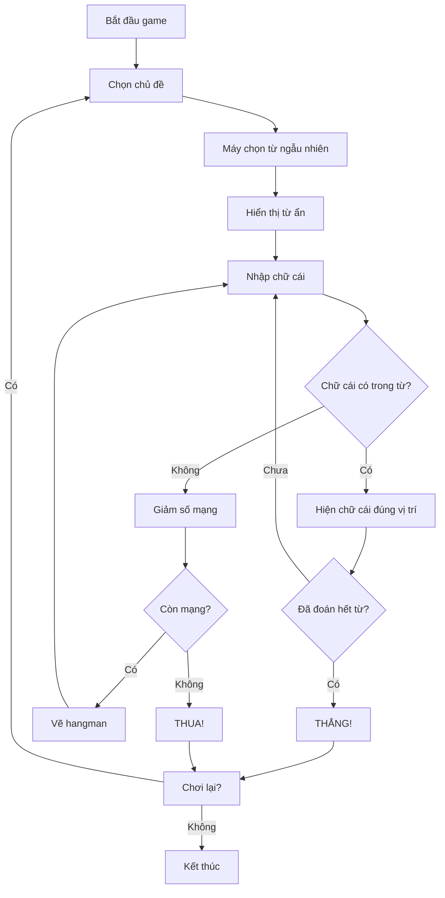
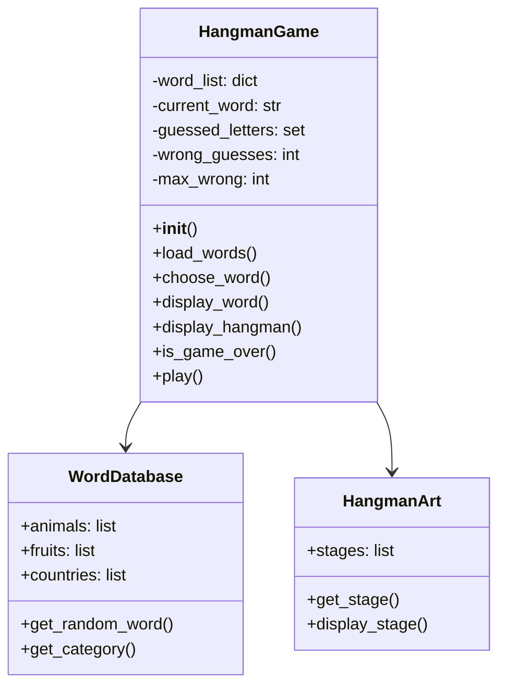

Hangman (Trò chơi Treo Cổ) là một trong những game kinh điển mà hầu hết chúng ta đều đã từng chơi ít nhất một lần. Đây cũng là một dự án tuyệt vời để học lập trình game với Python vì nó kết hợp nhiều khái niệm quan trọng như xử lý chuỗi, vòng lặp, và logic game cơ bản.

Trong bài hướng dẫn này, chúng ta sẽ xây dựng một phiên bản Hangman hoàn chỉnh với nhiều tính năng thú vị như hệ thống gợi ý, phân loại từ theo chủ đề, và ASCII art sinh động.

<!-- truncate -->

## Game Demo và Giới Thiệu

Trước khi bắt đầu code, hãy cùng xem game Hangman của chúng ta sẽ trông như thế nào:

```
=== HANGMAN - TRÒ CHƠI TREO CỔ ===

Chủ đề: Động vật
Từ cần đoán: _ _ _ _ _
Số lần sai còn lại: 6

   +---+
   |   |
       |
       |
       |
       |
=========

Các chữ cái đã đoán: 
Nhập một chữ cái: 
```

## Bạn Sẽ Học Được Gì?

Qua dự án này, bạn sẽ nắm vững những kỹ năng quan trọng:

- [x] **Xử lý chuỗi nâng cao**: Thao tác với strings, replace, join
- [x] **Cấu trúc dữ liệu**: Sử dụng lists, sets, dictionaries hiệu quả
- [x] **Logic game**: Xây dựng game loop, win/lose conditions
- [x] **ASCII Art**: Tạo giao diện console sinh động
- [x] **File I/O**: Đọc/ghi dữ liệu từ files
- [x] **Error handling**: Xử lý input validation và exceptions

## Yêu Cầu Trước Khi Bắt Đầu

- **Python cơ bản**: Biết về variables, functions, loops, conditions
- **IDE**: Bất kỳ text editor nào (VS Code, PyCharm, IDLE)
- **Kiến thức**: Hiểu cơ bản về lists và strings trong Python

:::info Lưu Ý
Tất cả code trong bài này đều sử dụng Python 3.6+ và không cần thư viện bên ngoài.
:::

## Phần 1: Phân Tích Game Hangman

### Luật Chơi Cơ Bản

Hangman là game đoán từ với quy tắc đơn giản:

1. **Máy tính chọn một từ bí mật** từ danh sách có sẵn
2. **Hiển thị số dấu gạch dưới** tương ứng với số chữ cái
3. **Người chơi đoán từng chữ cái** một
4. **Nếu đúng**: Chữ cái xuất hiện ở vị trí tương ứng
5. **Nếu sai**: Vẽ thêm một phần của hình người treo cổ
6. **Thắng**: Đoán được toàn bộ từ trước khi hình vẽ hoàn thành
7. **Thua**: Hình người treo cổ được vẽ xong (6 lần sai)

### Game Flow Diagram



## Phần 2: Thiết Kế Kiến Trúc

### Cấu Trúc Classes và Functions



### Các Components Chính

1. **WordDatabase**: Quản lý từ vựng theo chủ đề
2. **HangmanArt**: Vẽ ASCII art cho các giai đoạn
3. **HangmanGame**: Logic chính của game
4. **Input Validation**: Kiểm tra input hợp lệ

## Phần 3: Implementation Chi Tiết

### Bước 1: Tạo ASCII Art cho Hangman

Đầu tiên, chúng ta tạo các hình vẽ hangman cho mỗi giai đoạn:

```python
class HangmanArt:
    """Class quản lý ASCII art cho game Hangman"""
    
    def __init__(self):
        self.stages = [
            # Giai đoạn 0: Không có lỗi nào
            """
               +---+
               |   |
                   |
                   |
                   |
                   |
            =========
            """,
            # Giai đoạn 1: Đầu
            """
               +---+
               |   |
               O   |
                   |
                   |
                   |
            =========
            """,
            # Giai đoạn 2: Thân
            """
               +---+
               |   |
               O   |
               |   |
                   |
                   |
            =========
            """,
            # Giai đoạn 3: Tay trái
            """
               +---+
               |   |
               O   |
              /|   |
                   |
                   |
            =========
            """,
            # Giai đoạn 4: Tay phải
            """
               +---+
               |   |
               O   |
              /|\\  |
                   |
                   |
            =========
            """,
            # Giai đoạn 5: Chân trái
            """
               +---+
               |   |
               O   |
              /|\\  |
              /    |
                   |
            =========
            """,
            # Giai đoạn 6: Chân phải - Game Over
            """
               +---+
               |   |
               O   |
              /|\\  |
              / \\  |
                   |
            =========
            """
        ]
    
    def get_stage(self, wrong_guesses):
        """Lấy hình vẽ tương ứng với số lần đoán sai"""
        return self.stages[wrong_guesses]
```

### Bước 2: Tạo Database Từ Vựng

```python
import random

class WordDatabase:
    """Class quản lý từ vựng theo chủ đề"""
    
    def __init__(self):
        self.word_categories = {
            "Động vật": [
                "chó", "mèo", "voi", "sư tử", "hổ", "gấu", "thỏ", "chuột",
                "bò", "ngựa", "dê", "cừu", "lợn", "gà", "vịt", "cá",
                "cá mập", "cá voi", "rùa", "rắn", "khỉ", "gorilla"
            ],
            "Trái cây": [
                "táo", "cam", "chuối", "nho", "dưa hấu", "dưa lưới", "xoài",
                "đu đủ", "dứa", "cherry", "dâu", "kiwi", "lê", "đào"
            ],
            "Quốc gia": [
                "việt nam", "nhật bản", "hàn quốc", "trung quốc", "thái lan",
                "singapore", "malaysia", "indonesia", "philippines", "ấn độ",
                "mỹ", "canada", "anh", "pháp", "đức", "ý", "tây ban nha"
            ],
            "Nghề nghiệp": [
                "bác sĩ", "giáo viên", "kỹ sư", "lập trình viên", "bồi bàn",
                "đầu bếp", "ca sĩ", "diễn viên", "họa sĩ", "cảnh sát",
                "lính cứu hỏa", "phi công", "thủ thư", "nha sĩ"
            ]
        }
    
    def get_categories(self):
        """Lấy danh sách tất cả chủ đề"""
        return list(self.word_categories.keys())
    
    def get_random_word(self, category=None):
        """Lấy từ ngẫu nhiên từ chủ đề được chọn"""
        if category is None:
            # Chọn ngẫu nhiên từ tất cả chủ đề
            all_words = []
            for words in self.word_categories.values():
                all_words.extend(words)
            return random.choice(all_words).upper()
        
        if category in self.word_categories:
            return random.choice(self.word_categories[category]).upper()
        else:
            raise ValueError(f"Chủ đề '{category}' không tồn tại")
    
    def get_word_category(self, word):
        """Tìm chủ đề của một từ"""
        word = word.lower()
        for category, words in self.word_categories.items():
            if word in words:
                return category
        return "Không xác định"
```

### Bước 3: Class Chính HangmanGame

```python
class HangmanGame:
    """Class chính quản lý logic game Hangman"""
    
    def __init__(self):
        self.word_db = WordDatabase()
        self.hangman_art = HangmanArt()
        self.reset_game()
    
    def reset_game(self):
        """Reset tất cả biến về trạng thái ban đầu"""
        self.current_word = ""
        self.current_category = ""
        self.guessed_letters = set()
        self.wrong_guesses = 0
        self.max_wrong = 6
        self.game_over = False
        self.won = False
    
    def choose_word(self, category=None):
        """Chọn từ để đoán"""
        self.current_word = self.word_db.get_random_word(category)
        self.current_category = self.word_db.get_word_category(self.current_word.lower())
    
    def display_word(self):
        """Hiển thị từ với các chữ cái đã đoán"""
        display = ""
        for letter in self.current_word:
            if letter == " ":
                display += "  "
            elif letter in self.guessed_letters:
                display += letter + " "
            else:
                display += "_ "
        return display.strip()
    
    def is_word_guessed(self):
        """Kiểm tra xem đã đoán hết từ chưa"""
        for letter in self.current_word:
            if letter != " " and letter not in self.guessed_letters:
                return False
        return True
    
    def make_guess(self, letter):
        """Xử lý một lần đoán"""
        letter = letter.upper()
        
        # Kiểm tra đã đoán chưa
        if letter in self.guessed_letters:
            return "Bạn đã đoán chữ cái này rồi!"
        
        # Thêm vào danh sách đã đoán
        self.guessed_letters.add(letter)
        
        # Kiểm tra có trong từ không
        if letter in self.current_word:
            message = "Chính xác!"
            # Kiểm tra thắng
            if self.is_word_guessed():
                self.won = True
                self.game_over = True
                message += " Bạn đã thắng!"
        else:
            self.wrong_guesses += 1
            message = "Sai rồi!"
            # Kiểm tra thua
            if self.wrong_guesses >= self.max_wrong:
                self.game_over = True
                message += f" Game Over! Từ đúng là: {self.current_word}"
        
        return message
    
    def get_game_state(self):
        """Lấy trạng thái hiện tại của game"""
        return {
            'word_display': self.display_word(),
            'category': self.current_category,
            'wrong_guesses': self.wrong_guesses,
            'max_wrong': self.max_wrong,
            'guessed_letters': sorted(list(self.guessed_letters)),
            'hangman_art': self.hangman_art.get_stage(self.wrong_guesses),
            'game_over': self.game_over,
            'won': self.won
        }
```

### Bước 4: Input Validation và Helper Functions

```python
def get_valid_letter():
    """Lấy input chữ cái hợp lệ từ người chơi"""
    while True:
        user_input = input("Nhập một chữ cái (hoặc 'gợi ý' để xem gợi ý): ").strip().lower()
        
        if user_input == "gợi ý":
            return "HINT"
        
        if len(user_input) != 1:
            print("Vui lòng chỉ nhập một chữ cái!")
            continue
        
        if not user_input.isalpha():
            print("Vui lòng chỉ nhập chữ cái!")
            continue
        
        return user_input.upper()

def clear_screen():
    """Xóa màn hình console"""
    import os
    os.system('cls' if os.name == 'nt' else 'clear')

def display_game_state(game_state):
    """Hiển thị trạng thái game đẹp mắt"""
    print("=" * 50)
    print("🎮 HANGMAN - TRÒ CHƠI TREO CỔ 🎮")
    print("=" * 50)
    print()
    
    print(f"📂 Chủ đề: {game_state['category']}")
    print(f"🔤 Từ cần đoán: {game_state['word_display']}")
    print(f"❤️  Số mạng còn lại: {game_state['max_wrong'] - game_state['wrong_guesses']}")
    print()
    
    # Hiển thị hangman art
    print(game_state['hangman_art'])
    
    if game_state['guessed_letters']:
        print(f"🔍 Các chữ cái đã đoán: {', '.join(game_state['guessed_letters'])}")
    else:
        print("🔍 Chưa đoán chữ cái nào")
    print()

def show_hint(game, used_hints):
    """Hiển thị gợi ý cho người chơi"""
    if used_hints >= 2:
        print("❌ Bạn đã sử dụng hết số lần gợi ý!")
        return used_hints
    
    # Tìm chữ cái chưa đoán
    unguessed = [letter for letter in game.current_word 
                if letter not in game.guessed_letters and letter != " "]
    
    if unguessed:
        hint_letter = random.choice(unguessed)
        print(f"💡 Gợi ý: Từ này có chứa chữ cái '{hint_letter}'")
        used_hints += 1
        print(f"🔢 Còn lại {2 - used_hints} lần gợi ý")
    
    return used_hints
```

### Bước 5: Game Loop Chính

```python
def play_hangman():
    """Hàm chính để chơi game"""
    game = HangmanGame()
    
    print("🎯 Chào mừng đến với HANGMAN!")
    print("🎲 Hãy đoán từng chữ cái để tìm ra từ bí mật!")
    print("💡 Bạn có 2 lần sử dụng gợi ý trong mỗi game")
    print()
    
    while True:
        # Chọn chủ đề
        categories = game.word_db.get_categories()
        print("📚 Chọn chủ đề:")
        for i, category in enumerate(categories, 1):
            print(f"  {i}. {category}")
        print(f"  {len(categories) + 1}. Ngẫu nhiên")
        
        while True:
            try:
                choice = int(input("Nhập số thứ tự chủ đề: "))
                if 1 <= choice <= len(categories):
                    selected_category = categories[choice - 1]
                    break
                elif choice == len(categories) + 1:
                    selected_category = None
                    break
                else:
                    print("Vui lòng chọn số trong danh sách!")
            except ValueError:
                print("Vui lòng nhập số!")
        
        # Bắt đầu game mới
        game.reset_game()
        game.choose_word(selected_category)
        used_hints = 0
        
        # Game loop
        while not game.game_over:
            clear_screen()
            game_state = game.get_game_state()
            display_game_state(game_state)
            
            letter = get_valid_letter()
            
            if letter == "HINT":
                used_hints = show_hint(game, used_hints)
                input("\nNhấn Enter để tiếp tục...")
                continue
            
            result = game.make_guess(letter)
            print(f"\n{result}")
            
            if not game.game_over:
                input("Nhấn Enter để tiếp tục...")
        
        # Hiển thị kết quả cuối game
        clear_screen()
        final_state = game.get_game_state()
        display_game_state(final_state)
        
        if game.won:
            print("🎉 CHÚC MỪNG! Bạn đã thắng! 🎉")
        else:
            print("💀 Game Over! Chúc bạn may mắn lần sau! 💀")
        
        # Hỏi chơi lại
        while True:
            play_again = input("\nBạn có muốn chơi lại? (y/n): ").lower().strip()
            if play_again in ['y', 'yes', 'có', 'c']:
                break
            elif play_again in ['n', 'no', 'không', 'k']:
                print("Cảm ơn bạn đã chơi! Hẹn gặp lại! 👋")
                return
            else:
                print("Vui lòng nhập 'y' hoặc 'n'")

if __name__ == "__main__":
    play_hangman()
```

## Phần 4: Testing và Debugging

### Các Vấn Đề Thường Gặp

:::warning Lỗi Phổ Biến
1. **Case sensitivity**: Nhớ chuyển đổi tất cả input về uppercase để so sánh
2. **Khoảng trắng**: Xử lý các từ có khoảng trắng (như "việt nam")
3. **Validation**: Luôn kiểm tra input trước khi xử lý
4. **Game state**: Đảm bảo reset đúng tất cả biến khi bắt đầu game mới
:::

### Test Cases Cần Kiểm Tra

```python
def test_hangman_game():
    """Function test cơ bản"""
    game = HangmanGame()
    
    # Test 1: Chọn từ và hiển thị
    game.choose_word("Động vật")
    assert game.current_word != ""
    assert game.current_category == "Động vật"
    
    # Test 2: Đoán đúng
    if 'A' in game.current_word:
        result = game.make_guess('A')
        assert 'A' in game.guessed_letters
        assert game.wrong_guesses == 0
    
    # Test 3: Đoán sai
    wrong_letter = 'Z' if 'Z' not in game.current_word else 'Q'
    result = game.make_guess(wrong_letter)
    assert wrong_letter in game.guessed_letters
    assert game.wrong_guesses == 1
    
    print("✅ Tất cả test cases đều pass!")

# Chạy test
if __name__ == "__main__":
    test_hangman_game()
```

## Phần 5: Enhancements và Cải Tiến

### 1. Thêm Hệ Thống Điểm Số

```python
class ScoreSystem:
    def __init__(self):
        self.score = 0
        self.games_played = 0
        self.games_won = 0
    
    def calculate_score(self, won, word_length, wrong_guesses, hints_used):
        """Tính điểm dựa trên hiệu suất"""
        if not won:
            return 0
        
        base_score = word_length * 10
        penalty = wrong_guesses * 5 + hints_used * 10
        final_score = max(0, base_score - penalty)
        
        self.score += final_score
        return final_score
    
    def update_stats(self, won):
        """Cập nhật thống kê"""
        self.games_played += 1
        if won:
            self.games_won += 1
    
    def get_stats(self):
        """Lấy thống kê"""
        win_rate = (self.games_won / self.games_played * 100) if self.games_played > 0 else 0
        return {
            'total_score': self.score,
            'games_played': self.games_played,
            'games_won': self.games_won,
            'win_rate': win_rate
        }
```

### 2. Lưu/Tải Game

```python
import json
import os

class GameSaver:
    def __init__(self, filename="hangman_save.json"):
        self.filename = filename
    
    def save_game(self, game_state, score_stats):
        """Lưu trạng thái game"""
        save_data = {
            'game_state': game_state,
            'score_stats': score_stats,
            'save_time': str(datetime.now())
        }
        
        with open(self.filename, 'w', encoding='utf-8') as f:
            json.dump(save_data, f, ensure_ascii=False, indent=2)
        print("💾 Game đã được lưu!")
    
    def load_game(self):
        """Tải trạng thái game"""
        if not os.path.exists(self.filename):
            return None, None
        
        try:
            with open(self.filename, 'r', encoding='utf-8') as f:
                save_data = json.load(f)
            return save_data['game_state'], save_data['score_stats']
        except Exception as e:
            print(f"❌ Lỗi khi tải game: {e}")
            return None, None
```

### 3. Multiplayer Mode

```python
class MultiplayerHangman:
    def __init__(self):
        self.players = []
        self.current_player = 0
        self.player_scores = {}
    
    def add_player(self, name):
        """Thêm người chơi"""
        self.players.append(name)
        self.player_scores[name] = 0
    
    def next_player(self):
        """Chuyển lượt chơi"""
        self.current_player = (self.current_player + 1) % len(self.players)
        return self.players[self.current_player]
    
    def get_current_player(self):
        """Lấy người chơi hiện tại"""
        return self.players[self.current_player]
    
    def update_score(self, player, points):
        """Cập nhật điểm cho người chơi"""
        self.player_scores[player] += points
    
    def get_leaderboard(self):
        """Lấy bảng xếp hạng"""
        return sorted(self.player_scores.items(), key=lambda x: x[1], reverse=True)
```

## Phần 6: Source Code Hoàn Chỉnh

:::tip Tải Source Code
Bạn có thể tải source code hoàn chỉnh của game Hangman tại:
**GitHub Repository**: [hangman-python-complete](https://github.com/behitek/hangman-python-complete)
:::

### Cấu Trúc Project

```
hangman_game/
├── main.py              # File chính để chạy game
├── hangman_game.py      # Class HangmanGame
├── word_database.py     # Quản lý từ vựng
├── hangman_art.py       # ASCII art
├── utils.py             # Helper functions
├── score_system.py      # Hệ thống điểm
├── game_saver.py        # Lưu/tải game
└── multiplayer.py       # Chế độ nhiều người chơi
```

## Thử Thách Cho Bạn

Bây giờ đến lúc bạn thử sức với những thử thách này:

- [ ] **Difficulty Levels**: Thêm 3 độ khó (Easy: 8 mạng, Normal: 6 mạng, Hard: 4 mạng)
- [ ] **Custom Words**: Cho phép người chơi thêm từ mới vào database
- [ ] **Time Challenge**: Thêm timer, người chơi phải đoán trong thời gian giới hạn
- [ ] **Sound Effects**: Tích hợp âm thanh khi đoán đúng/sai
- [ ] **Leaderboard**: Lưu top 10 điểm cao nhất
- [ ] **Word Definitions**: Hiển thị định nghĩa từ sau khi hoàn thành
- [ ] **Animated Hangman**: Tạo animation cho việc vẽ hangman
- [ ] **Online Multiplayer**: Chơi qua mạng với bạn bè

## Bài Tiếp Theo

Trong bài tiếp theo, chúng ta sẽ học cách **"Xây Dựng Game Blackjack Đơn Giản"** - một game cards kinh điển với logic phức tạp hơn và nhiều tính năng thú vị!

:::note Kết Luận
Game Hangman tuy đơn giản nhưng chứa đựng rất nhiều khái niệm lập trình quan trọng. Qua dự án này, bạn đã học được cách xử lý strings, quản lý state, validation input, và thiết kế game loop cơ bản. Đây là nền tảng vững chắc để phát triển những game phức tạp hơn!
:::

Chúc bạn coding vui vẻ và hẹn gặp lại trong bài tiếp theo! 🚀