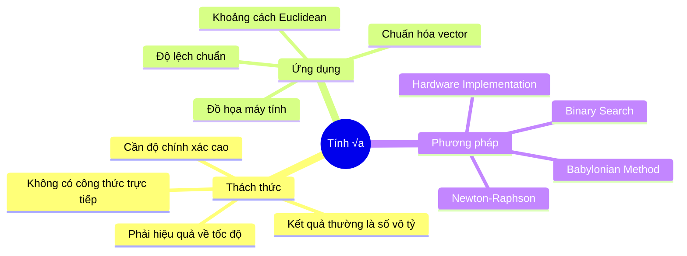
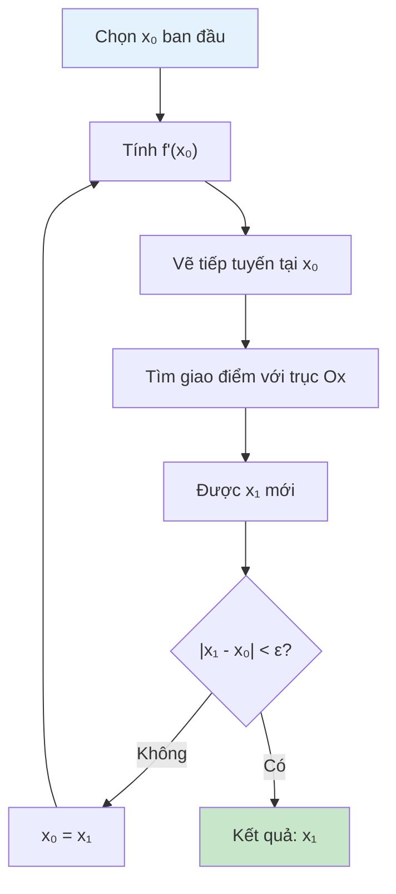

Khi máy tính cần tính √2 hoặc √17, nó không thể "nhìn" ra kết quả như con người. Thay vào đó, nó sử dụng các thuật toán thông minh để xấp xỉ dần đến đáp án đúng. Một trong những phương pháp hiệu quả nhất là **Phương pháp Newton** - một kỹ thuật toán học đẹp đẽ với tốc độ hội tụ cực nhanh.

Bài viết này sẽ đưa bạn từ việc hiểu nguyên lý hình học của phương pháp Newton đến cách cài đặt thuật toán thực tế, so sánh với các phương pháp khác, và khám phá những ứng dụng thú vị.

<!-- truncate -->

## Hiểu Về Bài Toán Căn Bậc Hai

### Định Nghĩa và Ý Nghĩa

**Căn bậc hai** của số dương $a$ là số $x$ sao cho $x^2 = a$.

$$\sqrt{a} = x \Leftrightarrow x^2 = a \text{ và } x \geq 0$$

### Tại Sao Cần Thuật Toán?



:::info Thực Tế Thú Vị
Trong CPU hiện đại, việc tính căn bậc hai được thực hiện bằng phần cứng chuyên dụng sử dụng thuật toán SRT (Sweeney, Robertson, Tocher) - một biến thể của phương pháp Newton!
:::

## Nguyên Lý Phương Pháp Newton

### Ý Tưởng Hình Học

Phương pháp Newton tìm nghiệm của phương trình $f(x) = 0$ bằng cách:

1. **Bắt đầu** với guess ban đầu $x_0$
2. **Vẽ tiếp tuyến** tại điểm $(x_0, f(x_0))$  
3. **Tìm giao điểm** của tiếp tuyến với trục Ox
4. **Lặp lại** với điểm mới



### Công Thức Toán Học

Công thức tổng quát của Newton:

$$x_{n+1} = x_n - \frac{f(x_n)}{f'(x_n)}$$

Để tìm căn bậc hai của $a$, ta giải: $f(x) = x^2 - a = 0$

- $f(x) = x^2 - a$
- $f'(x) = 2x$

Thay vào công thức:

$$x_{n+1} = x_n - \frac{x_n^2 - a}{2x_n} = \frac{x_n + \frac{a}{x_n}}{2}$$

:::tip Insight Toán Học
Công thức $x_{n+1} = \frac{x_n + \frac{a}{x_n}}{2}$ có nghĩa hình học đẹp đẽ: ta lấy **trung bình cộng** của $x_n$ và $\frac{a}{x_n}$. Một giá trị lớn hơn √a, một giá trị nhỏ hơn √a, và trung bình sẽ gần √a hơn!
:::

## Phân Tích Thuật Toán

### Tốc Độ Hội Tụ

Phương pháp Newton có **tốc độ hội tụ bậc 2** (quadratic convergence):

$$|x_{n+1} - \sqrt{a}| \approx C \cdot |x_n - \sqrt{a}|^2$$

Điều này có nghĩa số chữ số chính xác **gấp đôi** sau mỗi bước lặp!

### So Sánh Các Phương Pháp

| Phương pháp | Tốc độ hội tụ | Số phép tính/bước | Ưu điểm | Nhược điểm |
|-------------|---------------|-------------------|---------|------------|
| **Newton** | Bậc 2 | 1 chia, 1 cộng | Rất nhanh | Cần guess tốt |
| **Binary Search** | Tuyến tính | 1 nhân, 1 so sánh | Ổn định | Chậm hơn |
| **Babylonian** | Bậc 2 | Giống Newton | Đơn giản | Giống Newton |
| **Digit-by-digit** | Tuyến tính | Nhiều phép tính | Chính xác | Rất chậm |

## Cài Đặt Thuật Toán

### Phiên Bản C++ Cơ Bản

```cpp
#include <iostream>
#include <iomanip>
#include <cmath>
#include <vector>
#include <chrono>
using namespace std;

class NewtonSqrt {
private:
    double tolerance;
    int maxIterations;
    
public:
    NewtonSqrt(double tol = 1e-15, int maxIter = 100) 
        : tolerance(tol), maxIterations(maxIter) {}
    
    struct IterationInfo {
        int step;
        double x;
        double error;
        double improvement;
    };
    
    pair<double, vector<IterationInfo>> computeSqrtDetailed(double a) {
        if (a < 0) {
            throw invalid_argument("Khong the tinh can bac hai cua so am!");
        }
        
        if (a == 0) return {0.0, {}};
        
        cout << "Tinh can bac hai cua " << a << " bang phuong phap Newton:" << endl;
        
        // Chọn guess ban đầu thông minh
        double x = getInitialGuess(a);
        double actualSqrt = sqrt(a); // Để so sánh
        
        vector<IterationInfo> iterations;
        
        cout << "\nQua trinh lap:" << endl;
        cout << "Buoc | x_n            | Sai so        | Cai thien     | Ghi chu" << endl;
        cout << "-----|----------------|---------------|---------------|--------" << endl;
        
        for (int step = 0; step < maxIterations; step++) {
            double error = abs(x - actualSqrt);
            double prevX = x;
            
            // Newton iteration: x_{n+1} = (x_n + a/x_n) / 2
            double newX = 0.5 * (x + a / x);
            double improvement = abs(newX - x);
            
            // Lưu thông tin iteration
            iterations.push_back({step, x, error, improvement});
            
            // In thông tin
            cout << setw(4) << step << " | ";
            cout << setw(14) << fixed << setprecision(10) << x << " | ";
            cout << setw(13) << scientific << setprecision(3) << error << " | ";
            cout << setw(13) << scientific << setprecision(3) << improvement << " | ";
            
            if (step == 0) {
                cout << "Guess ban dau";
            } else if (improvement < tolerance) {
                cout << "Hoi tu!";
            } else {
                cout << "Tiep tuc";
            }
            cout << endl;
            
            // Kiểm tra hội tụ
            if (improvement < tolerance) {
                cout << "\nHoi tu sau " << step + 1 << " buoc!" << endl;
                cout << "Ket qua: " << fixed << setprecision(15) << newX << endl;
                cout << "Built-in sqrt(): " << fixed << setprecision(15) << actualSqrt << endl;
                cout << "Sai so cuoi: " << scientific << abs(newX - actualSqrt) << endl;
                
                return {newX, iterations};
            }
            
            x = newX;
        }
        
        cout << "Canh bao: Chua hoi tu sau " << maxIterations << " buoc!" << endl;
        return {x, iterations};
    }
    
    // Chọn guess ban đầu thông minh
    double getInitialGuess(double a) {
        if (a >= 1) {
            // Với a >= 1, bắt đầu với a/2
            return a / 2.0;
        } else {
            // Với a < 1, bắt đầu với (a + 1)/2
            return (a + 1.0) / 2.0;
        }
    }
    
    // Phiên bản tối ưu cho production
    double computeSqrtOptimized(double a) {
        if (a <= 0) return 0;
        
        double x = getInitialGuess(a);
        double prevX;
        
        do {
            prevX = x;
            x = 0.5 * (x + a / x);
        } while (abs(x - prevX) > tolerance);
        
        return x;
    }
    
    // So sánh với phương pháp khác
    void compareMethodsPerformance(double a) {
        cout << "\n=== SO SANH HIEU SUAT CAC PHUONG PHAP ===" << endl;
        cout << "Tinh can bac hai cua: " << a << endl;
        
        auto start = chrono::high_resolution_clock::now();
        
        // Newton Method
        start = chrono::high_resolution_clock::now();
        double newton_result = computeSqrtOptimized(a);
        auto newton_time = chrono::high_resolution_clock::now() - start;
        
        // Binary Search
        start = chrono::high_resolution_clock::now();
        double binary_result = binarySearchSqrt(a);
        auto binary_time = chrono::high_resolution_clock::now() - start;
        
        // Built-in sqrt
        start = chrono::high_resolution_clock::now();
        double builtin_result = sqrt(a);
        auto builtin_time = chrono::high_resolution_clock::now() - start;
        
        cout << "\nKet qua:" << endl;
        cout << "Newton:    " << fixed << setprecision(15) << newton_result;
        cout << " (Thoi gian: " << chrono::duration_cast<chrono::nanoseconds>(newton_time).count() << " ns)" << endl;
        
        cout << "Binary:    " << fixed << setprecision(15) << binary_result;
        cout << " (Thoi gian: " << chrono::duration_cast<chrono::nanoseconds>(binary_time).count() << " ns)" << endl;
        
        cout << "Built-in:  " << fixed << setprecision(15) << builtin_result;
        cout << " (Thoi gian: " << chrono::duration_cast<chrono::nanoseconds>(builtin_time).count() << " ns)" << endl;
        
        cout << "\nSai so so voi built-in:" << endl;
        cout << "Newton: " << scientific << abs(newton_result - builtin_result) << endl;
        cout << "Binary: " << scientific << abs(binary_result - builtin_result) << endl;
    }
    
    // Binary search cho so sánh
    double binarySearchSqrt(double a) {
        if (a == 0) return 0;
        
        double left = 0, right = max(1.0, a);
        
        while (right - left > tolerance) {
            double mid = (left + right) / 2.0;
            double square = mid * mid;
            
            if (square > a) {
                right = mid;
            } else {
                left = mid;
            }
        }
        
        return (left + right) / 2.0;
    }
    
    // Phân tích tốc độ hội tụ
    void analyzeConvergenceRate(double a) {
        cout << "\n=== PHAN TICH TOC DO HOI TU ===" << endl;
        
        auto [result, iterations] = computeSqrtDetailed(a);
        
        if (iterations.size() < 3) {
            cout << "Khong du du lieu de phan tich!" << endl;
            return;
        }
        
        cout << "\nTy le hoi tu giua cac buoc:" << endl;
        cout << "Buoc | Ty le error_{n+1}/error_n^2" << endl;
        cout << "-----|---------------------------" << endl;
        
        for (size_t i = 1; i < iterations.size() - 1; i++) {
            double error_n = iterations[i].error;
            double error_n1 = iterations[i + 1].error;
            
            if (error_n > 1e-14) {  // Tránh chia cho 0
                double ratio = error_n1 / (error_n * error_n);
                cout << setw(4) << i << " | " << setw(25) << fixed << setprecision(6) << ratio << endl;
            }
        }
        
        cout << "\nNeu ty le gan mot hang so, phuong phap co hoi tu bac 2!" << endl;
    }
};

// Hàm tiện ích cho testing
void testSpecialCases() {
    NewtonSqrt solver;
    
    cout << "\n=== TEST CAC TRUONG HOP DAC BIET ===" << endl;
    
    vector<double> testCases = {0.0, 1.0, 0.25, 4.0, 2.0, 10.0, 100.0, 0.001, 1000000.0};
    
    cout << "Gia tri | Newton Result   | Built-in sqrt() | Sai so" << endl;
    cout << "--------|-----------------|-----------------|--------" << endl;
    
    for (double a : testCases) {
        try {
            double newton_result = solver.computeSqrtOptimized(a);
            double builtin_result = sqrt(a);
            double error = abs(newton_result - builtin_result);
            
            cout << setw(7) << a << " | ";
            cout << setw(15) << fixed << setprecision(10) << newton_result << " | ";
            cout << setw(15) << fixed << setprecision(10) << builtin_result << " | ";
            cout << setw(8) << scientific << setprecision(2) << error << endl;
            
        } catch (const exception& e) {
            cout << setw(7) << a << " | ERROR: " << e.what() << endl;
        }
    }
}

int main() {
    NewtonSqrt solver(1e-15, 50);
    
    cout << "=== THUAT TOAN TIM CAN BAC HAI BANG PHUONG PHAP NEWTON ===" << endl;
    
    double number;
    cout << "Nhap so can tinh can bac hai: ";
    cin >> number;
    
    try {
        // Phân tích chi tiết
        auto [result, iterations] = solver.computeSqrtDetailed(number);
        
        // Phân tích tốc độ hội tụ
        solver.analyzeConvergenceRate(number);
        
        // So sánh hiệu suất
        solver.compareMethodsPerformance(number);
        
    } catch (const exception& e) {
        cout << "Loi: " << e.what() << endl;
    }
    
    // Test các trường hợp đặc biệt
    testSpecialCases();
    
    return 0;
}
```

### Phiên Bản Python Với Visualization

```python
import numpy as np
import matplotlib.pyplot as plt
import time
from typing import List, Tuple, Dict
import math

class NewtonSqrtAnalyzer:
    def __init__(self, tolerance: float = 1e-15, max_iterations: int = 100):
        self.tolerance = tolerance
        self.max_iterations = max_iterations
        
    def compute_sqrt_with_history(self, a: float, initial_guess: float = None) -> Tuple[float, List[Dict]]:
        """
        Tính căn bậc hai với lưu lại lịch sử iterations
        """
        if a < 0:
            raise ValueError("Không thể tính căn bậc hai của số âm!")
        
        if a == 0:
            return 0.0, []
        
        # Chọn initial guess thông minh
        x = initial_guess if initial_guess else self._get_initial_guess(a)
        actual_sqrt = math.sqrt(a)
        
        history = []
        
        print(f"Tính √{a} bằng phương pháp Newton:")
        print("Bước | x_n            | Sai số        | Cải thiện    | f(x_n)")
        print("-----|----------------|---------------|--------------|--------")
        
        for step in range(self.max_iterations):
            error = abs(x - actual_sqrt)
            f_x = x * x - a  # f(x) = x² - a
            
            # Newton iteration
            new_x = 0.5 * (x + a / x)
            improvement = abs(new_x - x)
            
            # Lưu thông tin
            iteration_info = {
                'step': step,
                'x': x,
                'error': error,
                'improvement': improvement,
                'f_x': f_x,
                'derivative': 2 * x
            }
            history.append(iteration_info)
            
            # In thông tin
            print(f"{step:4d} | {x:14.10f} | {error:13.2e} | {improvement:12.2e} | {f_x:8.2e}")
            
            # Kiểm tra hội tụ
            if improvement < self.tolerance:
                print(f"\n✓ Hội tụ sau {step + 1} bước!")
                print(f"Kết quả: {new_x:.15f}")
                print(f"Chính xác: {actual_sqrt:.15f}")
                print(f"Sai số cuối: {abs(new_x - actual_sqrt):.2e}")
                return new_x, history
            
            x = new_x
        
        print(f"⚠ Chưa hội tụ sau {self.max_iterations} bước!")
        return x, history
    
    def _get_initial_guess(self, a: float) -> float:
        """Chọn initial guess thông minh"""
        if a >= 1:
            return a / 2.0
        else:
            return (a + 1.0) / 2.0
    
    def visualize_convergence(self, a: float, save_plot: bool = False):
        """
        Visualize quá trình hội tụ
        """
        result, history = self.compute_sqrt_with_history(a)
        
        if not history:
            print("Không có dữ liệu để vẽ!")
            return
        
        steps = [h['step'] for h in history]
        x_values = [h['x'] for h in history]
        errors = [h['error'] for h in history]
        
        fig, (ax1, ax2, ax3) = plt.subplots(1, 3, figsize=(15, 5))
        
        # Plot 1: Convergence của x_n
        ax1.plot(steps, x_values, 'bo-', label='x_n')
        ax1.axhline(y=math.sqrt(a), color='r', linestyle='--', label=f'√{a} = {math.sqrt(a):.6f}')
        ax1.set_xlabel('Bước lặp')
        ax1.set_ylabel('Giá trị x_n')
        ax1.set_title(f'Hội tụ của x_n đến √{a}')
        ax1.legend()
        ax1.grid(True, alpha=0.3)
        
        # Plot 2: Error trên thang log
        ax2.semilogy(steps, errors, 'ro-', label='|x_n - √a|')
        ax2.set_xlabel('Bước lặp')
        ax2.set_ylabel('Sai số (log scale)')
        ax2.set_title('Giảm sai số theo thời gian')
        ax2.legend()
        ax2.grid(True, alpha=0.3)
        
        # Plot 3: Newton's method visualization
        x_range = np.linspace(0.5 * math.sqrt(a), 2 * math.sqrt(a), 1000)
        y_range = x_range**2 - a
        
        ax3.plot(x_range, y_range, 'b-', label=f'f(x) = x² - {a}')
        ax3.axhline(y=0, color='k', linestyle='-', alpha=0.3)
        ax3.axvline(x=math.sqrt(a), color='r', linestyle='--', label=f'√{a}')
        
        # Vẽ các bước Newton
        for i in range(min(5, len(history))):
            x_i = history[i]['x']
            y_i = x_i**2 - a
            slope = 2 * x_i
            
            # Vẽ điểm
            ax3.plot(x_i, y_i, 'ro', markersize=6)
            
            # Vẽ tiếp tuyến
            x_tangent = np.array([x_i - y_i/slope, x_i + 0.2])
            y_tangent = slope * (x_tangent - x_i) + y_i
            ax3.plot(x_tangent, y_tangent, 'g--', alpha=0.7)
            
            # Vẽ đường dọc xuống trục x
            if i < len(history) - 1:
                next_x = history[i+1]['x']
                ax3.plot([next_x, next_x], [0, -0.1], 'g-', alpha=0.7)
        
        ax3.set_xlabel('x')
        ax3.set_ylabel('f(x)')
        ax3.set_title('Minh họa phương pháp Newton')
        ax3.legend()
        ax3.grid(True, alpha=0.3)
        
        plt.tight_layout()
        
        if save_plot:
            plt.savefig(f'newton_sqrt_{a}.png', dpi=300, bbox_inches='tight')
        
        plt.show()
    
    def analyze_convergence_rate(self, a: float):
        """
        Phân tích tốc độ hội tụ (quadratic convergence)
        """
        result, history = self.compute_sqrt_with_history(a)
        
        if len(history) < 3:
            print("Không đủ dữ liệu để phân tích!")
            return
        
        print("\n=== PHÂN TÍCH TỐC ĐỘ HỘI TỤ ===")
        print("Bước | Error_n      | Error_{n+1}  | Ratio = E_{n+1}/E_n²")
        print("-----|--------------|--------------|---------------------")
        
        convergence_ratios = []
        
        for i in range(len(history) - 1):
            error_n = history[i]['error']
            error_n1 = history[i + 1]['error']
            
            if error_n > 1e-14:  # Tránh chia cho số quá nhỏ
                ratio = error_n1 / (error_n ** 2)
                convergence_ratios.append(ratio)
                
                print(f"{i:4d} | {error_n:12.2e} | {error_n1:12.2e} | {ratio:19.6f}")
        
        if convergence_ratios:
            avg_ratio = np.mean(convergence_ratios[1:])  # Bỏ bước đầu
            print(f"\nTỷ lệ hội tụ trung bình: {avg_ratio:.6f}")
            print("Nếu tỷ lệ này gần hằng số → Hội tụ bậc 2 (quadratic)")
    
    def compare_initial_guesses(self, a: float, guesses: List[float]):
        """
        So sánh ảnh hưởng của initial guess khác nhau
        """
        print(f"\n=== SO SÁNH INITIAL GUESS CHO √{a} ===")
        print("Guess ban đầu | Số bước | Kết quả cuối    | Thời gian (µs)")
        print("--------------|---------|-----------------|---------------")
        
        results = []
        
        for guess in guesses:
            try:
                start_time = time.perf_counter()
                result, history = self.compute_sqrt_with_history(a, guess)
                end_time = time.perf_counter()
                
                execution_time = (end_time - start_time) * 1e6  # Convert to microseconds
                num_steps = len(history)
                
                print(f"{guess:13.6f} | {num_steps:7d} | {result:15.10f} | {execution_time:13.2f}")
                
                results.append({
                    'guess': guess,
                    'steps': num_steps,
                    'result': result,
                    'time': execution_time
                })
                
            except Exception as e:
                print(f"{guess:13.6f} | ERROR   | {str(e)[:15]:15} | {'':13}")
        
        # Tìm guess tốt nhất
        if results:
            best_guess = min(results, key=lambda x: x['steps'])
            print(f"\n✓ Guess tốt nhất: {best_guess['guess']:.6f} ({best_guess['steps']} bước)")
    
    def benchmark_methods(self, test_values: List[float]):
        """
        Benchmark so sánh với các phương pháp khác
        """
        print("\n=== BENCHMARK CÁC PHƯƠNG PHÁP ===")
        
        methods = {
            'Newton': self._newton_method,
            'Binary Search': self._binary_search_method,
            'Babylonian': self._babylonian_method,
            'Built-in': math.sqrt
        }
        
        for a in test_values:
            print(f"\nTính √{a}:")
            print("Phương pháp   | Kết quả         | Thời gian (µs) | Sai số")
            print("--------------|-----------------|----------------|--------")
            
            builtin_result = math.sqrt(a)
            
            for name, method in methods.items():
                try:
                    start_time = time.perf_counter()
                    
                    if name == 'Built-in':
                        result = method(a)
                    else:
                        result = method(a)
                    
                    end_time = time.perf_counter()
                    execution_time = (end_time - start_time) * 1e6
                    
                    error = abs(result - builtin_result)
                    
                    print(f"{name:13} | {result:15.10f} | {execution_time:14.2f} | {error:.2e}")
                    
                except Exception as e:
                    print(f"{name:13} | ERROR           | {'':14} | {str(e)[:8]}")
    
    def _newton_method(self, a: float) -> float:
        """Newton method implementation for benchmarking"""
        if a <= 0:
            return 0
        
        x = self._get_initial_guess(a)
        for _ in range(self.max_iterations):
            new_x = 0.5 * (x + a / x)
            if abs(new_x - x) < self.tolerance:
                return new_x
            x = new_x
        return x
    
    def _binary_search_method(self, a: float) -> float:
        """Binary search implementation"""
        if a == 0:
            return 0
        
        left, right = 0, max(1, a)
        
        while right - left > self.tolerance:
            mid = (left + right) / 2
            if mid * mid > a:
                right = mid
            else:
                left = mid
        
        return (left + right) / 2
    
    def _babylonian_method(self, a: float) -> float:
        """Babylonian method (same as Newton for sqrt)"""
        return self._newton_method(a)

# Interactive functions
def interactive_demo():
    """
    Demo tương tác
    """
    analyzer = NewtonSqrtAnalyzer()
    
    print("🔢 DEMO TƯƠNG TÁC - PHƯƠNG PHÁP NEWTON")
    print("=" * 50)
    
    while True:
        try:
            print("\nTùy chọn:")
            print("1. Tính căn bậc hai với visualization")
            print("2. Phân tích tốc độ hội tụ")
            print("3. So sánh initial guesses")
            print("4. Benchmark các phương pháp")
            print("5. Thoát")
            
            choice = input("\nChọn (1-5): ").strip()
            
            if choice == '5':
                break
            
            if choice == '1':
                a = float(input("Nhập số cần tính căn: "))
                analyzer.visualize_convergence(a)
                
            elif choice == '2':
                a = float(input("Nhập số cần phân tích: "))
                analyzer.analyze_convergence_rate(a)
                
            elif choice == '3':
                a = float(input("Nhập số cần tính căn: "))
                guesses = [0.1, 0.5, 1.0, a/4, a/2, a, 2*a]
                analyzer.compare_initial_guesses(a, guesses)
                
            elif choice == '4':
                test_vals = [0.25, 1.0, 2.0, 10.0, 100.0]
                analyzer.benchmark_methods(test_vals)
                
            else:
                print("Lựa chọn không hợp lệ!")
                
        except KeyboardInterrupt:
            break
        except ValueError as e:
            print(f"Lỗi input: {e}")
        except Exception as e:
            print(f"Lỗi: {e}")
    
    print("Cảm ơn bạn đã sử dụng demo!")

def explore_convergence_properties():
    """
    Khám phá các tính chất hội tụ
    """
    analyzer = NewtonSqrtAnalyzer()
    
    print("🔍 KHÁM PHÁ TÍNH CHẤT HỘI TỤ")
    print("=" * 40)
    
    # Test với các giá trị đặc biệt
    special_values = [0.001, 0.1, 0.5, 1.0, 2.0, 10.0, 100.0, 1000.0]
    
    print("Số bước hội tụ theo giá trị input:")
    print("Giá trị | Số bước | Ghi chú")
    print("--------|---------|--------")
    
    for a in special_values:
        result, history = analyzer.compute_sqrt_with_history(a)
        steps = len(history)
        
        note = ""
        if a < 1:
            note = "Nhỏ hơn 1"
        elif a == 1:
            note = "Bằng 1"
        elif a > 100:
            note = "Lớn"
        else:
            note = "Trung bình"
        
        print(f"{a:7.3f} | {steps:7d} | {note}")

if __name__ == "__main__":
    # Chạy demo tương tác
    interactive_demo()
    
    # Khám phá tính chất
    explore_convergence_properties()
```

### Phiên Bản Java với Precision Cao

```java
import java.math.BigDecimal;
import java.math.MathContext;
import java.math.RoundingMode;
import java.util.*;

public class HighPrecisionNewtonSqrt {
    
    private final int precision;
    private final MathContext mathContext;
    private final BigDecimal tolerance;
    private final int maxIterations;
    
    public HighPrecisionNewtonSqrt(int precision, int maxIterations) {
        this.precision = precision;
        this.mathContext = new MathContext(precision, RoundingMode.HALF_UP);
        this.tolerance = new BigDecimal("1E-" + (precision - 5));
        this.maxIterations = maxIterations;
    }
    
    public static class IterationResult {
        public final BigDecimal result;
        public final List<IterationInfo> history;
        public final boolean converged;
        public final int steps;
        
        public IterationResult(BigDecimal result, List<IterationInfo> history, 
                             boolean converged, int steps) {
            this.result = result;
            this.history = new ArrayList<>(history);
            this.converged = converged;
            this.steps = steps;
        }
    }
    
    public static class IterationInfo {
        public final int step;
        public final BigDecimal x;
        public final BigDecimal improvement;
        public final BigDecimal functionValue;
        
        public IterationInfo(int step, BigDecimal x, BigDecimal improvement, BigDecimal functionValue) {
            this.step = step;
            this.x = x;
            this.improvement = improvement;
            this.functionValue = functionValue;
        }
    }
    
    /**
     * Tính căn bậc hai với độ chính xác cao
     */
    public IterationResult computeHighPrecisionSqrt(String numberStr) {
        BigDecimal a = new BigDecimal(numberStr, mathContext);
        
        if (a.compareTo(BigDecimal.ZERO) < 0) {
            throw new IllegalArgumentException("Không thể tính căn bậc hai của số âm!");
        }
        
        if (a.equals(BigDecimal.ZERO)) {
            return new IterationResult(BigDecimal.ZERO, new ArrayList<>(), true, 0);
        }
        
        System.out.println("Tính căn bậc hai độ chính xác cao của: " + a);
        System.out.println("Độ chính xác: " + precision + " chữ số");
        System.out.println("Tolerance: " + tolerance);
        
        // Initial guess thông minh
        BigDecimal x = getSmartInitialGuess(a);
        List<IterationInfo> history = new ArrayList<>();
        
        System.out.println("\nQuá trình Newton iterations:");
        System.out.println("Bước | x_n (20 ký tự đầu)  | Cải thiện      | f(x_n)");
        System.out.println("-----|-------------------|----------------|--------");
        
        for (int step = 0; step < maxIterations; step++) {
            // Tính f(x) = x² - a
            BigDecimal functionValue = x.multiply(x, mathContext).subtract(a, mathContext);
            
            // Newton iteration: x_{n+1} = (x_n + a/x_n) / 2
            BigDecimal quotient = a.divide(x, mathContext);
            BigDecimal newX = x.add(quotient, mathContext)
                               .divide(new BigDecimal("2"), mathContext);
            
            BigDecimal improvement = newX.subtract(x).abs();
            
            // Lưu iteration info
            history.add(new IterationInfo(step, x, improvement, functionValue));
            
            // In thông tin (giới hạn độ dài hiển thị)
            String xStr = x.toPlainString();
            String displayX = xStr.length() > 20 ? xStr.substring(0, 20) + "..." : xStr;
            
            System.out.printf("%4d | %21s | %14.2e | %8.2e%n", 
                            step, displayX, improvement.doubleValue(), 
                            functionValue.doubleValue());
            
            // Kiểm tra hội tụ
            if (improvement.compareTo(tolerance) < 0) {
                System.out.println("\n✓ Hội tụ sau " + (step + 1) + " bước!");
                System.out.println("Kết quả cuối cùng:");
                System.out.println(newX.toPlainString());
                
                return new IterationResult(newX, history, true, step + 1);
            }
            
            x = newX;
        }
        
        System.out.println("⚠ Chưa hội tụ sau " + maxIterations + " bước!");
        return new IterationResult(x, history, false, maxIterations);
    }
    
    private BigDecimal getSmartInitialGuess(BigDecimal a) {
        BigDecimal one = BigDecimal.ONE;
        BigDecimal two = new BigDecimal("2");
        
        if (a.compareTo(one) >= 0) {
            // Với a >= 1, bắt đầu với a/2
            return a.divide(two, mathContext);
        } else {
            // Với a < 1, bắt đầu với (a + 1)/2
            return a.add(one, mathContext).divide(two, mathContext);
        }
    }
    
    /**
     * So sánh với Java's Math.sqrt() (double precision)
     */
    public void compareWithBuiltIn(String numberStr) {
        System.out.println("\n=== SO SÁNH VỚI BUILT-IN SQRT ===");
        
        double a_double = Double.parseDouble(numberStr);
        double builtin_result = Math.sqrt(a_double);
        
        IterationResult our_result = computeHighPrecisionSqrt(numberStr);
        
        System.out.println("Built-in Math.sqrt(): " + builtin_result);
        System.out.println("Newton high-precision: " + our_result.result.toPlainString());
        
        // So sánh trong phạm vi double precision
        BigDecimal builtin_bd = new BigDecimal(Double.toString(builtin_result));
        BigDecimal difference = our_result.result.subtract(builtin_bd).abs();
        
        System.out.println("Sự khác biệt: " + difference.toPlainString());
        System.out.println("Số bước Newton: " + our_result.steps);
    }
    
    /**
     * Benchmark hiệu suất với các độ chính xác khác nhau
     */
    public static void benchmarkPrecisions() {
        System.out.println("\n=== BENCHMARK CÁC ĐỘ CHÍNH XÁC ===");
        
        String testNumber = "2";
        int[] precisions = {10, 20, 50, 100, 200, 500};
        
        System.out.println("Tính √2 với các độ chính xác khác nhau:");
        System.out.println("Precision | Số bước | Thời gian (ms) | Kết quả (30 ký tự đầu)");
        System.out.println("----------|---------|----------------|------------------------");
        
        for (int prec : precisions) {
            HighPrecisionNewtonSqrt calculator = new HighPrecisionNewtonSqrt(prec, 1000);
            
            long startTime = System.nanoTime();
            IterationResult result = calculator.computeHighPrecisionSqrt(testNumber);
            long endTime = System.nanoTime();
            
            double executionTime = (endTime - startTime) / 1_000_000.0; // Convert to ms
            
            String resultStr = result.result.toPlainString();
            String displayResult = resultStr.length() > 30 ? 
                                 resultStr.substring(0, 30) + "..." : resultStr;
            
            System.out.printf("%9d | %7d | %14.2f | %s%n", 
                            prec, result.steps, executionTime, displayResult);
        }
    }
    
    /**
     * Tính căn bậc hai của số irrational nổi tiếng
     */
    public void computeFamousIrrationals() {
        System.out.println("\n=== CÁC SỐ VÔ TỶ NỔI TIẾNG ===");
        
        Map<String, String> famousNumbers = new LinkedHashMap<>();
        famousNumbers.put("√2", "2");
        famousNumbers.put("√3", "3");
        famousNumbers.put("√5", "5");
        famousNumbers.put("√7", "7");
        famousNumbers.put("√10", "10");
        famousNumbers.put("√π", "3.14159265358979323846264338327950288419716939937510");
        famousNumbers.put("√e", "2.71828182845904523536028747135266249775724709369995");
        
        for (Map.Entry<String, String> entry : famousNumbers.entrySet()) {
            System.out.println("\n--- " + entry.getKey() + " ---");
            
            try {
                IterationResult result = computeHighPrecisionSqrt(entry.getValue());
                
                String resultStr = result.result.toPlainString();
                if (resultStr.length() > 50) {
                    System.out.println("Kết quả (50 chữ số đầu): " + resultStr.substring(0, 50) + "...");
                } else {
                    System.out.println("Kết quả: " + resultStr);
                }
                
                System.out.println("Số bước: " + result.steps);
                System.out.println("Hội tụ: " + (result.converged ? "✓" : "✗"));
                
            } catch (Exception e) {
                System.out.println("Lỗi: " + e.getMessage());
            }
        }
    }
    
    /**
     * Interactive mode
     */
    public void interactiveMode() {
        Scanner scanner = new Scanner(System.in);
        
        System.out.println("🔢 CHẾ ĐỘ TƯƠNG TÁC - NEWTON HIGH PRECISION SQRT");
        System.out.println("===============================================");
        
        while (true) {
            try {
                System.out.print("\nNhập số cần tính căn (hoặc 'quit' để thoát): ");
                String input = scanner.nextLine().trim();
                
                if (input.equalsIgnoreCase("quit") || input.equalsIgnoreCase("q")) {
                    break;
                }
                
                // Validate input
                new BigDecimal(input); // Test if valid number
                
                System.out.print("Độ chính xác mong muốn (default=50): ");
                String precisionStr = scanner.nextLine().trim();
                int targetPrecision = precisionStr.isEmpty() ? 50 : Integer.parseInt(precisionStr);
                
                // Create new calculator with target precision
                HighPrecisionNewtonSqrt calc = new HighPrecisionNewtonSqrt(targetPrecision, 1000);
                
                long startTime = System.nanoTime();
                IterationResult result = calc.computeHighPrecisionSqrt(input);
                long endTime = System.nanoTime();
                
                double executionTime = (endTime - startTime) / 1_000_000.0;
                
                System.out.println("\n=== KẾT QUẢ ===");
                System.out.println("Hội tụ: " + (result.converged ? "✓" : "✗"));
                System.out.println("Số bước: " + result.steps);
                System.out.println("Thời gian: " + String.format("%.2f ms", executionTime));
                System.out.println("Kết quả:");
                System.out.println(result.result.toPlainString());
                
                // Tùy chọn so sánh với built-in
                System.out.print("\nSo sánh với Math.sqrt()? (y/n): ");
                String compare = scanner.nextLine().trim();
                if (compare.equalsIgnoreCase("y")) {
                    calc.compareWithBuiltIn(input);
                }
                
            } catch (NumberFormatException e) {
                System.out.println("Lỗi: Vui lòng nhập số hợp lệ!");
            } catch (Exception e) {
                System.out.println("Lỗi: " + e.getMessage());
            }
        }
        
        scanner.close();
        System.out.println("Cảm ơn bạn đã sử dụng chương trình!");
    }
    
    public static void main(String[] args) {
        System.out.println("🧮 HIGH PRECISION NEWTON SQUARE ROOT CALCULATOR");
        System.out.println("==============================================");
        
        // Demo với precision 100 chữ số
        HighPrecisionNewtonSqrt calculator = new HighPrecisionNewtonSqrt(100, 100);
        
        // Tính các số nổi tiếng
        calculator.computeFamousIrrationals();
        
        // Benchmark
        benchmarkPrecisions();
        
        // Interactive mode
        calculator.interactiveMode();
    }
}
```

## Phân Tích Toán Học Sâu

### Proof of Quadratic Convergence

**Định lý**: Phương pháp Newton cho $f(x) = x^2 - a$ có tốc độ hội tụ bậc 2.

**Chứng minh**:
Gọi $r = \sqrt{a}$ là nghiệm chính xác, $e_n = x_n - r$ là sai số.

$$x_{n+1} = \frac{x_n + \frac{a}{x_n}}{2}$$

$$e_{n+1} = x_{n+1} - r = \frac{x_n + \frac{a}{x_n}}{2} - r$$

$$= \frac{x_n + \frac{r^2}{x_n} - 2r}{2} = \frac{x_n - r}{2} - \frac{r^2(x_n - r)}{2x_n}$$

$$= \frac{e_n}{2} - \frac{r^2 e_n}{2x_n} = \frac{e_n}{2}\left(1 - \frac{r^2}{x_n}\right)$$

Khi $x_n \to r$, ta có:

$$e_{n+1} \approx \frac{e_n^2}{2r}$$

Điều này chứng minh tốc độ hội tụ bậc 2! 🎯

### Điều Kiện Hội Tụ

:::warning Quan Trọng
Phương pháp Newton chỉ hội tụ nếu:
1. **Initial guess đủ gần nghiệm**
2. **Hàm khả vi liên tục**  
3. **Đạo hàm khác 0 tại nghiệm**

Với $f(x) = x^2 - a$, điều kiện luôn thỏa mãn với $x_0 > 0$.
:::

## Ứng Dụng Thực Tế

### 1. Computer Graphics

```cpp
// Fast inverse square root (Quake algorithm inspiration)
class FastMath {
public:
    static float fastInverseSqrt(float x) {
        // Newton iteration cho 1/√x
        float half = 0.5f * x;
        int i = *(int*)&x;
        i = 0x5f3759df - (i >> 1);  // Magic number
        x = *(float*)&i;
        
        // Newton iterations
        x = x * (1.5f - half * x * x);
        x = x * (1.5f - half * x * x);
        
        return x;
    }
};
```

### 2. Machine Learning

```python
def gradient_descent_with_newton_sqrt():
    """
    Sử dụng Newton sqrt trong normalization
    """
    def normalize_vector(v):
        # Tính norm bằng Newton method
        norm_squared = sum(x*x for x in v)
        norm = newton_sqrt(norm_squared)
        return [x/norm for x in v]
    
    return normalize_vector
```

### 3. Signal Processing

```java
public class SignalProcessor {
    public static double[] computeRMSWithNewton(double[] signal) {
        NewtonSqrt calculator = new NewtonSqrt();
        double[] rms = new double[signal.length];
        
        for (int i = 0; i < signal.length; i++) {
            double sumSquares = 0;
            for (int j = 0; j <= i; j++) {
                sumSquares += signal[j] * signal[j];
            }
            rms[i] = calculator.computeSqrt(sumSquares / (i + 1));
        }
        
        return rms;
    }
}
```

## Bài Tập Thực Hành

### Bài Tập Cơ Bản

1. **Cài đặt Newton sqrt** với tolerance 1e-10
2. **So sánh initial guesses** khác nhau
3. **Tính √2 với 50 chữ số** chính xác

### Bài Tập Nâng Cao

1. **Generalized Newton**: Tính căn bậc n
2. **Complex square root**: Mở rộng cho số phức
3. **Parallel Newton**: Tính nhiều căn đồng thời

### Dự Án Thực Tế

```python
# Project: Mathematical Function Library
class AdvancedMath:
    def __init__(self):
        self.newton_solver = NewtonSqrtAnalyzer()
    
    def sqrt(self, x, precision=15):
        return self.newton_solver.compute_sqrt(x, precision)
    
    def cbrt(self, x, precision=15):
        # Cube root using Newton
        pass
    
    def nth_root(self, x, n, precision=15):
        # General nth root
        pass
```

## Tối Ưu Hóa và Tricks

### 1. Fast Initial Guess

```cpp
double smartGuess(double a) {
    // Sử dụng bit manipulation cho guess nhanh
    if (a >= 1) {
        return a / 2;
    } else if (a >= 0.25) {
        return 0.5;
    } else {
        return 1.0;
    }
}
```

### 2. Early Termination

```python
def optimized_newton_sqrt(a, tolerance=1e-15):
    x = smart_initial_guess(a)
    
    for i in range(50):  # Max iterations
        new_x = 0.5 * (x + a / x)
        
        # Relative tolerance cho số lớn
        if abs(new_x - x) < tolerance * max(1, x):
            return new_x
        
        x = new_x
    
    return x
```

### 3. Vectorized Newton

```python
import numpy as np

def vectorized_newton_sqrt(arr, tolerance=1e-15):
    """Tính căn của nhiều số cùng lúc"""
    x = np.where(arr >= 1, arr / 2, (arr + 1) / 2)
    
    for _ in range(50):
        new_x = 0.5 * (x + arr / x)
        
        if np.all(np.abs(new_x - x) < tolerance):
            break
            
        x = new_x
    
    return x
```

## Tổng Kết

Phương pháp Newton cho căn bậc hai là một ví dụ tuyệt vời về sức mạnh của toán học trong lập trình:

🎯 **Những điểm chính**:
- **Tốc độ hội tụ bậc 2**: Cực kỳ nhanh
- **Đơn giản cài đặt**: Chỉ cần một công thức
- **Ổn định**: Luôn hội tụ với initial guess dương
- **Ứng dụng rộng**: Từ graphics đến machine learning

💡 **Insights quan trọng**:
- Initial guess ảnh hưởng số bước, không ảnh hưởng kết quả cuối
- Quadratic convergence làm số chữ số chính xác tăng gấp đôi mỗi bước
- Phương pháp này là nền tảng cho nhiều thuật toán số học khác

🔧 **Best practices**:
- Chọn tolerance phù hợp với ứng dụng
- Xử lý edge cases (0, số âm)
- Optimize cho performance khi cần
- Kết hợp với hardware acceleration

:::note Lời Khuyên Cuối
Phương pháp Newton không chỉ giải quyết bài toán căn bậc hai mà còn là cửa ngõ để hiểu về numerical methods nói chung. Hãy thử implement và thử nghiệm với các tham số khác nhau để cảm nhận sức mạnh của thuật toán này!
:::

Bắt đầu với implementation đơn giản, sau đó dần dần tối ưu hóa và mở rộng cho các bài toán phức tạp hơn!