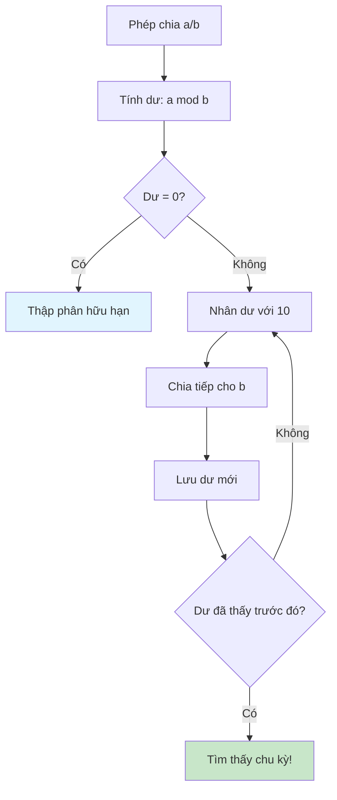
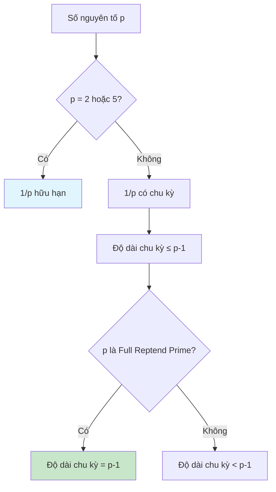

Khi chia 1 cho 3, ta được 0.333... với chữ số 3 lặp lại mãi mãi. Nhưng khi chia 1 cho 7, ta được 0.142857142857... với chu kỳ 142857 dài 6 chữ số. Làm thế nào để máy tính có thể phát hiện ra những pattern lặp lại này một cách tự động?

Bài viết này sẽ hướng dẫn bạn hiểu về số thập phân vô hạn, cách tìm chu kỳ lặp lại, và những ứng dụng thú vị trong toán học và lập trình.

<!-- truncate -->

## Hiểu Về Số Thập Phân Vô Hạn

### Định Nghĩa và Phân Loại

**Số thập phân vô hạn** là số thập phân có vô số chữ số sau dấu phẩy. Chúng được chia thành hai loại:

1. **Số vô tỷ** (irrational): Không có pattern lặp lại
   - π = 3.1415926535897932384626433832795...
   - e = 2.7182818284590452353602874713527...
   - √2 = 1.4142135623730950488016887242097...

2. **Số hữu tỷ** (rational): Có chu kỳ lặp lại
   - 1/3 = 0.333... (chu kỳ: 3)
   - 1/7 = 0.142857142857... (chu kỳ: 142857)
   - 22/7 = 3.142857142857... (chu kỳ: 142857)

### Nguyên Lý Toán Học

:::info Định Lý Cơ Bản
Mọi phân số a/b (với b ≠ 0) đều có thể biểu diễn dưới dạng số thập phân có chu kỳ. Độ dài chu kỳ tối đa là b-1.
:::

**Tại sao có chu kỳ?**



## Thuật Toán Tìm Chu Kỳ

### Phương Pháp Cơ Bản

**Ý tưởng**: Thực hiện phép chia dài và lưu lại các số dư. Khi gặp lại số dư đã xuất hiện, ta tìm được chu kỳ.

### Các Bước Thực Hiện

1. **Khởi tạo**: Tính phần nguyên và phần dư ban đầu
2. **Lặp**: Nhân dư với 10, chia cho mẫu số
3. **Kiểm tra**: Dư có xuất hiện trước đó không?
4. **Kết luận**: Tìm vị trí bắt đầu và độ dài chu kỳ

## Cài Đặt Thuật Toán

### Phiên Bản C++ Cơ Bản

```cpp
#include <iostream>
#include <vector>
#include <unordered_map>
#include <string>
#include <iomanip>
using namespace std;

struct DecimalResult {
    string integerPart;
    string nonRepeatingPart;
    string repeatingPart;
    int periodLength;
    bool isTerminating;
};

class DecimalAnalyzer {
private:
    int maxDigits;
    
public:
    DecimalAnalyzer(int maxDigits = 10000) : maxDigits(maxDigits) {}
    
    DecimalResult analyzeDecimal(int numerator, int denominator) {
        if (denominator == 0) {
            throw invalid_argument("Mau so khong the bang 0!");
        }
        
        cout << "Phan tich phan so " << numerator << "/" << denominator << ":" << endl;
        
        // Xử lý dấu
        bool isNegative = (numerator < 0) ^ (denominator < 0);
        numerator = abs(numerator);
        denominator = abs(denominator);
        
        // Tính phần nguyên
        int integerPart = numerator / denominator;
        int remainder = numerator % denominator;
        
        string result;
        if (isNegative && (integerPart != 0 || remainder != 0)) {
            result += "-";
        }
        result += to_string(integerPart) + ".";
        
        // Nếu chia hết
        if (remainder == 0) {
            cout << "So thap phan huu han: " << result << "0" << endl;
            return {to_string(integerPart), "0", "", 0, true};
        }
        
        // Tìm chu kỳ
        unordered_map<int, int> remainderPositions;
        string decimalPart = "";
        int position = 0;
        
        cout << "\nQua trinh chia dai:" << endl;
        cout << "Buoc | Du  | Chu so | Vi tri du" << endl;
        cout << "-----|-----|--------|----------" << endl;
        
        while (remainder != 0 && position < maxDigits) {
            // Kiểm tra xem dư đã xuất hiện chưa
            if (remainderPositions.find(remainder) != remainderPositions.end()) {
                // Tìm thấy chu kỳ
                int cycleStart = remainderPositions[remainder];
                int cycleLength = position - cycleStart;
                
                string nonRepeating = decimalPart.substr(0, cycleStart);
                string repeating = decimalPart.substr(cycleStart, cycleLength);
                
                cout << setw(4) << position + 1 << " | ";
                cout << setw(3) << remainder << " | ";
                cout << "    - | Da thay (chu ky bat dau)" << endl;
                
                cout << "\nKet qua:" << endl;
                cout << "Phan nguyen: " << integerPart << endl;
                cout << "Phan khong lap: " << nonRepeating << endl;
                cout << "Phan lap lai: " << repeating << endl;
                cout << "Do dai chu ky: " << cycleLength << endl;
                
                // In số với ký hiệu chu kỳ
                string fullResult = result + nonRepeating + "(" + repeating + ")";
                cout << "Bieu dien: " << fullResult << endl;
                
                return {to_string(integerPart), nonRepeating, repeating, cycleLength, false};
            }
            
            // Lưu vị trí của dư hiện tại
            remainderPositions[remainder] = position;
            
            // Tính chữ số tiếp theo
            remainder *= 10;
            int digit = remainder / denominator;
            remainder = remainder % denominator;
            decimalPart += to_string(digit);
            
            cout << setw(4) << position + 1 << " | ";
            cout << setw(3) << remainder << " | ";
            cout << setw(6) << digit << " | ";
            cout << setw(8) << position << endl;
            
            position++;
        }
        
        // Nếu không tìm thấy chu kỳ trong giới hạn
        if (remainder == 0) {
            cout << "\nSo thap phan huu han!" << endl;
            return {to_string(integerPart), decimalPart, "", 0, true};
        } else {
            cout << "\nKhong tim thay chu ky trong " << maxDigits << " chu so!" << endl;
            return {to_string(integerPart), decimalPart, "", -1, false};
        }
    }
    
    // Tìm chu kỳ ngắn nhất
    string findShortestPeriod(const string& sequence) {
        int n = sequence.length();
        
        for (int period = 1; period <= n / 2; period++) {
            bool isValid = true;
            
            for (int i = period; i < n; i++) {
                if (sequence[i] != sequence[i % period]) {
                    isValid = false;
                    break;
                }
            }
            
            if (isValid) {
                return sequence.substr(0, period);
            }
        }
        
        return sequence; // Không có chu kỳ
    }
    
    // Tính chu kỳ theo lý thuyết
    int theoreticalPeriodLength(int denominator) {
        // Loại bỏ các thừa số 2 và 5
        while (denominator % 2 == 0) denominator /= 2;
        while (denominator % 5 == 0) denominator /= 5;
        
        if (denominator == 1) return 0; // Thập phân hữu hạn
        
        // Tìm order của 10 modulo denominator
        int period = 1;
        int remainder = 10 % denominator;
        
        while (remainder != 1) {
            remainder = (remainder * 10) % denominator;
            period++;
            
            if (period > denominator) break; // Tránh vòng lặp vô hạn
        }
        
        return period;
    }
};

// Hàm tiện ích để test nhiều phân số
void testMultipleFractions() {
    DecimalAnalyzer analyzer(1000);
    
    vector<pair<int, int>> testCases = {
        {1, 3}, {1, 7}, {1, 9}, {1, 11}, {1, 13},
        {22, 7}, {355, 113}, {1, 6}, {5, 6}, {1, 12}
    };
    
    cout << "\n=== TEST NHIEU PHAN SO ===" << endl;
    cout << "Phan so | Chu ky ly thuyet | Chu ky thuc te | Ket qua" << endl;
    cout << "--------|------------------|----------------|--------" << endl;
    
    for (auto& [num, den] : testCases) {
        int theoretical = analyzer.theoreticalPeriodLength(den);
        
        try {
            DecimalResult result = analyzer.analyzeDecimal(num, den);
            
            cout << setw(7) << num << "/" << den << " | ";
            cout << setw(16) << theoretical << " | ";
            cout << setw(14) << result.periodLength << " | ";
            
            if (result.isTerminating) {
                cout << "Huu han";
            } else if (result.periodLength == theoretical) {
                cout << "Khop";
            } else {
                cout << "Khong khop";
            }
            cout << endl;
            
        } catch (const exception& e) {
            cout << "Loi: " << e.what() << endl;
        }
        
        cout << string(60, '-') << endl;
    }
}

int main() {
    DecimalAnalyzer analyzer;
    
    cout << "=== TIM CHU KY CUA SO THAP PHAN VO HAN ===" << endl;
    
    int numerator, denominator;
    cout << "Nhap tu so: ";
    cin >> numerator;
    cout << "Nhap mau so: ";
    cin >> denominator;
    
    try {
        DecimalResult result = analyzer.analyzeDecimal(numerator, denominator);
        
        cout << "\n=== THONG TIN CHI TIET ===" << endl;
        cout << "Phan so goc: " << numerator << "/" << denominator << endl;
        
        if (result.isTerminating) {
            cout << "Loai: So thap phan huu han" << endl;
        } else {
            cout << "Loai: So thap phan vo han co chu ky" << endl;
            cout << "Do dai chu ky: " << result.periodLength << endl;
            cout << "Chu ky: " << result.repeatingPart << endl;
        }
        
        // So sánh với lý thuyết
        int theoretical = analyzer.theoreticalPeriodLength(denominator);
        cout << "Chu ky ly thuyet: " << theoretical << endl;
        
        if (theoretical == result.periodLength) {
            cout << "Ket qua phu hop voi ly thuyet!" << endl;
        }
        
    } catch (const exception& e) {
        cout << "Loi: " << e.what() << endl;
    }
    
    // Test với nhiều phân số
    testMultipleFractions();
    
    return 0;
}
```

### Phiên Bản Python Nâng Cao

```python
from fractions import Fraction
from math import gcd
from collections import defaultdict
import matplotlib.pyplot as plt

class AdvancedDecimalAnalyzer:
    def __init__(self, max_digits=10000):
        self.max_digits = max_digits
        
    def analyze_fraction(self, numerator, denominator):
        """
        Phân tích phân số và tìm chu kỳ thập phân
        """
        if denominator == 0:
            raise ValueError("Mẫu số không thể bằng 0!")
        
        # Simplify fraction
        g = gcd(abs(numerator), abs(denominator))
        numerator //= g
        denominator //= g
        
        # Handle sign
        if denominator < 0:
            numerator = -numerator
            denominator = -denominator
        
        print(f"Phân tích phân số {numerator}/{denominator}:")
        
        # Calculate integer part
        integer_part = numerator // denominator
        remainder = numerator % denominator
        
        if remainder == 0:
            print("→ Số thập phân hữu hạn")
            return {
                'type': 'terminating',
                'integer_part': integer_part,
                'decimal_part': '0',
                'period': '',
                'period_length': 0,
                'pre_period_length': 0
            }
        
        # Find repeating cycle
        seen_remainders = {}
        decimal_digits = []
        position = 0
        
        print("\nQuá trình chia dài:")
        print("Bước | Dư  | Chữ số | Ghi chú")
        print("-----|-----|--------|--------")
        
        while remainder != 0 and position < self.max_digits:
            if remainder in seen_remainders:
                # Found cycle
                cycle_start = seen_remainders[remainder]
                cycle_length = position - cycle_start
                
                pre_period = ''.join(decimal_digits[:cycle_start])
                period = ''.join(decimal_digits[cycle_start:position])
                
                print(f"{position+1:4d} | {remainder:3d} | {'':6} | Đã thấy → Chu kỳ!")
                
                return {
                    'type': 'repeating',
                    'integer_part': integer_part,
                    'pre_period': pre_period,
                    'period': period,
                    'period_length': cycle_length,
                    'pre_period_length': cycle_start,
                    'decimal_representation': f"{integer_part}.{pre_period}({period})"
                }
            
            seen_remainders[remainder] = position
            
            remainder *= 10
            digit = remainder // denominator
            remainder = remainder % denominator
            
            decimal_digits.append(str(digit))
            
            note = f"r={remainder}" if remainder != 0 else "Kết thúc"
            print(f"{position+1:4d} | {remainder:3d} | {digit:6d} | {note}")
            
            position += 1
        
        # If we reach max_digits without finding cycle
        if remainder == 0:
            return {
                'type': 'terminating',
                'integer_part': integer_part,
                'decimal_part': ''.join(decimal_digits),
                'period': '',
                'period_length': 0
            }
        else:
            return {
                'type': 'unknown',
                'integer_part': integer_part,
                'decimal_part': ''.join(decimal_digits),
                'note': f'Không tìm thấy chu kỳ trong {self.max_digits} chữ số'
            }
    
    def theoretical_period_length(self, denominator):
        """
        Tính độ dài chu kỳ theo lý thuyết
        """
        # Remove factors of 2 and 5
        temp = denominator
        while temp % 2 == 0:
            temp //= 2
        while temp % 5 == 0:
            temp //= 5
        
        if temp == 1:
            return 0  # Terminating decimal
        
        # Find multiplicative order of 10 modulo temp
        if gcd(10, temp) != 1:
            return -1  # Not coprime
        
        order = 1
        remainder = 10 % temp
        
        while remainder != 1:
            remainder = (remainder * 10) % temp
            order += 1
            
            if order > temp:  # Safety check
                return -1
        
        return order
    
    def find_patterns_in_range(self, max_denominator=50):
        """
        Tìm patterns trong các phân số 1/n
        """
        results = []
        
        print(f"\n=== PHÂN TÍCH CÁC PHÂN SỐ 1/n (n=1 đến {max_denominator}) ===")
        print("n  | Chu kỳ lý thuyết | Chu kỳ thực tế | Độ dài | Chu kỳ")
        print("---|------------------|----------------|--------|--------")
        
        for n in range(2, max_denominator + 1):
            theoretical = self.theoretical_period_length(n)
            
            try:
                result = self.analyze_fraction(1, n)
                
                if result['type'] == 'repeating':
                    actual_period = result['period_length']
                    period_str = result['period'][:10] + ('...' if len(result['period']) > 10 else '')
                elif result['type'] == 'terminating':
                    actual_period = 0
                    period_str = 'Hữu hạn'
                else:
                    actual_period = -1
                    period_str = 'Không xác định'
                
                status = "✓" if theoretical == actual_period else "✗"
                
                print(f"{n:2d} | {theoretical:16d} | {actual_period:14d} | {status:6s} | {period_str}")
                
                results.append({
                    'denominator': n,
                    'theoretical': theoretical,
                    'actual': actual_period,
                    'period': result.get('period', '')
                })
                
            except Exception as e:
                print(f"{n:2d} | {'':16} | {'ERROR':14} | {'':6} | {str(e)[:20]}")
        
        return results
    
    def visualize_period_lengths(self, results):
        """
        Visualize period lengths
        """
        denominators = [r['denominator'] for r in results if r['actual'] >= 0]
        periods = [r['actual'] for r in results if r['actual'] >= 0]
        
        plt.figure(figsize=(12, 6))
        
        # Plot period lengths
        plt.subplot(1, 2, 1)
        plt.scatter(denominators, periods, alpha=0.7)
        plt.xlabel('Mẫu số (n)')
        plt.ylabel('Độ dài chu kỳ')
        plt.title('Độ dài chu kỳ của 1/n')
        plt.grid(True, alpha=0.3)
        
        # Histogram of period lengths
        plt.subplot(1, 2, 2)
        plt.hist(periods, bins=range(max(periods)+2), alpha=0.7, edgecolor='black')
        plt.xlabel('Độ dài chu kỳ')
        plt.ylabel('Tần suất')
        plt.title('Phân phối độ dài chu kỳ')
        plt.grid(True, alpha=0.3)
        
        plt.tight_layout()
        plt.show()
    
    def compare_methods(self, numerator, denominator):
        """
        So sánh different methods
        """
        print(f"\n=== SO SÁNH CÁC PHƯƠNG PHÁP CHO {numerator}/{denominator} ===")
        
        # Method 1: Long division
        result1 = self.analyze_fraction(numerator, denominator)
        
        # Method 2: Using Fraction class
        frac = Fraction(numerator, denominator)
        decimal_str = str(float(frac))
        
        # Method 3: Theoretical calculation
        theoretical = self.theoretical_period_length(denominator)
        
        print("Phương pháp 1 (Chia dài):")
        if result1['type'] == 'repeating':
            print(f"  Chu kỳ: {result1['period']}")
            print(f"  Độ dài: {result1['period_length']}")
        else:
            print(f"  Loại: {result1['type']}")
        
        print(f"\nPhương pháp 2 (Float): {decimal_str}")
        print(f"Phương pháp 3 (Lý thuyết): Độ dài chu kỳ = {theoretical}")
        
        return result1

# Utility functions
def find_interesting_fractions():
    """
    Tìm các phân số có chu kỳ thú vị
    """
    analyzer = AdvancedDecimalAnalyzer()
    interesting = []
    
    print("🔍 TÌM CÁC PHÂN SỐ THÚ VỊ")
    print("=" * 40)
    
    # Các phân số nổi tiếng
    famous_fractions = [
        (1, 7),   # 0.(142857) - chu kỳ 6
        (1, 13),  # chu kỳ 6
        (1, 17),  # chu kỳ 16
        (1, 19),  # chu kỳ 18
        (22, 7),  # xấp xỉ π
        (355, 113), # xấp xỉ π tốt hơn
        (1, 37),  # chu kỳ đặc biệt
        (1, 97),  # số nguyên tố lớn
    ]
    
    for num, den in famous_fractions:
        print(f"\n--- Phân tích {num}/{den} ---")
        result = analyzer.analyze_fraction(num, den)
        
        if result['type'] == 'repeating':
            period = result['period']
            if len(period) <= 20:
                print(f"Chu kỳ đầy đủ: {period}")
            else:
                print(f"Chu kỳ (20 ký tự đầu): {period[:20]}...")
            
            # Kiểm tra tính chất đặc biệt
            if is_cyclic_number(period):
                print("✨ Đây là CHU KỲ CYCLIC!")
                demonstrate_cyclic_properties(period, den)
        
        interesting.append((num, den, result))
    
    return interesting

def is_cyclic_number(period_str):
    """
    Kiểm tra xem chu kỳ có phải là cyclic number không
    """
    if not period_str.isdigit():
        return False
    
    period_int = int(period_str)
    length = len(period_str)
    
    # Kiểm tra tính chất cyclic: mọi bội số tạo ra permutation
    for i in range(2, length + 1):
        product = period_int * i
        product_str = str(product)
        
        # Kiểm tra xem có phải permutation không
        if not is_permutation(period_str, product_str[-length:]):
            return False
    
    return True

def is_permutation(str1, str2):
    """
    Kiểm tra hai chuỗi có phải permutation của nhau không
    """
    return sorted(str1) == sorted(str2)

def demonstrate_cyclic_properties(period, denominator):
    """
    Demonstrate cyclic number properties
    """
    print("Tính chất cyclic:")
    period_int = int(period)
    length = len(period)
    
    for i in range(2, min(length + 1, 10)):
        product = period_int * i
        product_str = str(product)
        result = product_str[-length:] if len(product_str) >= length else product_str
        print(f"  {period} × {i} = {product} → {result}")

# Example usage
if __name__ == "__main__":
    analyzer = AdvancedDecimalAnalyzer()
    
    print("🔢 PHÂN TÍCH SỐ THẬP PHÂN VÔ HẠN")
    print("=" * 50)
    
    # Interactive mode
    while True:
        try:
            print("\nNhập phân số cần phân tích:")
            num = int(input("Tử số: "))
            den = int(input("Mẫu số: "))
            
            result = analyzer.compare_methods(num, den)
            
            choice = input("\nTiếp tục? (y/n): ").lower()
            if choice != 'y':
                break
                
        except KeyboardInterrupt:
            break
        except Exception as e:
            print(f"Lỗi: {e}")
    
    # Analyze patterns
    print("\n" + "="*50)
    results = analyzer.find_patterns_in_range(30)
    
    # Find interesting fractions
    find_interesting_fractions()
```

### Phiên Bản Java với GUI

```java
import java.util.*;
import java.math.BigInteger;
import java.math.BigDecimal;
import java.math.MathContext;
import java.math.RoundingMode;

public class DecimalPeriodFinder {
    
    private final int maxDigits;
    
    public DecimalPeriodFinder(int maxDigits) {
        this.maxDigits = maxDigits;
    }
    
    public static class DecimalAnalysis {
        public final boolean isTerminating;
        public final String integerPart;
        public final String preRepeating;
        public final String repeatingPart;
        public final int periodLength;
        public final List<Integer> remainderSequence;
        
        public DecimalAnalysis(boolean isTerminating, String integerPart, 
                             String preRepeating, String repeatingPart, 
                             int periodLength, List<Integer> remainderSequence) {
            this.isTerminating = isTerminating;
            this.integerPart = integerPart;
            this.preRepeating = preRepeating;
            this.repeatingPart = repeatingPart;
            this.periodLength = periodLength;
            this.remainderSequence = new ArrayList<>(remainderSequence);
        }
        
        public String getDecimalRepresentation() {
            if (isTerminating) {
                return integerPart + "." + preRepeating;
            } else {
                return integerPart + "." + preRepeating + "(" + repeatingPart + ")";
            }
        }
        
        public void printAnalysis() {
            System.out.println("=== PHÂN TÍCH KẾT QUẢ ===");
            System.out.println("Loại: " + (isTerminating ? "Hữu hạn" : "Vô hạn có chu kỳ"));
            System.out.println("Phần nguyên: " + integerPart);
            
            if (!isTerminating) {
                System.out.println("Phần không lặp: " + preRepeating);
                System.out.println("Phần lặp: " + repeatingPart);
                System.out.println("Độ dài chu kỳ: " + periodLength);
            } else {
                System.out.println("Phần thập phân: " + preRepeating);
            }
            
            System.out.println("Biểu diễn: " + getDecimalRepresentation());
        }
    }
    
    /**
     * Phân tích phân số a/b để tìm chu kỳ thập phân
     */
    public DecimalAnalysis analyzeFraction(int numerator, int denominator) {
        if (denominator == 0) {
            throw new IllegalArgumentException("Mẫu số không thể bằng 0!");
        }
        
        System.out.printf("Phân tích phân số %d/%d:%n", numerator, denominator);
        
        // Xử lý dấu
        boolean isNegative = (numerator < 0) ^ (denominator < 0);
        numerator = Math.abs(numerator);
        denominator = Math.abs(denominator);
        
        // Tính phần nguyên
        int integerPart = numerator / denominator;
        int remainder = numerator % denominator;
        
        String integerStr = (isNegative && (integerPart != 0 || remainder != 0) ? "-" : "") + integerPart;
        
        // Nếu chia hết
        if (remainder == 0) {
            System.out.println("→ Số thập phân hữu hạn");
            return new DecimalAnalysis(true, integerStr, "0", "", 0, Arrays.asList(0));
        }
        
        // Tìm chu kỳ
        Map<Integer, Integer> remainderPositions = new HashMap<>();
        List<Integer> digits = new ArrayList<>();
        List<Integer> remainders = new ArrayList<>();
        int position = 0;
        
        System.out.println("\nQuá trình chia dài:");
        System.out.println("Bước | Dư  | Chữ số | Ghi chú");
        System.out.println("-----|-----|--------|--------");
        
        while (remainder != 0 && position < maxDigits) {
            if (remainderPositions.containsKey(remainder)) {
                // Tìm thấy chu kỳ
                int cycleStart = remainderPositions.get(remainder);
                int cycleLength = position - cycleStart;
                
                String preRepeating = joinDigits(digits.subList(0, cycleStart));
                String repeating = joinDigits(digits.subList(cycleStart, position));
                
                System.out.printf("%4d | %3d | %6s | Chu kỳ phát hiện!%n", 
                                position + 1, remainder, "-");
                
                return new DecimalAnalysis(false, integerStr, preRepeating, 
                                         repeating, cycleLength, remainders);
            }
            
            remainderPositions.put(remainder, position);
            remainders.add(remainder);
            
            remainder *= 10;
            int digit = remainder / denominator;
            remainder = remainder % denominator;
            
            digits.add(digit);
            
            String note = remainder == 0 ? "Kết thúc" : "r=" + remainder;
            System.out.printf("%4d | %3d | %6d | %s%n", 
                            position + 1, remainder, digit, note);
            
            position++;
        }
        
        // Nếu kết thúc mà không tìm thấy chu kỳ
        if (remainder == 0) {
            String decimal = joinDigits(digits);
            return new DecimalAnalysis(true, integerStr, decimal, "", 0, remainders);
        } else {
            // Quá số lần lặp tối đa
            String decimal = joinDigits(digits);
            System.out.println("Cảnh báo: Không tìm thấy chu kỳ trong " + maxDigits + " chữ số");
            return new DecimalAnalysis(false, integerStr, decimal, "?", -1, remainders);
        }
    }
    
    private String joinDigits(List<Integer> digits) {
        StringBuilder sb = new StringBuilder();
        for (int digit : digits) {
            sb.append(digit);
        }
        return sb.toString();
    }
    
    /**
     * Tính độ dài chu kỳ theo lý thuyết
     */
    public int theoreticalPeriodLength(int denominator) {
        // Loại bỏ thừa số 2 và 5
        while (denominator % 2 == 0) {
            denominator /= 2;
        }
        while (denominator % 5 == 0) {
            denominator /= 5;
        }
        
        if (denominator == 1) {
            return 0; // Thập phân hữu hạn
        }
        
        // Tìm order của 10 modulo denominator
        int order = 1;
        long remainder = 10 % denominator;
        
        while (remainder != 1) {
            remainder = (remainder * 10) % denominator;
            order++;
            
            if (order > denominator) {
                return -1; // Safety check
            }
        }
        
        return order;
    }
    
    /**
     * So sánh với tính toán bằng BigDecimal
     */
    public void compareWithBigDecimal(int numerator, int denominator, int precision) {
        System.out.println("\n=== SO SÁNH VỚI BIGDECIMAL ===");
        
        BigDecimal num = new BigDecimal(numerator);
        BigDecimal den = new BigDecimal(denominator);
        
        MathContext mc = new MathContext(precision, RoundingMode.HALF_UP);
        BigDecimal result = num.divide(den, mc);
        
        System.out.println("BigDecimal result: " + result.toPlainString());
        
        // So sánh với kết quả của chúng ta
        DecimalAnalysis our_result = analyzeFraction(numerator, denominator);
        System.out.println("Our result: " + our_result.getDecimalRepresentation());
        
        int theoretical = theoreticalPeriodLength(denominator);
        System.out.println("Theoretical period length: " + theoretical);
    }
    
    /**
     * Tìm các phân số có chu kỳ dài nhất trong khoảng cho trước
     */
    public void findLongestPeriods(int maxDenominator) {
        System.out.println("\n=== TÌM CHU KỲ DÀI NHẤT ===");
        
        List<FractionPeriod> periods = new ArrayList<>();
        
        for (int den = 2; den <= maxDenominator; den++) {
            int period = theoreticalPeriodLength(den);
            if (period > 0) {
                periods.add(new FractionPeriod(1, den, period));
            }
        }
        
        // Sắp xếp theo độ dài chu kỳ giảm dần
        periods.sort((a, b) -> Integer.compare(b.periodLength, a.periodLength));
        
        System.out.println("Top 10 chu kỳ dài nhất:");
        System.out.println("Thứ hạng | Phân số | Độ dài chu kỳ");
        System.out.println("---------|---------|---------------");
        
        for (int i = 0; i < Math.min(10, periods.size()); i++) {
            FractionPeriod fp = periods.get(i);
            System.out.printf("%8d | %3d/%3d | %13d%n", 
                            i + 1, fp.numerator, fp.denominator, fp.periodLength);
        }
    }
    
    private static class FractionPeriod {
        int numerator, denominator, periodLength;
        
        FractionPeriod(int num, int den, int period) {
            this.numerator = num;
            this.denominator = den;
            this.periodLength = period;
        }
    }
    
    /**
     * Interactive testing interface
     */
    public void interactiveMode() {
        Scanner scanner = new Scanner(System.in);
        
        System.out.println("🔢 CHƯƠNG TRÌNH TÌM CHU KỲ THẬP PHÂN");
        System.out.println("=====================================");
        
        while (true) {
            try {
                System.out.print("\nNhập tử số (hoặc 'quit' để thoát): ");
                String input = scanner.nextLine().trim();
                
                if (input.equalsIgnoreCase("quit") || input.equalsIgnoreCase("q")) {
                    break;
                }
                
                int numerator = Integer.parseInt(input);
                
                System.out.print("Nhập mẫu số: ");
                int denominator = Integer.parseInt(scanner.nextLine().trim());
                
                // Phân tích chính
                DecimalAnalysis result = analyzeFraction(numerator, denominator);
                result.printAnalysis();
                
                // So sánh với lý thuyết
                int theoretical = theoreticalPeriodLength(denominator);
                System.out.println("\nSo sánh với lý thuyết:");
                System.out.println("Độ dài chu kỳ lý thuyết: " + theoretical);
                
                if (result.periodLength == theoretical) {
                    System.out.println("✓ Kết quả khớp với lý thuyết!");
                } else if (!result.isTerminating && theoretical >= 0) {
                    System.out.println("⚠ Có sự khác biệt với lý thuyết");
                }
                
                // Tùy chọn so sánh với BigDecimal
                System.out.print("\nSo sánh với BigDecimal? (y/n): ");
                String compare = scanner.nextLine().trim();
                if (compare.equalsIgnoreCase("y")) {
                    compareWithBigDecimal(numerator, denominator, 50);
                }
                
            } catch (NumberFormatException e) {
                System.out.println("Lỗi: Vui lòng nhập số nguyên hợp lệ!");
            } catch (Exception e) {
                System.out.println("Lỗi: " + e.getMessage());
            }
        }
        
        scanner.close();
        System.out.println("Cảm ơn bạn đã sử dụng chương trình!");
    }
    
    public static void main(String[] args) {
        DecimalPeriodFinder finder = new DecimalPeriodFinder(1000);
        
        // Demo với các phân số nổi tiếng
        System.out.println("DEMO VỚI CÁC PHÂN SỐ NỔI TIẾNG");
        System.out.println("==============================");
        
        int[][] testCases = {
            {1, 7}, {1, 13}, {22, 7}, {355, 113}, {1, 37}
        };
        
        for (int[] testCase : testCases) {
            System.out.println("\n" + "=".repeat(50));
            DecimalAnalysis result = finder.analyzeFraction(testCase[0], testCase[1]);
            result.printAnalysis();
        }
        
        // Tìm chu kỳ dài nhất
        finder.findLongestPeriods(100);
        
        // Chế độ tương tác
        finder.interactiveMode();
    }
}
```

## Ứng Dụng Thực Tế

### 1. Trong Toán Học

**Cyclic Numbers**: Số có tính chất đặc biệt
- 1/7 = 0.(142857)
- 142857 × 2 = 285714 (permutation)
- 142857 × 3 = 428571 (permutation)

### 2. Trong Lập Trình

```python
def compress_repeating_decimal(decimal_str):
    """
    Nén biểu diễn số thập phân vô hạn
    """
    # Tìm chu kỳ và nén
    period = find_period(decimal_str)
    if period:
        return compress_with_period(decimal_str, period)
    return decimal_str
```

### 3. Trong Mật Mã

```cpp
// Sử dụng chu kỳ để tạo pseudo-random sequence
class DecimalRandomGenerator {
private:
    int numerator, denominator;
    string period;
    
public:
    DecimalRandomGenerator(int num, int den) {
        // Generate period from fraction
        period = findPeriod(num, den);
    }
    
    int nextRandom() {
        // Use digits from period as random source
    }
};
```

## Các Tính Chất Thú Vị

### 1. Tính Chất Cyclic

:::tip Số Cyclic
Một số được gọi là **cyclic** nếu các bội số của nó tạo ra các permutation của chính nó.

Ví dụ: 142857 (chu kỳ của 1/7)
- 142857 × 2 = 285714
- 142857 × 3 = 428571
- 142857 × 4 = 571428
- 142857 × 5 = 714285
- 142857 × 6 = 857142
:::

### 2. Mối Liên Hệ Với Số Nguyên Tố



### 3. Full Reptend Primes

Những số nguyên tố có chu kỳ độ dài tối đa (p-1):
- 7: chu kỳ độ dài 6
- 17: chu kỳ độ dài 16  
- 19: chu kỳ độ dài 18
- 23: chu kỳ độ dài 22

## Bài Tập Thực Hành

### Bài Tập Cơ Bản

1. **Tìm chu kỳ của 1/13** và kiểm tra tính cyclic
2. **So sánh độ dài chu kỳ** của 1/p với p-1 (p là số nguyên tố)
3. **Cài đặt hàm** tìm shortest repeating substring

### Bài Tập Nâng Cao

1. **Optimal cycle detection**: Thuật toán Floyd's Tortoise and Hare
2. **Parallel processing**: Tính chu kỳ của nhiều phân số đồng thời
3. **Big integer arithmetic**: Xử lý phân số có mẫu số rất lớn

### Dự Án Thực Tế

```python
# Project: Decimal Pattern Analyzer
class DecimalPatternAnalyzer:
    def __init__(self):
        self.database = {}
    
    def build_database(self, max_denominator):
        # Xây dựng database chu kỳ
        pass
    
    def find_patterns(self):
        # Tìm patterns thú vị
        pass
    
    def export_results(self, format='json'):
        # Export kết quả
        pass
```

## Thuật Toán Tối Ưu

### Floyd's Cycle Detection

```cpp
// Áp dụng thuật toán Floyd để detect cycle
pair<int, int> floydCycleDetection(function<int(int)> f, int start) {
    int tortoise = f(start);
    int hare = f(f(start));
    
    // Phase 1: Find if cycle exists
    while (tortoise != hare) {
        tortoise = f(tortoise);
        hare = f(f(hare));
    }
    
    // Phase 2: Find cycle start
    int mu = 0;
    tortoise = start;
    while (tortoise != hare) {
        tortoise = f(tortoise);
        hare = f(hare);
        mu++;
    }
    
    // Phase 3: Find cycle length
    int lambda = 1;
    hare = f(tortoise);
    while (tortoise != hare) {
        hare = f(hare);
        lambda++;
    }
    
    return {mu, lambda}; // (start_position, cycle_length)
}
```

## Tổng Kết

Tìm chu kỳ của số thập phân vô hạn là một bài toán thú vị kết hợp nhiều khía cạnh:

🔍 **Khía cạnh toán học**:
- Lý thuyết số và số nguyên tố
- Tính chất của phân số
- Cyclic numbers và permutations

💻 **Khía cạnh lập trình**:
- Thuật toán detect cycle
- Xử lý chuỗi và pattern matching
- Tối ưu hóa bộ nhớ và tốc độ

🌟 **Ứng dụng thực tế**:
- Nén dữ liệu
- Tạo số ngẫu nhiên
- Cryptography và security

:::note Kinh Nghiệm Thực Tế
- **Bắt đầu đơn giản**: Hiểu rõ thuật toán cơ bản trước
- **Test với cases đặc biệt**: 0, số âm, phân số lớn
- **Optimize từng bước**: Memory, speed, precision
- **Validate kết quả**: So sánh với lý thuyết và tools khác
:::

Hãy thực hành với các phân số khác nhau để khám phá những pattern thú vị trong thế giới số học!