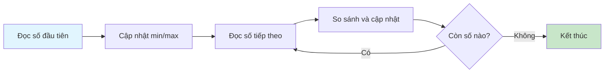
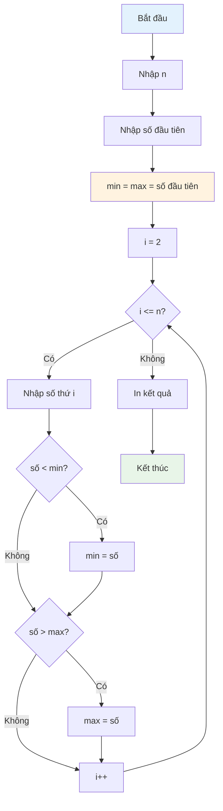

Khi làm việc với dãy số lớn, việc tìm giá trị lớn nhất và nhỏ nhất thường được nghĩ đến đầu tiên là lưu toàn bộ vào mảng. Nhưng điều gì sẽ xảy ra nếu dãy số có hàng triệu phần tử? Bài viết này sẽ hướng dẫn bạn cách tìm min/max một cách thông minh mà không cần lưu trữ toàn bộ dãy.

Phương pháp stream processing (xử lý luồng) này không chỉ tiết kiệm bộ nhớ mà còn cho phép xử lý dữ liệu trong thời gian thực, rất hữu ích trong các ứng dụng thực tế.

<!-- truncate -->

## Tại Sao Không Dùng Mảng?

### Vấn đề với Cách Tiếp Cận Truyền Thống

Thông thường, khi tìm min/max, chúng ta có xu hướng:

1. **Đọc toàn bộ dãy vào mảng**
2. **Duyệt mảng để tìm min/max**

```cpp
// Cách truyền thống - TỐN BỘ NHỚ
int arr[1000000]; // 4MB bộ nhớ!
// Đọc n phần tử vào mảng...
// Sau đó mới tìm min/max
```

:::warning Vấn Đề Bộ Nhớ
Với dãy 1 triệu số nguyên, bạn cần tối thiểu 4MB RAM chỉ để lưu trữ. Với dãy lớn hơn, có thể gặp lỗi tràn bộ nhớ (Out of Memory).
:::

### Lợi Ích của Stream Processing



**Ưu điểm:**
- ✅ **Bộ nhớ cố định**: Chỉ cần O(1) bộ nhớ
- ✅ **Xử lý thời gian thực**: Có thể xử lý dữ liệu liên tục
- ✅ **Không giới hạn kích thước**: Xử lý được dãy vô hạn
- ✅ **Hiệu suất cao**: Chỉ duyệt một lần

## Hiểu Bài Toán

### Input và Output

**Input:**
- Số lượng phần tử `n`
- `n` số nguyên được nhập từng cái một

**Output:**
- Số lớn nhất trong dãy
- Số nhỏ nhất trong dãy

### Ví Dụ Minh Họa

```
Input:
5
3 7 1 9 4

Output:
So lon nhat: 9
So nho nhat: 1
```

## Phương Pháp Giải Quyết

### Ý Tưởng Chính

:::tip Chiến Lược Stream Processing
1. **Khởi tạo**: Đọc số đầu tiên làm cả min và max ban đầu
2. **Xử lý tuần tự**: Đọc từng số một và so sánh ngay lập tức
3. **Cập nhật liên tục**: Cập nhật min/max nếu tìm thấy giá trị mới
4. **Không lưu trữ**: Bỏ qua số vừa xử lý, chỉ giữ lại min/max
:::

### Thuật Toán Chi Tiết



## Cài Đặt Code

### Phiên Bản C++

```cpp
#include <iostream>
#include <climits>
using namespace std;

void timMinMaxStream() {
    int n;
    cout << "Nhap so luong phan tu: ";
    cin >> n;
    
    if (n <= 0) {
        cout << "So luong phan tu khong hop le!" << endl;
        return;
    }
    
    // Đọc số đầu tiên để khởi tạo
    int so, minVal, maxVal;
    cout << "Nhap so thu 1: ";
    cin >> so;
    minVal = maxVal = so;
    
    // Xử lý các số còn lại
    for (int i = 2; i <= n; i++) {
        cout << "Nhap so thu " << i << ": ";
        cin >> so;
        
        // Cập nhật min/max ngay lập tức
        if (so < minVal) {
            minVal = so;
        }
        if (so > maxVal) {
            maxVal = so;
        }
    }
    
    cout << "\nKet qua:" << endl;
    cout << "So nho nhat: " << minVal << endl;
    cout << "So lon nhat: " << maxVal << endl;
}

// Phiên bản tối ưu với xử lý trường hợp đặc biệt
void timMinMaxStreamOptimized() {
    int n;
    cout << "Nhap so luong phan tu: ";
    cin >> n;
    
    if (n <= 0) {
        cout << "Khong co phan tu nao!" << endl;
        return;
    }
    
    if (n == 1) {
        int so;
        cout << "Nhap so duy nhat: ";
        cin >> so;
        cout << "So nho nhat va lon nhat: " << so << endl;
        return;
    }
    
    // Khởi tạo với giá trị cực đại/cực tiểu
    int minVal = INT_MAX;
    int maxVal = INT_MIN;
    
    for (int i = 1; i <= n; i++) {
        int so;
        cout << "Nhap so thu " << i << ": ";
        cin >> so;
        
        // Sử dụng toán tử ternary cho ngắn gọn
        minVal = (so < minVal) ? so : minVal;
        maxVal = (so > maxVal) ? so : maxVal;
    }
    
    cout << "\nKet qua:" << endl;
    cout << "So nho nhat: " << minVal << endl;
    cout << "So lon nhat: " << maxVal << endl;
}

int main() {
    timMinMaxStream();
    return 0;
}
```

### Phiên Bản Python

```python
def find_min_max_stream():
    """
    Tìm min/max trong dãy số mà không dùng list
    Sử dụng stream processing để tiết kiệm bộ nhớ
    """
    try:
        n = int(input("Nhập số lượng phần tử: "))
        
        if n <= 0:
            print("Số lượng phần tử không hợp lệ!")
            return
        
        # Đọc số đầu tiên để khởi tạo
        first_number = int(input("Nhập số thứ 1: "))
        min_val = max_val = first_number
        
        # Xử lý các số còn lại
        for i in range(2, n + 1):
            number = int(input(f"Nhập số thứ {i}: "))
            
            # Cập nhật min/max ngay lập tức
            min_val = min(min_val, number)
            max_val = max(max_val, number)
        
        print(f"\nKết quả:")
        print(f"Số nhỏ nhất: {min_val}")
        print(f"Số lớn nhất: {max_val}")
        
    except ValueError:
        print("Vui lòng nhập số nguyên hợp lệ!")
    except Exception as e:
        print(f"Lỗi: {e}")

def find_min_max_generator():
    """
    Phiên bản sử dụng generator để xử lý dãy số lớn
    Có thể mở rộng để đọc từ file hoặc stream
    """
    def number_generator():
        """Generator để tạo ra các số từ input"""
        n = int(input("Nhập số lượng phần tử: "))
        for i in range(1, n + 1):
            yield int(input(f"Nhập số thứ {i}: "))
    
    try:
        numbers = number_generator()
        
        # Lấy số đầu tiên
        first_num = next(numbers)
        min_val = max_val = first_num
        
        # Xử lý các số còn lại
        for num in numbers:
            min_val = min(min_val, num)
            max_val = max(max_val, num)
        
        print(f"\nKết quả:")
        print(f"Số nhỏ nhất: {min_val}")
        print(f"Số lớn nhất: {max_val}")
        
    except StopIteration:
        print("Không có phần tử nào!")
    except ValueError:
        print("Vui lòng nhập số nguyên hợp lệ!")

# Phiên bản one-liner cho Python advanced
def find_min_max_oneliner():
    """Phiên bản ngắn gọn sử dụng functools.reduce"""
    from functools import reduce
    
    n = int(input("Nhập số lượng phần tử: "))
    numbers = (int(input(f"Nhập số thứ {i}: ")) for i in range(1, n + 1))
    
    # Sử dụng reduce để tìm min/max trong một lần duyệt
    min_val, max_val = reduce(
        lambda acc, x: (min(acc[0], x), max(acc[1], x)),
        numbers,
        (float('inf'), float('-inf'))
    )
    
    print(f"Số nhỏ nhất: {min_val}")
    print(f"Số lớn nhất: {max_val}")

if __name__ == "__main__":
    find_min_max_stream()
```

### Phiên Bản Java

```java
import java.util.Scanner;
import java.util.NoSuchElementException;

public class MinMaxStream {
    
    /**
     * Tìm min/max trong dãy số không dùng array
     * Sử dụng stream processing để tiết kiệm bộ nhớ
     */
    public static void findMinMaxStream() {
        Scanner scanner = new Scanner(System.in);
        
        try {
            System.out.print("Nhap so luong phan tu: ");
            int n = scanner.nextInt();
            
            if (n <= 0) {
                System.out.println("So luong phan tu khong hop le!");
                return;
            }
            
            // Đọc số đầu tiên để khởi tạo
            System.out.print("Nhap so thu 1: ");
            int firstNumber = scanner.nextInt();
            int minVal = firstNumber;
            int maxVal = firstNumber;
            
            // Xử lý các số còn lại
            for (int i = 2; i <= n; i++) {
                System.out.print("Nhap so thu " + i + ": ");
                int number = scanner.nextInt();
                
                // Cập nhật min/max ngay lập tức
                minVal = Math.min(minVal, number);
                maxVal = Math.max(maxVal, number);
            }
            
            System.out.println("\nKet qua:");
            System.out.println("So nho nhat: " + minVal);
            System.out.println("So lon nhat: " + maxVal);
            
        } catch (NoSuchElementException e) {
            System.out.println("Loi nhap lieu!");
        } catch (Exception e) {
            System.out.println("Loi: " + e.getMessage());
        }
    }
    
    /**
     * Phiên bản object-oriented với class MinMaxTracker
     */
    static class MinMaxTracker {
        private Integer minVal;
        private Integer maxVal;
        private int count;
        
        public void addNumber(int number) {
            if (count == 0) {
                minVal = maxVal = number;
            } else {
                minVal = Math.min(minVal, number);
                maxVal = Math.max(maxVal, number);
            }
            count++;
        }
        
        public int getMin() {
            if (count == 0) throw new IllegalStateException("Chua co so nao!");
            return minVal;
        }
        
        public int getMax() {
            if (count == 0) throw new IllegalStateException("Chua co so nao!");
            return maxVal;
        }
        
        public int getCount() {
            return count;
        }
        
        public void reset() {
            minVal = maxVal = null;
            count = 0;
        }
    }
    
    public static void findMinMaxWithTracker() {
        Scanner scanner = new Scanner(System.in);
        MinMaxTracker tracker = new MinMaxTracker();
        
        try {
            System.out.print("Nhap so luong phan tu: ");
            int n = scanner.nextInt();
            
            if (n <= 0) {
                System.out.println("So luong phan tu khong hop le!");
                return;
            }
            
            for (int i = 1; i <= n; i++) {
                System.out.print("Nhap so thu " + i + ": ");
                int number = scanner.nextInt();
                tracker.addNumber(number);
            }
            
            System.out.println("\nKet qua:");
            System.out.println("So nho nhat: " + tracker.getMin());
            System.out.println("So lon nhat: " + tracker.getMax());
            System.out.println("Tong so phan tu: " + tracker.getCount());
            
        } catch (Exception e) {
            System.out.println("Loi: " + e.getMessage());
        }
    }
    
    public static void main(String[] args) {
        System.out.println("=== Tim Min/Max khong dung Array ===");
        findMinMaxStream();
    }
}
```

## Phân Tích Độ Phức Tạp

### Độ Phức Tạp Thời Gian

:::info Phân Tích Time Complexity
- **Tốt nhất**: O(n) - phải đọc qua tất cả n phần tử
- **Trung bình**: O(n) - không có cách nào tránh khỏi việc xem qua mọi phần tử
- **Tệ nhất**: O(n) - vẫn phải duyệt hết n phần tử

**Kết luận**: Thuật toán có độ phức tạp thời gian tối ưu O(n).
:::

### Độ Phức Tạp Không Gian

:::tip Space Complexity Advantage
- **Mảng truyền thống**: O(n) - cần lưu n phần tử
- **Stream processing**: O(1) - chỉ cần vài biến

**Tiết kiệm bộ nhớ**: Với n = 1,000,000, tiết kiệm được ~4MB RAM!
:::

## Các Trường Hợp Đặc Biệt

### Xử Lý Edge Cases

```cpp
// Xử lý các trường hợp đặc biệt
void handleEdgeCases() {
    int n;
    cin >> n;
    
    if (n == 0) {
        cout << "Khong co phan tu nao!" << endl;
        return;
    }
    
    if (n == 1) {
        int only_number;
        cin >> only_number;
        cout << "Min va Max: " << only_number << endl;
        return;
    }
    
    // Xử lý trường hợp tất cả số bằng nhau
    bool allEqual = true;
    int first, current;
    cin >> first;
    int minVal = maxVal = first;
    
    for (int i = 2; i <= n; i++) {
        cin >> current;
        if (current != first) allEqual = false;
        
        minVal = min(minVal, current);
        maxVal = max(maxVal, current);
    }
    
    if (allEqual) {
        cout << "Tat ca cac so deu bang nhau: " << first << endl;
    } else {
        cout << "Min: " << minVal << ", Max: " << maxVal << endl;
    }
}
```

## Ứng Dụng Thực Tế

### 1. Xử Lý Big Data

```python
def process_large_dataset(filename):
    """
    Xử lý file dữ liệu lớn mà không load hết vào memory
    """
    min_val = float('inf')
    max_val = float('-inf')
    count = 0
    
    with open(filename, 'r') as file:
        for line in file:
            try:
                number = float(line.strip())
                min_val = min(min_val, number)
                max_val = max(max_val, number)
                count += 1
            except ValueError:
                continue  # Bỏ qua dòng không hợp lệ
    
    return min_val, max_val, count
```

### 2. Real-time Data Monitoring

```java
public class RealTimeMonitor {
    private double minValue = Double.MAX_VALUE;
    private double maxValue = Double.MIN_VALUE;
    
    public void processNewData(double value) {
        minValue = Math.min(minValue, value);
        maxValue = Math.max(maxValue, value);
        
        // Có thể trigger alert nếu cần
        if (value > threshold) {
            alertSystem.notify("High value detected: " + value);
        }
    }
    
    public void getStatistics() {
        return new Statistics(minValue, maxValue);
    }
}
```

### 3. Stream Processing với Multiple Metrics

```cpp
class StreamProcessor {
private:
    long long sum = 0;
    int count = 0;
    int minVal = INT_MAX;
    int maxVal = INT_MIN;
    
public:
    void processNumber(int num) {
        sum += num;
        count++;
        minVal = min(minVal, num);
        maxVal = max(maxVal, num);
    }
    
    double getAverage() {
        return count > 0 ? (double)sum / count : 0;
    }
    
    pair<int, int> getMinMax() {
        return {minVal, maxVal};
    }
    
    int getRange() {
        return maxVal - minVal;
    }
};
```

## Bài Tập Thực Hành

### Bài Tập Cơ Bản

1. **Tìm số lớn thứ hai** mà không dùng mảng
2. **Đếm số lượng** số dương, âm, và bằng 0
3. **Tính trung bình** của dãy số trong khi tìm min/max

### Bài Tập Nâng Cao

1. **Tìm khoảng cách lớn nhất** giữa hai số liên tiếp
2. **Detect outliers** (số bất thường) trong stream
3. **Sliding window min/max** với cửa sổ kích thước k

### Thử Thách

```cpp
// Tìm 3 số lớn nhất và 3 số nhỏ nhất mà không dùng mảng
class Top3Tracker {
    // Implement solution here...
};
```

## Tổng Kết

Stream processing để tìm min/max là một kỹ thuật quan trọng trong lập trình, đặc biệt hữu ích khi:

✅ **Xử lý dữ liệu lớn** không thể load hết vào bộ nhớ  
✅ **Real-time processing** cần kết quả ngay lập tức  
✅ **Embedded systems** có bộ nhớ hạn chế  
✅ **Streaming data** từ sensors, APIs, files  

:::note Kinh Nghiệm Thực Tế
Trong các dự án thực tế, kỹ thuật này thường được kết hợp với:
- **Database streaming**: Xử lý kết quả query từng dòng
- **File processing**: Đọc file lớn từng chunk
- **Network streaming**: Xử lý data từ API real-time
- **IoT applications**: Thu thập và phân tích sensor data
:::

Hãy thực hành với các bài tập để thành thạo kỹ thuật stream processing này!