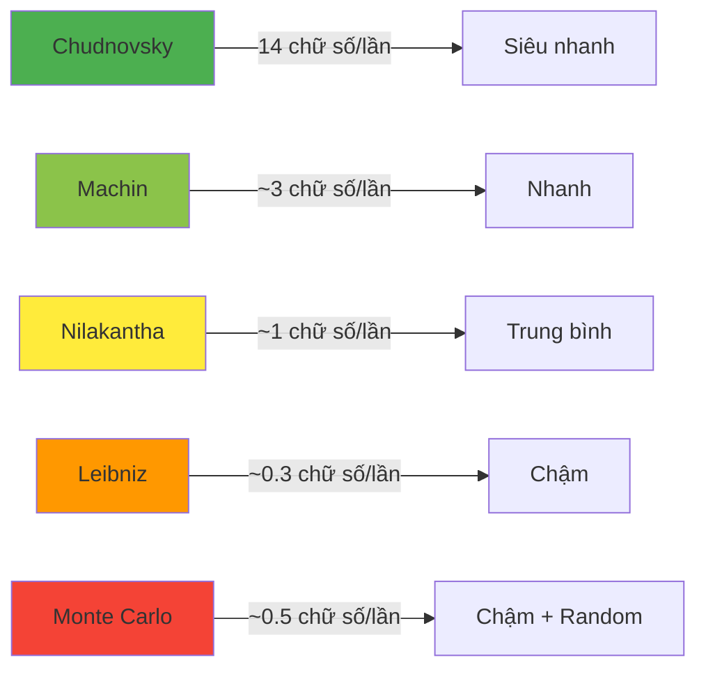

Số π (pi) là một trong những hằng số toán học nổi tiếng nhất, xuất hiện ở khắp nơi từ hình học đến vật lý. Làm thế nào để tính được giá trị gần đúng của π mà không cần tra bảng? Bài viết này sẽ hướng dẫn bạn các phương pháp tính π bằng những công thức chuỗi đẹp đẽ.

Từ chuỗi Leibniz đơn giản đến công thức Chudnovsky siêu chính xác, chúng ta sẽ khám phá cách toán học có thể biến những phép tính lặp đi lặp lại thành những con số kỳ diệu.

<!-- truncate -->

## Tại Sao Cần Tính Gần Đúng π?

### Ý Nghĩa Của Số π

Số π là tỷ số giữa chu vi và đường kính của một hình tròn:

$$\pi = \frac{\text{Chu vi}}{\text{Đường kính}} = \frac{C}{d}$$

:::info Giá Trị Thực Của π
π = 3.1415926535897932384626433832795...

Đây là một **số vô tỷ** (irrational number), có nghĩa là phần thập phân không bao giờ kết thúc và không có chu kỳ lặp lại.
:::

### Ứng Dụng Thực Tế


## Hiểu Về Chuỗi Vô Hạn

### Khái Niệm Cơ Bản

Chuỗi vô hạn là tổng của vô số hạng tử:

$$S = a_1 + a_2 + a_3 + \ldots = \sum_{n=1}^{\infty} a_n$$

### Tính Hội Tụ

:::tip Điều Kiện Hội Tụ
Một chuỗi **hội tụ** nếu tổng các hạng tử tiến về một giá trị xác định khi số hạng tử tiến về vô cùng.

Ví dụ: $\sum_{n=1}^{\infty} \frac{1}{2^n} = 1$
:::

## Các Công Thức Tính π

### 1. Chuỗi Leibniz (1674)

Đây là công thức đơn giản nhất để tính π:

$$\frac{\pi}{4} = 1 - \frac{1}{3} + \frac{1}{5} - \frac{1}{7} + \frac{1}{9} - \ldots = \sum_{n=0}^{\infty} \frac{(-1)^n}{2n+1}$$

**Ưu điểm**: Đơn giản, dễ hiểu  
**Nhược điểm**: Hội tụ rất chậm

### 2. Chuỗi Nilakantha (Thế kỷ 15)

$$\pi = 3 + \frac{4}{2 \times 3 \times 4} - \frac{4}{4 \times 5 \times 6} + \frac{4}{6 \times 7 \times 8} - \ldots$$

**Ưu điểm**: Hội tụ nhanh hơn Leibniz  
**Nhược điểm**: Phức tạp hơn

### 3. Công Thức Machin (1706)

$$\frac{\pi}{4} = 4\arctan\left(\frac{1}{5}\right) - \arctan\left(\frac{1}{239}\right)$$

### 4. Chuỗi Chudnovsky (1988)

Công thức chính xác nhất, mỗi hạng tử cho 14 chữ số thập phân đúng:

$$\frac{1}{\pi} = 12\sum_{k=0}^{\infty} \frac{(6k)!(-1)^k(545140134k+13591409)}{(3k)!(k!)^3(640320)^{3k+3/2}}$$

## Cài Đặt Thuật Toán

### Chuỗi Leibniz - C++

```cpp
#include <iostream>
#include <iomanip>
#include <cmath>
using namespace std;

double calculatePiLeibniz(int iterations) {
    double pi = 0.0;
    int sign = 1;
    
    cout << "Tinh pi bang chuoi Leibniz:" << endl;
    cout << "So lan lap | Gia tri pi | Sai so" << endl;
    cout << "-----------|------------|--------" << endl;
    
    for (int i = 0; i < iterations; i++) {
        double term = (double)sign / (2 * i + 1);
        pi += term;
        sign *= -1;  // Đổi dấu cho lần lặp tiếp theo
        
        double piApprox = pi * 4;  // π = 4 * (tổng chuỗi)
        double error = abs(piApprox - M_PI);
        
        // In kết quả mỗi 1000 lần lặp hoặc 10 lần đầu
        if (i < 10 || (i + 1) % 1000 == 0) {
            cout << setw(10) << (i + 1) << " | ";
            cout << setw(10) << fixed << setprecision(6) << piApprox << " | ";
            cout << setw(8) << scientific << setprecision(2) << error << endl;
        }
    }
    
    return pi * 4;
}

// Phiên bản tối ưu với điều kiện dừng
double calculatePiLeibnizPrecision(double precision) {
    double pi = 0.0;
    int sign = 1;
    int iterations = 0;
    double error = 1.0;
    
    cout << "Tinh pi voi do chinh xac: " << precision << endl;
    
    while (error > precision) {
        double term = (double)sign / (2 * iterations + 1);
        pi += term;
        sign *= -1;
        iterations++;
        
        double piApprox = pi * 4;
        error = abs(piApprox - M_PI);
        
        if (iterations % 10000 == 0) {
            cout << "Lan lap " << iterations << ": pi = " 
                 << fixed << setprecision(8) << piApprox 
                 << ", sai so = " << scientific << error << endl;
        }
    }
    
    cout << "Dat do chinh xac sau " << iterations << " lan lap" << endl;
    return pi * 4;
}

int main() {
    cout << "=== TINH GIA TRI PI BANG CHUOI ===" << endl;
    cout << "Gia tri thuc cua pi: " << fixed << setprecision(10) << M_PI << endl;
    cout << endl;
    
    // Tính với số lần lặp cố định
    calculatePiLeibniz(10000);
    
    cout << endl;
    
    // Tính với độ chính xác yêu cầu
    calculatePiLeibnizPrecision(1e-6);
    
    return 0;
}
```

### Chuỗi Nilakantha - Python

```python
import math

def calculate_pi_nilakantha(iterations):
    """
    Tính π bằng chuỗi Nilakantha
    π = 3 + 4/(2*3*4) - 4/(4*5*6) + 4/(6*7*8) - ...
    """
    pi = 3.0
    sign = 1
    
    print("Tính π bằng chuỗi Nilakantha:")
    print("Lần lặp | Giá trị π  | Sai số")
    print("--------|------------|--------")
    
    for i in range(iterations):
        # Mẫu số cho hạng tử thứ i
        denominator = (2 * i + 2) * (2 * i + 3) * (2 * i + 4)
        term = 4.0 / denominator
        
        pi += sign * term
        sign *= -1  # Đổi dấu
        
        error = abs(pi - math.pi)
        
        # In kết quả theo chu kỳ
        if i < 10 or (i + 1) % 100 == 0:
            print(f"{i+1:7d} | {pi:10.6f} | {error:.2e}")
    
    return pi

def calculate_pi_nilakantha_precision(precision):
    """
    Tính π với độ chính xác yêu cầu
    """
    pi = 3.0
    sign = 1
    iterations = 0
    error = 1.0
    
    print(f"Tính π với độ chính xác: {precision}")
    
    while error > precision:
        denominator = (2 * iterations + 2) * (2 * iterations + 3) * (2 * iterations + 4)
        term = 4.0 / denominator
        
        pi += sign * term
        sign *= -1
        iterations += 1
        
        error = abs(pi - math.pi)
        
        if iterations % 1000 == 0:
            print(f"Lần lặp {iterations}: π = {pi:.8f}, sai số = {error:.2e}")
    
    print(f"Đạt độ chính xác sau {iterations} lần lặp")
    return pi, iterations

def compare_convergence():
    """
    So sánh tốc độ hội tụ của các phương pháp
    """
    import time
    
    def leibniz_term(n):
        return (-1)**n / (2*n + 1)
    
    def nilakantha_term(n):
        if n == 0:
            return 3
        sign = (-1)**(n-1)
        denominator = (2*n) * (2*n + 1) * (2*n + 2)
        return sign * 4 / denominator
    
    iterations = 10000
    
    # Leibniz
    start_time = time.time()
    pi_leibniz = 4 * sum(leibniz_term(i) for i in range(iterations))
    leibniz_time = time.time() - start_time
    
    # Nilakantha
    start_time = time.time()
    pi_nilakantha = sum(nilakantha_term(i) for i in range(iterations))
    nilakantha_time = time.time() - start_time
    
    print("\n=== SO SÁNH TỐC ĐỘ HỘI TỤ ===")
    print(f"Số lần lặp: {iterations}")
    print(f"π thực tế: {math.pi:.10f}")
    print()
    print(f"Leibniz   : {pi_leibniz:.10f}")
    print(f"Sai số    : {abs(pi_leibniz - math.pi):.2e}")
    print(f"Thời gian : {leibniz_time:.4f}s")
    print()
    print(f"Nilakantha: {pi_nilakantha:.10f}")
    print(f"Sai số    : {abs(pi_nilakantha - math.pi):.2e}")
    print(f"Thời gian : {nilakantha_time:.4f}s")

# Ví dụ sử dụng
if __name__ == "__main__":
    print("=== TÍNH GIÁ TRỊ π BẰNG CHUỖI ===")
    print(f"Giá trị thực của π: {math.pi:.10f}")
    print()
    
    # Tính với Nilakantha
    calculate_pi_nilakantha(1000)
    
    print()
    
    # Tính với độ chính xác
    pi_result, iterations = calculate_pi_nilakantha_precision(1e-8)
    print(f"Kết quả cuối cùng: π ≈ {pi_result:.10f}")
    
    # So sánh các phương pháp
    compare_convergence()
```

### Monte Carlo Method - Java

```java
import java.util.Random;
import java.text.DecimalFormat;

public class PiCalculator {
    
    /**
     * Tính π bằng phương pháp Monte Carlo
     * Ném điểm ngẫu nhiên vào hình vuông có hình tròn nội tiếp
     */
    public static double calculatePiMonteCarlo(long iterations) {
        Random random = new Random();
        long pointsInCircle = 0;
        
        System.out.println("Tính π bằng phương pháp Monte Carlo:");
        System.out.println("Lần lặp     | Giá trị π  | Sai số");
        System.out.println("------------|------------|--------");
        
        for (long i = 1; i <= iterations; i++) {
            // Tạo điểm ngẫu nhiên trong khoảng [-1, 1]
            double x = random.nextDouble() * 2 - 1;
            double y = random.nextDouble() * 2 - 1;
            
            // Kiểm tra điểm có nằm trong hình tròn không
            if (x * x + y * y <= 1.0) {
                pointsInCircle++;
            }
            
            // Tính π từ tỷ lệ điểm trong hình tròn
            if (i % (iterations / 10) == 0 || i <= 10000) {
                double piEstimate = 4.0 * pointsInCircle / i;
                double error = Math.abs(piEstimate - Math.PI);
                
                DecimalFormat df = new DecimalFormat("#,###");
                System.out.printf("%11s | %10.6f | %.2e%n", 
                    df.format(i), piEstimate, error);
            }
        }
        
        return 4.0 * pointsInCircle / iterations;
    }
    
    /**
     * Chuỗi Machin: π/4 = 4*arctan(1/5) - arctan(1/239)
     */
    public static double calculatePiMachin(int terms) {
        double pi = 4 * (4 * arctan(1.0/5, terms) - arctan(1.0/239, terms));
        return pi;
    }
    
    /**
     * Tính arctan(x) bằng chuỗi Taylor
     * arctan(x) = x - x³/3 + x⁵/5 - x⁷/7 + ...
     */
    private static double arctan(double x, int terms) {
        double result = 0.0;
        double power = x;
        
        for (int i = 0; i < terms; i++) {
            int sign = (i % 2 == 0) ? 1 : -1;
            result += sign * power / (2 * i + 1);
            power *= x * x;  // x^(2i+3) = x^(2i+1) * x²
        }
        
        return result;
    }
    
    /**
     * So sánh các phương pháp tính π
     */
    public static void compareMethod() {
        System.out.println("\n=== SO SÁNH CÁC PHƯƠNG PHÁP ===");
        System.out.println("Giá trị thực của π: " + Math.PI);
        System.out.println();
        
        // Leibniz
        long start = System.currentTimeMillis();
        double piLeibniz = calculatePiLeibniz(1000000);
        long leibnizTime = System.currentTimeMillis() - start;
        
        // Monte Carlo
        start = System.currentTimeMillis();
        double piMonteCarlo = calculatePiMonteCarlo(1000000);
        long monteCarloTime = System.currentTimeMillis() - start;
        
        // Machin
        start = System.currentTimeMillis();
        double piMachin = calculatePiMachin(100);
        long machinTime = System.currentTimeMillis() - start;
        
        System.out.printf("Leibniz    : %.10f (sai số: %.2e, thời gian: %dms)%n", 
            piLeibniz, Math.abs(piLeibniz - Math.PI), leibnizTime);
        System.out.printf("Monte Carlo: %.10f (sai số: %.2e, thời gian: %dms)%n", 
            piMonteCarlo, Math.abs(piMonteCarlo - Math.PI), monteCarloTime);
        System.out.printf("Machin     : %.10f (sai số: %.2e, thời gian: %dms)%n", 
            piMachin, Math.abs(piMachin - Math.PI), machinTime);
    }
    
    /**
     * Chuỗi Leibniz trong Java
     */
    private static double calculatePiLeibniz(int iterations) {
        double pi = 0.0;
        
        for (int i = 0; i < iterations; i++) {
            int sign = (i % 2 == 0) ? 1 : -1;
            pi += (double)sign / (2 * i + 1);
        }
        
        return pi * 4;
    }
    
    /**
     * Visualization của quá trình hội tụ
     */
    public static void visualizeConvergence() {
        System.out.println("\n=== BIỂU ĐỒ HỘI TỤ ===");
        
        for (int iterations = 10; iterations <= 100000; iterations *= 10) {
            double piLeibniz = calculatePiLeibniz(iterations);
            double error = Math.abs(piLeibniz - Math.PI);
            
            // Tạo thanh tiến trình bằng ký tự
            int accuracy = Math.max(0, (int)(10 - Math.log10(error)));
            String bar = "█".repeat(Math.min(accuracy, 20));
            
            System.out.printf("%6d lần lặp: π = %.6f, độ chính xác: %s%n", 
                iterations, piLeibniz, bar);
        }
    }
    
    public static void main(String[] args) {
        System.out.println("=== TÍNH GIÁ TRỊ π BẰNG CÁC PHƯƠNG PHÁP KHÁC NHAU ===");
        
        // Monte Carlo
        System.out.println("1. Phương pháp Monte Carlo:");
        calculatePiMonteCarlo(100000);
        
        // So sánh các phương pháp
        compareMethod();
        
        // Visualization
        visualizeConvergence();
    }
}
```

## Phân Tích Hiệu Suất

### So Sánh Tốc Độ Hội Tụ



### Bảng So Sánh Chi Tiết

| Phương pháp | Độ phức tạp | Tốc độ hội tụ | Độ khó cài đặt | Ứng dụng |
|-------------|-------------|---------------|----------------|----------|
| **Leibniz** | O(n) | Rất chậm | Dễ | Học tập |
| **Nilakantha** | O(n) | Chậm | Dễ | Thực hành |
| **Machin** | O(n) | Nhanh | Trung bình | Thực tế |
| **Monte Carlo** | O(n) | Chậm | Dễ | Mô phỏng |
| **Chudnovsky** | O(n) | Siêu nhanh | Khó | Nghiên cứu |

## Tối Ưu Hóa và Cải Tiến

### 1. Parallel Processing

```cpp
#include <omp.h>  // OpenMP for parallelization

double calculatePiParallel(long iterations) {
    double pi = 0.0;
    
    #pragma omp parallel for reduction(+:pi)
    for (long i = 0; i < iterations; i++) {
        int sign = (i % 2 == 0) ? 1 : -1;
        pi += (double)sign / (2 * i + 1);
    }
    
    return pi * 4;
}
```

### 2. Adaptive Precision

```python
def adaptive_pi_calculation(target_accuracy):
    """
    Tự động điều chỉnh số lần lặp để đạt độ chính xác mong muốn
    """
    methods = [
        ('Leibniz', calculate_pi_leibniz_adaptive),
        ('Nilakantha', calculate_pi_nilakantha_adaptive),
        ('Monte Carlo', calculate_pi_monte_carlo_adaptive)
    ]
    
    results = []
    
    for name, method in methods:
        start_time = time.time()
        pi_value, iterations = method(target_accuracy)
        elapsed_time = time.time() - start_time
        
        results.append({
            'method': name,
            'value': pi_value,
            'iterations': iterations,
            'time': elapsed_time,
            'accuracy': abs(pi_value - math.pi)
        })
    
    return results
```

### 3. Memory Optimization

```java
public class MemoryEfficientPi {
    // Sử dụng streaming computation để tránh lưu trữ
    public static double streamingPiCalculation() {
        return IntStream.range(0, 1000000)
            .parallel()
            .mapToDouble(i -> {
                int sign = (i % 2 == 0) ? 1 : -1;
                return sign / (2.0 * i + 1);
            })
            .sum() * 4;
    }
}
```

## Ứng Dụng Nâng Cao

### 1. Benchmark Performance

```cpp
class PiBenchmark {
private:
    vector<pair<string, function<double(int)>>> methods;
    
public:
    void addMethod(string name, function<double(int)> method) {
        methods.push_back({name, method});
    }
    
    void runBenchmark(vector<int> iterations) {
        cout << "Method     | Iterations | Pi Value   | Error      | Time(ms)" << endl;
        cout << "-----------|------------|------------|------------|----------" << endl;
        
        for (auto& [name, method] : methods) {
            for (int iter : iterations) {
                auto start = chrono::high_resolution_clock::now();
                double pi = method(iter);
                auto end = chrono::high_resolution_clock::now();
                
                auto duration = chrono::duration_cast<chrono::milliseconds>(end - start);
                double error = abs(pi - M_PI);
                
                printf("%-10s | %10d | %10.6f | %.2e | %8lld\n", 
                    name.c_str(), iter, pi, error, duration.count());
            }
        }
    }
};
```

### 2. Interactive π Calculator

```python
class InteractivePiCalculator:
    def __init__(self):
        self.methods = {
            '1': ('Leibniz', self.leibniz),
            '2': ('Nilakantha', self.nilakantha),
            '3': ('Monte Carlo', self.monte_carlo),
            '4': ('Machin', self.machin)
        }
    
    def run(self):
        while True:
            self.show_menu()
            choice = input("Chọn phương pháp (1-4) hoặc 'q' để thoát: ")
            
            if choice.lower() == 'q':
                break
            
            if choice in self.methods:
                method_name, method_func = self.methods[choice]
                self.execute_method(method_name, method_func)
            else:
                print("Lựa chọn không hợp lệ!")
    
    def show_menu(self):
        print("\n=== CALCULATOR GIÁ TRỊ π ===")
        print("1. Chuỗi Leibniz")
        print("2. Chuỗi Nilakantha") 
        print("3. Monte Carlo")
        print("4. Công thức Machin")
        print("q. Thoát")
    
    def execute_method(self, name, method):
        print(f"\nĐã chọn: {name}")
        
        try:
            iterations = int(input("Nhập số lần lặp: "))
            if iterations <= 0:
                print("Số lần lặp phải > 0")
                return
            
            print(f"Đang tính π bằng {name}...")
            pi_value = method(iterations)
            error = abs(pi_value - math.pi)
            
            print(f"Kết quả: π ≈ {pi_value:.10f}")
            print(f"Sai số: {error:.2e}")
            print(f"Độ chính xác: {-math.log10(error):.1f} chữ số")
            
        except ValueError:
            print("Vui lòng nhập số nguyên hợp lệ!")
        except Exception as e:
            print(f"Lỗi: {e}")
```

## Bài Tập Thực Hành

### Bài Tập Cơ Bản

1. **Cài đặt chuỗi Leibniz** với điều kiện dừng khi sai số < 10⁻⁶
2. **Tính π bằng Monte Carlo** và vẽ biểu đồ hội tụ
3. **So sánh tốc độ** của 3 phương pháp khác nhau

### Bài Tập Nâng Cao

1. **Tối ưu hóa parallel** cho chuỗi Leibniz
2. **Cài đặt chuỗi Chudnovsky** (thử thách!)
3. **Adaptive precision**: Tự động chọn phương pháp tối ưu

### Dự Án Thực Tế

```cpp
// Project: Pi Calculator với GUI
class PiCalculatorGUI {
    // Tích hợp multiple methods
    // Real-time visualization
    // Export results to file
    // Compare different algorithms
};
```

## Toán Học Đằng Sau

### Chuỗi Taylor và Fourier

Nhiều công thức tính π xuất phát từ chuỗi Taylor:

$$\arctan(x) = x - \frac{x^3}{3} + \frac{x^5}{5} - \frac{x^7}{7} + \ldots$$

Khi $x = 1$: $\arctan(1) = \frac{\pi}{4}$

### Phân Tích Fourier

$$\frac{\pi^2}{6} = \sum_{n=1}^{\infty} \frac{1}{n^2}$$ (Basel Problem)

### Integral Representation

$$\pi = \int_{-1}^{1} \frac{2}{\sqrt{1-x^2}} dx$$

## Tổng Kết

Việc tính gần đúng π bằng chuỗi không chỉ là bài tập toán học mà còn là cách tuyệt vời để:

✅ **Hiểu về thuật toán lặp** và điều kiện hội tụ  
✅ **Thực hành optimization** và parallel computing  
✅ **Khám phá toán học** qua lập trình  
✅ **Áp dụng trong thực tế** cho các bài toán số học  

:::note Lời Khuyên Thực Tế
- **Bắt đầu với Leibniz** để hiểu concept cơ bản
- **Thử Monte Carlo** để thấy tính ngẫu nhiên trong toán học  
- **Nghiên cứu Machin** để ứng dụng thực tế
- **Thử thách Chudnovsky** khi đã thành thạo

Mỗi phương pháp đều có giá trị riêng và dạy cho chúng ta những khía cạnh khác nhau của toán học và lập trình!
:::

Hãy thử cài đặt và so sánh các phương pháp để cảm nhận sự kỳ diệu của số π!