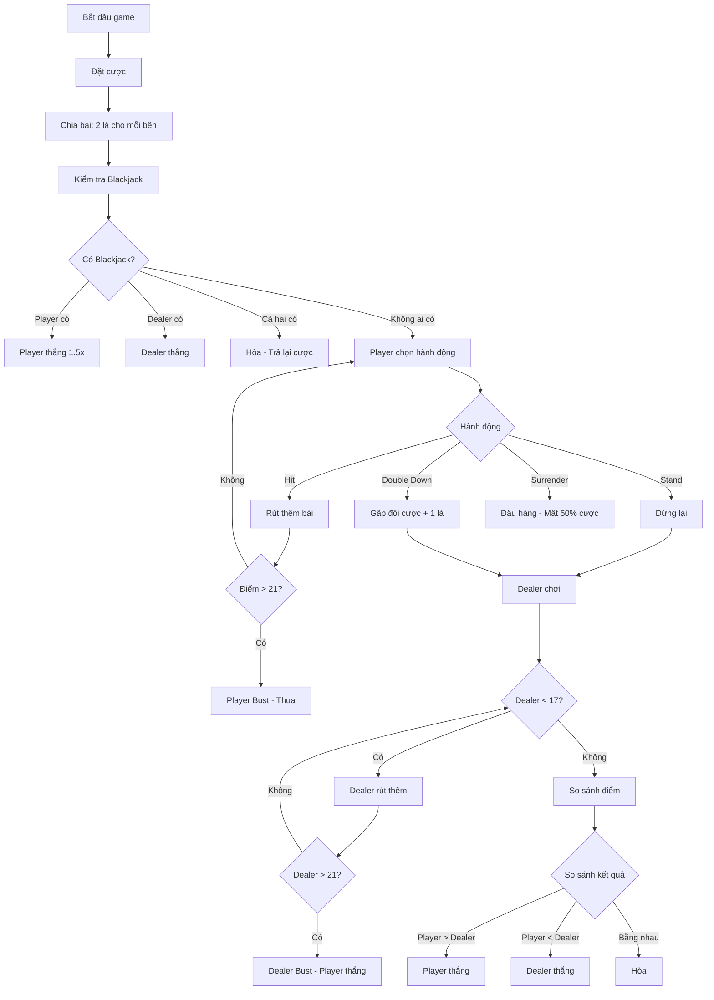
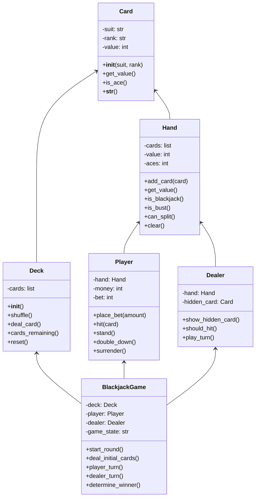

Blackjack (hay còn gọi là "21") là một trong những game bài casino phổ biến nhất thế giới. Với luật chơi đơn giản nhưng đầy chiến thuật, Blackjack là dự án hoàn hảo để học về lập trình game với logic phức tạp, quản lý trạng thái, và tính toán xác suất.

Trong bài hướng dẫn này, chúng ta sẽ xây dựng một phiên bản Blackjack hoàn chỉnh với đầy đủ tính năng như dealer AI thông minh, hệ thống cược, và thống kê chi tiết.

<!-- truncate -->

## Game Demo và Giới Thiệu

Hãy cùng xem game Blackjack của chúng ta sẽ trông như thế nào:

```
🃏 ═══════════════ BLACKJACK 21 ═══════════════ 🃏

💰 Số tiền của bạn: $1000
🎯 Tiền cược hiện tại: $50

🎴 Bài của Dealer:
   [🂠] [?]  (Điểm: ?)

🃏 Bài của bạn:
   [🂡] [🂮]  (Điểm: 21) ⭐ BLACKJACK!

📊 Lựa chọn:
1. Hit (Rút thêm bài)
2. Stand (Dừng lại)  
3. Double Down (Tăng gấp đôi cược)
4. Surrender (Đầu hàng)

Nhập lựa chọn của bạn: 
```

## Bạn Sẽ Học Được Gì?

Qua dự án Blackjack này, bạn sẽ nắm vững:

- [x] **OOP nâng cao**: Classes, inheritance, encapsulation
- [x] **Logic game phức tạp**: Dealer AI, game states, decision trees  
- [x] **Quản lý dữ liệu**: Cards, deck shuffling, hand evaluation
- [x] **Tính toán xác suất**: Card counting cơ bản, odds calculation
- [x] **State management**: Game phases, player actions, betting system
- [x] **Error handling**: Input validation, edge cases, exception handling

## Yêu Cầu Trước Khi Bắt Đầu

- **Python cơ bản**: OOP, classes, functions, loops
- **Logic tư duy**: Hiểu về probability và basic math
- **Kiến thức game**: Biết luật chơi Blackjack cơ bản

:::info Luật Chơi Blackjack Cơ Bản
- **Mục tiêu**: Có tổng điểm gần 21 nhất mà không vượt quá
- **Giá trị bài**: A = 1 hoặc 11, J/Q/K = 10, các bài khác = số điểm
- **Blackjack**: A + 10/J/Q/K (21 điểm với 2 lá)
- **Bust**: Vượt quá 21 điểm (thua ngay)
:::

## Phần 1: Phân Tích Game Blackjack

### Luật Chơi Chi Tiết



### Các Components Chính

1. **Card & Deck**: Quản lý bài và bộ bài
2. **Hand**: Tính điểm và quản lý tay bài
3. **Player & Dealer**: Logic cho người chơi và dealer
4. **Game Manager**: Điều khiển flow chính
5. **Betting System**: Quản lý tiền cược

## Phần 2: Thiết Kế Kiến Trúc

### Class Diagram



## Phần 3: Implementation Chi Tiết

### Bước 1: Tạo Card và Deck System

```python
import random
from enum import Enum

class Suit(Enum):
    """Enum cho các chất bài"""
    HEARTS = "♥️"    # Cơ
    DIAMONDS = "♦️"  # Rô  
    CLUBS = "♣️"     # Chuồn
    SPADES = "♠️"    # Bích

class Card:
    """Class đại diện cho một lá bài"""
    
    def __init__(self, suit, rank):
        self.suit = suit
        self.rank = rank
        self.value = self._calculate_value()
    
    def _calculate_value(self):
        """Tính giá trị của lá bài"""
        if self.rank in ['J', 'Q', 'K']:
            return 10
        elif self.rank == 'A':
            return 11  # Sẽ được điều chỉnh trong Hand class
        else:
            return int(self.rank)
    
    def is_ace(self):
        """Kiểm tra có phải là Ace không"""
        return self.rank == 'A'
    
    def get_display_value(self):
        """Lấy giá trị hiển thị của bài"""
        rank_symbols = {
            'A': '🂡', '2': '🂢', '3': '🂣', '4': '🂤', '5': '🂥',
            '6': '🂦', '7': '🂧', '8': '🂨', '9': '🂩', '10': '🂪',
            'J': '🂫', 'Q': '🂭', 'K': '🂮'
        }
        return rank_symbols.get(self.rank, '🂠')
    
    def __str__(self):
        return f"{self.get_display_value()}"
    
    def __repr__(self):
        return f"Card({self.suit.value}{self.rank})"

class Deck:
    """Class quản lý bộ bài"""
    
    def __init__(self, num_decks=1):
        self.num_decks = num_decks
        self.cards = []
        self.reset()
    
    def reset(self):
        """Tạo lại bộ bài mới"""
        self.cards = []
        ranks = ['A', '2', '3', '4', '5', '6', '7', '8', '9', '10', 'J', 'Q', 'K']
        
        for _ in range(self.num_decks):
            for suit in Suit:
                for rank in ranks:
                    self.cards.append(Card(suit, rank))
        
        self.shuffle()
    
    def shuffle(self):
        """Xáo bài"""
        random.shuffle(self.cards)
        print("🔄 Bộ bài đã được xáo!")
    
    def deal_card(self):
        """Chia một lá bài"""
        if len(self.cards) < 10:  # Tạo lại bộ bài mới khi sắp hết
            print("🔄 Tạo bộ bài mới...")
            self.reset()
        
        return self.cards.pop()
    
    def cards_remaining(self):
        """Số lá bài còn lại"""
        return len(self.cards)
```

### Bước 2: Hand Management System

```python
class Hand:
    """Class quản lý tay bài"""
    
    def __init__(self):
        self.cards = []
        self.value = 0
        self.aces = 0
    
    def add_card(self, card):
        """Thêm bài vào tay"""
        self.cards.append(card)
        if card.is_ace():
            self.aces += 1
        self._calculate_value()
    
    def _calculate_value(self):
        """Tính tổng điểm của tay bài"""
        self.value = 0
        aces = self.aces
        
        # Tính điểm của các bài không phải Ace
        for card in self.cards:
            if not card.is_ace():
                self.value += card.value
        
        # Xử lý Ace (11 hoặc 1)
        for _ in range(aces):
            if self.value + 11 <= 21:
                self.value += 11
            else:
                self.value += 1
    
    def get_value(self):
        """Lấy tổng điểm hiện tại"""
        return self.value
    
    def is_blackjack(self):
        """Kiểm tra có phải Blackjack không (21 với 2 lá)"""
        return len(self.cards) == 2 and self.value == 21
    
    def is_bust(self):
        """Kiểm tra có bị bust không (> 21)"""
        return self.value > 21
    
    def can_split(self):
        """Kiểm tra có thể split không (2 lá cùng rank)"""
        return (len(self.cards) == 2 and 
                self.cards[0].rank == self.cards[1].rank)
    
    def is_soft(self):
        """Kiểm tra có phải soft hand không (có Ace đếm là 11)"""
        if self.aces == 0:
            return False
        
        # Tính lại để xem có Ace nào đang đếm là 11 không
        value_without_aces = sum(card.value for card in self.cards if not card.is_ace())
        return value_without_aces + self.aces + 10 == self.value
    
    def clear(self):
        """Xóa tất cả bài trong tay"""
        self.cards = []
        self.value = 0
        self.aces = 0
    
    def display_cards(self, hide_first=False):
        """Hiển thị các lá bài trong tay"""
        if hide_first and len(self.cards) > 0:
            cards_str = "[🂠] "  # Lá bài úp
            for card in self.cards[1:]:
                cards_str += f"[{card}] "
            return cards_str.strip()
        else:
            cards_str = ""
            for card in self.cards:
                cards_str += f"[{card}] "
            return cards_str.strip()
    
    def __str__(self):
        return f"Cards: {self.display_cards()}, Value: {self.value}"
```

### Bước 3: Player và Dealer Classes

```python
class Player:
    """Class đại diện cho người chơi"""
    
    def __init__(self, starting_money=1000):
        self.hand = Hand()
        self.money = starting_money
        self.bet = 0
        self.insurance_bet = 0
        self.has_surrendered = False
        self.has_doubled_down = False
    
    def can_bet(self, amount):
        """Kiểm tra có đủ tiền để cược không"""
        return self.money >= amount
    
    def place_bet(self, amount):
        """Đặt cược"""
        if self.can_bet(amount):
            self.bet = amount
            self.money -= amount
            return True
        return False
    
    def place_insurance(self, amount):
        """Đặt cược insurance"""
        if self.can_bet(amount):
            self.insurance_bet = amount
            self.money -= amount
            return True
        return False
    
    def win_bet(self, multiplier=1):
        """Thắng cược"""
        winnings = self.bet * multiplier
        self.money += self.bet + winnings  # Trả lại tiền cược + tiền thắng
        return winnings
    
    def win_insurance(self):
        """Thắng insurance (2:1)"""
        winnings = self.insurance_bet * 2
        self.money += winnings
        return winnings
    
    def lose_bet(self):
        """Thua cược (tiền đã bị trừ khi đặt cược)"""
        lost_amount = self.bet
        self.bet = 0
        self.insurance_bet = 0
        return lost_amount
    
    def push(self):
        """Hòa - trả lại tiền cược"""
        self.money += self.bet
        return_amount = self.bet
        self.bet = 0
        self.insurance_bet = 0
        return return_amount
    
    def can_double_down(self):
        """Kiểm tra có thể double down không"""
        return (len(self.hand.cards) == 2 and 
                self.can_bet(self.bet) and 
                not self.has_doubled_down)
    
    def double_down(self):
        """Thực hiện double down"""
        if self.can_double_down():
            self.money -= self.bet
            self.bet *= 2
            self.has_doubled_down = True
            return True
        return False
    
    def surrender(self):
        """Đầu hàng - mất 50% tiền cược"""
        self.has_surrendered = True
        lost_amount = self.bet // 2
        self.money += self.bet - lost_amount
        self.bet = 0
        return lost_amount
    
    def reset_for_new_round(self):
        """Reset cho round mới"""
        self.hand.clear()
        self.bet = 0
        self.insurance_bet = 0
        self.has_surrendered = False
        self.has_doubled_down = False

class Dealer:
    """Class đại diện cho dealer"""
    
    def __init__(self):
        self.hand = Hand()
        self.hole_card = None  # Lá bài úp
    
    def should_hit(self):
        """Dealer có nên rút thêm bài không (< 17 hoặc soft 17)"""
        if self.hand.get_value() < 17:
            return True
        # Một số casino yêu cầu dealer hit trên soft 17
        if self.hand.get_value() == 17 and self.hand.is_soft():
            return True
        return False
    
    def show_upcard(self):
        """Hiển thị lá bài ngửa của dealer"""
        if len(self.hand.cards) > 0:
            return self.hand.cards[0]
        return None
    
    def has_blackjack(self):
        """Kiểm tra dealer có blackjack không"""
        return self.hand.is_blackjack()
    
    def upcard_is_ace(self):
        """Kiểm tra lá bài ngửa có phải Ace không"""
        upcard = self.show_upcard()
        return upcard and upcard.is_ace()
    
    def upcard_value(self):
        """Giá trị lá bài ngửa"""
        upcard = self.show_upcard()
        return upcard.value if upcard else 0
    
    def reset_for_new_round(self):
        """Reset cho round mới"""
        self.hand.clear()
        self.hole_card = None
```

### Bước 4: Game Manager - Logic Chính

```python
class BlackjackGame:
    """Class chính quản lý game Blackjack"""
    
    def __init__(self):
        self.deck = Deck(num_decks=6)  # Sử dụng 6 bộ bài như casino
        self.player = Player(starting_money=1000)
        self.dealer = Dealer()
        self.game_state = "betting"  # betting, playing, dealer_turn, game_over
        self.round_number = 1
        self.stats = {
            'rounds_played': 0,
            'rounds_won': 0,
            'rounds_lost': 0,
            'rounds_pushed': 0,
            'blackjacks': 0,
            'busts': 0
        }
    
    def start_new_round(self):
        """Bắt đầu round mới"""
        self.player.reset_for_new_round()
        self.dealer.reset_for_new_round()
        self.game_state = "betting"
        print(f"\n🎮 ═════ ROUND {self.round_number} ═════ 🎮")
    
    def get_bet_amount(self):
        """Lấy số tiền cược từ người chơi"""
        while True:
            try:
                print(f"\n💰 Số tiền hiện có: ${self.player.money}")
                if self.player.money <= 0:
                    print("❌ Bạn đã hết tiền! Game Over!")
                    return None
                
                bet_input = input("Nhập số tiền muốn cược (hoặc 'quit' để thoát): ").strip()
                
                if bet_input.lower() == 'quit':
                    return None
                
                bet_amount = int(bet_input)
                
                if bet_amount <= 0:
                    print("❌ Số tiền cược phải lớn hơn 0!")
                    continue
                
                if bet_amount > self.player.money:
                    print("❌ Bạn không đủ tiền!")
                    continue
                
                return bet_amount
                
            except ValueError:
                print("❌ Vui lòng nhập số hợp lệ!")
    
    def deal_initial_cards(self):
        """Chia bài ban đầu"""
        print("\n🎴 Đang chia bài...")
        
        # Chia 2 lá cho player
        self.player.hand.add_card(self.deck.deal_card())
        self.player.hand.add_card(self.deck.deal_card())
        
        # Chia 2 lá cho dealer (1 úp, 1 ngửa)
        self.dealer.hand.add_card(self.deck.deal_card())
        self.dealer.hand.add_card(self.deck.deal_card())
        
        self.display_table(hide_dealer_card=True)
    
    def check_for_blackjacks(self):
        """Kiểm tra blackjack ban đầu"""
        player_bj = self.player.hand.is_blackjack()
        dealer_bj = self.dealer.hand.is_blackjack()
        
        if player_bj and dealer_bj:
            self.display_table(hide_dealer_card=False)
            print("🤝 Cả hai đều có Blackjack! Hòa!")
            self.player.push()
            self.stats['rounds_pushed'] += 1
            return True
        elif player_bj:
            self.display_table(hide_dealer_card=False)
            print("🎉 BLACKJACK! Bạn thắng!")
            winnings = self.player.win_bet(1.5)  # Blackjack trả 3:2
            print(f"💰 Bạn thắng ${winnings}!")
            self.stats['rounds_won'] += 1
            self.stats['blackjacks'] += 1
            return True
        elif dealer_bj:
            self.display_table(hide_dealer_card=False)
            print("😞 Dealer có Blackjack! Bạn thua!")
            lost = self.player.lose_bet()
            print(f"💸 Bạn mất ${lost}!")
            self.stats['rounds_lost'] += 1
            return True
        
        return False  # Không ai có blackjack
    
    def offer_insurance(self):
        """Đề nghị insurance khi dealer có Ace"""
        if not self.dealer.upcard_is_ace():
            return
        
        max_insurance = min(self.player.bet // 2, self.player.money)
        if max_insurance <= 0:
            return
        
        while True:
            choice = input(f"\n🛡️ Dealer có Ace. Bạn có muốn mua Insurance? (y/n): ").lower().strip()
            if choice in ['y', 'yes']:
                try:
                    amount = int(input(f"Nhập số tiền Insurance (tối đa ${max_insurance}): "))
                    if 0 < amount <= max_insurance:
                        self.player.place_insurance(amount)
                        print(f"🛡️ Đã đặt Insurance ${amount}")
                        break
                    else:
                        print("❌ Số tiền không hợp lệ!")
                except ValueError:
                    print("❌ Vui lòng nhập số!")
            elif choice in ['n', 'no']:
                break
            else:
                print("Vui lòng nhập 'y' hoặc 'n'")
    
    def player_turn(self):
        """Lượt chơi của người chơi"""
        self.game_state = "playing"
        
        while True:
            if self.player.hand.is_bust():
                print("💥 BUST! Bạn thua!")
                lost = self.player.lose_bet()
                print(f"💸 Bạn mất ${lost}!")
                self.stats['rounds_lost'] += 1
                self.stats['busts'] += 1
                return
            
            if self.player.has_surrendered:
                return
            
            # Hiển thị lựa chọn
            self.display_player_options()
            choice = self.get_player_choice()
            
            if choice == "hit":
                card = self.deck.deal_card()
                self.player.hand.add_card(card)
                print(f"\n🃏 Bạn rút được: [{card}]")
                self.display_table(hide_dealer_card=True)
                
                if self.player.has_doubled_down:
                    break  # Chỉ được rút 1 lá sau double down
                    
            elif choice == "stand":
                print("\n✋ Bạn dừng lại!")
                break
                
            elif choice == "double":
                if self.player.can_double_down():
                    self.player.double_down()
                    card = self.deck.deal_card()
                    self.player.hand.add_card(card)
                    print(f"\n💰 Doubled down! Rút được: [{card}]")
                    self.display_table(hide_dealer_card=True)
                    break
                else:
                    print("❌ Không thể Double Down!")
                    
            elif choice == "surrender":
                if len(self.player.hand.cards) == 2:
                    lost = self.player.surrender()
                    print(f"\n🏳️ Đầu hàng! Mất ${lost}")
                    self.stats['rounds_lost'] += 1
                    return
                else:
                    print("❌ Chỉ có thể Surrender với 2 lá bài đầu!")
    
    def dealer_turn(self):
        """Lượt chơi của dealer"""
        if self.player.has_surrendered or self.player.hand.is_bust():
            return
        
        self.game_state = "dealer_turn"
        print("\n🎴 Lượt của Dealer...")
        self.display_table(hide_dealer_card=False)
        
        while self.dealer.should_hit():
            card = self.deck.deal_card()
            self.dealer.hand.add_card(card)
            print(f"\n🃏 Dealer rút: [{card}]")
            self.display_table(hide_dealer_card=False)
            
            if self.dealer.hand.is_bust():
                print("💥 Dealer BUST! Bạn thắng!")
                winnings = self.player.win_bet()
                print(f"💰 Bạn thắng ${winnings}!")
                self.stats['rounds_won'] += 1
                return
        
        print(f"\n🛑 Dealer dừng với {self.dealer.hand.get_value()} điểm")
    
    def determine_winner(self):
        """Xác định người thắng"""
        if (self.player.has_surrendered or 
            self.player.hand.is_bust() or 
            self.dealer.hand.is_bust()):
            return  # Đã xử lý rồi
        
        player_value = self.player.hand.get_value()
        dealer_value = self.dealer.hand.get_value()
        
        print(f"\n📊 So sánh điểm:")
        print(f"   Bạn: {player_value}")
        print(f"   Dealer: {dealer_value}")
        
        if player_value > dealer_value:
            print("🎉 Bạn thắng!")
            winnings = self.player.win_bet()
            print(f"💰 Bạn thắng ${winnings}!")
            self.stats['rounds_won'] += 1
        elif player_value < dealer_value:
            print("😞 Dealer thắng!")
            lost = self.player.lose_bet()
            print(f"💸 Bạn mất ${lost}!")
            self.stats['rounds_lost'] += 1
        else:
            print("🤝 Hòa!")
            returned = self.player.push()
            print(f"💰 Trả lại ${returned}!")
            self.stats['rounds_pushed'] += 1
        
        # Xử lý insurance
        if self.player.insurance_bet > 0:
            if self.dealer.hand.is_blackjack():
                insurance_win = self.player.win_insurance()
                print(f"🛡️ Insurance thắng! +${insurance_win}")
            else:
                print(f"🛡️ Insurance thua! -${self.player.insurance_bet}")
    
    def display_table(self, hide_dealer_card=False):
        """Hiển thị bàn chơi"""
        print("\n" + "="*60)
        print("🃏 ═══════════════ BLACKJACK 21 ═══════════════ 🃏")
        print("="*60)
        
        print(f"\n💰 Số tiền: ${self.player.money}")
        if self.player.bet > 0:
            print(f"🎯 Tiền cược: ${self.player.bet}")
        if self.player.insurance_bet > 0:
            print(f"🛡️ Insurance: ${self.player.insurance_bet}")
        
        # Hiển thị bài dealer
        print(f"\n🎴 Bài của Dealer:")
        dealer_cards = self.dealer.hand.display_cards(hide_first=hide_dealer_card)
        if hide_dealer_card:
            print(f"   {dealer_cards}  (Điểm: ?)")
        else:
            dealer_value = self.dealer.hand.get_value()
            status = ""
            if self.dealer.hand.is_blackjack():
                status = " ⭐ BLACKJACK!"
            elif self.dealer.hand.is_bust():
                status = " 💥 BUST!"
            print(f"   {dealer_cards}  (Điểm: {dealer_value}){status}")
        
        # Hiển thị bài player
        print(f"\n🃏 Bài của bạn:")
        player_cards = self.player.hand.display_cards()
        player_value = self.player.hand.get_value()
        status = ""
        if self.player.hand.is_blackjack():
            status = " ⭐ BLACKJACK!"
        elif self.player.hand.is_bust():
            status = " 💥 BUST!"
        elif self.player.hand.is_soft() and self.player.hand.get_value() != 21:
            status = " (Soft)"
        
        print(f"   {player_cards}  (Điểm: {player_value}){status}")
    
    def display_player_options(self):
        """Hiển thị lựa chọn cho người chơi"""
        print(f"\n📊 Lựa chọn:")
        print("1. Hit (Rút thêm bài)")
        print("2. Stand (Dừng lại)")
        
        if self.player.can_double_down():
            print("3. Double Down (Gấp đôi cược)")
        
        if len(self.player.hand.cards) == 2 and not self.player.has_doubled_down:
            print("4. Surrender (Đầu hàng)")
    
    def get_player_choice(self):
        """Lấy lựa chọn từ người chơi"""
        while True:
            choice = input("\nNhập lựa chọn của bạn: ").strip().lower()
            
            if choice in ['1', 'hit', 'h']:
                return "hit"
            elif choice in ['2', 'stand', 's']:
                return "stand"
            elif choice in ['3', 'double', 'd'] and self.player.can_double_down():
                return "double"
            elif choice in ['4', 'surrender', 'sur'] and len(self.player.hand.cards) == 2:
                return "surrender"
            else:
                print("❌ Lựa chọn không hợp lệ!")
    
    def display_stats(self):
        """Hiển thị thống kê"""
        print(f"\n📈 ═══ THỐNG KÊ ═══")
        print(f"Số round đã chơi: {self.stats['rounds_played']}")
        print(f"Thắng: {self.stats['rounds_won']}")
        print(f"Thua: {self.stats['rounds_lost']}")  
        print(f"Hòa: {self.stats['rounds_pushed']}")
        print(f"Blackjacks: {self.stats['blackjacks']}")
        print(f"Busts: {self.stats['busts']}")
        
        if self.stats['rounds_played'] > 0:
            win_rate = (self.stats['rounds_won'] / self.stats['rounds_played']) * 100
            print(f"Tỷ lệ thắng: {win_rate:.1f}%")
    
    def play(self):
        """Hàm chính để chơi game"""
        print("🎰 Chào mừng đến với BLACKJACK 21! 🎰")
        print("🎯 Mục tiêu: Có điểm gần 21 nhất mà không vượt quá!")
        
        while True:
            self.start_new_round()
            
            # Đặt cược
            bet_amount = self.get_bet_amount()
            if bet_amount is None:
                break
            
            self.player.place_bet(bet_amount)
            
            # Chia bài
            self.deal_initial_cards()
            
            # Đề nghị insurance
            self.offer_insurance()
            
            # Kiểm tra blackjack
            if self.check_for_blackjacks():
                self.stats['rounds_played'] += 1
                self.round_number += 1
                self.display_stats()
                
                if not self.play_again():
                    break
                continue
            
            # Lượt người chơi
            self.player_turn()
            
            # Lượt dealer
            self.dealer_turn()
            
            # Xác định người thắng
            self.determine_winner()
            
            # Cập nhật stats
            self.stats['rounds_played'] += 1
            self.round_number += 1
            
            self.display_stats()
            
            if not self.play_again():
                break
        
        print("\n🎮 Cảm ơn bạn đã chơi Blackjack! Hẹn gặp lại! 👋")
    
    def play_again(self):
        """Hỏi người chơi có muốn chơi tiếp không"""
        if self.player.money <= 0:
            print("\n💸 Bạn đã hết tiền! Game Over!")
            return False
        
        while True:
            choice = input("\nBạn có muốn chơi round tiếp theo? (y/n): ").lower().strip()
            if choice in ['y', 'yes', 'có']:
                return True
            elif choice in ['n', 'no', 'không']:
                return False
            else:
                print("Vui lòng nhập 'y' hoặc 'n'")

# Chạy game
if __name__ == "__main__":
    game = BlackjackGame()
    game.play()
```

## Phần 4: Testing và Debugging

### Test Cases Quan Trọng

```python
def test_blackjack_logic():
    """Test các logic cơ bản của game"""
    
    # Test Hand calculation
    hand = Hand()
    hand.add_card(Card(Suit.HEARTS, 'A'))
    hand.add_card(Card(Suit.SPADES, 'K'))
    assert hand.is_blackjack() == True
    assert hand.get_value() == 21
    
    # Test Ace handling
    hand2 = Hand()
    hand2.add_card(Card(Suit.HEARTS, 'A'))
    hand2.add_card(Card(Suit.SPADES, 'A'))
    hand2.add_card(Card(Suit.CLUBS, '9'))
    assert hand2.get_value() == 21  # A + A + 9 = 1 + 1 + 9 = 11
    
    # Test Bust
    hand3 = Hand()
    hand3.add_card(Card(Suit.HEARTS, 'K'))
    hand3.add_card(Card(Suit.SPADES, 'Q'))
    hand3.add_card(Card(Suit.CLUBS, '5'))
    assert hand3.is_bust() == True
    
    print("✅ Tất cả test cases đều pass!")

# Chạy test
test_blackjack_logic()
```

### Common Issues và Solutions

:::warning Lỗi Thường Gặp
1. **Ace Handling**: Xử lý Ace (1 hay 11) phức tạp, cần test kỹ
2. **Double Down Logic**: Chỉ cho phép với 2 lá đầu và đủ tiền
3. **Insurance**: Chỉ khi dealer có Ace, trả 2:1
4. **Deck Management**: Tạo lại deck khi sắp hết bài
:::

## Phần 5: Enhancements và Cải Tiến

### 1. Basic Strategy Helper

```python
class BasicStrategy:
    """Tư vấn chiến thuật cơ bản cho Blackjack"""
    
    def __init__(self):
        # Bảng chiến thuật cơ bản (simplified)
        self.hard_strategy = {
            # Player total: {dealer_upcard: action}
            8: {range(2, 12): "hit"},
            9: {range(2, 7): "double", range(7, 12): "hit"},
            10: {range(2, 10): "double", range(10, 12): "hit"},
            11: {range(2, 11): "double", 11: "hit"},
            12: {range(2, 4): "hit", range(4, 7): "stand", range(7, 12): "hit"},
            # ... thêm các trường hợp khác
        }
    
    def get_advice(self, player_hand, dealer_upcard):
        """Đưa ra lời khuyên chiến thuật"""
        player_total = player_hand.get_value()
        dealer_value = dealer_upcard.value if dealer_upcard.rank != 'A' else 11
        
        if player_total <= 8:
            return "HIT"
        elif player_total >= 17:
            return "STAND"
        elif player_hand.is_soft():
            return self._get_soft_advice(player_total, dealer_value)
        else:
            return self._get_hard_advice(player_total, dealer_value)
    
    def _get_hard_advice(self, total, dealer_val):
        """Lời khuyên cho hard hand"""
        # Logic đơn giản
        if total <= 11:
            return "HIT"
        elif total == 12:
            return "STAND" if 4 <= dealer_val <= 6 else "HIT"
        elif 13 <= total <= 16:
            return "STAND" if dealer_val <= 6 else "HIT"
        else:
            return "STAND"
```

### 2. Card Counting System

```python
class CardCounter:
    """Hệ thống đếm bài Hi-Lo cơ bản"""
    
    def __init__(self):
        self.running_count = 0
        self.cards_dealt = 0
        self.decks_remaining = 6
    
    def count_card(self, card):
        """Đếm một lá bài"""
        if card.rank in ['2', '3', '4', '5', '6']:
            self.running_count += 1
        elif card.rank in ['10', 'J', 'Q', 'K', 'A']:
            self.running_count -= 1
        # 7, 8, 9 = 0 (neutral)
        
        self.cards_dealt += 1
    
    def get_true_count(self):
        """Tính true count"""
        if self.decks_remaining <= 0:
            return 0
        return self.running_count / self.decks_remaining
    
    def update_decks_remaining(self, cards_left):
        """Cập nhật số deck còn lại"""
        self.decks_remaining = cards_left / 52
    
    def get_betting_advice(self):
        """Tư vấn mức cược dựa trên count"""
        true_count = self.get_true_count()
        if true_count >= 2:
            return "Tăng cược - Count tích cực"
        elif true_count <= -2:
            return "Giảm cược - Count tiêu cực"
        else:
            return "Cược bình thường"
```

### 3. Tournament Mode

```python
class BlackjackTournament:
    """Chế độ giải đấu"""
    
    def __init__(self, players, starting_chips=1000, rounds=10):
        self.players = {name: Player(starting_chips) for name in players}
        self.rounds = rounds
        self.current_round = 1
        self.leaderboard = []
    
    def play_tournament(self):
        """Chạy giải đấu"""
        print(f"🏆 Bắt đầu giải đấu {self.rounds} rounds!")
        
        for round_num in range(1, self.rounds + 1):
            print(f"\n🎮 Round {round_num}/{self.rounds}")
            self.play_round()
            self.update_leaderboard()
            self.display_leaderboard()
        
        self.announce_winner()
    
    def update_leaderboard(self):
        """Cập nhật bảng xếp hạng"""
        self.leaderboard = sorted(
            [(name, player.money) for name, player in self.players.items()],
            key=lambda x: x[1], reverse=True
        )
    
    def announce_winner(self):
        """Công bố người thắng"""
        winner = self.leaderboard[0]
        print(f"\n🏆 NGƯỜI THẮNG: {winner[0]} với ${winner[1]}!")
```

## Source Code Hoàn Chỉnh

:::tip Tải Source Code
Bạn có thể tải source code hoàn chỉnh của game Blackjack tại:
**GitHub Repository**: [blackjack-python-complete](https://github.com/behitek/blackjack-python-complete)
:::

### Project Structure

```
blackjack_game/
├── main.py                 # File chính
├── card.py                # Card và Deck classes
├── hand.py                # Hand management  
├── player.py              # Player và Dealer
├── blackjack_game.py      # Game logic chính
├── basic_strategy.py      # Chiến thuật cơ bản
├── card_counter.py        # Đếm bài
├── tournament.py          # Chế độ tournament
└── utils.py               # Helper functions
```

## Thử Thách Cho Bạn

Hãy thử các thử thách này để nâng cao kỹ năng:

- [ ] **Split Hands**: Thêm chức năng split khi có 2 lá cùng rank
- [ ] **Side Bets**: Thêm các cược phụ như "Perfect Pairs", "21+3"
- [ ] **Multiple Hands**: Cho phép chơi nhiều tay cùng lúc
- [ ] **Progressive Betting**: Hệ thống cược tăng dần (Martingale, Fibonacci)
- [ ] **GUI Version**: Tạo giao diện đồ họa với Tkinter hoặc Pygame
- [ ] **Online Multiplayer**: Chơi qua mạng với nhiều người
- [ ] **AI Opponents**: Tạo AI với các style chơi khác nhau
- [ ] **Statistics Dashboard**: Biểu đồ thống kê chi tiết

## Bài Tiếp Theo

Trong bài tiếp theo, chúng ta sẽ học cách **"Phát Triển Rock-Paper-Scissors Nâng Cao"** - từ game đơn giản đến hệ thống tournament phức tạp với AI thông minh!

:::note Kết Luận
Game Blackjack đã dạy chúng ta rất nhiều về lập trình game nâng cao: OOP design, state management, probability calculation, và AI logic. Đây là nền tảng vững chắc để phát triển các game phức tạp hơn trong tương lai!
:::

Happy coding và chúc bạn may mắn tại bàn Blackjack! 🍀