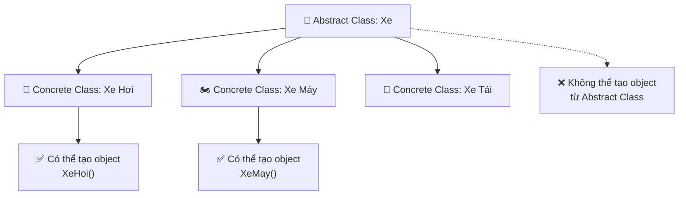

# 🎨 Abstract Classes - Khung Xương Cho Code

> **Mục tiêu**: Hiểu và sử dụng Abstract Classes để tạo ra template chuẩn cho các class khác! 🎯

## 🤔 Abstract Class Là Gì?

**Abstract Class** (Lớp trừu tượng) giống như một **bản thiết kế** hoặc **khung xương** - định nghĩa cấu trúc chung nhưng không thể tạo object trực tiếp.

### 🏗️ Ví Dụ Cuộc Sống

Hãy tưởng tượng bản thiết kế **"Xe"**:
- 📐 **Bản thiết kế chung**: Có bánh xe, động cơ, tay lái
- 🚫 **Không thể chế tạo**: Không thể tạo ra một chiếc "Xe" chung chung
- ✅ **Phải cụ thể hóa**: Xe máy, xe hơi, xe tải...



## 📚 Cách Tạo Abstract Class trong Python

Python sử dụng module `abc` (Abstract Base Classes):

```python
from abc import ABC, abstractmethod

# Cách 1: Kế thừa từ ABC
class Shape(ABC):
    """Abstract class cho các hình học"""
    
    @abstractmethod
    def tinh_dien_tich(self):
        """Phương thức trừu tượng - bắt buộc phải implement"""
        pass
    
    @abstractmethod
    def tinh_chu_vi(self):
        """Phương thức trừu tượng khác"""
        pass
    
    def hien_thi_thong_tin(self):
        """Phương thức cụ thể - có thể dùng trực tiếp"""
        print(f"🔷 Đây là hình {self.__class__.__name__}")
        print(f"📐 Diện tích: {self.tinh_dien_tich()}")
        print(f"📏 Chu vi: {self.tinh_chu_vi()}")

# Thử tạo object từ abstract class
try:
    hinh = Shape()  # ❌ Sẽ báo lỗi!
except TypeError as e:
    print(f"🚫 Lỗi: {e}")
```

## 🔺 Concrete Classes - Thực Hiện Abstract

```python
import math

class HinhTron(Shape):
    """Class cụ thể kế thừa từ Abstract Shape"""
    
    def __init__(self, ban_kinh):
        self.ban_kinh = ban_kinh
    
    def tinh_dien_tich(self):
        """Bắt buộc implement - từ abstract method"""
        return math.pi * self.ban_kinh ** 2
    
    def tinh_chu_vi(self):
        """Bắt buộc implement - từ abstract method"""
        return 2 * math.pi * self.ban_kinh
    
    def __str__(self):
        return f"🔵 Hình tròn bán kính {self.ban_kinh}"

class HinhVuong(Shape):
    """Class hình vuông"""
    
    def __init__(self, canh):
        self.canh = canh
    
    def tinh_dien_tich(self):
        return self.canh ** 2
    
    def tinh_chu_vi(self):
        return 4 * self.canh
    
    def __str__(self):
        return f"🟦 Hình vuông cạnh {self.canh}"

class HinhChuNhat(Shape):
    """Class hình chữ nhật"""
    
    def __init__(self, dai, rong):
        self.dai = dai
        self.rong = rong
    
    def tinh_dien_tich(self):
        return self.dai * self.rong
    
    def tinh_chu_vi(self):
        return 2 * (self.dai + self.rong)
    
    def __str__(self):
        return f"🟨 Hình chữ nhật {self.dai}x{self.rong}"

# Test các concrete classes
print("🎨 DEMO ABSTRACT CLASSES")
print("=" * 40)

hinh_list = [
    HinhTron(5),
    HinhVuong(4),
    HinhChuNhat(6, 3)
]

for hinh in hinh_list:
    print(f"\n{hinh}")
    hinh.hien_thi_thong_tin()
    print("-" * 25)
```

## 🎮 Ví Dụ Game: Abstract Character System

```python
from abc import ABC, abstractmethod
from enum import Enum
import random

class CharacterType(Enum):
    WARRIOR = "Chiến Binh"
    MAGE = "Pháp Sư" 
    ARCHER = "Cung Thủ"
    HEALER = "Thầy Thuốc"

class GameCharacter(ABC):
    """Abstract class cho tất cả nhân vật game"""
    
    def __init__(self, name, character_type):
        self.name = name
        self.character_type = character_type
        self.level = 1
        self.exp = 0
        self.is_alive = True
        
        # Stats sẽ được set bởi subclass
        self.hp = 0
        self.mp = 0
        self.hp_max = 0
        self.mp_max = 0
        self.attack = 0
        self.defense = 0
    
    @abstractmethod
    def setup_base_stats(self):
        """Abstract method - mỗi class phải có stats riêng"""
        pass
    
    @abstractmethod
    def special_attack(self, target):
        """Abstract method - kỹ năng đặc biệt của từng class"""
        pass
    
    @abstractmethod
    def get_class_description(self):
        """Abstract method - mô tả class"""
        pass
    
    # Concrete methods - có thể dùng trực tiếp
    def basic_attack(self, target):
        """Tấn công cơ bản - chung cho tất cả"""
        if not self.is_alive:
            print(f"💀 {self.name} đã chết, không thể tấn công!")
            return 0
        
        damage = self.attack + random.randint(-5, 10)
        actual_damage = max(1, damage - target.defense)
        
        target.take_damage(actual_damage)
        print(f"⚔️ {self.name} tấn công {target.name} gây {actual_damage} sát thương!")
        return actual_damage
    
    def take_damage(self, damage):
        """Nhận sát thương"""
        self.hp = max(0, self.hp - damage)
        
        if self.hp == 0:
            self.is_alive = False
            print(f"💀 {self.name} đã bị hạ gục!")
        else:
            print(f"🩹 {self.name} còn {self.hp}/{self.hp_max} HP")
    
    def heal(self, amount):
        """Hồi máu"""
        old_hp = self.hp
        self.hp = min(self.hp_max, self.hp + amount)
        healed = self.hp - old_hp
        
        if healed > 0:
            print(f"💚 {self.name} hồi phục {healed} HP! ({self.hp}/{self.hp_max})")
        else:
            print(f"💚 {self.name} đã đầy máu!")
    
    def level_up(self):
        """Tăng cấp"""
        self.level += 1
        self.exp = 0
        
        # Tăng stats theo level
        hp_bonus = 20
        mp_bonus = 10
        
        self.hp_max += hp_bonus
        self.mp_max += mp_bonus
        self.hp = self.hp_max  # Full HP khi lên cấp
        self.mp = self.mp_max  # Full MP khi lên cấp
        self.attack += 3
        self.defense += 2
        
        print(f"🎉 {self.name} lên cấp {self.level}!")
        print(f"   📈 HP: +{hp_bonus}, MP: +{mp_bonus}, ATK: +3, DEF: +2")
    
    def show_status(self):
        """Hiển thị trạng thái nhân vật"""
        status_icon = "💚" if self.is_alive else "💀"
        print(f"{status_icon} {self.name} - {self.character_type.value} Lv.{self.level}")
        print(f"   ❤️ HP: {self.hp}/{self.hp_max}")
        print(f"   💙 MP: {self.mp}/{self.mp_max}")
        print(f"   ⚔️ ATK: {self.attack} | 🛡️ DEF: {self.defense}")
        print(f"   🌟 EXP: {self.exp}/100")

# Concrete Classes
class Warrior(GameCharacter):
    """Chiến binh - Tank với phòng thủ cao"""
    
    def __init__(self, name):
        super().__init__(name, CharacterType.WARRIOR)
        self.setup_base_stats()
        self.rage = 0  # Thống kê đặc biệt
    
    def setup_base_stats(self):
        self.hp_max = 120
        self.mp_max = 30
        self.hp = self.hp_max
        self.mp = self.mp_max
        self.attack = 25
        self.defense = 20
    
    def special_attack(self, target):
        """Shield Bash - Tấn công + stun"""
        if self.mp < 15:
            print(f"❌ {self.name} không đủ MP cho Shield Bash!")
            return self.basic_attack(target)
        
        self.mp -= 15
        damage = self.attack * 1.8 + random.randint(0, 15)
        actual_damage = max(1, int(damage - target.defense))
        
        target.take_damage(actual_damage)
        print(f"🛡️💥 {self.name} dùng Shield Bash gây {actual_damage} sát thương!")
        print(f"😵 {target.name} bị choáng váng!")
        
        self.rage += 10
        return actual_damage
    
    def get_class_description(self):
        return "🛡️ Chiến binh dũng mãnh với khả năng phòng thủ vượt trội!"
    
    def berserker_mode(self):
        """Chế độ cuồng nộ khi máu thấp"""
        if self.hp <= self.hp_max * 0.3 and self.rage >= 50:
            self.attack += 15
            self.defense -= 5
            self.rage = 0
            print(f"😡🔥 {self.name} kích hoạt chế độ Berserker! ATK+15, DEF-5")
            return True
        return False

class Mage(GameCharacter):
    """Pháp sư - DPS magic cao"""
    
    def __init__(self, name):
        super().__init__(name, CharacterType.MAGE)
        self.setup_base_stats()
        self.mana_efficiency = 1.0
    
    def setup_base_stats(self):
        self.hp_max = 80
        self.mp_max = 100
        self.hp = self.hp_max
        self.mp = self.mp_max
        self.attack = 35  # Sát thương phép thuật cao
        self.defense = 8   # Phòng thủ thấp
    
    def special_attack(self, target):
        """Fireball - AOE damage"""
        mp_cost = int(25 * self.mana_efficiency)
        
        if self.mp < mp_cost:
            print(f"❌ {self.name} không đủ MP cho Fireball!")
            return self.basic_attack(target)
        
        self.mp -= mp_cost
        damage = self.attack * 2.2 + random.randint(5, 25)
        actual_damage = max(1, int(damage - target.defense * 0.5))  # Phép thuật bypass một phần armor
        
        target.take_damage(actual_damage)
        print(f"🔥💥 {self.name} dùng Fireball gây {actual_damage} sát thương phép thuật!")
        
        return actual_damage
    
    def get_class_description(self):
        return "🔥 Pháp sư quyền năng với phép thuật hủy diệt!"
    
    def meditate(self):
        """Thiền định để hồi MP"""
        mp_restore = 30
        self.mp = min(self.mp_max, self.mp + mp_restore)
        print(f"🧘‍♂️ {self.name} thiền định, hồi phục {mp_restore} MP! ({self.mp}/{self.mp_max})")

class Archer(GameCharacter):
    """Cung thủ - DPS vật lý + critical"""
    
    def __init__(self, name):
        super().__init__(name, CharacterType.ARCHER)
        self.setup_base_stats()
        self.critical_chance = 25  # 25% crit chance
    
    def setup_base_stats(self):
        self.hp_max = 95
        self.mp_max = 50
        self.hp = self.hp_max
        self.mp = self.mp_max
        self.attack = 30
        self.defense = 12
    
    def special_attack(self, target):
        """Multi-Shot - Bắn nhiều mũi tên"""
        if self.mp < 20:
            print(f"❌ {self.name} không đủ MP cho Multi-Shot!")
            return self.basic_attack(target)
        
        self.mp -= 20
        total_damage = 0
        arrows = 3
        
        print(f"🏹🏹🏹 {self.name} dùng Multi-Shot bắn {arrows} mũi tên!")
        
        for i in range(arrows):
            # Mỗi mũi tên có thể crit riêng
            is_crit = random.randint(1, 100) <= self.critical_chance
            base_damage = self.attack + random.randint(-3, 8)
            
            if is_crit:
                damage = int(base_damage * 1.5)
                print(f"   💥 Mũi tên {i+1}: CRITICAL HIT {damage} sát thương!")
            else:
                damage = base_damage
                print(f"   🏹 Mũi tên {i+1}: {damage} sát thương")
            
            actual_damage = max(1, damage - target.defense)
            total_damage += actual_damage
        
        target.take_damage(total_damage)
        print(f"📊 Tổng sát thương: {total_damage}")
        return total_damage
    
    def get_class_description(self):
        return "🏹 Cung thủ thiện xạ với khả năng tấn công từ xa!"

class Healer(GameCharacter):
    """Thầy thuốc - Support + healing"""
    
    def __init__(self, name):
        super().__init__(name, CharacterType.HEALER)
        self.setup_base_stats()
        self.heal_power = 40
    
    def setup_base_stats(self):
        self.hp_max = 100
        self.mp_max = 120
        self.hp = self.hp_max
        self.mp = self.mp_max
        self.attack = 18  # Tấn công yếu
        self.defense = 15
    
    def special_attack(self, target):
        """Holy Strike - Tấn công + debuff"""
        if self.mp < 20:
            print(f"❌ {self.name} không đủ MP cho Holy Strike!")
            return self.basic_attack(target)
        
        self.mp -= 20
        damage = self.attack * 1.3 + random.randint(0, 12)
        actual_damage = max(1, int(damage - target.defense))
        
        target.take_damage(actual_damage)
        print(f"✨💥 {self.name} dùng Holy Strike gây {actual_damage} sát thương thiêng liêng!")
        print(f"😇 {target.name} bị giảm sức mạnh tạm thời!")
        
        return actual_damage
    
    def get_class_description(self):
        return "✨ Thầy thuốc thiêng liêng với khả năng hồi phục kỳ diệu!"
    
    def heal_ally(self, ally):
        """Chữa lành đồng minh"""
        if self.mp < 25:
            print(f"❌ {self.name} không đủ MP để chữa lành!")
            return
        
        self.mp -= 25
        heal_amount = self.heal_power + random.randint(5, 15)
        ally.heal(heal_amount)
        print(f"✨💚 {self.name} chữa lành {ally.name} hồi phục {heal_amount} HP!")

# Character Factory
class CharacterFactory:
    """Factory tạo nhân vật từ abstract class"""
    
    @staticmethod
    def create_character(class_type, name):
        """Tạo nhân vật theo type"""
        classes = {
            CharacterType.WARRIOR: Warrior,
            CharacterType.MAGE: Mage,
            CharacterType.ARCHER: Archer,
            CharacterType.HEALER: Healer
        }
        
        if class_type in classes:
            character = classes[class_type](name)
            print(f"✅ Tạo nhân vật {name} - {character.get_class_description()}")
            return character
        else:
            raise ValueError(f"Không hỗ trợ loại nhân vật: {class_type}")

# Game Combat System
class CombatSystem:
    """Hệ thống chiến đấu sử dụng abstract characters"""
    
    def __init__(self):
        self.party = []
        self.enemies = []
    
    def add_to_party(self, character):
        self.party.append(character)
        print(f"🎮 {character.name} gia nhập party!")
    
    def create_enemies(self):
        """Tạo kẻ thù ngẫu nhiên"""
        enemy_types = [CharacterType.WARRIOR, CharacterType.MAGE, CharacterType.ARCHER]
        enemy_names = ["Orc Chiến Binh", "Ma Pháp Sư", "Cung Thủ Bóng Tối"]
        
        for i in range(2):
            enemy_type = random.choice(enemy_types)
            enemy_name = f"{random.choice(enemy_names)} #{i+1}"
            enemy = CharacterFactory.create_character(enemy_type, enemy_name)
            self.enemies.append(enemy)
    
    def combat_turn(self):
        """Một lượt chiến đấu"""
        print(f"\n⚔️ LƯỢT CHIẾN ĐẤU")
        print("=" * 40)
        
        # Party tấn công
        for character in [c for c in self.party if c.is_alive]:
            targets = [e for e in self.enemies if e.is_alive]
            if targets:
                target = random.choice(targets)
                
                # Polymorphism: Mỗi class có special attack khác nhau!
                if character.mp >= 15 and random.randint(1, 100) <= 40:
                    character.special_attack(target)
                else:
                    character.basic_attack(target)
        
        # Enemies phản công
        for enemy in [e for e in self.enemies if e.is_alive]:
            targets = [c for c in self.party if c.is_alive]
            if targets:
                target = random.choice(targets)
                enemy.basic_attack(target)
        
        # Loại bỏ kẻ đã chết
        self.enemies = [e for e in self.enemies if e.is_alive]
        self.party = [c for c in self.party if c.is_alive]
    
    def show_battle_status(self):
        """Hiển thị trạng thái trận đấu"""
        print(f"\n📊 TRẠNG THÁI TRẬN ĐẤU")
        print("-" * 30)
        
        print("🟢 PARTY:")
        for char in self.party:
            char.show_status()
        
        print("\n🔴 ENEMIES:")
        for enemy in self.enemies:
            enemy.show_status()
    
    def check_battle_end(self):
        """Kiểm tra kết thúc trận đấu"""
        if not self.party:
            print("\n💀 THUA CUỘC! Party đã bị tiêu diệt!")
            return True
        elif not self.enemies:
            print("\n🎉 CHIẾN THẮNG! Đã tiêu diệt tất cả kẻ thù!")
            return True
        return False
    
    def start_battle(self):
        """Bắt đầu trận đấu"""
        print("🎮 BẮT ĐẦU TRẬN ĐẤU RPG!")
        print("=" * 50)
        
        # Tạo party
        party_configs = [
            (CharacterType.WARRIOR, "Arthur"),
            (CharacterType.MAGE, "Merlin"),
            (CharacterType.ARCHER, "Legolas"),
            (CharacterType.HEALER, "Gandalf")
        ]
        
        for char_type, name in party_configs:
            character = CharacterFactory.create_character(char_type, name)
            self.add_to_party(character)
        
        # Tạo kẻ thù
        self.create_enemies()
        
        # Combat loop
        turn = 1
        while not self.check_battle_end() and turn <= 15:
            print(f"\n🔄 === TURN {turn} ===")
            self.combat_turn()
            self.show_battle_status()
            turn += 1
            
            if turn <= 15 and not self.check_battle_end():
                input("\nNhấn Enter để tiếp tục...")

# Demo Abstract Classes
print("🎨 DEMO ABSTRACT CLASSES IN GAME SYSTEM")
print("=" * 60)

# Thử tạo object từ abstract class
try:
    abstract_char = GameCharacter("Test", CharacterType.WARRIOR)
except TypeError as e:
    print(f"🚫 Không thể tạo object từ Abstract Class:")
    print(f"   {e}")

print(f"\n✅ Nhưng có thể tạo từ Concrete Classes:")

# Tạo từng loại nhân vật
warriors = Warrior("Conan")
mage = Mage("Gandalf")
archer = Archer("Robin Hood")
healer = Healer("Priestess")

characters = [warriors, mage, archer, healer]

print(f"\n👥 PARTY MEMBERS:")
for char in characters:
    print(f"   {char.get_class_description()}")
    char.show_status()
    print()

# Bắt đầu game
print(f"\n🎮 Bắt đầu trận chiến demo...")
input("Nhấn Enter để tiếp tục...")

combat = CombatSystem()
combat.start_battle()
```

## 🏭 Abstract Factory Pattern

```python
from abc import ABC, abstractmethod

# Abstract Products
class Button(ABC):
    @abstractmethod
    def render(self):
        pass
    
    @abstractmethod
    def click(self):
        pass

class Dialog(ABC):
    @abstractmethod
    def render(self):
        pass

# Concrete Products cho Windows
class WindowsButton(Button):
    def render(self):
        print("🪟 Render Windows-style button")
    
    def click(self):
        print("🖱️ Windows button clicked!")

class WindowsDialog(Dialog):
    def render(self):
        print("🪟 Render Windows-style dialog")

# Concrete Products cho Mac
class MacButton(Button):
    def render(self):
        print("🍎 Render Mac-style button")
    
    def click(self):
        print("🖱️ Mac button clicked!")

class MacDialog(Dialog):
    def render(self):
        print("🍎 Render Mac-style dialog")

# Abstract Factory
class UIFactory(ABC):
    @abstractmethod
    def create_button(self) -> Button:
        pass
    
    @abstractmethod
    def create_dialog(self) -> Dialog:
        pass

# Concrete Factories
class WindowsFactory(UIFactory):
    def create_button(self) -> Button:
        return WindowsButton()
    
    def create_dialog(self) -> Dialog:
        return WindowsDialog()

class MacFactory(UIFactory):
    def create_button(self) -> Button:
        return MacButton()
    
    def create_dialog(self) -> Dialog:
        return MacDialog()

# Application sử dụng Abstract Factory
class Application:
    def __init__(self, factory: UIFactory):
        self.factory = factory
    
    def create_ui(self):
        """Tạo UI không cần biết platform cụ thể"""
        button = self.factory.create_button()
        dialog = self.factory.create_dialog()
        
        button.render()
        dialog.render()
        button.click()

# Demo Factory Pattern
print("🏭 DEMO ABSTRACT FACTORY PATTERN")
print("=" * 40)

# Detect platform (giả lập)
import platform
os_name = platform.system()

print(f"💻 Detecting OS: {os_name}")

# Chọn factory theo platform
if "Windows" in os_name:
    factory = WindowsFactory()
    print("🪟 Using Windows UI Factory")
else:
    factory = MacFactory()
    print("🍎 Using Mac UI Factory")

# Tạo app với factory phù hợp
app = Application(factory)
app.create_ui()
```

## 📊 Template Method Pattern

```python
from abc import ABC, abstractmethod

class DataProcessor(ABC):
    """Template cho xử lý dữ liệu"""
    
    def process_data(self):
        """Template method - định nghĩa workflow"""
        print("📊 BẮT ĐẦU XỬ LÝ DỮ LIỆU")
        print("=" * 30)
        
        # Step 1: Load data
        data = self.load_data()
        
        # Step 2: Validate
        if self.validate_data(data):
            # Step 3: Transform
            processed_data = self.transform_data(data)
            
            # Step 4: Save
            self.save_data(processed_data)
            
            # Step 5: Cleanup
            self.cleanup()
            
            print("✅ Xử lý hoàn thành!")
        else:
            print("❌ Dữ liệu không hợp lệ!")
    
    @abstractmethod
    def load_data(self):
        """Abstract - mỗi processor load khác nhau"""
        pass
    
    @abstractmethod
    def transform_data(self, data):
        """Abstract - mỗi processor transform khác nhau"""
        pass
    
    @abstractmethod
    def save_data(self, data):
        """Abstract - mỗi processor save khác nhau"""
        pass
    
    def validate_data(self, data):
        """Hook method - có implementation mặc định"""
        print("🔍 Kiểm tra dữ liệu...")
        return data is not None and len(data) > 0
    
    def cleanup(self):
        """Hook method - có thể override nếu cần"""
        print("🧹 Dọn dẹp tài nguyên...")

class CSVProcessor(DataProcessor):
    """Processor cho file CSV"""
    
    def __init__(self, filename):
        self.filename = filename
    
    def load_data(self):
        print(f"📂 Đọc file CSV: {self.filename}")
        # Giả lập đọc CSV
        return ["row1,data1", "row2,data2", "row3,data3"]
    
    def transform_data(self, data):
        print("🔄 Chuyển đổi CSV thành dict...")
        # Giả lập transform
        return [{"id": i, "data": row} for i, row in enumerate(data)]
    
    def save_data(self, data):
        print(f"💾 Lưu {len(data)} records vào database")

class JSONProcessor(DataProcessor):
    """Processor cho file JSON"""
    
    def __init__(self, api_url):
        self.api_url = api_url
    
    def load_data(self):
        print(f"🌐 Tải JSON từ API: {self.api_url}")
        # Giả lập API call
        return {"users": [{"name": "An"}, {"name": "Bình"}]}
    
    def transform_data(self, data):
        print("🔄 Chuẩn hóa JSON data...")
        return data.get("users", [])
    
    def save_data(self, data):
        print(f"💾 Xuất {len(data)} users ra file JSON")
    
    def cleanup(self):
        print("🧹 Đóng connection API...")

# Demo Template Method
print("📊 DEMO TEMPLATE METHOD PATTERN")
print("=" * 40)

processors = [
    CSVProcessor("data.csv"),
    JSONProcessor("https://api.example.com/users")
]

for processor in processors:
    processor.process_data()
    print()
```

## 🏆 Tóm Tắt Abstract Classes

:::tip Nhớ 5 điều này về Abstract Classes:
1. **Blueprint Pattern** - Định nghĩa cấu trúc chung cho subclasses
2. **Cannot Instantiate** - Không thể tạo object trực tiếp từ abstract class  
3. **Must Implement** - Subclass bắt buộc implement các abstract methods
4. **Mix Concrete & Abstract** - Có thể có cả concrete methods và abstract methods
5. **Design Patterns** - Base cho Template Method, Factory patterns...
:::

### 🌟 Khi Nào Dùng Abstract Classes:

- 🏗️ **Framework Development** - Tạo base classes cho framework
- 🎮 **Game Systems** - Character systems, AI behaviors
- 🏭 **Factory Patterns** - Abstract factories cho object creation
- 📊 **Template Methods** - Định nghĩa workflow chung
- 🔧 **Plugin Architecture** - Base interface cho plugins

### 📋 So Sánh Abstract vs Interface:

| Abstract Classes | Interfaces (Python Protocols) |
|------------------|-------------------------------|
| Có concrete methods | Chỉ có method signatures |
| Kế thừa đơn | Multiple inheritance |
| Có attributes | Không có attributes |
| Partial implementation | Pure contracts |

**Abstract Classes** giúp bạn tạo ra kiến trúc code chắc chắn và nhất quán! 🎨✨

---

*💡 Tip: Abstract Classes như bản thiết kế kiến trúc - đảm bảo tất cả "ngôi nhà" đều có cấu trúc chuẩn!*

---
**Behitek - Học lập trình Python một cách dễ hiểu nhất! 🚀**
