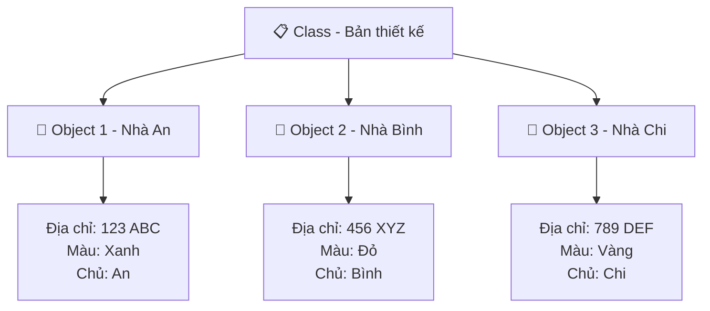

# 🏗️ Class và Object - Lập Trình Hướng Đối Tượng Siêu Dễ

> **Mục tiêu**: Hiểu và sử dụng Class & Object để lập trình như một kiến trúc sư code! 🎯

## 🤔 Class và Object Là Gì? (Giải Thích Siêu Dễ)

### 🏠 Hãy Tưởng Tượng...

**Class** giống như **bản thiết kế ngôi nhà**:
- 📋 Có sẵn kế hoạch: 3 phòng ngủ, 2 phòng tắm, 1 bếp
- 🎨 Mô tả màu sơn, kiểu cửa, loại gạch
- ⚡ Quy định cách lắp điện, nước

**Object** giống như **ngôi nhà thật được xây**:
- 🏡 Nhà của gia đình An ở số 123 đường ABC
- 🏡 Nhà của gia đình Bình ở số 456 đường XYZ
- 🏡 Mỗi nhà có địa chỉ khác nhau nhưng cùng thiết kế



## 👤 Ví Dụ Đầu Tiên: Class Học Sinh

```python
class HocSinh:
    """Class mô tả một học sinh"""
    
    def __init__(self, ho_ten, tuoi, lop):
        """Hàm khởi tạo - giống như lấy thông tin khi nhập học"""
        self.ho_ten = ho_ten  # Thuộc tính: Họ tên
        self.tuoi = tuoi      # Thuộc tính: Tuổi  
        self.lop = lop        # Thuộc tính: Lớp
        self.diem_so = []     # Thuộc tính: Danh sách điểm
        
    def gioi_thieu(self):
        """Phương thức - hành động tự giới thiệu"""
        return f"Xin chào! Tôi là {self.ho_ten}, {self.tuoi} tuổi, học lớp {self.lop}"
    
    def them_diem(self, diem):
        """Phương thức - thêm điểm vào danh sách"""
        self.diem_so.append(diem)
        print(f"✅ Đã thêm điểm {diem} cho {self.ho_ten}")
    
    def tinh_diem_trung_binh(self):
        """Phương thức - tính điểm trung bình"""
        if len(self.diem_so) == 0:
            return 0
        return sum(self.diem_so) / len(self.diem_so)

# Tạo các object (instance) từ class
hoc_sinh_1 = HocSinh("Nguyễn Văn An", 16, "10A")
hoc_sinh_2 = HocSinh("Trần Thị Bình", 15, "9B")

# Sử dụng các object
print(hoc_sinh_1.gioi_thieu())
print(hoc_sinh_2.gioi_thieu())

# Thêm điểm cho học sinh
hoc_sinh_1.them_diem(8.5)
hoc_sinh_1.them_diem(9.0)
hoc_sinh_2.them_diem(7.5)

# Tính điểm trung bình
print(f"Điểm TB của {hoc_sinh_1.ho_ten}: {hoc_sinh_1.tinh_diem_trung_binh():.1f}")
print(f"Điểm TB của {hoc_sinh_2.ho_ten}: {hoc_sinh_2.tinh_diem_trung_binh():.1f}")
```

## 🧩 Các Thành Phần Của Class

### 1. 🏷️ **Thuộc Tính (Attributes)**
Giống như **thông tin cá nhân** của object:

```python
class XeMay:
    def __init__(self, hang, mau_sac, nam_san_xuat):
        self.hang = hang                    # Hãng xe
        self.mau_sac = mau_sac             # Màu sắc
        self.nam_san_xuat = nam_san_xuat   # Năm sản xuất
        self.toc_do_hien_tai = 0           # Tốc độ hiện tại
        self.dang_chay = False             # Trạng thái

# Tạo xe máy
xe_an = XeMay("Honda", "Đỏ", 2023)
xe_binh = XeMay("Yamaha", "Xanh", 2022)

# Truy cập thuộc tính
print(f"Xe của An: {xe_an.hang} {xe_an.mau_sac}")
print(f"Xe của Bình: {xe_binh.hang} {xe_binh.mau_sac}")
```

### 2. 🎬 **Phương Thức (Methods)**
Giống như **hành động** mà object có thể làm:

```python
class XeMay:
    def __init__(self, hang, mau_sac, nam_san_xuat):
        self.hang = hang
        self.mau_sac = mau_sac
        self.nam_san_xuat = nam_san_xuat
        self.toc_do_hien_tai = 0
        self.dang_chay = False
        
    def khoi_dong(self):
        """Khởi động xe"""
        if not self.dang_chay:
            self.dang_chay = True
            print(f"🏍️ {self.hang} {self.mau_sac} đã khởi động! Brmmm...")
        else:
            print("⚠️ Xe đang chạy rồi!")
    
    def tat_may(self):
        """Tắt máy xe"""
        if self.dang_chay:
            self.dang_chay = False
            self.toc_do_hien_tai = 0
            print(f"🛑 {self.hang} {self.mau_sac} đã tắt máy.")
        else:
            print("⚠️ Xe đã tắt rồi!")
    
    def tang_toc(self, muc_tang=10):
        """Tăng tốc độ"""
        if self.dang_chay:
            self.toc_do_hien_tai += muc_tang
            print(f"🚀 Tăng tốc! Hiện tại: {self.toc_do_hien_tai} km/h")
        else:
            print("❌ Hãy khởi động xe trước!")
    
    def giam_toc(self, muc_giam=10):
        """Giảm tốc độ"""
        if self.dang_chay:
            self.toc_do_hien_tai = max(0, self.toc_do_hien_tai - muc_giam)
            print(f"🐌 Giảm tốc! Hiện tại: {self.toc_do_hien_tai} km/h")
    
    def thong_tin_xe(self):
        """Hiển thị thông tin xe"""
        trang_thai = "Đang chạy" if self.dang_chay else "Đã tắt"
        return f"""
        🏍️ THÔNG TIN XE:
        - Hãng: {self.hang}
        - Màu: {self.mau_sac}
        - Năm SX: {self.nam_san_xuat}
        - Trạng thái: {trang_thai}
        - Tốc độ: {self.toc_do_hien_tai} km/h
        """

# Test xe máy
xe_cua_toi = XeMay("Honda Wave", "Đỏ đô", 2023)

print(xe_cua_toi.thong_tin_xe())
xe_cua_toi.khoi_dong()
xe_cua_toi.tang_toc(20)
xe_cua_toi.tang_toc(15)
xe_cua_toi.giam_toc(5)
print(xe_cua_toi.thong_tin_xe())
xe_cua_toi.tat_may()
```

## 🎮 Ví Dụ Thực Tế: Game RPG Đơn Giản

```python
import random

class NhanVat:
    """Class mô tả nhân vật trong game"""
    
    def __init__(self, ten, hp=100, mp=50, suc_manh=10):
        self.ten = ten
        self.hp_max = hp
        self.hp_hien_tai = hp
        self.mp_max = mp  
        self.mp_hien_tai = mp
        self.suc_manh = suc_manh
        self.kinh_nghiem = 0
        self.cap_do = 1
        
    def tan_cong(self, muc_tieu):
        """Tấn công một mục tiêu"""
        sat_thuong = random.randint(self.suc_manh - 2, self.suc_manh + 2)
        muc_tieu.nhan_sat_thuong(sat_thuong)
        print(f"⚔️ {self.ten} tấn công {muc_tieu.ten} gây {sat_thuong} sát thương!")
        
    def nhan_sat_thuong(self, sat_thuong):
        """Nhận sát thương"""
        self.hp_hien_tai = max(0, self.hp_hien_tai - sat_thuong)
        if self.hp_hien_tai == 0:
            print(f"💀 {self.ten} đã bị đánh bại!")
        else:
            print(f"🩸 {self.ten} còn {self.hp_hien_tai}/{self.hp_max} HP")
    
    def hoi_phuc(self, luong_hoi=20):
        """Hồi phục HP"""
        if self.mp_hien_tai >= 10:
            self.hp_hien_tai = min(self.hp_max, self.hp_hien_tai + luong_hoi)
            self.mp_hien_tai -= 10
            print(f"✨ {self.ten} hồi phục {luong_hoi} HP! (HP: {self.hp_hien_tai}/{self.hp_max})")
        else:
            print(f"❌ {self.ten} không đủ MP để hồi phục!")
    
    def nang_cap(self):
        """Nâng cấp nhân vật"""
        self.cap_do += 1
        self.hp_max += 20
        self.mp_max += 10
        self.suc_manh += 3
        self.hp_hien_tai = self.hp_max
        self.mp_hien_tai = self.mp_max
        print(f"🎉 {self.ten} lên cấp {self.cap_do}! Tất cả chỉ số tăng!")
    
    def hien_thi_thong_tin(self):
        """Hiển thị thông tin nhân vật"""
        return f"""
        🏷️ TÊN: {self.ten}
        ⚡ CẤP ĐỘ: {self.cap_do}
        ❤️ HP: {self.hp_hien_tai}/{self.hp_max}
        💙 MP: {self.mp_hien_tai}/{self.mp_max} 
        💪 SỨC MẠNH: {self.suc_manh}
        🌟 KINH NGHIỆM: {self.kinh_nghiem}
        """
    
    def con_song(self):
        """Kiểm tra nhân vật còn sống không"""
        return self.hp_hien_tai > 0

# Tạo nhân vật và quái vật
nguoi_choi = NhanVat("Hiệp Sĩ Behitek", hp=120, mp=60, suc_manh=15)
quai_vat = NhanVat("Goblin Xấu Xa", hp=80, mp=30, suc_manh=8)

print("🎮 BẮT ĐẦU TRẬN CHIẾN!")
print(nguoi_choi.hien_thi_thong_tin())
print(quai_vat.hien_thi_thong_tin())

# Vòng lặp chiến đấu
luot = 1
while nguoi_choi.con_song() and quai_vat.con_song():
    print(f"\n--- LƯỢT {luot} ---")
    
    # Lượt người chơi
    if random.choice([True, False, False]):  # 1/3 xác suất hồi phục
        nguoi_choi.hoi_phuc()
    else:
        nguoi_choi.tan_cong(quai_vat)
    
    # Lượt quái vật (nếu còn sống)
    if quai_vat.con_song():
        quai_vat.tan_cong(nguoi_choi)
    
    luot += 1

# Kết quả trận đấu
if nguoi_choi.con_song():
    print(f"\n🏆 {nguoi_choi.ten} thắng!")
    nguoi_choi.kinh_nghiem += 50
    if nguoi_choi.kinh_nghiem >= 100:
        nguoi_choi.nang_cap()
else:
    print(f"\n💀 {quai_vat.ten} thắng!")

print("\n📊 THÔNG TIN CUỐI TRẬN:")
print(nguoi_choi.hien_thi_thong_tin())
```

## 🏪 Ví Dụ Thực Tế: Hệ Thống Cửa Hàng

```python
from datetime import datetime

class SanPham:
    """Class mô tả sản phẩm"""
    
    def __init__(self, ma_sp, ten, gia, so_luong):
        self.ma_sp = ma_sp
        self.ten = ten
        self.gia = gia
        self.so_luong = so_luong
        self.ngay_tao = datetime.now()
    
    def cap_nhat_so_luong(self, so_luong_moi):
        """Cập nhật số lượng sản phẩm"""
        self.so_luong = so_luong_moi
        print(f"📦 Cập nhật {self.ten}: {so_luong_moi} sản phẩm")
    
    def ban_san_pham(self, so_luong_ban):
        """Bán sản phẩm"""
        if so_luong_ban <= self.so_luong:
            self.so_luong -= so_luong_ban
            tong_tien = so_luong_ban * self.gia
            print(f"💰 Bán {so_luong_ban} {self.ten} = {tong_tien:,} VNĐ")
            return tong_tien
        else:
            print(f"❌ Không đủ hàng! Chỉ còn {self.so_luong} {self.ten}")
            return 0
    
    def __str__(self):
        return f"{self.ma_sp} - {self.ten}: {self.gia:,}đ (SL: {self.so_luong})"

class KhachHang:
    """Class mô tả khách hàng"""
    
    def __init__(self, ma_kh, ho_ten, so_dien_thoai):
        self.ma_kh = ma_kh
        self.ho_ten = ho_ten
        self.so_dien_thoai = so_dien_thoai
        self.lich_su_mua_hang = []
        self.tong_chi_tieu = 0
    
    def mua_hang(self, san_pham, so_luong):
        """Mua sản phẩm"""
        tien_phai_tra = san_pham.ban_san_pham(so_luong)
        if tien_phai_tra > 0:
            don_hang = {
                'san_pham': san_pham.ten,
                'so_luong': so_luong,
                'gia': san_pham.gia,
                'tong_tien': tien_phai_tra,
                'thoi_gian': datetime.now()
            }
            self.lich_su_mua_hang.append(don_hang)
            self.tong_chi_tieu += tien_phai_tra
            print(f"✅ {self.ho_ten} đã mua thành công!")
    
    def xem_lich_su(self):
        """Xem lịch sử mua hàng"""
        print(f"\n🛍️ LỊCH SỬ MUA HÀNG - {self.ho_ten}")
        print("-" * 50)
        for i, don in enumerate(self.lich_su_mua_hang, 1):
            print(f"{i}. {don['san_pham']} x{don['so_luong']} = {don['tong_tien']:,}đ")
            print(f"   Thời gian: {don['thoi_gian'].strftime('%d/%m/%Y %H:%M')}")
        print(f"💵 TỔNG CHI TIÊU: {self.tong_chi_tieu:,} VNĐ")

class CuaHang:
    """Class quản lý cửa hàng"""
    
    def __init__(self, ten_cua_hang):
        self.ten_cua_hang = ten_cua_hang
        self.danh_sach_san_pham = {}
        self.danh_sach_khach_hang = {}
        self.doanh_thu = 0
    
    def them_san_pham(self, san_pham):
        """Thêm sản phẩm vào cửa hàng"""
        self.danh_sach_san_pham[san_pham.ma_sp] = san_pham
        print(f"➕ Đã thêm {san_pham.ten} vào cửa hàng")
    
    def them_khach_hang(self, khach_hang):
        """Thêm khách hàng"""
        self.danh_sach_khach_hang[khach_hang.ma_kh] = khach_hang
        print(f"👤 Chào mừng khách hàng {khach_hang.ho_ten}!")
    
    def hien_thi_san_pham(self):
        """Hiển thị danh sách sản phẩm"""
        print(f"\n🏪 DANH SÁCH SẢN PHẨM - {self.ten_cua_hang}")
        print("-" * 60)
        for sp in self.danh_sach_san_pham.values():
            print(f"  {sp}")
    
    def bao_cao_doanh_thu(self):
        """Báo cáo doanh thu"""
        tong_doanh_thu = sum(kh.tong_chi_tieu for kh in self.danh_sach_khach_hang.values())
        print(f"\n📊 BÁO CÁO DOANH THU - {self.ten_cua_hang}")
        print("-" * 50)
        print(f"💰 Tổng doanh thu: {tong_doanh_thu:,} VNĐ")
        print(f"👥 Số khách hàng: {len(self.danh_sach_khach_hang)}")
        print(f"📦 Số sản phẩm: {len(self.danh_sach_san_pham)}")

# Sử dụng hệ thống cửa hàng
cua_hang = CuaHang("Behitek Store")

# Tạo sản phẩm
laptop = SanPham("LAP001", "Laptop Dell", 15000000, 5)
chuot = SanPham("CHU001", "Chuột Gaming", 500000, 20)
ban_phim = SanPham("BP001", "Bàn phím cơ", 1200000, 10)

# Thêm sản phẩm vào cửa hàng
cua_hang.them_san_pham(laptop)
cua_hang.them_san_pham(chuot)
cua_hang.them_san_pham(ban_phim)

# Tạo khách hàng
khach_1 = KhachHang("KH001", "Nguyễn Văn An", "0901234567")
khach_2 = KhachHang("KH002", "Trần Thị Bình", "0987654321")

# Thêm khách hàng
cua_hang.them_khach_hang(khach_1)
cua_hang.them_khach_hang(khach_2)

# Hiển thị sản phẩm
cua_hang.hien_thi_san_pham()

# Khách hàng mua hàng
khach_1.mua_hang(laptop, 1)
khach_1.mua_hang(chuot, 2)
khach_2.mua_hang(ban_phim, 1)
khach_2.mua_hang(chuot, 1)

# Xem lịch sử
khach_1.xem_lich_su()
khach_2.xem_lich_su()

# Báo cáo doanh thu
cua_hang.bao_cao_doanh_thu()
```

## 🔍 Các Khái Niệm Quan Trọng

### 1. 🏠 **`__init__` Method (Constructor)**
- Hàm **khởi tạo** chạy khi tạo object mới
- Giống như **điền form thông tin** khi đăng ký

### 2. 🔑 **`self` Parameter**
- Đại diện cho **chính object đó**
- Giống như từ **"tôi"** khi nói về bản thân

### 3. 🏷️ **Instance Variables vs Class Variables**

```python
class HocSinh:
    # Class variable - chung cho tất cả học sinh
    truong_hoc = "THPT Behitek"
    so_hoc_sinh = 0
    
    def __init__(self, ten):
        # Instance variable - riêng cho từng học sinh
        self.ten = ten
        HocSinh.so_hoc_sinh += 1
    
    def gioi_thieu(self):
        return f"Tôi là {self.ten}, học tại {HocSinh.truong_hoc}"

# Test
an = HocSinh("An")
binh = HocSinh("Bình")

print(an.gioi_thieu())
print(f"Tổng số học sinh: {HocSinh.so_hoc_sinh}")
```

## 💡 Mẹo Hay Ho

1. **Đặt tên class viết hoa** - `HocSinh`, không phải `hoc_sinh`
2. **Docstring cho class** - Giải thích class làm gì
3. **Method ngắn gọn** - Mỗi method làm một việc
4. **Thuộc tính private** - Dùng `_` hoặc `__` phía trước
5. **Kiểm tra dữ liệu đầu vào** - Validate trong `__init__`

## 🎮 Bài Tập Thực Hành

### 🏆 Bài 1: Quản Lý Thư Viện
Tạo class `Sach` và `ThuVien` để:
- Quản lý danh sách sách
- Cho mượn và trả sách
- Theo dõi người mượn

### 🏆 Bài 2: Game Pokémon Đơn Giản
Tạo class `Pokemon` với:
- Thuộc tính: tên, loại, HP, kỹ năng
- Phương thức: tấn công, hồi phục, nâng cấp

### 🏆 Bài 3: Hệ Thống Banking
Tạo class `TaiKhoan` với:
- Gửi tiền, rút tiền
- Chuyển khoản
- Lịch sử giao dịch

## 🔗 Kiến Thức Liên Quan

- **[Kế Thừa (Inheritance)](./inheritance.md)** - Tạo class con từ class cha
- **[Module và Package](./modules-and-packages.md)** - Tổ chức class vào module
- **[Xử Lý Lỗi](../intermediate/error-handling.md)** - Xử lý lỗi trong class

---

*🎉 **Chúc mừng!** Bạn đã hiểu được Class và Object - nền tảng của lập trình hướng đối tượng! Giờ bạn có thể tạo ra những "blueprint" cho code của mình! 🚀*
