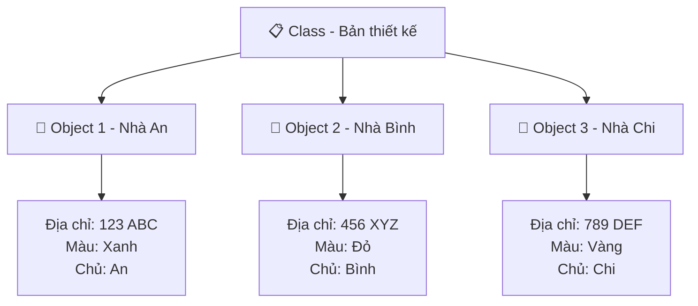

# 🏗️ Class và Object - Lập Trình Hướng Đối Tượng Siêu Dễ

> **Mục tiêu**: Hiểu và sử dụng Class & Object để lập trình như một kiến trúc sư code! 🎯

## 🤔 Class và Object Là Gì? (Giải Thích Siêu Dễ)

### 🏠 Hãy Tưởng Tượng...

**Class** giống như **bản thiết kế ngôi nhà**:
- 📋 Có sẵn kế hoạch: 3 phòng ngủ, 2 phòng tắm, 1 bếp
- 🎨 Mô tả màu sơn, kiểu cửa, loại gạch
- ⚡ Quy định cách lắp điện, nước

**Object** giống như **ngôi nhà thật được xây**:
- 🏡 Nhà của gia đình An ở số 123 đường ABC
- 🏡 Nhà của gia đình Bình ở số 456 đường XYZ
- 🏡 Mỗi nhà có địa chỉ khác nhau nhưng cùng thiết kế



## 👤 Ví Dụ Đầu Tiên: Class Học Sinh

```python
class Student:
    """Class mô tả một học sinh"""
    
    def __init__(self, full_name, age, class_name):
        """Hàm khởi tạo - giống như lấy thông tin khi nhập học"""
        self.full_name = full_name  # Thuộc tính: Họ tên
        self.age = age              # Thuộc tính: Tuổi  
        self.class_name = class_name  # Thuộc tính: Lớp
        self.scores = []            # Thuộc tính: Danh sách điểm
        
    def introduce(self):
        """Phương thức - hành động tự giới thiệu"""
        return f"Xin chào! Tôi là {self.full_name}, {self.age} tuổi, học lớp {self.class_name}"
    
    def add_score(self, score):
        """Phương thức - thêm điểm vào danh sách"""
        self.scores.append(score)
        print(f"✅ Đã thêm điểm {score} cho {self.full_name}")
    
    def calculate_average_score(self):
        """Phương thức - tính điểm trung bình"""
        if len(self.scores) == 0:
            return 0
        return sum(self.scores) / len(self.scores)

# Tạo các object (instance) từ class
student_1 = Student("Nguyễn Văn An", 16, "10A")
student_2 = Student("Trần Thị Bình", 15, "9B")

# Sử dụng các object
print(student_1.introduce())
print(student_2.introduce())

# Thêm điểm cho học sinh
student_1.add_score(8.5)
student_1.add_score(9.0)
student_2.add_score(7.5)

# Tính điểm trung bình
print(f"Điểm TB của {student_1.full_name}: {student_1.calculate_average_score():.1f}")
print(f"Điểm TB của {student_2.full_name}: {student_2.calculate_average_score():.1f}")
```

## 🧩 Các Thành Phần Của Class

### 1. 🏷️ **Thuộc Tính (Attributes)**
Giống như **thông tin cá nhân** của object:

```python
class Motorcycle:
    def __init__(self, brand, color, year):
        self.brand = brand                  # Hãng xe
        self.color = color                  # Màu sắc
        self.year = year                    # Năm sản xuất
        self.current_speed = 0              # Tốc độ hiện tại
        self.is_running = False             # Trạng thái

# Tạo xe máy
an_motorcycle = Motorcycle("Honda", "Đỏ", 2023)
binh_motorcycle = Motorcycle("Yamaha", "Xanh", 2022)

# Truy cập thuộc tính
print(f"Xe của An: {an_motorcycle.brand} {an_motorcycle.color}")
print(f"Xe của Bình: {binh_motorcycle.brand} {binh_motorcycle.color}")
```

### 2. 🎬 **Phương Thức (Methods)**
Giống như **hành động** mà object có thể làm:

```python
class Motorcycle:
    def __init__(self, brand, color, year):
        self.brand = brand
        self.color = color
        self.year = year
        self.current_speed = 0
        self.is_running = False
        
    def start_engine(self):
        """Khởi động xe"""
        if not self.is_running:
            self.is_running = True
            print(f"🏍️ {self.brand} {self.color} đã khởi động! Brmmm...")
        else:
            print("⚠️ Xe đang chạy rồi!")
    
    def stop_engine(self):
        """Tắt máy xe"""
        if self.is_running:
            self.is_running = False
            self.current_speed = 0
            print(f"🛑 {self.brand} {self.color} đã tắt máy.")
        else:
            print("⚠️ Xe đã tắt rồi!")
    
    def accelerate(self, speed_increase=10):
        """Tăng tốc độ"""
        if self.is_running:
            self.current_speed += speed_increase
            print(f"🚀 Tăng tốc! Hiện tại: {self.current_speed} km/h")
        else:
            print("❌ Hãy khởi động xe trước!")
    
    def decelerate(self, speed_decrease=10):
        """Giảm tốc độ"""
        if self.is_running:
            self.current_speed = max(0, self.current_speed - speed_decrease)
            print(f"🐌 Giảm tốc! Hiện tại: {self.current_speed} km/h")
    
    def get_info(self):
        """Hiển thị thông tin xe"""
        status = "Đang chạy" if self.is_running else "Đã tắt"
        return f"""
        🏍️ THÔNG TIN XE:
        - Hãng: {self.brand}
        - Màu: {self.color}
        - Năm SX: {self.year}
        - Trạng thái: {status}
        - Tốc độ: {self.current_speed} km/h
        """

# Test xe máy
my_motorcycle = Motorcycle("Honda Wave", "Đỏ đô", 2023)

print(my_motorcycle.get_info())
my_motorcycle.start_engine()
my_motorcycle.accelerate(20)
my_motorcycle.accelerate(15)
my_motorcycle.decelerate(5)
print(my_motorcycle.get_info())
my_motorcycle.stop_engine()
```

## 🎮 Ví Dụ Thực Tế: Game RPG Đơn Giản

```python
import random

class Character:
    """Class mô tả nhân vật trong game"""
    
    def __init__(self, name, hp=100, mp=50, strength=10):
        self.name = name
        self.max_hp = hp
        self.current_hp = hp
        self.max_mp = mp  
        self.current_mp = mp
        self.strength = strength
        self.experience = 0
        self.level = 1
        
    def attack(self, target):
        """Tấn công một mục tiêu"""
        damage = random.randint(self.strength - 2, self.strength + 2)
        target.take_damage(damage)
        print(f"⚔️ {self.name} tấn công {target.name} gây {damage} sát thương!")
        
    def take_damage(self, damage):
        """Nhận sát thương"""
        self.current_hp = max(0, self.current_hp - damage)
        if self.current_hp == 0:
            print(f"💀 {self.name} đã bị đánh bại!")
        else:
            print(f"🩸 {self.name} còn {self.current_hp}/{self.max_hp} HP")
    
    def heal(self, heal_amount=20):
        """Hồi phục HP"""
        if self.current_mp >= 10:
            self.current_hp = min(self.max_hp, self.current_hp + heal_amount)
            self.current_mp -= 10
            print(f"✨ {self.name} hồi phục {heal_amount} HP! (HP: {self.current_hp}/{self.max_hp})")
        else:
            print(f"❌ {self.name} không đủ MP để hồi phục!")
    
    def level_up(self):
        """Nâng cấp nhân vật"""
        self.level += 1
        self.max_hp += 20
        self.max_mp += 10
        self.strength += 3
        self.current_hp = self.max_hp
        self.current_mp = self.max_mp
        print(f"🎉 {self.name} lên cấp {self.level}! Tất cả chỉ số tăng!")
    
    def display_info(self):
        """Hiển thị thông tin nhân vật"""
        return f"""
        🏷️ TÊN: {self.name}
        ⚡ CẤP ĐỘ: {self.level}
        ❤️ HP: {self.current_hp}/{self.max_hp}
        💙 MP: {self.current_mp}/{self.max_mp} 
        💪 SỨC MẠNH: {self.strength}
        🌟 KINH NGHIỆM: {self.experience}
        """
    
    def is_alive(self):
        """Kiểm tra nhân vật còn sống không"""
        return self.current_hp > 0

# Tạo nhân vật và quái vật
player = Character("Hiệp Sĩ Behitek", hp=120, mp=60, strength=15)
monster = Character("Goblin Xấu Xa", hp=80, mp=30, strength=8)

print("🎮 BẮT ĐẦU TRẬN CHIẾN!")
print(player.display_info())
print(monster.display_info())

# Vòng lặp chiến đấu
turn = 1
while player.is_alive() and monster.is_alive():
    print(f"\n--- LƯỢT {turn} ---")
    
    # Lượt người chơi
    if random.choice([True, False, False]):  # 1/3 xác suất hồi phục
        player.heal()
    else:
        player.attack(monster)
    
    # Lượt quái vật (nếu còn sống)
    if monster.is_alive():
        monster.attack(player)
    
    turn += 1

# Kết quả trận đấu
if player.is_alive():
    print(f"\n🏆 {player.name} thắng!")
    player.experience += 50
    if player.experience >= 100:
        player.level_up()
else:
    print(f"\n💀 {monster.name} thắng!")

print("\n📊 THÔNG TIN CUỐI TRẬN:")
print(player.display_info())
```

## 🏪 Ví Dụ Thực Tế: Hệ Thống Cửa Hàng

```python
from datetime import datetime

class Product:
    """Class mô tả sản phẩm"""
    
    def __init__(self, product_id, name, price, quantity):
        self.product_id = product_id
        self.name = name
        self.price = price
        self.quantity = quantity
        self.created_date = datetime.now()
    
    def update_quantity(self, new_quantity):
        """Cập nhật số lượng sản phẩm"""
        self.quantity = new_quantity
        print(f"📦 Cập nhật {self.name}: {new_quantity} sản phẩm")
    
    def sell_product(self, sell_quantity):
        """Bán sản phẩm"""
        if sell_quantity <= self.quantity:
            self.quantity -= sell_quantity
            total_amount = sell_quantity * self.price
            print(f"💰 Bán {sell_quantity} {self.name} = {total_amount:,} VNĐ")
            return total_amount
        else:
            print(f"❌ Không đủ hàng! Chỉ còn {self.quantity} {self.name}")
            return 0
    
    def __str__(self):
        return f"{self.product_id} - {self.name}: {self.price:,}đ (SL: {self.quantity})"

class Customer:
    """Class mô tả khách hàng"""
    
    def __init__(self, customer_id, full_name, phone_number):
        self.customer_id = customer_id
        self.full_name = full_name
        self.phone_number = phone_number
        self.purchase_history = []
        self.total_spending = 0
    
    def purchase(self, product, quantity):
        """Mua sản phẩm"""
        amount_to_pay = product.sell_product(quantity)
        if amount_to_pay > 0:
            order = {
                'product': product.name,
                'quantity': quantity,
                'price': product.price,
                'total_amount': amount_to_pay,
                'timestamp': datetime.now()
            }
            self.purchase_history.append(order)
            self.total_spending += amount_to_pay
            print(f"✅ {self.full_name} đã mua thành công!")
    
    def view_purchase_history(self):
        """Xem lịch sử mua hàng"""
        print(f"\n🛍️ LỊCH SỬ MUA HÀNG - {self.full_name}")
        print("-" * 50)
        for i, order in enumerate(self.purchase_history, 1):
            print(f"{i}. {order['product']} x{order['quantity']} = {order['total_amount']:,}đ")
            print(f"   Thời gian: {order['timestamp'].strftime('%d/%m/%Y %H:%M')}")
        print(f"💵 TỔNG CHI TIÊU: {self.total_spending:,} VNĐ")

class Store:
    """Class quản lý cửa hàng"""
    
    def __init__(self, store_name):
        self.store_name = store_name
        self.products = {}
        self.customers = {}
        self.revenue = 0
    
    def add_product(self, product):
        """Thêm sản phẩm vào cửa hàng"""
        self.products[product.product_id] = product
        print(f"➕ Đã thêm {product.name} vào cửa hàng")
    
    def add_customer(self, customer):
        """Thêm khách hàng"""
        self.customers[customer.customer_id] = customer
        print(f"👤 Chào mừng khách hàng {customer.full_name}!")
    
    def display_products(self):
        """Hiển thị danh sách sản phẩm"""
        print(f"\n🏪 DANH SÁCH SẢN PHẨM - {self.store_name}")
        print("-" * 60)
        for product in self.products.values():
            print(f"  {product}")
    
    def generate_revenue_report(self):
        """Báo cáo doanh thu"""
        total_revenue = sum(customer.total_spending for customer in self.customers.values())
        print(f"\n📊 BÁO CÁO DOANH THU - {self.store_name}")
        print("-" * 50)
        print(f"💰 Tổng doanh thu: {total_revenue:,} VNĐ")
        print(f"👥 Số khách hàng: {len(self.customers)}")
        print(f"📦 Số sản phẩm: {len(self.products)}")

# Sử dụng hệ thống cửa hàng
store = Store("Behitek Store")

# Tạo sản phẩm
laptop = Product("LAP001", "Laptop Dell", 15000000, 5)
mouse = Product("MOU001", "Chuột Gaming", 500000, 20)
keyboard = Product("KEY001", "Bàn phím cơ", 1200000, 10)

# Thêm sản phẩm vào cửa hàng
store.add_product(laptop)
store.add_product(mouse)
store.add_product(keyboard)

# Tạo khách hàng
customer_1 = Customer("CUS001", "Nguyễn Văn An", "0901234567")
customer_2 = Customer("CUS002", "Trần Thị Bình", "0987654321")

# Thêm khách hàng
store.add_customer(customer_1)
store.add_customer(customer_2)

# Hiển thị sản phẩm
store.display_products()

# Khách hàng mua hàng
customer_1.purchase(laptop, 1)
customer_1.purchase(mouse, 2)
customer_2.purchase(keyboard, 1)
customer_2.purchase(mouse, 1)

# Xem lịch sử
customer_1.view_purchase_history()
customer_2.view_purchase_history()

# Báo cáo doanh thu
store.generate_revenue_report()
```

## 🔍 Các Khái Niệm Quan Trọng

### 1. 🏠 **`__init__` Method (Constructor)**
- Hàm **khởi tạo** chạy khi tạo object mới
- Giống như **điền form thông tin** khi đăng ký

### 2. 🔑 **`self` Parameter**
- Đại diện cho **chính object đó**
- Giống như từ **"tôi"** khi nói về bản thân

### 3. 🏷️ **Instance Variables vs Class Variables**

```python
class Student:
    # Class variable - chung cho tất cả học sinh
    school_name = "THPT Behitek"
    student_count = 0
    
    def __init__(self, name):
        # Instance variable - riêng cho từng học sinh
        self.name = name
        Student.student_count += 1
    
    def introduce(self):
        return f"Tôi là {self.name}, học tại {Student.school_name}"

# Test
an = Student("An")
binh = Student("Bình")

print(an.introduce())
print(f"Tổng số học sinh: {Student.student_count}")
```

## 💡 Mẹo Hay Ho

1. **Đặt tên class viết hoa** - `Student`, không phải `student`
2. **Docstring cho class** - Giải thích class làm gì
3. **Method ngắn gọn** - Mỗi method làm một việc
4. **Thuộc tính private** - Dùng `_` hoặc `__` phía trước
5. **Kiểm tra dữ liệu đầu vào** - Validate trong `__init__`

## 🎮 Bài Tập Thực Hành

### 🏆 Bài 1: Quản Lý Thư Viện
Tạo class `Book` và `Library` để:
- Quản lý danh sách sách
- Cho mượn và trả sách
- Theo dõi người mượn

### 🏆 Bài 2: Game Pokémon Đơn Giản
Tạo class `Pokemon` với:
- Thuộc tính: tên, loại, HP, kỹ năng
- Phương thức: tấn công, hồi phục, nâng cấp

### 🏆 Bài 3: Hệ Thống Banking
Tạo class `Account` với:
- Gửi tiền, rút tiền
- Chuyển khoản
- Lịch sử giao dịch

## 🔗 Kiến Thức Liên Quan

- **[Kế Thừa (Inheritance)](./inheritance.md)** - Tạo class con từ class cha
- **[Module và Package](./modules-and-packages.md)** - Tổ chức class vào module
- **[Xử Lý Lỗi](../intermediate/error-handling.md)** - Xử lý lỗi trong class

---

*🎉 **Chúc mừng!** Bạn đã hiểu được Class và Object - nền tảng của lập trình hướng đối tượng! Giờ bạn có thể tạo ra những "blueprint" cho code của mình! 🚀*
