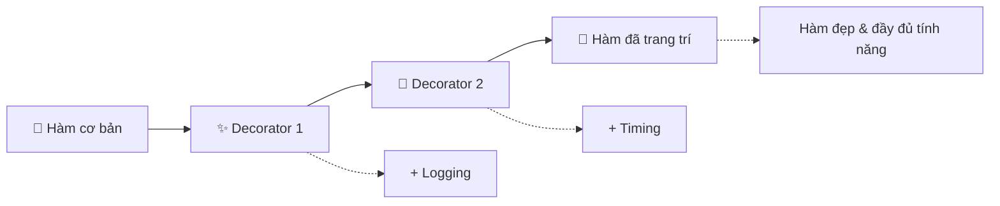

# ✨ Decorator - Trang Trí Hàm Số Như Phép Thuật

> **Mục tiêu**: Học cách sử dụng decorator để "trang trí" hàm với các tính năng bổ sung một cách elegant! 🎯

## 🤔 Decorator Là Gì? (Giải Thích Siêu Dễ)

**Decorator** giống như **trang trí cho món ăn**:

### 🍰 Hãy Tưởng Tượng...
- **Hàm gốc** = **Bánh kem cơ bản** 🍰
- **Decorator** = **Lớp kem trang trí, cherry, chocolate** 🍒🍫
- **Kết quả** = **Bánh kem đẹp và ngon hơn** ✨



### 🎯 Decorator Làm Gì?
- ✅ **Thêm tính năng** mà không sửa hàm gốc
- ✅ **Tái sử dụng code** - một decorator cho nhiều hàm
- ✅ **Clean code** - tách biệt logic chính và phụ
- ✅ **Flexible** - bật/tắt tính năng dễ dàng

## 📚 Decorator Cơ Bản

### 🎪 Decorator Đầu Tiên
```python
def my_decorator(func):
    """Decorator đơn giản nhất"""
    def wrapper():
        print("🎉 Trước khi chạy hàm")
        func()  # Gọi hàm gốc
        print("✅ Sau khi chạy hàm")
    
    return wrapper

# Cách 1: Sử dụng decorator thủ công
def say_hello():
    print("👋 Xin chào!")

# Trang trí hàm
decorated_hello = my_decorator(say_hello)
decorated_hello()

print("\n" + "-" * 40)

# Cách 2: Sử dụng @ syntax (Pythonic hơn)
@my_decorator
def say_goodbye():
    print("👋 Tạm biệt!")

say_goodbye()
```

### 🔧 Decorator Với Tham Số
```python
def smart_decorator(func):
    """Decorator thông minh hơn, xử lý được hàm có tham số"""
    def wrapper(*args, **kwargs):
        print(f"🚀 Chuẩn bị chạy hàm: {func.__name__}")
        print(f"📝 Tham số: args={args}, kwargs={kwargs}")
        
        # Chạy hàm gốc với tham số
        result = func(*args, **kwargs)
        
        print(f"✨ Kết quả: {result}")
        print(f"🏁 Hoàn thành hàm: {func.__name__}")
        
        return result
    
    return wrapper

@smart_decorator
def add_two_numbers(a, b):
    """Hàm cộng hai số"""
    return a + b

@smart_decorator
def greet_user(name, age=16):
    """Hàm chào hỏi"""
    return f"Xin chào {name}, bạn {age} tuổi!"

# Test decorator với tham số
print("🧮 TEST DECORATOR VỚI THAM SỐ:")
result_1 = add_two_numbers(5, 3)
print()

result_2 = greet_user("An", age=17)
print()
```

## ⏱️ Decorator Thực Tế: Timing & Logging

```python
import time
import functools
from datetime import datetime

def measure_time(func):
    """Decorator đo thời gian thực thi hàm"""
    @functools.wraps(func)  # Giữ nguyên metadata của hàm gốc
    def wrapper(*args, **kwargs):
        start_time = time.time()
        
        print(f"⏰ Bắt đầu thực thi: {func.__name__}")
        result = func(*args, **kwargs)
        
        end_time = time.time()
        execution_time = end_time - start_time
        
        print(f"⚡ {func.__name__} hoàn thành trong {execution_time:.4f} giây")
        
        return result
    
    return wrapper

def log_function_call(func):
    """Decorator ghi log mỗi lần gọi hàm"""
    @functools.wraps(func)
    def wrapper(*args, **kwargs):
        timestamp = datetime.now().strftime("%Y-%m-%d %H:%M:%S")
        
        # Ghi log trước khi gọi hàm
        print(f"📝 [{timestamp}] Gọi hàm: {func.__name__}")
        print(f"   Tham số: args={args}, kwargs={kwargs}")
        
        try:
            result = func(*args, **kwargs)
            print(f"✅ [{timestamp}] {func.__name__} thành công")
            return result
        except Exception as e:
            print(f"❌ [{timestamp}] {func.__name__} lỗi: {str(e)}")
            raise  # Re-raise exception
    
    return wrapper

# Sử dụng nhiều decorator cùng lúc
@measure_time
@log_function_call
def calculate_fibonacci(n):
    """Tính số Fibonacci thứ n (cách chậm để demo timing)"""
    if n <= 1:
        return n
    
    # Cách tính chậm để thấy rõ timing
    result = 0
    a, b = 0, 1
    for i in range(2, n + 1):
        result = a + b
        a, b = b, result
        time.sleep(0.01)  # Giả lập xử lý phức tạp
    
    return result

@measure_time
@log_function_call
def divide_two_numbers(a, b):
    """Hàm chia có thể gây lỗi"""
    if b == 0:
        raise ValueError("Không thể chia cho 0!")
    return a / b

# Test các decorator
print("🧪 TEST TIMING VÀ LOGGING DECORATOR:")
print("=" * 50)

# Test hàm bình thường
fibonacci_5 = calculate_fibonacci(5)
print(f"Fibonacci(5) = {fibonacci_5}")
print()

# Test hàm với lỗi
try:
    result = divide_two_numbers(10, 2)
    print(f"10 / 2 = {result}")
except Exception as e:
    print(f"Lỗi: {e}")

print()

try:
    result = divide_two_numbers(10, 0)  # Sẽ gây lỗi
except Exception as e:
    print(f"Lỗi đã được bắt: {e}")
```

## 🏭 Decorator Factory - Tạo Decorator Có Tham Số

```python
def retry(max_attempts=3, delay=1):
    """Decorator factory tạo decorator retry với tham số"""
    def decorator(func):
        @functools.wraps(func)
        def wrapper(*args, **kwargs):
            last_exception = None
            
            for attempt in range(max_attempts):
                try:
                    print(f"🔄 Lần thử {attempt + 1}/{max_attempts}: {func.__name__}")
                    result = func(*args, **kwargs)
                    
                    if attempt > 0:  # Nếu thành công sau khi retry
                        print(f"✅ Thành công sau {attempt + 1} lần thử!")
                    
                    return result
                
                except Exception as e:
                    last_exception = e
                    print(f"❌ Lần thử {attempt + 1} thất bại: {str(e)}")
                    
                    if attempt < max_attempts - 1:  # Không phải lần cuối
                        print(f"⏳ Chờ {delay} giây trước khi thử lại...")
                        time.sleep(delay)
            
            # Nếu tất cả lần thử đều thất bại
            print(f"💥 Thất bại hoàn toàn sau {max_attempts} lần thử!")
            raise last_exception
        
        return wrapper
    return decorator

def cache_result(func):
    """Decorator cache kết quả hàm để tăng hiệu suất"""
    cache = {}
    
    @functools.wraps(func)
    def wrapper(*args, **kwargs):
        # Tạo key từ tham số
        cache_key = str(args) + str(sorted(kwargs.items()))
        
        if cache_key in cache:
            print(f"🗄️ Lấy kết quả từ cache cho {func.__name__}")
            return cache[cache_key]
        
        print(f"🔄 Tính toán mới cho {func.__name__}")
        result = func(*args, **kwargs)
        
        # Lưu vào cache
        cache[cache_key] = result
        print(f"💾 Đã cache kết quả")
        
        return result
    
    return wrapper

# Sử dụng decorator factory
@retry(max_attempts=3, delay=2)
def unstable_api_call(success_rate=0.7):
    """Mô phỏng API call không ổn định"""
    import random
    
    if random.random() < success_rate:
        return "✅ API call thành công!"
    else:
        raise Exception("🚫 API call thất bại")

@cache_result
def expensive_calculation(n):
    """Mô phỏng tính toán phức tạp"""
    print(f"   🔢 Đang tính toán phức tạp với n={n}...")
    time.sleep(1)  # Giả lập tính toán lâu
    return n * n * n

# Test decorator factory
print("🏭 TEST DECORATOR FACTORY:")
print("=" * 50)

# Test retry decorator
try:
    result = unstable_api_call(success_rate=0.3)  # Tỷ lệ thành công thấp
    print(f"Kết quả: {result}")
except Exception as e:
    print(f"Cuối cùng vẫn thất bại: {e}")

print()

# Test cache decorator  
print("🧪 TEST CACHE DECORATOR:")
result1 = expensive_calculation(5)
print(f"Lần 1: {result1}")

result2 = expensive_calculation(5)  # Sẽ lấy từ cache
print(f"Lần 2: {result2}")

result3 = expensive_calculation(7)  # Tính toán mới
print(f"Lần 3: {result3}")
```

## 🎮 Decorator Thực Tế: Authentication & Authorization

```python
import functools
from enum import Enum

class UserRole(Enum):
    GUEST = "guest"
    USER = "user"
    ADMIN = "admin"
    SUPER_ADMIN = "super_admin"

class User:
    """Class mô phỏng user"""
    def __init__(self, username, role=UserRole.GUEST, is_authenticated=False):
        self.username = username
        self.role = role
        self.is_authenticated = is_authenticated

# Mô phỏng user hiện tại
current_user = User("guest", UserRole.GUEST, False)

def login_required(func):
    """Decorator yêu cầu user phải đăng nhập"""
    @functools.wraps(func)
    def wrapper(*args, **kwargs):
        if not current_user.is_authenticated:
            return "❌ Vui lòng đăng nhập để sử dụng chức năng này!"
        
        return func(*args, **kwargs)
    
    return wrapper

def role_required(required_role):
    """Decorator factory yêu cầu quyền hạn cụ thể"""
    role_hierarchy = {
        UserRole.GUEST: 0,
        UserRole.USER: 1, 
        UserRole.ADMIN: 2,
        UserRole.SUPER_ADMIN: 3
    }
    
    def decorator(func):
        @functools.wraps(func)
        def wrapper(*args, **kwargs):
            if not current_user.is_authenticated:
                return "❌ Vui lòng đăng nhập!"
            
            user_level = role_hierarchy.get(current_user.role, 0)
            required_level = role_hierarchy.get(required_role, 0)
            
            if user_level < required_level:
                return f"🚫 Không có quyền! Cần quyền {required_role.value} trở lên."
            
            return func(*args, **kwargs)
        
        return wrapper
    return decorator

def audit_log(action):
    """Decorator ghi log các hành động quan trọng"""
    def decorator(func):
        @functools.wraps(func)
        def wrapper(*args, **kwargs):
            timestamp = datetime.now().strftime("%Y-%m-%d %H:%M:%S")
            
            # Log trước khi thực hiện
            print(f"🔍 [{timestamp}] {current_user.username} đang thực hiện: {action}")
            
            try:
                result = func(*args, **kwargs)
                print(f"✅ [{timestamp}] {action} thành công")
                return result
            except Exception as e:
                print(f"❌ [{timestamp}] {action} thất bại: {str(e)}")
                raise
        
        return wrapper
    return decorator

# Các hàm với decorator bảo mật
@login_required
def view_profile():
    """Xem profile - cần đăng nhập"""
    return f"👤 Profile của {current_user.username} ({current_user.role.value})"

@login_required
@audit_log("Cập nhật thông tin cá nhân")
def update_profile(new_name):
    """Cập nhật profile - cần đăng nhập + audit"""
    return f"✅ Đã cập nhật tên thành: {new_name}"

@role_required(UserRole.ADMIN)
@audit_log("Xem danh sách user")
def view_all_users():
    """Xem tất cả user - cần quyền admin"""
    return "📋 Danh sách tất cả users: [user1, user2, admin1]"

@role_required(UserRole.SUPER_ADMIN)
@audit_log("Xóa user")
def delete_user(username):
    """Xóa user - cần quyền super admin"""
    return f"🗑️ Đã xóa user: {username}"

def demo_security_decorators():
    """Demo hệ thống decorator bảo mật"""
    global current_user
    
    print("🔐 === DEMO SECURITY DECORATORS ===")
    print()
    
    # Test với guest (chưa đăng nhập)
    print("👻 TEST VỚI GUEST (chưa đăng nhập):")
    print(view_profile())
    print(update_profile("New Name"))
    print(view_all_users())
    print()
    
    # Đăng nhập với user thường
    current_user = User("hocvien123", UserRole.USER, True)
    print(f"🔓 Đăng nhập với user: {current_user.username}")
    print(view_profile())
    print(update_profile("Nguyễn Văn An"))
    print(view_all_users())  # Không đủ quyền
    print()
    
    # Đăng nhập với admin
    current_user = User("admin", UserRole.ADMIN, True)
    print(f"👑 Đăng nhập với admin: {current_user.username}")
    print(view_profile())
    print(view_all_users())  # Đủ quyền admin
    print(delete_user("baduser"))  # Không đủ quyền super admin
    print()
    
    # Đăng nhập với super admin
    current_user = User("superadmin", UserRole.SUPER_ADMIN, True)
    print(f"⚡ Đăng nhập với super admin: {current_user.username}")
    print(view_all_users())
    print(delete_user("spammer"))  # Đủ quyền super admin

# Chạy demo
demo_security_decorators()
```

## 🏃‍♀️ Performance Decorator

```python
import time
import memory_profiler
import functools

def performance_monitor(func):
    """Decorator theo dõi hiệu suất (thời gian + memory)"""
    @functools.wraps(func)
    def wrapper(*args, **kwargs):
        # Đo memory trước
        mem_before = memory_profiler.memory_usage()[0]
        start_time = time.time()
        
        print(f"🚀 Bắt đầu {func.__name__}")
        print(f"   📊 Memory trước: {mem_before:.2f} MB")
        
        # Chạy hàm
        result = func(*args, **kwargs)
        
        # Đo kết quả
        end_time = time.time()
        mem_after = memory_profiler.memory_usage()[0]
        
        execution_time = end_time - start_time
        memory_used = mem_after - mem_before
        
        print(f"✅ {func.__name__} hoàn thành:")
        print(f"   ⏱️ Thời gian: {execution_time:.4f}s")
        print(f"   📊 Memory sau: {mem_after:.2f} MB")
        print(f"   📈 Memory sử dụng: {memory_used:.2f} MB")
        print(f"   💡 Hiệu suất: {'Good' if execution_time < 1 else 'Slow'}")
        
        return result
    
    return wrapper

def rate_limit(max_calls=5, time_window=60):
    """Decorator giới hạn số lần gọi hàm"""
    call_history = []
    
    def decorator(func):
        @functools.wraps(func)
        def wrapper(*args, **kwargs):
            current_time = time.time()
            
            # Xóa các call cũ ngoài time window
            call_history[:] = [call_time for call_time in call_history 
                              if current_time - call_time < time_window]
            
            # Kiểm tra rate limit
            if len(call_history) >= max_calls:
                remaining_time = time_window - (current_time - call_history[0])
                return f"🚫 Rate limit exceeded! Thử lại sau {remaining_time:.1f} giây"
            
            # Ghi nhận call mới
            call_history.append(current_time)
            
            print(f"✅ Call {len(call_history)}/{max_calls} trong {time_window}s qua")
            return func(*args, **kwargs)
        
        return wrapper
    return decorator

# Sử dụng performance decorator
@performance_monitor
def create_large_list(size=100000):
    """Tạo list lớn để test memory"""
    return list(range(size))

@performance_monitor 
def sort_large_list(data):
    """Sort list lớn để test CPU"""
    return sorted(data)

@rate_limit(max_calls=3, time_window=10)
def api_call(endpoint):
    """Mô phỏng API call có rate limit"""
    return f"📡 Called API: {endpoint}"

def demo_performance_decorators():
    """Demo performance decorators"""
    print("⚡ === DEMO PERFORMANCE DECORATORS ===")
    print()
    
    # Test memory & timing
    print("🔬 TEST PERFORMANCE MONITOR:")
    data = create_large_list(50000)
    sorted_data = sort_large_list(data[:1000])  # Sort subset để nhanh hơn
    print()
    
    # Test rate limiting
    print("🚦 TEST RATE LIMITING:")
    for i in range(5):
        result = api_call(f"/api/v1/data/{i}")
        print(f"   {result}")
        time.sleep(0.5)  # Delay nhỏ
    
    print("\nThử call thêm (sẽ bị giới hạn):")
    result = api_call("/api/v1/extra")
    print(f"   {result}")

# Chạy demo (cần cài memory_profiler: pip install memory-profiler)
try:
    demo_performance_decorators()
except ImportError:
    print("⚠️ Cần cài memory-profiler: pip install memory-profiler")
```

## 💡 Mẹo Hay Ho với Decorator

### 🎯 1. **Class-based Decorator**
```python
class CountCalls:
    """Decorator dạng class để đếm số lần gọi hàm"""
    
    def __init__(self, func):
        self.func = func
        self.call_count = 0
        functools.update_wrapper(self, func)
    
    def __call__(self, *args, **kwargs):
        self.call_count += 1
        print(f"🔢 Lần gọi thứ {self.call_count}: {self.func.__name__}")
        return self.func(*args, **kwargs)
    
    def get_call_count(self):
        return self.call_count

@CountCalls
def say_hi(name):
    return f"Hi {name}!"

# Sử dụng
print(say_hi("An"))
print(say_hi("Bình")) 
print(f"Tổng số lần gọi: {say_hi.get_call_count()}")
```

### 🎯 2. **Decorator với Context Manager**
```python
import contextlib
from functools import wraps

def with_database_transaction(func):
    """Decorator mô phỏng database transaction"""
    @wraps(func)
    def wrapper(*args, **kwargs):
        print("📊 BEGIN TRANSACTION")
        try:
            result = func(*args, **kwargs)
            print("✅ COMMIT TRANSACTION")
            return result
        except Exception as e:
            print("❌ ROLLBACK TRANSACTION")
            raise
    return wrapper

@with_database_transaction
def update_user_data(user_id, new_data):
    """Mô phỏng cập nhật dữ liệu user"""
    print(f"   🔄 Updating user {user_id} with {new_data}")
    
    # Mô phỏng lỗi database
    if user_id == "error":
        raise Exception("Database error!")
    
    return "Data updated successfully"

# Test
try:
    result = update_user_data("user123", {"name": "New Name"})
    print(f"Result: {result}")
except Exception as e:
    print(f"Error caught: {e}")
```

### 🎯 3. **Chaining Decorators Thông Minh**
```python
def make_bold(func):
    """Decorator làm đậm text"""
    @wraps(func)
    def wrapper(*args, **kwargs):
        result = func(*args, **kwargs)
        return f"**{result}**"
    return wrapper

def make_italic(func):
    """Decorator làm nghiêng text"""
    @wraps(func)
    def wrapper(*args, **kwargs):
        result = func(*args, **kwargs)
        return f"_{result}_"
    return wrapper

def add_emoji(emoji="✨"):
    """Decorator factory thêm emoji"""
    def decorator(func):
        @wraps(func)
        def wrapper(*args, **kwargs):
            result = func(*args, **kwargs)
            return f"{emoji} {result} {emoji}"
        return wrapper
    return decorator

# Chaining decorators
@add_emoji("🎉")
@make_bold
@make_italic
def get_message(name):
    return f"Hello {name}!"

print(get_message("Behitek"))
# Output: 🎉 **_Hello Behitek!_** 🎉
```

## 🎮 Bài Tập Thực Hành

### 🏆 Bài 1: Web API Decorator Suite
Tạo bộ decorator cho web API:
- `@validate_json` - Kiểm tra JSON input
- `@require_api_key` - Yêu cầu API key
- `@handle_exceptions` - Xử lý lỗi elegant

### 🏆 Bài 2: Caching System
Tạo hệ thống cache thông minh:
- `@cache_with_ttl(seconds)` - Cache có thời hạn
- `@cache_by_user` - Cache riêng cho từng user
- `@invalidate_cache` - Xóa cache khi cần

### 🏆 Bài 3: Testing Decorators
Tạo decorator cho unit testing:
- `@test_performance` - Đo performance test
- `@mock_database` - Mock database calls
- `@repeat_test(n)` - Chạy test nhiều lần

## 🔗 Kiến Thức Liên Quan

- **[Functions Advanced](../intermediate/functions-parameters.md)** - Nền tảng về hàm
- **[Error Handling](../intermediate/error-handling.md)** - Xử lý lỗi trong decorator
- **[Classes and Objects](./classes-and-objects.md)** - Class-based decorators

---

*🎉 **Chúc mừng!** Bạn đã thành thạo Decorators - một trong những tính năng elegant nhất của Python! Giờ bạn có thể "trang trí" code như một nghệ sĩ! ✨*
